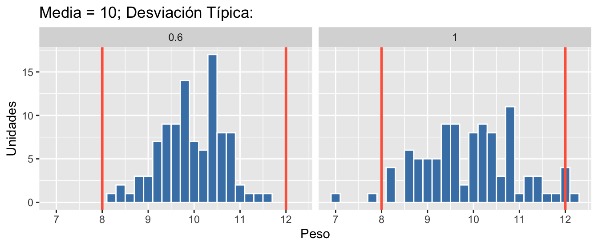

# (PART) Estadística descriptiva {-}


# Introducción {#intro}

```{r, include=FALSE}
library(fontawesome)
```


## Estadística y análisis de datos

### ¿Qué es la Estadística?

Antes de introducirnos en el estudio de la Estadística y sus métodos, vamos a
intentar tener una visión de todo lo que abarca. Así pues, ¿qué es la Estadística?
La primera fuente que podemos consultar es la definición de la Real Academia Española,
y encontramos estas acepciones:

>**estadístico, ca**  
>_La forma f., del al. Statistik, y este der. del it. statista 'hombre de Estado'._
>
>1. adj. Perteneciente o relativo a la estadística.
>2. m. y f. Especialista en estadística.
>
>3. f. **Estudio de los datos** cuantitativos de la población, de los recursos naturales e industriales, del tráfico o de cualquier otra manifestación de las sociedades humanas.
>4. f. Conjunto de **datos** estadísticos.
>5. f. Rama de la matemática que utiliza grandes conjuntos de datos numéricos para obtener **inferencias** basadas en el **cálculo de probabilidades**.
>
> RAE

Las acepciones que nos interesan son sobre todo la tercera y la cuarta, en las 
que aparecen conceptos
que veremos en este capítulo introductorio y en los que profundizaremos en el resto
del libro. La tercera acepción, "Conjunto de **datos** estadísticos", es lo que muchas
personas entienden cuando oyen la palabra Estadística: La estadística del paro,
la estadística de los precios, etc. Pero la Estadística es mucho más amplia.
En primer lugar, esos "datos estadísticos" han tenido que ser recopilados y
tratados de alguna forma antes de llegar a su publicación. Además, los datos
estadísticos así entendidos son el resultado de un estudio pormenorizado
(acepción 3) y normalmente de la aplicación de técnicas de **inferencia**
(acepción 5). Algunas de estas técnicas forma parte de lo que vulgarmente
se conoce como "la cocina" de las estadísticas. 

Podemos hablar entonces de la Estadística, de forma muy resumida,
como la ciencia de analizar datos. Encontramos a menudo^[Por ejemplo en el [Curso de Estadística Práctica Aplicada a la Calidad](https://www.aec.es/formacion/catalogo-cursos/estadistica-practica-aplicada-la-calidad/) de la AEC.] una definición
de la Estadística como "la ciencia que establece los métodos necesarios para la recolección, organización, presentación y análisis de datos relativos a 
un conjunto de elementos o individuos". Pero esta definición se centra solo
en los métodos. Una definición más completa sería la siguiente:

> [...] la estadística es la parte de la matemática que estudia la **variabilidad** y el proceso aleatorio que la genera siguiendo leyes de **probabilidad**. 
>
> Esta variabilidad puede ser debida al azar, o bien estar producida por causas ajenas a él, correspondiendo al **razonamiento estadístico** diferenciar entre la variabilidad casual y la variabilidad causal.
>
>@oca 


Aquí vemos uno de los conceptos clave que guiará todo el estudio y aplicación de 
la Estadística: la variabilidad es la clave de todo. Entender el concepto de
variabilidad ayudará enormemente a entender los métodos por complejos que sean.

> Variation is the reason for being of statistics
>
> @cano2012sixsigma

La Estadística ha sido siempre importante en los estudios de Ciencias e 
Ingeniería. No obstante, en los últimos tiempos la alta disponibilidad
tanto de datos como de tecnología para tratarlos, hace imprescindible
un dominio de las técnicas estadísticas y su aplicación en el dominio
específico.

### Los dos grandes bloques de la Estadística

La Estadística se divide en dos grandes bloques de estudio, que son 
la **Estadística Descriptiva** y la **Inferencia Estadística**. A la
Estadística Descriptiva también se la conoce como *Análisis Exploratorio de Datos*
(EDA, _Exploratory Data Analysis_, por sus siglas en inglés).
Esta disciplina tuvo un gran desarrollo gracias al trabajo de Tukey [@tukey1977exploratory],
que todavía hoy es una referencia. Pero en los últimos años ha cobrado si cabe
más importancia por la alta disponibilidad de datos y la necesidad de analizarlos.

La **Estadística Descriptiva** se aplica sobre un conjunto de datos concretos,
del que obtenemos resúmenes numéricos y visualización de datos a través de
los gráficos apropiados. Con la Estadística Descriptiva se identifican **relaciones**
y **patrones**, guiando el trabajo posterior de la Inferencia Estadística.

La **Estadística Inferencial** utiliza los datos y su análisis anterior para, a través de las
Leyes de la **Probabilidad**, obtener conclusiones de diverso tipo, como explicación de fenómenos,
confirmación de relaciones de causa-efecto, realizar predicciones o comparar grupos.
En definitiva, tomar decisiones por medio de modelos estadísticos y basadas en
los datos.


### La esencia de la Estadística

La figura \@ref(fig:dogma1) representa
la esencia de la Estadística y sus métodos. Estudiamos alguna **característica** 
observable en una serie de **elementos** (sujetos, individuos, ...)
identificables y únicos. Los datos que analizamos,
provienen de una determinada **población** que es objeto de estudio. 
Pero estos datos, no son más que
una **muestra**, es decir, un subconjunto representativo de la población. Incluso
cuando "creemos" que tenemos todos los datos, debemos tener presente que trabajamos
con muestras, ya que generalmente tomaremos decisiones o llegaremos a conclusiones
sobre el futuro, y esos datos seguro que no los tenemos. Por eso es importante
considerar siempre este paradigma población-muestra, donde la
población es desconocida y sus propiedades teóricas. La **Estadística Descriptiva**
se ocupa del análisis exploratorio de datos en sentido amplio, que aplicaremos
sobre los datos concretos de la muestra en este unidad y la siguiente. La
**Inferencia Estadística** hace referencia a los métodos mediante los cuales,
a través de los datos de la muestra, tomaremos decisiones, explicaremos relaciones,
o haremos predicciones sobre la población. Para ello, haremos uso de la 
**Probabilidad**, que veremos más adelante, aplicando
el método más adecuado. 
En estos métodos será muy importante considerar el método de obtención de la muestra
que, en términos generales, debe ser representativa de la población para que las
conclusiones sean válidas.


```{r dogma1, fig.cap="La esencia de los métodos estadísticos", echo=FALSE, purl=FALSE, fig.width=6, fig.asp=0.6, fig.align='center', out.width="100%"} 
knitr::include_graphics("images/dogma1.png")
```

::: {.rmdejemplo data-latex=""}

`r fa("bacterium", fill = "purple")` En un ensayo clínico, se eligen una serie de participantes en el estudio a los
que se le suministran distintos tratamientos según el diseño del ensayo. 
Los participantes en el estudio son sujetos que constituyen la **muestra**.
A través de los resultados de esta muestra, obtendremos conclusiones
para toda la **población**, que estará definida en el propio ensayo clínico.
Por ejemplo, en el estudio del efecto de un determinado tratamiento para la
diabetes, la población serían todos los enfermos de diabetes.

:::


Otro concepto clave inherente a la Estadística, es que casi siempre estaremos
investigando sobre esta fórmula:

$$Y=f(X)$$

Es decir, buscamos encontrar la relación entre una variable respuesta $Y$ y una o varias
variables explicativas $X$. Casi toda la Ciencia de Datos consiste en encontrar esa $f$.
Es fundamental interiorizar este concepto para después aplicar el método adecuado,
ya que según sean la/s $Y$, la/s $X$ y el objetivo de nuestro estudio, los caminos
pueden ser muy diferentes. 

El origen del término _Data Science_ se suele atribuir a Bill Cleveland tras la publicación de su artículo "Data Science: An Action Plan for Expanding the Technical Areas of the Field of Statistics" en 2001 [@Cleveland2001]^[En el seno de los laboratorios Bell, como muchos otros avances de la Ciencia Estadística (por ejemplo SPC, _Statistical Process Control_, o S, el precursor del software estadístico y lenguaje de programación R.)], aunque lo anticipó Tukey 40 años antes en "The Future of Data Analysis" [@Tukey1962] . No obstante, es a partir del año 2010, con la irrupción del _Big Data_ y la necesidad de analizar grandes cantidades de datos, cuando se empieza a popularizar el término intentando dar una definición gráfica de la profesión (_Data Scientist_). Así, es muy común presentar la ciencia de datos como la intersección de los conocimientos informáticos, los conocimientos estadístico-matemáticos, y el conocimiento de la materia en estudio (negocio, campo científico, etc.). Así, la persona de ciencias o ingeniería, con evidentes conocimientos en su campo, que adquiera conocimientos de Estadística y sea capaz de utilizar software avanzado como R, es uno de los perfiles más demandados.

Paralelamente a la Ciencia de Datos, aparecen términos más recientes como _Big Data_, _Internet of Things_ o Industria 4.0. Detrás de todos ellos, está el análisis estadístico. Y la mayoría de las veces es suficiente aplicar los métodos más básicos para solucionar los problemas o demostrar las hipótesis.

## Los datos y su organización

### Características y variables

Las **características** que observamos en los **elementos** de la muestra
(o que estudiamos en una población) pueden ser distintos tipos. Nos referiremos
genéricamente a estas características como **variables**, aunque en en algunos
ámbitos como el Control Estadístico de Procesos (SPC, _Statistical Process Control_
por sus siglas en inglés) este término se refiere solo a las variables continuas
que ahora definiremos.

Denotaremos las variables con letras mayúsculas del alfabeto latino ($X$, $Y$, $A$, ...).
Cuando observamos la característica, la variable toma un **valor**. Estos valores
pueden ser agrupados en **clases**, de forma que cada posible valor
pertenezca a una y solo una clase. En ocasiones los datos con los que trabajamos
están ya clasificados en clases. Las variables pueden tomar cualquier valor en su **dominio**, es decir, el conjunto de **posibles** valores que puede tomar la variable. Veremos más adelante cómo cuantificar esas posibilidades a través de la Probabilidad.

::: {.rmdejemplo data-latex=""}

Cuando se recogen datos utilizando cuestionarios, a menudo en las preguntas
para recoger características cuantitativas se ofrece elegir un intervalo en vez
de peguntar el **valor** exacto. Por ejemplo, al preguntar la edad de una
persona, se pueden dar las opciones: 1) menos de 20 años; 2) entre 20 y 40 años;
3) entre 40 y 60 años; 4) Más de 60 años. Así, si una persona tiene 30 años, el **valor**
de la variable es 30 (en el caso de la encuesta no lo conoceremos exactamente)
que pertenece a la **clase** "entre 20 y 40 años".

:::

### Parámetros y estadísticos 

Distinguiremos la caracterización de las variables que estudiamos en la población de las observadas en la muestra denotándolas por **parámetros** y **estadísticos** respectivamente. Los parámetros son valores teóricos, casi siempre desconocidos, sobre los que haremos inferencia. Los denotaremos por letras griegas minúsculas, como por ejemplo $\mu$ para la media poblacional.
Un estadístico es una función definida sobre los datos de una **muestra**. Pueden ser valores de más de una variable, y los resumiremos en un único valor, resultado de aplicar esa función. Los estadísticos tomarán valores distintos dependiendo de la muestra concreta. Esto hace que sean a su vez variables, y
que tengan una distribución en el muestreo que nos permitirá hacer inferencia sobre la población. Los denotaremos con letras latinas, como por ejemplo $\bar x$ para la media muestra.


La figura \@ref(fig:dogma2) representa la esencia de la estadística relacionando parámetros y estadísticos. Además de la equivalencia entre parámetros y estadísticos, la distribución de frecuencias de los datos de la muestra representada en el histograma se corresponde con la distribución de probabilidad teórica de la población.

```{r dogma2, fig.cap="La esencia de los métodos estadísticos", echo=FALSE, purl=FALSE, fig.width=6, fig.asp=0.6, fig.align='center', out.width="100%"} 
knitr::include_graphics("images/dogma2.png")
```

### La inferencia y sus métodos

Existen dos grandes grupos de métodos para hacer la inferencia sobre la población. La **estadística paramétrica** asume que la característica sigue una
determinada distribución de probabilidad. Esta distribución de probabilidad depende de unos **parámetros** (por ejemplo, la media
y la desviación típica). La inferencia se hace en base a esos parámetros, y se asumen ciertas hipótesis de partida que se deben comprobar.
La **estadística no paramétrica** no asume ninguna distribución de probabilidad para la 
característica. Los métodos se basan en estadísticos de orden (cuantiles) y no hace falta cumplir ninguna hipótesis.

Por otra parte, se pueden seguir dos enfoques bien diferenciados a la hora de hacer inferencia. Por una parte, el **enfoque frecuentista** asume que los parámetros son valores fijos desconocidos, de los que estimamos
su valor. Esta estimación está ligada a una incertidumbre (error) derivada
del muestreo. Por otra parte, en el **enfoque bayesiano** los parámetros no son valores fijos desconocidos, sino variables aleatorias de las que se estima su distribución de probabilidad. Y a partir de esa distribución de probabilidad, se hace la inferencia. En este libro no se tratarán los métodos bayesianos.

### Organización de los datos {#orgdatos}

Hemos hablado de características de forma aislada. Pero normalmente no estudiamos una sola característica de la población, sino que observamos varias características, teniendo así en la muestra
un **conjunto de variables** relativas a una serie de elementos. Cuando analizamos una única variable, aislada del resto, estaremos 
haciendo análisis **univariante**. Cuando analizamos más de una variable, estaremos haciendo **análisis multivariante**. Casi siempre un estudio estadístico incluye análisis univariante y
multivariante.

Para poder analizar los datos de forma eficiente, debemos organizarlos siguiendo los principios _Tidy data_. Así, dispondremos los datos en forma de tablas (datos rectangualares), donde tengamos una columna para cada variable (mismo tipo de datos) y una fila para cada observación (elemento, individuo).
El analista y software deben entender lo mismo, lo que podríamos decir que es preparar los datos para las máquinas y no para los humanos. Esta sería la "capa de datos", después puede haber una "capa de presentación", independiente de la anterior. Aquí puede jugar un papel importante los metadatos: diccionarios de datos para consultar sobre las variables (unidades, descripciones, etc.)

::: {.rmdejemplo data-latex=""}
La tabla \@ref(tab:rectangular) muestra las primeras filas de una tabla de datos bien organizada. Cada fila representa un solo elemento, cada columna una sola variable, sin mezclar datos. Los nombres de las variables son cortos pero informativos.
:::

```{r rectangular, echo = FALSE}
merma <- read.csv2("_data/ejDatos.csv")
knitr::kable(head(merma), caption = "Tabla rectangular bien organizada")
```

### Tipos de datos y escalas

Las características que observamos pueden ser de distintos tipos. La correcta identificación del tipo de variable es crucial para hacer un correcto análisis, ya que los métodos pueden ser muy distintos. 

La primera diferenciación que haremos será entre variables **cuantitativas** y cualitativas. Las variables cuantitativas o numéricas se pueden expresar con un número que además tiene una escala métrica (se pueden medir diferencias entre individuos). A su vez, pueden ser **continuas** o **discretas**. Las variables continuas pueden tomar cualquier valor en un intervalo (teóricamente infinitos valores). Las variables discretas pueden tomar un número de valores finito o infinito numerable, pero no toma valores entre un valor y otro.

Las variables **cualitativas** o categóricas son etiquetas sin sentido numérico en las que podemos clasificar a los elementos. Si el número de posibles etiquetas son dos, estaremos ante variables dicotómicas, que en algunos casos podremos codificar como ceros y unos si presenta o no presenta la característica principal. Las variables multinivel presentan más de dos posibles etiquetas. En ambos casos se trata de una escala nominal. Las variables ordinales son aquellas en las que las etiquetas se pueden ordenar, de forma que tenemos una escala ordinal.

Además de las variables propiamente dichas, nuestro conjunto de datos puede tener otras características como marcas de tiempo e identificadores, que serán útiles para aplicar los métodos, pero no serán objeto de análisis.

En ocasiones es útil transformar las variables de un tipo a otro. Por ejemplo:

* Fechas a categóricas (etiqueta de mes, día de la semana, ...)
* Cuantitativas a cualitativas (clases, intervalos)
* Ordinales como numéricas: con precaución, sobre todo si hay pocos datos (<100). Se pueden combinar en índices.
* Variables calculadas con otras (por ejemplo, IMC)

En los siguientes capítulos abordaremos el análisis de todos estos datos.


## La Estadística y el método científico

La estadística es un pilar fundamental del método científico. El método científico se aplica también en el desarrollo tecnológico. Por tanto, la correcta aplicación de los métodos estadísticos es imprescindible para el avance de la ciencia y la técnica. 

### El método científico

El método científico se puede resumir en los siguientes pasos:

1. Hacerse una pregunta

2. Realizar investigación de base

3. Plantear una hipótesis

4. Comprobar la hipótesis con experimentos

5. Analizar resultados y extraer conclusiones

6. Comunicar resultados

La pregunta que nos hacemos (1) depende del campo de aplicación, y aquí todavía no aparece la Estadística (a menos que sea una investigación sobre los propios métodos estadísticos). Durante la investigación de base (2), realizamos **análisis exploratorio de datos** e identificamos **relaciones**. Posiblemente, esta primera investigación nos hace cambiar la pregunta del primer paso. Plantear una hipótesis (3) significa formalizarla en términos de Hipóteis nula, $H_0$, e hipótesis alternativa, $H_1$, que se comprobarán con los **datos** empíricamente. El planteamiento de la hipótesis determina
el **método estadístico** a utilizar, y el diseño
del experimento (en sentido amplio). Para comprobar la hipótesis con experimentos (4) es fundamental un diseño adecuado para que los
resultados sean válidos, así como la 
correcta **organización de los datos** recogidos según los
protocolos establecidos. Estos protocolos incluyen conceptos estadísticos como **aleatorización** y bloqueo, entre otros. Analizar resultados (5a) no se puede hacer sino con técnicas estadísticas, y estos resultados deben contarle al experto la historia con suficiente evidencia para extraer conclusiones (5b). Intervienen aquí el análisis exploratorio, los contrastes de hipótesis y la validación de los modelos. Por último, podemos aprovechar las herramientas estadísticas modernas para comunicar resultados (6), por ejemplo mediante **Informes reproducibles** RMarkdown, Gráficos efectivos y resultados clave. Los resultados negativos (cuando no conseguimos demostrar lo que buscábamos en la hipótesis) es un aspecto a considerar también, para utilizar como lecciones aprendidas y conocimiento general.

### Investigación reproducible

Los informes reproducibles mencionados en el párrafo anterior hacen referencia al enfoque de **Investigación reproducible** en el cual se puedan reproducir los resultados, bien los mismos investigadores en otro momento, o terceras partes interesadas para verificar la validez de los resultados. Para esto es necesario utilizar software estadístico basado en _scripts_ en los que se pueda consultar toda la lógica del análisis (frente a software de "ventanas" donde se pierde la trazabilidad). Este código se puede mezclar con la propia narrativa del informe (antecedentes, interpretación, conclusiones, etc.) de forma que, dados los mismos datos, se obtenga el mismo informe. Incluso, dados otros datos, se podría replicar el estudio de forma instantánea. El enfoque "copy-paste" alternativo, en el que vamos añadiendo a un informe los resultados en un momento dado, son fuente de inconsistencias, errores, desactualización y falta de reproducibilidad, y en los que cualquier cambio requiere mucho esfuerzo.

## Estadística, Calidad y Sostenibilidad

La es una herramienta fundamental en muchos procedimientos
relacionados con la Calidad, y es por eso que se habla de 
Control Estadístico de la Calidad.


### Calidad y variabilidad

Todos tenemos nuestra percepción de la calidad. Pero veamos primero la definición estandarizad de calidad que tenemos en la norma ISO 9001.

> **Calidad:** Grado en el que un conjunto de **características** inherentes de un objeto
> cumple con los **requisitos**
>
> ISO 9001:2015 3.6.2

Los requisitos son **especificaciones** de la característica, que pueden ser bilaterales o unilaterales.

En la figura \@ref(fig:histos) vemos dos distribuciones de datos del tipo que vamos a
ver en el libro^[Los gráficos son **histogramas**, que también describiremos después.]. Los dos conjuntos de datos correspondientes a la medición
de la variable peso tienen **la misma media**: 10 g.
Sin embargo, la de la izquierda tiene una **desviación típica** (medida de la variabilidad) igual a
0.6 g, menor que la de la derecha que es 1 g. Si las líneas rojas son nuestros
**límites de especificación**, podemos ver cómo en el proceso de la derecha algunos de los
elementos de nuestro proceso no satisfacen los requisitos. En este ejemplo se ve
claramente cómo reducir la variabilidad mejora la calidad ¡sin hacer nada
más! (ni nada menos). 

```{r histos, echo=FALSE, fig.cap="Procesos con la misma media y distinta variabilidad"}

```

En general,
las CTQs (_Critical to Quality_ características críticas para la calidad) tendrán un valor objetivo (_target_, $T$), o valor nominal, que es el ideal.
Ante la imposibilidad de tener procesos exactos, se fijan unos límites de especificación
o límites de tolerancia dentro de los cuales el producto o servicio es conforme,
mientras que es no conforme cuando el valor de la CTQ está fuera de dichos límites.
Se utilizan los símbolos $L$ y $U$ para designar los límites de control
inferior y superior respectivamente.

> La Calidad se mide como la pérdida total que un producto causa a la sociedad
>
> Genichi Taguchi

Debemos considerar que la falta de calidad no
produce pérdidas sólo cuando el producto no cumple con las especificaciones, sino que,
a medida que nos alejamos del valor objetivo, esa pérdida aumenta, y además no lo
hace de manera lineal, es decir, proporcional, sino que es mayor cuanto más nos
alejamos del objetivo. Es lo que se conoce como la **función de pérdida de Taguchi**
(_Taguchi's Loss Function_).
Taguchi consideraba la calidad como la consecución de un objetivo de
calidad, no como una tolerancia, y la falta de calidad como una pérdida
para la sociedad. El producto _perfecto_ no produce pérdidas (_loss_), mientras que
cualquier desviación del objetivo produce una pérdida para la sociedad, que aumenta
a medida que esa desviación es mayor [@taguchi2007]. La figura \@ref(fig:taguchi)
representa este coste para la sociedad (línea azul discontinua), que se produce
siempre que no se consigue el objetivo, frente al coste _contable_ (línea punteada gris),
que solo se produce con las no conformidades. El análisis de la función de 
pérdida es una herramienta muy útil en proyectos de mejora, véase @cano2012sixsigma. 

```{r taguchi, echo=FALSE, fig.width=8, fig.asp=0.6, fig.align='center', fig.cap="Función de pérdida de Taguchi", out.width="70%"}
# par(bg="white")
curve(2*x^2, -10, 10, axes = FALSE, 
      lty = 2, lwd = 3, col = "steelblue",
      ylim = c(0, 200),
      xlim = c(-10, 35),
      ylab="Coste de la falta de calidad",
      xlab="Valor observado de la característica")
axis(side = 1, pos = 0, labels = FALSE)
axis(side = 2, pos = -10, labels = FALSE)
# abline(v = -8, col = "tomato", lwd = 2)
lines(-8, 190, type = "h", col = "tomato", lwd = 2)
lines(8, 190, type = "h", col = "tomato", lwd = 2)
lines(0, 190, type = "h", col = "seagreen", lwd = 2)
# abline(h = 0)
text(0.5, 180, "T")
text(-7.5, 180, "L")
text(7.5, 180, "U")
lines(c(-11,-8.1),c(128,128), lty=3, lwd=3, col=gray(0.4))
lines(c(-8.1,-8.1),c(128,0.3), lty=3, lwd=3, col=gray(0.4))
lines(c(-8.1,8.1),c(0.3,0.3), lty=3, lwd=3, col=gray(0.4))
lines(c(8.1,8.1), c(0.3, 128), lty=3, lwd=3, col=gray(0.4))
lines(c(8.1,11), c(128,128), lty=3, lwd=3, col=gray(0.4))
legend(12, 200, c("Coste para la sociedad", expression("Coste "*italic(contable)), 
                  "Objetivo", "Especificación"), 
       col = c("steelblue", gray(0.4), "seagreen", "tomato"), 
       lty = c(2, 3, 1, 1), lwd = c(3, 3, 2, 2))
box("outer",lwd=2)
```


### Métodos estadísticos para la calidad

Existen métodos estadísticos específicos para el control y 
mejora de la calidad. Las dos principales herramientas del 
Control Estadístico de Procesos (SPC, _Statistical Process Control_)
son los **gráficos de control** y el **análisis de la capacidad del proceso**.
La figura \@ref(fig:spc) muestra un ejemplo de ambas. El gráfico de control de la parte superior sirve para monitorizar las muestras (subgrupos de los que se calcula un estadístico) con el objetivo de detectar el cambio con respecto a su situación de control estadístico. Así, los límites son "la voz del proceso". La parte inferior representa "la voz de cliente", comparando las especificaciones con la variabilidad del proceso, y calculando los índices de capacidad que son la medida real de calidad a largo plazo (frente a la mera contabilización de las unidades defectuosas y su cuantificación monetaria). Estas técnicas se combinan con otras tanto exploratorias como de inferencia para controlar y mejorar la calidad.

```{r spc, echo=FALSE, fig.cap="Gráficos de control y capacidad del proceso"}

```

Otra técnica de calidad en la que la Estadística juega un papel fundamental es la **inspección por muestreo**, también conocida como muestreos de aceptación. La aceptación de unidades o lotes de producto, se puede hacer con inspección completa, comprobando si los productos están dentro de los límites de especificación. Esto a veces es muy caro o directamente imposible, por lo que se recurre al muestreo. El análisis se puede hacer por atributos (variables cualitativas y por variables (variables cuantitativas). La base de esto métodos reside en la probabilidad de aceptar/rechazar un lote defectuoso/correcto, desde el punto de vista del consumidor/productor. Existen una gran variedad de planes de muestreo específicos, como planes simples, planes dobles y múltiples o planes secuenciales. Muchos están descritos en las normas clásicas MIL-STD, que evolucionaron a las series de normas ISO 2859 e ISO 3951.

En los llamados ensayos inter-laboratorios también se aplican técnicas estadísticas como el análisis del sistema de medición (MSA, _Measurement Systems Analysis_), estudios de precisión y exactitud, estudios R&R (_Reproducibility & Repeatibility_), o validación de laboratorios. En la mayoría de los casos lo que se utiliza es Diseño y Análisis de Experimentos.


### Metodologías y estándares

Las normas sobre métodos estadísticos que elabora ISO emanan del comité ISO TC69, del que hay un subcomité "espejo" en UNE (entidad acreditada de normalización en España), el subcomité UNE CT66/SC3. La propia ISO 9000 
hace mención a los métodos estadísticos, y existe un informe técnico, UNE-ISO TR 1017 sobre "Orientación sobre las técnicas estadísticas para la Norma ISO 9001:2020". Algunas universidades disponen del catálogo de normas UNE en sus bases de datos para el acceso de docentes y estudiantes.

La metodología Seis Sigma y el ciclo DMAIC aplican el método científico a la mejora de la calidad, utilizando el lenguaje de las empresas. Lean Six Sigma es una evolución en la que se añade a Seis Sigma los principios de _Lean Manufacturing_.

## Objetivos de Desarrollo Sostenible (ODS)

> El 25 de septiembre de 2015, los líderes mundiales adoptaron un conjunto de **objetivos globales** para erradicar la pobreza, proteger el planeta y asegurar la prosperidad para todos como parte de una nueva agenda de desarrollo sostenible. Cada objetivo tiene **metas específicas** que deben alcanzarse en los próximos 15 años.
>
> [Naciones Unidas](https://www.un.org/sustainabledevelopment/es/objetivos-de-desarrollo-sostenible/)

### Los 17 ODS

Esta iniciativa de la ONU (_Sustainable Development Goals_, SDG) plantea 17 objetivos generales, que se detallan en 169 metas concretas. Estos objetivos van más allá del medio ambiente, que probablemente es lo primero que nos viene a la cabeza^[(https://www.un.org/sustainabledevelopment/es/objetivos-de-desarrollo-sostenible/]. Los 17 objetivos son los siguientes, y se esquematizan en la figura \@ref(fig:ods). 

1. **Fin de la pobreza** - Poner fin a la pobreza en todas sus formas en todo el mundo
2. **Hambre cero**- Poner fin al hambre, lograr la seguridad alimentaria y la mejora de la nutrición y promover la agricultura sostenible
3. **Salud y bienestar**- Garantizar una vida sana y promover el bienestar para todos en todas las edades
4. **Educación de calidad**- Garantizar una educación inclusiva, equitativa y de calidad y promover oportunidades de aprendizaje durante toda la vida para todos
5. **Igualdad de género**- Lograr la igualdad entre los géneros y empoderar a todas las mujeres y las niñas
6. *Agua limpia y saneamiento**- Garantizar la disponibilidad de agua y su gestión sostenible y el saneamiento para todos
7. **Energía asequible y no contaminante**- Garantizar el acceso a una energía asequible, segura, sostenible y moderna para todos
8. **Trabajo decente y crecimiento económico**- Promover el crecimiento económico sostenido, inclusivo y sostenible, el empleo pleno y productivo y el trabajo decente para todos
9. **Industria, innovación e infraestructura**- Construir infraestructuras resilientes, promover la industrialización inclusiva y sostenible y fomentar la innovación
10. **Reducción de las desigualdades**- Reducir la desigualdad en y entre los países
11. **Ciudades y comunidades sostenibles**- Lograr que las ciudades y los asentamientos humanos sean inclusivos, seguros, resilientes y sostenibles
12. **Producción y consumo responsables**- Garantizar modalidades de consumo y producción sostenibles
13. **Acción por el clima**- Adoptar medidas urgentes para combatir el cambio climático y sus efectos
14. **Vida submarina**- Conservar y utilizar en forma sostenible los océanos, los mares y los recursos marinos para el desarrollo sostenible
15. **Vida de ecosistemas terrestres**- Proteger, restablecer y promover el uso sostenible de los ecosistemas terrestres, gestionar sosteniblemente los bosques, luchar contra la desertificación, detener e invertir la degradación de las tierras y detener la pérdida de biodiversidad
16. **Paz, justicia e instituciones sólidas**- Promover sociedades, justas, pacíficas e inclusivas para el desarrollo sostenible, proporcionar a todas las personas acceso a la justicia y desarrollar instituciones eficaces, responsables e inclusivas en todos los niveles
17. **Alianzas para lograr objetivos**- Fortalecer los medios de ejecución y revitalizar la Alianza Mundial para el Desarrollo Sostenible

```{r ods, echo=FALSE, fig.cap="Objetivos de Desarrollo Sostenible. Fuente: un.org", out.width="100%"}
knitr::include_graphics("images/ods.jpg")
```


### Estadística y sostenibilidad

La Estadística, y su aplicación en la Ciencia y la Ingeniería, puede hacerse presente en los ODS. Algunos ejemplos serían los siguientes:

* Al realizar investigación sobre algún aspecto de los ODS, irremediablemente utilizaremos la Estadística. Nos podemos proponer nuestras propias líneas de investigación y desarrollo tecnológico desde el punto de vista de uno o varios ODS

* Tener presentes los ODS para ser sostenible en los propios análisis. Por ejemplo reduciendo el uso de papel o energía, pero también utilizando lenguaje inclusivo o teniendo en cuenta a minorías.

* Relacionar con ODS e intentar contribuir sea cual sea el objetivo de la 
investigación

* Siempre podemos hacernos la pregunta: ¿Cómo puede contribuir este trabajo/estudio/investigación/...  
a conseguir los Objetivos de Desarrollo Sostenible?


