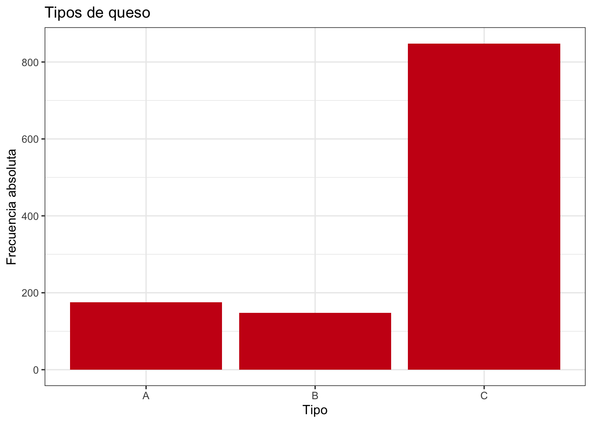
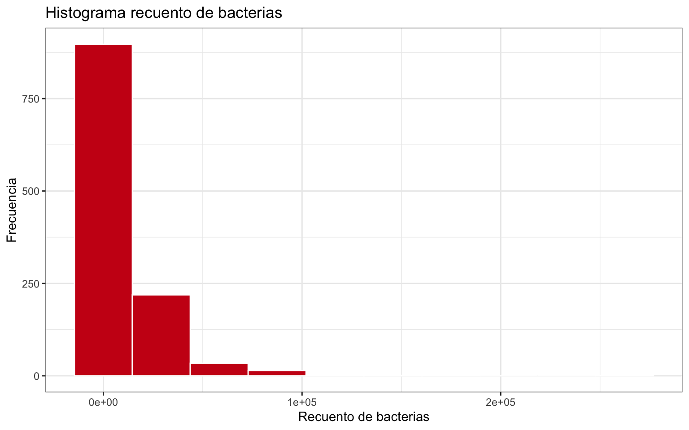
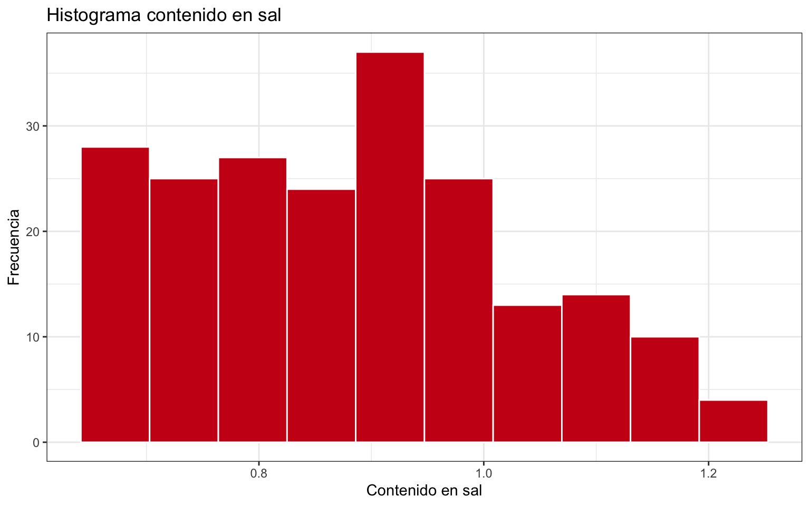
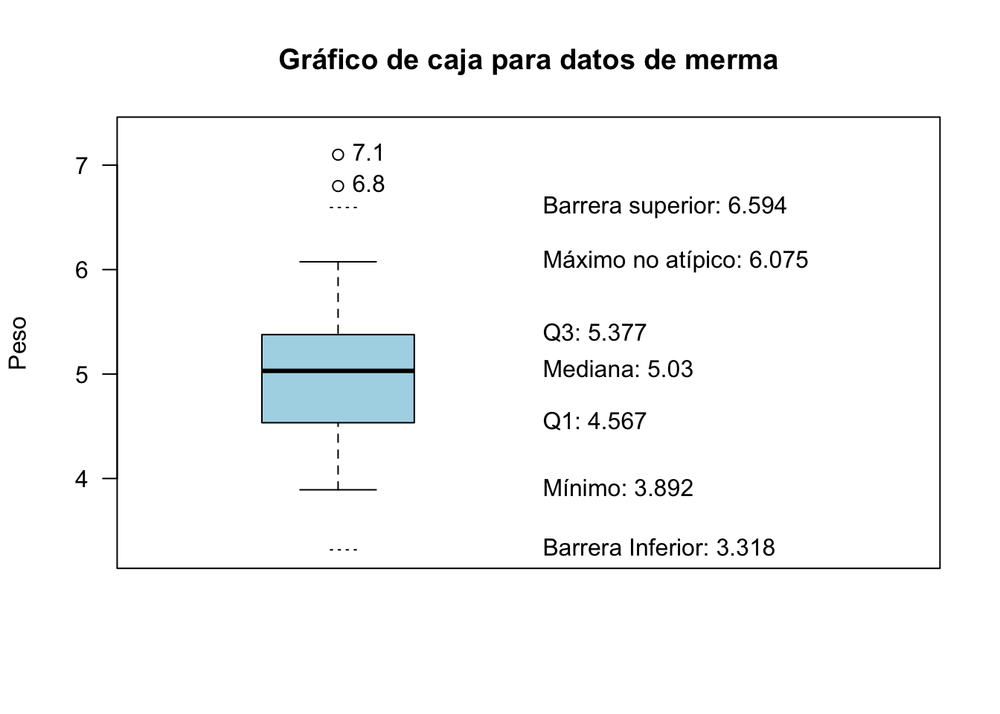
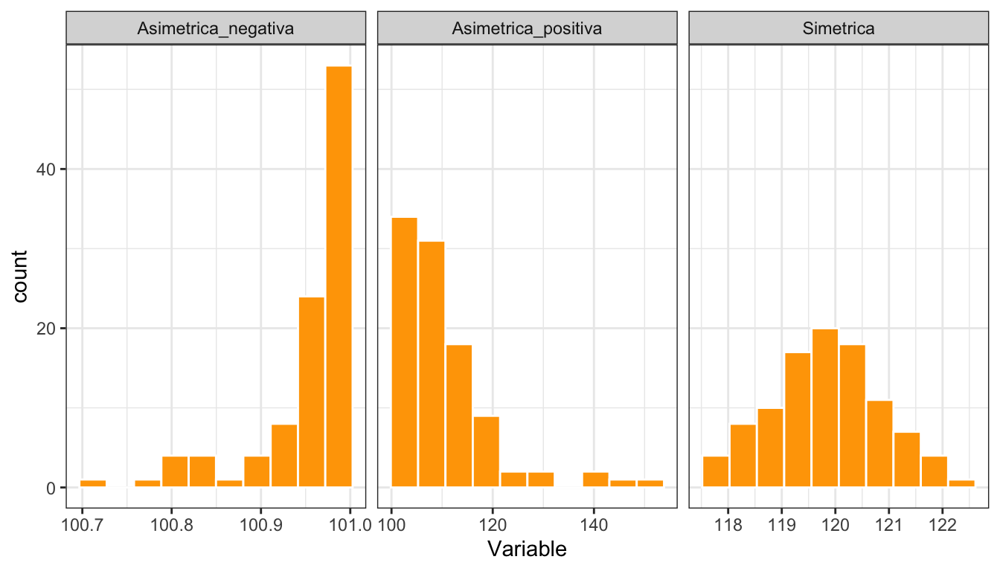

# Análisis exploratorio univariante {#aed-uni}


## La importancia del análisis exploratorio

El análisis exploratorio de datos, y en particular su visualización,
es el primer análisis que se debe hacer sobre cualquier conjunto de datos
antes de abordar otras técnicas estadísticas, sean sencillas o complejas.
La "historia" que nos esté contando el gráfico de los datos, nos guiará
hacia las técnicas de aprendizaje estadístico más adecuadas. Incluso,
en muchas ocasiones será suficiente el análisis exploratorio para tomar
una decisión sobre el problema en estudio. La figura \@ref(fig:dogma1) representa
la esencia de la Estadística y sus métodos. Los datos que analizamos,
provienen de una determinada **población**. Pero estos datos, no son más que
una **muestra**, es decir, un subconjunto de toda la población. Incluso
cuando "creemos" que tenemos todos los datos, debemos tener presente que trabajamos
con muestras, ya que generalmente tomaremos decisiones o llegaremos a conclusiones
sobre el futuro, y esos datos seguro que no los tenemos. Por eso es importante
considerar siempre este paradigma población-muestra. La **Estadística Descriptiva**
se ocupa del análisis exploratorio de datos en sentido amplio, que aplicaremos
sobre los datos concretos de la muestra en este capítulo y el siguiente. La
**Inferencia Estadística** hace referencia a los métodos mediante los cuales,
a través de los datos de la muestra, tomaremos decisiones, explicaremos relaciones,
o haremos predicciones sobre la población. Para ello, haremos uso de la 
**Probabilidad**, que veremos en el capítulo \@ref(introp), aplicando
el método más adecuado. 
En estos métodos será muy importante considerar el método de obtención de la muestra
que, en términos generales, debe ser representativa de la población para que las
conclusiones sean válidas.
En este tercer módulo del curso veremos algunos de estos métodos.


<div class="figure" style="text-align: center">

<p class="caption">(\#fig:dogma1)La esencia de los métodos estadísticos</p>
</div>

El análisis exploratorio se realiza básicamente mediante dos herramientas: los resúmenes numéricos 
y las visualizaciones gráficas.
Pero antes de aprender a hacer análisis exploratorio con R, vamos a resaltar la
importancia, dentro del análisis exploratorio, de las representaciones gráficas.
Para ello utilizaremos un conjunto de datos llamado "el cuarteto de Anscombe" [@Anscombe1973],
disponible con el nombre `anscombe` en el paquete `datasets` de R base. 
La tabla \@ref(tab:anscombe) muestra
este conjunto de datos. 


Table: (\#tab:anscombe)Conjunto de datos 'anscombe'

| x1| x2| x3| x4|    y1|   y2|    y3|    y4|
|--:|--:|--:|--:|-----:|----:|-----:|-----:|
| 10| 10| 10|  8|  8.04| 9.14|  7.46|  6.58|
|  8|  8|  8|  8|  6.95| 8.14|  6.77|  5.76|
| 13| 13| 13|  8|  7.58| 8.74| 12.74|  7.71|
|  9|  9|  9|  8|  8.81| 8.77|  7.11|  8.84|
| 11| 11| 11|  8|  8.33| 9.26|  7.81|  8.47|
| 14| 14| 14|  8|  9.96| 8.10|  8.84|  7.04|
|  6|  6|  6|  8|  7.24| 6.13|  6.08|  5.25|
|  4|  4|  4| 19|  4.26| 3.10|  5.39| 12.50|
| 12| 12| 12|  8| 10.84| 9.13|  8.15|  5.56|
|  7|  7|  7|  8|  4.82| 7.26|  6.42|  7.91|
|  5|  5|  5|  8|  5.68| 4.74|  5.73|  6.89|


Son 11 filas de 8 variables numéricas, aunque las tres primeras son idénticas. Ya sabemos
resumir los datos con la media de cada variable:


```r
library(dplyr)
anscombe %>% summarise(across(.fns = mean))
#>   x1 x2 x3 x4       y1       y2  y3       y4
#> 1  9  9  9  9 7.500909 7.500909 7.5 7.500909
```

Vemos que la media de las cuatro primeras variables es idéntica, 9. Pero los datos
son muy distintos en la cuarta variable. Las cuatro últimas variables también tienen una media
prácticamente idéntica. Sin embargo los datos también son muy distintos. La figura
\@ref(fig:anscombeuni) es un gráfico de los que aprenderemos a hacer enseguida, y
representa en el eje vertical los valores de las variables, y en el eje horizontal
los nombres de cada variable. Vemos que, a pesar de tener medias prácticamente iguales,
los datos son muy diferentes.

<div class="figure">

<p class="caption">(\#fig:anscombeuni)Representación de las variables del cuarteto de Anscombe</p>
</div>

Pero si en el análisis por separado ya se ve la necesidad de hacer un gráfico,
cuando analizamos las variables conjuntamente, todavía es más evidente. La
figura \@ref(fig:anscombelm) muestra los cuatro gráficos que constituyen
"El cuarteto de Anscombe", y que se puede obtener de la propia ayuda del
conjunto de datos (`example(anscombe)`). La línea de regresión que se ajusta
es prácticamente la misma (veremos la regresión en el capítulo \@ref(aed-bi)).
Además, si calculáramos los coeficientes de correlación entre las variables "x" e
"y" de los cuatro gráficos, obtendríamos el mismo valor: 0,8163. 

<div class="figure">

<p class="caption">(\#fig:anscombelm)Los cuatro gráficos que constituyen 'El cuarteto de Anscombe'</p>
</div>

Es evidente que la relación entre las variables es muy distinta en cada uno
de los casos, y si no visualizamos los datos para elegir el mejor modelo
de regresión y después interpretarlo, podemos estar tomando decisiones
erróneas. 

:::{.rmdcafe data-latex=""}
El cuarteto de Anscombe es muy ilustrativo, os animo a explorar
también _The Datasaurus Dozen:_ [@Matejka2017] en https://www.autodeskresearch.com/publications/samestats.
:::

## Calidad de datos

Una vez hemos identificado los tipos de variables del problema de análisis
de datos que queremos abordar, es necesario que tengamos los datos correctamente
en el software que vamos a utilizar, es decir, es muy importante
comprobar continuamente la **calidad en los datos**.
La importación de datos siempre puede dar problemas (y por _Murphy_, los dará).
Por eso siempre deberíamos comprobar la estructura de los datos después de importar
un conjunto de datos (al menos la primera vez). Uno de los errores
más comunes es que el tipo de datos importado no se
corresponda con el que conceptualmente debe tener la variable. Esto no produce
ningún error al importar, pero sí al analizar los datos. Otros problemas de calidad
tienen que ver con valores atípicos (_outliers_) y con valores perdidos (_missing_).

### Datos atípicos

A medida que llevamos el análisis de datos a aplicaciones reales, es más fácil
que aparezcan observaciones que _estropean_ el análisis porque se salen de lo
esperado en relación con el resto de datos. 
La parte 4 de norma UNE-ISO 16269 [@une:iso:16269:4], un **valor atípico** es
un "Miembro de un pequeño subconjunto de observaciones que parece ser inconsistente con el resto de una muestra dada". La identificación de valores **candidatos** a ser
considerados como atípicos es una labor muy importante para el analista,
ya que pueden influir tanto en los resultados del análisis como en la
técnica a utilizar. Estos valores identificados como posibles valores 
atípicos deben ser investigados y determinar cuál es la causa de esta 
posible desviación. Se suele atribuir a una de las siguientes causas:

1. _Error de medida o de registro_. Esto puede ser debido a la observación del dato
o al propio registro. 

2. _Contaminación_. Los datos provienen de más de una distribución. Por ejemplo,
por estar mezclando datos de grupos que tienen distintas medias. Entonces, los
valores de la distribución _contaninante_ aparecerán como valores atípicos en la
distribución de interés.

3. _Suposición incorrecta sobre la distribución_. La característica
en estudio de la población se supone que sigue una determinada distribución
(por ejemplo normal) pero en realidad sigue otra (por ejemnplo exponencial).
Entonces los valores que _parecen_ atípicos para la distribución normal,
son perfectamente compatibles con la distribución verdadera.

4. _Observaciones excepcionales_. Estos no son verdaderos valores atípicos, 
simplemente han ocurrido por azar, aunque sea muy improbable su ocurrencia.


En el primer caso, hay que encontrar el valor correcto y si
esto no es posible, dar el valor por perdido (missing). En el segundo,
hay que estratificar los datos y realizar el análisis por grupos, separando
las distribuciones. Si son solo unos pocos datos los que por error han contaminado la muestra, se pueden eliminar o dar por perdidos. En el tercer caso,
se modifican las asunciones sobre el modelo de distribución subyacente en la
población. En el último caso los valores deberían permanecer en la muestra,
aunque generalmente se etiquetan erróneamente como valores atípicos por su excepcionalidad.

El análisis de los valores atípicos es importante por varios motivos. Por
una parte, puede dar lugar a descubrimientos interesantes al investigar
por qué han ocurrido (por ejemplo, se ha hecho algo diferente y un proceso
ha mejorado). Por otra parte, muchas medidas y métodos estadísticos son
muy sensibles a observaciones atípicas, y entonces es posible que haya
que usar alternativas robustas. Y en todo caso, nos ayuda a determinar
la adecuada distribución de probabilidad.

La observación de los datos con métodos gráficos a menudo proporciona
suficiente información para identificar valores candidatos a ser
atípicos. En concreto, el gráfico de cajas diseñado por John W. Tukey
[@tukey1977exploratory] y recogido en la norma UNE-ISO 16269 [@une:iso:16269:4]
marca estos valores de forma clara (véase el apartado \@ref(sec:graficosuni)
para una completa explicación de su construcción e interpretación).

Aparte de los métodos gráficos, existen diversos contrastes de hipótesis
para determinar si existen valores atípicos en una muestra de datos
dada una distribución de probabilidad. La norma UNE-ISO 16269 [@une:iso:16269:4]
recoge métodos para la distribución normal y también para otros modelos
de distribución, así como un método general para distribuciones desconocidas
y el test de Cochran para varianza atípica. El paquete `outliers` de R contiene
varias funciones para realizar contrastes de hipótesis sobre valores atípicos
a un conjunto de datos, incluidos el test de Grubbs y el test de Cochran.


En cuanto al tratamiento de datos que contienen valores candidatos a ser
atípicos pero de los que no se ha podido identificar una causa válida para
eliminarlos, deberíamos recurrir al **análisis de datos robusto**, de forma
que las observaciones atípicas no influyan demasiado en los resultados, pero
sin eliminarlas. Otra alternativa es realizar el análisis con y sin valores
candidatos a ser atípicos y comprobar cómo varía ese resultado.

Entre las medidas de centralización robustas se encuentran la mediana y la media recortada
(véase \@ref(sec:centralizacion)), aunque hay otras. También para la 
estimación de la dispersión se encuentran estimadores robustos como la
Mediana de las medianas de las desviaciones absolutas de los pares [@une:iso:16269:4].

Lo dicho hasta ahora sirve para detectar atípicos para una característica.
En conjuntos multivariantes, se pueden observar valores atípicos con respecto
a más de una variable. En particular, en modelos de regresión puede haber 
observaciones influyentes (que posiblemente no son atípicas en la variable
aislada) que influyen en la estimación de los parámetros de forma que el 
resultado no es representativo del conjunto de datos. Los gráficos de 
diagnóstico de R para los modelos lineales proporcionan un gráfico señalando
las observaciones influyentes según la distancia de Cook. También el paquete 
`car` contiene una función (`outlierTest`) con la que podemos obtener
la observación más extrema para la regresión.

Por último, podemos detectar observaciones atípicas con respecto a todo un
conjunto multivariante de datos en escala métrica. Para ello, lo que se hace 
es reducir este conjunto multivariate en univariante, obteniendo unas distancias
de las observaciones a la media muestral del conjunto de datos, estandarizada
mediante la matriz de varianzas-covarianzas de la muestra. Entonces aquellas 
observaciones muy alejadas de esos valores centrales pueden estudiarse como
candidatos a ser valores atípicos multivariantes. En @une:iso:16269:4 se 
proporciona un contraste de hipótesis y un método gráfico para identificar
estos valores atípicos. En el apartado \@ref(aed:distancias) se proporcionan
las funciones necesarias para calcular la distancia de Mahalanobis.


### Valores perdidos (missing values)

La ausencia de valores para determinadas observaciones de nuestra muestra
es otro de los problemas habituales que surgen con los datos. Al igual
que con los valores atípicos, un valor perdido puede ser fruto de un 
error en la recogida o registro de los datos. Si ese error es recuperable,
bastará con añadir el verdadero valor a nuestro conjunto de datos. Si el
valor se da definitivamente por perdido, entonces podemos seguir dos caminos:

1. Realizar el análisis sin considerar las observaciones con valores perdidos.

2. Imputar un valor a las observaciones perdidas.

El primer caso merece la siguiente consideración. Cuando estamos analizando
una sola característica, este camino es único. Por ejemplo, en un conjunto
de 100 observaciones donde faltan 2, se calcula la media con las 98 restantes.
O en un gráfico, se representan solo los valores existentes. Pero cuando
estamos analizando un conjunto multivariante, podemos tener valores perdidos
en todas las variables, o solo en algunas. Entonces podemos tomar diferentes 
decisiones a este respecto. Por ejemplo, si queremos calcular una matriz de
correlaciones, podemos considerar solo las observaciones en las que hay valores
para todas las variables, o eliminar solo los pares de observaciones relevantes
para cada coeficiente de correlación entre dos variables^[En R, la función  `cor`
controla este comportamiento mediante el argumento `use`.].

El segundo camino es más complicado y requiere a su vez elegir el método de
imputación del valor perdido. La imputación más sencilla es simplemente asignar
la media o la mediana como valor representativo de toda la variable. Pero cuando
tenemos conjuntos multivariantes, puede ser más adecuado hacer una imputación 
en función de la información disponible en otras variables. Por ejemplo, si tenemos
una variable de tipo atributo, la media del grupo al que pertenece la
observación será generalmente más adecuada que la media global.

En R tenemos varias alternativas para la imputación de valores perdidos.
La función `impute` del paquete `Hmisc` realiza imputaciones sencillas
(por defecto la mediana). El paquete `mice` realiza imputaciones 
utilizando datos multivariantes con un buen número de opciones.

La investigación de los valores perdidos y su tratamiento adecuado debe ser
siempre una fase importante del proyecto de análisis de datos. Además, 
este análisis se puede solapar con el análisis de los valores atípicos, 
por ejemplo cuando un valor atípico se determina que es un dato erróneo pero
no podemos asegurar cuál es el valor verdadero, entonces tenemos que considerarlo
como perdido y aplicar lo aquí visto.

### Errores comunes

Aparte de los errores en los datos que ya se han tratado, hay que evitar
algunos errores demasiado comunes a la hora de abordar el análisis de datos,
y especialmente la interpretación de resultados. En este apartado 
se mencionan algunos de los más importantes.

**1. Confundir correlación con causalidad.**

Cuando realizamos una regresión de una variable respuesta $Y$ sobre una o
varias variables _explicativas_ $X$, tendemos a pensar que $X$ es la causa
de la variación de $Y$. Esto no siempre es así, y deberíamos tenerlo presente
incluso en aplicaciones en las que conocemos los procesos y "estamos seguro" 
de que es así. Para confirmar que una relación es de causa-efecto, deberíamos
recurrir al Diseño de Experimentos, donde además podremos estudiar las
interacciones.


**2. Falta de parsimonia.**

La parsimoniosidad es un principio científico (véase @wiki:parsimonia)^[En igualdad de condiciones, la explicación más sencilla suele ser la más probable.] que, 
aplicado a la Estadística, significa seleccionar el modelo más reducido y 
simple posible que consiga explicar el fenómeno a estudiar, frente a modelos
más complejos (con muchas variables) con una mínima o nula ganancia de poder
predictivo. En modelos de regresión múltiple, por ejemplo, ninguna variable
cuyo coeficiente no sea significativo se debería incluir en el modelo
final al que llega la investigación.

**2. Interpretación de porcentajes sin fijarse en el tamaño.**

Este error común viene explicado por la **paradoja de Simpson** [@wiki:simpson].
Esta paradoja aparece cuando hay un atributo _oculto_ que no se tiene en cuenta
a la hora de interpretar porcentajes, pudiendo darse el caso de que otro atributo
presenta un porcentaje mayor en una categoría, pero si se analizan por separado
los porcentajes para las categorías del atributo oculto, resulta que el porcentaje
de la categoría que era mayor globalmente, es menor en TODOS los grupos del
atributo oculto.


**3. Informar los valores medios pero no la dispersión.**

La media por sí sola no debería llevar a conclusión alguna. Siempre se debe
analizar conjuntamente la centralidad y dispersión de los datos, ya que 
un valor medio puede estar calculado con valores muy extremos y ocultar
mucha información.

**4. Pasar por alto las hipótesis del modelo.**

Muchos modelos estadísticos requieren, para ser válidos, que se cumplan
ciertas condiciones. Si utilizamos un método que requiere normalidad,
debemos comprobar que los datos provienen de una distribución normal.
Ante la duda, debemos comprobar que un método no paramétrico conduce
a resultados similares.

**5. Sobreajuste (_overfitting_).**

El sobreajuste aparece cuando en un modelo predictivo conseguimos estimar
perfectamente los valores de la muestra, pero el modelo utilizado
no sirve para generalizar a nuevos casos. En _Machine Learning_ es muy fácil
conseguir un modelo perfecto para los datos utilizados, pero pésimo para
nuevos casos. El paradigma de entrenamiento y validación consigue evitar
el sobreajuste.


**6. Utilizar muestras sesgadas como si fueran aleatorias**

Los métodos probabilísticos de uno u otro modo se basan en que los datos
provienen de muestras aleatorias. A pesar de que en muchas situaciones de
análisis de datos esto no lo podamos ni siquiera soñar, es importante tenerlo
en mente para, a la hora de interpretar resultados y llegar a conclusiones,
hacer una reflexión sobre cuánto nos estamos alejando de esa aleatoriedad.
Por ejemplo, si estoy haciendo un estudio de los clientes de una empresa
y solo analizo las transacciones de la primera semana del mes, tengo una
muestra sesgada porque no tengo representado el resto del mes (posiblemente
con un comportamiento diferente).


## Componentes de un gráfico

Dejando aparte las visualizaciones en tres dimensiones, animaciones 3D y realidad virtual,
la visualización de datos que hacemos en la práctica totalidad de los casos es 
en dos dimensiones, es decir, en el plano. Vamos a pensar en este plano como
si fuera un "lienzo" de pintor, independientemente de que el resultado lo vayamos
a ver impreso en un papel o en una pantalla. Este lienzo se irá "poblando" de
"capas" a medida que el pintor vaya añadiendo cosas. Siguiendo con el símil,
empezaremos preparando un espacio para los símbolos con los que representaremos
los datos, es decir, unos **ejes**: horizontal (X) y vertical (Y). A partir de
aquí, representaremos los datos con algún **símbolo geométrico**, como un punto, una línea, 
o cualquier otro. Podremos añadir colores a los símbolos y otras características
como transparencia o tamaño. También añadiremos anotaciones al gráfico, como
las marcas en los ejes, títulos o incluso texto dentro del gráfico. 

La figura \@ref(fig:obra) es una ilustración de Allison Horst^[https://github.com/allisonhorst/stats-illustrations] que simboliza este paradigmna de lienzo y capas. Si pensamos en los distintos elementos del gráfico y los relacionamos con las variables que estamos analizando, será mucho más fácil hacer el gráfico adecuado e interpretarlo.

<div class="figure">

<p class="caption">(\#fig:obra)El dispositivo gráfico como lienzo al que añadimos capas</p>
</div>


## Notación

Antes de comenzar a hacer resúmenes de los datos, vamos a definir la notación que
utilizaremos. Representamos las variables con letras mayúsculas latinas del final el alfabeto como $X, Y, \ldots$^[Para atributos, a veces se utilizan las primeras letras del alfabeto: $A, B, \ldots$]. Cada uno de los posibles valores que toma la variable $X$ se representa por $x_i$. Así, $i$ es el identificador o índice para cada observación o clase. 
El número total de observaciones **en la muestra** lo representamos por $n$, mientras que si tenemos una enumeración de toda la población en estudio, denotaremos el número total de individuos por $N$. 
El número de clases o niveles de una variable categórica o numérica agrupado es $k$.
$n_i, i = 1, \ldots k$ es el número de observaciones en la clase $i$. Si agrupamos los datos numéricos en intervalos (clases),
$c_i, i= 1, \ldots, k$ es la marca de clase, es decir, el punto central del intervalo. 

Para representar los parámetros (recordemos, desconocidos) utilizamos letras griegas. Por ejemplo, $\mu$ es la media poblacional, y $\sigma^2$ la varianza poblacional. Para representar estadísticos (recordemos, calculados con los datos de la muestra) se representan con letras minúsculas. Por ejemplo, $\bar{x}$ es la media muestral de la variable $X$, y $s^2$: representa la varianza muestral (cuasivarianza).
$s$ es la desviación típica muestral

Para representar que un estadístico es un estimador, utilizamos la notación
$\hat{[\cdot]}$, que simboliza un estimador de $\cdot$. Por ejemplo,
$s = \hat{\sigma}$ quiere decir que la desviación típica muestral
$s$ es un estimador de la desviación típica poblacional $\sigma$.

:::{.rmdejemplo data-latex=""}
`<svg aria-hidden="true" role="img" viewBox="0 0 384 512" style="height:1em;width:0.75em;vertical-align:-0.125em;margin-left:auto;margin-right:auto;font-size:inherit;fill:green;overflow:visible;position:relative;"><path d="M378.31 378.49L298.42 288h30.63c9.01 0 16.98-5 20.78-13.06 3.8-8.04 2.55-17.26-3.28-24.05L268.42 160h28.89c9.1 0 17.3-5.35 20.86-13.61 3.52-8.13 1.86-17.59-4.24-24.08L203.66 4.83c-6.03-6.45-17.28-6.45-23.32 0L70.06 122.31c-6.1 6.49-7.75 15.95-4.24 24.08C69.38 154.65 77.59 160 86.69 160h28.89l-78.14 90.91c-5.81 6.78-7.06 15.99-3.27 24.04C37.97 283 45.93 288 54.95 288h30.63L5.69 378.49c-6 6.79-7.36 16.09-3.56 24.26 3.75 8.05 12 13.25 21.01 13.25H160v24.45l-30.29 48.4c-5.32 10.64 2.42 23.16 14.31 23.16h95.96c11.89 0 19.63-12.52 14.31-23.16L224 440.45V416h136.86c9.01 0 17.26-5.2 21.01-13.25 3.8-8.17 2.44-17.47-3.56-24.26z"/></svg>`{=html} Supongamos que tenemos que hacer un estudio de las emisiones de dióxido de carbono (CO$_2$) en las granjas de porcino de una determinada región. Este
es un ejemplo en el que podemos enumerar la población (a partir de registros oficiales u otras fuentes). Supongamos que existen ${1\,000}$ granjas. Entonces, $N = {1\,000}$. En vez de
analizar el 100% de las granjas, se decide hacer un muestreo, por ejemplo, del 10% de las granjas^[En el capítulo \@ref(muestreo) estudiaremos cómo decidir el tamaño de la muestra].
Entonces, $n=100$. La región está dividida en tres zonas, y definimos el atributo $A \in \{Z1, Z2, Z3\}$. Entonces, para este atributo $k = 3$. Si en la muestra tenemos el doble de granjas en la zona 1 que en cualquiera de las otras dos, entonces $n_1 = 50, n_2 = 25$ y $n_3 = 25$.

Una vez realizadas las mediciones de emisiones en cada granja de la muestra, tendremos valores $x_i, i = 1, \ldots, n$. Podremos agrupar estos valores en $k'$ intervalos (clases) de los que podremos calcular las marcas de clase $c_i, i = 1, \ldots, k'$. Como solo hemos medido las emisiones en una muestra, desconocemos el verdadero valor de la media de la población, $\mu$, y entonces lo estimaremos con la media muestral: $\hat{\mu} =\bar x.$
:::

## Análisis exploratorio de variables cualitativas

Cuando nuestra variable no se expresa con números, sino con
etiquetas de una determinada característica observada en cada uno
de los elementos en los que se observa la característica, el resumen numérico
que utilizamos es la tabla de frecuencias. Esta tabla de frecuencias
se puede representar gráficamente con un gráfico de barras o con un gráfico
de sectores. Este último no es recomendable ya que proporciona la misma 
información que el gráfico de barras y es mucho más difícil para el ojo
humano distinguir ángulos que alturas.
En variables cualitativas, llamamos a la categoría más frecuente **moda** de la variable.

Para construir la tabla de frecuencias, contamos el número de elementos de cada clase $(n_i)$ que pertenecen a cada una de las clases $(c_i)$, que son
las **frecuencias absolutas**. Se pueden calcular también frecuencias relativas $(f_i=n_i/n)$ y acumuladas, 
tanto para las absolutas $(N_i)$ como para las relativas $(F_i)$. No obstante, estas frecuencias acumuladas solo tienen sentido cuando la variable está en escala ordinal.


:::{.rmdpractica data-latex=""}
Los datos que se utilizarán en este capítulo para ilustrar los ejemplos se pueden descargar e importar con el siguiente código.

```r
library(dplyr)
download.file("https://lcano.com/data/eaci/lab.xlsx",
              destfile = "lab.xlsx")
lab <- readxl::read_excel("lab.xlsx") |> 
  mutate(fecha = as.Date(fecha))
```
:::


:::{.rmdejemplo data-latex=""}
`<svg aria-hidden="true" role="img" viewBox="0 0 512 512" style="height:1em;width:1em;vertical-align:-0.125em;margin-left:auto;margin-right:auto;font-size:inherit;fill:gold;overflow:visible;position:relative;"><path d="M0 288v160a32 32 0 0 0 32 32h448a32 32 0 0 0 32-32V288zM299.83 32a32 32 0 0 0-21.13 7L0 256h512c0-119.89-94-217.8-212.17-224z"/></svg>`{=html} El laboratorio de una fábrica de quesos recoge datos de los análisis realizados a muestras de quesos de su producción. Se dispone de un conjunto de datos con 1171 filas y
12 columnas. La tabla \@ref(tab:ejlab) muestra las primeras filas de este conjunto de datos.

La columna `tipo` toma tres valores: A, B y C. La tabla \@ref(tab:labfreq) muestra una tabla de frecuencias completa, donde se puede ver de un vistazo, por ejemplo, que la clase con más quesos en el conjunto de datos el tipo C. Las frecuencias relativas se pueden traducir fácilmente a porcentajes.
:::


```{=html}
<div id="kzpivmufsa" style="overflow-x:auto;overflow-y:auto;width:auto;height:auto;">
<style>html {
  font-family: -apple-system, BlinkMacSystemFont, 'Segoe UI', Roboto, Oxygen, Ubuntu, Cantarell, 'Helvetica Neue', 'Fira Sans', 'Droid Sans', Arial, sans-serif;
}

#kzpivmufsa .gt_table {
  display: table;
  border-collapse: collapse;
  margin-left: auto;
  margin-right: auto;
  color: #333333;
  font-size: 16px;
  font-weight: normal;
  font-style: normal;
  background-color: #FFFFFF;
  width: auto;
  border-top-style: solid;
  border-top-width: 2px;
  border-top-color: #A8A8A8;
  border-right-style: none;
  border-right-width: 2px;
  border-right-color: #D3D3D3;
  border-bottom-style: solid;
  border-bottom-width: 2px;
  border-bottom-color: #A8A8A8;
  border-left-style: none;
  border-left-width: 2px;
  border-left-color: #D3D3D3;
}

#kzpivmufsa .gt_heading {
  background-color: #FFFFFF;
  text-align: center;
  border-bottom-color: #FFFFFF;
  border-left-style: none;
  border-left-width: 1px;
  border-left-color: #D3D3D3;
  border-right-style: none;
  border-right-width: 1px;
  border-right-color: #D3D3D3;
}

#kzpivmufsa .gt_title {
  color: #333333;
  font-size: 125%;
  font-weight: initial;
  padding-top: 4px;
  padding-bottom: 4px;
  padding-left: 5px;
  padding-right: 5px;
  border-bottom-color: #FFFFFF;
  border-bottom-width: 0;
}

#kzpivmufsa .gt_subtitle {
  color: #333333;
  font-size: 85%;
  font-weight: initial;
  padding-top: 0;
  padding-bottom: 6px;
  padding-left: 5px;
  padding-right: 5px;
  border-top-color: #FFFFFF;
  border-top-width: 0;
}

#kzpivmufsa .gt_bottom_border {
  border-bottom-style: solid;
  border-bottom-width: 2px;
  border-bottom-color: #D3D3D3;
}

#kzpivmufsa .gt_col_headings {
  border-top-style: solid;
  border-top-width: 2px;
  border-top-color: #D3D3D3;
  border-bottom-style: solid;
  border-bottom-width: 2px;
  border-bottom-color: #D3D3D3;
  border-left-style: none;
  border-left-width: 1px;
  border-left-color: #D3D3D3;
  border-right-style: none;
  border-right-width: 1px;
  border-right-color: #D3D3D3;
}

#kzpivmufsa .gt_col_heading {
  color: #333333;
  background-color: #FFFFFF;
  font-size: 100%;
  font-weight: normal;
  text-transform: inherit;
  border-left-style: none;
  border-left-width: 1px;
  border-left-color: #D3D3D3;
  border-right-style: none;
  border-right-width: 1px;
  border-right-color: #D3D3D3;
  vertical-align: bottom;
  padding-top: 5px;
  padding-bottom: 6px;
  padding-left: 5px;
  padding-right: 5px;
  overflow-x: hidden;
}

#kzpivmufsa .gt_column_spanner_outer {
  color: #333333;
  background-color: #FFFFFF;
  font-size: 100%;
  font-weight: normal;
  text-transform: inherit;
  padding-top: 0;
  padding-bottom: 0;
  padding-left: 4px;
  padding-right: 4px;
}

#kzpivmufsa .gt_column_spanner_outer:first-child {
  padding-left: 0;
}

#kzpivmufsa .gt_column_spanner_outer:last-child {
  padding-right: 0;
}

#kzpivmufsa .gt_column_spanner {
  border-bottom-style: solid;
  border-bottom-width: 2px;
  border-bottom-color: #D3D3D3;
  vertical-align: bottom;
  padding-top: 5px;
  padding-bottom: 5px;
  overflow-x: hidden;
  display: inline-block;
  width: 100%;
}

#kzpivmufsa .gt_group_heading {
  padding-top: 8px;
  padding-bottom: 8px;
  padding-left: 5px;
  padding-right: 5px;
  color: #333333;
  background-color: #FFFFFF;
  font-size: 100%;
  font-weight: initial;
  text-transform: inherit;
  border-top-style: solid;
  border-top-width: 2px;
  border-top-color: #D3D3D3;
  border-bottom-style: solid;
  border-bottom-width: 2px;
  border-bottom-color: #D3D3D3;
  border-left-style: none;
  border-left-width: 1px;
  border-left-color: #D3D3D3;
  border-right-style: none;
  border-right-width: 1px;
  border-right-color: #D3D3D3;
  vertical-align: middle;
}

#kzpivmufsa .gt_empty_group_heading {
  padding: 0.5px;
  color: #333333;
  background-color: #FFFFFF;
  font-size: 100%;
  font-weight: initial;
  border-top-style: solid;
  border-top-width: 2px;
  border-top-color: #D3D3D3;
  border-bottom-style: solid;
  border-bottom-width: 2px;
  border-bottom-color: #D3D3D3;
  vertical-align: middle;
}

#kzpivmufsa .gt_from_md > :first-child {
  margin-top: 0;
}

#kzpivmufsa .gt_from_md > :last-child {
  margin-bottom: 0;
}

#kzpivmufsa .gt_row {
  padding-top: 8px;
  padding-bottom: 8px;
  padding-left: 5px;
  padding-right: 5px;
  margin: 10px;
  border-top-style: solid;
  border-top-width: 1px;
  border-top-color: #D3D3D3;
  border-left-style: none;
  border-left-width: 1px;
  border-left-color: #D3D3D3;
  border-right-style: none;
  border-right-width: 1px;
  border-right-color: #D3D3D3;
  vertical-align: middle;
  overflow-x: hidden;
}

#kzpivmufsa .gt_stub {
  color: #333333;
  background-color: #FFFFFF;
  font-size: 100%;
  font-weight: initial;
  text-transform: inherit;
  border-right-style: solid;
  border-right-width: 2px;
  border-right-color: #D3D3D3;
  padding-left: 5px;
  padding-right: 5px;
}

#kzpivmufsa .gt_stub_row_group {
  color: #333333;
  background-color: #FFFFFF;
  font-size: 100%;
  font-weight: initial;
  text-transform: inherit;
  border-right-style: solid;
  border-right-width: 2px;
  border-right-color: #D3D3D3;
  padding-left: 5px;
  padding-right: 5px;
  vertical-align: top;
}

#kzpivmufsa .gt_row_group_first td {
  border-top-width: 2px;
}

#kzpivmufsa .gt_summary_row {
  color: #333333;
  background-color: #FFFFFF;
  text-transform: inherit;
  padding-top: 8px;
  padding-bottom: 8px;
  padding-left: 5px;
  padding-right: 5px;
}

#kzpivmufsa .gt_first_summary_row {
  border-top-style: solid;
  border-top-color: #D3D3D3;
}

#kzpivmufsa .gt_first_summary_row.thick {
  border-top-width: 2px;
}

#kzpivmufsa .gt_last_summary_row {
  padding-top: 8px;
  padding-bottom: 8px;
  padding-left: 5px;
  padding-right: 5px;
  border-bottom-style: solid;
  border-bottom-width: 2px;
  border-bottom-color: #D3D3D3;
}

#kzpivmufsa .gt_grand_summary_row {
  color: #333333;
  background-color: #FFFFFF;
  text-transform: inherit;
  padding-top: 8px;
  padding-bottom: 8px;
  padding-left: 5px;
  padding-right: 5px;
}

#kzpivmufsa .gt_first_grand_summary_row {
  padding-top: 8px;
  padding-bottom: 8px;
  padding-left: 5px;
  padding-right: 5px;
  border-top-style: double;
  border-top-width: 6px;
  border-top-color: #D3D3D3;
}

#kzpivmufsa .gt_striped {
  background-color: rgba(128, 128, 128, 0.05);
}

#kzpivmufsa .gt_table_body {
  border-top-style: solid;
  border-top-width: 2px;
  border-top-color: #D3D3D3;
  border-bottom-style: solid;
  border-bottom-width: 2px;
  border-bottom-color: #D3D3D3;
}

#kzpivmufsa .gt_footnotes {
  color: #333333;
  background-color: #FFFFFF;
  border-bottom-style: none;
  border-bottom-width: 2px;
  border-bottom-color: #D3D3D3;
  border-left-style: none;
  border-left-width: 2px;
  border-left-color: #D3D3D3;
  border-right-style: none;
  border-right-width: 2px;
  border-right-color: #D3D3D3;
}

#kzpivmufsa .gt_footnote {
  margin: 0px;
  font-size: 90%;
  padding-left: 4px;
  padding-right: 4px;
  padding-left: 5px;
  padding-right: 5px;
}

#kzpivmufsa .gt_sourcenotes {
  color: #333333;
  background-color: #FFFFFF;
  border-bottom-style: none;
  border-bottom-width: 2px;
  border-bottom-color: #D3D3D3;
  border-left-style: none;
  border-left-width: 2px;
  border-left-color: #D3D3D3;
  border-right-style: none;
  border-right-width: 2px;
  border-right-color: #D3D3D3;
}

#kzpivmufsa .gt_sourcenote {
  font-size: 90%;
  padding-top: 4px;
  padding-bottom: 4px;
  padding-left: 5px;
  padding-right: 5px;
}

#kzpivmufsa .gt_left {
  text-align: left;
}

#kzpivmufsa .gt_center {
  text-align: center;
}

#kzpivmufsa .gt_right {
  text-align: right;
  font-variant-numeric: tabular-nums;
}

#kzpivmufsa .gt_font_normal {
  font-weight: normal;
}

#kzpivmufsa .gt_font_bold {
  font-weight: bold;
}

#kzpivmufsa .gt_font_italic {
  font-style: italic;
}

#kzpivmufsa .gt_super {
  font-size: 65%;
}

#kzpivmufsa .gt_footnote_marks {
  font-style: italic;
  font-weight: normal;
  font-size: 75%;
  vertical-align: 0.4em;
}

#kzpivmufsa .gt_asterisk {
  font-size: 100%;
  vertical-align: 0;
}

#kzpivmufsa .gt_slash_mark {
  font-size: 0.7em;
  line-height: 0.7em;
  vertical-align: 0.15em;
}

#kzpivmufsa .gt_fraction_numerator {
  font-size: 0.6em;
  line-height: 0.6em;
  vertical-align: 0.45em;
}

#kzpivmufsa .gt_fraction_denominator {
  font-size: 0.6em;
  line-height: 0.6em;
  vertical-align: -0.05em;
}
</style>
<table class="gt_table">
  <caption>(#tab:ejlab)Ejemplo datos de laboratorio</caption>
  
  <thead class="gt_col_headings">
    <tr>
      <th class="gt_col_heading gt_columns_bottom_border gt_left" rowspan="1" colspan="1">fecha</th>
      <th class="gt_col_heading gt_columns_bottom_border gt_right" rowspan="1" colspan="1">codigo</th>
      <th class="gt_col_heading gt_columns_bottom_border gt_right" rowspan="1" colspan="1">est</th>
      <th class="gt_col_heading gt_columns_bottom_border gt_right" rowspan="1" colspan="1">mg</th>
      <th class="gt_col_heading gt_columns_bottom_border gt_right" rowspan="1" colspan="1">sal</th>
      <th class="gt_col_heading gt_columns_bottom_border gt_right" rowspan="1" colspan="1">ph</th>
      <th class="gt_col_heading gt_columns_bottom_border gt_left" rowspan="1" colspan="1">ebacteria</th>
      <th class="gt_col_heading gt_columns_bottom_border gt_left" rowspan="1" colspan="1">analista</th>
      <th class="gt_col_heading gt_columns_bottom_border gt_left" rowspan="1" colspan="1">tipo</th>
      <th class="gt_col_heading gt_columns_bottom_border gt_right" rowspan="1" colspan="1">bacteriax</th>
      <th class="gt_col_heading gt_columns_bottom_border gt_right" rowspan="1" colspan="1">imperfecciones</th>
      <th class="gt_col_heading gt_columns_bottom_border gt_left" rowspan="1" colspan="1">origen</th>
    </tr>
  </thead>
  <tbody class="gt_table_body">
    <tr><td class="gt_row gt_left">2013-11-01</td>
<td class="gt_row gt_right">1</td>
<td class="gt_row gt_right">33.50</td>
<td class="gt_row gt_right">14.0</td>
<td class="gt_row gt_right"></td>
<td class="gt_row gt_right">6.64</td>
<td class="gt_row gt_left">&lt;10</td>
<td class="gt_row gt_left">analista_9</td>
<td class="gt_row gt_left">C</td>
<td class="gt_row gt_right">8606</td>
<td class="gt_row gt_right">1</td>
<td class="gt_row gt_left">Norte</td></tr>
    <tr><td class="gt_row gt_left">2013-11-01</td>
<td class="gt_row gt_right">2</td>
<td class="gt_row gt_right">31.05</td>
<td class="gt_row gt_right">13.0</td>
<td class="gt_row gt_right"></td>
<td class="gt_row gt_right">6.65</td>
<td class="gt_row gt_left">&lt;10</td>
<td class="gt_row gt_left">analista_9</td>
<td class="gt_row gt_left">C</td>
<td class="gt_row gt_right">3055</td>
<td class="gt_row gt_right">2</td>
<td class="gt_row gt_left">Norte</td></tr>
    <tr><td class="gt_row gt_left">2013-11-01</td>
<td class="gt_row gt_right">3</td>
<td class="gt_row gt_right">31.42</td>
<td class="gt_row gt_right">13.0</td>
<td class="gt_row gt_right">1.20</td>
<td class="gt_row gt_right">6.66</td>
<td class="gt_row gt_left">&lt;10</td>
<td class="gt_row gt_left">analista_9</td>
<td class="gt_row gt_left">C</td>
<td class="gt_row gt_right">17153</td>
<td class="gt_row gt_right">2</td>
<td class="gt_row gt_left">Norte</td></tr>
    <tr><td class="gt_row gt_left">2013-11-01</td>
<td class="gt_row gt_right">4</td>
<td class="gt_row gt_right">31.00</td>
<td class="gt_row gt_right">13.0</td>
<td class="gt_row gt_right"></td>
<td class="gt_row gt_right">6.60</td>
<td class="gt_row gt_left">&lt;10</td>
<td class="gt_row gt_left">analista_9</td>
<td class="gt_row gt_left">C</td>
<td class="gt_row gt_right">46089</td>
<td class="gt_row gt_right">2</td>
<td class="gt_row gt_left">Norte</td></tr>
    <tr><td class="gt_row gt_left">2013-11-01</td>
<td class="gt_row gt_right">5</td>
<td class="gt_row gt_right">31.54</td>
<td class="gt_row gt_right">13.5</td>
<td class="gt_row gt_right"></td>
<td class="gt_row gt_right">6.60</td>
<td class="gt_row gt_left">&lt;10</td>
<td class="gt_row gt_left">analista_9</td>
<td class="gt_row gt_left">C</td>
<td class="gt_row gt_right">6488</td>
<td class="gt_row gt_right">3</td>
<td class="gt_row gt_left">Norte</td></tr>
    <tr><td class="gt_row gt_left">2013-11-01</td>
<td class="gt_row gt_right">6</td>
<td class="gt_row gt_right">30.51</td>
<td class="gt_row gt_right">12.5</td>
<td class="gt_row gt_right"></td>
<td class="gt_row gt_right">6.63</td>
<td class="gt_row gt_left">&lt;10</td>
<td class="gt_row gt_left">analista_9</td>
<td class="gt_row gt_left">C</td>
<td class="gt_row gt_right">9639</td>
<td class="gt_row gt_right">0</td>
<td class="gt_row gt_left">Norte</td></tr>
    <tr><td class="gt_row gt_left">2013-11-01</td>
<td class="gt_row gt_right">7</td>
<td class="gt_row gt_right">32.30</td>
<td class="gt_row gt_right">13.0</td>
<td class="gt_row gt_right"></td>
<td class="gt_row gt_right">6.64</td>
<td class="gt_row gt_left">&lt;10</td>
<td class="gt_row gt_left">analista_9</td>
<td class="gt_row gt_left">C</td>
<td class="gt_row gt_right">1398</td>
<td class="gt_row gt_right">3</td>
<td class="gt_row gt_left">Norte</td></tr>
    <tr><td class="gt_row gt_left">2013-11-01</td>
<td class="gt_row gt_right">8</td>
<td class="gt_row gt_right">31.27</td>
<td class="gt_row gt_right">12.5</td>
<td class="gt_row gt_right"></td>
<td class="gt_row gt_right">6.63</td>
<td class="gt_row gt_left">&lt;10</td>
<td class="gt_row gt_left">analista_9</td>
<td class="gt_row gt_left">C</td>
<td class="gt_row gt_right">14768</td>
<td class="gt_row gt_right">1</td>
<td class="gt_row gt_left">Norte</td></tr>
    <tr><td class="gt_row gt_left">2013-11-01</td>
<td class="gt_row gt_right">9</td>
<td class="gt_row gt_right">31.10</td>
<td class="gt_row gt_right">12.5</td>
<td class="gt_row gt_right">1.14</td>
<td class="gt_row gt_right">6.62</td>
<td class="gt_row gt_left">&lt;10</td>
<td class="gt_row gt_left">analista_9</td>
<td class="gt_row gt_left">C</td>
<td class="gt_row gt_right">6644</td>
<td class="gt_row gt_right">3</td>
<td class="gt_row gt_left">Norte</td></tr>
    <tr><td class="gt_row gt_left">2013-11-01</td>
<td class="gt_row gt_right">10</td>
<td class="gt_row gt_right">30.76</td>
<td class="gt_row gt_right">12.5</td>
<td class="gt_row gt_right"></td>
<td class="gt_row gt_right">6.64</td>
<td class="gt_row gt_left">&lt;10</td>
<td class="gt_row gt_left">analista_9</td>
<td class="gt_row gt_left">C</td>
<td class="gt_row gt_right">1887</td>
<td class="gt_row gt_right">2</td>
<td class="gt_row gt_left">Norte</td></tr>
  </tbody>
  
  
</table>
</div>
```


```{=html}
<div id="zdopozozgn" style="overflow-x:auto;overflow-y:auto;width:auto;height:auto;">
<style>html {
  font-family: -apple-system, BlinkMacSystemFont, 'Segoe UI', Roboto, Oxygen, Ubuntu, Cantarell, 'Helvetica Neue', 'Fira Sans', 'Droid Sans', Arial, sans-serif;
}

#zdopozozgn .gt_table {
  display: table;
  border-collapse: collapse;
  margin-left: auto;
  margin-right: auto;
  color: #333333;
  font-size: 16px;
  font-weight: normal;
  font-style: normal;
  background-color: #FFFFFF;
  width: auto;
  border-top-style: solid;
  border-top-width: 2px;
  border-top-color: #A8A8A8;
  border-right-style: none;
  border-right-width: 2px;
  border-right-color: #D3D3D3;
  border-bottom-style: solid;
  border-bottom-width: 2px;
  border-bottom-color: #A8A8A8;
  border-left-style: none;
  border-left-width: 2px;
  border-left-color: #D3D3D3;
}

#zdopozozgn .gt_heading {
  background-color: #FFFFFF;
  text-align: center;
  border-bottom-color: #FFFFFF;
  border-left-style: none;
  border-left-width: 1px;
  border-left-color: #D3D3D3;
  border-right-style: none;
  border-right-width: 1px;
  border-right-color: #D3D3D3;
}

#zdopozozgn .gt_title {
  color: #333333;
  font-size: 125%;
  font-weight: initial;
  padding-top: 4px;
  padding-bottom: 4px;
  padding-left: 5px;
  padding-right: 5px;
  border-bottom-color: #FFFFFF;
  border-bottom-width: 0;
}

#zdopozozgn .gt_subtitle {
  color: #333333;
  font-size: 85%;
  font-weight: initial;
  padding-top: 0;
  padding-bottom: 6px;
  padding-left: 5px;
  padding-right: 5px;
  border-top-color: #FFFFFF;
  border-top-width: 0;
}

#zdopozozgn .gt_bottom_border {
  border-bottom-style: solid;
  border-bottom-width: 2px;
  border-bottom-color: #D3D3D3;
}

#zdopozozgn .gt_col_headings {
  border-top-style: solid;
  border-top-width: 2px;
  border-top-color: #D3D3D3;
  border-bottom-style: solid;
  border-bottom-width: 2px;
  border-bottom-color: #D3D3D3;
  border-left-style: none;
  border-left-width: 1px;
  border-left-color: #D3D3D3;
  border-right-style: none;
  border-right-width: 1px;
  border-right-color: #D3D3D3;
}

#zdopozozgn .gt_col_heading {
  color: #333333;
  background-color: #FFFFFF;
  font-size: 100%;
  font-weight: normal;
  text-transform: inherit;
  border-left-style: none;
  border-left-width: 1px;
  border-left-color: #D3D3D3;
  border-right-style: none;
  border-right-width: 1px;
  border-right-color: #D3D3D3;
  vertical-align: bottom;
  padding-top: 5px;
  padding-bottom: 6px;
  padding-left: 5px;
  padding-right: 5px;
  overflow-x: hidden;
}

#zdopozozgn .gt_column_spanner_outer {
  color: #333333;
  background-color: #FFFFFF;
  font-size: 100%;
  font-weight: normal;
  text-transform: inherit;
  padding-top: 0;
  padding-bottom: 0;
  padding-left: 4px;
  padding-right: 4px;
}

#zdopozozgn .gt_column_spanner_outer:first-child {
  padding-left: 0;
}

#zdopozozgn .gt_column_spanner_outer:last-child {
  padding-right: 0;
}

#zdopozozgn .gt_column_spanner {
  border-bottom-style: solid;
  border-bottom-width: 2px;
  border-bottom-color: #D3D3D3;
  vertical-align: bottom;
  padding-top: 5px;
  padding-bottom: 5px;
  overflow-x: hidden;
  display: inline-block;
  width: 100%;
}

#zdopozozgn .gt_group_heading {
  padding-top: 8px;
  padding-bottom: 8px;
  padding-left: 5px;
  padding-right: 5px;
  color: #333333;
  background-color: #FFFFFF;
  font-size: 100%;
  font-weight: initial;
  text-transform: inherit;
  border-top-style: solid;
  border-top-width: 2px;
  border-top-color: #D3D3D3;
  border-bottom-style: solid;
  border-bottom-width: 2px;
  border-bottom-color: #D3D3D3;
  border-left-style: none;
  border-left-width: 1px;
  border-left-color: #D3D3D3;
  border-right-style: none;
  border-right-width: 1px;
  border-right-color: #D3D3D3;
  vertical-align: middle;
}

#zdopozozgn .gt_empty_group_heading {
  padding: 0.5px;
  color: #333333;
  background-color: #FFFFFF;
  font-size: 100%;
  font-weight: initial;
  border-top-style: solid;
  border-top-width: 2px;
  border-top-color: #D3D3D3;
  border-bottom-style: solid;
  border-bottom-width: 2px;
  border-bottom-color: #D3D3D3;
  vertical-align: middle;
}

#zdopozozgn .gt_from_md > :first-child {
  margin-top: 0;
}

#zdopozozgn .gt_from_md > :last-child {
  margin-bottom: 0;
}

#zdopozozgn .gt_row {
  padding-top: 8px;
  padding-bottom: 8px;
  padding-left: 5px;
  padding-right: 5px;
  margin: 10px;
  border-top-style: solid;
  border-top-width: 1px;
  border-top-color: #D3D3D3;
  border-left-style: none;
  border-left-width: 1px;
  border-left-color: #D3D3D3;
  border-right-style: none;
  border-right-width: 1px;
  border-right-color: #D3D3D3;
  vertical-align: middle;
  overflow-x: hidden;
}

#zdopozozgn .gt_stub {
  color: #333333;
  background-color: #FFFFFF;
  font-size: 100%;
  font-weight: initial;
  text-transform: inherit;
  border-right-style: solid;
  border-right-width: 2px;
  border-right-color: #D3D3D3;
  padding-left: 5px;
  padding-right: 5px;
}

#zdopozozgn .gt_stub_row_group {
  color: #333333;
  background-color: #FFFFFF;
  font-size: 100%;
  font-weight: initial;
  text-transform: inherit;
  border-right-style: solid;
  border-right-width: 2px;
  border-right-color: #D3D3D3;
  padding-left: 5px;
  padding-right: 5px;
  vertical-align: top;
}

#zdopozozgn .gt_row_group_first td {
  border-top-width: 2px;
}

#zdopozozgn .gt_summary_row {
  color: #333333;
  background-color: #FFFFFF;
  text-transform: inherit;
  padding-top: 8px;
  padding-bottom: 8px;
  padding-left: 5px;
  padding-right: 5px;
}

#zdopozozgn .gt_first_summary_row {
  border-top-style: solid;
  border-top-color: #D3D3D3;
}

#zdopozozgn .gt_first_summary_row.thick {
  border-top-width: 2px;
}

#zdopozozgn .gt_last_summary_row {
  padding-top: 8px;
  padding-bottom: 8px;
  padding-left: 5px;
  padding-right: 5px;
  border-bottom-style: solid;
  border-bottom-width: 2px;
  border-bottom-color: #D3D3D3;
}

#zdopozozgn .gt_grand_summary_row {
  color: #333333;
  background-color: #FFFFFF;
  text-transform: inherit;
  padding-top: 8px;
  padding-bottom: 8px;
  padding-left: 5px;
  padding-right: 5px;
}

#zdopozozgn .gt_first_grand_summary_row {
  padding-top: 8px;
  padding-bottom: 8px;
  padding-left: 5px;
  padding-right: 5px;
  border-top-style: double;
  border-top-width: 6px;
  border-top-color: #D3D3D3;
}

#zdopozozgn .gt_striped {
  background-color: rgba(128, 128, 128, 0.05);
}

#zdopozozgn .gt_table_body {
  border-top-style: solid;
  border-top-width: 2px;
  border-top-color: #D3D3D3;
  border-bottom-style: solid;
  border-bottom-width: 2px;
  border-bottom-color: #D3D3D3;
}

#zdopozozgn .gt_footnotes {
  color: #333333;
  background-color: #FFFFFF;
  border-bottom-style: none;
  border-bottom-width: 2px;
  border-bottom-color: #D3D3D3;
  border-left-style: none;
  border-left-width: 2px;
  border-left-color: #D3D3D3;
  border-right-style: none;
  border-right-width: 2px;
  border-right-color: #D3D3D3;
}

#zdopozozgn .gt_footnote {
  margin: 0px;
  font-size: 90%;
  padding-left: 4px;
  padding-right: 4px;
  padding-left: 5px;
  padding-right: 5px;
}

#zdopozozgn .gt_sourcenotes {
  color: #333333;
  background-color: #FFFFFF;
  border-bottom-style: none;
  border-bottom-width: 2px;
  border-bottom-color: #D3D3D3;
  border-left-style: none;
  border-left-width: 2px;
  border-left-color: #D3D3D3;
  border-right-style: none;
  border-right-width: 2px;
  border-right-color: #D3D3D3;
}

#zdopozozgn .gt_sourcenote {
  font-size: 90%;
  padding-top: 4px;
  padding-bottom: 4px;
  padding-left: 5px;
  padding-right: 5px;
}

#zdopozozgn .gt_left {
  text-align: left;
}

#zdopozozgn .gt_center {
  text-align: center;
}

#zdopozozgn .gt_right {
  text-align: right;
  font-variant-numeric: tabular-nums;
}

#zdopozozgn .gt_font_normal {
  font-weight: normal;
}

#zdopozozgn .gt_font_bold {
  font-weight: bold;
}

#zdopozozgn .gt_font_italic {
  font-style: italic;
}

#zdopozozgn .gt_super {
  font-size: 65%;
}

#zdopozozgn .gt_footnote_marks {
  font-style: italic;
  font-weight: normal;
  font-size: 75%;
  vertical-align: 0.4em;
}

#zdopozozgn .gt_asterisk {
  font-size: 100%;
  vertical-align: 0;
}

#zdopozozgn .gt_slash_mark {
  font-size: 0.7em;
  line-height: 0.7em;
  vertical-align: 0.15em;
}

#zdopozozgn .gt_fraction_numerator {
  font-size: 0.6em;
  line-height: 0.6em;
  vertical-align: 0.45em;
}

#zdopozozgn .gt_fraction_denominator {
  font-size: 0.6em;
  line-height: 0.6em;
  vertical-align: -0.05em;
}
</style>
<table class="gt_table">
  <caption>(#tab:labfreq)Tabla de frecuencias del tipo de queso</caption>
  
  <thead class="gt_col_headings">
    <tr>
      <th class="gt_col_heading gt_columns_bottom_border gt_left" rowspan="1" colspan="1">tipo</th>
      <th class="gt_col_heading gt_columns_bottom_border gt_right" rowspan="1" colspan="1">n</th>
      <th class="gt_col_heading gt_columns_bottom_border gt_right" rowspan="1" colspan="1">f</th>
      <th class="gt_col_heading gt_columns_bottom_border gt_right" rowspan="1" colspan="1">N</th>
      <th class="gt_col_heading gt_columns_bottom_border gt_right" rowspan="1" colspan="1">F</th>
    </tr>
  </thead>
  <tbody class="gt_table_body">
    <tr><td class="gt_row gt_left">A</td>
<td class="gt_row gt_right">175</td>
<td class="gt_row gt_right">0.15</td>
<td class="gt_row gt_right">175</td>
<td class="gt_row gt_right">0.15</td></tr>
    <tr><td class="gt_row gt_left">B</td>
<td class="gt_row gt_right">148</td>
<td class="gt_row gt_right">0.13</td>
<td class="gt_row gt_right">323</td>
<td class="gt_row gt_right">0.28</td></tr>
    <tr><td class="gt_row gt_left">C</td>
<td class="gt_row gt_right">848</td>
<td class="gt_row gt_right">0.72</td>
<td class="gt_row gt_right">1171</td>
<td class="gt_row gt_right">1.00</td></tr>
  </tbody>
  
  
</table>
</div>
```

:::{.rmdpractica data-latex=""}
**R**

La función `table` de R crea tablas de frecuencias absolutas. Si el resultado se lo pasamos a la función `prop.table()`, las convierte en tabla de frecuencias relativas. La función `addmargins()` añade totales. Para obtener frecuencias acumuladas, podemos usar la función `cumsum`.

Las expresiones siguientes son ejemplos de uso de estas funciones. La tabla \@ref(tab:labfreq) se ha obtenido utilizando funciones del paquete `dplyr`:

    lab |> count(tipo) |> 
      mutate(f = n/nrow(lab), N = cumsum(n),
             F = cumsum(f))
:::


```r
table(lab$tipo)
#> 
#>   A   B   C 
#> 175 148 848
prop.table(table(lab$tipo))
#> 
#>         A         B         C 
#> 0.1494449 0.1263877 0.7241674
addmargins(table(lab$tipo))
#> 
#>    A    B    C  Sum 
#>  175  148  848 1171
cumsum(table(lab$tipo))
#>    A    B    C 
#>  175  323 1171
```


La representación gráfica adecuada para variables cualitativas es el **gráfico de barras**. En este gráfico, representamos las categorías en el eje horizontal (X) y las frecuencias en el eje vertical (Y), y representamos barras cuya altura representa la frecuencia. Se pueden representar frecuencias absolutas o relativas. Los gráficos de sectores también pueden representar variables cualitativas, aunque no se recomiendan porque el ojo humano no es tan bueno distinguiendo ángulos como alturas. En todo caso, si se usa se deberían incluir los valores (frecuencias o porcentajes). El gráfico de barras se puede representar también invirtiendo los ejes (a veces mejora la visualización de las etiquetas), representando líneas en vez de barras, u ordenando las barras según la frecuencia (por defecto este orden es arbitrario, muy a menudo alfabético según las etiquetas).

Un aspecto importante de los gráficos de barras es que debe haber un espacio entre las barras, puesto que son variables cualitativas en las que no tiene sentido representar la continuidad que expresarían las barras adyacentes.

:::{.rmdpractica data-latex=""}
**R**

La tabla de frecuencias \@ref(tab:labfreq) se puede representar con el siguiente código cuyo resultado se muestra en la figura \@ref(fig:barras1).

El segundo fragmento de código produce la figura \@ref(fig:tarta), que representa un gráfico de sectores con etiquetas realizado con el paquete {ggstatsplot}.
:::


```r
library(ggplot2)
lab |> 
  ggplot(aes(x = tipo)) +
  geom_bar(fill = "#CB0017") +
  theme_bw() + 
  labs(title = "Tipos de queso", 
       x = "Tipo",
       y = "Frecuencia absoluta")
```

<div class="figure" style="text-align: center">

<p class="caption">(\#fig:barras1)Ejemplo gráfico de barras variable cualitativa</p>
</div>


```r
library(ggstatsplot)
lab %>% ggpiestats(x = tipo, title = "Fabricación de quesos",
                  legend.title = "Tipo de queso", 
                  bf.message = FALSE,
                  results.subtitle = FALSE)
```

<div class="figure" style="text-align: center">

<p class="caption">(\#fig:tarta)Gráfico de sectores con etiquetas</p>
</div>


## Análisis exploratorio de variables cuantitativas

### Resúmenes de variables discretas

En el caso de variables discretas,
se puede realizar el mismo análisis exploratorio que para las variables
categóricas, es decir, una tabla de frecuencias y su correspondiente gráfico
de barras. En este caso denotamos cada uno de los posibles valores como $x_i, i = 1, \ldots, k$, siendo $k$ el número de valores distintos que toma la variable discreta. La diferencia principal es que en este caso la tabla y el gráfico deben estar ordenados 
de mayor a menor según los valores numéricos que toma la variable. Aquí las frecuencias acumuladas cobran más sentido, sobre todo las relativas. Así, $F_i$ se pueden interpretar como la proporción (o porcentaje si multiplicamos por cien) de observaciones que toman valores menores o iguales que $x_i$. 
La idea detrás de este concepto es muy importante y nos volverá a aparecer en el capítulo \@ref(vauni) cuando definamos la función de distribución de probabilidad.

En cuanto al gráfico, de nuevo
aquí es importante decir que debe haber una separación entre las barras, porque
por su naturaleza, no hay valores entre un valor y otro de la variable, y así queda
bien representado que es una variable discreta. 

Cuando el número de posibles valores es muy grande, aunque la variable sea discreta
se puede tratar como si fuera continua, resumiendo en tablas de frecuencias por intervalos 
e histogramas, para facilitar su interpretación. Pero no se debe perder nunca de vista la naturaleza de la variable.

En variables discretas, también podemos resumir los datos con el valor más frecuente,
es decir, la **moda**. También se podrán resumir los datos mediante los estadísticos
y con el gráfico de cajas que se explicarán en el apartado siguiente de variables continuas.


:::{.rmdejemplo data-latex=""}
La variable `imperfecciones` es un recuento de defectos en una inspección visual. Vemos en la tabla de frecuencias \@ref(tab:freqdisc) que tenemos 10 valores posibles: desde cero imperfecciones hasta 9 imperfecciones. La moda es el 2, ya que es el valor que más se repite. Además, es única. Vemos además que el 94,9% de los quesos tienen 4 o menos imperfecciones. O lo que es lo mismo, el 5,1% de los quesos tiene más de 4 imperfecciones. La figura \@ref(fig:bardisc) es la representación gráfica de esta tabla de frecuencias, en este caso representada en horizontal.

:::

```{=html}
<div id="mlwcjuyqwz" style="overflow-x:auto;overflow-y:auto;width:auto;height:auto;">
<style>html {
  font-family: -apple-system, BlinkMacSystemFont, 'Segoe UI', Roboto, Oxygen, Ubuntu, Cantarell, 'Helvetica Neue', 'Fira Sans', 'Droid Sans', Arial, sans-serif;
}

#mlwcjuyqwz .gt_table {
  display: table;
  border-collapse: collapse;
  margin-left: auto;
  margin-right: auto;
  color: #333333;
  font-size: 16px;
  font-weight: normal;
  font-style: normal;
  background-color: #FFFFFF;
  width: auto;
  border-top-style: solid;
  border-top-width: 2px;
  border-top-color: #A8A8A8;
  border-right-style: none;
  border-right-width: 2px;
  border-right-color: #D3D3D3;
  border-bottom-style: solid;
  border-bottom-width: 2px;
  border-bottom-color: #A8A8A8;
  border-left-style: none;
  border-left-width: 2px;
  border-left-color: #D3D3D3;
}

#mlwcjuyqwz .gt_heading {
  background-color: #FFFFFF;
  text-align: center;
  border-bottom-color: #FFFFFF;
  border-left-style: none;
  border-left-width: 1px;
  border-left-color: #D3D3D3;
  border-right-style: none;
  border-right-width: 1px;
  border-right-color: #D3D3D3;
}

#mlwcjuyqwz .gt_title {
  color: #333333;
  font-size: 125%;
  font-weight: initial;
  padding-top: 4px;
  padding-bottom: 4px;
  padding-left: 5px;
  padding-right: 5px;
  border-bottom-color: #FFFFFF;
  border-bottom-width: 0;
}

#mlwcjuyqwz .gt_subtitle {
  color: #333333;
  font-size: 85%;
  font-weight: initial;
  padding-top: 0;
  padding-bottom: 6px;
  padding-left: 5px;
  padding-right: 5px;
  border-top-color: #FFFFFF;
  border-top-width: 0;
}

#mlwcjuyqwz .gt_bottom_border {
  border-bottom-style: solid;
  border-bottom-width: 2px;
  border-bottom-color: #D3D3D3;
}

#mlwcjuyqwz .gt_col_headings {
  border-top-style: solid;
  border-top-width: 2px;
  border-top-color: #D3D3D3;
  border-bottom-style: solid;
  border-bottom-width: 2px;
  border-bottom-color: #D3D3D3;
  border-left-style: none;
  border-left-width: 1px;
  border-left-color: #D3D3D3;
  border-right-style: none;
  border-right-width: 1px;
  border-right-color: #D3D3D3;
}

#mlwcjuyqwz .gt_col_heading {
  color: #333333;
  background-color: #FFFFFF;
  font-size: 100%;
  font-weight: normal;
  text-transform: inherit;
  border-left-style: none;
  border-left-width: 1px;
  border-left-color: #D3D3D3;
  border-right-style: none;
  border-right-width: 1px;
  border-right-color: #D3D3D3;
  vertical-align: bottom;
  padding-top: 5px;
  padding-bottom: 6px;
  padding-left: 5px;
  padding-right: 5px;
  overflow-x: hidden;
}

#mlwcjuyqwz .gt_column_spanner_outer {
  color: #333333;
  background-color: #FFFFFF;
  font-size: 100%;
  font-weight: normal;
  text-transform: inherit;
  padding-top: 0;
  padding-bottom: 0;
  padding-left: 4px;
  padding-right: 4px;
}

#mlwcjuyqwz .gt_column_spanner_outer:first-child {
  padding-left: 0;
}

#mlwcjuyqwz .gt_column_spanner_outer:last-child {
  padding-right: 0;
}

#mlwcjuyqwz .gt_column_spanner {
  border-bottom-style: solid;
  border-bottom-width: 2px;
  border-bottom-color: #D3D3D3;
  vertical-align: bottom;
  padding-top: 5px;
  padding-bottom: 5px;
  overflow-x: hidden;
  display: inline-block;
  width: 100%;
}

#mlwcjuyqwz .gt_group_heading {
  padding-top: 8px;
  padding-bottom: 8px;
  padding-left: 5px;
  padding-right: 5px;
  color: #333333;
  background-color: #FFFFFF;
  font-size: 100%;
  font-weight: initial;
  text-transform: inherit;
  border-top-style: solid;
  border-top-width: 2px;
  border-top-color: #D3D3D3;
  border-bottom-style: solid;
  border-bottom-width: 2px;
  border-bottom-color: #D3D3D3;
  border-left-style: none;
  border-left-width: 1px;
  border-left-color: #D3D3D3;
  border-right-style: none;
  border-right-width: 1px;
  border-right-color: #D3D3D3;
  vertical-align: middle;
}

#mlwcjuyqwz .gt_empty_group_heading {
  padding: 0.5px;
  color: #333333;
  background-color: #FFFFFF;
  font-size: 100%;
  font-weight: initial;
  border-top-style: solid;
  border-top-width: 2px;
  border-top-color: #D3D3D3;
  border-bottom-style: solid;
  border-bottom-width: 2px;
  border-bottom-color: #D3D3D3;
  vertical-align: middle;
}

#mlwcjuyqwz .gt_from_md > :first-child {
  margin-top: 0;
}

#mlwcjuyqwz .gt_from_md > :last-child {
  margin-bottom: 0;
}

#mlwcjuyqwz .gt_row {
  padding-top: 8px;
  padding-bottom: 8px;
  padding-left: 5px;
  padding-right: 5px;
  margin: 10px;
  border-top-style: solid;
  border-top-width: 1px;
  border-top-color: #D3D3D3;
  border-left-style: none;
  border-left-width: 1px;
  border-left-color: #D3D3D3;
  border-right-style: none;
  border-right-width: 1px;
  border-right-color: #D3D3D3;
  vertical-align: middle;
  overflow-x: hidden;
}

#mlwcjuyqwz .gt_stub {
  color: #333333;
  background-color: #FFFFFF;
  font-size: 100%;
  font-weight: initial;
  text-transform: inherit;
  border-right-style: solid;
  border-right-width: 2px;
  border-right-color: #D3D3D3;
  padding-left: 5px;
  padding-right: 5px;
}

#mlwcjuyqwz .gt_stub_row_group {
  color: #333333;
  background-color: #FFFFFF;
  font-size: 100%;
  font-weight: initial;
  text-transform: inherit;
  border-right-style: solid;
  border-right-width: 2px;
  border-right-color: #D3D3D3;
  padding-left: 5px;
  padding-right: 5px;
  vertical-align: top;
}

#mlwcjuyqwz .gt_row_group_first td {
  border-top-width: 2px;
}

#mlwcjuyqwz .gt_summary_row {
  color: #333333;
  background-color: #FFFFFF;
  text-transform: inherit;
  padding-top: 8px;
  padding-bottom: 8px;
  padding-left: 5px;
  padding-right: 5px;
}

#mlwcjuyqwz .gt_first_summary_row {
  border-top-style: solid;
  border-top-color: #D3D3D3;
}

#mlwcjuyqwz .gt_first_summary_row.thick {
  border-top-width: 2px;
}

#mlwcjuyqwz .gt_last_summary_row {
  padding-top: 8px;
  padding-bottom: 8px;
  padding-left: 5px;
  padding-right: 5px;
  border-bottom-style: solid;
  border-bottom-width: 2px;
  border-bottom-color: #D3D3D3;
}

#mlwcjuyqwz .gt_grand_summary_row {
  color: #333333;
  background-color: #FFFFFF;
  text-transform: inherit;
  padding-top: 8px;
  padding-bottom: 8px;
  padding-left: 5px;
  padding-right: 5px;
}

#mlwcjuyqwz .gt_first_grand_summary_row {
  padding-top: 8px;
  padding-bottom: 8px;
  padding-left: 5px;
  padding-right: 5px;
  border-top-style: double;
  border-top-width: 6px;
  border-top-color: #D3D3D3;
}

#mlwcjuyqwz .gt_striped {
  background-color: rgba(128, 128, 128, 0.05);
}

#mlwcjuyqwz .gt_table_body {
  border-top-style: solid;
  border-top-width: 2px;
  border-top-color: #D3D3D3;
  border-bottom-style: solid;
  border-bottom-width: 2px;
  border-bottom-color: #D3D3D3;
}

#mlwcjuyqwz .gt_footnotes {
  color: #333333;
  background-color: #FFFFFF;
  border-bottom-style: none;
  border-bottom-width: 2px;
  border-bottom-color: #D3D3D3;
  border-left-style: none;
  border-left-width: 2px;
  border-left-color: #D3D3D3;
  border-right-style: none;
  border-right-width: 2px;
  border-right-color: #D3D3D3;
}

#mlwcjuyqwz .gt_footnote {
  margin: 0px;
  font-size: 90%;
  padding-left: 4px;
  padding-right: 4px;
  padding-left: 5px;
  padding-right: 5px;
}

#mlwcjuyqwz .gt_sourcenotes {
  color: #333333;
  background-color: #FFFFFF;
  border-bottom-style: none;
  border-bottom-width: 2px;
  border-bottom-color: #D3D3D3;
  border-left-style: none;
  border-left-width: 2px;
  border-left-color: #D3D3D3;
  border-right-style: none;
  border-right-width: 2px;
  border-right-color: #D3D3D3;
}

#mlwcjuyqwz .gt_sourcenote {
  font-size: 90%;
  padding-top: 4px;
  padding-bottom: 4px;
  padding-left: 5px;
  padding-right: 5px;
}

#mlwcjuyqwz .gt_left {
  text-align: left;
}

#mlwcjuyqwz .gt_center {
  text-align: center;
}

#mlwcjuyqwz .gt_right {
  text-align: right;
  font-variant-numeric: tabular-nums;
}

#mlwcjuyqwz .gt_font_normal {
  font-weight: normal;
}

#mlwcjuyqwz .gt_font_bold {
  font-weight: bold;
}

#mlwcjuyqwz .gt_font_italic {
  font-style: italic;
}

#mlwcjuyqwz .gt_super {
  font-size: 65%;
}

#mlwcjuyqwz .gt_footnote_marks {
  font-style: italic;
  font-weight: normal;
  font-size: 75%;
  vertical-align: 0.4em;
}

#mlwcjuyqwz .gt_asterisk {
  font-size: 100%;
  vertical-align: 0;
}

#mlwcjuyqwz .gt_slash_mark {
  font-size: 0.7em;
  line-height: 0.7em;
  vertical-align: 0.15em;
}

#mlwcjuyqwz .gt_fraction_numerator {
  font-size: 0.6em;
  line-height: 0.6em;
  vertical-align: 0.45em;
}

#mlwcjuyqwz .gt_fraction_denominator {
  font-size: 0.6em;
  line-height: 0.6em;
  vertical-align: -0.05em;
}
</style>
<table class="gt_table">
  <caption>(#tab:freqdisc)Tabla de frecuencias de la variable imperfecciones</caption>
  
  <thead class="gt_col_headings">
    <tr>
      <th class="gt_col_heading gt_columns_bottom_border gt_center" rowspan="1" colspan="1">\(x_i\)</th>
      <th class="gt_col_heading gt_columns_bottom_border gt_right" rowspan="1" colspan="1">\(n_i\)</th>
      <th class="gt_col_heading gt_columns_bottom_border gt_right" rowspan="1" colspan="1">\(F_i\)</th>
    </tr>
  </thead>
  <tbody class="gt_table_body">
    <tr><td class="gt_row gt_center">0</td>
<td class="gt_row gt_right">146</td>
<td class="gt_row gt_right">0.125</td></tr>
    <tr><td class="gt_row gt_center">1</td>
<td class="gt_row gt_right">312</td>
<td class="gt_row gt_right">0.391</td></tr>
    <tr><td class="gt_row gt_center" style="font-weight: bold;">2</td>
<td class="gt_row gt_right" style="font-weight: bold;">339</td>
<td class="gt_row gt_right" style="font-weight: bold;">0.681</td></tr>
    <tr><td class="gt_row gt_center">3</td>
<td class="gt_row gt_right">215</td>
<td class="gt_row gt_right">0.864</td></tr>
    <tr><td class="gt_row gt_center" style="font-weight: bold;">4</td>
<td class="gt_row gt_right" style="font-weight: bold;">99</td>
<td class="gt_row gt_right" style="font-weight: bold;">0.949</td></tr>
    <tr><td class="gt_row gt_center">5</td>
<td class="gt_row gt_right">41</td>
<td class="gt_row gt_right">0.984</td></tr>
    <tr><td class="gt_row gt_center">6</td>
<td class="gt_row gt_right">14</td>
<td class="gt_row gt_right">0.996</td></tr>
    <tr><td class="gt_row gt_center">7</td>
<td class="gt_row gt_right">1</td>
<td class="gt_row gt_right">0.997</td></tr>
    <tr><td class="gt_row gt_center">8</td>
<td class="gt_row gt_right">3</td>
<td class="gt_row gt_right">0.999</td></tr>
    <tr><td class="gt_row gt_center">9</td>
<td class="gt_row gt_right">1</td>
<td class="gt_row gt_right">1.000</td></tr>
  </tbody>
  
  
</table>
</div>
```

<div class="figure">

<p class="caption">(\#fig:bardisc)Gráfico de barras de la variable discreta imperfecciones</p>
</div>

## Resúmenes de variables continuas

Como se ha dicho anteriormente, lo que sigue también aplica a variables discretas, especialmente lo referido a las medidas de resumen.

### Tablas de frecuencias 

Si intentáramos hacer una tabla de frecuencias de una variable continua, es muy posible que no se repitiera ningún dato, y tendríamos una tabla con todos los valores que se han producido y frecuencia 1. O en todo caso, algunos valores repetidos, según el número de observaciones y la precisión en la medición. Como esto no tiene sentido, en variables continuas (o discretas con muchos posibles valores) es agrupar los datos en $k$ **intervalos** (clases). Hay varios criterios válidos para realizar esta división. Un criterio bastante aceptado es el siguiente:

* Si $n \leq 100, k\approx\sqrt n$
* Si $n > 100, k\approx 1 + \log_2 n$

Como la amplitud total de los datos (también llamado rango o recorrido) es $A = x_{max} - x_{min}$, es decir, la diferencia entre el máximo y el mínimo de los datos, entonces la amplitud de cada clase es $a_i = A/k$ (en el caso más habitual en el que
todos los intervalos tienen la misma amplitud. A menudo la amplitud del intervalo se redondea para una mejor lectura e interpretación de la tabla.

Los intervalos se suelen tomar abiertos por la izquierda y cerrados por la derecha, y los límites se representan por $L_i, i = 0, \ldots, k$, donde $L_0$ puede ser el mínimo (o el valor redondeado inmediatamente inferior según se haya decidido en la amplitud). $L_k$ entonces será el máximo, o un valor superior según el redondeo indicado.

La marca de clase es el punto central del intervalo, es decir, la media aritmética de los extremos:

$$c_i = \frac{L_{i-1} + L_{i}}{2}$$
La frecuencia absoluta de cada clase $i$, $n_i$, es el número de observaciones cuyo valor numérico de la variable está dentro del intervalo. La frecuencia relativa, $n_i/n$, y las acumuladas se calcularían sumando las frecuencias de las clases inferiores. De nuevo resaltamos la importancia del concepto de frecuencia acumulada, como proporción de observaciones que toman valores menores o iguales que el límite superior del intervalo.


:::{.rmdinfo data-latex=""}
En la práctica, sería muy raro que tuviéramos que calcular la tabla de frecuencias "a mano". El software estadístico se encargará de crear las clases para obtener la tabla de frecuencias, con algún método por defecto o indicando el número o amplitud de los intervalos. Lo que sí es importante es que el analista, a la vista del resumen (tabla o histograma) decida si cambia esta división por defecto por otra que cuente mejor la historia de los datos.

No obstante, sí es importante conocer el proceso de creación de la tabla, para entender mejor esa historia.
:::


:::{.rmdejemplo data-latex=""}
La tabla \@ref(tab:tablacont) muestra una tabla de frecuencias de la variable `ph` del conjunto de datos de ejemplo de la producción de quesos. Vemos que es aproximadamente simétrico, donde los valores centrales son los más frecuentes, y a menudo que nos alejamos de estos valores centrales disminuye la frecuencia. Parece que puede haber un valor extremo por la izquierda. Un dato importante es que aproximadamente la mitad de las observaciones están por debajo de la clase más frecuente.
:::


```{=html}
<div id="kcxdlacklq" style="overflow-x:auto;overflow-y:auto;width:auto;height:auto;">
<style>html {
  font-family: -apple-system, BlinkMacSystemFont, 'Segoe UI', Roboto, Oxygen, Ubuntu, Cantarell, 'Helvetica Neue', 'Fira Sans', 'Droid Sans', Arial, sans-serif;
}

#kcxdlacklq .gt_table {
  display: table;
  border-collapse: collapse;
  margin-left: auto;
  margin-right: auto;
  color: #333333;
  font-size: 16px;
  font-weight: normal;
  font-style: normal;
  background-color: #FFFFFF;
  width: auto;
  border-top-style: solid;
  border-top-width: 2px;
  border-top-color: #A8A8A8;
  border-right-style: none;
  border-right-width: 2px;
  border-right-color: #D3D3D3;
  border-bottom-style: solid;
  border-bottom-width: 2px;
  border-bottom-color: #A8A8A8;
  border-left-style: none;
  border-left-width: 2px;
  border-left-color: #D3D3D3;
}

#kcxdlacklq .gt_heading {
  background-color: #FFFFFF;
  text-align: center;
  border-bottom-color: #FFFFFF;
  border-left-style: none;
  border-left-width: 1px;
  border-left-color: #D3D3D3;
  border-right-style: none;
  border-right-width: 1px;
  border-right-color: #D3D3D3;
}

#kcxdlacklq .gt_title {
  color: #333333;
  font-size: 125%;
  font-weight: initial;
  padding-top: 4px;
  padding-bottom: 4px;
  padding-left: 5px;
  padding-right: 5px;
  border-bottom-color: #FFFFFF;
  border-bottom-width: 0;
}

#kcxdlacklq .gt_subtitle {
  color: #333333;
  font-size: 85%;
  font-weight: initial;
  padding-top: 0;
  padding-bottom: 6px;
  padding-left: 5px;
  padding-right: 5px;
  border-top-color: #FFFFFF;
  border-top-width: 0;
}

#kcxdlacklq .gt_bottom_border {
  border-bottom-style: solid;
  border-bottom-width: 2px;
  border-bottom-color: #D3D3D3;
}

#kcxdlacklq .gt_col_headings {
  border-top-style: solid;
  border-top-width: 2px;
  border-top-color: #D3D3D3;
  border-bottom-style: solid;
  border-bottom-width: 2px;
  border-bottom-color: #D3D3D3;
  border-left-style: none;
  border-left-width: 1px;
  border-left-color: #D3D3D3;
  border-right-style: none;
  border-right-width: 1px;
  border-right-color: #D3D3D3;
}

#kcxdlacklq .gt_col_heading {
  color: #333333;
  background-color: #FFFFFF;
  font-size: 100%;
  font-weight: normal;
  text-transform: inherit;
  border-left-style: none;
  border-left-width: 1px;
  border-left-color: #D3D3D3;
  border-right-style: none;
  border-right-width: 1px;
  border-right-color: #D3D3D3;
  vertical-align: bottom;
  padding-top: 5px;
  padding-bottom: 6px;
  padding-left: 5px;
  padding-right: 5px;
  overflow-x: hidden;
}

#kcxdlacklq .gt_column_spanner_outer {
  color: #333333;
  background-color: #FFFFFF;
  font-size: 100%;
  font-weight: normal;
  text-transform: inherit;
  padding-top: 0;
  padding-bottom: 0;
  padding-left: 4px;
  padding-right: 4px;
}

#kcxdlacklq .gt_column_spanner_outer:first-child {
  padding-left: 0;
}

#kcxdlacklq .gt_column_spanner_outer:last-child {
  padding-right: 0;
}

#kcxdlacklq .gt_column_spanner {
  border-bottom-style: solid;
  border-bottom-width: 2px;
  border-bottom-color: #D3D3D3;
  vertical-align: bottom;
  padding-top: 5px;
  padding-bottom: 5px;
  overflow-x: hidden;
  display: inline-block;
  width: 100%;
}

#kcxdlacklq .gt_group_heading {
  padding-top: 8px;
  padding-bottom: 8px;
  padding-left: 5px;
  padding-right: 5px;
  color: #333333;
  background-color: #FFFFFF;
  font-size: 100%;
  font-weight: initial;
  text-transform: inherit;
  border-top-style: solid;
  border-top-width: 2px;
  border-top-color: #D3D3D3;
  border-bottom-style: solid;
  border-bottom-width: 2px;
  border-bottom-color: #D3D3D3;
  border-left-style: none;
  border-left-width: 1px;
  border-left-color: #D3D3D3;
  border-right-style: none;
  border-right-width: 1px;
  border-right-color: #D3D3D3;
  vertical-align: middle;
}

#kcxdlacklq .gt_empty_group_heading {
  padding: 0.5px;
  color: #333333;
  background-color: #FFFFFF;
  font-size: 100%;
  font-weight: initial;
  border-top-style: solid;
  border-top-width: 2px;
  border-top-color: #D3D3D3;
  border-bottom-style: solid;
  border-bottom-width: 2px;
  border-bottom-color: #D3D3D3;
  vertical-align: middle;
}

#kcxdlacklq .gt_from_md > :first-child {
  margin-top: 0;
}

#kcxdlacklq .gt_from_md > :last-child {
  margin-bottom: 0;
}

#kcxdlacklq .gt_row {
  padding-top: 8px;
  padding-bottom: 8px;
  padding-left: 5px;
  padding-right: 5px;
  margin: 10px;
  border-top-style: solid;
  border-top-width: 1px;
  border-top-color: #D3D3D3;
  border-left-style: none;
  border-left-width: 1px;
  border-left-color: #D3D3D3;
  border-right-style: none;
  border-right-width: 1px;
  border-right-color: #D3D3D3;
  vertical-align: middle;
  overflow-x: hidden;
}

#kcxdlacklq .gt_stub {
  color: #333333;
  background-color: #FFFFFF;
  font-size: 100%;
  font-weight: initial;
  text-transform: inherit;
  border-right-style: solid;
  border-right-width: 2px;
  border-right-color: #D3D3D3;
  padding-left: 5px;
  padding-right: 5px;
}

#kcxdlacklq .gt_stub_row_group {
  color: #333333;
  background-color: #FFFFFF;
  font-size: 100%;
  font-weight: initial;
  text-transform: inherit;
  border-right-style: solid;
  border-right-width: 2px;
  border-right-color: #D3D3D3;
  padding-left: 5px;
  padding-right: 5px;
  vertical-align: top;
}

#kcxdlacklq .gt_row_group_first td {
  border-top-width: 2px;
}

#kcxdlacklq .gt_summary_row {
  color: #333333;
  background-color: #FFFFFF;
  text-transform: inherit;
  padding-top: 8px;
  padding-bottom: 8px;
  padding-left: 5px;
  padding-right: 5px;
}

#kcxdlacklq .gt_first_summary_row {
  border-top-style: solid;
  border-top-color: #D3D3D3;
}

#kcxdlacklq .gt_first_summary_row.thick {
  border-top-width: 2px;
}

#kcxdlacklq .gt_last_summary_row {
  padding-top: 8px;
  padding-bottom: 8px;
  padding-left: 5px;
  padding-right: 5px;
  border-bottom-style: solid;
  border-bottom-width: 2px;
  border-bottom-color: #D3D3D3;
}

#kcxdlacklq .gt_grand_summary_row {
  color: #333333;
  background-color: #FFFFFF;
  text-transform: inherit;
  padding-top: 8px;
  padding-bottom: 8px;
  padding-left: 5px;
  padding-right: 5px;
}

#kcxdlacklq .gt_first_grand_summary_row {
  padding-top: 8px;
  padding-bottom: 8px;
  padding-left: 5px;
  padding-right: 5px;
  border-top-style: double;
  border-top-width: 6px;
  border-top-color: #D3D3D3;
}

#kcxdlacklq .gt_striped {
  background-color: rgba(128, 128, 128, 0.05);
}

#kcxdlacklq .gt_table_body {
  border-top-style: solid;
  border-top-width: 2px;
  border-top-color: #D3D3D3;
  border-bottom-style: solid;
  border-bottom-width: 2px;
  border-bottom-color: #D3D3D3;
}

#kcxdlacklq .gt_footnotes {
  color: #333333;
  background-color: #FFFFFF;
  border-bottom-style: none;
  border-bottom-width: 2px;
  border-bottom-color: #D3D3D3;
  border-left-style: none;
  border-left-width: 2px;
  border-left-color: #D3D3D3;
  border-right-style: none;
  border-right-width: 2px;
  border-right-color: #D3D3D3;
}

#kcxdlacklq .gt_footnote {
  margin: 0px;
  font-size: 90%;
  padding-left: 4px;
  padding-right: 4px;
  padding-left: 5px;
  padding-right: 5px;
}

#kcxdlacklq .gt_sourcenotes {
  color: #333333;
  background-color: #FFFFFF;
  border-bottom-style: none;
  border-bottom-width: 2px;
  border-bottom-color: #D3D3D3;
  border-left-style: none;
  border-left-width: 2px;
  border-left-color: #D3D3D3;
  border-right-style: none;
  border-right-width: 2px;
  border-right-color: #D3D3D3;
}

#kcxdlacklq .gt_sourcenote {
  font-size: 90%;
  padding-top: 4px;
  padding-bottom: 4px;
  padding-left: 5px;
  padding-right: 5px;
}

#kcxdlacklq .gt_left {
  text-align: left;
}

#kcxdlacklq .gt_center {
  text-align: center;
}

#kcxdlacklq .gt_right {
  text-align: right;
  font-variant-numeric: tabular-nums;
}

#kcxdlacklq .gt_font_normal {
  font-weight: normal;
}

#kcxdlacklq .gt_font_bold {
  font-weight: bold;
}

#kcxdlacklq .gt_font_italic {
  font-style: italic;
}

#kcxdlacklq .gt_super {
  font-size: 65%;
}

#kcxdlacklq .gt_footnote_marks {
  font-style: italic;
  font-weight: normal;
  font-size: 75%;
  vertical-align: 0.4em;
}

#kcxdlacklq .gt_asterisk {
  font-size: 100%;
  vertical-align: 0;
}

#kcxdlacklq .gt_slash_mark {
  font-size: 0.7em;
  line-height: 0.7em;
  vertical-align: 0.15em;
}

#kcxdlacklq .gt_fraction_numerator {
  font-size: 0.6em;
  line-height: 0.6em;
  vertical-align: 0.45em;
}

#kcxdlacklq .gt_fraction_denominator {
  font-size: 0.6em;
  line-height: 0.6em;
  vertical-align: -0.05em;
}
</style>
<table class="gt_table">
  <caption>(#tab:tablacont)Tabla de frecuencias por intervalos</caption>
  
  <thead class="gt_col_headings">
    <tr>
      <th class="gt_col_heading gt_columns_bottom_border gt_center" rowspan="1" colspan="1">\((L_{i-1}, L_i]\)</th>
      <th class="gt_col_heading gt_columns_bottom_border gt_right" rowspan="1" colspan="1">\(n_i\)</th>
      <th class="gt_col_heading gt_columns_bottom_border gt_right" rowspan="1" colspan="1">\(F_i\)</th>
    </tr>
  </thead>
  <tbody class="gt_table_body">
    <tr><td class="gt_row gt_center">(6.35,6.4]</td>
<td class="gt_row gt_right">1</td>
<td class="gt_row gt_right">0.001</td></tr>
    <tr><td class="gt_row gt_center">(6.4,6.45]</td>
<td class="gt_row gt_right">0</td>
<td class="gt_row gt_right">0.001</td></tr>
    <tr><td class="gt_row gt_center">(6.45,6.5]</td>
<td class="gt_row gt_right">3</td>
<td class="gt_row gt_right">0.003</td></tr>
    <tr><td class="gt_row gt_center">(6.5,6.55]</td>
<td class="gt_row gt_right">54</td>
<td class="gt_row gt_right">0.050</td></tr>
    <tr><td class="gt_row gt_center">(6.55,6.6]</td>
<td class="gt_row gt_right">184</td>
<td class="gt_row gt_right">0.207</td></tr>
    <tr><td class="gt_row gt_center">(6.6,6.65]</td>
<td class="gt_row gt_right">404</td>
<td class="gt_row gt_right">0.552</td></tr>
    <tr><td class="gt_row gt_center">(6.65,6.7]</td>
<td class="gt_row gt_right">369</td>
<td class="gt_row gt_right">0.867</td></tr>
    <tr><td class="gt_row gt_center">(6.7,6.75]</td>
<td class="gt_row gt_right">129</td>
<td class="gt_row gt_right">0.977</td></tr>
    <tr><td class="gt_row gt_center">(6.75,6.8]</td>
<td class="gt_row gt_right">21</td>
<td class="gt_row gt_right">0.995</td></tr>
    <tr><td class="gt_row gt_center">(6.8,6.85]</td>
<td class="gt_row gt_right">6</td>
<td class="gt_row gt_right">1.000</td></tr>
  </tbody>
  
  
</table>
</div>
```

### El histograma y el gráfico de densidad

La representación gráfica de la tabla de frecuencias por intervalos de una variable numérica es el **Histograma**. 
Este gráfico es uno de los más importantes en Estadística Descriptiva, y prácticamente lo primero que hay que hacer al analizar una variable numérica. De forma análoga a las variables cualitativas y discretas, en el eje Y se representan las clases. En este caso, al ser intervalos continuos, se representan in espacios entre ellos. En el eje Y se representan las frecuencias (absolutas o relativas) de cada clase. La geometría serán barras, en este caso **sin espacio entre ellas** para representar la continuidad. Si hay un intervalo sin barra, será porque no hay ninguna observación que tome valores dentro de ese intervalo $(n_i = 0)$.

El histograma nos proporciona un resumen muy completo de la variable, buscaremos la siguiente interpretación:

* Valores mínimo y máximo (estarán dentro del primer y último intervalo respectivamente)

* Valores más frecuentes: estarán en los intervalos con las barras más altas

* Valores centrales: Intervalos entorno a los que se distribuyen las barras

* Valores poco frecuentes: estarán en los intervalos con las barras más bajas

* Valores extremos (alejados del resto): barras muy bajas en los extremos

* Asimetría: Los datos serán simétricos si los valores a ambos lados de los valores centrales se distribuyen de forma parecida.

* Forma: Identificaremos si tiene forma de campana (normal, gaussiana), exponencial, uniforme, etc.


:::{.rmdejemplo data-latex=""}
La figura \@ref(fig:histcont) representa la tabla de frecuencias \@ref(tab:tablacont). Vemos más claramente la forma aproximadamente simétrica del histograma, el valor extremo a la izquierda (aunque no se aprecia la barra). El intervalo más frecuente parece repartir el resto a ambos lados de forma homogénea, disminuyendo la frecuencia a medida que nos alejamos de estos valores centrales. En resumen, la típica forma de campana de Gauss.

La figura \@ref(fig:histexp) representa el histogramna de la variable `bacteriax`. Es una variable discreta pero con muchos valores distintos, por lo que es mejor la representación del histograma que la del gráfico de barras. Vemos una distribución típicamente exponencial, con valores bajos muy frecuentes y altos muy poco frecuentes, altamente asimétrica.

La figura \@ref(fig:histunif) representa el histograma de la variable `sal`. Muestra una distribución aproximadamente uniforme hasta un valor 1, y después también pero con menos frecuencia, con algunos valores más allá de 1.2. Esto puede estar indicando una mezcla de poblaciones (por ejemplo que los distintos tipos de quesos tengan una receta distinta).

:::


<div class="figure" style="text-align: center">

<p class="caption">(\#fig:histcont)Histograma de la variable ph</p>
</div>

<div class="figure" style="text-align: center">

<p class="caption">(\#fig:histexp)Histograma de la variable bacteriax</p>
</div>
<div class="figure" style="text-align: center">

<p class="caption">(\#fig:histunif)Histograma de la variable sal</p>
</div>


Una representación alternativa al histograma es la línea de densidad, que sustituye
las barras por una línea continua, generalmente suavizada, que nos da una idea
de la forma de la distribución de forma más esquemática. Esta línea de densidad se puede superponer al histograma, o sustituirlo rellenando el área que queda por debajo de la curva.


:::{.rmdejemplo data-latex=""}
El gráfico de arriba en la figura \@ref(fig:densidades) muestra el histograma de la figura \@ref(fig:histunif) con la línea de densidad superpuesta. Aunque decíamos que era bastante uniforme, la línea suavizada parece que sugiere dos "picos" en la parte izquierda. Si no tenemos más información, tendríamos que plantearnos que puede haber mezclados grupos que son diferentes en cuanto al comportamiento de la variable a medir. El gráfico de abajo en la figura \@ref(fig:densidades) muestra un gráfico de densidades distinguiendo entre los tipos de queso (hemos "mapeado" en nuestro lienzo, el color a la variable tipo). Vemos claramente cómo el tipo de queso Ctiene un nivel de sal más alto que los otros dos, que sí parecen tener una distribución más similar. Con esta separación, la variable es más simétrica y podríamos aproximar a alguna distribución de probabilidad como veremos en el capítulo \@ref(vauni).
:::

<div class="figure">

<p class="caption">(\#fig:densidades)Ejemplo de gráficos de densidad</p>
</div>

### Medidas de tendencia central

La tabla de frecuencias y el histograma es un buen resumen de una variable. Pero podemos resumir o describir la variable con una serie de medidas características que resumen algún aspecto en concreto con un solo número. El primer grupo de medidas que podemos calcular son las medidas de centralización. Es decir, los valores centrales entorno a los que varían los datos.

Ya conocemos la **moda**, que es el valor más frecuente en variables cualitativas y en variables numéricas discretas. En variables numéricas continuas, hablaremos de **intervalo modal**, que será el intervalo con la frecuencia más alta. Si tuviéramos que elegir un solo número, podríamos elegir la marca de clase como valor representativo, o utilizar la siguiente fórmula, con la que se obtiene un valor más próximo al intervalo adyacente más frecuente [@Sarasola2018]:

$$Mo=L_i\frac{(n_i - n_{i-1})  + (n_i - i_{i+1})}{(n_i - n_{i-1})}\cdot a_i$$
Es importante resaltar que la moda en variables continuas va a ser diferente según elijamos los intervalos en los que dividimos el rango.

La **media aritmética** es sin duda la medida de centralización más conocida y más importante. Cuando disponemos de todos los valores $x_i, i = 1, \ldots, n$ de la variable, la calculamos con la siguiente fórmula: 

$$\bar{x}= \frac{\sum\limits_{i=1}^n x_i}{n}$$

La media es el centro de gravedad de los datos, el valor promedio. Está muy influenciada por observaciones extremas, por lo que es poco representativa en distribuciones asimétricas o donde hay mucha dispersión. Mantiene la linealidad, es decir: si $X$ e $Y$ son dos variables con
medias $\bar x$ e $\bar y$ respectivamente:

$$Y = a+ bX \implies \bar y = a + b \bar x$$ 
Un concepto clave de la media es que los valores de la variable **varían** entorno a ella, por arriba y por abajo, y las diferencias con la media se compensan, de forma que:

$$\sum\limits_{i=1}^n (x_i-\bar x) = 0.$$


Si en vez de todos los datos tenemos una tabla de frecuencias, para variables discretas la calcularemos como:

$$\bar{x}= \frac{1}{n}\sum\limits_{i=1}^k n_i x_i= \sum\limits_{i=1}^k f_i x_i,$$

Siendo $x_i, i = 1, \ldots, k$ los posibles valores que toma la variable.Para datos agrupados:

$$\bar{x}= \frac{1}{n}\sum\limits_{i=1}^k n_i c_i= \sum\limits_{i=1}^k f_i c_i,$$

Siendo $c_i, i = 1, \ldots, k$ las marcas de clase. Nótese que, al utilizar tablas de frecuencias en vez de todos los valores, se pierde precisión en el cálculo. A veces esta fórmula la utilizamos también para calcular la **media ponderada** cuando tenemos unos pesos para cada valor. Por ejemplo, en encuestas donde cada entrevistado representa a un número determinado de individuos en estudio.

Otra variante es la **media recortada** o media robusta. Para su cálculo, se eliminan un porcentaje de observaciones (por ejemplo, el 5%) a ambos extremos, quedando así menos "expuesta" a observaciones extremas, y ganando en representatividad.

La media tiene muy buenas propiedades matemáticas y representa bien los datos en variables simétricas poco dispersas. No obstante hay que tener cuidado al interpretarla porque puede ser un valor sin sentido práctico. En un caso extremo, imaginemos una variable que toma valores -1 y 1 con la misma frecuencia. La media será 0, un valor que no puede ni siquiera tomar la variable.


:::{.rmdinfo data-latex=""}
Aunque en estadística será raro que nos las encontremos, existen otras dos medias que en ciertas aplicaciones de la ingeniería y las ciencias o de la economía son muy útiles:

**Media Geométrica**

$$m_g = \left ( \Pi_{i=1}^n x_i\right)^{\frac{1}{n}}$$
**Media armónica**

$$H = \frac{n}{\sum\limits_{i=1}^n\frac{ 1}{ x_i}}$$
:::

La **mediana** es otra medida de posición central que indica el valor que divide los datos
en dos mitades: los que son menores que la mediana y los que son mayores que la mediana.
La principal ventaja es que está muy poco influenciada por valores extremos. Para calcularla, se ordenan todos los datos $x_i, i=1, \ldots, n$ de menor a mayor. Si el número de datos es impar, el que ocupa la posición central, $[n/2]+1$ es la mediana. Si el número de datos es par, la mediana es la media aritmética de los dos valores centrales, $n/2$ y $n/2+1$.

Si tenemos una tabla de frecuencias de una variable discreta, la mediana es el primer valor $x_i$ que cumpla $N_i\geq n/2$ o, equivalentemente, $F_i \geq 0{,}5$. Si lo que tenemos es una tabla de frecuencias por intervalos de una variable continua, entonces podemos tomar como intervalo mediano el primero para el cual $Fi \geq 0{,}5$ y usar la marca de clase de ese intervalo $c_i$ como valor representativo. También se puede utilizar la siguiente fórmula, aunque al igual que con la moda, el valor va a depender de la manera en que hayamos construido los intervalos:

$$Me = L_i + \frac{\frac{n}{2} - N_{i-1}}{n_i}\cdot a_i.$$


:::{.rmdejemplo data-latex=""}
Supongamos un proceso en el que se produce una merma. Se extrae una muestra de 50 observaciones y se obtienen las mediciones de la merma de la tabla \@ref(tab:medianad), en el orden en el que aparecen (por filas). La tabla \@ref(medianadord) muestra los datos ordenados por filas, resaltando los dos valores centrales (el número 24 y el número 25 de orden). Entonces la mediana es:

$$\mathit{Me} = \frac{4.979 + 5.015}{2} = 4.997.$$

La figura \@ref(fig:medianap) muestra gráficamente cómo la mediana divide los datos en dos mitades.

La principal ventaja de la mediana es que no está afectada por valores extremos, y siempre es más más representativa de los datos. En variables simétricas, coincide con la media y también con la moda. El inconveniente es que tiene muy malas propiedades matemáticas y es más difícil de tratar en inferencia.

La media de esta variable sería 4.968. Cuando la media y la mediana están próximas, como es este caso, indica **simetría** en los datos.

:::


```{=html}
<div id="kridwdlzou" style="overflow-x:auto;overflow-y:auto;width:auto;height:auto;">
<style>html {
  font-family: -apple-system, BlinkMacSystemFont, 'Segoe UI', Roboto, Oxygen, Ubuntu, Cantarell, 'Helvetica Neue', 'Fira Sans', 'Droid Sans', Arial, sans-serif;
}

#kridwdlzou .gt_table {
  display: table;
  border-collapse: collapse;
  margin-left: auto;
  margin-right: auto;
  color: #333333;
  font-size: 16px;
  font-weight: normal;
  font-style: normal;
  background-color: #FFFFFF;
  width: auto;
  border-top-style: solid;
  border-top-width: 2px;
  border-top-color: #A8A8A8;
  border-right-style: none;
  border-right-width: 2px;
  border-right-color: #D3D3D3;
  border-bottom-style: solid;
  border-bottom-width: 2px;
  border-bottom-color: #A8A8A8;
  border-left-style: none;
  border-left-width: 2px;
  border-left-color: #D3D3D3;
}

#kridwdlzou .gt_heading {
  background-color: #FFFFFF;
  text-align: center;
  border-bottom-color: #FFFFFF;
  border-left-style: none;
  border-left-width: 1px;
  border-left-color: #D3D3D3;
  border-right-style: none;
  border-right-width: 1px;
  border-right-color: #D3D3D3;
}

#kridwdlzou .gt_title {
  color: #333333;
  font-size: 125%;
  font-weight: initial;
  padding-top: 4px;
  padding-bottom: 4px;
  padding-left: 5px;
  padding-right: 5px;
  border-bottom-color: #FFFFFF;
  border-bottom-width: 0;
}

#kridwdlzou .gt_subtitle {
  color: #333333;
  font-size: 85%;
  font-weight: initial;
  padding-top: 0;
  padding-bottom: 6px;
  padding-left: 5px;
  padding-right: 5px;
  border-top-color: #FFFFFF;
  border-top-width: 0;
}

#kridwdlzou .gt_bottom_border {
  border-bottom-style: solid;
  border-bottom-width: 2px;
  border-bottom-color: #D3D3D3;
}

#kridwdlzou .gt_col_headings {
  border-top-style: solid;
  border-top-width: 2px;
  border-top-color: #D3D3D3;
  border-bottom-style: solid;
  border-bottom-width: 2px;
  border-bottom-color: #D3D3D3;
  border-left-style: none;
  border-left-width: 1px;
  border-left-color: #D3D3D3;
  border-right-style: none;
  border-right-width: 1px;
  border-right-color: #D3D3D3;
}

#kridwdlzou .gt_col_heading {
  color: #333333;
  background-color: #FFFFFF;
  font-size: 100%;
  font-weight: normal;
  text-transform: inherit;
  border-left-style: none;
  border-left-width: 1px;
  border-left-color: #D3D3D3;
  border-right-style: none;
  border-right-width: 1px;
  border-right-color: #D3D3D3;
  vertical-align: bottom;
  padding-top: 5px;
  padding-bottom: 6px;
  padding-left: 5px;
  padding-right: 5px;
  overflow-x: hidden;
}

#kridwdlzou .gt_column_spanner_outer {
  color: #333333;
  background-color: #FFFFFF;
  font-size: 100%;
  font-weight: normal;
  text-transform: inherit;
  padding-top: 0;
  padding-bottom: 0;
  padding-left: 4px;
  padding-right: 4px;
}

#kridwdlzou .gt_column_spanner_outer:first-child {
  padding-left: 0;
}

#kridwdlzou .gt_column_spanner_outer:last-child {
  padding-right: 0;
}

#kridwdlzou .gt_column_spanner {
  border-bottom-style: solid;
  border-bottom-width: 2px;
  border-bottom-color: #D3D3D3;
  vertical-align: bottom;
  padding-top: 5px;
  padding-bottom: 5px;
  overflow-x: hidden;
  display: inline-block;
  width: 100%;
}

#kridwdlzou .gt_group_heading {
  padding-top: 8px;
  padding-bottom: 8px;
  padding-left: 5px;
  padding-right: 5px;
  color: #333333;
  background-color: #FFFFFF;
  font-size: 100%;
  font-weight: initial;
  text-transform: inherit;
  border-top-style: solid;
  border-top-width: 2px;
  border-top-color: #D3D3D3;
  border-bottom-style: solid;
  border-bottom-width: 2px;
  border-bottom-color: #D3D3D3;
  border-left-style: none;
  border-left-width: 1px;
  border-left-color: #D3D3D3;
  border-right-style: none;
  border-right-width: 1px;
  border-right-color: #D3D3D3;
  vertical-align: middle;
}

#kridwdlzou .gt_empty_group_heading {
  padding: 0.5px;
  color: #333333;
  background-color: #FFFFFF;
  font-size: 100%;
  font-weight: initial;
  border-top-style: solid;
  border-top-width: 2px;
  border-top-color: #D3D3D3;
  border-bottom-style: solid;
  border-bottom-width: 2px;
  border-bottom-color: #D3D3D3;
  vertical-align: middle;
}

#kridwdlzou .gt_from_md > :first-child {
  margin-top: 0;
}

#kridwdlzou .gt_from_md > :last-child {
  margin-bottom: 0;
}

#kridwdlzou .gt_row {
  padding-top: 8px;
  padding-bottom: 8px;
  padding-left: 5px;
  padding-right: 5px;
  margin: 10px;
  border-top-style: solid;
  border-top-width: 1px;
  border-top-color: #D3D3D3;
  border-left-style: none;
  border-left-width: 1px;
  border-left-color: #D3D3D3;
  border-right-style: none;
  border-right-width: 1px;
  border-right-color: #D3D3D3;
  vertical-align: middle;
  overflow-x: hidden;
}

#kridwdlzou .gt_stub {
  color: #333333;
  background-color: #FFFFFF;
  font-size: 100%;
  font-weight: initial;
  text-transform: inherit;
  border-right-style: solid;
  border-right-width: 2px;
  border-right-color: #D3D3D3;
  padding-left: 5px;
  padding-right: 5px;
}

#kridwdlzou .gt_stub_row_group {
  color: #333333;
  background-color: #FFFFFF;
  font-size: 100%;
  font-weight: initial;
  text-transform: inherit;
  border-right-style: solid;
  border-right-width: 2px;
  border-right-color: #D3D3D3;
  padding-left: 5px;
  padding-right: 5px;
  vertical-align: top;
}

#kridwdlzou .gt_row_group_first td {
  border-top-width: 2px;
}

#kridwdlzou .gt_summary_row {
  color: #333333;
  background-color: #FFFFFF;
  text-transform: inherit;
  padding-top: 8px;
  padding-bottom: 8px;
  padding-left: 5px;
  padding-right: 5px;
}

#kridwdlzou .gt_first_summary_row {
  border-top-style: solid;
  border-top-color: #D3D3D3;
}

#kridwdlzou .gt_first_summary_row.thick {
  border-top-width: 2px;
}

#kridwdlzou .gt_last_summary_row {
  padding-top: 8px;
  padding-bottom: 8px;
  padding-left: 5px;
  padding-right: 5px;
  border-bottom-style: solid;
  border-bottom-width: 2px;
  border-bottom-color: #D3D3D3;
}

#kridwdlzou .gt_grand_summary_row {
  color: #333333;
  background-color: #FFFFFF;
  text-transform: inherit;
  padding-top: 8px;
  padding-bottom: 8px;
  padding-left: 5px;
  padding-right: 5px;
}

#kridwdlzou .gt_first_grand_summary_row {
  padding-top: 8px;
  padding-bottom: 8px;
  padding-left: 5px;
  padding-right: 5px;
  border-top-style: double;
  border-top-width: 6px;
  border-top-color: #D3D3D3;
}

#kridwdlzou .gt_striped {
  background-color: rgba(128, 128, 128, 0.05);
}

#kridwdlzou .gt_table_body {
  border-top-style: solid;
  border-top-width: 2px;
  border-top-color: #D3D3D3;
  border-bottom-style: solid;
  border-bottom-width: 2px;
  border-bottom-color: #D3D3D3;
}

#kridwdlzou .gt_footnotes {
  color: #333333;
  background-color: #FFFFFF;
  border-bottom-style: none;
  border-bottom-width: 2px;
  border-bottom-color: #D3D3D3;
  border-left-style: none;
  border-left-width: 2px;
  border-left-color: #D3D3D3;
  border-right-style: none;
  border-right-width: 2px;
  border-right-color: #D3D3D3;
}

#kridwdlzou .gt_footnote {
  margin: 0px;
  font-size: 90%;
  padding-left: 4px;
  padding-right: 4px;
  padding-left: 5px;
  padding-right: 5px;
}

#kridwdlzou .gt_sourcenotes {
  color: #333333;
  background-color: #FFFFFF;
  border-bottom-style: none;
  border-bottom-width: 2px;
  border-bottom-color: #D3D3D3;
  border-left-style: none;
  border-left-width: 2px;
  border-left-color: #D3D3D3;
  border-right-style: none;
  border-right-width: 2px;
  border-right-color: #D3D3D3;
}

#kridwdlzou .gt_sourcenote {
  font-size: 90%;
  padding-top: 4px;
  padding-bottom: 4px;
  padding-left: 5px;
  padding-right: 5px;
}

#kridwdlzou .gt_left {
  text-align: left;
}

#kridwdlzou .gt_center {
  text-align: center;
}

#kridwdlzou .gt_right {
  text-align: right;
  font-variant-numeric: tabular-nums;
}

#kridwdlzou .gt_font_normal {
  font-weight: normal;
}

#kridwdlzou .gt_font_bold {
  font-weight: bold;
}

#kridwdlzou .gt_font_italic {
  font-style: italic;
}

#kridwdlzou .gt_super {
  font-size: 65%;
}

#kridwdlzou .gt_footnote_marks {
  font-style: italic;
  font-weight: normal;
  font-size: 75%;
  vertical-align: 0.4em;
}

#kridwdlzou .gt_asterisk {
  font-size: 100%;
  vertical-align: 0;
}

#kridwdlzou .gt_slash_mark {
  font-size: 0.7em;
  line-height: 0.7em;
  vertical-align: 0.15em;
}

#kridwdlzou .gt_fraction_numerator {
  font-size: 0.6em;
  line-height: 0.6em;
  vertical-align: 0.45em;
}

#kridwdlzou .gt_fraction_denominator {
  font-size: 0.6em;
  line-height: 0.6em;
  vertical-align: -0.05em;
}
</style>
<table class="gt_table">
  <caption>(#tab:medianad)Datos de merma sin ordenar</caption>
  
  
  <tbody class="gt_table_body">
    <tr><td class="gt_row gt_right">5.377</td>
<td class="gt_row gt_right">6.007</td>
<td class="gt_row gt_right">4.822</td>
<td class="gt_row gt_right">6.014</td>
<td class="gt_row gt_right">3.892</td>
<td class="gt_row gt_right">5.379</td>
<td class="gt_row gt_right">4.347</td>
<td class="gt_row gt_right">4.599</td>
<td class="gt_row gt_right">4.104</td>
<td class="gt_row gt_right">4.979</td></tr>
    <tr><td class="gt_row gt_right">6.075</td>
<td class="gt_row gt_right">4.115</td>
<td class="gt_row gt_right">5.432</td>
<td class="gt_row gt_right">4.140</td>
<td class="gt_row gt_right">5.067</td>
<td class="gt_row gt_right">4.962</td>
<td class="gt_row gt_right">5.429</td>
<td class="gt_row gt_right">5.172</td>
<td class="gt_row gt_right">4.709</td>
<td class="gt_row gt_right">5.393</td></tr>
    <tr><td class="gt_row gt_right">4.654</td>
<td class="gt_row gt_right">4.408</td>
<td class="gt_row gt_right">5.634</td>
<td class="gt_row gt_right">4.844</td>
<td class="gt_row gt_right">5.015</td>
<td class="gt_row gt_right">4.259</td>
<td class="gt_row gt_right">4.437</td>
<td class="gt_row gt_right">4.118</td>
<td class="gt_row gt_right">4.469</td>
<td class="gt_row gt_right">4.329</td></tr>
    <tr><td class="gt_row gt_right">5.377</td>
<td class="gt_row gt_right">4.679</td>
<td class="gt_row gt_right">5.716</td>
<td class="gt_row gt_right">4.688</td>
<td class="gt_row gt_right">5.114</td>
<td class="gt_row gt_right">5.132</td>
<td class="gt_row gt_right">5.215</td>
<td class="gt_row gt_right">4.258</td>
<td class="gt_row gt_right">5.090</td>
<td class="gt_row gt_right">6.031</td></tr>
    <tr><td class="gt_row gt_right">5.363</td>
<td class="gt_row gt_right">4.756</td>
<td class="gt_row gt_right">4.758</td>
<td class="gt_row gt_right">5.923</td>
<td class="gt_row gt_right">5.258</td>
<td class="gt_row gt_right">4.443</td>
<td class="gt_row gt_right">4.845</td>
<td class="gt_row gt_right">5.046</td>
<td class="gt_row gt_right">5.322</td>
<td class="gt_row gt_right">5.187</td></tr>
  </tbody>
  
  
</table>
</div>
```


```{=html}
<div id="mcseotocqu" style="overflow-x:auto;overflow-y:auto;width:auto;height:auto;">
<style>html {
  font-family: -apple-system, BlinkMacSystemFont, 'Segoe UI', Roboto, Oxygen, Ubuntu, Cantarell, 'Helvetica Neue', 'Fira Sans', 'Droid Sans', Arial, sans-serif;
}

#mcseotocqu .gt_table {
  display: table;
  border-collapse: collapse;
  margin-left: auto;
  margin-right: auto;
  color: #333333;
  font-size: 16px;
  font-weight: normal;
  font-style: normal;
  background-color: #FFFFFF;
  width: auto;
  border-top-style: solid;
  border-top-width: 2px;
  border-top-color: #A8A8A8;
  border-right-style: none;
  border-right-width: 2px;
  border-right-color: #D3D3D3;
  border-bottom-style: solid;
  border-bottom-width: 2px;
  border-bottom-color: #A8A8A8;
  border-left-style: none;
  border-left-width: 2px;
  border-left-color: #D3D3D3;
}

#mcseotocqu .gt_heading {
  background-color: #FFFFFF;
  text-align: center;
  border-bottom-color: #FFFFFF;
  border-left-style: none;
  border-left-width: 1px;
  border-left-color: #D3D3D3;
  border-right-style: none;
  border-right-width: 1px;
  border-right-color: #D3D3D3;
}

#mcseotocqu .gt_title {
  color: #333333;
  font-size: 125%;
  font-weight: initial;
  padding-top: 4px;
  padding-bottom: 4px;
  padding-left: 5px;
  padding-right: 5px;
  border-bottom-color: #FFFFFF;
  border-bottom-width: 0;
}

#mcseotocqu .gt_subtitle {
  color: #333333;
  font-size: 85%;
  font-weight: initial;
  padding-top: 0;
  padding-bottom: 6px;
  padding-left: 5px;
  padding-right: 5px;
  border-top-color: #FFFFFF;
  border-top-width: 0;
}

#mcseotocqu .gt_bottom_border {
  border-bottom-style: solid;
  border-bottom-width: 2px;
  border-bottom-color: #D3D3D3;
}

#mcseotocqu .gt_col_headings {
  border-top-style: solid;
  border-top-width: 2px;
  border-top-color: #D3D3D3;
  border-bottom-style: solid;
  border-bottom-width: 2px;
  border-bottom-color: #D3D3D3;
  border-left-style: none;
  border-left-width: 1px;
  border-left-color: #D3D3D3;
  border-right-style: none;
  border-right-width: 1px;
  border-right-color: #D3D3D3;
}

#mcseotocqu .gt_col_heading {
  color: #333333;
  background-color: #FFFFFF;
  font-size: 100%;
  font-weight: normal;
  text-transform: inherit;
  border-left-style: none;
  border-left-width: 1px;
  border-left-color: #D3D3D3;
  border-right-style: none;
  border-right-width: 1px;
  border-right-color: #D3D3D3;
  vertical-align: bottom;
  padding-top: 5px;
  padding-bottom: 6px;
  padding-left: 5px;
  padding-right: 5px;
  overflow-x: hidden;
}

#mcseotocqu .gt_column_spanner_outer {
  color: #333333;
  background-color: #FFFFFF;
  font-size: 100%;
  font-weight: normal;
  text-transform: inherit;
  padding-top: 0;
  padding-bottom: 0;
  padding-left: 4px;
  padding-right: 4px;
}

#mcseotocqu .gt_column_spanner_outer:first-child {
  padding-left: 0;
}

#mcseotocqu .gt_column_spanner_outer:last-child {
  padding-right: 0;
}

#mcseotocqu .gt_column_spanner {
  border-bottom-style: solid;
  border-bottom-width: 2px;
  border-bottom-color: #D3D3D3;
  vertical-align: bottom;
  padding-top: 5px;
  padding-bottom: 5px;
  overflow-x: hidden;
  display: inline-block;
  width: 100%;
}

#mcseotocqu .gt_group_heading {
  padding-top: 8px;
  padding-bottom: 8px;
  padding-left: 5px;
  padding-right: 5px;
  color: #333333;
  background-color: #FFFFFF;
  font-size: 100%;
  font-weight: initial;
  text-transform: inherit;
  border-top-style: solid;
  border-top-width: 2px;
  border-top-color: #D3D3D3;
  border-bottom-style: solid;
  border-bottom-width: 2px;
  border-bottom-color: #D3D3D3;
  border-left-style: none;
  border-left-width: 1px;
  border-left-color: #D3D3D3;
  border-right-style: none;
  border-right-width: 1px;
  border-right-color: #D3D3D3;
  vertical-align: middle;
}

#mcseotocqu .gt_empty_group_heading {
  padding: 0.5px;
  color: #333333;
  background-color: #FFFFFF;
  font-size: 100%;
  font-weight: initial;
  border-top-style: solid;
  border-top-width: 2px;
  border-top-color: #D3D3D3;
  border-bottom-style: solid;
  border-bottom-width: 2px;
  border-bottom-color: #D3D3D3;
  vertical-align: middle;
}

#mcseotocqu .gt_from_md > :first-child {
  margin-top: 0;
}

#mcseotocqu .gt_from_md > :last-child {
  margin-bottom: 0;
}

#mcseotocqu .gt_row {
  padding-top: 8px;
  padding-bottom: 8px;
  padding-left: 5px;
  padding-right: 5px;
  margin: 10px;
  border-top-style: solid;
  border-top-width: 1px;
  border-top-color: #D3D3D3;
  border-left-style: none;
  border-left-width: 1px;
  border-left-color: #D3D3D3;
  border-right-style: none;
  border-right-width: 1px;
  border-right-color: #D3D3D3;
  vertical-align: middle;
  overflow-x: hidden;
}

#mcseotocqu .gt_stub {
  color: #333333;
  background-color: #FFFFFF;
  font-size: 100%;
  font-weight: initial;
  text-transform: inherit;
  border-right-style: solid;
  border-right-width: 2px;
  border-right-color: #D3D3D3;
  padding-left: 5px;
  padding-right: 5px;
}

#mcseotocqu .gt_stub_row_group {
  color: #333333;
  background-color: #FFFFFF;
  font-size: 100%;
  font-weight: initial;
  text-transform: inherit;
  border-right-style: solid;
  border-right-width: 2px;
  border-right-color: #D3D3D3;
  padding-left: 5px;
  padding-right: 5px;
  vertical-align: top;
}

#mcseotocqu .gt_row_group_first td {
  border-top-width: 2px;
}

#mcseotocqu .gt_summary_row {
  color: #333333;
  background-color: #FFFFFF;
  text-transform: inherit;
  padding-top: 8px;
  padding-bottom: 8px;
  padding-left: 5px;
  padding-right: 5px;
}

#mcseotocqu .gt_first_summary_row {
  border-top-style: solid;
  border-top-color: #D3D3D3;
}

#mcseotocqu .gt_first_summary_row.thick {
  border-top-width: 2px;
}

#mcseotocqu .gt_last_summary_row {
  padding-top: 8px;
  padding-bottom: 8px;
  padding-left: 5px;
  padding-right: 5px;
  border-bottom-style: solid;
  border-bottom-width: 2px;
  border-bottom-color: #D3D3D3;
}

#mcseotocqu .gt_grand_summary_row {
  color: #333333;
  background-color: #FFFFFF;
  text-transform: inherit;
  padding-top: 8px;
  padding-bottom: 8px;
  padding-left: 5px;
  padding-right: 5px;
}

#mcseotocqu .gt_first_grand_summary_row {
  padding-top: 8px;
  padding-bottom: 8px;
  padding-left: 5px;
  padding-right: 5px;
  border-top-style: double;
  border-top-width: 6px;
  border-top-color: #D3D3D3;
}

#mcseotocqu .gt_striped {
  background-color: rgba(128, 128, 128, 0.05);
}

#mcseotocqu .gt_table_body {
  border-top-style: solid;
  border-top-width: 2px;
  border-top-color: #D3D3D3;
  border-bottom-style: solid;
  border-bottom-width: 2px;
  border-bottom-color: #D3D3D3;
}

#mcseotocqu .gt_footnotes {
  color: #333333;
  background-color: #FFFFFF;
  border-bottom-style: none;
  border-bottom-width: 2px;
  border-bottom-color: #D3D3D3;
  border-left-style: none;
  border-left-width: 2px;
  border-left-color: #D3D3D3;
  border-right-style: none;
  border-right-width: 2px;
  border-right-color: #D3D3D3;
}

#mcseotocqu .gt_footnote {
  margin: 0px;
  font-size: 90%;
  padding-left: 4px;
  padding-right: 4px;
  padding-left: 5px;
  padding-right: 5px;
}

#mcseotocqu .gt_sourcenotes {
  color: #333333;
  background-color: #FFFFFF;
  border-bottom-style: none;
  border-bottom-width: 2px;
  border-bottom-color: #D3D3D3;
  border-left-style: none;
  border-left-width: 2px;
  border-left-color: #D3D3D3;
  border-right-style: none;
  border-right-width: 2px;
  border-right-color: #D3D3D3;
}

#mcseotocqu .gt_sourcenote {
  font-size: 90%;
  padding-top: 4px;
  padding-bottom: 4px;
  padding-left: 5px;
  padding-right: 5px;
}

#mcseotocqu .gt_left {
  text-align: left;
}

#mcseotocqu .gt_center {
  text-align: center;
}

#mcseotocqu .gt_right {
  text-align: right;
  font-variant-numeric: tabular-nums;
}

#mcseotocqu .gt_font_normal {
  font-weight: normal;
}

#mcseotocqu .gt_font_bold {
  font-weight: bold;
}

#mcseotocqu .gt_font_italic {
  font-style: italic;
}

#mcseotocqu .gt_super {
  font-size: 65%;
}

#mcseotocqu .gt_footnote_marks {
  font-style: italic;
  font-weight: normal;
  font-size: 75%;
  vertical-align: 0.4em;
}

#mcseotocqu .gt_asterisk {
  font-size: 100%;
  vertical-align: 0;
}

#mcseotocqu .gt_slash_mark {
  font-size: 0.7em;
  line-height: 0.7em;
  vertical-align: 0.15em;
}

#mcseotocqu .gt_fraction_numerator {
  font-size: 0.6em;
  line-height: 0.6em;
  vertical-align: 0.45em;
}

#mcseotocqu .gt_fraction_denominator {
  font-size: 0.6em;
  line-height: 0.6em;
  vertical-align: -0.05em;
}
</style>
<table class="gt_table">
  <caption>(#tab:medianadord)Datos de merma ordenados</caption>
  
  
  <tbody class="gt_table_body">
    <tr><td class="gt_row gt_right">3.892</td>
<td class="gt_row gt_right">4.104</td>
<td class="gt_row gt_right">4.115</td>
<td class="gt_row gt_right">4.118</td>
<td class="gt_row gt_right">4.140</td>
<td class="gt_row gt_right">4.258</td>
<td class="gt_row gt_right">4.259</td>
<td class="gt_row gt_right">4.329</td>
<td class="gt_row gt_right">4.347</td>
<td class="gt_row gt_right">4.408</td></tr>
    <tr><td class="gt_row gt_right">4.437</td>
<td class="gt_row gt_right">4.443</td>
<td class="gt_row gt_right">4.469</td>
<td class="gt_row gt_right">4.599</td>
<td class="gt_row gt_right">4.654</td>
<td class="gt_row gt_right">4.679</td>
<td class="gt_row gt_right">4.688</td>
<td class="gt_row gt_right">4.709</td>
<td class="gt_row gt_right">4.756</td>
<td class="gt_row gt_right">4.758</td></tr>
    <tr><td class="gt_row gt_right">4.822</td>
<td class="gt_row gt_right">4.844</td>
<td class="gt_row gt_right">4.845</td>
<td class="gt_row gt_right">4.962</td>
<td class="gt_row gt_right" style="font-weight: bold;">4.979</td>
<td class="gt_row gt_right" style="font-weight: bold;">5.015</td>
<td class="gt_row gt_right">5.046</td>
<td class="gt_row gt_right">5.067</td>
<td class="gt_row gt_right">5.090</td>
<td class="gt_row gt_right">5.114</td></tr>
    <tr><td class="gt_row gt_right">5.132</td>
<td class="gt_row gt_right">5.172</td>
<td class="gt_row gt_right">5.187</td>
<td class="gt_row gt_right">5.215</td>
<td class="gt_row gt_right">5.258</td>
<td class="gt_row gt_right">5.322</td>
<td class="gt_row gt_right">5.363</td>
<td class="gt_row gt_right">5.377</td>
<td class="gt_row gt_right">5.377</td>
<td class="gt_row gt_right">5.379</td></tr>
    <tr><td class="gt_row gt_right">5.393</td>
<td class="gt_row gt_right">5.429</td>
<td class="gt_row gt_right">5.432</td>
<td class="gt_row gt_right">5.634</td>
<td class="gt_row gt_right">5.716</td>
<td class="gt_row gt_right">5.923</td>
<td class="gt_row gt_right">6.007</td>
<td class="gt_row gt_right">6.014</td>
<td class="gt_row gt_right">6.031</td>
<td class="gt_row gt_right">6.075</td></tr>
  </tbody>
  
  
</table>
</div>
```

<div class="figure" style="text-align: center">

<p class="caption">(\#fig:medianap)Significado gráfico de la mediana y los cuantiles</p>
</div>


### Medidas de posición

La mediana es una medida de posición, que se encuentra en el 50% de los datos, y también se llama **cuantil** 0,5. Otras dos medidas básicas de posición son el **máximo**, $x_{max}$, y el **mínimo**, $x_{min}$, que nos informan de los extremos de los datos. Los **cuartiles** son los cuantiles que dejan a la izquierda de su posición el 25% (primer cuartil, $Q_1$y el 75% (tercer cuartil, $Q_3$) de los datos respectivamente. La mediana es también el segundo cuartil, $Q_2$. Se pueden definir análogamente terciles y deciles, así como percentiles $P_p$, que es el valor que deja por debajo de sí mismo el $p\%$ de los datos, $0 < p < 100$. Los cuantiles, $q_p$ son equivalentes a los percentiles, expresados en tanto por uno, $q_p, 0<p<1$.

Las medidas de posición se representan con el gráfico de cajas y bigotes, pero antes de definirlo necesitamos conocer las medidas de dispersión.


### Medidas de dispersión

Las medidas de centralización y posición no son suficientes para resumir una
variable, se debe acompañar de medidas de dispersión. Vamos a ver a continuación las más importantes. Las medidas de dispersión nos dan una idea de cómo es la **variación** de los datos alrededor de los valores centrales. Pensemos que una misma medida central, como por ejemplo la media, puede provenir de datos muy próximos a ella, o muy lejanos.


La medida más básica de dispersión que podemos calcular es el **rango**, también conocido como el recorrido. Se define como la diferencia entre el máximo y el mínimo: 

$$R = \max_i{x_i} - \min_i{x_i}$$


:::{.rmdejemplo data-latex=""}
La figura \@ref(fig:rango) muestra los valores de la merma estudiada en el ejemplo anterior. El rango sería:

$$R = 6.075 - 3.892 = 2.183$$
:::


<div class="figure">

<p class="caption">(\#fig:rango)Representación del rango</p>
</div>

El rango es una medida muy pobre porque solo utilizamos dos valores de todos los del conjunto de datos. Sería mejor una medida que mida la dispersión con todos los datos. Una posibilidad sería hacer un promedio de las diferencias con algún valor central, por ejemplo, la media. Pero ya vimos que ese promedio es igual a cero, por lo que tendríamos que usar otra medida. Por ejemplo, las medias de esas desviaciones en valor absoluto. A esta medida la llamaremos **desviación media absoluta**, DMA o MAD por sus siglas en inglés:

$$\mathit{DMA} = \frac{1}{n}\sum\limits_{i=1}^n |x_i-\bar x|.$$

La **desviación absoluta mediana** es la mediana de las desviaciones con la mediana:

$$\mathit{DAM} = Me |x_i- Me_x|,\; i = 1, \ldots, n.$$

Estas dos medidas son bastante robustas, pero hacen uso de la función valor absoluto, que no tiene buenas propiedades matemáticas.

La medida de la variabilidad más importante es la **Varianza**, que es el promedio de las desviaciones al cuadrado con respecto a la media. Si tuviéramos una población con $N$ valores $X_i$ y media conocida $\mu$:

$$\sigma^2= \frac{\sum\limits_{i=1}^N (X_i- \mu)^2}{N}$$

Pero en general, trabajaremos con muestras. Incluso cuando tenemos todo el universo en estudio, podemos considerar que es una muestra de los distintos estados en los que se puede encontrar. Entonces, la varianza muestral, también conocida como cuasivarianza, en muestras de tamaño  $n$ se define como:

$$s^2= \frac{\sum\limits_{i=1}^n (x_i- \bar{x})^2}{n-1}$$

La varianza se expresa en las unidades de la variable al cuadrado. Una medida de la variabilidad en las mismas unidades que la variable (y que la media) es la **desviación típica**, que no es más que la raíz cuadrada de la varianza:

$$\sigma= \sqrt{\frac{\sum\limits_{i=1}^N (X_i- \mu)^2}{N}}; \; s= \sqrt{\frac{\sum\limits_{i=1}^n (x_i- \bar{x})^2}{n-1}}$$


:::{.rmdejemplo data-latex=""}
La figura \@ref(fig:var) esquematiza las desviaciones a la media (línea roja horizontal) del ejemplo de la merma. La suma de todas las desviaciones es cero, ya que se compensan las positivas con las negativas. La desviación media absoluta es 0.464. La desviación absoluta mediana es 0.381. La varianza y la desviación típicas muestrales son:

$$s^2 = 0.321, \; s = 0.566.$$
:::

<div class="figure">

<p class="caption">(\#fig:var)Desviaciones de la media</p>
</div>

Nótese la relación entre la varianza y la cuasivarianza:

$$s_{poblacional}^2=s_{muestral}^2\cdot \frac{n-1}{n}.$$
Si desarrollamos la fórmula de la varianza, llegamos al siguiente cálculo abreviado:

$$\sigma^2= \frac{\sum\limits_{i=1}^n (X_i- \mu)^2}{N} = \frac{1}{N} \sum\limits_{i=1}^n X_i^2 - \mu^2,$$

que en el caso de la cuasivarianza quedaría:

$$s^2= \frac{\sum\limits_{i=1}^n (x_i- \bar x)^2}{n-1} = \frac{n}{n-1} \left [\frac{1}{n}\sum\limits_{i=1}^n x_i^2 - \bar x^2\right ] = \frac{\sum\limits_{i=1}^n x_i^2}{n-1} - \frac{n\cdot\bar x^2}{n-1},$$

$$s^2 = \frac{1}{n-1}\left (\sum\limits_{i=1}^n x_i^2 - n \bar x^2\right )$$

Para variables discretas con datos agrupados y frecuencias absolutas, podríamos calcularlo así:

$$
s^2= \frac{1}{n-1} \sum\limits_{i=1}^n n_i x_i^2 - \bar{x}^2,
$$
o con frecuencias relativas:

$$
s^2= \sum\limits_{i=1}^n f_i x_i^2 - \bar{x}^2.
$$
Análogamente, en variables continuas agrupadas en intervalos, sustituiríamos $x_i$ por las marcas de clase $c_i$. Recordemos que de esta forma perderemos precisión.


:::{.rmdinfo data-latex=""}
Lo normal es que en nuestro análisis de datos trabajemos con datos rectangulares como se describía en el apartado \@ref(orgdatos), y usemos software que haga los cálculos. No obstante, en ocasiones tenemos los datos solo en forma de tablas de frecuencias, por ejemplo de publicaciones oficiales o en revistas científicas, y podemos analizarlos aunque se pierda algo de precisión. También aparecen este tipo de datos cuando provienen de encuestas en las que los encuestados responden directamente un intervalo (por ejemplo de ingresos, gastos, cantidades consumidas, etc.)

En todo caso, y aunque no tengamos que aplicar nunca la fórmula "a mano" es muy importante saber cómo se hace el cálculo para entender los métodos en los que después se utilizan estos estadísticos.
:::


Al igual que la media, la varianza y la desviación típica son muy sensibles a datos extremos. Una propiedad importante de la desviación típica y la media es que entre la media y 2 desviaciones típicas $(\bar x-2s; \bar x + 2s)$, tenemos al menos
el 75% de los datos. 

La varianza no mantiene la transformación lineal. Si $Y=a+bX$ y la varianza de $X$ es $s_X$,
entonces la varianza de $Y$ es: $b^2s^2_X$

De las propiedades de la media y la varianza se deduce también que si:

$$Z = \frac{X-\bar x}{s},$$
entonces $\bar z = 0; s^2 = 1$. Esta transformación es lo que llamamos "tipificar" (o escalar) la variable. Es útil para comparar distintas escalas, y mantiene la estructura correlación al aplicarlo a más de una variable. Veremos también su utilidad en variables aleatorias en el capítulo \@ref(modelos).

La desviación típica está en las unidades de la variable, y podemos relativizarla a la propia variable. Pero si queremos comparar la variabilidad de dos variables, necesitamos una medida comparable. El
**coeficiente de variación** es una medida adimensional que nos sirve para este cometido:

$$CV = \frac{s}{|\bar x|}$$

Es también útil para comparar la misma variable en grupos distintos, cuando la media no es igual en todos ellos. Por otra parte, al comparar dos procesos (o tratamientos) en los que se consigue un cambio en la media, el objetivo de mantener la variabilidad se suele fijar en términos del coeficiente de variación, ya que al cambiar la tendencia central del proceso también puede cambiar la varianza.

La última medida de variabilidad que veremos es el **rango intercuartílico**. Se define como la diferencia entre el primer y tercer cuartil, y representa el rango del 50% de los datos centrales (alrededor de la mediana):

$$IQR = Q_3 - Q_1$$


### El gráfico de cajas y bigotes

Ahora que hemos visto las medidas de dispersión, podemos definir otro gráfico muy esclarecedor para variables numéricas (tanto discretas como continuas). Se trata del
**gráfico de cajas y bigotes**, aunque abreviaremos en general como gráfico de cajas. Este gráfico representa, generalmente en el eje vertical, los siguientes estadísticos:

- El mínimo (extremo bigote inferior)
- El primer cuartil (borde inferior de la caja)
- La mediana (línea cruzando caja)
- El tercer cuartil (borde superior de la caja)
- El máximo (extremo bigote superior)
- Si existen candidatos a ser considerados atípicos (_outliers_):
   + El bigote llega hasta el último valor en "barreras"
   + Los valores fuera de las barreras se representan mediante puntos

El gráfico de
cajas por sí solo puede estar ocultando información, por lo que se pueden utilizar
variantes como los gráficos de violín, o complementar con un gráfico de densidad.


Las barreras se calculan como una distancia de 1.5 veces el rango intercuartílico desde el primer y tercer cuartil, es decir:

$$Q1-1.5\cdot IQR;\; Q3+1.5\cdot IQR.$$   


:::{.rmdejemplo data-latex=""}
La figura \@ref(fig:bpexplicado) muestra el gráfico de cajas del ejemplo de la merma añadiendo un punto más extremo que los que teníamos. El rango intercuartílico para estos datos es:

$$\mathit{IQR} = Q_3 - Q_1 = 0.811$$   
Con él se calculan las barreras, aunque no se representarán en el gráfico de cajas. Como todos los puntos por abajo están dentro de estas barreras, el bigote inferior llega hasta el mínimo. Sin embargo por arriba, como hay un valor más allá de la barrera, el bigote llega hasta el último valor dentro de la barrera, y el valor que hay fuera se representa con un punto.

:::


<div class="figure">

<p class="caption">(\#fig:bpexplicado)Explicación de los estadísticos representados en el gráfico de cajas</p>
</div>


### Medidas de forma

Aunque el histograma nos da una idea de la forma de la distribución de los datos, podemos cuantificar esta forma principalmente con dos medidas. El **coeficiente de asimetría**, $\gamma_1$ nos indicará en qué medida los datos son simétricos. Esto sucede cuando la mediana es igual a la media. Si no son simétricos, el coeficiente nos indicará el tipo de asimetría.


$$\gamma_1 = \frac{m_3}{s^3},$$
donde $m_3 = \frac{1}{n}\sum\limits_{i=1}^n(x-\bar x ) ^3$

La interpretación es la siguiente:

* $\gamma_1 = 0 \implies$ Simétrica.
* $\gamma_1 < 0 \implies$ Asimétrica negativa (valores bajos menos frecuentes que valores altos).
* $\gamma_1 > 0 \implies$ Asimétrica positiva (valores bajos más frecuentes que valores altos).

La figura \@ref(fig:asimetriag) muestra histogramas de variables con distinta asimetría, y la tabla \@ref(tab:asimetriat) los valores de sus coeficientes de asimetría.

<div class="figure" style="text-align: center">

<p class="caption">(\#fig:asimetriag)Histogramas de variables con distintos tipos de asimetría</p>
</div>


```{=html}
<div id="zpqgjwzvgt" style="overflow-x:auto;overflow-y:auto;width:auto;height:auto;">
<style>html {
  font-family: -apple-system, BlinkMacSystemFont, 'Segoe UI', Roboto, Oxygen, Ubuntu, Cantarell, 'Helvetica Neue', 'Fira Sans', 'Droid Sans', Arial, sans-serif;
}

#zpqgjwzvgt .gt_table {
  display: table;
  border-collapse: collapse;
  margin-left: auto;
  margin-right: auto;
  color: #333333;
  font-size: 16px;
  font-weight: normal;
  font-style: normal;
  background-color: #FFFFFF;
  width: auto;
  border-top-style: solid;
  border-top-width: 2px;
  border-top-color: #A8A8A8;
  border-right-style: none;
  border-right-width: 2px;
  border-right-color: #D3D3D3;
  border-bottom-style: solid;
  border-bottom-width: 2px;
  border-bottom-color: #A8A8A8;
  border-left-style: none;
  border-left-width: 2px;
  border-left-color: #D3D3D3;
}

#zpqgjwzvgt .gt_heading {
  background-color: #FFFFFF;
  text-align: center;
  border-bottom-color: #FFFFFF;
  border-left-style: none;
  border-left-width: 1px;
  border-left-color: #D3D3D3;
  border-right-style: none;
  border-right-width: 1px;
  border-right-color: #D3D3D3;
}

#zpqgjwzvgt .gt_title {
  color: #333333;
  font-size: 125%;
  font-weight: initial;
  padding-top: 4px;
  padding-bottom: 4px;
  padding-left: 5px;
  padding-right: 5px;
  border-bottom-color: #FFFFFF;
  border-bottom-width: 0;
}

#zpqgjwzvgt .gt_subtitle {
  color: #333333;
  font-size: 85%;
  font-weight: initial;
  padding-top: 0;
  padding-bottom: 6px;
  padding-left: 5px;
  padding-right: 5px;
  border-top-color: #FFFFFF;
  border-top-width: 0;
}

#zpqgjwzvgt .gt_bottom_border {
  border-bottom-style: solid;
  border-bottom-width: 2px;
  border-bottom-color: #D3D3D3;
}

#zpqgjwzvgt .gt_col_headings {
  border-top-style: solid;
  border-top-width: 2px;
  border-top-color: #D3D3D3;
  border-bottom-style: solid;
  border-bottom-width: 2px;
  border-bottom-color: #D3D3D3;
  border-left-style: none;
  border-left-width: 1px;
  border-left-color: #D3D3D3;
  border-right-style: none;
  border-right-width: 1px;
  border-right-color: #D3D3D3;
}

#zpqgjwzvgt .gt_col_heading {
  color: #333333;
  background-color: #FFFFFF;
  font-size: 100%;
  font-weight: normal;
  text-transform: inherit;
  border-left-style: none;
  border-left-width: 1px;
  border-left-color: #D3D3D3;
  border-right-style: none;
  border-right-width: 1px;
  border-right-color: #D3D3D3;
  vertical-align: bottom;
  padding-top: 5px;
  padding-bottom: 6px;
  padding-left: 5px;
  padding-right: 5px;
  overflow-x: hidden;
}

#zpqgjwzvgt .gt_column_spanner_outer {
  color: #333333;
  background-color: #FFFFFF;
  font-size: 100%;
  font-weight: normal;
  text-transform: inherit;
  padding-top: 0;
  padding-bottom: 0;
  padding-left: 4px;
  padding-right: 4px;
}

#zpqgjwzvgt .gt_column_spanner_outer:first-child {
  padding-left: 0;
}

#zpqgjwzvgt .gt_column_spanner_outer:last-child {
  padding-right: 0;
}

#zpqgjwzvgt .gt_column_spanner {
  border-bottom-style: solid;
  border-bottom-width: 2px;
  border-bottom-color: #D3D3D3;
  vertical-align: bottom;
  padding-top: 5px;
  padding-bottom: 5px;
  overflow-x: hidden;
  display: inline-block;
  width: 100%;
}

#zpqgjwzvgt .gt_group_heading {
  padding-top: 8px;
  padding-bottom: 8px;
  padding-left: 5px;
  padding-right: 5px;
  color: #333333;
  background-color: #FFFFFF;
  font-size: 100%;
  font-weight: initial;
  text-transform: inherit;
  border-top-style: solid;
  border-top-width: 2px;
  border-top-color: #D3D3D3;
  border-bottom-style: solid;
  border-bottom-width: 2px;
  border-bottom-color: #D3D3D3;
  border-left-style: none;
  border-left-width: 1px;
  border-left-color: #D3D3D3;
  border-right-style: none;
  border-right-width: 1px;
  border-right-color: #D3D3D3;
  vertical-align: middle;
}

#zpqgjwzvgt .gt_empty_group_heading {
  padding: 0.5px;
  color: #333333;
  background-color: #FFFFFF;
  font-size: 100%;
  font-weight: initial;
  border-top-style: solid;
  border-top-width: 2px;
  border-top-color: #D3D3D3;
  border-bottom-style: solid;
  border-bottom-width: 2px;
  border-bottom-color: #D3D3D3;
  vertical-align: middle;
}

#zpqgjwzvgt .gt_from_md > :first-child {
  margin-top: 0;
}

#zpqgjwzvgt .gt_from_md > :last-child {
  margin-bottom: 0;
}

#zpqgjwzvgt .gt_row {
  padding-top: 8px;
  padding-bottom: 8px;
  padding-left: 5px;
  padding-right: 5px;
  margin: 10px;
  border-top-style: solid;
  border-top-width: 1px;
  border-top-color: #D3D3D3;
  border-left-style: none;
  border-left-width: 1px;
  border-left-color: #D3D3D3;
  border-right-style: none;
  border-right-width: 1px;
  border-right-color: #D3D3D3;
  vertical-align: middle;
  overflow-x: hidden;
}

#zpqgjwzvgt .gt_stub {
  color: #333333;
  background-color: #FFFFFF;
  font-size: 100%;
  font-weight: initial;
  text-transform: inherit;
  border-right-style: solid;
  border-right-width: 2px;
  border-right-color: #D3D3D3;
  padding-left: 5px;
  padding-right: 5px;
}

#zpqgjwzvgt .gt_stub_row_group {
  color: #333333;
  background-color: #FFFFFF;
  font-size: 100%;
  font-weight: initial;
  text-transform: inherit;
  border-right-style: solid;
  border-right-width: 2px;
  border-right-color: #D3D3D3;
  padding-left: 5px;
  padding-right: 5px;
  vertical-align: top;
}

#zpqgjwzvgt .gt_row_group_first td {
  border-top-width: 2px;
}

#zpqgjwzvgt .gt_summary_row {
  color: #333333;
  background-color: #FFFFFF;
  text-transform: inherit;
  padding-top: 8px;
  padding-bottom: 8px;
  padding-left: 5px;
  padding-right: 5px;
}

#zpqgjwzvgt .gt_first_summary_row {
  border-top-style: solid;
  border-top-color: #D3D3D3;
}

#zpqgjwzvgt .gt_first_summary_row.thick {
  border-top-width: 2px;
}

#zpqgjwzvgt .gt_last_summary_row {
  padding-top: 8px;
  padding-bottom: 8px;
  padding-left: 5px;
  padding-right: 5px;
  border-bottom-style: solid;
  border-bottom-width: 2px;
  border-bottom-color: #D3D3D3;
}

#zpqgjwzvgt .gt_grand_summary_row {
  color: #333333;
  background-color: #FFFFFF;
  text-transform: inherit;
  padding-top: 8px;
  padding-bottom: 8px;
  padding-left: 5px;
  padding-right: 5px;
}

#zpqgjwzvgt .gt_first_grand_summary_row {
  padding-top: 8px;
  padding-bottom: 8px;
  padding-left: 5px;
  padding-right: 5px;
  border-top-style: double;
  border-top-width: 6px;
  border-top-color: #D3D3D3;
}

#zpqgjwzvgt .gt_striped {
  background-color: rgba(128, 128, 128, 0.05);
}

#zpqgjwzvgt .gt_table_body {
  border-top-style: solid;
  border-top-width: 2px;
  border-top-color: #D3D3D3;
  border-bottom-style: solid;
  border-bottom-width: 2px;
  border-bottom-color: #D3D3D3;
}

#zpqgjwzvgt .gt_footnotes {
  color: #333333;
  background-color: #FFFFFF;
  border-bottom-style: none;
  border-bottom-width: 2px;
  border-bottom-color: #D3D3D3;
  border-left-style: none;
  border-left-width: 2px;
  border-left-color: #D3D3D3;
  border-right-style: none;
  border-right-width: 2px;
  border-right-color: #D3D3D3;
}

#zpqgjwzvgt .gt_footnote {
  margin: 0px;
  font-size: 90%;
  padding-left: 4px;
  padding-right: 4px;
  padding-left: 5px;
  padding-right: 5px;
}

#zpqgjwzvgt .gt_sourcenotes {
  color: #333333;
  background-color: #FFFFFF;
  border-bottom-style: none;
  border-bottom-width: 2px;
  border-bottom-color: #D3D3D3;
  border-left-style: none;
  border-left-width: 2px;
  border-left-color: #D3D3D3;
  border-right-style: none;
  border-right-width: 2px;
  border-right-color: #D3D3D3;
}

#zpqgjwzvgt .gt_sourcenote {
  font-size: 90%;
  padding-top: 4px;
  padding-bottom: 4px;
  padding-left: 5px;
  padding-right: 5px;
}

#zpqgjwzvgt .gt_left {
  text-align: left;
}

#zpqgjwzvgt .gt_center {
  text-align: center;
}

#zpqgjwzvgt .gt_right {
  text-align: right;
  font-variant-numeric: tabular-nums;
}

#zpqgjwzvgt .gt_font_normal {
  font-weight: normal;
}

#zpqgjwzvgt .gt_font_bold {
  font-weight: bold;
}

#zpqgjwzvgt .gt_font_italic {
  font-style: italic;
}

#zpqgjwzvgt .gt_super {
  font-size: 65%;
}

#zpqgjwzvgt .gt_footnote_marks {
  font-style: italic;
  font-weight: normal;
  font-size: 75%;
  vertical-align: 0.4em;
}

#zpqgjwzvgt .gt_asterisk {
  font-size: 100%;
  vertical-align: 0;
}

#zpqgjwzvgt .gt_slash_mark {
  font-size: 0.7em;
  line-height: 0.7em;
  vertical-align: 0.15em;
}

#zpqgjwzvgt .gt_fraction_numerator {
  font-size: 0.6em;
  line-height: 0.6em;
  vertical-align: 0.45em;
}

#zpqgjwzvgt .gt_fraction_denominator {
  font-size: 0.6em;
  line-height: 0.6em;
  vertical-align: -0.05em;
}
</style>
<table class="gt_table">
  <caption>(#tab:asimetriat)Coeficientes de asimetría de distintas distribuciones</caption>
  
  <thead class="gt_col_headings">
    <tr>
      <th class="gt_col_heading gt_columns_bottom_border gt_left" rowspan="1" colspan="1">Tipo</th>
      <th class="gt_col_heading gt_columns_bottom_border gt_right" rowspan="1" colspan="1">\(\gamma_1\)</th>
    </tr>
  </thead>
  <tbody class="gt_table_body">
    <tr><td class="gt_row gt_left">Asimetrica_negativa</td>
<td class="gt_row gt_right">&minus;1.917</td></tr>
    <tr><td class="gt_row gt_left">Asimetrica_positiva</td>
<td class="gt_row gt_right">1.943</td></tr>
    <tr><td class="gt_row gt_left">Simetrica</td>
<td class="gt_row gt_right">0.089</td></tr>
  </tbody>
  
  
</table>
</div>
```

El **coeficiente de apuntamiento o curtosis** nos indica cómo de "apuntados" son los datos (muy concentrados alrededor de la media):

$$\gamma_2 = \frac{m_4}{s^4}-3,$$
donde $m_4 = \frac{1}{n}\sum\limits_{i=1}^n(x-\bar x ) ^4$

La interpretación es la siguiente:

* $\gamma_2 = 0 \implies$ Igual de apuntada que la distribución normal.
* $\gamma_2 < 0 \implies$ Más aplastada que la normal.
* $\gamma_2 > 0 \implies$ Más apuntada que la normal.

La figura \@ref(fig:curtosisg) muestra histogramas de variables con distinta curtosis, y la tabla \@ref(tab:curtosist) sus valores del coeficiente de curtosis.


<div class="figure" style="text-align: center">

<p class="caption">(\#fig:curtosisg)Histogramas de variables con distintos tipos de curtosis</p>
</div>


```{=html}
<div id="rlxgbtyuem" style="overflow-x:auto;overflow-y:auto;width:auto;height:auto;">
<style>html {
  font-family: -apple-system, BlinkMacSystemFont, 'Segoe UI', Roboto, Oxygen, Ubuntu, Cantarell, 'Helvetica Neue', 'Fira Sans', 'Droid Sans', Arial, sans-serif;
}

#rlxgbtyuem .gt_table {
  display: table;
  border-collapse: collapse;
  margin-left: auto;
  margin-right: auto;
  color: #333333;
  font-size: 16px;
  font-weight: normal;
  font-style: normal;
  background-color: #FFFFFF;
  width: auto;
  border-top-style: solid;
  border-top-width: 2px;
  border-top-color: #A8A8A8;
  border-right-style: none;
  border-right-width: 2px;
  border-right-color: #D3D3D3;
  border-bottom-style: solid;
  border-bottom-width: 2px;
  border-bottom-color: #A8A8A8;
  border-left-style: none;
  border-left-width: 2px;
  border-left-color: #D3D3D3;
}

#rlxgbtyuem .gt_heading {
  background-color: #FFFFFF;
  text-align: center;
  border-bottom-color: #FFFFFF;
  border-left-style: none;
  border-left-width: 1px;
  border-left-color: #D3D3D3;
  border-right-style: none;
  border-right-width: 1px;
  border-right-color: #D3D3D3;
}

#rlxgbtyuem .gt_title {
  color: #333333;
  font-size: 125%;
  font-weight: initial;
  padding-top: 4px;
  padding-bottom: 4px;
  padding-left: 5px;
  padding-right: 5px;
  border-bottom-color: #FFFFFF;
  border-bottom-width: 0;
}

#rlxgbtyuem .gt_subtitle {
  color: #333333;
  font-size: 85%;
  font-weight: initial;
  padding-top: 0;
  padding-bottom: 6px;
  padding-left: 5px;
  padding-right: 5px;
  border-top-color: #FFFFFF;
  border-top-width: 0;
}

#rlxgbtyuem .gt_bottom_border {
  border-bottom-style: solid;
  border-bottom-width: 2px;
  border-bottom-color: #D3D3D3;
}

#rlxgbtyuem .gt_col_headings {
  border-top-style: solid;
  border-top-width: 2px;
  border-top-color: #D3D3D3;
  border-bottom-style: solid;
  border-bottom-width: 2px;
  border-bottom-color: #D3D3D3;
  border-left-style: none;
  border-left-width: 1px;
  border-left-color: #D3D3D3;
  border-right-style: none;
  border-right-width: 1px;
  border-right-color: #D3D3D3;
}

#rlxgbtyuem .gt_col_heading {
  color: #333333;
  background-color: #FFFFFF;
  font-size: 100%;
  font-weight: normal;
  text-transform: inherit;
  border-left-style: none;
  border-left-width: 1px;
  border-left-color: #D3D3D3;
  border-right-style: none;
  border-right-width: 1px;
  border-right-color: #D3D3D3;
  vertical-align: bottom;
  padding-top: 5px;
  padding-bottom: 6px;
  padding-left: 5px;
  padding-right: 5px;
  overflow-x: hidden;
}

#rlxgbtyuem .gt_column_spanner_outer {
  color: #333333;
  background-color: #FFFFFF;
  font-size: 100%;
  font-weight: normal;
  text-transform: inherit;
  padding-top: 0;
  padding-bottom: 0;
  padding-left: 4px;
  padding-right: 4px;
}

#rlxgbtyuem .gt_column_spanner_outer:first-child {
  padding-left: 0;
}

#rlxgbtyuem .gt_column_spanner_outer:last-child {
  padding-right: 0;
}

#rlxgbtyuem .gt_column_spanner {
  border-bottom-style: solid;
  border-bottom-width: 2px;
  border-bottom-color: #D3D3D3;
  vertical-align: bottom;
  padding-top: 5px;
  padding-bottom: 5px;
  overflow-x: hidden;
  display: inline-block;
  width: 100%;
}

#rlxgbtyuem .gt_group_heading {
  padding-top: 8px;
  padding-bottom: 8px;
  padding-left: 5px;
  padding-right: 5px;
  color: #333333;
  background-color: #FFFFFF;
  font-size: 100%;
  font-weight: initial;
  text-transform: inherit;
  border-top-style: solid;
  border-top-width: 2px;
  border-top-color: #D3D3D3;
  border-bottom-style: solid;
  border-bottom-width: 2px;
  border-bottom-color: #D3D3D3;
  border-left-style: none;
  border-left-width: 1px;
  border-left-color: #D3D3D3;
  border-right-style: none;
  border-right-width: 1px;
  border-right-color: #D3D3D3;
  vertical-align: middle;
}

#rlxgbtyuem .gt_empty_group_heading {
  padding: 0.5px;
  color: #333333;
  background-color: #FFFFFF;
  font-size: 100%;
  font-weight: initial;
  border-top-style: solid;
  border-top-width: 2px;
  border-top-color: #D3D3D3;
  border-bottom-style: solid;
  border-bottom-width: 2px;
  border-bottom-color: #D3D3D3;
  vertical-align: middle;
}

#rlxgbtyuem .gt_from_md > :first-child {
  margin-top: 0;
}

#rlxgbtyuem .gt_from_md > :last-child {
  margin-bottom: 0;
}

#rlxgbtyuem .gt_row {
  padding-top: 8px;
  padding-bottom: 8px;
  padding-left: 5px;
  padding-right: 5px;
  margin: 10px;
  border-top-style: solid;
  border-top-width: 1px;
  border-top-color: #D3D3D3;
  border-left-style: none;
  border-left-width: 1px;
  border-left-color: #D3D3D3;
  border-right-style: none;
  border-right-width: 1px;
  border-right-color: #D3D3D3;
  vertical-align: middle;
  overflow-x: hidden;
}

#rlxgbtyuem .gt_stub {
  color: #333333;
  background-color: #FFFFFF;
  font-size: 100%;
  font-weight: initial;
  text-transform: inherit;
  border-right-style: solid;
  border-right-width: 2px;
  border-right-color: #D3D3D3;
  padding-left: 5px;
  padding-right: 5px;
}

#rlxgbtyuem .gt_stub_row_group {
  color: #333333;
  background-color: #FFFFFF;
  font-size: 100%;
  font-weight: initial;
  text-transform: inherit;
  border-right-style: solid;
  border-right-width: 2px;
  border-right-color: #D3D3D3;
  padding-left: 5px;
  padding-right: 5px;
  vertical-align: top;
}

#rlxgbtyuem .gt_row_group_first td {
  border-top-width: 2px;
}

#rlxgbtyuem .gt_summary_row {
  color: #333333;
  background-color: #FFFFFF;
  text-transform: inherit;
  padding-top: 8px;
  padding-bottom: 8px;
  padding-left: 5px;
  padding-right: 5px;
}

#rlxgbtyuem .gt_first_summary_row {
  border-top-style: solid;
  border-top-color: #D3D3D3;
}

#rlxgbtyuem .gt_first_summary_row.thick {
  border-top-width: 2px;
}

#rlxgbtyuem .gt_last_summary_row {
  padding-top: 8px;
  padding-bottom: 8px;
  padding-left: 5px;
  padding-right: 5px;
  border-bottom-style: solid;
  border-bottom-width: 2px;
  border-bottom-color: #D3D3D3;
}

#rlxgbtyuem .gt_grand_summary_row {
  color: #333333;
  background-color: #FFFFFF;
  text-transform: inherit;
  padding-top: 8px;
  padding-bottom: 8px;
  padding-left: 5px;
  padding-right: 5px;
}

#rlxgbtyuem .gt_first_grand_summary_row {
  padding-top: 8px;
  padding-bottom: 8px;
  padding-left: 5px;
  padding-right: 5px;
  border-top-style: double;
  border-top-width: 6px;
  border-top-color: #D3D3D3;
}

#rlxgbtyuem .gt_striped {
  background-color: rgba(128, 128, 128, 0.05);
}

#rlxgbtyuem .gt_table_body {
  border-top-style: solid;
  border-top-width: 2px;
  border-top-color: #D3D3D3;
  border-bottom-style: solid;
  border-bottom-width: 2px;
  border-bottom-color: #D3D3D3;
}

#rlxgbtyuem .gt_footnotes {
  color: #333333;
  background-color: #FFFFFF;
  border-bottom-style: none;
  border-bottom-width: 2px;
  border-bottom-color: #D3D3D3;
  border-left-style: none;
  border-left-width: 2px;
  border-left-color: #D3D3D3;
  border-right-style: none;
  border-right-width: 2px;
  border-right-color: #D3D3D3;
}

#rlxgbtyuem .gt_footnote {
  margin: 0px;
  font-size: 90%;
  padding-left: 4px;
  padding-right: 4px;
  padding-left: 5px;
  padding-right: 5px;
}

#rlxgbtyuem .gt_sourcenotes {
  color: #333333;
  background-color: #FFFFFF;
  border-bottom-style: none;
  border-bottom-width: 2px;
  border-bottom-color: #D3D3D3;
  border-left-style: none;
  border-left-width: 2px;
  border-left-color: #D3D3D3;
  border-right-style: none;
  border-right-width: 2px;
  border-right-color: #D3D3D3;
}

#rlxgbtyuem .gt_sourcenote {
  font-size: 90%;
  padding-top: 4px;
  padding-bottom: 4px;
  padding-left: 5px;
  padding-right: 5px;
}

#rlxgbtyuem .gt_left {
  text-align: left;
}

#rlxgbtyuem .gt_center {
  text-align: center;
}

#rlxgbtyuem .gt_right {
  text-align: right;
  font-variant-numeric: tabular-nums;
}

#rlxgbtyuem .gt_font_normal {
  font-weight: normal;
}

#rlxgbtyuem .gt_font_bold {
  font-weight: bold;
}

#rlxgbtyuem .gt_font_italic {
  font-style: italic;
}

#rlxgbtyuem .gt_super {
  font-size: 65%;
}

#rlxgbtyuem .gt_footnote_marks {
  font-style: italic;
  font-weight: normal;
  font-size: 75%;
  vertical-align: 0.4em;
}

#rlxgbtyuem .gt_asterisk {
  font-size: 100%;
  vertical-align: 0;
}

#rlxgbtyuem .gt_slash_mark {
  font-size: 0.7em;
  line-height: 0.7em;
  vertical-align: 0.15em;
}

#rlxgbtyuem .gt_fraction_numerator {
  font-size: 0.6em;
  line-height: 0.6em;
  vertical-align: 0.45em;
}

#rlxgbtyuem .gt_fraction_denominator {
  font-size: 0.6em;
  line-height: 0.6em;
  vertical-align: -0.05em;
}
</style>
<table class="gt_table">
  <caption>(#tab:curtosist)Coeficientes de curtosis de distintas distribuciones</caption>
  
  <thead class="gt_col_headings">
    <tr>
      <th class="gt_col_heading gt_columns_bottom_border gt_left" rowspan="1" colspan="1">Tipo</th>
      <th class="gt_col_heading gt_columns_bottom_border gt_right" rowspan="1" colspan="1">\(\gamma_2\)</th>
    </tr>
  </thead>
  <tbody class="gt_table_body">
    <tr><td class="gt_row gt_left">Leptocúrtica</td>
<td class="gt_row gt_right">5.587</td></tr>
    <tr><td class="gt_row gt_left">Normal</td>
<td class="gt_row gt_right">0.033</td></tr>
    <tr><td class="gt_row gt_left">Platicúrtica</td>
<td class="gt_row gt_right">&minus;1.167</td></tr>
  </tbody>
  
  
</table>
</div>
```


### Resumen numérico

Las medidas y gráficos vistos hasta el momento, no se suelen (ni deben) utilizar de forma aislada. En el análisis exploratorio de datos, se suelen obtener todos los resúmenes numéricos de la variable de interés, posiblemente por grupos si hay alguna variable categórica que pueda presentar distintas distribuciones de la variables numéricas según la categoría. Este resumen y los gráficos adecuados (cajas, histogramas, densidades, barras) describen la variable por completo. Este análisis se puede hacer de más de una variable para estudiarlas conjuntamente.


:::{.rmdejemplo data-latex=""}
La tabla \@ref(tab:resumen1) muestra un resumen de las variables `est` y `ph` del conjunto de datos de laboratorio de la fábrica de quesos.
:::


```{=html}
<div id="oegbywtpjt" style="overflow-x:auto;overflow-y:auto;width:auto;height:auto;">
<style>html {
  font-family: -apple-system, BlinkMacSystemFont, 'Segoe UI', Roboto, Oxygen, Ubuntu, Cantarell, 'Helvetica Neue', 'Fira Sans', 'Droid Sans', Arial, sans-serif;
}

#oegbywtpjt .gt_table {
  display: table;
  border-collapse: collapse;
  margin-left: auto;
  margin-right: auto;
  color: #333333;
  font-size: 16px;
  font-weight: normal;
  font-style: normal;
  background-color: #FFFFFF;
  width: auto;
  border-top-style: solid;
  border-top-width: 2px;
  border-top-color: #A8A8A8;
  border-right-style: none;
  border-right-width: 2px;
  border-right-color: #D3D3D3;
  border-bottom-style: solid;
  border-bottom-width: 2px;
  border-bottom-color: #A8A8A8;
  border-left-style: none;
  border-left-width: 2px;
  border-left-color: #D3D3D3;
}

#oegbywtpjt .gt_heading {
  background-color: #FFFFFF;
  text-align: center;
  border-bottom-color: #FFFFFF;
  border-left-style: none;
  border-left-width: 1px;
  border-left-color: #D3D3D3;
  border-right-style: none;
  border-right-width: 1px;
  border-right-color: #D3D3D3;
}

#oegbywtpjt .gt_title {
  color: #333333;
  font-size: 125%;
  font-weight: initial;
  padding-top: 4px;
  padding-bottom: 4px;
  padding-left: 5px;
  padding-right: 5px;
  border-bottom-color: #FFFFFF;
  border-bottom-width: 0;
}

#oegbywtpjt .gt_subtitle {
  color: #333333;
  font-size: 85%;
  font-weight: initial;
  padding-top: 0;
  padding-bottom: 6px;
  padding-left: 5px;
  padding-right: 5px;
  border-top-color: #FFFFFF;
  border-top-width: 0;
}

#oegbywtpjt .gt_bottom_border {
  border-bottom-style: solid;
  border-bottom-width: 2px;
  border-bottom-color: #D3D3D3;
}

#oegbywtpjt .gt_col_headings {
  border-top-style: solid;
  border-top-width: 2px;
  border-top-color: #D3D3D3;
  border-bottom-style: solid;
  border-bottom-width: 2px;
  border-bottom-color: #D3D3D3;
  border-left-style: none;
  border-left-width: 1px;
  border-left-color: #D3D3D3;
  border-right-style: none;
  border-right-width: 1px;
  border-right-color: #D3D3D3;
}

#oegbywtpjt .gt_col_heading {
  color: #333333;
  background-color: #FFFFFF;
  font-size: 100%;
  font-weight: normal;
  text-transform: inherit;
  border-left-style: none;
  border-left-width: 1px;
  border-left-color: #D3D3D3;
  border-right-style: none;
  border-right-width: 1px;
  border-right-color: #D3D3D3;
  vertical-align: bottom;
  padding-top: 5px;
  padding-bottom: 6px;
  padding-left: 5px;
  padding-right: 5px;
  overflow-x: hidden;
}

#oegbywtpjt .gt_column_spanner_outer {
  color: #333333;
  background-color: #FFFFFF;
  font-size: 100%;
  font-weight: normal;
  text-transform: inherit;
  padding-top: 0;
  padding-bottom: 0;
  padding-left: 4px;
  padding-right: 4px;
}

#oegbywtpjt .gt_column_spanner_outer:first-child {
  padding-left: 0;
}

#oegbywtpjt .gt_column_spanner_outer:last-child {
  padding-right: 0;
}

#oegbywtpjt .gt_column_spanner {
  border-bottom-style: solid;
  border-bottom-width: 2px;
  border-bottom-color: #D3D3D3;
  vertical-align: bottom;
  padding-top: 5px;
  padding-bottom: 5px;
  overflow-x: hidden;
  display: inline-block;
  width: 100%;
}

#oegbywtpjt .gt_group_heading {
  padding-top: 8px;
  padding-bottom: 8px;
  padding-left: 5px;
  padding-right: 5px;
  color: #333333;
  background-color: #FFFFFF;
  font-size: 100%;
  font-weight: initial;
  text-transform: inherit;
  border-top-style: solid;
  border-top-width: 2px;
  border-top-color: #D3D3D3;
  border-bottom-style: solid;
  border-bottom-width: 2px;
  border-bottom-color: #D3D3D3;
  border-left-style: none;
  border-left-width: 1px;
  border-left-color: #D3D3D3;
  border-right-style: none;
  border-right-width: 1px;
  border-right-color: #D3D3D3;
  vertical-align: middle;
}

#oegbywtpjt .gt_empty_group_heading {
  padding: 0.5px;
  color: #333333;
  background-color: #FFFFFF;
  font-size: 100%;
  font-weight: initial;
  border-top-style: solid;
  border-top-width: 2px;
  border-top-color: #D3D3D3;
  border-bottom-style: solid;
  border-bottom-width: 2px;
  border-bottom-color: #D3D3D3;
  vertical-align: middle;
}

#oegbywtpjt .gt_from_md > :first-child {
  margin-top: 0;
}

#oegbywtpjt .gt_from_md > :last-child {
  margin-bottom: 0;
}

#oegbywtpjt .gt_row {
  padding-top: 8px;
  padding-bottom: 8px;
  padding-left: 5px;
  padding-right: 5px;
  margin: 10px;
  border-top-style: solid;
  border-top-width: 1px;
  border-top-color: #D3D3D3;
  border-left-style: none;
  border-left-width: 1px;
  border-left-color: #D3D3D3;
  border-right-style: none;
  border-right-width: 1px;
  border-right-color: #D3D3D3;
  vertical-align: middle;
  overflow-x: hidden;
}

#oegbywtpjt .gt_stub {
  color: #333333;
  background-color: #FFFFFF;
  font-size: 100%;
  font-weight: initial;
  text-transform: inherit;
  border-right-style: solid;
  border-right-width: 2px;
  border-right-color: #D3D3D3;
  padding-left: 5px;
  padding-right: 5px;
}

#oegbywtpjt .gt_stub_row_group {
  color: #333333;
  background-color: #FFFFFF;
  font-size: 100%;
  font-weight: initial;
  text-transform: inherit;
  border-right-style: solid;
  border-right-width: 2px;
  border-right-color: #D3D3D3;
  padding-left: 5px;
  padding-right: 5px;
  vertical-align: top;
}

#oegbywtpjt .gt_row_group_first td {
  border-top-width: 2px;
}

#oegbywtpjt .gt_summary_row {
  color: #333333;
  background-color: #FFFFFF;
  text-transform: inherit;
  padding-top: 8px;
  padding-bottom: 8px;
  padding-left: 5px;
  padding-right: 5px;
}

#oegbywtpjt .gt_first_summary_row {
  border-top-style: solid;
  border-top-color: #D3D3D3;
}

#oegbywtpjt .gt_first_summary_row.thick {
  border-top-width: 2px;
}

#oegbywtpjt .gt_last_summary_row {
  padding-top: 8px;
  padding-bottom: 8px;
  padding-left: 5px;
  padding-right: 5px;
  border-bottom-style: solid;
  border-bottom-width: 2px;
  border-bottom-color: #D3D3D3;
}

#oegbywtpjt .gt_grand_summary_row {
  color: #333333;
  background-color: #FFFFFF;
  text-transform: inherit;
  padding-top: 8px;
  padding-bottom: 8px;
  padding-left: 5px;
  padding-right: 5px;
}

#oegbywtpjt .gt_first_grand_summary_row {
  padding-top: 8px;
  padding-bottom: 8px;
  padding-left: 5px;
  padding-right: 5px;
  border-top-style: double;
  border-top-width: 6px;
  border-top-color: #D3D3D3;
}

#oegbywtpjt .gt_striped {
  background-color: rgba(128, 128, 128, 0.05);
}

#oegbywtpjt .gt_table_body {
  border-top-style: solid;
  border-top-width: 2px;
  border-top-color: #D3D3D3;
  border-bottom-style: solid;
  border-bottom-width: 2px;
  border-bottom-color: #D3D3D3;
}

#oegbywtpjt .gt_footnotes {
  color: #333333;
  background-color: #FFFFFF;
  border-bottom-style: none;
  border-bottom-width: 2px;
  border-bottom-color: #D3D3D3;
  border-left-style: none;
  border-left-width: 2px;
  border-left-color: #D3D3D3;
  border-right-style: none;
  border-right-width: 2px;
  border-right-color: #D3D3D3;
}

#oegbywtpjt .gt_footnote {
  margin: 0px;
  font-size: 90%;
  padding-left: 4px;
  padding-right: 4px;
  padding-left: 5px;
  padding-right: 5px;
}

#oegbywtpjt .gt_sourcenotes {
  color: #333333;
  background-color: #FFFFFF;
  border-bottom-style: none;
  border-bottom-width: 2px;
  border-bottom-color: #D3D3D3;
  border-left-style: none;
  border-left-width: 2px;
  border-left-color: #D3D3D3;
  border-right-style: none;
  border-right-width: 2px;
  border-right-color: #D3D3D3;
}

#oegbywtpjt .gt_sourcenote {
  font-size: 90%;
  padding-top: 4px;
  padding-bottom: 4px;
  padding-left: 5px;
  padding-right: 5px;
}

#oegbywtpjt .gt_left {
  text-align: left;
}

#oegbywtpjt .gt_center {
  text-align: center;
}

#oegbywtpjt .gt_right {
  text-align: right;
  font-variant-numeric: tabular-nums;
}

#oegbywtpjt .gt_font_normal {
  font-weight: normal;
}

#oegbywtpjt .gt_font_bold {
  font-weight: bold;
}

#oegbywtpjt .gt_font_italic {
  font-style: italic;
}

#oegbywtpjt .gt_super {
  font-size: 65%;
}

#oegbywtpjt .gt_footnote_marks {
  font-style: italic;
  font-weight: normal;
  font-size: 75%;
  vertical-align: 0.4em;
}

#oegbywtpjt .gt_asterisk {
  font-size: 100%;
  vertical-align: 0;
}

#oegbywtpjt .gt_slash_mark {
  font-size: 0.7em;
  line-height: 0.7em;
  vertical-align: 0.15em;
}

#oegbywtpjt .gt_fraction_numerator {
  font-size: 0.6em;
  line-height: 0.6em;
  vertical-align: 0.45em;
}

#oegbywtpjt .gt_fraction_denominator {
  font-size: 0.6em;
  line-height: 0.6em;
  vertical-align: -0.05em;
}
</style>
<table class="gt_table">
  <caption>(#tab:resumen1)Resumen numérico completo de dos variables</caption>
  
  <thead class="gt_col_headings">
    <tr>
      <th class="gt_col_heading gt_columns_bottom_border gt_left" rowspan="1" colspan="1"></th>
      <th class="gt_col_heading gt_columns_bottom_border gt_right" rowspan="1" colspan="1">ph</th>
      <th class="gt_col_heading gt_columns_bottom_border gt_right" rowspan="1" colspan="1">sal</th>
    </tr>
  </thead>
  <tbody class="gt_table_body">
    <tr><td class="gt_row gt_right gt_stub">Mean</td>
<td class="gt_row gt_right">6.648</td>
<td class="gt_row gt_right">0.883</td></tr>
    <tr><td class="gt_row gt_right gt_stub">Std.Dev</td>
<td class="gt_row gt_right">0.055</td>
<td class="gt_row gt_right">0.145</td></tr>
    <tr><td class="gt_row gt_right gt_stub">Min</td>
<td class="gt_row gt_right">6.360</td>
<td class="gt_row gt_right">0.650</td></tr>
    <tr><td class="gt_row gt_right gt_stub">Q1</td>
<td class="gt_row gt_right">6.610</td>
<td class="gt_row gt_right">0.760</td></tr>
    <tr><td class="gt_row gt_right gt_stub">Median</td>
<td class="gt_row gt_right">6.650</td>
<td class="gt_row gt_right">0.880</td></tr>
    <tr><td class="gt_row gt_right gt_stub">Q3</td>
<td class="gt_row gt_right">6.680</td>
<td class="gt_row gt_right">0.990</td></tr>
    <tr><td class="gt_row gt_right gt_stub">Max</td>
<td class="gt_row gt_right">6.840</td>
<td class="gt_row gt_right">1.200</td></tr>
    <tr><td class="gt_row gt_right gt_stub">MAD</td>
<td class="gt_row gt_right">0.044</td>
<td class="gt_row gt_right">0.163</td></tr>
    <tr><td class="gt_row gt_right gt_stub">IQR</td>
<td class="gt_row gt_right">0.070</td>
<td class="gt_row gt_right">0.230</td></tr>
    <tr><td class="gt_row gt_right gt_stub">CV</td>
<td class="gt_row gt_right">0.008</td>
<td class="gt_row gt_right">0.165</td></tr>
    <tr><td class="gt_row gt_right gt_stub">Skewness</td>
<td class="gt_row gt_right">&minus;0.012</td>
<td class="gt_row gt_right">0.338</td></tr>
    <tr><td class="gt_row gt_right gt_stub">SE.Skewness</td>
<td class="gt_row gt_right">0.071</td>
<td class="gt_row gt_right">0.169</td></tr>
    <tr><td class="gt_row gt_right gt_stub">Kurtosis</td>
<td class="gt_row gt_right">0.846</td>
<td class="gt_row gt_right">&minus;0.723</td></tr>
    <tr><td class="gt_row gt_right gt_stub">N.Valid</td>
<td class="gt_row gt_right">1,171</td>
<td class="gt_row gt_right">207</td></tr>
    <tr><td class="gt_row gt_right gt_stub">Pct.Valid</td>
<td class="gt_row gt_right">100.0</td>
<td class="gt_row gt_right">17.7</td></tr>
  </tbody>
  
  
</table>
</div>
```


```{=html}
<div id="birucsabya" style="overflow-x:auto;overflow-y:auto;width:auto;height:auto;">
<style>html {
  font-family: -apple-system, BlinkMacSystemFont, 'Segoe UI', Roboto, Oxygen, Ubuntu, Cantarell, 'Helvetica Neue', 'Fira Sans', 'Droid Sans', Arial, sans-serif;
}

#birucsabya .gt_table {
  display: table;
  border-collapse: collapse;
  margin-left: auto;
  margin-right: auto;
  color: #333333;
  font-size: 16px;
  font-weight: normal;
  font-style: normal;
  background-color: #FFFFFF;
  width: auto;
  border-top-style: solid;
  border-top-width: 2px;
  border-top-color: #A8A8A8;
  border-right-style: none;
  border-right-width: 2px;
  border-right-color: #D3D3D3;
  border-bottom-style: solid;
  border-bottom-width: 2px;
  border-bottom-color: #A8A8A8;
  border-left-style: none;
  border-left-width: 2px;
  border-left-color: #D3D3D3;
}

#birucsabya .gt_heading {
  background-color: #FFFFFF;
  text-align: center;
  border-bottom-color: #FFFFFF;
  border-left-style: none;
  border-left-width: 1px;
  border-left-color: #D3D3D3;
  border-right-style: none;
  border-right-width: 1px;
  border-right-color: #D3D3D3;
}

#birucsabya .gt_title {
  color: #333333;
  font-size: 125%;
  font-weight: initial;
  padding-top: 4px;
  padding-bottom: 4px;
  padding-left: 5px;
  padding-right: 5px;
  border-bottom-color: #FFFFFF;
  border-bottom-width: 0;
}

#birucsabya .gt_subtitle {
  color: #333333;
  font-size: 85%;
  font-weight: initial;
  padding-top: 0;
  padding-bottom: 6px;
  padding-left: 5px;
  padding-right: 5px;
  border-top-color: #FFFFFF;
  border-top-width: 0;
}

#birucsabya .gt_bottom_border {
  border-bottom-style: solid;
  border-bottom-width: 2px;
  border-bottom-color: #D3D3D3;
}

#birucsabya .gt_col_headings {
  border-top-style: solid;
  border-top-width: 2px;
  border-top-color: #D3D3D3;
  border-bottom-style: solid;
  border-bottom-width: 2px;
  border-bottom-color: #D3D3D3;
  border-left-style: none;
  border-left-width: 1px;
  border-left-color: #D3D3D3;
  border-right-style: none;
  border-right-width: 1px;
  border-right-color: #D3D3D3;
}

#birucsabya .gt_col_heading {
  color: #333333;
  background-color: #FFFFFF;
  font-size: 100%;
  font-weight: normal;
  text-transform: inherit;
  border-left-style: none;
  border-left-width: 1px;
  border-left-color: #D3D3D3;
  border-right-style: none;
  border-right-width: 1px;
  border-right-color: #D3D3D3;
  vertical-align: bottom;
  padding-top: 5px;
  padding-bottom: 6px;
  padding-left: 5px;
  padding-right: 5px;
  overflow-x: hidden;
}

#birucsabya .gt_column_spanner_outer {
  color: #333333;
  background-color: #FFFFFF;
  font-size: 100%;
  font-weight: normal;
  text-transform: inherit;
  padding-top: 0;
  padding-bottom: 0;
  padding-left: 4px;
  padding-right: 4px;
}

#birucsabya .gt_column_spanner_outer:first-child {
  padding-left: 0;
}

#birucsabya .gt_column_spanner_outer:last-child {
  padding-right: 0;
}

#birucsabya .gt_column_spanner {
  border-bottom-style: solid;
  border-bottom-width: 2px;
  border-bottom-color: #D3D3D3;
  vertical-align: bottom;
  padding-top: 5px;
  padding-bottom: 5px;
  overflow-x: hidden;
  display: inline-block;
  width: 100%;
}

#birucsabya .gt_group_heading {
  padding-top: 8px;
  padding-bottom: 8px;
  padding-left: 5px;
  padding-right: 5px;
  color: #333333;
  background-color: #FFFFFF;
  font-size: 100%;
  font-weight: initial;
  text-transform: inherit;
  border-top-style: solid;
  border-top-width: 2px;
  border-top-color: #D3D3D3;
  border-bottom-style: solid;
  border-bottom-width: 2px;
  border-bottom-color: #D3D3D3;
  border-left-style: none;
  border-left-width: 1px;
  border-left-color: #D3D3D3;
  border-right-style: none;
  border-right-width: 1px;
  border-right-color: #D3D3D3;
  vertical-align: middle;
}

#birucsabya .gt_empty_group_heading {
  padding: 0.5px;
  color: #333333;
  background-color: #FFFFFF;
  font-size: 100%;
  font-weight: initial;
  border-top-style: solid;
  border-top-width: 2px;
  border-top-color: #D3D3D3;
  border-bottom-style: solid;
  border-bottom-width: 2px;
  border-bottom-color: #D3D3D3;
  vertical-align: middle;
}

#birucsabya .gt_from_md > :first-child {
  margin-top: 0;
}

#birucsabya .gt_from_md > :last-child {
  margin-bottom: 0;
}

#birucsabya .gt_row {
  padding-top: 8px;
  padding-bottom: 8px;
  padding-left: 5px;
  padding-right: 5px;
  margin: 10px;
  border-top-style: solid;
  border-top-width: 1px;
  border-top-color: #D3D3D3;
  border-left-style: none;
  border-left-width: 1px;
  border-left-color: #D3D3D3;
  border-right-style: none;
  border-right-width: 1px;
  border-right-color: #D3D3D3;
  vertical-align: middle;
  overflow-x: hidden;
}

#birucsabya .gt_stub {
  color: #333333;
  background-color: #FFFFFF;
  font-size: 100%;
  font-weight: initial;
  text-transform: inherit;
  border-right-style: solid;
  border-right-width: 2px;
  border-right-color: #D3D3D3;
  padding-left: 5px;
  padding-right: 5px;
}

#birucsabya .gt_stub_row_group {
  color: #333333;
  background-color: #FFFFFF;
  font-size: 100%;
  font-weight: initial;
  text-transform: inherit;
  border-right-style: solid;
  border-right-width: 2px;
  border-right-color: #D3D3D3;
  padding-left: 5px;
  padding-right: 5px;
  vertical-align: top;
}

#birucsabya .gt_row_group_first td {
  border-top-width: 2px;
}

#birucsabya .gt_summary_row {
  color: #333333;
  background-color: #FFFFFF;
  text-transform: inherit;
  padding-top: 8px;
  padding-bottom: 8px;
  padding-left: 5px;
  padding-right: 5px;
}

#birucsabya .gt_first_summary_row {
  border-top-style: solid;
  border-top-color: #D3D3D3;
}

#birucsabya .gt_first_summary_row.thick {
  border-top-width: 2px;
}

#birucsabya .gt_last_summary_row {
  padding-top: 8px;
  padding-bottom: 8px;
  padding-left: 5px;
  padding-right: 5px;
  border-bottom-style: solid;
  border-bottom-width: 2px;
  border-bottom-color: #D3D3D3;
}

#birucsabya .gt_grand_summary_row {
  color: #333333;
  background-color: #FFFFFF;
  text-transform: inherit;
  padding-top: 8px;
  padding-bottom: 8px;
  padding-left: 5px;
  padding-right: 5px;
}

#birucsabya .gt_first_grand_summary_row {
  padding-top: 8px;
  padding-bottom: 8px;
  padding-left: 5px;
  padding-right: 5px;
  border-top-style: double;
  border-top-width: 6px;
  border-top-color: #D3D3D3;
}

#birucsabya .gt_striped {
  background-color: rgba(128, 128, 128, 0.05);
}

#birucsabya .gt_table_body {
  border-top-style: solid;
  border-top-width: 2px;
  border-top-color: #D3D3D3;
  border-bottom-style: solid;
  border-bottom-width: 2px;
  border-bottom-color: #D3D3D3;
}

#birucsabya .gt_footnotes {
  color: #333333;
  background-color: #FFFFFF;
  border-bottom-style: none;
  border-bottom-width: 2px;
  border-bottom-color: #D3D3D3;
  border-left-style: none;
  border-left-width: 2px;
  border-left-color: #D3D3D3;
  border-right-style: none;
  border-right-width: 2px;
  border-right-color: #D3D3D3;
}

#birucsabya .gt_footnote {
  margin: 0px;
  font-size: 90%;
  padding-left: 4px;
  padding-right: 4px;
  padding-left: 5px;
  padding-right: 5px;
}

#birucsabya .gt_sourcenotes {
  color: #333333;
  background-color: #FFFFFF;
  border-bottom-style: none;
  border-bottom-width: 2px;
  border-bottom-color: #D3D3D3;
  border-left-style: none;
  border-left-width: 2px;
  border-left-color: #D3D3D3;
  border-right-style: none;
  border-right-width: 2px;
  border-right-color: #D3D3D3;
}

#birucsabya .gt_sourcenote {
  font-size: 90%;
  padding-top: 4px;
  padding-bottom: 4px;
  padding-left: 5px;
  padding-right: 5px;
}

#birucsabya .gt_left {
  text-align: left;
}

#birucsabya .gt_center {
  text-align: center;
}

#birucsabya .gt_right {
  text-align: right;
  font-variant-numeric: tabular-nums;
}

#birucsabya .gt_font_normal {
  font-weight: normal;
}

#birucsabya .gt_font_bold {
  font-weight: bold;
}

#birucsabya .gt_font_italic {
  font-style: italic;
}

#birucsabya .gt_super {
  font-size: 65%;
}

#birucsabya .gt_footnote_marks {
  font-style: italic;
  font-weight: normal;
  font-size: 75%;
  vertical-align: 0.4em;
}

#birucsabya .gt_asterisk {
  font-size: 100%;
  vertical-align: 0;
}

#birucsabya .gt_slash_mark {
  font-size: 0.7em;
  line-height: 0.7em;
  vertical-align: 0.15em;
}

#birucsabya .gt_fraction_numerator {
  font-size: 0.6em;
  line-height: 0.6em;
  vertical-align: 0.45em;
}

#birucsabya .gt_fraction_denominator {
  font-size: 0.6em;
  line-height: 0.6em;
  vertical-align: -0.05em;
}
</style>
<table class="gt_table">
  <caption>(#tab:resumen2)Resumen numérico completo de una variable por grupos</caption>
  
  <thead class="gt_col_headings">
    <tr>
      <th class="gt_col_heading gt_columns_bottom_border gt_left" rowspan="1" colspan="1"></th>
      <th class="gt_col_heading gt_columns_bottom_border gt_right" rowspan="1" colspan="1">Tipo A</th>
      <th class="gt_col_heading gt_columns_bottom_border gt_right" rowspan="1" colspan="1">Tipo B</th>
      <th class="gt_col_heading gt_columns_bottom_border gt_right" rowspan="1" colspan="1">Tipo C</th>
    </tr>
  </thead>
  <tbody class="gt_table_body">
    <tr><td class="gt_row gt_right gt_stub">Mean</td>
<td class="gt_row gt_right">0.764</td>
<td class="gt_row gt_right">0.778</td>
<td class="gt_row gt_right">0.987</td></tr>
    <tr><td class="gt_row gt_right gt_stub">Std.Dev</td>
<td class="gt_row gt_right">0.077</td>
<td class="gt_row gt_right">0.088</td>
<td class="gt_row gt_right">0.109</td></tr>
    <tr><td class="gt_row gt_right gt_stub">Min</td>
<td class="gt_row gt_right">0.650</td>
<td class="gt_row gt_right">0.650</td>
<td class="gt_row gt_right">0.710</td></tr>
    <tr><td class="gt_row gt_right gt_stub">Q1</td>
<td class="gt_row gt_right">0.700</td>
<td class="gt_row gt_right">0.720</td>
<td class="gt_row gt_right">0.900</td></tr>
    <tr><td class="gt_row gt_right gt_stub">Median</td>
<td class="gt_row gt_right">0.760</td>
<td class="gt_row gt_right">0.760</td>
<td class="gt_row gt_right">0.990</td></tr>
    <tr><td class="gt_row gt_right gt_stub">Q3</td>
<td class="gt_row gt_right">0.810</td>
<td class="gt_row gt_right">0.830</td>
<td class="gt_row gt_right">1.070</td></tr>
    <tr><td class="gt_row gt_right gt_stub">Max</td>
<td class="gt_row gt_right">0.930</td>
<td class="gt_row gt_right">0.970</td>
<td class="gt_row gt_right">1.200</td></tr>
    <tr><td class="gt_row gt_right gt_stub">MAD</td>
<td class="gt_row gt_right">0.089</td>
<td class="gt_row gt_right">0.089</td>
<td class="gt_row gt_right">0.133</td></tr>
    <tr><td class="gt_row gt_right gt_stub">IQR</td>
<td class="gt_row gt_right">0.110</td>
<td class="gt_row gt_right">0.110</td>
<td class="gt_row gt_right">0.170</td></tr>
    <tr><td class="gt_row gt_right gt_stub">CV</td>
<td class="gt_row gt_right">0.101</td>
<td class="gt_row gt_right">0.113</td>
<td class="gt_row gt_right">0.110</td></tr>
    <tr><td class="gt_row gt_right gt_stub">Skewness</td>
<td class="gt_row gt_right">0.475</td>
<td class="gt_row gt_right">0.473</td>
<td class="gt_row gt_right">0.258</td></tr>
    <tr><td class="gt_row gt_right gt_stub">SE.Skewness</td>
<td class="gt_row gt_right">0.333</td>
<td class="gt_row gt_right">0.340</td>
<td class="gt_row gt_right">0.234</td></tr>
    <tr><td class="gt_row gt_right gt_stub">Kurtosis</td>
<td class="gt_row gt_right">&minus;0.822</td>
<td class="gt_row gt_right">&minus;0.867</td>
<td class="gt_row gt_right">&minus;0.588</td></tr>
    <tr><td class="gt_row gt_right gt_stub">N.Valid</td>
<td class="gt_row gt_right">51</td>
<td class="gt_row gt_right">49</td>
<td class="gt_row gt_right">107</td></tr>
    <tr><td class="gt_row gt_right gt_stub">Pct.Valid</td>
<td class="gt_row gt_right">29.1</td>
<td class="gt_row gt_right">33.1</td>
<td class="gt_row gt_right">12.6</td></tr>
  </tbody>
  
  
</table>
</div>
```


### Gráficos dependientes del tiempo

Otra visualización básica para una variable numérica es la visualización
secuencial de las observaciones, bien a través de puntos o a través de
líneas. En el eje X se representa el orden de las observaciones, y en el eje Y la escala de la variable. El orden de las observaciones nos pueden indicar cuándo se ha producido
un cambio u otros patrones. La figura \@ref(fig:puntos) representa un gráfico secuencial de puntos que podría estar indicando un patrón durante los días de la semana. Cuando las observaciones tienen una marca de tiempo (fecha o fecha y hora) entonces estamos ante una serie temporal, como la de la figura \@ref(fig:serie).

<div class="figure" style="text-align: center">

<p class="caption">(\#fig:puntos)Gráfico de puntos secuencial</p>
</div>


```
#> `summarise()` has grouped output by 'tipo'. You can
#> override using the `.groups` argument.
```

<div class="figure" style="text-align: center">

<p class="caption">(\#fig:serie)Gráfico de serie temporal</p>
</div>


