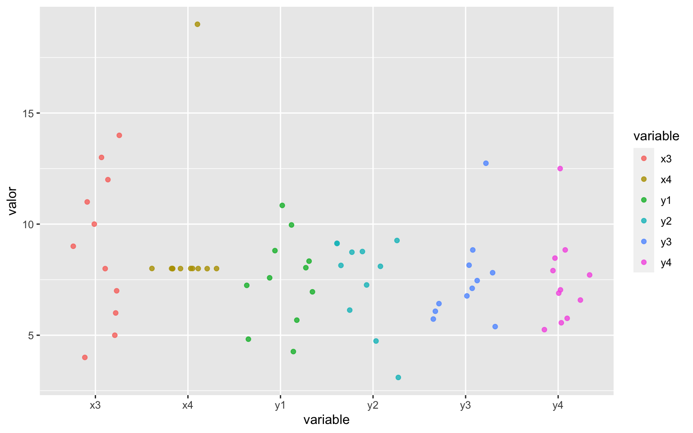

# Análisis exploratorio univariante {#aed-uni}


## La importancia del análisis exploratorio

El análisis exploratorio de datos, y en particular su visualización,
es el primer análisis que se debe hacer sobre cualquier conjunto de datos
antes de abordar otras técnicas estadísticas, sean sencillas o complejas.
La "historia" que nos esté contando el gráfico de los datos, nos guiará
hacia las técnicas de aprendizaje estadístico más adecuadas. Incluso,
en muchas ocasiones será suficiente el análisis exploratorio para tomar
una decisión sobre el problema en estudio. La figura \@ref(fig:dogma1) representa
la esencia de la Estadística y sus métodos. Los datos que analizamos,
provienen de una determinada **población**. Pero estos datos, no son más que
una **muestra**, es decir, un subconjunto de toda la población. Incluso
cuando "creemos" que tenemos todos los datos, debemos tener presente que trabajamos
con muestras, ya que generalmente tomaremos decisiones o llegaremos a conclusiones
sobre el futuro, y esos datos seguro que no los tenemos. Por eso es importante
considerar siempre este paradigma población-muestra. La **Estadística Descriptiva**
se ocupa del análisis exploratorio de datos en sentido amplio, que aplicaremos
sobre los datos concretos de la muestra en este unidad y la siguiente. La
**Inferencia Estadística** hace referencia a los métodos mediante los cuales,
a través de los datos de la muestra, tomaremos decisiones, explicaremos relaciones,
o haremos predicciones sobre la población. Para ello, haremos uso de la 
**Probabilidad**, que veremos en la unidad \@ref(introp), aplicando
el método más adecuado. 
En estos métodos será muy importante considerar el método de obtención de la muestra
que, en términos generales, debe ser representativa de la población para que las
conclusiones sean válidas.
En este tercer módulo del curso veremos algunos de estos métodos.


<div class="figure" style="text-align: center">

<p class="caption">(\#fig:dogma1)La esencia de los métodos estadísticos</p>
</div>

El análisis exploratorio se realiza básicamente mediante dos herramientas: los resúmenes numéricos 
y las visualizaciones gráficas.
Pero antes de aprender a hacer análisis exploratorio con R, vamos a resaltar la
importancia, dentro del análisis exploratorio, de las representaciones gráficas.
Para ello utilizaremos un conjunto de datos llamado "el cuarteto de Anscombe" [@Anscombe1973],
disponible con el nombre `anscombe` en el paquete `datasets` de R base. 
La tabla \@ref(tab:anscombe) muestra
este conjunto de datos. 


Table: (\#tab:anscombe)Conjunto de datos 'anscombe'

| x1| x2| x3| x4|    y1|   y2|    y3|    y4|
|--:|--:|--:|--:|-----:|----:|-----:|-----:|
| 10| 10| 10|  8|  8.04| 9.14|  7.46|  6.58|
|  8|  8|  8|  8|  6.95| 8.14|  6.77|  5.76|
| 13| 13| 13|  8|  7.58| 8.74| 12.74|  7.71|
|  9|  9|  9|  8|  8.81| 8.77|  7.11|  8.84|
| 11| 11| 11|  8|  8.33| 9.26|  7.81|  8.47|
| 14| 14| 14|  8|  9.96| 8.10|  8.84|  7.04|
|  6|  6|  6|  8|  7.24| 6.13|  6.08|  5.25|
|  4|  4|  4| 19|  4.26| 3.10|  5.39| 12.50|
| 12| 12| 12|  8| 10.84| 9.13|  8.15|  5.56|
|  7|  7|  7|  8|  4.82| 7.26|  6.42|  7.91|
|  5|  5|  5|  8|  5.68| 4.74|  5.73|  6.89|


Son 11 filas de 8 variables numéricas, aunque las tres primeras son idénticas. Ya sabemos
resumir los datos con la media de cada variable:


```r
library(dplyr)
#> 
#> Attaching package: 'dplyr'
#> The following objects are masked from 'package:stats':
#> 
#>     filter, lag
#> The following objects are masked from 'package:base':
#> 
#>     intersect, setdiff, setequal, union
anscombe %>% summarise(across(.fns = mean))
#>   x1 x2 x3 x4       y1       y2  y3       y4
#> 1  9  9  9  9 7.500909 7.500909 7.5 7.500909
```

Vemos que la media de las cuatro primeras variables es idéntica, 9. Pero los datos
son muy distintos en la cuarta variable. Las cuatro últimas variables también tienen una media
prácticamente idéntica. Sin embargo los datos también son muy distintos. La figura
\@ref(fig:anscombeuni) es un gráfico de los que aprenderemos a hacer enseguida, y
representa en el eje vertical los valores de las variables, y en el eje horizontal
los nombres de cada variable. Vemos que, a pesar de tener medias prácticamente iguales,
los datos son muy diferentes.

<div class="figure">

<p class="caption">(\#fig:anscombeuni)Representación de las variables del cuarteto de Anscombe</p>
</div>

Pero si en el análisis por separado ya se ve la necesidad de hacer un gráfico,
cuando analizamos las variables conjuntamente, todavía es más evidente. La
figura \@ref(fig:anscombelm) muestra los cuatro gráficos que constituyen
"El cuarteto de Anscombe", y que se puede obtener de la propia ayuda del
conjunto de datos (`example(anscombe)`). La línea de regresión que se ajusta
es prácticamente la misma (veremos la regresión en la unidad \@ref(ch-regresion)).
Además, si calculáramos los coeficientes de correlación entre las variables "x" e
"y" de los cuatro gráficos, obtendríamos el mismo valor: 0.8163. 

<div class="figure">

<p class="caption">(\#fig:anscombelm)Los cuatro gráficos que constituyen 'El cuarteto de Anscombe'</p>
</div>

Es evidente que la relación entre las variables es muy distinta en cada uno
de los casos, y si no visualizamos los datos para elegir el mejor modelo
de regresión y después interpretarlo, podemos estar tomando decisiones
erróneas. 

:::{.rmdcafe data-latex=""}
El cuarteto de Anscombe es muy ilustrativo, os animo a explorar
también _The Datasaurus Dozen:_ [@Matejka2017] en https://www.autodeskresearch.com/publications/samestats.
:::

## Calidad de datos

Una vez hemos identificado los tipos de variables del problema de análisis
de datos que queremos abordar, es necesario que tengamos los datos correctamente
en el software que vamos a utilizar, es decir, es muy importante
comprobar continuamente la **calidad en los datos**.
La importación de datos siempre puede dar problemas (y por _Murphy_, los dará).
Por eso siempre deberíamos comprobar la estructura de los datos después de importar
un conjunto de datos (al menos la primera vez). Uno de los errores
más comunes es que el tipo de datos importado no se
corresponda con el que conceptualmente debe tener la variable. Esto no produce
ningún error al importar, pero sí al analizar los datos. Otros problemas de calidad
tienen que ver con valores atípicos (_outliers_) y con valores perdidos (_missing_).

### Datos atípicos

A medida que llevamos el análisis de datos a aplicaciones reales, es más fácil
que aparezcan observaciones que _estropean_ el análisis porque se salen de lo
esperado en relación con el resto de datos. 
La parte 4 de norma UNE-ISO 16269 [@une:iso:16269:4], un **valor atípico** es
un "Miembro de un pequeño subconjunto de observaciones que parece ser inconsistente con el resto de una muestra dada". La identificación de valores **candidatos** a ser
considerados como atípicos es una labor muy importante para el analista,
ya que pueden influir tanto en los resultados del análisis como en la
técnica a utilizar. Estos valores identificados como posibles valores 
atípicos deben ser investigados y determinar cuál es la causa de esta 
posible desviación. Se suele atribuir a una de las siguientes causas:

1. _Error de medida o de registro_. Esto puede ser debido a la observación del dato
o al propio registro. 

2. _Contaminación_. Los datos provienen de más de una distribución. Por ejemplo,
por estar mezclando datos de grupos que tienen distintas medias. Entonces, los
valores de la distribución _contaninante_ aparecerán como valores atípicos en la
distribución de interés.

3. _Suposición incorrecta sobre la distribución_. La característica
en estudio de la población se supone que sigue una determinada distribución
(por ejemplo normal) pero en realidad sigue otra (por ejemnplo exponencial).
Entonces los valores que _parecen_ atípicos para la distribución normal,
son perfectamente compatibles con la distribución verdadera.

4. _Observaciones excepcionales_. Estos no son verdaderos valores atípicos, 
simplemente han ocurrido por azar, aunque sea muy improbable su ocurrencia.


En el primer caso, hay que encontrar el valor correcto y si
esto no es posible, dar el valor por perdido (missing). En el segundo,
hay que estratificar los datos y realizar el análisis por grupos, separando
las distribuciones. Si son solo unos pocos datos los que por error han contaminado la muestra, se pueden eliminar o dar por perdidos. En el tercer caso,
se modifican las asunciones sobre el modelo de distribución subyacente en la
población. En el último caso los valores deberían permanecer en la muestra,
aunque generalmente se etiquetan erróneamente como valores atípicos por su excepcionalidad.

El análisis de los valores atípicos es importante por varios motivos. Por
una parte, puede dar lugar a descubrimientos interesantes al investigar
por qué han ocurrido (por ejemplo, se ha hecho algo diferente y un proceso
ha mejorado). Por otra parte, muchas medidas y métodos estadísticos son
muy sensibles a observaciones atípicas, y entonces es posible que haya
que usar alternativas robustas. Y en todo caso, nos ayuda a determinar
la adecuada distribución de probabilidad.

La observación de los datos con métodos gráficos a menudo proporciona
suficiente información para identificar valores candidatos a ser
atípicos. En concreto, el gráfico de cajas diseñado por John W. Tukey
[@tukey1977exploratory] y recogido en la norma UNE-ISO 16269 [@une:iso:16269:4]
marca estos valores de forma clara (véase el apartado \@ref(sec:graficosuni)
para una completa explicación de su construcción e interpretación).

Aparte de los métodos gráficos, existen diversos contrastes de hipótesis
para determinar si existen valores atípicos en una muestra de datos
dada una distribución de probabilidad. La norma UNE-ISO 16269 [@une:iso:16269:4]
recoge métodos para la distribución normal y también para otros modelos
de distribución, así como un método general para distribuciones desconocidas
y el test de Cochran para varianza atípica. El paquete `outliers` de R contiene
varias funciones para realizar contrastes de hipótesis sobre valores atípicos
a un conjunto de datos, incluidos el test de Grubbs y el test de Cochran.


En cuanto al tratamiento de datos que contienen valores candidatos a ser
atípicos pero de los que no se ha podido identificar una causa válida para
eliminarlos, deberíamos recurrir al **análisis de datos robusto**, de forma
que las observaciones atípicas no influyan demasiado en los resultados, pero
sin eliminarlas. Otra alternativa es realizar el análisis con y sin valores
candidatos a ser atípicos y comprobar cómo varía ese resultado.

Entre las medidas de centralización robustas se encuentran la mediana y la media recortada
(véase \@ref(sec:centralizacion)), aunque hay otras. También para la 
estimación de la dispersión se encuentran estimadores robustos como la
Mediana de las medianas de las desviaciones absolutas de los pares [@une:iso:16269:4].

Lo dicho hasta ahora sirve para detectar atípicos para una característica.
En conjuntos multivariantes, se pueden observar valores atípicos con respecto
a más de una variable. En particular, en modelos de regresión puede haber 
observaciones influyentes (que posiblemente no son atípicas en la variable
aislada) que influyen en la estimación de los parámetros de forma que el 
resultado no es representativo del conjunto de datos. Los gráficos de 
diagnóstico de R para los modelos lineales proporcionan un gráfico señalando
las observaciones influyentes según la distancia de Cook. También el paquete 
`car` contiene una función (`outlierTest`) con la que podemos obtener
la observación más extrema para la regresión.

Por último, podemos detectar observaciones atípicas con respecto a todo un
conjunto multivariante de datos en escala métrica. Para ello, lo que se hace 
es reducir este conjunto multivariate en univariante, obteniendo unas distancias
de las observaciones a la media muestral del conjunto de datos, estandarizada
mediante la matriz de varianzas-covarianzas de la muestra. Entonces aquellas 
observaciones muy alejadas de esos valores centrales pueden estudiarse como
candidatos a ser valores atípicos multivariantes. En @une:iso:16269:4 se 
proporciona un contraste de hipótesis y un método gráfico para identificar
estos valores atípicos. En el apartado \@ref(aed:distancias) se proporcionan
las funciones necesarias para calcular la distancia de Mahalanobis.


### Valores perdidos (missing values)

La ausencia de valores para determinadas observaciones de nuestra muestra
es otro de los problemas habituales que surgen con los datos. Al igual
que con los valores atípicos, un valor perdido puede ser fruto de un 
error en la recogida o registro de los datos. Si ese error es recuperable,
bastará con añadir el verdadero valor a nuestro conjunto de datos. Si el
valor se da definitivamente por perdido, entonces podemos seguir dos caminos:

1. Realizar el análisis sin considerar las observaciones con valores perdidos.

2. Imputar un valor a las observaciones perdidas.

El primer caso merece la siguiente consideración. Cuando estamos analizando
una sola característica, este camino es único. Por ejemplo, en un conjunto
de 100 observaciones donde faltan 2, se calcula la media con las 98 restantes.
O en un gráfico, se representan solo los valores existentes. Pero cuando
estamos analizando un conjunto multivariante, podemos tener valores perdidos
en todas las variables, o solo en algunas. Entonces podemos tomar diferentes 
decisiones a este respecto. Por ejemplo, si queremos calcular una matriz de
correlaciones, podemos considerar solo las observaciones en las que hay valores
para todas las variables, o eliminar solo los pares de observaciones relevantes
para cada coeficiente de correlación entre dos variables^[En R, la función  `cor`
controla este comportamiento mediante el argumento `use`.].

El segundo camino es más complicado y requiere a su vez elegir el método de
imputación del valor perdido. La imputación más sencilla es simplemente asignar
la media o la mediana como valor representativo de toda la variable. Pero cuando
tenemos conjuntos multivariantes, puede ser más adecuado hacer una imputación 
en función de la información disponible en otras variables. Por ejemplo, si tenemos
una variable de tipo atributo, la media del grupo al que pertenece la
observación será generalmente más adecuada que la media global.

En R tenemos varias alternativas para la imputación de valores perdidos.
La función `impute` del paquete `Hmisc` realiza imputaciones sencillas
(por defecto la mediana). El paquete `mice` realiza imputaciones 
utilizando datos multivariantes con un buen número de opciones.

La investigación de los valores perdidos y su tratamiento adecuado debe ser
siempre una fase importante del proyecto de análisis de datos. Además, 
este análisis se puede solapar con el análisis de los valores atípicos, 
por ejemplo cuando un valor atípico se determina que es un dato erróneo pero
no podemos asegurar cuál es el valor verdadero, entonces tenemos que considerarlo
como perdido y aplicar lo aquí visto.

### Errores comunes

Aparte de los errores en los datos que ya se han tratado, hay que evitar
algunos errores demasiado comunes a la hora de abordar el análisis de datos,
y especialmente la interpretación de resultados. En este apartado 
se mencionan algunos de los más importantes.

**1. Confundir correlación con causalidad.**

Cuando realizamos una regresión de una variable respuesta $Y$ sobre una o
varias variables _explicativas_ $X$, tendemos a pensar que $X$ es la causa
de la variación de $Y$. Esto no siempre es así, y deberíamos tenerlo presente
incluso en aplicaciones en las que conocemos los procesos y "estamos seguro" 
de que es así. Para confirmar que una relación es de causa-efecto, deberíamos
recurrir al Diseño de Experimentos, donde además podremos estudiar las
interacciones.


**2. Falta de parsimonia.**

La parsimoniosidad es un principio científico (véase @wiki:parsimonia)^[En igualdad de condiciones, la explicación más sencilla suele ser la más probable.] que, 
aplicado a la Estadística, significa seleccionar el modelo más reducido y 
simple posible que consiga explicar el fenómeno a estudiar, frente a modelos
más complejos (con muchas variables) con una mínima o nula ganancia de poder
predictivo. En modelos de regresión múltiple, por ejemplo, ninguna variable
cuyo coeficiente no sea significativo se debería incluir en el modelo
final al que llega la investigación.

**2. Interpretación de porcentajes sin fijarse en el tamaño.**

Este error común viene explicado por la **paradoja de Simpson** [@wiki:simpson].
Esta paradoja aparece cuando hay un atributo _oculto_ que no se tiene en cuenta
a la hora de interpretar porcentajes, pudiendo darse el caso de que otro atributo
presenta un porcentaje mayor en una categoría, pero si se analizan por separado
los porcentajes para las categorías del atributo oculto, resulta que el porcentaje
de la categoría que era mayor globalmente, es menor en TODOS los grupos del
atributo oculto.


**3. Informar los valores medios pero no la dispersión.**

La media por sí sola no debería llevar a conclusión alguna. Siempre se debe
analizar conjuntamente la centralidad y dispersión de los datos, ya que 
un valor medio puede estar calculado con valores muy extremos y ocultar
mucha información.

**4. Pasar por alto las hipótesis del modelo.**

Muchos modelos estadísticos requieren, para ser válidos, que se cumplan
ciertas condiciones. Si utilizamos un método que requiere normalidad,
debemos comprobar que los datos provienen de una distribución normal.
Ante la duda, debemos comprobar que un método no paramétrico conduce
a resultados similares.

**5. Sobreajuste (_overfitting_).**

El sobreajuste aparece cuando en un modelo predictivo conseguimos estimar
perfectamente los valores de la muestra, pero el modelo utilizado
no sirve para generalizar a nuevos casos. En _Machine Learning_ es muy fácil
conseguir un modelo perfecto para los datos utilizados, pero pésimo para
nuevos casos. El paradigma de entrenamiento y validación consigue evitar
el sobreajuste.


**6. Utilizar muestras sesgadas como si fueran aleatorias**

Los métodos probabilísticos de uno u otro modo se basan en que los datos
provienen de muestras aleatorias. A pesar de que en muchas situaciones de
análisis de datos esto no lo podamos ni siquiera soñar, es importante tenerlo
en mente para, a la hora de interpretar resultados y llegar a conclusiones,
hacer una reflexión sobre cuánto nos estamos alejando de esa aleatoriedad.
Por ejemplo, si estoy haciendo un estudio de los clientes de una empresa
y solo analizo las transacciones de la primera semana del mes, tengo una
muestra sesgada porque no tengo representado el resto del mes (posiblemente
con un comportamiento diferente).


## Componentes de un gráfico

Dejando aparte las visualizaciones en tres dimensiones, animaciones 3D y realidad virtual,
la visualización de datos que hacemos en la práctica totalidad de los casos es 
en dos dimensiones, es decir, en el plano. Vamos a pensar en este plano como
si fuera un "lienzo" de pintor, independientemente de que el resultado lo vayamos
a ver impreso en un papel o en una pantalla. Este lienzo se irá "poblando" de
"capas" a medida que el pintor vaya añadiendo cosas. Siguiendo con el símil,
empezaremos preparando un espacio para los símbolos con los que representaremos
los datos, es decir, unos **ejes**: horizontal (X) y vertical (Y). A partir de
aquí, representaremos los datos con algún **símbolo geométrico**, como un punto, una línea, 
o cualquier otro. Podremos añadir colores a los símbolos y otras características
como transparencia o tamaño. También añadiremos anotaciones al gráfico, como
las marcas en los ejes, títulos o incluso texto dentro del gráfico. 

La figura \@ref(fig:obra) es una ilustración de Allison Horst^[https://github.com/allisonhorst/stats-illustrations] que simboliza este paradigmna de lienzo y capas. Si pensamos en los distintos elementos del gráfico y los relacionamos con las variables que estamos analizando, será mucho más fácil hacer el gráfico adecuado e interpretarlo.

<div class="figure">

<p class="caption">(\#fig:obra)El dispositivo gráfico como lienzo al que añadimos capas</p>
</div>


## Notación

Antes de comenzar a hacer resúmenes de los datos, vamos a definir la notación que
utilizaremos. Representamos las variables con letras mayúsculas latinas del final 
del alfabeto, como $X, Y, \ldots$. Cada uno de los posibles valores que toma la variable $X$ se representa por $x_i$. Así, $i$ es el identificador o índice para cada observación o clase. Si agrupamos los datos numéricos en intervalos (clases),
$c_i$ es la marca de clase, es decir, el punto central del intervalo. El número total de observaciones lo representamos por $n$, mientras que el número de clases o niveles de una variable categórica o numérica agrupado es $k$.
$n_i$ es el número de observaciones en la clase $i$.

Para representar los parámetros (recordemos, desconocidos) utilizamos letras griegas. Por ejemplo, $\mu$ es la media poblacional, y $\sigma^2$ la varianza poblacional. Para representar estadísticos (recordemos, calculados con los datos de la muestra) se representan con letras minúsculas. Por ejemplo, $\bar{x}$:es la media muestral de la variable $X$, y $s^2$: representa la varianza muestral (cuasivarianza).
$s$ es la desviación típica muestral

Para representar que un estadístico es un estimador, utilizamos la notación
$\hat{[\cdot]}$, que simboliza un estimador de $\cdot$. Por ejemplo,
$s = \hat{\sigma}$ quiere decir que la desviación típica muestral
$s$ es un estimador de la desviación típica poblacional $\sigma$.

## Análisis exploratorio de variables cualitativas

Cuando nuestra variable no se expresa con números, sino con
etiquetas de una determinada característica observada en cada uno
de los elementos en los que se observa la característica, el resumen numérico
que utilizamos es la tabla de frecuencias. Esta tabla de frecuencias
se puede representar gráficamente con un gráfico de barras o con un gráfico
de sectores. Este último no es recomendable ya que proporciona la misma 
información que el gráfico de barras y es mucho más difícil para el ojo
humano distinguir ángulos que alturas.
En variables cualitativas, llamamos a la categoría más frecuente **moda** de la variable.

Para construir la tabla de frecuencias, contamos el número de elementos de cada clase $(n_i)$ que pertenecen a cada uno de los valores $(x_i)$ o de las clases $(c_i)$, que son
las **frecuencias absolutas**. Se pueden calcular también frecuencias relativas $(f_i=n_i/n)$ y acumuladas, 
tanto para las absolutas $(N_i)$ como para las relativas $(F_i)$.


:::{.rmdpractica data-latex=""}
Los datos que se utilizarán en este capítulo para ilustrar los ejemplos se pueden descargar e importar con el siguiente código.

```r
library(dplyr)
download.file("https://lcano.com/data/eaci/lab.xlsx", "lab.xlsx")
lab <- readxl::read_excel("lab.xlsx") |> 
  mutate(fecha = as.Date(fecha))
```
:::


:::{.rmdejemplo data-latex=""}
`<svg aria-hidden="true" role="img" viewBox="0 0 512 512" style="height:1em;width:1em;vertical-align:-0.125em;margin-left:auto;margin-right:auto;font-size:inherit;fill:gold;overflow:visible;position:relative;"><path d="M0 288v160a32 32 0 0 0 32 32h448a32 32 0 0 0 32-32V288zM299.83 32a32 32 0 0 0-21.13 7L0 256h512c0-119.89-94-217.8-212.17-224z"/></svg>`{=html} El laboratorio de una fábrica de quesos recoge datos de los análisis realizados a muestras de quesos de su producción. Se dispone de un conjunto de datos con 1171 filas y
12 columnas. La tabla \@ref(tab:ejlab) muestra las primeras filas de este conjunto de datos.

La columna `tipo` toma tres valores: A, B y C. La tabla \@ref(tab:labfreq) muestra una tabla de frecuencias completa, donde se puede ver de un vistazo, por ejemplo, que la clase con más quesos en el conjunto de datos el tipo C. Las frecuencias relativas se pueden traducir fácilmente a porcentajes.
:::


Table: (\#tab:ejlab)Ejemplo datos de laboratorio

|fecha      | codigo|   est|   mg|  sal|   ph|ebacteria |analista   |tipo | bacteriax| imperfecciones|origen |
|:----------|------:|-----:|----:|----:|----:|:---------|:----------|:----|---------:|--------------:|:------|
|2013-11-01 |      1| 33.50| 14.0|   NA| 6.64|<10       |analista_9 |C    |      8606|              1|Norte  |
|2013-11-01 |      2| 31.05| 13.0|   NA| 6.65|<10       |analista_9 |C    |      3055|              2|Norte  |
|2013-11-01 |      3| 31.42| 13.0| 1.20| 6.66|<10       |analista_9 |C    |     17153|              2|Norte  |
|2013-11-01 |      4| 31.00| 13.0|   NA| 6.60|<10       |analista_9 |C    |     46089|              2|Norte  |
|2013-11-01 |      5| 31.54| 13.5|   NA| 6.60|<10       |analista_9 |C    |      6488|              3|Norte  |
|2013-11-01 |      6| 30.51| 12.5|   NA| 6.63|<10       |analista_9 |C    |      9639|              0|Norte  |
|2013-11-01 |      7| 32.30| 13.0|   NA| 6.64|<10       |analista_9 |C    |      1398|              3|Norte  |
|2013-11-01 |      8| 31.27| 12.5|   NA| 6.63|<10       |analista_9 |C    |     14768|              1|Norte  |
|2013-11-01 |      9| 31.10| 12.5| 1.14| 6.62|<10       |analista_9 |C    |      6644|              3|Norte  |
|2013-11-01 |     10| 30.76| 12.5|   NA| 6.64|<10       |analista_9 |C    |      1887|              2|Norte  |


Table: (\#tab:labfreq)Tabla de frecuencias del tipo de queso

|tipo |   n|     f|    N|     F|
|:----|---:|-----:|----:|-----:|
|A    | 175| 0.149|  175| 0.149|
|B    | 148| 0.126|  323| 0.276|
|C    | 848| 0.724| 1171| 1.000|

:::{.rmdpractica data-latex=""}
**R**

La función `table` de R crea tablas de frecuencias absolutas. Si el resultado se lo pasamos a la función `prop.table`, las convierte en tabla de frecuencias relativas. La función `admargins` añade totales. Para obtener frecuencias acumuladas, podemos usar la función `cumsum`.

Las expresiones siguiente son ejemplos de uso de estas funciones. La tabla \@ref(tab:labfreq) se ha obtenido utilizando funciones del paquete `dplyr`:

    lab |> count(tipo) |> 
      mutate(f = n/nrow(lab), N = cumsum(n),
             F = cumsum(f))
:::


```r
table(lab$tipo)
#> 
#>   A   B   C 
#> 175 148 848
prop.table(table(lab$tipo))
#> 
#>         A         B         C 
#> 0.1494449 0.1263877 0.7241674
addmargins(table(lab$tipo))
#> 
#>    A    B    C  Sum 
#>  175  148  848 1171
cumsum(table(lab$tipo))
#>    A    B    C 
#>  175  323 1171
```


La representación gráfica adecuada para variables cualitativas es el **gráfico de barras**. En este gráfico, representamos las categorías en el eje horizontal (X) y las frecuencias en el eje vertical (Y), y representamos barras cuya altura representa la frecuencia. Se pueden representar frecuencias absolutas o relativas. Los gráficos de sectores también pueden representar variables cualitativas, aunque no se recomiendan porque el ojo humano no es tan bueno distinguiendo ángulos como alturas. En todo caso, si se usa se deberían incluir los valores (frecuencias o porcentajes). El gráfico de barras se puede representar también invirtiendo los ejes (a veces mejora la visualización de las etiquetas), representando líneas en vez de barras, u ordenando las barras según la frecuencia (por defecto este orden es arbitrario, muy a menudo alfabético según las etiquetas).

:::{.rmdpractica data-latex=""}
**R**

La tabla de frecuencias \@ref(tab:labfreq) se puede representar con el siguiente código cuyo resultado se muestra en la figura \@ref(fig:barras1).

El segundo fragmento de código produce la fugura \@ref(fig:tarta) muestra un ejemplo de gráfico de sectores que muestra las etiquetas e incluso algunos estadísticos y contrastes de hipótesis con el paquete {ggstatsplot}.
:::


```r
library(ggplot2)
lab |> 
  ggplot(aes(x = tipo)) +
  geom_bar(fill = "#CB0017") +
  theme_bw() + 
  labs(title = "Tipos de queso", 
       x = "Tipo",
       y = "Frecuencia absoluta")
```

<div class="figure" style="text-align: center">

<p class="caption">(\#fig:barras1, )Ejemplo gráfico de barras variable cualitativa</p>
</div>


```r
library(ggstatsplot)
#> You can cite this package as:
#>      Patil, I. (2021). Visualizations with statistical details: The 'ggstatsplot' approach.
#>      Journal of Open Source Software, 6(61), 3167, doi:10.21105/joss.03167
lab %>% ggpiestats(x = tipo, title = "Fabricación de quesos",
                  legend.title = "Tipo de queso", 
                  bf.message = FALSE,
                  results.subtitle = FALSE)
```

<div class="figure" style="text-align: center">

<p class="caption">(\#fig:tarta)Gráfico de sectores con etiquetas</p>
</div>


## Análisis exploratorio de variables cuantitativas

En el caso de variables discretas,
se puede realizar el mismo análisis exploratorio que para las variables
categóricas, es decir, una tabla de frecuencias y su correspondiente gráfico
de barras. Además de la **moda**, podemos calcular las siguientes medidas
de centralización que resumen los datos:

- **Media**: Función `mean`.
- **Mediana**: Función `median`.

La mediana es una medida de posición central que indica el valor que divide los datos
en dos mitades: los que son menores que la mediana y los que son mayores que la mediana.
La mediana es el **cuantil** 0.5, y se puede calcular cualquier cuantil con
la función `quantile`. Los cuantiles 0.25 y 0.75 se conocen como **cuartiles**
(primer cuartil Q1 y tercer cuartil Q3 respectivamente).
El **mínimo** y el **máximo** son también medidas de posición (funciones `min`)
y `max` respectivamente.

Las medidas de centralización y posición no son suficientes para resumir una
variable, se debe acompañar de medidas de dispersión. Las más importantes:

- **Varianza**: Función `var`
- **Desviación típica**: Función `sd`
- **Rango intercuartílico**: Función `IQR`
- **Desviación absoluta mediana**: Función `mad`
- **Coeficiente de Variación (CV)**: Se calcula fácilmente como `sd(x)/mean(x)`

La función `summary` de R base es una función de las llamadas "genéricas",
que proporciona distintos resultados según la clase del objeto que se le
proporcione como argumento. Para un vector numérico, devuelve
el mínimo, Q1, mediana, media, Q3 y máximo.

Un análisis exploratorio de una variable suele incluir medidas de asimetría
(_skewness_) y aplanamiento (_kurtosis_), así como información del número total
de datos y porcentaje de datos válidos. Se pueden calcular todas estas medidas
con las funciones indicadas, y otras existentes en diversos paquetes. El
paquete `summarytools` proporciona un resumen completo de un vector numérico
con la función `descr`.


Los resúmenes numéricos anteriores sirven tanto para variables discretas como
para continuas. Sin embargo, en el caso de las
variables continuas, se cuenta el número de observaciones (frecuencia) por intervalos (_bins_). Estos
intervalos se pueden calcular utilizando diferentes métodos. Habitualmente,
primero se elige el número de intervalos (entre 5 y 20) y después se calcula la
amplitud de los intervalos dividiendo el rango de valores entre ese número.
Una posible regla
sería el método de Sturges, y se puede obtener el número de intervalos con la función `nclass.Sturges`. Este es el método que utiliza por defecto la función `hist`
de R base, que además redondea la amplitud del intervalo para facilitar la
interpretación. Otra regla muy sencilla es tomar como número de intervalos
entorno a la raíz cuadrada del número total de datos.
Para obtener una tabla de frecuencias de una variable continua basta con
"discretizarla" con la función `cut` y obtener una tabla de frecuencias
igual que con las variables categóricas.


La representación de la tabla de frecuencias de una variable continua
es el **histograma**. Nótese que hay una diferencia importante con el
gráfico de barras en variables discretas. En el histograma, las barras
son contiguas, y si hubiera un espacio sin barra significaría que en
ese intervalo no hay ninguna observación. En el gráfico de barras, las
barras están separadas por un espacio, y hay una barra para cada valor
que toma la variable, no intervalos. Una variable discreta también se
puede visualizar mediante un histograma, que se preferirá cuando el
número de posibles valores sea grande.

El histograma nos da mucha información sobre la variable:

- Si es aproximadamente simétrica
- Si tiene forma de campana (se parece a la distribución normal, que veremos en
la unidad \@ref(ch-prob))
- Si hay valores extremos (alejados del centro) y cómo son de frecuentes
- Si puede haber mezcla de poblaciones (más de una moda)

La función `geom_histogram` del paquete `ggplot2` añade una capa con un
histograma al gráfico. Solamente necesita el mapeo de una variable,
pero los datos siempre se tienen que proporcionar como tabla (`data.frame` o `tibble`).
El color de las barras se controla con el _aesthetics_ `fill`,
y la altura puede representar las frecuencias absolutas (recuentos) o
relativas (proporciones). Al contrario que la función `hist` de R base,
el autor de `ggplot2` ha preferido que el número de barras por defecto sea
un valor inadecuado en la mayoría de las ocasiones (30) argumentando
que el analista debería explorar los datos y experimentar varias opciones
para descubrir la historia completa detrás de los datos. Una vez
decidido el número de intervalos, se lo podemos explicitar con el argumento
`bins`, o alternativamente la anchura de intervalo con `bin_width`.

Una representación alternativa al histograma es la línea de densidad, que sustituye
las barras por una línea continua, generalmente suavizada, que nos da una idea
de la forma de la distribución de forma más esquemática. La función de `ggplot2`
que debemos utilizar en este caso es `geom_density`.

Otra representación gráfica muy útil de las variables continuas es el
gráfico de cajas. La función `geom_boxplot` se encarga de producir este objeto
geométrico, que representa la posición de los datos: máximo y  mínimo (extremos de las líneas o "bigotes"), primer y
tercer cuartil (bordes de la caja) y mediana (línea que cruza la caja).
Si existen valores extremos, candidatos a ser considerados valores atípicos,
se representan separados de las líneas, que llegan al último valor no extremo.

El gráfico de
cajas por sí solo puede estar ocultando información, por lo que se pueden utilizar
variantes como los gráficos de violín, o representar también los puntos con
cierto desplazamiento aleatorio en el eje para una mejor visualización.

Otra visualización básica para una variable numérica es la visualización
secuencial de las observaciones, bien a través de puntos (`geom_point`) o a través de
líneas (`geom_line`). El orden de las observaciones nos pueden indicar cuándo se ha producido
un cambio u otros patrones.

