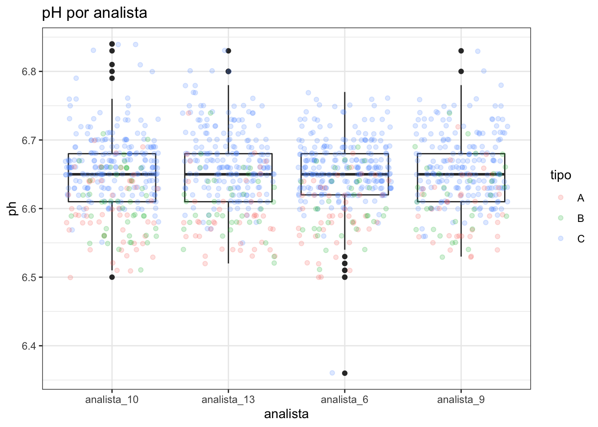
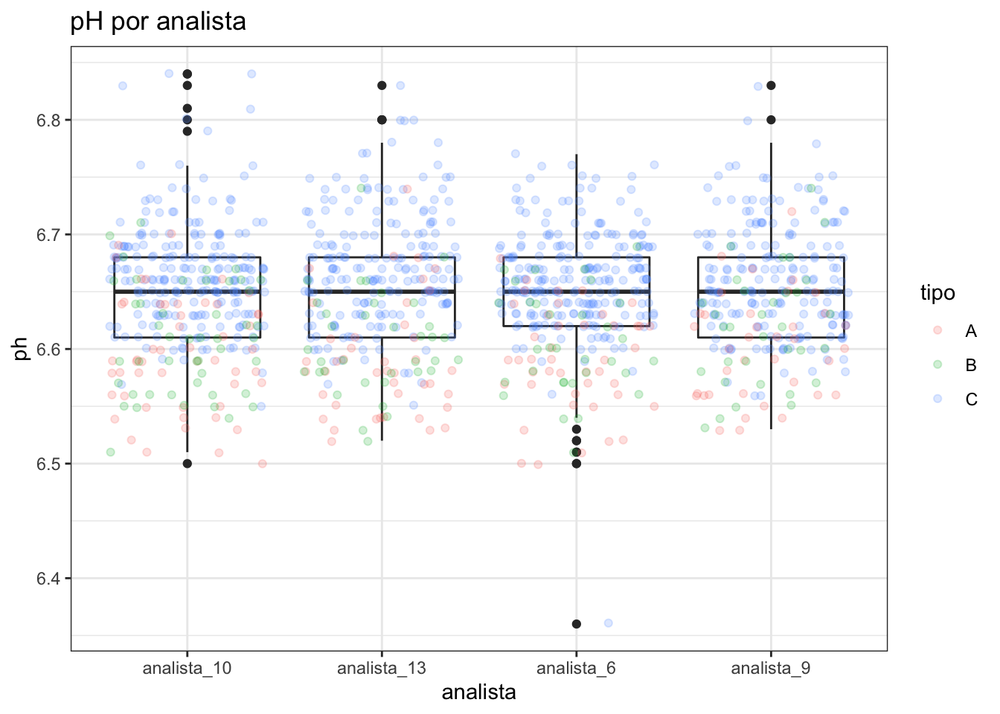
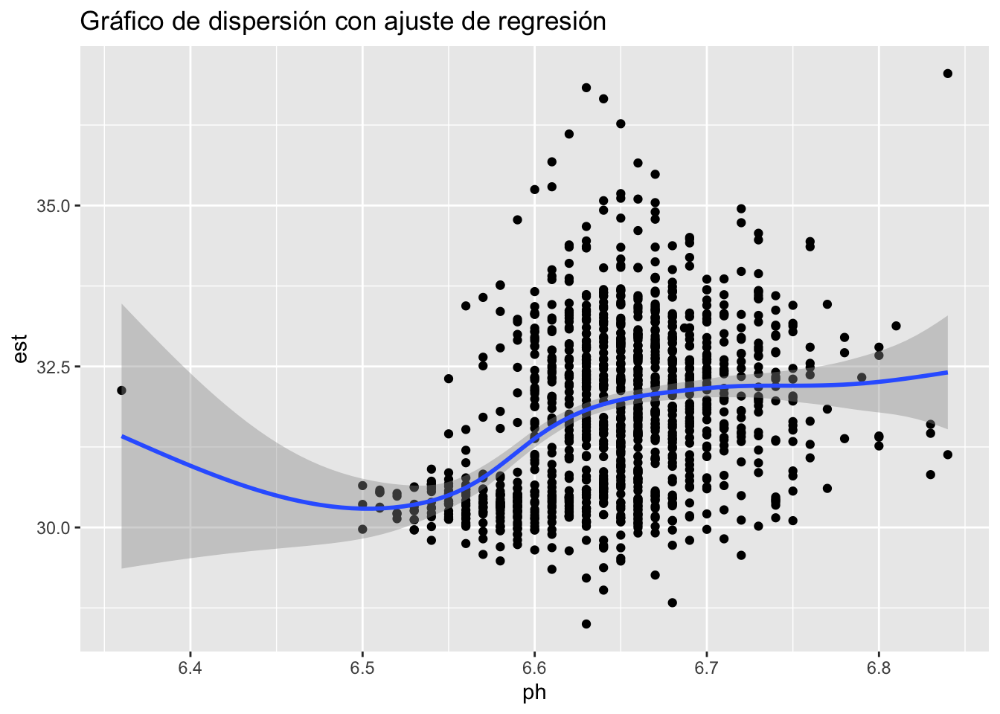
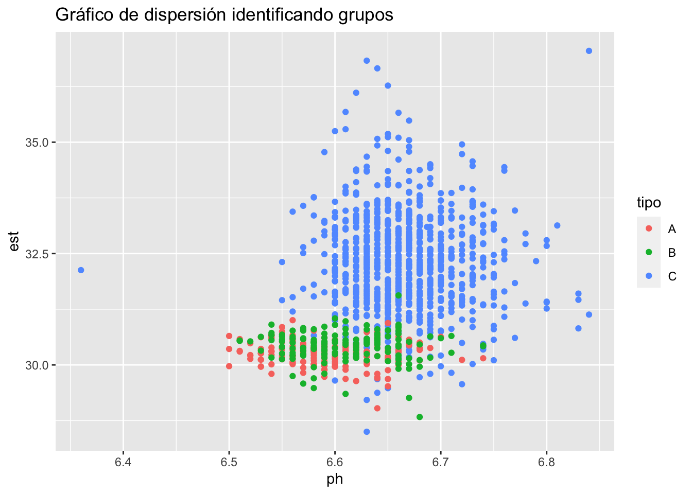
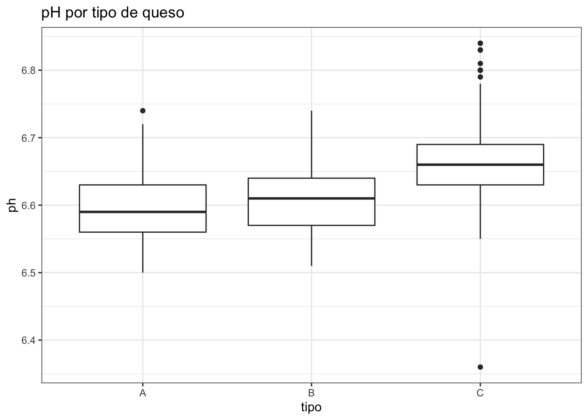
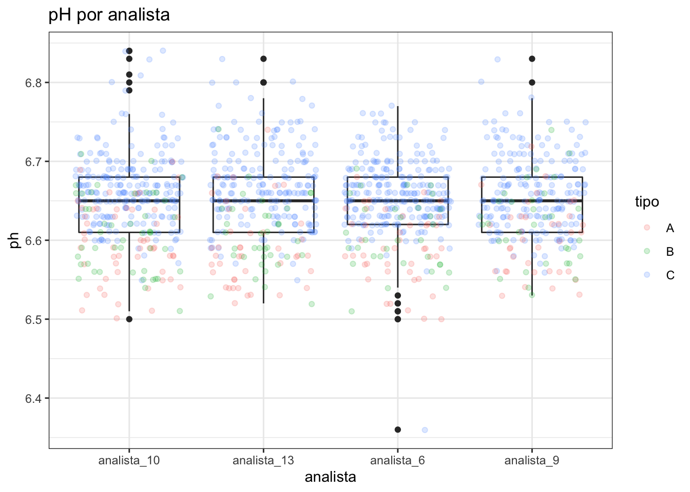

```r
knitr::opts_chunk$set(echo = TRUE, message = FALSE, warning = FALSE, comment = "")
library(tidyverse)
#> ── Attaching packages ─────────────────── tidyverse 1.3.1 ──
#> ✓ ggplot2 3.3.5     ✓ purrr   0.3.4
#> ✓ tibble  3.1.6     ✓ dplyr   1.0.8
#> ✓ tidyr   1.2.0     ✓ stringr 1.4.0
#> ✓ readr   2.1.2     ✓ forcats 0.5.1
#> ── Conflicts ────────────────────── tidyverse_conflicts() ──
#> x dplyr::filter() masks stats::filter()
#> x dplyr::lag()    masks stats::lag()
library(knitr)
library(flextable)
#> 
#> Attaching package: 'flextable'
#> The following object is masked from 'package:purrr':
#> 
#>     compose
```

# Análisis exploratorio bivariante {#aed-bi}


## Datos bivariantes y multivariantes

El análisis univariante es muy útil para describir una única característica de la 
población en estudio. Pero rara vez estudiamos una característica aislada, y lo
habitual es tener conjuntos de datos con varias variables (cuantitativas y cualitativas)
que podemos estudiar por separado (análisis univariante) o conjuntamente (análisis multivariante).

El caso especial del **análisis bivariante** es cuando estudiamos dos características a la vez: $X, Y$.
Nos interesa la **relación** entre ellas, para lo que realizaremos resúmenes numéricos y gráficos.
Los datos bivariantes se encontrarán como pares de valores $x_i, y_i$ para cada
observación $i = 1, \ldots, n$.

Cuando estudiamos más de dos variables, tenemos datos multivariantes. En este caso,
estudiamos las relaciones "dos a dos" entre las variables (como en el caso bivariante) y 
la estructura conjunta. Hay algunas técnicas multivariantes específicas para este último caso.
En este capítulo nos vamos a centrar solo en el primer caso.

## Frecuencias conjuntas, marginales y condicionadas

El primer resumen que podemos hacer de datos bivariante es la tabla de frecuencias conjunta.
Igual que en el caso univariante $n$ es número total de datos, es decir, la frecuencia total.
La frecuencia absoluta conjunta, $n_{ij}$, es el número de observaciones en la clase $i$ de $X$ **y** en la clase $j$ de $Y$.
La frecuencia relativa conjunta es $f_{ij}= \frac{n_{ij}}{n}$.


### Distribución conjunta de frecuencias

Las frecuencias conjuntas se representan en una tabla de doble entrada, 
con los valores de una variable en filas y los de la otra en columnas.
En el interior, se ponen las frecuencias conjuntas (absolutas, marginales o ambas).
Si las dos variables son cualitativas, la tabla se denomina **Tabla de contingencia**.


:::{.rmdejemplo data-latex=""}
La Tabla \@ref(tab:tabs) muestra la tabla de contingencia de los analistas y el tipo de queso en el ejemplo del análisis de la producción de quesos. Asignamos la variable $X$ al Analista (en filas) y la variable $Y$ al Tipo (en columnas).
La Tabla \@ref(tab:trel) muestra la tabla de frecuencias relativas de los mismos datos.
:::


```r
kable(table(lab$analista, lab$tipo),
      caption = "Tabla de contingencia (frecuencias absolutas) de los analistas y el tipo de queso.")
```


Table: (\#tab:tabs)Tabla de contingencia (frecuencias absolutas) de los analistas y el tipo de queso.

|            |  A|  B|   C|
|:-----------|--:|--:|---:|
|analista_10 | 52| 47| 219|
|analista_13 | 42| 36| 198|
|analista_6  | 44| 32| 235|
|analista_9  | 37| 33| 196|


```r
kable(prop.table(table(lab$analista, lab$tipo)), digits = 2, 
      caption = "Tabla de frecuencias relativas de los analistas y el tipo de queso.")
```


Table: (\#tab:trel)Tabla de frecuencias relativas de los analistas y el tipo de queso.

|            |    A|    B|    C|
|:-----------|----:|----:|----:|
|analista_10 | 0.04| 0.04| 0.19|
|analista_13 | 0.04| 0.03| 0.17|
|analista_6  | 0.04| 0.03| 0.20|
|analista_9  | 0.03| 0.03| 0.17|


## Ejemplo: Variables continuas

* Debemos tener los datos agrupados en intervalos (clases)
* $X$ = ph (filas); $Y$ = est (columnas)


```r
histo <- hist(lab$ph, plot = FALSE)
histo2 <- hist(lab$est, plot = FALSE, breaks = 4)
lab <- lab |> 
  mutate(clase_ph = cut(ph, breaks = histo$breaks)) |> 
  mutate(clase_est = cut(est, breaks = histo2$breaks))
levels(lab$clase_ph) <- c(levels(lab$clase_ph), "(6.4,6.45]")
```


```r
kable(table(lab$clase_ph, lab$clase_est))
```


|           | (28,30]| (30,32]| (32,34]| (34,36]| (36,38]|
|:----------|-------:|-------:|-------:|-------:|-------:|
|(6.35,6.4] |       0|       0|       1|       0|       0|
|(6.4,6.45] |       0|       0|       0|       0|       0|
|(6.45,6.5] |       1|       2|       0|       0|       0|
|(6.5,6.55] |       3|      50|       1|       0|       0|
|(6.55,6.6] |      17|     129|      36|       2|       0|
|(6.6,6.65] |      18|     195|     167|      20|       4|
|(6.65,6.7] |       9|     160|     182|      18|       0|
|(6.7,6.75] |       2|      53|      70|       4|       0|
|(6.75,6.8] |       0|       9|      10|       2|       0|
|(6.8,6.85] |       0|       4|       1|       0|       1|


## Frecuencias marginales

* Si partimos de la distribución conjunta, podemos obtener la de cada
una de las variables (marginal) y estudiarla como en el apartado anterior

* Basta con hacer las sumas por columnas $(X)$ o por filas $(Y)$:

* Frecuencias marginales absolutas de $X$: $n_{i.} = \sum\limits_{j = 1}^{n_j}n_{ij}$

* Frecuencias marginales absolutas de $Y$: $n_{j.} = \sum\limits_{i = 1}^{n_i}n_{ij}$

* Igual para relativas


## Ejemplo frecuencias marginales


```r
tabla <- table(lab$clase_ph, lab$clase_est) |> addmargins()
tabla |> kable()
```


|           | (28,30]| (30,32]| (32,34]| (34,36]| (36,38]|  Sum|
|:----------|-------:|-------:|-------:|-------:|-------:|----:|
|(6.35,6.4] |       0|       0|       1|       0|       0|    1|
|(6.4,6.45] |       0|       0|       0|       0|       0|    0|
|(6.45,6.5] |       1|       2|       0|       0|       0|    3|
|(6.5,6.55] |       3|      50|       1|       0|       0|   54|
|(6.55,6.6] |      17|     129|      36|       2|       0|  184|
|(6.6,6.65] |      18|     195|     167|      20|       4|  404|
|(6.65,6.7] |       9|     160|     182|      18|       0|  369|
|(6.7,6.75] |       2|      53|      70|       4|       0|  129|
|(6.75,6.8] |       0|       9|      10|       2|       0|   21|
|(6.8,6.85] |       0|       4|       1|       0|       1|    6|
|Sum        |      50|     602|     468|      46|       5| 1171|


## Ejemplo distribuciones marginales

### De $X$


```r
tabla[, 6]
(6.35,6.4] (6.4,6.45] (6.45,6.5] (6.5,6.55] (6.55,6.6] 
         1          0          3         54        184 
(6.6,6.65] (6.65,6.7] (6.7,6.75] (6.75,6.8] (6.8,6.85] 
       404        369        129         21          6 
       Sum 
      1171 
round(tabla[, 6] / tabla[11, 6], 2)
(6.35,6.4] (6.4,6.45] (6.45,6.5] (6.5,6.55] (6.55,6.6] 
      0.00       0.00       0.00       0.05       0.16 
(6.6,6.65] (6.65,6.7] (6.7,6.75] (6.75,6.8] (6.8,6.85] 
      0.35       0.32       0.11       0.02       0.01 
       Sum 
      1.00 
```


### De $Y$


```r
tabla[11,]
(28,30] (30,32] (32,34] (34,36] (36,38]     Sum 
     50     602     468      46       5    1171 
round(tabla[11,] / tabla[11, 6], 2)
(28,30] (30,32] (32,34] (34,36] (36,38]     Sum 
   0.04    0.51    0.40    0.04    0.00    1.00 
```


## Distribuciones condicionadas

* Distribución de una variable condicionada a algún/os valores de la otra

* Se representa por $Y | X = x_i$

* Se lee "Distribución de $Y$ condicionada a que $X$ es igual a $x_i$

* Son variables univariantes que se pueden estudiar como en el apartado anterior


## Ejemplo distribuciones condicionadas

### De $X | Y \in (30,32]$


```r
tabla[, 2]
(6.35,6.4] (6.4,6.45] (6.45,6.5] (6.5,6.55] (6.55,6.6] 
         0          0          2         50        129 
(6.6,6.65] (6.65,6.7] (6.7,6.75] (6.75,6.8] (6.8,6.85] 
       195        160         53          9          4 
       Sum 
       602 
round(tabla[, 2] / tabla[2, 6], 2)
(6.35,6.4] (6.4,6.45] (6.45,6.5] (6.5,6.55] (6.55,6.6] 
       NaN        NaN        Inf        Inf        Inf 
(6.6,6.65] (6.65,6.7] (6.7,6.75] (6.75,6.8] (6.8,6.85] 
       Inf        Inf        Inf        Inf        Inf 
       Sum 
       Inf 
```


### De $Y | X \in (6.55,6.6]$


```r
tabla[5,]
(28,30] (30,32] (32,34] (34,36] (36,38]     Sum 
     17     129      36       2       0     184 
round(tabla[5,] / tabla[5, 6], 2)
(28,30] (30,32] (32,34] (34,36] (36,38]     Sum 
   0.09    0.70    0.20    0.01    0.00    1.00 
```


## Independencia de variables

* Cuando la distribución de una variable $X$ no varía en función
de los valores de otra variable $Y$, entonces las variables $X$ e
$Y$ son estadísticamente independientes.

* Equivalentemente, la distribución de $X | Y=y_j$ es igual para
cualquier valor de $y_j$

* Si son independientes, se cumple:

$$f_{ij} = f_{i.}\cdot f_{.j}$$


class: center, middle, inverse, toc

## 2.3. Representación gráfica conjunta


## Gráficos de barras para frecuencias conjuntas


```r
lab |> 
  ggplot(aes(x = tipo, fill = analista)) +
  geom_bar() +
  theme_bw()
```




Varias variantes: apiladas, pegadas, saturadas, horizontales


## El gráfico de dispersión


* Ejes cartesianos $X$, $Y$

* Una variable en cada eje

* Un punto en cada par $(x_i, y_i)$

* A simple vista se puede ver si hay relación lineal o de otro tipo


```r
lab |> 
  ggplot(aes(x = ph, y = est)) +
  geom_point()
```




## Gráfico de dispersión "enriquecido"


```r
lab |> 
  ggplot(aes(x = ph, y = est)) +
  geom_point() +
  geom_smooth() +
  labs(title = "Gráfico de dispersión con ajuste de regresión")
```




```r
lab |> 
  ggplot(aes(x = ph, y = est, col = tipo)) +
  geom_point() +
  labs(title = "Gráfico de dispersión identificando grupos")
```




## Gráficos de cajas por grupos


```r
lab |> 
  ggplot(aes(x = tipo, y = ph)) + 
  geom_boxplot() +
  theme_bw() +
  labs(title = "pH por tipo de queso")
```




```r
lab |> 
  ggplot(aes(x = analista, y = ph)) + 
  geom_boxplot() +
  geom_jitter(aes(col = tipo), alpha = 0.2) + 
  theme_bw() +
  labs(title = "pH por analista")
```




### Intro multivariante


