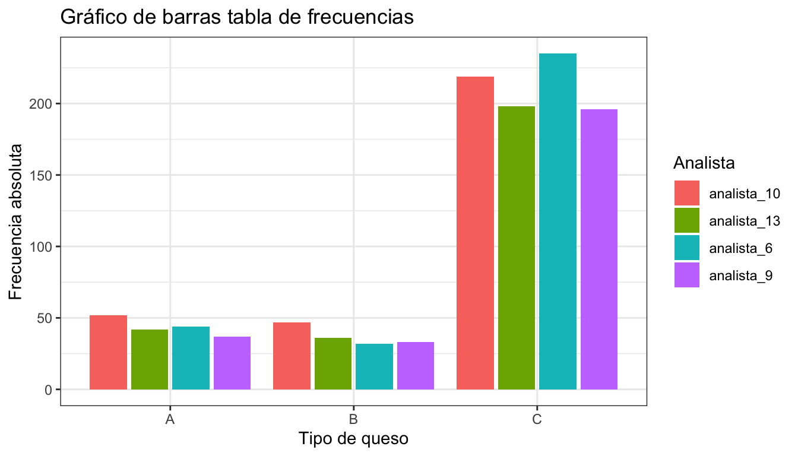
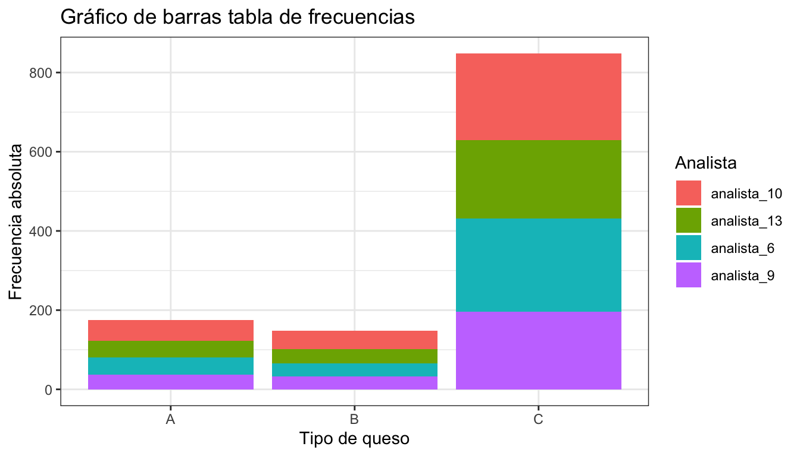
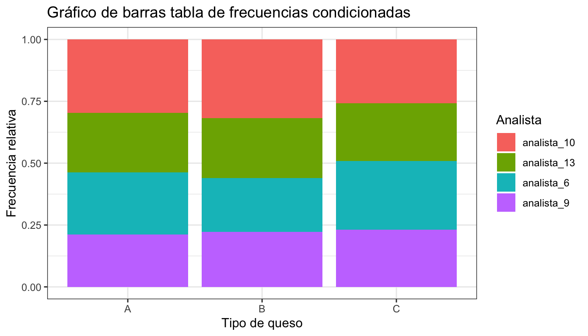
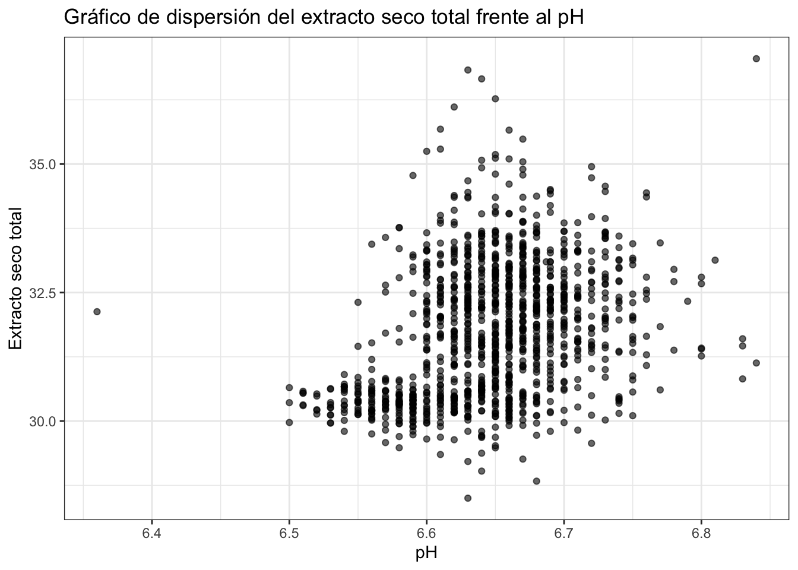
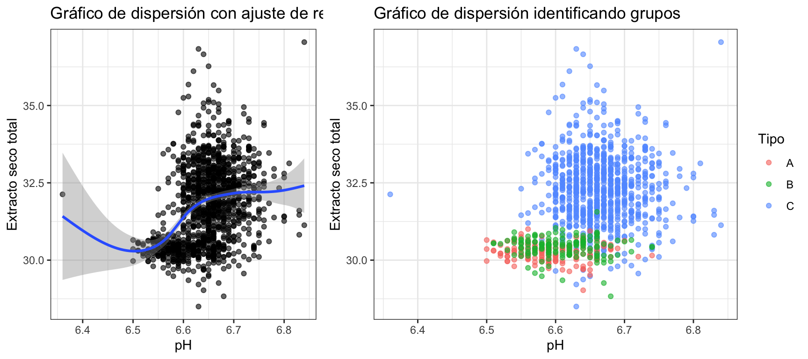
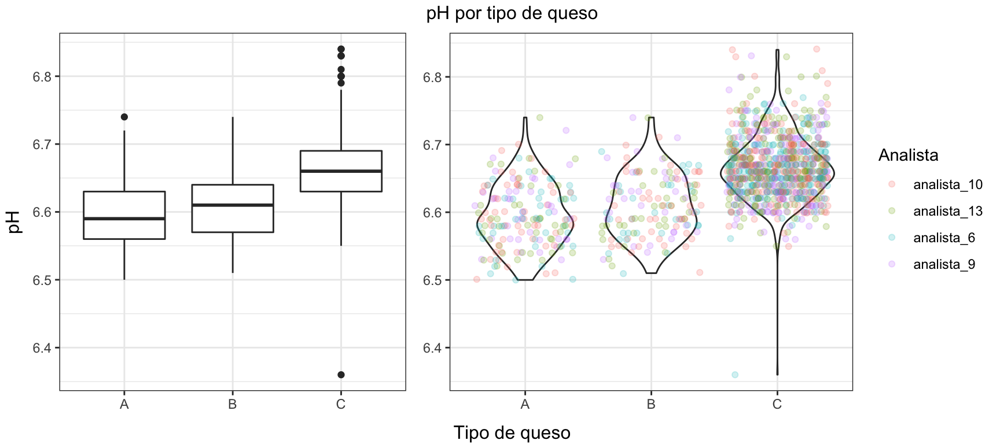
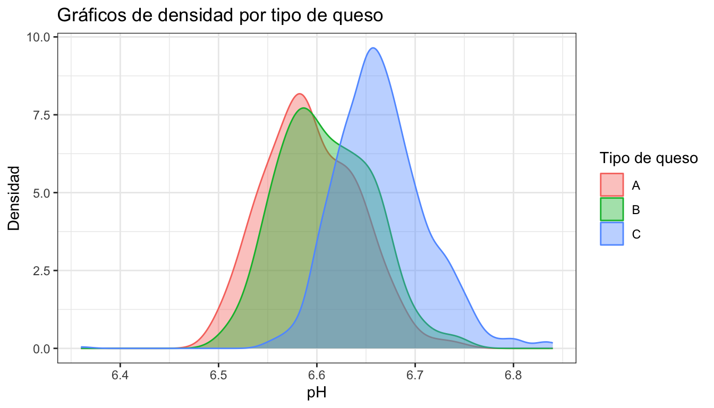
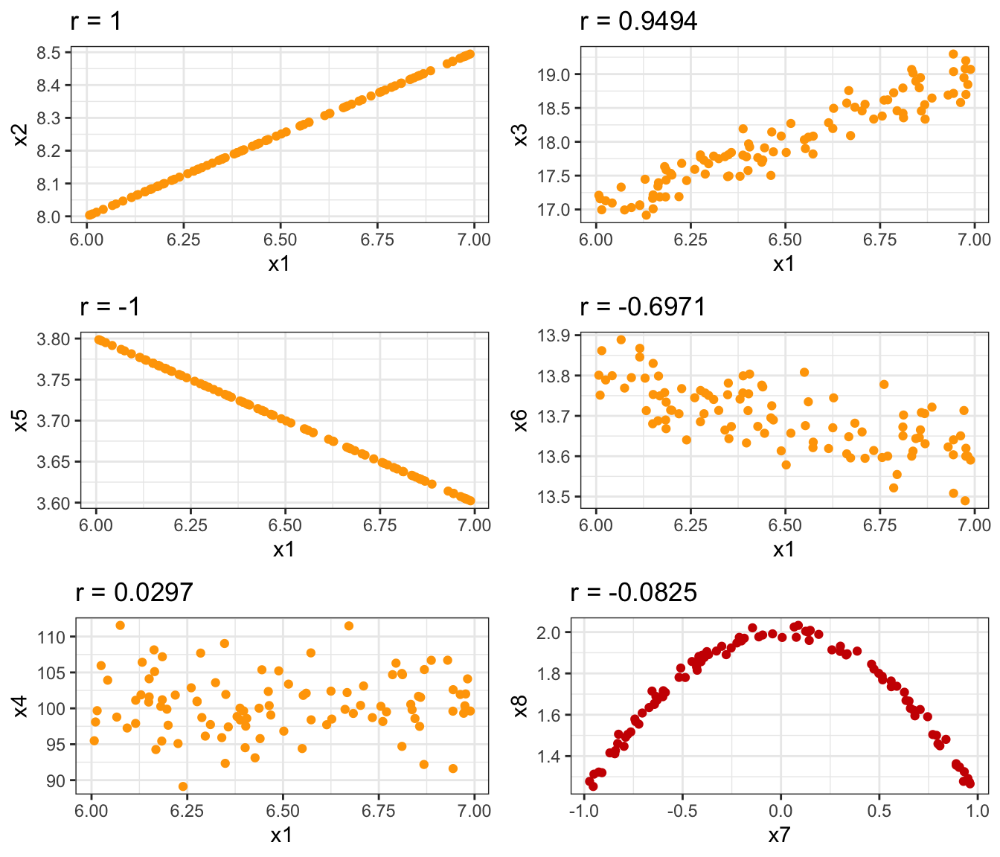
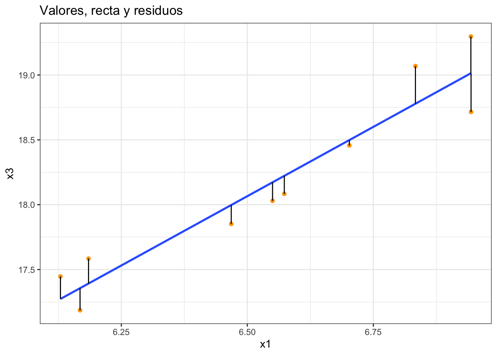
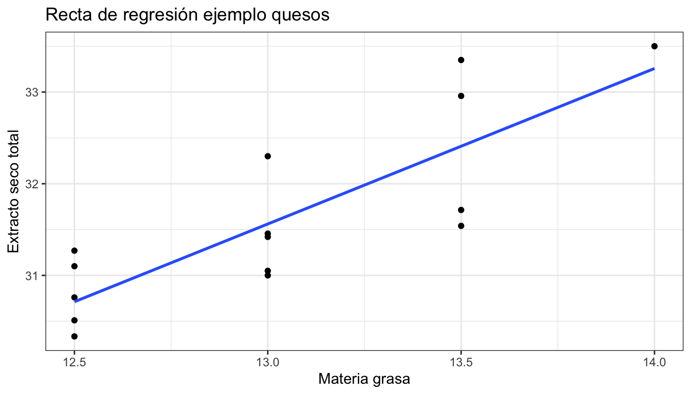

```r
knitr::opts_chunk$set(echo = TRUE, message = FALSE, warning = FALSE, comment = "")
library(tidyverse)
#> ── Attaching packages ─────────────────── tidyverse 1.3.1 ──
#> ✓ ggplot2 3.3.5     ✓ purrr   0.3.4
#> ✓ tibble  3.1.6     ✓ dplyr   1.0.8
#> ✓ tidyr   1.2.0     ✓ stringr 1.4.0
#> ✓ readr   2.1.2     ✓ forcats 0.5.1
#> ── Conflicts ────────────────────── tidyverse_conflicts() ──
#> x dplyr::filter() masks stats::filter()
#> x dplyr::lag()    masks stats::lag()
library(knitr)
library(flextable)
#> 
#> Attaching package: 'flextable'
#> The following object is masked from 'package:purrr':
#> 
#>     compose
library(gt)
library(gridExtra)
#> 
#> Attaching package: 'gridExtra'
#> The following object is masked from 'package:dplyr':
#> 
#>     combine
library(equatiomatic)
```

# Análisis exploratorio bivariante {#aed-bi}


## Datos bivariantes y multivariantes

El análisis univariante es muy útil para describir una única característica de la 
población en estudio. Pero rara vez estudiamos una característica aislada, y lo
habitual es tener conjuntos de datos con varias variables (cuantitativas y cualitativas)
que podemos estudiar por separado (análisis univariante) o conjuntamente (análisis multivariante).

El caso especial del **análisis bivariante** es cuando estudiamos dos características a la vez: $X, Y$.
Nos interesa la **relación** entre ellas, para lo que realizaremos resúmenes numéricos y gráficos.
Los datos bivariantes se encontrarán como pares de valores $(x_i, y_i)$ para cada
observación $i = 1, \ldots, n$.

Cuando estudiamos más de dos variables, tenemos datos multivariantes. En este caso,
estudiamos las relaciones "dos a dos" entre las variables (como en el caso bivariante) y 
la estructura conjunta. Hay algunas técnicas multivariantes específicas para este último caso.
En este capítulo nos vamos a centrar solo en el primer caso.

## Frecuencias conjuntas, marginales y condicionadas

El primer resumen que podemos hacer de datos bivariante es la tabla de frecuencias conjunta.
Igual que en el caso univariante $n$ es número total de datos, es decir, la frecuencia total.
La frecuencia absoluta conjunta, $n_{ij}$, es el número de observaciones en la clase $i$ de $X$ **y** en la clase $j$ de $Y$.
La frecuencia relativa conjunta es $f_{ij}= \frac{n_{ij}}{n}$.


### Distribución conjunta de frecuencias

Las frecuencias conjuntas se representan en una tabla de doble entrada, 
con los valores de una variable en filas y los de la otra en columnas.
En el interior, se ponen las frecuencias conjuntas (absolutas, marginales o ambas).
Si las dos variables son cualitativas, la tabla se denomina **Tabla de contingencia**.


:::{.rmdejemplo data-latex=""}
La Tabla \@ref(tab:tabs) muestra la tabla de contingencia de los analistas y el tipo de queso en el ejemplo del análisis de la producción de quesos. Asignamos la variable $X$ al Analista (en filas) y la variable $Y$ al Tipo (en columnas).
La Tabla \@ref(tab:trel) muestra la tabla de frecuencias relativas de los mismos datos. El número total de datos es
$n= 1171$.
:::


Table: (\#tab:tabs)Tabla de contingencia (frecuencias absolutas) de los analistas y el tipo de queso.

|            |  A|  B|   C|
|:-----------|--:|--:|---:|
|analista_10 | 52| 47| 219|
|analista_13 | 42| 36| 198|
|analista_6  | 44| 32| 235|
|analista_9  | 37| 33| 196|


Table: (\#tab:trel)Tabla de frecuencias relativas de los analistas y el tipo de queso.

|            |    A|    B|    C|
|:-----------|----:|----:|----:|
|analista_10 | 0.04| 0.04| 0.19|
|analista_13 | 0.04| 0.03| 0.17|
|analista_6  | 0.04| 0.03| 0.20|
|analista_9  | 0.03| 0.03| 0.17|


En el caso de variables continuas, debemos tener los datos agrupados en intervalos (clases).


:::{.rmdejemplo data-latex=""}

La tabla \@ref(tab:tcont) contiene las frecuencias absolutas conjuntas
de las variables:

* $X$ = ph (filas); 

* $Y$ = est (columnas)

:::


Table: (\#tab:tcont)Tabla de frecuencias conjunta del pH y el extracto seco total agrupadas en intervalos.

|           | (28,30]| (30,32]| (32,34]| (34,36]| (36,38]|
|:----------|-------:|-------:|-------:|-------:|-------:|
|(6.35,6.4] |       0|       0|       1|       0|       0|
|(6.4,6.45] |       0|       0|       0|       0|       0|
|(6.45,6.5] |       1|       2|       0|       0|       0|
|(6.5,6.55] |       3|      50|       1|       0|       0|
|(6.55,6.6] |      17|     129|      36|       2|       0|
|(6.6,6.65] |      18|     195|     167|      20|       4|
|(6.65,6.7] |       9|     160|     182|      18|       0|
|(6.7,6.75] |       2|      53|      70|       4|       0|
|(6.75,6.8] |       0|       9|      10|       2|       0|
|(6.8,6.85] |       0|       4|       1|       0|       1|


### Distribución marginal

Si partimos de la distribución conjunta, podemos obtener la de cada
una de las variables (marginal) y estudiarla como datos univariantes.
Basta con hacer las sumas por columnas, $(X)$, o por filas, $(Y)$:

* Frecuencias marginales de $X$: 
  + Absolutas: $n_{i\cdot} = \sum\limits_{j = 1}^{n_j}n_{ij}$
  + Relativas: $f_{i\cdot} = \sum\limits_{j = 1}^{n_j}f_{ij}$
  
* Frecuencias marginales de $Y$: 
  + $n_{\cdot j} = \sum\limits_{i = 1}^{n_i}n_{ij}$
  + $f_{\cdot j} = \sum\limits_{i = 1}^{n_i}f_{ij}$

donde $n_i$ es el número de clases de la variable $X$ y $n_j$ es el 
número de clases de la variable $Y$. Análogamente, para frecuencias marginales relativas sumamos las frecuencias relativas conjuntas,
o bien dividimos las frecuencias absolutas marginales entre el número total de datos $n$.


:::{.rmdejemplo data-latex=""}
La tabla \@ref(tab:tmar) contiene las frecuencias marginales como suma de filas y
columnas de la distribución conjunta en la tabla \@ref(tab:tcont). Las distribuciones
marginales de $X$ y de $Y$ por separado se muestran en las tablas \@ref(tab:tmarx) y \@ref(tab:tmary)
respectivamente.
:::


```{=html}
<div id="amswcwxshd" style="overflow-x:auto;overflow-y:auto;width:auto;height:auto;">
<style>html {
  font-family: -apple-system, BlinkMacSystemFont, 'Segoe UI', Roboto, Oxygen, Ubuntu, Cantarell, 'Helvetica Neue', 'Fira Sans', 'Droid Sans', Arial, sans-serif;
}

#amswcwxshd .gt_table {
  display: table;
  border-collapse: collapse;
  margin-left: auto;
  margin-right: auto;
  color: #333333;
  font-size: 16px;
  font-weight: normal;
  font-style: normal;
  background-color: #FFFFFF;
  width: auto;
  border-top-style: solid;
  border-top-width: 2px;
  border-top-color: #A8A8A8;
  border-right-style: none;
  border-right-width: 2px;
  border-right-color: #D3D3D3;
  border-bottom-style: solid;
  border-bottom-width: 2px;
  border-bottom-color: #A8A8A8;
  border-left-style: none;
  border-left-width: 2px;
  border-left-color: #D3D3D3;
}

#amswcwxshd .gt_heading {
  background-color: #FFFFFF;
  text-align: center;
  border-bottom-color: #FFFFFF;
  border-left-style: none;
  border-left-width: 1px;
  border-left-color: #D3D3D3;
  border-right-style: none;
  border-right-width: 1px;
  border-right-color: #D3D3D3;
}

#amswcwxshd .gt_title {
  color: #333333;
  font-size: 125%;
  font-weight: initial;
  padding-top: 4px;
  padding-bottom: 4px;
  padding-left: 5px;
  padding-right: 5px;
  border-bottom-color: #FFFFFF;
  border-bottom-width: 0;
}

#amswcwxshd .gt_subtitle {
  color: #333333;
  font-size: 85%;
  font-weight: initial;
  padding-top: 0;
  padding-bottom: 6px;
  padding-left: 5px;
  padding-right: 5px;
  border-top-color: #FFFFFF;
  border-top-width: 0;
}

#amswcwxshd .gt_bottom_border {
  border-bottom-style: solid;
  border-bottom-width: 2px;
  border-bottom-color: #D3D3D3;
}

#amswcwxshd .gt_col_headings {
  border-top-style: solid;
  border-top-width: 2px;
  border-top-color: #D3D3D3;
  border-bottom-style: solid;
  border-bottom-width: 2px;
  border-bottom-color: #D3D3D3;
  border-left-style: none;
  border-left-width: 1px;
  border-left-color: #D3D3D3;
  border-right-style: none;
  border-right-width: 1px;
  border-right-color: #D3D3D3;
}

#amswcwxshd .gt_col_heading {
  color: #333333;
  background-color: #FFFFFF;
  font-size: 100%;
  font-weight: normal;
  text-transform: inherit;
  border-left-style: none;
  border-left-width: 1px;
  border-left-color: #D3D3D3;
  border-right-style: none;
  border-right-width: 1px;
  border-right-color: #D3D3D3;
  vertical-align: bottom;
  padding-top: 5px;
  padding-bottom: 6px;
  padding-left: 5px;
  padding-right: 5px;
  overflow-x: hidden;
}

#amswcwxshd .gt_column_spanner_outer {
  color: #333333;
  background-color: #FFFFFF;
  font-size: 100%;
  font-weight: normal;
  text-transform: inherit;
  padding-top: 0;
  padding-bottom: 0;
  padding-left: 4px;
  padding-right: 4px;
}

#amswcwxshd .gt_column_spanner_outer:first-child {
  padding-left: 0;
}

#amswcwxshd .gt_column_spanner_outer:last-child {
  padding-right: 0;
}

#amswcwxshd .gt_column_spanner {
  border-bottom-style: solid;
  border-bottom-width: 2px;
  border-bottom-color: #D3D3D3;
  vertical-align: bottom;
  padding-top: 5px;
  padding-bottom: 5px;
  overflow-x: hidden;
  display: inline-block;
  width: 100%;
}

#amswcwxshd .gt_group_heading {
  padding-top: 8px;
  padding-bottom: 8px;
  padding-left: 5px;
  padding-right: 5px;
  color: #333333;
  background-color: #FFFFFF;
  font-size: 100%;
  font-weight: initial;
  text-transform: inherit;
  border-top-style: solid;
  border-top-width: 2px;
  border-top-color: #D3D3D3;
  border-bottom-style: solid;
  border-bottom-width: 2px;
  border-bottom-color: #D3D3D3;
  border-left-style: none;
  border-left-width: 1px;
  border-left-color: #D3D3D3;
  border-right-style: none;
  border-right-width: 1px;
  border-right-color: #D3D3D3;
  vertical-align: middle;
}

#amswcwxshd .gt_empty_group_heading {
  padding: 0.5px;
  color: #333333;
  background-color: #FFFFFF;
  font-size: 100%;
  font-weight: initial;
  border-top-style: solid;
  border-top-width: 2px;
  border-top-color: #D3D3D3;
  border-bottom-style: solid;
  border-bottom-width: 2px;
  border-bottom-color: #D3D3D3;
  vertical-align: middle;
}

#amswcwxshd .gt_from_md > :first-child {
  margin-top: 0;
}

#amswcwxshd .gt_from_md > :last-child {
  margin-bottom: 0;
}

#amswcwxshd .gt_row {
  padding-top: 8px;
  padding-bottom: 8px;
  padding-left: 5px;
  padding-right: 5px;
  margin: 10px;
  border-top-style: solid;
  border-top-width: 1px;
  border-top-color: #D3D3D3;
  border-left-style: none;
  border-left-width: 1px;
  border-left-color: #D3D3D3;
  border-right-style: none;
  border-right-width: 1px;
  border-right-color: #D3D3D3;
  vertical-align: middle;
  overflow-x: hidden;
}

#amswcwxshd .gt_stub {
  color: #333333;
  background-color: #FFFFFF;
  font-size: 100%;
  font-weight: initial;
  text-transform: inherit;
  border-right-style: solid;
  border-right-width: 2px;
  border-right-color: #D3D3D3;
  padding-left: 5px;
  padding-right: 5px;
}

#amswcwxshd .gt_stub_row_group {
  color: #333333;
  background-color: #FFFFFF;
  font-size: 100%;
  font-weight: initial;
  text-transform: inherit;
  border-right-style: solid;
  border-right-width: 2px;
  border-right-color: #D3D3D3;
  padding-left: 5px;
  padding-right: 5px;
  vertical-align: top;
}

#amswcwxshd .gt_row_group_first td {
  border-top-width: 2px;
}

#amswcwxshd .gt_summary_row {
  color: #333333;
  background-color: #FFFFFF;
  text-transform: inherit;
  padding-top: 8px;
  padding-bottom: 8px;
  padding-left: 5px;
  padding-right: 5px;
}

#amswcwxshd .gt_first_summary_row {
  border-top-style: solid;
  border-top-color: #D3D3D3;
}

#amswcwxshd .gt_first_summary_row.thick {
  border-top-width: 2px;
}

#amswcwxshd .gt_last_summary_row {
  padding-top: 8px;
  padding-bottom: 8px;
  padding-left: 5px;
  padding-right: 5px;
  border-bottom-style: solid;
  border-bottom-width: 2px;
  border-bottom-color: #D3D3D3;
}

#amswcwxshd .gt_grand_summary_row {
  color: #333333;
  background-color: #FFFFFF;
  text-transform: inherit;
  padding-top: 8px;
  padding-bottom: 8px;
  padding-left: 5px;
  padding-right: 5px;
}

#amswcwxshd .gt_first_grand_summary_row {
  padding-top: 8px;
  padding-bottom: 8px;
  padding-left: 5px;
  padding-right: 5px;
  border-top-style: double;
  border-top-width: 6px;
  border-top-color: #D3D3D3;
}

#amswcwxshd .gt_striped {
  background-color: rgba(128, 128, 128, 0.05);
}

#amswcwxshd .gt_table_body {
  border-top-style: solid;
  border-top-width: 2px;
  border-top-color: #D3D3D3;
  border-bottom-style: solid;
  border-bottom-width: 2px;
  border-bottom-color: #D3D3D3;
}

#amswcwxshd .gt_footnotes {
  color: #333333;
  background-color: #FFFFFF;
  border-bottom-style: none;
  border-bottom-width: 2px;
  border-bottom-color: #D3D3D3;
  border-left-style: none;
  border-left-width: 2px;
  border-left-color: #D3D3D3;
  border-right-style: none;
  border-right-width: 2px;
  border-right-color: #D3D3D3;
}

#amswcwxshd .gt_footnote {
  margin: 0px;
  font-size: 90%;
  padding-left: 4px;
  padding-right: 4px;
  padding-left: 5px;
  padding-right: 5px;
}

#amswcwxshd .gt_sourcenotes {
  color: #333333;
  background-color: #FFFFFF;
  border-bottom-style: none;
  border-bottom-width: 2px;
  border-bottom-color: #D3D3D3;
  border-left-style: none;
  border-left-width: 2px;
  border-left-color: #D3D3D3;
  border-right-style: none;
  border-right-width: 2px;
  border-right-color: #D3D3D3;
}

#amswcwxshd .gt_sourcenote {
  font-size: 90%;
  padding-top: 4px;
  padding-bottom: 4px;
  padding-left: 5px;
  padding-right: 5px;
}

#amswcwxshd .gt_left {
  text-align: left;
}

#amswcwxshd .gt_center {
  text-align: center;
}

#amswcwxshd .gt_right {
  text-align: right;
  font-variant-numeric: tabular-nums;
}

#amswcwxshd .gt_font_normal {
  font-weight: normal;
}

#amswcwxshd .gt_font_bold {
  font-weight: bold;
}

#amswcwxshd .gt_font_italic {
  font-style: italic;
}

#amswcwxshd .gt_super {
  font-size: 65%;
}

#amswcwxshd .gt_footnote_marks {
  font-style: italic;
  font-weight: normal;
  font-size: 75%;
  vertical-align: 0.4em;
}

#amswcwxshd .gt_asterisk {
  font-size: 100%;
  vertical-align: 0;
}

#amswcwxshd .gt_slash_mark {
  font-size: 0.7em;
  line-height: 0.7em;
  vertical-align: 0.15em;
}

#amswcwxshd .gt_fraction_numerator {
  font-size: 0.6em;
  line-height: 0.6em;
  vertical-align: 0.45em;
}

#amswcwxshd .gt_fraction_denominator {
  font-size: 0.6em;
  line-height: 0.6em;
  vertical-align: -0.05em;
}
</style>
<table class="gt_table">
  <caption>(#tab:tmar)Frecuencias marginales como suma de filas y columnas de la distribución conjunta</caption>
  
  <thead class="gt_col_headings">
    <tr>
      <th class="gt_col_heading gt_columns_bottom_border gt_left" rowspan="1" colspan="1">X\Y</th>
      <th class="gt_col_heading gt_columns_bottom_border gt_right" rowspan="1" colspan="1">(28,30]</th>
      <th class="gt_col_heading gt_columns_bottom_border gt_right" rowspan="1" colspan="1">(30,32]</th>
      <th class="gt_col_heading gt_columns_bottom_border gt_right" rowspan="1" colspan="1">(32,34]</th>
      <th class="gt_col_heading gt_columns_bottom_border gt_right" rowspan="1" colspan="1">(34,36]</th>
      <th class="gt_col_heading gt_columns_bottom_border gt_right" rowspan="1" colspan="1">(36,38]</th>
      <th class="gt_col_heading gt_columns_bottom_border gt_right" rowspan="1" colspan="1">Sum</th>
    </tr>
  </thead>
  <tbody class="gt_table_body">
    <tr><td class="gt_row gt_left">(6.35,6.4]</td>
<td class="gt_row gt_right">0</td>
<td class="gt_row gt_right">0</td>
<td class="gt_row gt_right">1</td>
<td class="gt_row gt_right">0</td>
<td class="gt_row gt_right">0</td>
<td class="gt_row gt_right" style="font-weight: bold;">1</td></tr>
    <tr><td class="gt_row gt_left">(6.4,6.45]</td>
<td class="gt_row gt_right">0</td>
<td class="gt_row gt_right">0</td>
<td class="gt_row gt_right">0</td>
<td class="gt_row gt_right">0</td>
<td class="gt_row gt_right">0</td>
<td class="gt_row gt_right" style="font-weight: bold;">0</td></tr>
    <tr><td class="gt_row gt_left">(6.45,6.5]</td>
<td class="gt_row gt_right">1</td>
<td class="gt_row gt_right">2</td>
<td class="gt_row gt_right">0</td>
<td class="gt_row gt_right">0</td>
<td class="gt_row gt_right">0</td>
<td class="gt_row gt_right" style="font-weight: bold;">3</td></tr>
    <tr><td class="gt_row gt_left">(6.5,6.55]</td>
<td class="gt_row gt_right">3</td>
<td class="gt_row gt_right">50</td>
<td class="gt_row gt_right">1</td>
<td class="gt_row gt_right">0</td>
<td class="gt_row gt_right">0</td>
<td class="gt_row gt_right" style="font-weight: bold;">54</td></tr>
    <tr><td class="gt_row gt_left">(6.55,6.6]</td>
<td class="gt_row gt_right">17</td>
<td class="gt_row gt_right">129</td>
<td class="gt_row gt_right">36</td>
<td class="gt_row gt_right">2</td>
<td class="gt_row gt_right">0</td>
<td class="gt_row gt_right" style="font-weight: bold;">184</td></tr>
    <tr><td class="gt_row gt_left">(6.6,6.65]</td>
<td class="gt_row gt_right">18</td>
<td class="gt_row gt_right">195</td>
<td class="gt_row gt_right">167</td>
<td class="gt_row gt_right">20</td>
<td class="gt_row gt_right">4</td>
<td class="gt_row gt_right" style="font-weight: bold;">404</td></tr>
    <tr><td class="gt_row gt_left">(6.65,6.7]</td>
<td class="gt_row gt_right">9</td>
<td class="gt_row gt_right">160</td>
<td class="gt_row gt_right">182</td>
<td class="gt_row gt_right">18</td>
<td class="gt_row gt_right">0</td>
<td class="gt_row gt_right" style="font-weight: bold;">369</td></tr>
    <tr><td class="gt_row gt_left">(6.7,6.75]</td>
<td class="gt_row gt_right">2</td>
<td class="gt_row gt_right">53</td>
<td class="gt_row gt_right">70</td>
<td class="gt_row gt_right">4</td>
<td class="gt_row gt_right">0</td>
<td class="gt_row gt_right" style="font-weight: bold;">129</td></tr>
    <tr><td class="gt_row gt_left">(6.75,6.8]</td>
<td class="gt_row gt_right">0</td>
<td class="gt_row gt_right">9</td>
<td class="gt_row gt_right">10</td>
<td class="gt_row gt_right">2</td>
<td class="gt_row gt_right">0</td>
<td class="gt_row gt_right" style="font-weight: bold;">21</td></tr>
    <tr><td class="gt_row gt_left">(6.8,6.85]</td>
<td class="gt_row gt_right">0</td>
<td class="gt_row gt_right">4</td>
<td class="gt_row gt_right">1</td>
<td class="gt_row gt_right">0</td>
<td class="gt_row gt_right">1</td>
<td class="gt_row gt_right" style="font-weight: bold;">6</td></tr>
    <tr><td class="gt_row gt_left" style="font-weight: bold;">Sum</td>
<td class="gt_row gt_right" style="font-weight: bold;">50</td>
<td class="gt_row gt_right" style="font-weight: bold;">602</td>
<td class="gt_row gt_right" style="font-weight: bold;">468</td>
<td class="gt_row gt_right" style="font-weight: bold;">46</td>
<td class="gt_row gt_right" style="font-weight: bold;">5</td>
<td class="gt_row gt_right" style="font-weight: bold;">1171</td></tr>
  </tbody>
  
  
</table>
</div>
```


```{=html}
<div id="jwdpidbujy" style="overflow-x:auto;overflow-y:auto;width:auto;height:auto;">
<style>html {
  font-family: -apple-system, BlinkMacSystemFont, 'Segoe UI', Roboto, Oxygen, Ubuntu, Cantarell, 'Helvetica Neue', 'Fira Sans', 'Droid Sans', Arial, sans-serif;
}

#jwdpidbujy .gt_table {
  display: table;
  border-collapse: collapse;
  margin-left: auto;
  margin-right: auto;
  color: #333333;
  font-size: 16px;
  font-weight: normal;
  font-style: normal;
  background-color: #FFFFFF;
  width: auto;
  border-top-style: solid;
  border-top-width: 2px;
  border-top-color: #A8A8A8;
  border-right-style: none;
  border-right-width: 2px;
  border-right-color: #D3D3D3;
  border-bottom-style: solid;
  border-bottom-width: 2px;
  border-bottom-color: #A8A8A8;
  border-left-style: none;
  border-left-width: 2px;
  border-left-color: #D3D3D3;
}

#jwdpidbujy .gt_heading {
  background-color: #FFFFFF;
  text-align: center;
  border-bottom-color: #FFFFFF;
  border-left-style: none;
  border-left-width: 1px;
  border-left-color: #D3D3D3;
  border-right-style: none;
  border-right-width: 1px;
  border-right-color: #D3D3D3;
}

#jwdpidbujy .gt_title {
  color: #333333;
  font-size: 125%;
  font-weight: initial;
  padding-top: 4px;
  padding-bottom: 4px;
  padding-left: 5px;
  padding-right: 5px;
  border-bottom-color: #FFFFFF;
  border-bottom-width: 0;
}

#jwdpidbujy .gt_subtitle {
  color: #333333;
  font-size: 85%;
  font-weight: initial;
  padding-top: 0;
  padding-bottom: 6px;
  padding-left: 5px;
  padding-right: 5px;
  border-top-color: #FFFFFF;
  border-top-width: 0;
}

#jwdpidbujy .gt_bottom_border {
  border-bottom-style: solid;
  border-bottom-width: 2px;
  border-bottom-color: #D3D3D3;
}

#jwdpidbujy .gt_col_headings {
  border-top-style: solid;
  border-top-width: 2px;
  border-top-color: #D3D3D3;
  border-bottom-style: solid;
  border-bottom-width: 2px;
  border-bottom-color: #D3D3D3;
  border-left-style: none;
  border-left-width: 1px;
  border-left-color: #D3D3D3;
  border-right-style: none;
  border-right-width: 1px;
  border-right-color: #D3D3D3;
}

#jwdpidbujy .gt_col_heading {
  color: #333333;
  background-color: #FFFFFF;
  font-size: 100%;
  font-weight: normal;
  text-transform: inherit;
  border-left-style: none;
  border-left-width: 1px;
  border-left-color: #D3D3D3;
  border-right-style: none;
  border-right-width: 1px;
  border-right-color: #D3D3D3;
  vertical-align: bottom;
  padding-top: 5px;
  padding-bottom: 6px;
  padding-left: 5px;
  padding-right: 5px;
  overflow-x: hidden;
}

#jwdpidbujy .gt_column_spanner_outer {
  color: #333333;
  background-color: #FFFFFF;
  font-size: 100%;
  font-weight: normal;
  text-transform: inherit;
  padding-top: 0;
  padding-bottom: 0;
  padding-left: 4px;
  padding-right: 4px;
}

#jwdpidbujy .gt_column_spanner_outer:first-child {
  padding-left: 0;
}

#jwdpidbujy .gt_column_spanner_outer:last-child {
  padding-right: 0;
}

#jwdpidbujy .gt_column_spanner {
  border-bottom-style: solid;
  border-bottom-width: 2px;
  border-bottom-color: #D3D3D3;
  vertical-align: bottom;
  padding-top: 5px;
  padding-bottom: 5px;
  overflow-x: hidden;
  display: inline-block;
  width: 100%;
}

#jwdpidbujy .gt_group_heading {
  padding-top: 8px;
  padding-bottom: 8px;
  padding-left: 5px;
  padding-right: 5px;
  color: #333333;
  background-color: #FFFFFF;
  font-size: 100%;
  font-weight: initial;
  text-transform: inherit;
  border-top-style: solid;
  border-top-width: 2px;
  border-top-color: #D3D3D3;
  border-bottom-style: solid;
  border-bottom-width: 2px;
  border-bottom-color: #D3D3D3;
  border-left-style: none;
  border-left-width: 1px;
  border-left-color: #D3D3D3;
  border-right-style: none;
  border-right-width: 1px;
  border-right-color: #D3D3D3;
  vertical-align: middle;
}

#jwdpidbujy .gt_empty_group_heading {
  padding: 0.5px;
  color: #333333;
  background-color: #FFFFFF;
  font-size: 100%;
  font-weight: initial;
  border-top-style: solid;
  border-top-width: 2px;
  border-top-color: #D3D3D3;
  border-bottom-style: solid;
  border-bottom-width: 2px;
  border-bottom-color: #D3D3D3;
  vertical-align: middle;
}

#jwdpidbujy .gt_from_md > :first-child {
  margin-top: 0;
}

#jwdpidbujy .gt_from_md > :last-child {
  margin-bottom: 0;
}

#jwdpidbujy .gt_row {
  padding-top: 8px;
  padding-bottom: 8px;
  padding-left: 5px;
  padding-right: 5px;
  margin: 10px;
  border-top-style: solid;
  border-top-width: 1px;
  border-top-color: #D3D3D3;
  border-left-style: none;
  border-left-width: 1px;
  border-left-color: #D3D3D3;
  border-right-style: none;
  border-right-width: 1px;
  border-right-color: #D3D3D3;
  vertical-align: middle;
  overflow-x: hidden;
}

#jwdpidbujy .gt_stub {
  color: #333333;
  background-color: #FFFFFF;
  font-size: 100%;
  font-weight: initial;
  text-transform: inherit;
  border-right-style: solid;
  border-right-width: 2px;
  border-right-color: #D3D3D3;
  padding-left: 5px;
  padding-right: 5px;
}

#jwdpidbujy .gt_stub_row_group {
  color: #333333;
  background-color: #FFFFFF;
  font-size: 100%;
  font-weight: initial;
  text-transform: inherit;
  border-right-style: solid;
  border-right-width: 2px;
  border-right-color: #D3D3D3;
  padding-left: 5px;
  padding-right: 5px;
  vertical-align: top;
}

#jwdpidbujy .gt_row_group_first td {
  border-top-width: 2px;
}

#jwdpidbujy .gt_summary_row {
  color: #333333;
  background-color: #FFFFFF;
  text-transform: inherit;
  padding-top: 8px;
  padding-bottom: 8px;
  padding-left: 5px;
  padding-right: 5px;
}

#jwdpidbujy .gt_first_summary_row {
  border-top-style: solid;
  border-top-color: #D3D3D3;
}

#jwdpidbujy .gt_first_summary_row.thick {
  border-top-width: 2px;
}

#jwdpidbujy .gt_last_summary_row {
  padding-top: 8px;
  padding-bottom: 8px;
  padding-left: 5px;
  padding-right: 5px;
  border-bottom-style: solid;
  border-bottom-width: 2px;
  border-bottom-color: #D3D3D3;
}

#jwdpidbujy .gt_grand_summary_row {
  color: #333333;
  background-color: #FFFFFF;
  text-transform: inherit;
  padding-top: 8px;
  padding-bottom: 8px;
  padding-left: 5px;
  padding-right: 5px;
}

#jwdpidbujy .gt_first_grand_summary_row {
  padding-top: 8px;
  padding-bottom: 8px;
  padding-left: 5px;
  padding-right: 5px;
  border-top-style: double;
  border-top-width: 6px;
  border-top-color: #D3D3D3;
}

#jwdpidbujy .gt_striped {
  background-color: rgba(128, 128, 128, 0.05);
}

#jwdpidbujy .gt_table_body {
  border-top-style: solid;
  border-top-width: 2px;
  border-top-color: #D3D3D3;
  border-bottom-style: solid;
  border-bottom-width: 2px;
  border-bottom-color: #D3D3D3;
}

#jwdpidbujy .gt_footnotes {
  color: #333333;
  background-color: #FFFFFF;
  border-bottom-style: none;
  border-bottom-width: 2px;
  border-bottom-color: #D3D3D3;
  border-left-style: none;
  border-left-width: 2px;
  border-left-color: #D3D3D3;
  border-right-style: none;
  border-right-width: 2px;
  border-right-color: #D3D3D3;
}

#jwdpidbujy .gt_footnote {
  margin: 0px;
  font-size: 90%;
  padding-left: 4px;
  padding-right: 4px;
  padding-left: 5px;
  padding-right: 5px;
}

#jwdpidbujy .gt_sourcenotes {
  color: #333333;
  background-color: #FFFFFF;
  border-bottom-style: none;
  border-bottom-width: 2px;
  border-bottom-color: #D3D3D3;
  border-left-style: none;
  border-left-width: 2px;
  border-left-color: #D3D3D3;
  border-right-style: none;
  border-right-width: 2px;
  border-right-color: #D3D3D3;
}

#jwdpidbujy .gt_sourcenote {
  font-size: 90%;
  padding-top: 4px;
  padding-bottom: 4px;
  padding-left: 5px;
  padding-right: 5px;
}

#jwdpidbujy .gt_left {
  text-align: left;
}

#jwdpidbujy .gt_center {
  text-align: center;
}

#jwdpidbujy .gt_right {
  text-align: right;
  font-variant-numeric: tabular-nums;
}

#jwdpidbujy .gt_font_normal {
  font-weight: normal;
}

#jwdpidbujy .gt_font_bold {
  font-weight: bold;
}

#jwdpidbujy .gt_font_italic {
  font-style: italic;
}

#jwdpidbujy .gt_super {
  font-size: 65%;
}

#jwdpidbujy .gt_footnote_marks {
  font-style: italic;
  font-weight: normal;
  font-size: 75%;
  vertical-align: 0.4em;
}

#jwdpidbujy .gt_asterisk {
  font-size: 100%;
  vertical-align: 0;
}

#jwdpidbujy .gt_slash_mark {
  font-size: 0.7em;
  line-height: 0.7em;
  vertical-align: 0.15em;
}

#jwdpidbujy .gt_fraction_numerator {
  font-size: 0.6em;
  line-height: 0.6em;
  vertical-align: 0.45em;
}

#jwdpidbujy .gt_fraction_denominator {
  font-size: 0.6em;
  line-height: 0.6em;
  vertical-align: -0.05em;
}
</style>
<table class="gt_table">
  <caption>(#tab:tmarx)Frecuencias marginales de X (pH)</caption>
  
  <thead class="gt_col_headings">
    <tr>
      <th class="gt_col_heading gt_columns_bottom_border gt_left" rowspan="1" colspan="1">\(x_i\)</th>
      <th class="gt_col_heading gt_columns_bottom_border gt_right" rowspan="1" colspan="1">\(n_{i·}\)</th>
      <th class="gt_col_heading gt_columns_bottom_border gt_right" rowspan="1" colspan="1">\(f_{i·}\)</th>
    </tr>
  </thead>
  <tbody class="gt_table_body">
    <tr><td class="gt_row gt_left">(6.35,6.4]</td>
<td class="gt_row gt_right">1</td>
<td class="gt_row gt_right">0.001</td></tr>
    <tr><td class="gt_row gt_left">(6.4,6.45]</td>
<td class="gt_row gt_right">0</td>
<td class="gt_row gt_right">0.000</td></tr>
    <tr><td class="gt_row gt_left">(6.45,6.5]</td>
<td class="gt_row gt_right">3</td>
<td class="gt_row gt_right">0.003</td></tr>
    <tr><td class="gt_row gt_left">(6.5,6.55]</td>
<td class="gt_row gt_right">54</td>
<td class="gt_row gt_right">0.046</td></tr>
    <tr><td class="gt_row gt_left">(6.55,6.6]</td>
<td class="gt_row gt_right">184</td>
<td class="gt_row gt_right">0.157</td></tr>
    <tr><td class="gt_row gt_left">(6.6,6.65]</td>
<td class="gt_row gt_right">404</td>
<td class="gt_row gt_right">0.345</td></tr>
    <tr><td class="gt_row gt_left">(6.65,6.7]</td>
<td class="gt_row gt_right">369</td>
<td class="gt_row gt_right">0.315</td></tr>
    <tr><td class="gt_row gt_left">(6.7,6.75]</td>
<td class="gt_row gt_right">129</td>
<td class="gt_row gt_right">0.110</td></tr>
    <tr><td class="gt_row gt_left">(6.75,6.8]</td>
<td class="gt_row gt_right">21</td>
<td class="gt_row gt_right">0.018</td></tr>
    <tr><td class="gt_row gt_left">(6.8,6.85]</td>
<td class="gt_row gt_right">6</td>
<td class="gt_row gt_right">0.005</td></tr>
    <tr><td class="gt_row gt_left">Sum</td>
<td class="gt_row gt_right">1171</td>
<td class="gt_row gt_right">1.000</td></tr>
  </tbody>
  
  
</table>
</div>
```


```{=html}
<div id="gyhbwcjinm" style="overflow-x:auto;overflow-y:auto;width:auto;height:auto;">
<style>html {
  font-family: -apple-system, BlinkMacSystemFont, 'Segoe UI', Roboto, Oxygen, Ubuntu, Cantarell, 'Helvetica Neue', 'Fira Sans', 'Droid Sans', Arial, sans-serif;
}

#gyhbwcjinm .gt_table {
  display: table;
  border-collapse: collapse;
  margin-left: auto;
  margin-right: auto;
  color: #333333;
  font-size: 16px;
  font-weight: normal;
  font-style: normal;
  background-color: #FFFFFF;
  width: auto;
  border-top-style: solid;
  border-top-width: 2px;
  border-top-color: #A8A8A8;
  border-right-style: none;
  border-right-width: 2px;
  border-right-color: #D3D3D3;
  border-bottom-style: solid;
  border-bottom-width: 2px;
  border-bottom-color: #A8A8A8;
  border-left-style: none;
  border-left-width: 2px;
  border-left-color: #D3D3D3;
}

#gyhbwcjinm .gt_heading {
  background-color: #FFFFFF;
  text-align: center;
  border-bottom-color: #FFFFFF;
  border-left-style: none;
  border-left-width: 1px;
  border-left-color: #D3D3D3;
  border-right-style: none;
  border-right-width: 1px;
  border-right-color: #D3D3D3;
}

#gyhbwcjinm .gt_title {
  color: #333333;
  font-size: 125%;
  font-weight: initial;
  padding-top: 4px;
  padding-bottom: 4px;
  padding-left: 5px;
  padding-right: 5px;
  border-bottom-color: #FFFFFF;
  border-bottom-width: 0;
}

#gyhbwcjinm .gt_subtitle {
  color: #333333;
  font-size: 85%;
  font-weight: initial;
  padding-top: 0;
  padding-bottom: 6px;
  padding-left: 5px;
  padding-right: 5px;
  border-top-color: #FFFFFF;
  border-top-width: 0;
}

#gyhbwcjinm .gt_bottom_border {
  border-bottom-style: solid;
  border-bottom-width: 2px;
  border-bottom-color: #D3D3D3;
}

#gyhbwcjinm .gt_col_headings {
  border-top-style: solid;
  border-top-width: 2px;
  border-top-color: #D3D3D3;
  border-bottom-style: solid;
  border-bottom-width: 2px;
  border-bottom-color: #D3D3D3;
  border-left-style: none;
  border-left-width: 1px;
  border-left-color: #D3D3D3;
  border-right-style: none;
  border-right-width: 1px;
  border-right-color: #D3D3D3;
}

#gyhbwcjinm .gt_col_heading {
  color: #333333;
  background-color: #FFFFFF;
  font-size: 100%;
  font-weight: normal;
  text-transform: inherit;
  border-left-style: none;
  border-left-width: 1px;
  border-left-color: #D3D3D3;
  border-right-style: none;
  border-right-width: 1px;
  border-right-color: #D3D3D3;
  vertical-align: bottom;
  padding-top: 5px;
  padding-bottom: 6px;
  padding-left: 5px;
  padding-right: 5px;
  overflow-x: hidden;
}

#gyhbwcjinm .gt_column_spanner_outer {
  color: #333333;
  background-color: #FFFFFF;
  font-size: 100%;
  font-weight: normal;
  text-transform: inherit;
  padding-top: 0;
  padding-bottom: 0;
  padding-left: 4px;
  padding-right: 4px;
}

#gyhbwcjinm .gt_column_spanner_outer:first-child {
  padding-left: 0;
}

#gyhbwcjinm .gt_column_spanner_outer:last-child {
  padding-right: 0;
}

#gyhbwcjinm .gt_column_spanner {
  border-bottom-style: solid;
  border-bottom-width: 2px;
  border-bottom-color: #D3D3D3;
  vertical-align: bottom;
  padding-top: 5px;
  padding-bottom: 5px;
  overflow-x: hidden;
  display: inline-block;
  width: 100%;
}

#gyhbwcjinm .gt_group_heading {
  padding-top: 8px;
  padding-bottom: 8px;
  padding-left: 5px;
  padding-right: 5px;
  color: #333333;
  background-color: #FFFFFF;
  font-size: 100%;
  font-weight: initial;
  text-transform: inherit;
  border-top-style: solid;
  border-top-width: 2px;
  border-top-color: #D3D3D3;
  border-bottom-style: solid;
  border-bottom-width: 2px;
  border-bottom-color: #D3D3D3;
  border-left-style: none;
  border-left-width: 1px;
  border-left-color: #D3D3D3;
  border-right-style: none;
  border-right-width: 1px;
  border-right-color: #D3D3D3;
  vertical-align: middle;
}

#gyhbwcjinm .gt_empty_group_heading {
  padding: 0.5px;
  color: #333333;
  background-color: #FFFFFF;
  font-size: 100%;
  font-weight: initial;
  border-top-style: solid;
  border-top-width: 2px;
  border-top-color: #D3D3D3;
  border-bottom-style: solid;
  border-bottom-width: 2px;
  border-bottom-color: #D3D3D3;
  vertical-align: middle;
}

#gyhbwcjinm .gt_from_md > :first-child {
  margin-top: 0;
}

#gyhbwcjinm .gt_from_md > :last-child {
  margin-bottom: 0;
}

#gyhbwcjinm .gt_row {
  padding-top: 8px;
  padding-bottom: 8px;
  padding-left: 5px;
  padding-right: 5px;
  margin: 10px;
  border-top-style: solid;
  border-top-width: 1px;
  border-top-color: #D3D3D3;
  border-left-style: none;
  border-left-width: 1px;
  border-left-color: #D3D3D3;
  border-right-style: none;
  border-right-width: 1px;
  border-right-color: #D3D3D3;
  vertical-align: middle;
  overflow-x: hidden;
}

#gyhbwcjinm .gt_stub {
  color: #333333;
  background-color: #FFFFFF;
  font-size: 100%;
  font-weight: initial;
  text-transform: inherit;
  border-right-style: solid;
  border-right-width: 2px;
  border-right-color: #D3D3D3;
  padding-left: 5px;
  padding-right: 5px;
}

#gyhbwcjinm .gt_stub_row_group {
  color: #333333;
  background-color: #FFFFFF;
  font-size: 100%;
  font-weight: initial;
  text-transform: inherit;
  border-right-style: solid;
  border-right-width: 2px;
  border-right-color: #D3D3D3;
  padding-left: 5px;
  padding-right: 5px;
  vertical-align: top;
}

#gyhbwcjinm .gt_row_group_first td {
  border-top-width: 2px;
}

#gyhbwcjinm .gt_summary_row {
  color: #333333;
  background-color: #FFFFFF;
  text-transform: inherit;
  padding-top: 8px;
  padding-bottom: 8px;
  padding-left: 5px;
  padding-right: 5px;
}

#gyhbwcjinm .gt_first_summary_row {
  border-top-style: solid;
  border-top-color: #D3D3D3;
}

#gyhbwcjinm .gt_first_summary_row.thick {
  border-top-width: 2px;
}

#gyhbwcjinm .gt_last_summary_row {
  padding-top: 8px;
  padding-bottom: 8px;
  padding-left: 5px;
  padding-right: 5px;
  border-bottom-style: solid;
  border-bottom-width: 2px;
  border-bottom-color: #D3D3D3;
}

#gyhbwcjinm .gt_grand_summary_row {
  color: #333333;
  background-color: #FFFFFF;
  text-transform: inherit;
  padding-top: 8px;
  padding-bottom: 8px;
  padding-left: 5px;
  padding-right: 5px;
}

#gyhbwcjinm .gt_first_grand_summary_row {
  padding-top: 8px;
  padding-bottom: 8px;
  padding-left: 5px;
  padding-right: 5px;
  border-top-style: double;
  border-top-width: 6px;
  border-top-color: #D3D3D3;
}

#gyhbwcjinm .gt_striped {
  background-color: rgba(128, 128, 128, 0.05);
}

#gyhbwcjinm .gt_table_body {
  border-top-style: solid;
  border-top-width: 2px;
  border-top-color: #D3D3D3;
  border-bottom-style: solid;
  border-bottom-width: 2px;
  border-bottom-color: #D3D3D3;
}

#gyhbwcjinm .gt_footnotes {
  color: #333333;
  background-color: #FFFFFF;
  border-bottom-style: none;
  border-bottom-width: 2px;
  border-bottom-color: #D3D3D3;
  border-left-style: none;
  border-left-width: 2px;
  border-left-color: #D3D3D3;
  border-right-style: none;
  border-right-width: 2px;
  border-right-color: #D3D3D3;
}

#gyhbwcjinm .gt_footnote {
  margin: 0px;
  font-size: 90%;
  padding-left: 4px;
  padding-right: 4px;
  padding-left: 5px;
  padding-right: 5px;
}

#gyhbwcjinm .gt_sourcenotes {
  color: #333333;
  background-color: #FFFFFF;
  border-bottom-style: none;
  border-bottom-width: 2px;
  border-bottom-color: #D3D3D3;
  border-left-style: none;
  border-left-width: 2px;
  border-left-color: #D3D3D3;
  border-right-style: none;
  border-right-width: 2px;
  border-right-color: #D3D3D3;
}

#gyhbwcjinm .gt_sourcenote {
  font-size: 90%;
  padding-top: 4px;
  padding-bottom: 4px;
  padding-left: 5px;
  padding-right: 5px;
}

#gyhbwcjinm .gt_left {
  text-align: left;
}

#gyhbwcjinm .gt_center {
  text-align: center;
}

#gyhbwcjinm .gt_right {
  text-align: right;
  font-variant-numeric: tabular-nums;
}

#gyhbwcjinm .gt_font_normal {
  font-weight: normal;
}

#gyhbwcjinm .gt_font_bold {
  font-weight: bold;
}

#gyhbwcjinm .gt_font_italic {
  font-style: italic;
}

#gyhbwcjinm .gt_super {
  font-size: 65%;
}

#gyhbwcjinm .gt_footnote_marks {
  font-style: italic;
  font-weight: normal;
  font-size: 75%;
  vertical-align: 0.4em;
}

#gyhbwcjinm .gt_asterisk {
  font-size: 100%;
  vertical-align: 0;
}

#gyhbwcjinm .gt_slash_mark {
  font-size: 0.7em;
  line-height: 0.7em;
  vertical-align: 0.15em;
}

#gyhbwcjinm .gt_fraction_numerator {
  font-size: 0.6em;
  line-height: 0.6em;
  vertical-align: 0.45em;
}

#gyhbwcjinm .gt_fraction_denominator {
  font-size: 0.6em;
  line-height: 0.6em;
  vertical-align: -0.05em;
}
</style>
<table class="gt_table">
  <caption>(#tab:tmary)Frecuencias marginales de Y (est)</caption>
  
  <thead class="gt_col_headings">
    <tr>
      <th class="gt_col_heading gt_columns_bottom_border gt_left" rowspan="1" colspan="1">\(y_j\)</th>
      <th class="gt_col_heading gt_columns_bottom_border gt_right" rowspan="1" colspan="1">\(n_{·j}\)</th>
      <th class="gt_col_heading gt_columns_bottom_border gt_right" rowspan="1" colspan="1">\(f_{·j}\)</th>
    </tr>
  </thead>
  <tbody class="gt_table_body">
    <tr><td class="gt_row gt_left">(28,30]</td>
<td class="gt_row gt_right">50</td>
<td class="gt_row gt_right">0.043</td></tr>
    <tr><td class="gt_row gt_left">(30,32]</td>
<td class="gt_row gt_right">602</td>
<td class="gt_row gt_right">0.514</td></tr>
    <tr><td class="gt_row gt_left">(32,34]</td>
<td class="gt_row gt_right">468</td>
<td class="gt_row gt_right">0.400</td></tr>
    <tr><td class="gt_row gt_left">(34,36]</td>
<td class="gt_row gt_right">46</td>
<td class="gt_row gt_right">0.039</td></tr>
    <tr><td class="gt_row gt_left">(36,38]</td>
<td class="gt_row gt_right">5</td>
<td class="gt_row gt_right">0.004</td></tr>
    <tr><td class="gt_row gt_left">Sum</td>
<td class="gt_row gt_right">1171</td>
<td class="gt_row gt_right">1.000</td></tr>
  </tbody>
  
  
</table>
</div>
```


### Distribución condicionada

La distribución de la variable $Y$ condicionada a un valor $x_i$ de la variable $X$ 
se representa por $Y | X = x_i$. Análogamente se puede definir para varios valores
de $X$, o de $X$ condicionada a $Y$.
Se lee "Distribución de $Y$ condicionada a que $X$ es igual a $x_i$".
Estas distribuciones condicionadas son variables univariantes que se pueden estudiar 
con análisis univariante.

A partir de la distribución conjunta, tomaríamos la fila o columna que se corresponde
con el valor "conocido", es decir, el de la condición. Las frecuencias relativas se calcularán 
dividiendo entre la frecuencia marginal, y no entre la frecuencia total. Por ejemplo:

$$f_{x_i|y=y_j}=\frac{n_{ij}}{n_{·j}}.$$


:::{.rmdejemplo data-latex=""}
La tabla \@ref(tab:tcondx) muestra la distribución De $X$ condicionada a que 
$Y = y_2$. Es decir, como es una variable numérica que hemos dividido en intervalos,
condicionada a que $Y \in (30,32]$. La tabla \@ref(tab:tcondy)
muestra la distribución de $Y$ condicionada a que
$X = x_5$, es decir, de $Y | X \in (6.55,6.6]$.
:::


```{=html}
<div id="vzbrmvlaju" style="overflow-x:auto;overflow-y:auto;width:auto;height:auto;">
<style>html {
  font-family: -apple-system, BlinkMacSystemFont, 'Segoe UI', Roboto, Oxygen, Ubuntu, Cantarell, 'Helvetica Neue', 'Fira Sans', 'Droid Sans', Arial, sans-serif;
}

#vzbrmvlaju .gt_table {
  display: table;
  border-collapse: collapse;
  margin-left: auto;
  margin-right: auto;
  color: #333333;
  font-size: 16px;
  font-weight: normal;
  font-style: normal;
  background-color: #FFFFFF;
  width: auto;
  border-top-style: solid;
  border-top-width: 2px;
  border-top-color: #A8A8A8;
  border-right-style: none;
  border-right-width: 2px;
  border-right-color: #D3D3D3;
  border-bottom-style: solid;
  border-bottom-width: 2px;
  border-bottom-color: #A8A8A8;
  border-left-style: none;
  border-left-width: 2px;
  border-left-color: #D3D3D3;
}

#vzbrmvlaju .gt_heading {
  background-color: #FFFFFF;
  text-align: center;
  border-bottom-color: #FFFFFF;
  border-left-style: none;
  border-left-width: 1px;
  border-left-color: #D3D3D3;
  border-right-style: none;
  border-right-width: 1px;
  border-right-color: #D3D3D3;
}

#vzbrmvlaju .gt_title {
  color: #333333;
  font-size: 125%;
  font-weight: initial;
  padding-top: 4px;
  padding-bottom: 4px;
  padding-left: 5px;
  padding-right: 5px;
  border-bottom-color: #FFFFFF;
  border-bottom-width: 0;
}

#vzbrmvlaju .gt_subtitle {
  color: #333333;
  font-size: 85%;
  font-weight: initial;
  padding-top: 0;
  padding-bottom: 6px;
  padding-left: 5px;
  padding-right: 5px;
  border-top-color: #FFFFFF;
  border-top-width: 0;
}

#vzbrmvlaju .gt_bottom_border {
  border-bottom-style: solid;
  border-bottom-width: 2px;
  border-bottom-color: #D3D3D3;
}

#vzbrmvlaju .gt_col_headings {
  border-top-style: solid;
  border-top-width: 2px;
  border-top-color: #D3D3D3;
  border-bottom-style: solid;
  border-bottom-width: 2px;
  border-bottom-color: #D3D3D3;
  border-left-style: none;
  border-left-width: 1px;
  border-left-color: #D3D3D3;
  border-right-style: none;
  border-right-width: 1px;
  border-right-color: #D3D3D3;
}

#vzbrmvlaju .gt_col_heading {
  color: #333333;
  background-color: #FFFFFF;
  font-size: 100%;
  font-weight: normal;
  text-transform: inherit;
  border-left-style: none;
  border-left-width: 1px;
  border-left-color: #D3D3D3;
  border-right-style: none;
  border-right-width: 1px;
  border-right-color: #D3D3D3;
  vertical-align: bottom;
  padding-top: 5px;
  padding-bottom: 6px;
  padding-left: 5px;
  padding-right: 5px;
  overflow-x: hidden;
}

#vzbrmvlaju .gt_column_spanner_outer {
  color: #333333;
  background-color: #FFFFFF;
  font-size: 100%;
  font-weight: normal;
  text-transform: inherit;
  padding-top: 0;
  padding-bottom: 0;
  padding-left: 4px;
  padding-right: 4px;
}

#vzbrmvlaju .gt_column_spanner_outer:first-child {
  padding-left: 0;
}

#vzbrmvlaju .gt_column_spanner_outer:last-child {
  padding-right: 0;
}

#vzbrmvlaju .gt_column_spanner {
  border-bottom-style: solid;
  border-bottom-width: 2px;
  border-bottom-color: #D3D3D3;
  vertical-align: bottom;
  padding-top: 5px;
  padding-bottom: 5px;
  overflow-x: hidden;
  display: inline-block;
  width: 100%;
}

#vzbrmvlaju .gt_group_heading {
  padding-top: 8px;
  padding-bottom: 8px;
  padding-left: 5px;
  padding-right: 5px;
  color: #333333;
  background-color: #FFFFFF;
  font-size: 100%;
  font-weight: initial;
  text-transform: inherit;
  border-top-style: solid;
  border-top-width: 2px;
  border-top-color: #D3D3D3;
  border-bottom-style: solid;
  border-bottom-width: 2px;
  border-bottom-color: #D3D3D3;
  border-left-style: none;
  border-left-width: 1px;
  border-left-color: #D3D3D3;
  border-right-style: none;
  border-right-width: 1px;
  border-right-color: #D3D3D3;
  vertical-align: middle;
}

#vzbrmvlaju .gt_empty_group_heading {
  padding: 0.5px;
  color: #333333;
  background-color: #FFFFFF;
  font-size: 100%;
  font-weight: initial;
  border-top-style: solid;
  border-top-width: 2px;
  border-top-color: #D3D3D3;
  border-bottom-style: solid;
  border-bottom-width: 2px;
  border-bottom-color: #D3D3D3;
  vertical-align: middle;
}

#vzbrmvlaju .gt_from_md > :first-child {
  margin-top: 0;
}

#vzbrmvlaju .gt_from_md > :last-child {
  margin-bottom: 0;
}

#vzbrmvlaju .gt_row {
  padding-top: 8px;
  padding-bottom: 8px;
  padding-left: 5px;
  padding-right: 5px;
  margin: 10px;
  border-top-style: solid;
  border-top-width: 1px;
  border-top-color: #D3D3D3;
  border-left-style: none;
  border-left-width: 1px;
  border-left-color: #D3D3D3;
  border-right-style: none;
  border-right-width: 1px;
  border-right-color: #D3D3D3;
  vertical-align: middle;
  overflow-x: hidden;
}

#vzbrmvlaju .gt_stub {
  color: #333333;
  background-color: #FFFFFF;
  font-size: 100%;
  font-weight: initial;
  text-transform: inherit;
  border-right-style: solid;
  border-right-width: 2px;
  border-right-color: #D3D3D3;
  padding-left: 5px;
  padding-right: 5px;
}

#vzbrmvlaju .gt_stub_row_group {
  color: #333333;
  background-color: #FFFFFF;
  font-size: 100%;
  font-weight: initial;
  text-transform: inherit;
  border-right-style: solid;
  border-right-width: 2px;
  border-right-color: #D3D3D3;
  padding-left: 5px;
  padding-right: 5px;
  vertical-align: top;
}

#vzbrmvlaju .gt_row_group_first td {
  border-top-width: 2px;
}

#vzbrmvlaju .gt_summary_row {
  color: #333333;
  background-color: #FFFFFF;
  text-transform: inherit;
  padding-top: 8px;
  padding-bottom: 8px;
  padding-left: 5px;
  padding-right: 5px;
}

#vzbrmvlaju .gt_first_summary_row {
  border-top-style: solid;
  border-top-color: #D3D3D3;
}

#vzbrmvlaju .gt_first_summary_row.thick {
  border-top-width: 2px;
}

#vzbrmvlaju .gt_last_summary_row {
  padding-top: 8px;
  padding-bottom: 8px;
  padding-left: 5px;
  padding-right: 5px;
  border-bottom-style: solid;
  border-bottom-width: 2px;
  border-bottom-color: #D3D3D3;
}

#vzbrmvlaju .gt_grand_summary_row {
  color: #333333;
  background-color: #FFFFFF;
  text-transform: inherit;
  padding-top: 8px;
  padding-bottom: 8px;
  padding-left: 5px;
  padding-right: 5px;
}

#vzbrmvlaju .gt_first_grand_summary_row {
  padding-top: 8px;
  padding-bottom: 8px;
  padding-left: 5px;
  padding-right: 5px;
  border-top-style: double;
  border-top-width: 6px;
  border-top-color: #D3D3D3;
}

#vzbrmvlaju .gt_striped {
  background-color: rgba(128, 128, 128, 0.05);
}

#vzbrmvlaju .gt_table_body {
  border-top-style: solid;
  border-top-width: 2px;
  border-top-color: #D3D3D3;
  border-bottom-style: solid;
  border-bottom-width: 2px;
  border-bottom-color: #D3D3D3;
}

#vzbrmvlaju .gt_footnotes {
  color: #333333;
  background-color: #FFFFFF;
  border-bottom-style: none;
  border-bottom-width: 2px;
  border-bottom-color: #D3D3D3;
  border-left-style: none;
  border-left-width: 2px;
  border-left-color: #D3D3D3;
  border-right-style: none;
  border-right-width: 2px;
  border-right-color: #D3D3D3;
}

#vzbrmvlaju .gt_footnote {
  margin: 0px;
  font-size: 90%;
  padding-left: 4px;
  padding-right: 4px;
  padding-left: 5px;
  padding-right: 5px;
}

#vzbrmvlaju .gt_sourcenotes {
  color: #333333;
  background-color: #FFFFFF;
  border-bottom-style: none;
  border-bottom-width: 2px;
  border-bottom-color: #D3D3D3;
  border-left-style: none;
  border-left-width: 2px;
  border-left-color: #D3D3D3;
  border-right-style: none;
  border-right-width: 2px;
  border-right-color: #D3D3D3;
}

#vzbrmvlaju .gt_sourcenote {
  font-size: 90%;
  padding-top: 4px;
  padding-bottom: 4px;
  padding-left: 5px;
  padding-right: 5px;
}

#vzbrmvlaju .gt_left {
  text-align: left;
}

#vzbrmvlaju .gt_center {
  text-align: center;
}

#vzbrmvlaju .gt_right {
  text-align: right;
  font-variant-numeric: tabular-nums;
}

#vzbrmvlaju .gt_font_normal {
  font-weight: normal;
}

#vzbrmvlaju .gt_font_bold {
  font-weight: bold;
}

#vzbrmvlaju .gt_font_italic {
  font-style: italic;
}

#vzbrmvlaju .gt_super {
  font-size: 65%;
}

#vzbrmvlaju .gt_footnote_marks {
  font-style: italic;
  font-weight: normal;
  font-size: 75%;
  vertical-align: 0.4em;
}

#vzbrmvlaju .gt_asterisk {
  font-size: 100%;
  vertical-align: 0;
}

#vzbrmvlaju .gt_slash_mark {
  font-size: 0.7em;
  line-height: 0.7em;
  vertical-align: 0.15em;
}

#vzbrmvlaju .gt_fraction_numerator {
  font-size: 0.6em;
  line-height: 0.6em;
  vertical-align: 0.45em;
}

#vzbrmvlaju .gt_fraction_denominator {
  font-size: 0.6em;
  line-height: 0.6em;
  vertical-align: -0.05em;
}
</style>
<table class="gt_table">
  <caption>(#tab:tcondx)Frecuencias condicionadas de X</caption>
  
  <thead class="gt_col_headings">
    <tr>
      <th class="gt_col_heading gt_columns_bottom_border gt_left" rowspan="1" colspan="1">\(x_i\)</th>
      <th class="gt_col_heading gt_columns_bottom_border gt_right" rowspan="1" colspan="1">\(n_{i|j=2}\)</th>
      <th class="gt_col_heading gt_columns_bottom_border gt_right" rowspan="1" colspan="1">\(f_{i|j=2}\)</th>
    </tr>
  </thead>
  <tbody class="gt_table_body">
    <tr><td class="gt_row gt_left">(6.35,6.4]</td>
<td class="gt_row gt_right">0</td>
<td class="gt_row gt_right">0.000</td></tr>
    <tr><td class="gt_row gt_left">(6.4,6.45]</td>
<td class="gt_row gt_right">0</td>
<td class="gt_row gt_right">0.000</td></tr>
    <tr><td class="gt_row gt_left">(6.45,6.5]</td>
<td class="gt_row gt_right">2</td>
<td class="gt_row gt_right">0.003</td></tr>
    <tr><td class="gt_row gt_left">(6.5,6.55]</td>
<td class="gt_row gt_right">50</td>
<td class="gt_row gt_right">0.083</td></tr>
    <tr><td class="gt_row gt_left">(6.55,6.6]</td>
<td class="gt_row gt_right">129</td>
<td class="gt_row gt_right">0.214</td></tr>
    <tr><td class="gt_row gt_left">(6.6,6.65]</td>
<td class="gt_row gt_right">195</td>
<td class="gt_row gt_right">0.324</td></tr>
    <tr><td class="gt_row gt_left">(6.65,6.7]</td>
<td class="gt_row gt_right">160</td>
<td class="gt_row gt_right">0.266</td></tr>
    <tr><td class="gt_row gt_left">(6.7,6.75]</td>
<td class="gt_row gt_right">53</td>
<td class="gt_row gt_right">0.088</td></tr>
    <tr><td class="gt_row gt_left">(6.75,6.8]</td>
<td class="gt_row gt_right">9</td>
<td class="gt_row gt_right">0.015</td></tr>
    <tr><td class="gt_row gt_left">(6.8,6.85]</td>
<td class="gt_row gt_right">4</td>
<td class="gt_row gt_right">0.007</td></tr>
    <tr><td class="gt_row gt_left">Sum</td>
<td class="gt_row gt_right">602</td>
<td class="gt_row gt_right">1.000</td></tr>
  </tbody>
  
  
</table>
</div>
```


```{=html}
<div id="vehsyngaln" style="overflow-x:auto;overflow-y:auto;width:auto;height:auto;">
<style>html {
  font-family: -apple-system, BlinkMacSystemFont, 'Segoe UI', Roboto, Oxygen, Ubuntu, Cantarell, 'Helvetica Neue', 'Fira Sans', 'Droid Sans', Arial, sans-serif;
}

#vehsyngaln .gt_table {
  display: table;
  border-collapse: collapse;
  margin-left: auto;
  margin-right: auto;
  color: #333333;
  font-size: 16px;
  font-weight: normal;
  font-style: normal;
  background-color: #FFFFFF;
  width: auto;
  border-top-style: solid;
  border-top-width: 2px;
  border-top-color: #A8A8A8;
  border-right-style: none;
  border-right-width: 2px;
  border-right-color: #D3D3D3;
  border-bottom-style: solid;
  border-bottom-width: 2px;
  border-bottom-color: #A8A8A8;
  border-left-style: none;
  border-left-width: 2px;
  border-left-color: #D3D3D3;
}

#vehsyngaln .gt_heading {
  background-color: #FFFFFF;
  text-align: center;
  border-bottom-color: #FFFFFF;
  border-left-style: none;
  border-left-width: 1px;
  border-left-color: #D3D3D3;
  border-right-style: none;
  border-right-width: 1px;
  border-right-color: #D3D3D3;
}

#vehsyngaln .gt_title {
  color: #333333;
  font-size: 125%;
  font-weight: initial;
  padding-top: 4px;
  padding-bottom: 4px;
  padding-left: 5px;
  padding-right: 5px;
  border-bottom-color: #FFFFFF;
  border-bottom-width: 0;
}

#vehsyngaln .gt_subtitle {
  color: #333333;
  font-size: 85%;
  font-weight: initial;
  padding-top: 0;
  padding-bottom: 6px;
  padding-left: 5px;
  padding-right: 5px;
  border-top-color: #FFFFFF;
  border-top-width: 0;
}

#vehsyngaln .gt_bottom_border {
  border-bottom-style: solid;
  border-bottom-width: 2px;
  border-bottom-color: #D3D3D3;
}

#vehsyngaln .gt_col_headings {
  border-top-style: solid;
  border-top-width: 2px;
  border-top-color: #D3D3D3;
  border-bottom-style: solid;
  border-bottom-width: 2px;
  border-bottom-color: #D3D3D3;
  border-left-style: none;
  border-left-width: 1px;
  border-left-color: #D3D3D3;
  border-right-style: none;
  border-right-width: 1px;
  border-right-color: #D3D3D3;
}

#vehsyngaln .gt_col_heading {
  color: #333333;
  background-color: #FFFFFF;
  font-size: 100%;
  font-weight: normal;
  text-transform: inherit;
  border-left-style: none;
  border-left-width: 1px;
  border-left-color: #D3D3D3;
  border-right-style: none;
  border-right-width: 1px;
  border-right-color: #D3D3D3;
  vertical-align: bottom;
  padding-top: 5px;
  padding-bottom: 6px;
  padding-left: 5px;
  padding-right: 5px;
  overflow-x: hidden;
}

#vehsyngaln .gt_column_spanner_outer {
  color: #333333;
  background-color: #FFFFFF;
  font-size: 100%;
  font-weight: normal;
  text-transform: inherit;
  padding-top: 0;
  padding-bottom: 0;
  padding-left: 4px;
  padding-right: 4px;
}

#vehsyngaln .gt_column_spanner_outer:first-child {
  padding-left: 0;
}

#vehsyngaln .gt_column_spanner_outer:last-child {
  padding-right: 0;
}

#vehsyngaln .gt_column_spanner {
  border-bottom-style: solid;
  border-bottom-width: 2px;
  border-bottom-color: #D3D3D3;
  vertical-align: bottom;
  padding-top: 5px;
  padding-bottom: 5px;
  overflow-x: hidden;
  display: inline-block;
  width: 100%;
}

#vehsyngaln .gt_group_heading {
  padding-top: 8px;
  padding-bottom: 8px;
  padding-left: 5px;
  padding-right: 5px;
  color: #333333;
  background-color: #FFFFFF;
  font-size: 100%;
  font-weight: initial;
  text-transform: inherit;
  border-top-style: solid;
  border-top-width: 2px;
  border-top-color: #D3D3D3;
  border-bottom-style: solid;
  border-bottom-width: 2px;
  border-bottom-color: #D3D3D3;
  border-left-style: none;
  border-left-width: 1px;
  border-left-color: #D3D3D3;
  border-right-style: none;
  border-right-width: 1px;
  border-right-color: #D3D3D3;
  vertical-align: middle;
}

#vehsyngaln .gt_empty_group_heading {
  padding: 0.5px;
  color: #333333;
  background-color: #FFFFFF;
  font-size: 100%;
  font-weight: initial;
  border-top-style: solid;
  border-top-width: 2px;
  border-top-color: #D3D3D3;
  border-bottom-style: solid;
  border-bottom-width: 2px;
  border-bottom-color: #D3D3D3;
  vertical-align: middle;
}

#vehsyngaln .gt_from_md > :first-child {
  margin-top: 0;
}

#vehsyngaln .gt_from_md > :last-child {
  margin-bottom: 0;
}

#vehsyngaln .gt_row {
  padding-top: 8px;
  padding-bottom: 8px;
  padding-left: 5px;
  padding-right: 5px;
  margin: 10px;
  border-top-style: solid;
  border-top-width: 1px;
  border-top-color: #D3D3D3;
  border-left-style: none;
  border-left-width: 1px;
  border-left-color: #D3D3D3;
  border-right-style: none;
  border-right-width: 1px;
  border-right-color: #D3D3D3;
  vertical-align: middle;
  overflow-x: hidden;
}

#vehsyngaln .gt_stub {
  color: #333333;
  background-color: #FFFFFF;
  font-size: 100%;
  font-weight: initial;
  text-transform: inherit;
  border-right-style: solid;
  border-right-width: 2px;
  border-right-color: #D3D3D3;
  padding-left: 5px;
  padding-right: 5px;
}

#vehsyngaln .gt_stub_row_group {
  color: #333333;
  background-color: #FFFFFF;
  font-size: 100%;
  font-weight: initial;
  text-transform: inherit;
  border-right-style: solid;
  border-right-width: 2px;
  border-right-color: #D3D3D3;
  padding-left: 5px;
  padding-right: 5px;
  vertical-align: top;
}

#vehsyngaln .gt_row_group_first td {
  border-top-width: 2px;
}

#vehsyngaln .gt_summary_row {
  color: #333333;
  background-color: #FFFFFF;
  text-transform: inherit;
  padding-top: 8px;
  padding-bottom: 8px;
  padding-left: 5px;
  padding-right: 5px;
}

#vehsyngaln .gt_first_summary_row {
  border-top-style: solid;
  border-top-color: #D3D3D3;
}

#vehsyngaln .gt_first_summary_row.thick {
  border-top-width: 2px;
}

#vehsyngaln .gt_last_summary_row {
  padding-top: 8px;
  padding-bottom: 8px;
  padding-left: 5px;
  padding-right: 5px;
  border-bottom-style: solid;
  border-bottom-width: 2px;
  border-bottom-color: #D3D3D3;
}

#vehsyngaln .gt_grand_summary_row {
  color: #333333;
  background-color: #FFFFFF;
  text-transform: inherit;
  padding-top: 8px;
  padding-bottom: 8px;
  padding-left: 5px;
  padding-right: 5px;
}

#vehsyngaln .gt_first_grand_summary_row {
  padding-top: 8px;
  padding-bottom: 8px;
  padding-left: 5px;
  padding-right: 5px;
  border-top-style: double;
  border-top-width: 6px;
  border-top-color: #D3D3D3;
}

#vehsyngaln .gt_striped {
  background-color: rgba(128, 128, 128, 0.05);
}

#vehsyngaln .gt_table_body {
  border-top-style: solid;
  border-top-width: 2px;
  border-top-color: #D3D3D3;
  border-bottom-style: solid;
  border-bottom-width: 2px;
  border-bottom-color: #D3D3D3;
}

#vehsyngaln .gt_footnotes {
  color: #333333;
  background-color: #FFFFFF;
  border-bottom-style: none;
  border-bottom-width: 2px;
  border-bottom-color: #D3D3D3;
  border-left-style: none;
  border-left-width: 2px;
  border-left-color: #D3D3D3;
  border-right-style: none;
  border-right-width: 2px;
  border-right-color: #D3D3D3;
}

#vehsyngaln .gt_footnote {
  margin: 0px;
  font-size: 90%;
  padding-left: 4px;
  padding-right: 4px;
  padding-left: 5px;
  padding-right: 5px;
}

#vehsyngaln .gt_sourcenotes {
  color: #333333;
  background-color: #FFFFFF;
  border-bottom-style: none;
  border-bottom-width: 2px;
  border-bottom-color: #D3D3D3;
  border-left-style: none;
  border-left-width: 2px;
  border-left-color: #D3D3D3;
  border-right-style: none;
  border-right-width: 2px;
  border-right-color: #D3D3D3;
}

#vehsyngaln .gt_sourcenote {
  font-size: 90%;
  padding-top: 4px;
  padding-bottom: 4px;
  padding-left: 5px;
  padding-right: 5px;
}

#vehsyngaln .gt_left {
  text-align: left;
}

#vehsyngaln .gt_center {
  text-align: center;
}

#vehsyngaln .gt_right {
  text-align: right;
  font-variant-numeric: tabular-nums;
}

#vehsyngaln .gt_font_normal {
  font-weight: normal;
}

#vehsyngaln .gt_font_bold {
  font-weight: bold;
}

#vehsyngaln .gt_font_italic {
  font-style: italic;
}

#vehsyngaln .gt_super {
  font-size: 65%;
}

#vehsyngaln .gt_footnote_marks {
  font-style: italic;
  font-weight: normal;
  font-size: 75%;
  vertical-align: 0.4em;
}

#vehsyngaln .gt_asterisk {
  font-size: 100%;
  vertical-align: 0;
}

#vehsyngaln .gt_slash_mark {
  font-size: 0.7em;
  line-height: 0.7em;
  vertical-align: 0.15em;
}

#vehsyngaln .gt_fraction_numerator {
  font-size: 0.6em;
  line-height: 0.6em;
  vertical-align: 0.45em;
}

#vehsyngaln .gt_fraction_denominator {
  font-size: 0.6em;
  line-height: 0.6em;
  vertical-align: -0.05em;
}
</style>
<table class="gt_table">
  <caption>(#tab:tcondy)Frecuencias condicionadas de Y</caption>
  
  <thead class="gt_col_headings">
    <tr>
      <th class="gt_col_heading gt_columns_bottom_border gt_left" rowspan="1" colspan="1">\(y_{j}\)</th>
      <th class="gt_col_heading gt_columns_bottom_border gt_right" rowspan="1" colspan="1">\(n_{j|i=5}\)</th>
      <th class="gt_col_heading gt_columns_bottom_border gt_right" rowspan="1" colspan="1">\(f_{j|i=5}\)</th>
    </tr>
  </thead>
  <tbody class="gt_table_body">
    <tr><td class="gt_row gt_left">(28,30]</td>
<td class="gt_row gt_right">17</td>
<td class="gt_row gt_right">0.092</td></tr>
    <tr><td class="gt_row gt_left">(30,32]</td>
<td class="gt_row gt_right">129</td>
<td class="gt_row gt_right">0.701</td></tr>
    <tr><td class="gt_row gt_left">(32,34]</td>
<td class="gt_row gt_right">36</td>
<td class="gt_row gt_right">0.196</td></tr>
    <tr><td class="gt_row gt_left">(34,36]</td>
<td class="gt_row gt_right">2</td>
<td class="gt_row gt_right">0.011</td></tr>
    <tr><td class="gt_row gt_left">(36,38]</td>
<td class="gt_row gt_right">0</td>
<td class="gt_row gt_right">0.000</td></tr>
    <tr><td class="gt_row gt_left">Sum</td>
<td class="gt_row gt_right">184</td>
<td class="gt_row gt_right">1.000</td></tr>
  </tbody>
  
  
</table>
</div>
```


### Independencia de variables

Cuando la distribución de una variable $X$ no varía en función
de los valores de otra variable $Y$, entonces las variables $X$ e
$Y$ son estadísticamente independientes. Equivalentemente, la distribución de $X | Y=y_j$ es igual para
cualquier valor de $y_j$. Es decir, si son independientes se cumple:

$$f_{ij} = f_{i.}\cdot f_{.j} \;\forall i, j.$$


## Representación gráfica conjunta

### Gráficos de barras

Al igual que en el caso univariante, la mejor representación de tablas de
frecuencias para variables cualitativas y para variables numéricas discretas
sigue siendo el gráfico de barras. Hay varias variantes para representar las
dos variables:

1. El eje horizontal del gráfico representa las clases de ambas variables
$X$ e $Y$ de las variables, y se representan barras que representan las frecuencias absolutas conjuntas.

2. El eje horizontal del gráfico representa las clases de una de las variables,
la altura total de las barras representa la frecuencia absoluta de esa variable, y cada barra
se divide en trozos cuya altura es la frecuencia absoluta conjunta.

3.  El eje horizontal del gráfico representa las clases de una de las variables,
la altura total de las barras representa el 100% (todas la misma altura), y cada barra
se divide en trozos cuya altura es la frecuencia relativa condicionada a la clase de la barra.


:::{.rmdejemplo data-latex=""}
La figura \@ref(fig:barras2) muestra la representación de la tabla de
frecuencias \@ref(tab:tabs) con las barras adyacentes, mientras que la figura
\@ref(fig:barras2api) la representa con las barras apiladas. 
La figura \@ref(fig:barras2cond) muestra la representación de la tabla de
frecuencias de la variable "analista" condicionadas a cada tipo de queso.
:::


<div class="figure" style="text-align: center">

<p class="caption">(\#fig:barras2)Gráfico de barras con frecuencias conjuntas</p>
</div>

<div class="figure" style="text-align: center">

<p class="caption">(\#fig:barras2api)Gráfico de barras con frecuencias conjuntas apiladas</p>
</div>

<div class="figure" style="text-align: center">

<p class="caption">(\#fig:barras2cond)Gráfico de barras con frecuencias condicionadas</p>
</div>

Los gráficos de sectores son una representación muy popular para representar
tablas de frecuencias, aunque en general no están recomendados ya que el ojo humano
no es muy bueno para apreciar las diferencias entre ángulos, en comparación
con la capacidad para distinguir alturas.

Las tablas de frecuencias conjuntas de variables continuas agrupadas en intervalos
se pueden representar también mediante gráficos de barras igual que las 
cualitativas y las discretas. No obstante, si disponemos de todos los datos,
es más adecuado utilizar las representaciones que se explican a continuación.


### El gráfico de dispersión

Para dos variables continuas, la representación más adecuada es el gráfico de 
dispersión. El gráfico de dispersión es una "nube  de puntos" representada
en unos ejes cartesianos $X$, $Y$, que representan las escalas de cada una
de las variables. Cada punto representa un par de valores $(x_i, y_i)$.
Este gráfico permite apreciar a simple vista si hay relación lineal o de otro tipo
entre ambas variables.


:::{.rmdejemplo data-latex=""}
La figura \@ref(fig:disp) representa la variable "est" (extracto seco total) frente 
al pH en el ejemplo de los quesos. Se ha añadido transparencia a los puntos para
apreciar dónde hay mayor densidad de datos. A simple vista no se ve una relación clara.
Si añadimos algunos elementos al gráfico, podemos descubrir algo más. El gráfico
de la izquierda de la figura \@ref(fig:disp2) añade una línea de tendencia suavizada
en la que parece que hay un intervalo del pH en el que el est crece en la misma dirección
(entre 6,5 y 6,6 aproximadamente). En el gráfico de la derecha de la misma figura \@ref(fig:disp2)
hemos añadido una "capa" de color representando el tipo de queso. Aquí se puede ver claramente
como la "masa" inferior de puntos se corresponde con quesos distintos a los de la
"masa" superior.
:::


<div class="figure">

<p class="caption">(\#fig:disp)Gráfico de dispersión del ejemplo de los quesos</p>
</div>


<div class="figure">

<p class="caption">(\#fig:disp2)Gráficos de dispersión 'enriquecidos'</p>
</div>


### Gráficos de cajas por grupos

Cuando queremos estudiar conjuntamente una variable cuantitativa y una 
variable cualitativa, la representación más adecuada es mediante gráficos 
de cajas representando en el eje horizontal las clases de la variable 
cualitativa. De esta forma podemos comparar los principales estadísticos
en cada uno de los grupos. Los gráficos de cajas pueden ocultar información importante acerca de la distribución, por lo que otra representación muy útil
es el gráfico de densidad por grupos. También se pueden añadir capas de puntos,
o utilizar el gráfico de violín que suaviza la caja a la forma de la distribución.


:::{.rmdejemplo data-latex=""}
En la figura \@ref(fig:bp2) se representa la relación entre el tipo de queso
y el pH. El gráfico de la izquierda muestra el gráficos de cajas, y el de la derecha, un gráfico de violín. La figura \@ref(fig:dens2) mustra gráficos de 
densidad de la variable pH para cada tipo de queso. En ambos casos se aprecia claramente el comportamiento diferente de los quesos de tipo C.
:::


<div class="figure">

<p class="caption">(\#fig:bp2)Representación de la relación entre pH y tipo de queso</p>
</div>


```r
lab |> 
  ggplot(aes(x = ph, colour = tipo, fill = tipo)) +
  geom_density(alpha = 0.4) +
  theme_bw() +
  labs(title = "Gráficos de densidad por tipo de queso",
       x = "pH",
       y = "Densidad",
       fill = "Tipo de queso",
       colour = "Tipo de queso") 
```

<div class="figure">

<p class="caption">(\#fig:dens2)Gráficos de densidad por grupos</p>
</div>


## Medidas conjuntas

Al igual que en el caso univariante, podemos obtener medidas conjuntas
de dos variables que resuman su relación. 

### Covarianza

La medida más importante es 
la **covarianza**. La covarianza mide la dependencia **lineal** entre las variables, y se define como:

$$\sigma_{xy} = \frac{1}{N} \sum\limits_{i=1}^n(X_i-\bar X)(Y_i-\bar Y)$$

Para datos muestrales, dividimos por $n - 1$:

$$s_{xy} = \frac{1}{n-1} \sum\limits_{i=1}^n(x_i-\bar x)(y_i-\bar y).$$


* Si $s_{xy} > 0$: Relación lineal positiva (cuando una crece, la otra también).
* Si $s_{xy} < 0$: Relación lineal negativa (cuando una crece, la otra decrece).
* Si $s_{xy} = 0$: No hay relación lineal.


Decimos que hay relación lineal cuando una variable se puede expresar en función de la otra como una transformación lineal, es decir: $Y=a+bX$. Esta sería una relación perfecta entre dos variables. En la práctica, habrá cierto "error" en esta relación, como veremos más adelante.

Podemos realizar el cálculo abreviado al igual que con la varianza. Según el caso:

* Covarianza poblacional con todos los datos:

$$\sigma_{xy} = \frac{1}{N} \sum\limits_{i=1}^N(X_i \cdot Y_i) - \bar X \cdot \bar Y.$$

* Covarianza poblacional con tablas de frecuencias:

$$\sigma_{xy} = \frac{1}{N} \sum\limits_{i=1}^N(n_i \cdot X_i \cdot Y_i) - \bar x \cdot \bar y.$$

* Covarianza muestral, con todos los datos:

$$s_{xy} = \frac{1}{n-1} \left ( \sum\limits_{i=1}^n(x_i \cdot y_i) - n \cdot \bar x \cdot \bar y \right ).$$


Una propiedad importante de la covarianza es que si $X$ e $Y$ son variables independientes, su covarianza es cero. Lo contrario no tiene por qué ser verdad, ya que puede existir una relación no lineal, como veremos más adelante.

La covarianza es un estadístico muy importante para aplicar muchas técnicas estadísticas. Sin embargo, su interpretación más allá del signo no es muy útil, ya que no está acotada: depende de las unidades de las variables. 

### Correlación

Para interpretar la relación lineal entre dos variables, en vez de la covarianza calcularemos el **coeficiente de correlación lineal**, que sí está acotado, en concreto entre -1 y 1:

$$r_{xy}=\frac{s_{xy}}{s_x \cdot s_y}$$

* Si $r_{xy}$ próximo a 0, no hay relación lineal
* Si $r_{xy}$ próximo a -1 o 1, relación lineal **fuerte**, negativa o positiva respectivamente
* Si $r_{xy} = 1$ relación lineal perfecta. Aparece también al correlacionar una variable con sí misma.


Un conjunto de datos bivariantes quedará caracterizado por su vector de medias
y su matriz de varianzas-covarianzas. El vector de medias contiene las medias
de las dos variables:

$$\left [
\begin{array}{c}\bar x\\
\bar y\end{array}\right ].$$


La Matriz de varianzas-covarianzas, o simplemente matriz de covarianzas, sería:

$$\mathbf{S} = \left [\begin{array}{cc}
s^2_x & s_{xy}\\
s_{xy} & s_y^2
\end{array}\right ]$$

Mientras que la matriz de correlaciones tendría valores igual a 1 en la diagonal,
y el coeficiente de correlación fuera de la diagonal:

$$\mathbf{R} = \left [\begin{array}{cc}
1 & r_{xy}\\
r_{xy} & 1
\end{array}\right ]$$


:::{.rmdejemplo data-latex=""}
En el ejemplo de la producción de quesos,
si tomamos $X$ = ph; $Y$ = est, tenemos los siguientes datos resumidos:

$$n = 1.171;\; \sum x_i = 7.784,447;\; \sum y_i = 37.203,32$$
$$\sum x_i^2 = 51.752,12;\; \sum y_i^2 = 1.183.966 ;\; \sum x_i y_i = 247.344,4$$


el vector de medias sería:

$$\left [
\begin{array}{c} 6,648\\
31,771\end{array}\right ],$$

y la matriz de covarianzas (muestrales)

$$\mathbf{S} = \left [\begin{array}{cc}
s^2_x & s_{xy}\\
s_{xy} & s_y^2
\end{array}\right ]=\left [\begin{array}{cc}
0,003 & 0,0241\\
0,0241 & 1,7061
\end{array}\right ]$$

El coeficiente de correlación lineal será entonces:

$$r_{xy}=\frac{s_{xy}}{s_x \cdot s_y}= \frac{0,0241}{\sqrt{0,003\cdot 1,7061}} = 0,3366.$$
:::

### Caso multivariante

En el caso de estudiar más de dos características numéricas, se extiende la matriz de 
covarianzas a cualquier número de variables. En este caso las matrices de covarianzas y de correlaciones tendrán tantas filas o columnas como variables. Estas matrices se utilizan en cálculo multivariante y multitud de métodos estadísticdos. Una propiedad importante de la matriz de covarianzas es que si previamente **tipificamos** las variables, la matriz de covarianzas de la variable tipificada es igual a la matriz de correlaciones de las variables originales.

:::{.rmdpractica data-latex=""}
Con el código a continuación obtenemos la matriz de correlaciones de todas
las variables numéricas del conjunto de datos de la producción de queso.
:::


```r
lab |> select(where(is.numeric), -codigo) |> 
  drop_na() |> 
  cor() |> 
  round(2)
                 est    mg   sal    ph bacteriax
est             1.00 -0.27  0.62  0.37      0.01
mg             -0.27  1.00 -0.49 -0.44     -0.01
sal             0.62 -0.49  1.00  0.46      0.00
ph              0.37 -0.44  0.46  1.00     -0.12
bacteriax       0.01 -0.01  0.00 -0.12      1.00
imperfecciones -0.03  0.00  0.00  0.03     -0.02
               imperfecciones
est                     -0.03
mg                       0.00
sal                      0.00
ph                       0.03
bacteriax               -0.02
imperfecciones           1.00
```


### Patrones en los gráficos

La nube de puntos del gráfico de dispersión nos da una idea de la relación entre 
las variables. También nos da pistas de cómo será el coeficiente de correlación.
Es importante volver a resaltar que Los resúmenes numéricos pueden estar escondiendo información importante, por ejemplo relaciones no lineales. La figura \@ref(fig:patronesr) muestra los gráficos de dispersión de dos variables
y sus correspondientes coeficientes de correlación. Los dos primeros gráficos de la primera columna muestran una relación perfecta, mientras que el tercero muestra ausencia de correlación, y además independencia (no se aprecia otro tipo de relación, solo "ruido"). En la segunda columna, el primer gráfico muestra una alta correlación lineal, es decir hay una relación **fuerte** entre las variables. El segundo sin embargo también muestra relación lineal, pero más moderada. El último gráfico ilustra cómo una correlación muy baja, próxima a cero, indica que no hay relación lineal, como en el gráfico de la izquierda. Si embargo, no podemos decir que las variables sean independientes, porque hay claramente una dependencia funcional entre la $X$ y la $Y$, pero no es lineal.


<div class="figure" style="text-align: right">

<p class="caption">(\#fig:patronesr)Patrones en la nube de puntos según el coeficiente de correlación</p>
</div>


## Regresión lineal simple

Las técnicas de regresión, de manera general tratan de encontrar una
relación funcional entre una variable dependiente $Y$ y una o más variables
independientes $X$:

$$Y = f(\mathbf{X}) + \varepsilon.$$

En el caso más sencillo de una sola variable independiente, cuando existe relación lineal los puntos del gráfico de dispersión se disponen alrededor de una **línea recta**, y podemos expresar la relación mediante la ecuación de la recta que mejor
se aproxima a la nube de puntos. Esta aproximación estará ligada a un error, representado en la expresión anterior por $\varepsilon$, que mediremos con la variabilidad alrededor de la línea, de forma análoga a como la varianza expresa la variabilidad de los datos entorno a la media. Así, la recta de regresión quedaría expresada como:

$$Y = a + bX + \varepsilon,$$
donde $X$ es la variable independiente o explicativa, $Y$ es la variable dependiente o variable respuesta, $a$ y $b$ son los coeficientes de regresión (término independiente y pendiente de la recta respectivamente) y $\varepsilon$ es el error. 

### Estimación de los coeficienetes

Tenemos pares de datos $(x_i, y_i)$ que queremos ajustar al modelo matemático de la recta. Para cualesquiera valores de $a$ y $b$ que elijamos, podemos
aproximar los valores de $y_i$ como:

$$\hat{y}_i = a + bx_i.$$

Esta aproximación tiene un error, que es el **residuo** de esa observación:

$$y_i = \hat y + \varepsilon_i \implies \varepsilon_i=y_i - \hat{y}_i.$$
La figura \@ref(fig:resid) esquematiza la relación entre los valores de la
variable bivariante (puntos naranjas), la recta de regresión (línea azul) y
los residuos (líneas negras).

<div class="figure">

<p class="caption">(\#fig:resid)Esquematización de los valores, recta y residuos en regresión lineal</p>
</div>


Una forma de estimar los coeficientes de regresión es minimizando la suma de los
cuadrados de los residuos:

$${a; b}: \min \sum\limits_{i=1}^n \varepsilon_i^2 =\min \sum\limits_{i=1}^n(y_i-(a+bx_i))^2.$$
Derivando e igualando a cero tenemos los siguientes valores que minimizan la función:

$$b = \frac{s_{xy}}{s_x^2},$$
$$a = \bar y - b \bar x.$$
Es inmediato demostrar que la pendiente de la recta también la podemos
calcular como:

$$b = \frac{s_y}{s_x}r_{xy}.$$

### Interpretación de los coeficientes

La recta de regresión nos sirve para dos cometidos: explicar la relación entre
las variables, y hacer predicciones. En cuanto a la interpretación, el coeficiente $a$ es el valor medio esperado de $Y$ cuando $X=0$. 
No siempre tiene interpretación ya que el 0 puede estar fuera del dominio de $X$.
El coeficiente $b$ significa "cuántas unidades aumenta $Y$ por cada unidad 
que aumenta $X$ (si $b<0$, cuánto disminuye).

En cuanto a la predicción, podemos predecir cuánto valdrá, en promedio, la variable $Y$ para un
determinado valor de $X, x_{n+1}$. Para hacer la predicción, sustuimos $x$ por el nuevo valor en la ecuación de la recta:

$$\hat{y}_{n+1} = a + bx_{n+1}.$$
Hay que tener en cuenta que esta predicción solo es válida para el rango de $X$ utilizado para obtener los coeficientes.


### Error y bondad de ajuste

Pare resumir el error cometido, podríamos buscar una medida resumen de los residuos. Por las propiedades del método de mínimos cuadrados, la media de los 
residuos es cero:

$$\bar \varepsilon = \frac{1}{n}\sum\limits_{i=1}^n \varepsilon_i = 0.$$

Entonces, para cuantificar el error, calculamos la media de los residuos al cuadrado, a
la que llamamos "varianza residual":

$$s_\varepsilon^2= \frac{1}{n}\sum\limits_{i=1}^n \varepsilon_i^2.$$

Si desarrollamos los términos de la varianza residual: 

$$s_\varepsilon^2= \frac{1}{n}\sum\limits_{i=1}^n (y_i - (a + b x_i))^2,$$
llegamos a la siguiente expresión:

$$\frac{s_\varepsilon^2}{s_y^2}=(1-r_{xy}^2),$$
y de ahí:

$$r^2_{xy} = 1- \frac{s_\varepsilon^2}{s_y^2} \equiv R^2,$$

que definimos como **coeficiente de determinación**, y su interpretación es como sigue. La varianza residual $s_\varepsilon^2$ es la variabilidad no explicada por la recta. Cuanto más se acerquen los puntos a la recta, mejor explicado está el modelo, y más pequeña es esta varianza. La varianza de $Y$, $s_y^2$, es la variabilidad Total. Por tanto, $\frac{s_\varepsilon^2}{s_y^2}$ es la proporción de variabilidad no explicada por la recta de regresión. Y entonces $R^2$ es **la proporción de variabilidad explicada por la regresión**. 


La expresión general $R^2 = 1- \frac{s_\varepsilon^2}{s_y^2}$ es válida para cualquier modelo de regresión en el que podamos calcular los residuos y su varianza. Pero la equivalencia $R^2=r^2$ solo es válida en el caso de la regresión lineal simple.


:::{.rmdejemplo data-latex=""}
En el ejemplo de la fábrica de quesos, tomemos $X$ la variable "materia grasa" e $Y$ el extracto seco total. Para simplificar el ejemplo, tomamos solo las 15 primeras observaciones, que se muestran en la tabla \@ref(tab:reglabt). La figura \@ref(fig:reglab) muestra la nube de puntos
y la recta de regresión estimada por mínimos cuadrados. La recta de regresión estimada es:

$$
\operatorname{\widehat{est}} = 9.509 + 1.696(\operatorname{mg})
$$

El coeficiente $a$ no tiene interpretación, ya que el cero no es un valor
posible en la variable materia grasa, al menos en esta muestra. La interpretación del coeficiente $b$ es la siguiente: por cada unidad que aumente `mg`, porcentaje de materia grasa, aumenta 1.696 unidades `est` (extracto seco total).

La varianza residual es 0.329, y el coeficiente de determinación:

$$R^2 = 0,685.$$

Por tanto, la regresión explica el 68,48% de la variabilidad de los datos.


:::


Table: (\#tab:reglabt)Datos de quesos para la regresión

|    |     |      |      |   |      |      |     |      |     |      |      |      |      |      |      |
|:---|----:|-----:|-----:|--:|-----:|-----:|----:|-----:|----:|-----:|-----:|-----:|-----:|-----:|-----:|
|mg  | 14.0| 13.00| 13.00| 13| 13.50| 12.50| 13.0| 12.50| 12.5| 12.50| 12.50| 13.00| 13.50| 13.50| 13.50|
|est | 33.5| 31.05| 31.42| 31| 31.54| 30.51| 32.3| 31.27| 31.1| 30.76| 30.33| 31.46| 31.71| 33.35| 32.96|


<div class="figure" style="text-align: center">

<p class="caption">(\#fig:reglab)Recta de regresión del extracto seco frente a la materia grasa</p>
</div>

### Extensiones del modelo lineal

El modelo lineal explicado aquí se puede extender fácilmente para recoger algunas
relaciones no lineales. Una manera sencilla es aplicar logaritmos a la variable explicativa, a la respuesta o a ambas, y estimar los coeficientes con las variables transformadas. Del mismo modo, se pueden transformar usando potencias o exponenciales, y ajustar polinomios añadiendo términos cuadráticos, cúbicos, etc.

Otra extensión es la regresión multivariante, generalizando a $p$ variables independientes, que incluso pueden ser cualitativas. Por último, los modelos
lineales generalizados pueden estimar modelos con respuestas no continuas, por 
ejemplo binarias (regresión logística) o de recuentos (regresión de Poisson).


:::{.rmdcafe data-latex=""}
¡Correlación no implica **causalidad**!

El hecho de que exista relación entre las variables, no significa
que esta relación sea de causa-efecto. Para demostrar este tipo de
relaciones, sería necesario confirmar con diseño de experimentos.

Visita este enlace para ver algunas correlaciones espúreas (¡y curiosas!).

https://tylervigen.com/spurious-correlations


:::


## Intro multivariante


