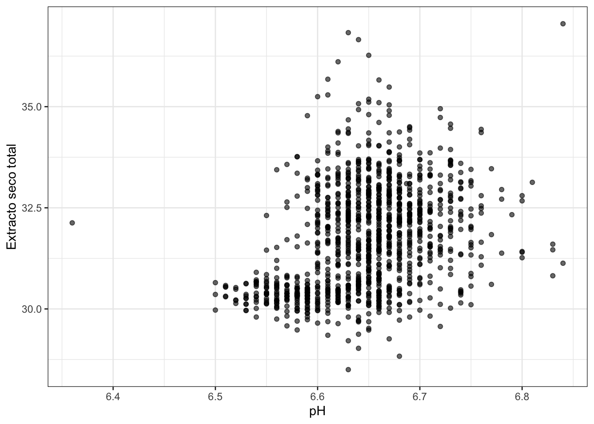

```r
knitr::opts_chunk$set(echo = TRUE, message = FALSE, warning = FALSE, comment = "")
library(tidyverse)
#> ── Attaching packages ─────────────────── tidyverse 1.3.1 ──
#> ✓ ggplot2 3.3.5     ✓ purrr   0.3.4
#> ✓ tibble  3.1.6     ✓ dplyr   1.0.8
#> ✓ tidyr   1.2.0     ✓ stringr 1.4.0
#> ✓ readr   2.1.2     ✓ forcats 0.5.1
#> ── Conflicts ────────────────────── tidyverse_conflicts() ──
#> x dplyr::filter() masks stats::filter()
#> x dplyr::lag()    masks stats::lag()
library(knitr)
library(flextable)
#> 
#> Attaching package: 'flextable'
#> The following object is masked from 'package:purrr':
#> 
#>     compose
library(gt)
library(gridExtra)
#> 
#> Attaching package: 'gridExtra'
#> The following object is masked from 'package:dplyr':
#> 
#>     combine
```

# Análisis exploratorio bivariante {#aed-bi}


## Datos bivariantes y multivariantes

El análisis univariante es muy útil para describir una única característica de la 
población en estudio. Pero rara vez estudiamos una característica aislada, y lo
habitual es tener conjuntos de datos con varias variables (cuantitativas y cualitativas)
que podemos estudiar por separado (análisis univariante) o conjuntamente (análisis multivariante).

El caso especial del **análisis bivariante** es cuando estudiamos dos características a la vez: $X, Y$.
Nos interesa la **relación** entre ellas, para lo que realizaremos resúmenes numéricos y gráficos.
Los datos bivariantes se encontrarán como pares de valores $(x_i, y_i)$ para cada
observación $i = 1, \ldots, n$.

Cuando estudiamos más de dos variables, tenemos datos multivariantes. En este caso,
estudiamos las relaciones "dos a dos" entre las variables (como en el caso bivariante) y 
la estructura conjunta. Hay algunas técnicas multivariantes específicas para este último caso.
En este capítulo nos vamos a centrar solo en el primer caso.

## Frecuencias conjuntas, marginales y condicionadas

El primer resumen que podemos hacer de datos bivariante es la tabla de frecuencias conjunta.
Igual que en el caso univariante $n$ es número total de datos, es decir, la frecuencia total.
La frecuencia absoluta conjunta, $n_{ij}$, es el número de observaciones en la clase $i$ de $X$ **y** en la clase $j$ de $Y$.
La frecuencia relativa conjunta es $f_{ij}= \frac{n_{ij}}{n}$.


### Distribución conjunta de frecuencias

Las frecuencias conjuntas se representan en una tabla de doble entrada, 
con los valores de una variable en filas y los de la otra en columnas.
En el interior, se ponen las frecuencias conjuntas (absolutas, marginales o ambas).
Si las dos variables son cualitativas, la tabla se denomina **Tabla de contingencia**.


:::{.rmdejemplo data-latex=""}
La Tabla \@ref(tab:tabs) muestra la tabla de contingencia de los analistas y el tipo de queso en el ejemplo del análisis de la producción de quesos. Asignamos la variable $X$ al Analista (en filas) y la variable $Y$ al Tipo (en columnas).
La Tabla \@ref(tab:trel) muestra la tabla de frecuencias relativas de los mismos datos. El número total de datos es
$n= 1171$.
:::


Table: (\#tab:tabs)Tabla de contingencia (frecuencias absolutas) de los analistas y el tipo de queso.

|            |  A|  B|   C|
|:-----------|--:|--:|---:|
|analista_10 | 52| 47| 219|
|analista_13 | 42| 36| 198|
|analista_6  | 44| 32| 235|
|analista_9  | 37| 33| 196|


Table: (\#tab:trel)Tabla de frecuencias relativas de los analistas y el tipo de queso.

|            |    A|    B|    C|
|:-----------|----:|----:|----:|
|analista_10 | 0.04| 0.04| 0.19|
|analista_13 | 0.04| 0.03| 0.17|
|analista_6  | 0.04| 0.03| 0.20|
|analista_9  | 0.03| 0.03| 0.17|


En el caso de variables continuas, debemos tener los datos agrupados en intervalos (clases).


:::{.rmdejemplo data-latex=""}

La tabla \@ref(tab:tcont) contiene las frecuencias absolutas conjuntas
de las variables:

* $X$ = ph (filas); 

* $Y$ = est (columnas)

:::


Table: (\#tab:tcont)Tabla de frecuencias conjunta del pH y el extracto seco total agrupadas en intervalos.

|           | (28,30]| (30,32]| (32,34]| (34,36]| (36,38]|
|:----------|-------:|-------:|-------:|-------:|-------:|
|(6.35,6.4] |       0|       0|       1|       0|       0|
|(6.4,6.45] |       0|       0|       0|       0|       0|
|(6.45,6.5] |       1|       2|       0|       0|       0|
|(6.5,6.55] |       3|      50|       1|       0|       0|
|(6.55,6.6] |      17|     129|      36|       2|       0|
|(6.6,6.65] |      18|     195|     167|      20|       4|
|(6.65,6.7] |       9|     160|     182|      18|       0|
|(6.7,6.75] |       2|      53|      70|       4|       0|
|(6.75,6.8] |       0|       9|      10|       2|       0|
|(6.8,6.85] |       0|       4|       1|       0|       1|


### Distribución marginal

Si partimos de la distribución conjunta, podemos obtener la de cada
una de las variables (marginal) y estudiarla como datos univariantes.
Basta con hacer las sumas por columnas, $(X)$, o por filas, $(Y)$:

* Frecuencias marginales absolutas de $X$: $n_{i\cdot} = \sum\limits_{j = 1}^{n_j}n_{ij}$

* Frecuencias marginales absolutas de $Y$: $n_{\cdot j} = \sum\limits_{i = 1}^{n_i}n_{ij}$

donde $n_i$ es el número de clases de la variable $X$ y $n_j$ es el 
número de clases de la variable $Y$. Análogamente, para frecuencias marginales relativas sumamos las frecuencias relativas conjuntas,
o bien dividimos las frecuencias absolutas marginales entre el número total de datos $n$.


:::{.rmdejemplo data-latex=""}
La tabla \@ref(tab:tmar) contiene las frecuencias marginales como suma de filas y
columnas de la distribución conjunta en la tabla \@ref(tab:tcont). Las distribuciones
marginales de $X$ y de $Y$ por separado se muestran en las tablas \@ref(tab:tmarx) y \@ref(tab:tmary)
respectivamente.
:::


```{=html}
<div id="pluzwfrowp" style="overflow-x:auto;overflow-y:auto;width:auto;height:auto;">
<style>html {
  font-family: -apple-system, BlinkMacSystemFont, 'Segoe UI', Roboto, Oxygen, Ubuntu, Cantarell, 'Helvetica Neue', 'Fira Sans', 'Droid Sans', Arial, sans-serif;
}

#pluzwfrowp .gt_table {
  display: table;
  border-collapse: collapse;
  margin-left: auto;
  margin-right: auto;
  color: #333333;
  font-size: 16px;
  font-weight: normal;
  font-style: normal;
  background-color: #FFFFFF;
  width: auto;
  border-top-style: solid;
  border-top-width: 2px;
  border-top-color: #A8A8A8;
  border-right-style: none;
  border-right-width: 2px;
  border-right-color: #D3D3D3;
  border-bottom-style: solid;
  border-bottom-width: 2px;
  border-bottom-color: #A8A8A8;
  border-left-style: none;
  border-left-width: 2px;
  border-left-color: #D3D3D3;
}

#pluzwfrowp .gt_heading {
  background-color: #FFFFFF;
  text-align: center;
  border-bottom-color: #FFFFFF;
  border-left-style: none;
  border-left-width: 1px;
  border-left-color: #D3D3D3;
  border-right-style: none;
  border-right-width: 1px;
  border-right-color: #D3D3D3;
}

#pluzwfrowp .gt_title {
  color: #333333;
  font-size: 125%;
  font-weight: initial;
  padding-top: 4px;
  padding-bottom: 4px;
  padding-left: 5px;
  padding-right: 5px;
  border-bottom-color: #FFFFFF;
  border-bottom-width: 0;
}

#pluzwfrowp .gt_subtitle {
  color: #333333;
  font-size: 85%;
  font-weight: initial;
  padding-top: 0;
  padding-bottom: 6px;
  padding-left: 5px;
  padding-right: 5px;
  border-top-color: #FFFFFF;
  border-top-width: 0;
}

#pluzwfrowp .gt_bottom_border {
  border-bottom-style: solid;
  border-bottom-width: 2px;
  border-bottom-color: #D3D3D3;
}

#pluzwfrowp .gt_col_headings {
  border-top-style: solid;
  border-top-width: 2px;
  border-top-color: #D3D3D3;
  border-bottom-style: solid;
  border-bottom-width: 2px;
  border-bottom-color: #D3D3D3;
  border-left-style: none;
  border-left-width: 1px;
  border-left-color: #D3D3D3;
  border-right-style: none;
  border-right-width: 1px;
  border-right-color: #D3D3D3;
}

#pluzwfrowp .gt_col_heading {
  color: #333333;
  background-color: #FFFFFF;
  font-size: 100%;
  font-weight: normal;
  text-transform: inherit;
  border-left-style: none;
  border-left-width: 1px;
  border-left-color: #D3D3D3;
  border-right-style: none;
  border-right-width: 1px;
  border-right-color: #D3D3D3;
  vertical-align: bottom;
  padding-top: 5px;
  padding-bottom: 6px;
  padding-left: 5px;
  padding-right: 5px;
  overflow-x: hidden;
}

#pluzwfrowp .gt_column_spanner_outer {
  color: #333333;
  background-color: #FFFFFF;
  font-size: 100%;
  font-weight: normal;
  text-transform: inherit;
  padding-top: 0;
  padding-bottom: 0;
  padding-left: 4px;
  padding-right: 4px;
}

#pluzwfrowp .gt_column_spanner_outer:first-child {
  padding-left: 0;
}

#pluzwfrowp .gt_column_spanner_outer:last-child {
  padding-right: 0;
}

#pluzwfrowp .gt_column_spanner {
  border-bottom-style: solid;
  border-bottom-width: 2px;
  border-bottom-color: #D3D3D3;
  vertical-align: bottom;
  padding-top: 5px;
  padding-bottom: 5px;
  overflow-x: hidden;
  display: inline-block;
  width: 100%;
}

#pluzwfrowp .gt_group_heading {
  padding-top: 8px;
  padding-bottom: 8px;
  padding-left: 5px;
  padding-right: 5px;
  color: #333333;
  background-color: #FFFFFF;
  font-size: 100%;
  font-weight: initial;
  text-transform: inherit;
  border-top-style: solid;
  border-top-width: 2px;
  border-top-color: #D3D3D3;
  border-bottom-style: solid;
  border-bottom-width: 2px;
  border-bottom-color: #D3D3D3;
  border-left-style: none;
  border-left-width: 1px;
  border-left-color: #D3D3D3;
  border-right-style: none;
  border-right-width: 1px;
  border-right-color: #D3D3D3;
  vertical-align: middle;
}

#pluzwfrowp .gt_empty_group_heading {
  padding: 0.5px;
  color: #333333;
  background-color: #FFFFFF;
  font-size: 100%;
  font-weight: initial;
  border-top-style: solid;
  border-top-width: 2px;
  border-top-color: #D3D3D3;
  border-bottom-style: solid;
  border-bottom-width: 2px;
  border-bottom-color: #D3D3D3;
  vertical-align: middle;
}

#pluzwfrowp .gt_from_md > :first-child {
  margin-top: 0;
}

#pluzwfrowp .gt_from_md > :last-child {
  margin-bottom: 0;
}

#pluzwfrowp .gt_row {
  padding-top: 8px;
  padding-bottom: 8px;
  padding-left: 5px;
  padding-right: 5px;
  margin: 10px;
  border-top-style: solid;
  border-top-width: 1px;
  border-top-color: #D3D3D3;
  border-left-style: none;
  border-left-width: 1px;
  border-left-color: #D3D3D3;
  border-right-style: none;
  border-right-width: 1px;
  border-right-color: #D3D3D3;
  vertical-align: middle;
  overflow-x: hidden;
}

#pluzwfrowp .gt_stub {
  color: #333333;
  background-color: #FFFFFF;
  font-size: 100%;
  font-weight: initial;
  text-transform: inherit;
  border-right-style: solid;
  border-right-width: 2px;
  border-right-color: #D3D3D3;
  padding-left: 5px;
  padding-right: 5px;
}

#pluzwfrowp .gt_stub_row_group {
  color: #333333;
  background-color: #FFFFFF;
  font-size: 100%;
  font-weight: initial;
  text-transform: inherit;
  border-right-style: solid;
  border-right-width: 2px;
  border-right-color: #D3D3D3;
  padding-left: 5px;
  padding-right: 5px;
  vertical-align: top;
}

#pluzwfrowp .gt_row_group_first td {
  border-top-width: 2px;
}

#pluzwfrowp .gt_summary_row {
  color: #333333;
  background-color: #FFFFFF;
  text-transform: inherit;
  padding-top: 8px;
  padding-bottom: 8px;
  padding-left: 5px;
  padding-right: 5px;
}

#pluzwfrowp .gt_first_summary_row {
  border-top-style: solid;
  border-top-color: #D3D3D3;
}

#pluzwfrowp .gt_first_summary_row.thick {
  border-top-width: 2px;
}

#pluzwfrowp .gt_last_summary_row {
  padding-top: 8px;
  padding-bottom: 8px;
  padding-left: 5px;
  padding-right: 5px;
  border-bottom-style: solid;
  border-bottom-width: 2px;
  border-bottom-color: #D3D3D3;
}

#pluzwfrowp .gt_grand_summary_row {
  color: #333333;
  background-color: #FFFFFF;
  text-transform: inherit;
  padding-top: 8px;
  padding-bottom: 8px;
  padding-left: 5px;
  padding-right: 5px;
}

#pluzwfrowp .gt_first_grand_summary_row {
  padding-top: 8px;
  padding-bottom: 8px;
  padding-left: 5px;
  padding-right: 5px;
  border-top-style: double;
  border-top-width: 6px;
  border-top-color: #D3D3D3;
}

#pluzwfrowp .gt_striped {
  background-color: rgba(128, 128, 128, 0.05);
}

#pluzwfrowp .gt_table_body {
  border-top-style: solid;
  border-top-width: 2px;
  border-top-color: #D3D3D3;
  border-bottom-style: solid;
  border-bottom-width: 2px;
  border-bottom-color: #D3D3D3;
}

#pluzwfrowp .gt_footnotes {
  color: #333333;
  background-color: #FFFFFF;
  border-bottom-style: none;
  border-bottom-width: 2px;
  border-bottom-color: #D3D3D3;
  border-left-style: none;
  border-left-width: 2px;
  border-left-color: #D3D3D3;
  border-right-style: none;
  border-right-width: 2px;
  border-right-color: #D3D3D3;
}

#pluzwfrowp .gt_footnote {
  margin: 0px;
  font-size: 90%;
  padding-left: 4px;
  padding-right: 4px;
  padding-left: 5px;
  padding-right: 5px;
}

#pluzwfrowp .gt_sourcenotes {
  color: #333333;
  background-color: #FFFFFF;
  border-bottom-style: none;
  border-bottom-width: 2px;
  border-bottom-color: #D3D3D3;
  border-left-style: none;
  border-left-width: 2px;
  border-left-color: #D3D3D3;
  border-right-style: none;
  border-right-width: 2px;
  border-right-color: #D3D3D3;
}

#pluzwfrowp .gt_sourcenote {
  font-size: 90%;
  padding-top: 4px;
  padding-bottom: 4px;
  padding-left: 5px;
  padding-right: 5px;
}

#pluzwfrowp .gt_left {
  text-align: left;
}

#pluzwfrowp .gt_center {
  text-align: center;
}

#pluzwfrowp .gt_right {
  text-align: right;
  font-variant-numeric: tabular-nums;
}

#pluzwfrowp .gt_font_normal {
  font-weight: normal;
}

#pluzwfrowp .gt_font_bold {
  font-weight: bold;
}

#pluzwfrowp .gt_font_italic {
  font-style: italic;
}

#pluzwfrowp .gt_super {
  font-size: 65%;
}

#pluzwfrowp .gt_footnote_marks {
  font-style: italic;
  font-weight: normal;
  font-size: 75%;
  vertical-align: 0.4em;
}

#pluzwfrowp .gt_asterisk {
  font-size: 100%;
  vertical-align: 0;
}

#pluzwfrowp .gt_slash_mark {
  font-size: 0.7em;
  line-height: 0.7em;
  vertical-align: 0.15em;
}

#pluzwfrowp .gt_fraction_numerator {
  font-size: 0.6em;
  line-height: 0.6em;
  vertical-align: 0.45em;
}

#pluzwfrowp .gt_fraction_denominator {
  font-size: 0.6em;
  line-height: 0.6em;
  vertical-align: -0.05em;
}
</style>
<table class="gt_table">
  <caption>(#tab:tmar)Frecuencias marginales como suma de filas y columnas de la distribución conjunta</caption>
  
  <thead class="gt_col_headings">
    <tr>
      <th class="gt_col_heading gt_columns_bottom_border gt_left" rowspan="1" colspan="1">X\Y</th>
      <th class="gt_col_heading gt_columns_bottom_border gt_right" rowspan="1" colspan="1">(28,30]</th>
      <th class="gt_col_heading gt_columns_bottom_border gt_right" rowspan="1" colspan="1">(30,32]</th>
      <th class="gt_col_heading gt_columns_bottom_border gt_right" rowspan="1" colspan="1">(32,34]</th>
      <th class="gt_col_heading gt_columns_bottom_border gt_right" rowspan="1" colspan="1">(34,36]</th>
      <th class="gt_col_heading gt_columns_bottom_border gt_right" rowspan="1" colspan="1">(36,38]</th>
      <th class="gt_col_heading gt_columns_bottom_border gt_right" rowspan="1" colspan="1">Sum</th>
    </tr>
  </thead>
  <tbody class="gt_table_body">
    <tr><td class="gt_row gt_left">(6.35,6.4]</td>
<td class="gt_row gt_right">0</td>
<td class="gt_row gt_right">0</td>
<td class="gt_row gt_right">1</td>
<td class="gt_row gt_right">0</td>
<td class="gt_row gt_right">0</td>
<td class="gt_row gt_right" style="font-weight: bold;">1</td></tr>
    <tr><td class="gt_row gt_left">(6.4,6.45]</td>
<td class="gt_row gt_right">0</td>
<td class="gt_row gt_right">0</td>
<td class="gt_row gt_right">0</td>
<td class="gt_row gt_right">0</td>
<td class="gt_row gt_right">0</td>
<td class="gt_row gt_right" style="font-weight: bold;">0</td></tr>
    <tr><td class="gt_row gt_left">(6.45,6.5]</td>
<td class="gt_row gt_right">1</td>
<td class="gt_row gt_right">2</td>
<td class="gt_row gt_right">0</td>
<td class="gt_row gt_right">0</td>
<td class="gt_row gt_right">0</td>
<td class="gt_row gt_right" style="font-weight: bold;">3</td></tr>
    <tr><td class="gt_row gt_left">(6.5,6.55]</td>
<td class="gt_row gt_right">3</td>
<td class="gt_row gt_right">50</td>
<td class="gt_row gt_right">1</td>
<td class="gt_row gt_right">0</td>
<td class="gt_row gt_right">0</td>
<td class="gt_row gt_right" style="font-weight: bold;">54</td></tr>
    <tr><td class="gt_row gt_left">(6.55,6.6]</td>
<td class="gt_row gt_right">17</td>
<td class="gt_row gt_right">129</td>
<td class="gt_row gt_right">36</td>
<td class="gt_row gt_right">2</td>
<td class="gt_row gt_right">0</td>
<td class="gt_row gt_right" style="font-weight: bold;">184</td></tr>
    <tr><td class="gt_row gt_left">(6.6,6.65]</td>
<td class="gt_row gt_right">18</td>
<td class="gt_row gt_right">195</td>
<td class="gt_row gt_right">167</td>
<td class="gt_row gt_right">20</td>
<td class="gt_row gt_right">4</td>
<td class="gt_row gt_right" style="font-weight: bold;">404</td></tr>
    <tr><td class="gt_row gt_left">(6.65,6.7]</td>
<td class="gt_row gt_right">9</td>
<td class="gt_row gt_right">160</td>
<td class="gt_row gt_right">182</td>
<td class="gt_row gt_right">18</td>
<td class="gt_row gt_right">0</td>
<td class="gt_row gt_right" style="font-weight: bold;">369</td></tr>
    <tr><td class="gt_row gt_left">(6.7,6.75]</td>
<td class="gt_row gt_right">2</td>
<td class="gt_row gt_right">53</td>
<td class="gt_row gt_right">70</td>
<td class="gt_row gt_right">4</td>
<td class="gt_row gt_right">0</td>
<td class="gt_row gt_right" style="font-weight: bold;">129</td></tr>
    <tr><td class="gt_row gt_left">(6.75,6.8]</td>
<td class="gt_row gt_right">0</td>
<td class="gt_row gt_right">9</td>
<td class="gt_row gt_right">10</td>
<td class="gt_row gt_right">2</td>
<td class="gt_row gt_right">0</td>
<td class="gt_row gt_right" style="font-weight: bold;">21</td></tr>
    <tr><td class="gt_row gt_left">(6.8,6.85]</td>
<td class="gt_row gt_right">0</td>
<td class="gt_row gt_right">4</td>
<td class="gt_row gt_right">1</td>
<td class="gt_row gt_right">0</td>
<td class="gt_row gt_right">1</td>
<td class="gt_row gt_right" style="font-weight: bold;">6</td></tr>
    <tr><td class="gt_row gt_left" style="font-weight: bold;">Sum</td>
<td class="gt_row gt_right" style="font-weight: bold;">50</td>
<td class="gt_row gt_right" style="font-weight: bold;">602</td>
<td class="gt_row gt_right" style="font-weight: bold;">468</td>
<td class="gt_row gt_right" style="font-weight: bold;">46</td>
<td class="gt_row gt_right" style="font-weight: bold;">5</td>
<td class="gt_row gt_right" style="font-weight: bold;">1171</td></tr>
  </tbody>
  
  
</table>
</div>
```


```{=html}
<div id="sqdedzlkia" style="overflow-x:auto;overflow-y:auto;width:auto;height:auto;">
<style>html {
  font-family: -apple-system, BlinkMacSystemFont, 'Segoe UI', Roboto, Oxygen, Ubuntu, Cantarell, 'Helvetica Neue', 'Fira Sans', 'Droid Sans', Arial, sans-serif;
}

#sqdedzlkia .gt_table {
  display: table;
  border-collapse: collapse;
  margin-left: auto;
  margin-right: auto;
  color: #333333;
  font-size: 16px;
  font-weight: normal;
  font-style: normal;
  background-color: #FFFFFF;
  width: auto;
  border-top-style: solid;
  border-top-width: 2px;
  border-top-color: #A8A8A8;
  border-right-style: none;
  border-right-width: 2px;
  border-right-color: #D3D3D3;
  border-bottom-style: solid;
  border-bottom-width: 2px;
  border-bottom-color: #A8A8A8;
  border-left-style: none;
  border-left-width: 2px;
  border-left-color: #D3D3D3;
}

#sqdedzlkia .gt_heading {
  background-color: #FFFFFF;
  text-align: center;
  border-bottom-color: #FFFFFF;
  border-left-style: none;
  border-left-width: 1px;
  border-left-color: #D3D3D3;
  border-right-style: none;
  border-right-width: 1px;
  border-right-color: #D3D3D3;
}

#sqdedzlkia .gt_title {
  color: #333333;
  font-size: 125%;
  font-weight: initial;
  padding-top: 4px;
  padding-bottom: 4px;
  padding-left: 5px;
  padding-right: 5px;
  border-bottom-color: #FFFFFF;
  border-bottom-width: 0;
}

#sqdedzlkia .gt_subtitle {
  color: #333333;
  font-size: 85%;
  font-weight: initial;
  padding-top: 0;
  padding-bottom: 6px;
  padding-left: 5px;
  padding-right: 5px;
  border-top-color: #FFFFFF;
  border-top-width: 0;
}

#sqdedzlkia .gt_bottom_border {
  border-bottom-style: solid;
  border-bottom-width: 2px;
  border-bottom-color: #D3D3D3;
}

#sqdedzlkia .gt_col_headings {
  border-top-style: solid;
  border-top-width: 2px;
  border-top-color: #D3D3D3;
  border-bottom-style: solid;
  border-bottom-width: 2px;
  border-bottom-color: #D3D3D3;
  border-left-style: none;
  border-left-width: 1px;
  border-left-color: #D3D3D3;
  border-right-style: none;
  border-right-width: 1px;
  border-right-color: #D3D3D3;
}

#sqdedzlkia .gt_col_heading {
  color: #333333;
  background-color: #FFFFFF;
  font-size: 100%;
  font-weight: normal;
  text-transform: inherit;
  border-left-style: none;
  border-left-width: 1px;
  border-left-color: #D3D3D3;
  border-right-style: none;
  border-right-width: 1px;
  border-right-color: #D3D3D3;
  vertical-align: bottom;
  padding-top: 5px;
  padding-bottom: 6px;
  padding-left: 5px;
  padding-right: 5px;
  overflow-x: hidden;
}

#sqdedzlkia .gt_column_spanner_outer {
  color: #333333;
  background-color: #FFFFFF;
  font-size: 100%;
  font-weight: normal;
  text-transform: inherit;
  padding-top: 0;
  padding-bottom: 0;
  padding-left: 4px;
  padding-right: 4px;
}

#sqdedzlkia .gt_column_spanner_outer:first-child {
  padding-left: 0;
}

#sqdedzlkia .gt_column_spanner_outer:last-child {
  padding-right: 0;
}

#sqdedzlkia .gt_column_spanner {
  border-bottom-style: solid;
  border-bottom-width: 2px;
  border-bottom-color: #D3D3D3;
  vertical-align: bottom;
  padding-top: 5px;
  padding-bottom: 5px;
  overflow-x: hidden;
  display: inline-block;
  width: 100%;
}

#sqdedzlkia .gt_group_heading {
  padding-top: 8px;
  padding-bottom: 8px;
  padding-left: 5px;
  padding-right: 5px;
  color: #333333;
  background-color: #FFFFFF;
  font-size: 100%;
  font-weight: initial;
  text-transform: inherit;
  border-top-style: solid;
  border-top-width: 2px;
  border-top-color: #D3D3D3;
  border-bottom-style: solid;
  border-bottom-width: 2px;
  border-bottom-color: #D3D3D3;
  border-left-style: none;
  border-left-width: 1px;
  border-left-color: #D3D3D3;
  border-right-style: none;
  border-right-width: 1px;
  border-right-color: #D3D3D3;
  vertical-align: middle;
}

#sqdedzlkia .gt_empty_group_heading {
  padding: 0.5px;
  color: #333333;
  background-color: #FFFFFF;
  font-size: 100%;
  font-weight: initial;
  border-top-style: solid;
  border-top-width: 2px;
  border-top-color: #D3D3D3;
  border-bottom-style: solid;
  border-bottom-width: 2px;
  border-bottom-color: #D3D3D3;
  vertical-align: middle;
}

#sqdedzlkia .gt_from_md > :first-child {
  margin-top: 0;
}

#sqdedzlkia .gt_from_md > :last-child {
  margin-bottom: 0;
}

#sqdedzlkia .gt_row {
  padding-top: 8px;
  padding-bottom: 8px;
  padding-left: 5px;
  padding-right: 5px;
  margin: 10px;
  border-top-style: solid;
  border-top-width: 1px;
  border-top-color: #D3D3D3;
  border-left-style: none;
  border-left-width: 1px;
  border-left-color: #D3D3D3;
  border-right-style: none;
  border-right-width: 1px;
  border-right-color: #D3D3D3;
  vertical-align: middle;
  overflow-x: hidden;
}

#sqdedzlkia .gt_stub {
  color: #333333;
  background-color: #FFFFFF;
  font-size: 100%;
  font-weight: initial;
  text-transform: inherit;
  border-right-style: solid;
  border-right-width: 2px;
  border-right-color: #D3D3D3;
  padding-left: 5px;
  padding-right: 5px;
}

#sqdedzlkia .gt_stub_row_group {
  color: #333333;
  background-color: #FFFFFF;
  font-size: 100%;
  font-weight: initial;
  text-transform: inherit;
  border-right-style: solid;
  border-right-width: 2px;
  border-right-color: #D3D3D3;
  padding-left: 5px;
  padding-right: 5px;
  vertical-align: top;
}

#sqdedzlkia .gt_row_group_first td {
  border-top-width: 2px;
}

#sqdedzlkia .gt_summary_row {
  color: #333333;
  background-color: #FFFFFF;
  text-transform: inherit;
  padding-top: 8px;
  padding-bottom: 8px;
  padding-left: 5px;
  padding-right: 5px;
}

#sqdedzlkia .gt_first_summary_row {
  border-top-style: solid;
  border-top-color: #D3D3D3;
}

#sqdedzlkia .gt_first_summary_row.thick {
  border-top-width: 2px;
}

#sqdedzlkia .gt_last_summary_row {
  padding-top: 8px;
  padding-bottom: 8px;
  padding-left: 5px;
  padding-right: 5px;
  border-bottom-style: solid;
  border-bottom-width: 2px;
  border-bottom-color: #D3D3D3;
}

#sqdedzlkia .gt_grand_summary_row {
  color: #333333;
  background-color: #FFFFFF;
  text-transform: inherit;
  padding-top: 8px;
  padding-bottom: 8px;
  padding-left: 5px;
  padding-right: 5px;
}

#sqdedzlkia .gt_first_grand_summary_row {
  padding-top: 8px;
  padding-bottom: 8px;
  padding-left: 5px;
  padding-right: 5px;
  border-top-style: double;
  border-top-width: 6px;
  border-top-color: #D3D3D3;
}

#sqdedzlkia .gt_striped {
  background-color: rgba(128, 128, 128, 0.05);
}

#sqdedzlkia .gt_table_body {
  border-top-style: solid;
  border-top-width: 2px;
  border-top-color: #D3D3D3;
  border-bottom-style: solid;
  border-bottom-width: 2px;
  border-bottom-color: #D3D3D3;
}

#sqdedzlkia .gt_footnotes {
  color: #333333;
  background-color: #FFFFFF;
  border-bottom-style: none;
  border-bottom-width: 2px;
  border-bottom-color: #D3D3D3;
  border-left-style: none;
  border-left-width: 2px;
  border-left-color: #D3D3D3;
  border-right-style: none;
  border-right-width: 2px;
  border-right-color: #D3D3D3;
}

#sqdedzlkia .gt_footnote {
  margin: 0px;
  font-size: 90%;
  padding-left: 4px;
  padding-right: 4px;
  padding-left: 5px;
  padding-right: 5px;
}

#sqdedzlkia .gt_sourcenotes {
  color: #333333;
  background-color: #FFFFFF;
  border-bottom-style: none;
  border-bottom-width: 2px;
  border-bottom-color: #D3D3D3;
  border-left-style: none;
  border-left-width: 2px;
  border-left-color: #D3D3D3;
  border-right-style: none;
  border-right-width: 2px;
  border-right-color: #D3D3D3;
}

#sqdedzlkia .gt_sourcenote {
  font-size: 90%;
  padding-top: 4px;
  padding-bottom: 4px;
  padding-left: 5px;
  padding-right: 5px;
}

#sqdedzlkia .gt_left {
  text-align: left;
}

#sqdedzlkia .gt_center {
  text-align: center;
}

#sqdedzlkia .gt_right {
  text-align: right;
  font-variant-numeric: tabular-nums;
}

#sqdedzlkia .gt_font_normal {
  font-weight: normal;
}

#sqdedzlkia .gt_font_bold {
  font-weight: bold;
}

#sqdedzlkia .gt_font_italic {
  font-style: italic;
}

#sqdedzlkia .gt_super {
  font-size: 65%;
}

#sqdedzlkia .gt_footnote_marks {
  font-style: italic;
  font-weight: normal;
  font-size: 75%;
  vertical-align: 0.4em;
}

#sqdedzlkia .gt_asterisk {
  font-size: 100%;
  vertical-align: 0;
}

#sqdedzlkia .gt_slash_mark {
  font-size: 0.7em;
  line-height: 0.7em;
  vertical-align: 0.15em;
}

#sqdedzlkia .gt_fraction_numerator {
  font-size: 0.6em;
  line-height: 0.6em;
  vertical-align: 0.45em;
}

#sqdedzlkia .gt_fraction_denominator {
  font-size: 0.6em;
  line-height: 0.6em;
  vertical-align: -0.05em;
}
</style>
<table class="gt_table">
  <caption>(#tab:tmarx)Frecuencias marginales de X (pH)</caption>
  
  <thead class="gt_col_headings">
    <tr>
      <th class="gt_col_heading gt_columns_bottom_border gt_left" rowspan="1" colspan="1">\(x_i\)</th>
      <th class="gt_col_heading gt_columns_bottom_border gt_right" rowspan="1" colspan="1">\(n_{i·}\)</th>
      <th class="gt_col_heading gt_columns_bottom_border gt_right" rowspan="1" colspan="1">\(f_{i·}\)</th>
    </tr>
  </thead>
  <tbody class="gt_table_body">
    <tr><td class="gt_row gt_left">(6.35,6.4]</td>
<td class="gt_row gt_right">1</td>
<td class="gt_row gt_right">0.001</td></tr>
    <tr><td class="gt_row gt_left">(6.4,6.45]</td>
<td class="gt_row gt_right">0</td>
<td class="gt_row gt_right">0.000</td></tr>
    <tr><td class="gt_row gt_left">(6.45,6.5]</td>
<td class="gt_row gt_right">3</td>
<td class="gt_row gt_right">0.003</td></tr>
    <tr><td class="gt_row gt_left">(6.5,6.55]</td>
<td class="gt_row gt_right">54</td>
<td class="gt_row gt_right">0.046</td></tr>
    <tr><td class="gt_row gt_left">(6.55,6.6]</td>
<td class="gt_row gt_right">184</td>
<td class="gt_row gt_right">0.157</td></tr>
    <tr><td class="gt_row gt_left">(6.6,6.65]</td>
<td class="gt_row gt_right">404</td>
<td class="gt_row gt_right">0.345</td></tr>
    <tr><td class="gt_row gt_left">(6.65,6.7]</td>
<td class="gt_row gt_right">369</td>
<td class="gt_row gt_right">0.315</td></tr>
    <tr><td class="gt_row gt_left">(6.7,6.75]</td>
<td class="gt_row gt_right">129</td>
<td class="gt_row gt_right">0.110</td></tr>
    <tr><td class="gt_row gt_left">(6.75,6.8]</td>
<td class="gt_row gt_right">21</td>
<td class="gt_row gt_right">0.018</td></tr>
    <tr><td class="gt_row gt_left">(6.8,6.85]</td>
<td class="gt_row gt_right">6</td>
<td class="gt_row gt_right">0.005</td></tr>
    <tr><td class="gt_row gt_left">Sum</td>
<td class="gt_row gt_right">1171</td>
<td class="gt_row gt_right">1.000</td></tr>
  </tbody>
  
  
</table>
</div>
```


```{=html}
<div id="rabqmxxybi" style="overflow-x:auto;overflow-y:auto;width:auto;height:auto;">
<style>html {
  font-family: -apple-system, BlinkMacSystemFont, 'Segoe UI', Roboto, Oxygen, Ubuntu, Cantarell, 'Helvetica Neue', 'Fira Sans', 'Droid Sans', Arial, sans-serif;
}

#rabqmxxybi .gt_table {
  display: table;
  border-collapse: collapse;
  margin-left: auto;
  margin-right: auto;
  color: #333333;
  font-size: 16px;
  font-weight: normal;
  font-style: normal;
  background-color: #FFFFFF;
  width: auto;
  border-top-style: solid;
  border-top-width: 2px;
  border-top-color: #A8A8A8;
  border-right-style: none;
  border-right-width: 2px;
  border-right-color: #D3D3D3;
  border-bottom-style: solid;
  border-bottom-width: 2px;
  border-bottom-color: #A8A8A8;
  border-left-style: none;
  border-left-width: 2px;
  border-left-color: #D3D3D3;
}

#rabqmxxybi .gt_heading {
  background-color: #FFFFFF;
  text-align: center;
  border-bottom-color: #FFFFFF;
  border-left-style: none;
  border-left-width: 1px;
  border-left-color: #D3D3D3;
  border-right-style: none;
  border-right-width: 1px;
  border-right-color: #D3D3D3;
}

#rabqmxxybi .gt_title {
  color: #333333;
  font-size: 125%;
  font-weight: initial;
  padding-top: 4px;
  padding-bottom: 4px;
  padding-left: 5px;
  padding-right: 5px;
  border-bottom-color: #FFFFFF;
  border-bottom-width: 0;
}

#rabqmxxybi .gt_subtitle {
  color: #333333;
  font-size: 85%;
  font-weight: initial;
  padding-top: 0;
  padding-bottom: 6px;
  padding-left: 5px;
  padding-right: 5px;
  border-top-color: #FFFFFF;
  border-top-width: 0;
}

#rabqmxxybi .gt_bottom_border {
  border-bottom-style: solid;
  border-bottom-width: 2px;
  border-bottom-color: #D3D3D3;
}

#rabqmxxybi .gt_col_headings {
  border-top-style: solid;
  border-top-width: 2px;
  border-top-color: #D3D3D3;
  border-bottom-style: solid;
  border-bottom-width: 2px;
  border-bottom-color: #D3D3D3;
  border-left-style: none;
  border-left-width: 1px;
  border-left-color: #D3D3D3;
  border-right-style: none;
  border-right-width: 1px;
  border-right-color: #D3D3D3;
}

#rabqmxxybi .gt_col_heading {
  color: #333333;
  background-color: #FFFFFF;
  font-size: 100%;
  font-weight: normal;
  text-transform: inherit;
  border-left-style: none;
  border-left-width: 1px;
  border-left-color: #D3D3D3;
  border-right-style: none;
  border-right-width: 1px;
  border-right-color: #D3D3D3;
  vertical-align: bottom;
  padding-top: 5px;
  padding-bottom: 6px;
  padding-left: 5px;
  padding-right: 5px;
  overflow-x: hidden;
}

#rabqmxxybi .gt_column_spanner_outer {
  color: #333333;
  background-color: #FFFFFF;
  font-size: 100%;
  font-weight: normal;
  text-transform: inherit;
  padding-top: 0;
  padding-bottom: 0;
  padding-left: 4px;
  padding-right: 4px;
}

#rabqmxxybi .gt_column_spanner_outer:first-child {
  padding-left: 0;
}

#rabqmxxybi .gt_column_spanner_outer:last-child {
  padding-right: 0;
}

#rabqmxxybi .gt_column_spanner {
  border-bottom-style: solid;
  border-bottom-width: 2px;
  border-bottom-color: #D3D3D3;
  vertical-align: bottom;
  padding-top: 5px;
  padding-bottom: 5px;
  overflow-x: hidden;
  display: inline-block;
  width: 100%;
}

#rabqmxxybi .gt_group_heading {
  padding-top: 8px;
  padding-bottom: 8px;
  padding-left: 5px;
  padding-right: 5px;
  color: #333333;
  background-color: #FFFFFF;
  font-size: 100%;
  font-weight: initial;
  text-transform: inherit;
  border-top-style: solid;
  border-top-width: 2px;
  border-top-color: #D3D3D3;
  border-bottom-style: solid;
  border-bottom-width: 2px;
  border-bottom-color: #D3D3D3;
  border-left-style: none;
  border-left-width: 1px;
  border-left-color: #D3D3D3;
  border-right-style: none;
  border-right-width: 1px;
  border-right-color: #D3D3D3;
  vertical-align: middle;
}

#rabqmxxybi .gt_empty_group_heading {
  padding: 0.5px;
  color: #333333;
  background-color: #FFFFFF;
  font-size: 100%;
  font-weight: initial;
  border-top-style: solid;
  border-top-width: 2px;
  border-top-color: #D3D3D3;
  border-bottom-style: solid;
  border-bottom-width: 2px;
  border-bottom-color: #D3D3D3;
  vertical-align: middle;
}

#rabqmxxybi .gt_from_md > :first-child {
  margin-top: 0;
}

#rabqmxxybi .gt_from_md > :last-child {
  margin-bottom: 0;
}

#rabqmxxybi .gt_row {
  padding-top: 8px;
  padding-bottom: 8px;
  padding-left: 5px;
  padding-right: 5px;
  margin: 10px;
  border-top-style: solid;
  border-top-width: 1px;
  border-top-color: #D3D3D3;
  border-left-style: none;
  border-left-width: 1px;
  border-left-color: #D3D3D3;
  border-right-style: none;
  border-right-width: 1px;
  border-right-color: #D3D3D3;
  vertical-align: middle;
  overflow-x: hidden;
}

#rabqmxxybi .gt_stub {
  color: #333333;
  background-color: #FFFFFF;
  font-size: 100%;
  font-weight: initial;
  text-transform: inherit;
  border-right-style: solid;
  border-right-width: 2px;
  border-right-color: #D3D3D3;
  padding-left: 5px;
  padding-right: 5px;
}

#rabqmxxybi .gt_stub_row_group {
  color: #333333;
  background-color: #FFFFFF;
  font-size: 100%;
  font-weight: initial;
  text-transform: inherit;
  border-right-style: solid;
  border-right-width: 2px;
  border-right-color: #D3D3D3;
  padding-left: 5px;
  padding-right: 5px;
  vertical-align: top;
}

#rabqmxxybi .gt_row_group_first td {
  border-top-width: 2px;
}

#rabqmxxybi .gt_summary_row {
  color: #333333;
  background-color: #FFFFFF;
  text-transform: inherit;
  padding-top: 8px;
  padding-bottom: 8px;
  padding-left: 5px;
  padding-right: 5px;
}

#rabqmxxybi .gt_first_summary_row {
  border-top-style: solid;
  border-top-color: #D3D3D3;
}

#rabqmxxybi .gt_first_summary_row.thick {
  border-top-width: 2px;
}

#rabqmxxybi .gt_last_summary_row {
  padding-top: 8px;
  padding-bottom: 8px;
  padding-left: 5px;
  padding-right: 5px;
  border-bottom-style: solid;
  border-bottom-width: 2px;
  border-bottom-color: #D3D3D3;
}

#rabqmxxybi .gt_grand_summary_row {
  color: #333333;
  background-color: #FFFFFF;
  text-transform: inherit;
  padding-top: 8px;
  padding-bottom: 8px;
  padding-left: 5px;
  padding-right: 5px;
}

#rabqmxxybi .gt_first_grand_summary_row {
  padding-top: 8px;
  padding-bottom: 8px;
  padding-left: 5px;
  padding-right: 5px;
  border-top-style: double;
  border-top-width: 6px;
  border-top-color: #D3D3D3;
}

#rabqmxxybi .gt_striped {
  background-color: rgba(128, 128, 128, 0.05);
}

#rabqmxxybi .gt_table_body {
  border-top-style: solid;
  border-top-width: 2px;
  border-top-color: #D3D3D3;
  border-bottom-style: solid;
  border-bottom-width: 2px;
  border-bottom-color: #D3D3D3;
}

#rabqmxxybi .gt_footnotes {
  color: #333333;
  background-color: #FFFFFF;
  border-bottom-style: none;
  border-bottom-width: 2px;
  border-bottom-color: #D3D3D3;
  border-left-style: none;
  border-left-width: 2px;
  border-left-color: #D3D3D3;
  border-right-style: none;
  border-right-width: 2px;
  border-right-color: #D3D3D3;
}

#rabqmxxybi .gt_footnote {
  margin: 0px;
  font-size: 90%;
  padding-left: 4px;
  padding-right: 4px;
  padding-left: 5px;
  padding-right: 5px;
}

#rabqmxxybi .gt_sourcenotes {
  color: #333333;
  background-color: #FFFFFF;
  border-bottom-style: none;
  border-bottom-width: 2px;
  border-bottom-color: #D3D3D3;
  border-left-style: none;
  border-left-width: 2px;
  border-left-color: #D3D3D3;
  border-right-style: none;
  border-right-width: 2px;
  border-right-color: #D3D3D3;
}

#rabqmxxybi .gt_sourcenote {
  font-size: 90%;
  padding-top: 4px;
  padding-bottom: 4px;
  padding-left: 5px;
  padding-right: 5px;
}

#rabqmxxybi .gt_left {
  text-align: left;
}

#rabqmxxybi .gt_center {
  text-align: center;
}

#rabqmxxybi .gt_right {
  text-align: right;
  font-variant-numeric: tabular-nums;
}

#rabqmxxybi .gt_font_normal {
  font-weight: normal;
}

#rabqmxxybi .gt_font_bold {
  font-weight: bold;
}

#rabqmxxybi .gt_font_italic {
  font-style: italic;
}

#rabqmxxybi .gt_super {
  font-size: 65%;
}

#rabqmxxybi .gt_footnote_marks {
  font-style: italic;
  font-weight: normal;
  font-size: 75%;
  vertical-align: 0.4em;
}

#rabqmxxybi .gt_asterisk {
  font-size: 100%;
  vertical-align: 0;
}

#rabqmxxybi .gt_slash_mark {
  font-size: 0.7em;
  line-height: 0.7em;
  vertical-align: 0.15em;
}

#rabqmxxybi .gt_fraction_numerator {
  font-size: 0.6em;
  line-height: 0.6em;
  vertical-align: 0.45em;
}

#rabqmxxybi .gt_fraction_denominator {
  font-size: 0.6em;
  line-height: 0.6em;
  vertical-align: -0.05em;
}
</style>
<table class="gt_table">
  <caption>(#tab:tmary)Frecuencias marginales de Y (est)</caption>
  
  <thead class="gt_col_headings">
    <tr>
      <th class="gt_col_heading gt_columns_bottom_border gt_left" rowspan="1" colspan="1">\(y_j\)</th>
      <th class="gt_col_heading gt_columns_bottom_border gt_right" rowspan="1" colspan="1">\(n_{·j}\)</th>
      <th class="gt_col_heading gt_columns_bottom_border gt_right" rowspan="1" colspan="1">\(f_{·j}\)</th>
    </tr>
  </thead>
  <tbody class="gt_table_body">
    <tr><td class="gt_row gt_left">(28,30]</td>
<td class="gt_row gt_right">50</td>
<td class="gt_row gt_right">0.043</td></tr>
    <tr><td class="gt_row gt_left">(30,32]</td>
<td class="gt_row gt_right">602</td>
<td class="gt_row gt_right">0.514</td></tr>
    <tr><td class="gt_row gt_left">(32,34]</td>
<td class="gt_row gt_right">468</td>
<td class="gt_row gt_right">0.400</td></tr>
    <tr><td class="gt_row gt_left">(34,36]</td>
<td class="gt_row gt_right">46</td>
<td class="gt_row gt_right">0.039</td></tr>
    <tr><td class="gt_row gt_left">(36,38]</td>
<td class="gt_row gt_right">5</td>
<td class="gt_row gt_right">0.004</td></tr>
    <tr><td class="gt_row gt_left">Sum</td>
<td class="gt_row gt_right">1171</td>
<td class="gt_row gt_right">1.000</td></tr>
  </tbody>
  
  
</table>
</div>
```


### Distribución condicionada

La distribución de la variable $Y$ condicionada a un valor $x_i$ de la variable $X$ 
se representa por $Y | X = x_i$. Análogamente se puede definir para varios valores
de $X$, o de $X$ condicionada a $Y$.
Se lee "Distribución de $Y$ condicionada a que $X$ es igual a $x_i$".
Estas distribuciones condicionadas son variables univariantes que se pueden estudiar 
con análisis univariante.

A partir de la distribución conjunta, tomaríamos la fila o columna que se corresponde
con el valor "conocido", es decir, el de la condición. Las frecuencias relativas se calcularán 
dividiendo entre la frecuencia marginal, y no entre la frecuencia total. Por ejemplo:

$$f_{x_i|y=y_j}=\frac{n_{ij}}{n_{·j}}.$$


:::{.rmdejemplo data-latex=""}
La tabla \@ref(tab:tcondx) muestra la distribución De $X$ condicionada a que 
$Y = y_2$. Es decir, como es una variable numérica que hemos dividido en intervalos,
condicionada a que $Y \in (30,32]$. La tabla \@ref(tab:tcondy)
muestra la distribución de $Y$ condicionada a que
$X = x_5$, es decir, de $Y | X \in (6.55,6.6]$.
:::


```{=html}
<div id="wamsdrqacn" style="overflow-x:auto;overflow-y:auto;width:auto;height:auto;">
<style>html {
  font-family: -apple-system, BlinkMacSystemFont, 'Segoe UI', Roboto, Oxygen, Ubuntu, Cantarell, 'Helvetica Neue', 'Fira Sans', 'Droid Sans', Arial, sans-serif;
}

#wamsdrqacn .gt_table {
  display: table;
  border-collapse: collapse;
  margin-left: auto;
  margin-right: auto;
  color: #333333;
  font-size: 16px;
  font-weight: normal;
  font-style: normal;
  background-color: #FFFFFF;
  width: auto;
  border-top-style: solid;
  border-top-width: 2px;
  border-top-color: #A8A8A8;
  border-right-style: none;
  border-right-width: 2px;
  border-right-color: #D3D3D3;
  border-bottom-style: solid;
  border-bottom-width: 2px;
  border-bottom-color: #A8A8A8;
  border-left-style: none;
  border-left-width: 2px;
  border-left-color: #D3D3D3;
}

#wamsdrqacn .gt_heading {
  background-color: #FFFFFF;
  text-align: center;
  border-bottom-color: #FFFFFF;
  border-left-style: none;
  border-left-width: 1px;
  border-left-color: #D3D3D3;
  border-right-style: none;
  border-right-width: 1px;
  border-right-color: #D3D3D3;
}

#wamsdrqacn .gt_title {
  color: #333333;
  font-size: 125%;
  font-weight: initial;
  padding-top: 4px;
  padding-bottom: 4px;
  padding-left: 5px;
  padding-right: 5px;
  border-bottom-color: #FFFFFF;
  border-bottom-width: 0;
}

#wamsdrqacn .gt_subtitle {
  color: #333333;
  font-size: 85%;
  font-weight: initial;
  padding-top: 0;
  padding-bottom: 6px;
  padding-left: 5px;
  padding-right: 5px;
  border-top-color: #FFFFFF;
  border-top-width: 0;
}

#wamsdrqacn .gt_bottom_border {
  border-bottom-style: solid;
  border-bottom-width: 2px;
  border-bottom-color: #D3D3D3;
}

#wamsdrqacn .gt_col_headings {
  border-top-style: solid;
  border-top-width: 2px;
  border-top-color: #D3D3D3;
  border-bottom-style: solid;
  border-bottom-width: 2px;
  border-bottom-color: #D3D3D3;
  border-left-style: none;
  border-left-width: 1px;
  border-left-color: #D3D3D3;
  border-right-style: none;
  border-right-width: 1px;
  border-right-color: #D3D3D3;
}

#wamsdrqacn .gt_col_heading {
  color: #333333;
  background-color: #FFFFFF;
  font-size: 100%;
  font-weight: normal;
  text-transform: inherit;
  border-left-style: none;
  border-left-width: 1px;
  border-left-color: #D3D3D3;
  border-right-style: none;
  border-right-width: 1px;
  border-right-color: #D3D3D3;
  vertical-align: bottom;
  padding-top: 5px;
  padding-bottom: 6px;
  padding-left: 5px;
  padding-right: 5px;
  overflow-x: hidden;
}

#wamsdrqacn .gt_column_spanner_outer {
  color: #333333;
  background-color: #FFFFFF;
  font-size: 100%;
  font-weight: normal;
  text-transform: inherit;
  padding-top: 0;
  padding-bottom: 0;
  padding-left: 4px;
  padding-right: 4px;
}

#wamsdrqacn .gt_column_spanner_outer:first-child {
  padding-left: 0;
}

#wamsdrqacn .gt_column_spanner_outer:last-child {
  padding-right: 0;
}

#wamsdrqacn .gt_column_spanner {
  border-bottom-style: solid;
  border-bottom-width: 2px;
  border-bottom-color: #D3D3D3;
  vertical-align: bottom;
  padding-top: 5px;
  padding-bottom: 5px;
  overflow-x: hidden;
  display: inline-block;
  width: 100%;
}

#wamsdrqacn .gt_group_heading {
  padding-top: 8px;
  padding-bottom: 8px;
  padding-left: 5px;
  padding-right: 5px;
  color: #333333;
  background-color: #FFFFFF;
  font-size: 100%;
  font-weight: initial;
  text-transform: inherit;
  border-top-style: solid;
  border-top-width: 2px;
  border-top-color: #D3D3D3;
  border-bottom-style: solid;
  border-bottom-width: 2px;
  border-bottom-color: #D3D3D3;
  border-left-style: none;
  border-left-width: 1px;
  border-left-color: #D3D3D3;
  border-right-style: none;
  border-right-width: 1px;
  border-right-color: #D3D3D3;
  vertical-align: middle;
}

#wamsdrqacn .gt_empty_group_heading {
  padding: 0.5px;
  color: #333333;
  background-color: #FFFFFF;
  font-size: 100%;
  font-weight: initial;
  border-top-style: solid;
  border-top-width: 2px;
  border-top-color: #D3D3D3;
  border-bottom-style: solid;
  border-bottom-width: 2px;
  border-bottom-color: #D3D3D3;
  vertical-align: middle;
}

#wamsdrqacn .gt_from_md > :first-child {
  margin-top: 0;
}

#wamsdrqacn .gt_from_md > :last-child {
  margin-bottom: 0;
}

#wamsdrqacn .gt_row {
  padding-top: 8px;
  padding-bottom: 8px;
  padding-left: 5px;
  padding-right: 5px;
  margin: 10px;
  border-top-style: solid;
  border-top-width: 1px;
  border-top-color: #D3D3D3;
  border-left-style: none;
  border-left-width: 1px;
  border-left-color: #D3D3D3;
  border-right-style: none;
  border-right-width: 1px;
  border-right-color: #D3D3D3;
  vertical-align: middle;
  overflow-x: hidden;
}

#wamsdrqacn .gt_stub {
  color: #333333;
  background-color: #FFFFFF;
  font-size: 100%;
  font-weight: initial;
  text-transform: inherit;
  border-right-style: solid;
  border-right-width: 2px;
  border-right-color: #D3D3D3;
  padding-left: 5px;
  padding-right: 5px;
}

#wamsdrqacn .gt_stub_row_group {
  color: #333333;
  background-color: #FFFFFF;
  font-size: 100%;
  font-weight: initial;
  text-transform: inherit;
  border-right-style: solid;
  border-right-width: 2px;
  border-right-color: #D3D3D3;
  padding-left: 5px;
  padding-right: 5px;
  vertical-align: top;
}

#wamsdrqacn .gt_row_group_first td {
  border-top-width: 2px;
}

#wamsdrqacn .gt_summary_row {
  color: #333333;
  background-color: #FFFFFF;
  text-transform: inherit;
  padding-top: 8px;
  padding-bottom: 8px;
  padding-left: 5px;
  padding-right: 5px;
}

#wamsdrqacn .gt_first_summary_row {
  border-top-style: solid;
  border-top-color: #D3D3D3;
}

#wamsdrqacn .gt_first_summary_row.thick {
  border-top-width: 2px;
}

#wamsdrqacn .gt_last_summary_row {
  padding-top: 8px;
  padding-bottom: 8px;
  padding-left: 5px;
  padding-right: 5px;
  border-bottom-style: solid;
  border-bottom-width: 2px;
  border-bottom-color: #D3D3D3;
}

#wamsdrqacn .gt_grand_summary_row {
  color: #333333;
  background-color: #FFFFFF;
  text-transform: inherit;
  padding-top: 8px;
  padding-bottom: 8px;
  padding-left: 5px;
  padding-right: 5px;
}

#wamsdrqacn .gt_first_grand_summary_row {
  padding-top: 8px;
  padding-bottom: 8px;
  padding-left: 5px;
  padding-right: 5px;
  border-top-style: double;
  border-top-width: 6px;
  border-top-color: #D3D3D3;
}

#wamsdrqacn .gt_striped {
  background-color: rgba(128, 128, 128, 0.05);
}

#wamsdrqacn .gt_table_body {
  border-top-style: solid;
  border-top-width: 2px;
  border-top-color: #D3D3D3;
  border-bottom-style: solid;
  border-bottom-width: 2px;
  border-bottom-color: #D3D3D3;
}

#wamsdrqacn .gt_footnotes {
  color: #333333;
  background-color: #FFFFFF;
  border-bottom-style: none;
  border-bottom-width: 2px;
  border-bottom-color: #D3D3D3;
  border-left-style: none;
  border-left-width: 2px;
  border-left-color: #D3D3D3;
  border-right-style: none;
  border-right-width: 2px;
  border-right-color: #D3D3D3;
}

#wamsdrqacn .gt_footnote {
  margin: 0px;
  font-size: 90%;
  padding-left: 4px;
  padding-right: 4px;
  padding-left: 5px;
  padding-right: 5px;
}

#wamsdrqacn .gt_sourcenotes {
  color: #333333;
  background-color: #FFFFFF;
  border-bottom-style: none;
  border-bottom-width: 2px;
  border-bottom-color: #D3D3D3;
  border-left-style: none;
  border-left-width: 2px;
  border-left-color: #D3D3D3;
  border-right-style: none;
  border-right-width: 2px;
  border-right-color: #D3D3D3;
}

#wamsdrqacn .gt_sourcenote {
  font-size: 90%;
  padding-top: 4px;
  padding-bottom: 4px;
  padding-left: 5px;
  padding-right: 5px;
}

#wamsdrqacn .gt_left {
  text-align: left;
}

#wamsdrqacn .gt_center {
  text-align: center;
}

#wamsdrqacn .gt_right {
  text-align: right;
  font-variant-numeric: tabular-nums;
}

#wamsdrqacn .gt_font_normal {
  font-weight: normal;
}

#wamsdrqacn .gt_font_bold {
  font-weight: bold;
}

#wamsdrqacn .gt_font_italic {
  font-style: italic;
}

#wamsdrqacn .gt_super {
  font-size: 65%;
}

#wamsdrqacn .gt_footnote_marks {
  font-style: italic;
  font-weight: normal;
  font-size: 75%;
  vertical-align: 0.4em;
}

#wamsdrqacn .gt_asterisk {
  font-size: 100%;
  vertical-align: 0;
}

#wamsdrqacn .gt_slash_mark {
  font-size: 0.7em;
  line-height: 0.7em;
  vertical-align: 0.15em;
}

#wamsdrqacn .gt_fraction_numerator {
  font-size: 0.6em;
  line-height: 0.6em;
  vertical-align: 0.45em;
}

#wamsdrqacn .gt_fraction_denominator {
  font-size: 0.6em;
  line-height: 0.6em;
  vertical-align: -0.05em;
}
</style>
<table class="gt_table">
  <caption>(#tab:tcondx)Frecuencias condicionadas de X</caption>
  
  <thead class="gt_col_headings">
    <tr>
      <th class="gt_col_heading gt_columns_bottom_border gt_left" rowspan="1" colspan="1">\(x_i\)</th>
      <th class="gt_col_heading gt_columns_bottom_border gt_right" rowspan="1" colspan="1">\(n_{i|j=2}\)</th>
      <th class="gt_col_heading gt_columns_bottom_border gt_right" rowspan="1" colspan="1">\(f_{i|j=2}\)</th>
    </tr>
  </thead>
  <tbody class="gt_table_body">
    <tr><td class="gt_row gt_left">(6.35,6.4]</td>
<td class="gt_row gt_right">0</td>
<td class="gt_row gt_right">0.000</td></tr>
    <tr><td class="gt_row gt_left">(6.4,6.45]</td>
<td class="gt_row gt_right">0</td>
<td class="gt_row gt_right">0.000</td></tr>
    <tr><td class="gt_row gt_left">(6.45,6.5]</td>
<td class="gt_row gt_right">2</td>
<td class="gt_row gt_right">0.003</td></tr>
    <tr><td class="gt_row gt_left">(6.5,6.55]</td>
<td class="gt_row gt_right">50</td>
<td class="gt_row gt_right">0.083</td></tr>
    <tr><td class="gt_row gt_left">(6.55,6.6]</td>
<td class="gt_row gt_right">129</td>
<td class="gt_row gt_right">0.214</td></tr>
    <tr><td class="gt_row gt_left">(6.6,6.65]</td>
<td class="gt_row gt_right">195</td>
<td class="gt_row gt_right">0.324</td></tr>
    <tr><td class="gt_row gt_left">(6.65,6.7]</td>
<td class="gt_row gt_right">160</td>
<td class="gt_row gt_right">0.266</td></tr>
    <tr><td class="gt_row gt_left">(6.7,6.75]</td>
<td class="gt_row gt_right">53</td>
<td class="gt_row gt_right">0.088</td></tr>
    <tr><td class="gt_row gt_left">(6.75,6.8]</td>
<td class="gt_row gt_right">9</td>
<td class="gt_row gt_right">0.015</td></tr>
    <tr><td class="gt_row gt_left">(6.8,6.85]</td>
<td class="gt_row gt_right">4</td>
<td class="gt_row gt_right">0.007</td></tr>
    <tr><td class="gt_row gt_left">Sum</td>
<td class="gt_row gt_right">602</td>
<td class="gt_row gt_right">1.000</td></tr>
  </tbody>
  
  
</table>
</div>
```


```{=html}
<div id="egpwvjrsnk" style="overflow-x:auto;overflow-y:auto;width:auto;height:auto;">
<style>html {
  font-family: -apple-system, BlinkMacSystemFont, 'Segoe UI', Roboto, Oxygen, Ubuntu, Cantarell, 'Helvetica Neue', 'Fira Sans', 'Droid Sans', Arial, sans-serif;
}

#egpwvjrsnk .gt_table {
  display: table;
  border-collapse: collapse;
  margin-left: auto;
  margin-right: auto;
  color: #333333;
  font-size: 16px;
  font-weight: normal;
  font-style: normal;
  background-color: #FFFFFF;
  width: auto;
  border-top-style: solid;
  border-top-width: 2px;
  border-top-color: #A8A8A8;
  border-right-style: none;
  border-right-width: 2px;
  border-right-color: #D3D3D3;
  border-bottom-style: solid;
  border-bottom-width: 2px;
  border-bottom-color: #A8A8A8;
  border-left-style: none;
  border-left-width: 2px;
  border-left-color: #D3D3D3;
}

#egpwvjrsnk .gt_heading {
  background-color: #FFFFFF;
  text-align: center;
  border-bottom-color: #FFFFFF;
  border-left-style: none;
  border-left-width: 1px;
  border-left-color: #D3D3D3;
  border-right-style: none;
  border-right-width: 1px;
  border-right-color: #D3D3D3;
}

#egpwvjrsnk .gt_title {
  color: #333333;
  font-size: 125%;
  font-weight: initial;
  padding-top: 4px;
  padding-bottom: 4px;
  padding-left: 5px;
  padding-right: 5px;
  border-bottom-color: #FFFFFF;
  border-bottom-width: 0;
}

#egpwvjrsnk .gt_subtitle {
  color: #333333;
  font-size: 85%;
  font-weight: initial;
  padding-top: 0;
  padding-bottom: 6px;
  padding-left: 5px;
  padding-right: 5px;
  border-top-color: #FFFFFF;
  border-top-width: 0;
}

#egpwvjrsnk .gt_bottom_border {
  border-bottom-style: solid;
  border-bottom-width: 2px;
  border-bottom-color: #D3D3D3;
}

#egpwvjrsnk .gt_col_headings {
  border-top-style: solid;
  border-top-width: 2px;
  border-top-color: #D3D3D3;
  border-bottom-style: solid;
  border-bottom-width: 2px;
  border-bottom-color: #D3D3D3;
  border-left-style: none;
  border-left-width: 1px;
  border-left-color: #D3D3D3;
  border-right-style: none;
  border-right-width: 1px;
  border-right-color: #D3D3D3;
}

#egpwvjrsnk .gt_col_heading {
  color: #333333;
  background-color: #FFFFFF;
  font-size: 100%;
  font-weight: normal;
  text-transform: inherit;
  border-left-style: none;
  border-left-width: 1px;
  border-left-color: #D3D3D3;
  border-right-style: none;
  border-right-width: 1px;
  border-right-color: #D3D3D3;
  vertical-align: bottom;
  padding-top: 5px;
  padding-bottom: 6px;
  padding-left: 5px;
  padding-right: 5px;
  overflow-x: hidden;
}

#egpwvjrsnk .gt_column_spanner_outer {
  color: #333333;
  background-color: #FFFFFF;
  font-size: 100%;
  font-weight: normal;
  text-transform: inherit;
  padding-top: 0;
  padding-bottom: 0;
  padding-left: 4px;
  padding-right: 4px;
}

#egpwvjrsnk .gt_column_spanner_outer:first-child {
  padding-left: 0;
}

#egpwvjrsnk .gt_column_spanner_outer:last-child {
  padding-right: 0;
}

#egpwvjrsnk .gt_column_spanner {
  border-bottom-style: solid;
  border-bottom-width: 2px;
  border-bottom-color: #D3D3D3;
  vertical-align: bottom;
  padding-top: 5px;
  padding-bottom: 5px;
  overflow-x: hidden;
  display: inline-block;
  width: 100%;
}

#egpwvjrsnk .gt_group_heading {
  padding-top: 8px;
  padding-bottom: 8px;
  padding-left: 5px;
  padding-right: 5px;
  color: #333333;
  background-color: #FFFFFF;
  font-size: 100%;
  font-weight: initial;
  text-transform: inherit;
  border-top-style: solid;
  border-top-width: 2px;
  border-top-color: #D3D3D3;
  border-bottom-style: solid;
  border-bottom-width: 2px;
  border-bottom-color: #D3D3D3;
  border-left-style: none;
  border-left-width: 1px;
  border-left-color: #D3D3D3;
  border-right-style: none;
  border-right-width: 1px;
  border-right-color: #D3D3D3;
  vertical-align: middle;
}

#egpwvjrsnk .gt_empty_group_heading {
  padding: 0.5px;
  color: #333333;
  background-color: #FFFFFF;
  font-size: 100%;
  font-weight: initial;
  border-top-style: solid;
  border-top-width: 2px;
  border-top-color: #D3D3D3;
  border-bottom-style: solid;
  border-bottom-width: 2px;
  border-bottom-color: #D3D3D3;
  vertical-align: middle;
}

#egpwvjrsnk .gt_from_md > :first-child {
  margin-top: 0;
}

#egpwvjrsnk .gt_from_md > :last-child {
  margin-bottom: 0;
}

#egpwvjrsnk .gt_row {
  padding-top: 8px;
  padding-bottom: 8px;
  padding-left: 5px;
  padding-right: 5px;
  margin: 10px;
  border-top-style: solid;
  border-top-width: 1px;
  border-top-color: #D3D3D3;
  border-left-style: none;
  border-left-width: 1px;
  border-left-color: #D3D3D3;
  border-right-style: none;
  border-right-width: 1px;
  border-right-color: #D3D3D3;
  vertical-align: middle;
  overflow-x: hidden;
}

#egpwvjrsnk .gt_stub {
  color: #333333;
  background-color: #FFFFFF;
  font-size: 100%;
  font-weight: initial;
  text-transform: inherit;
  border-right-style: solid;
  border-right-width: 2px;
  border-right-color: #D3D3D3;
  padding-left: 5px;
  padding-right: 5px;
}

#egpwvjrsnk .gt_stub_row_group {
  color: #333333;
  background-color: #FFFFFF;
  font-size: 100%;
  font-weight: initial;
  text-transform: inherit;
  border-right-style: solid;
  border-right-width: 2px;
  border-right-color: #D3D3D3;
  padding-left: 5px;
  padding-right: 5px;
  vertical-align: top;
}

#egpwvjrsnk .gt_row_group_first td {
  border-top-width: 2px;
}

#egpwvjrsnk .gt_summary_row {
  color: #333333;
  background-color: #FFFFFF;
  text-transform: inherit;
  padding-top: 8px;
  padding-bottom: 8px;
  padding-left: 5px;
  padding-right: 5px;
}

#egpwvjrsnk .gt_first_summary_row {
  border-top-style: solid;
  border-top-color: #D3D3D3;
}

#egpwvjrsnk .gt_first_summary_row.thick {
  border-top-width: 2px;
}

#egpwvjrsnk .gt_last_summary_row {
  padding-top: 8px;
  padding-bottom: 8px;
  padding-left: 5px;
  padding-right: 5px;
  border-bottom-style: solid;
  border-bottom-width: 2px;
  border-bottom-color: #D3D3D3;
}

#egpwvjrsnk .gt_grand_summary_row {
  color: #333333;
  background-color: #FFFFFF;
  text-transform: inherit;
  padding-top: 8px;
  padding-bottom: 8px;
  padding-left: 5px;
  padding-right: 5px;
}

#egpwvjrsnk .gt_first_grand_summary_row {
  padding-top: 8px;
  padding-bottom: 8px;
  padding-left: 5px;
  padding-right: 5px;
  border-top-style: double;
  border-top-width: 6px;
  border-top-color: #D3D3D3;
}

#egpwvjrsnk .gt_striped {
  background-color: rgba(128, 128, 128, 0.05);
}

#egpwvjrsnk .gt_table_body {
  border-top-style: solid;
  border-top-width: 2px;
  border-top-color: #D3D3D3;
  border-bottom-style: solid;
  border-bottom-width: 2px;
  border-bottom-color: #D3D3D3;
}

#egpwvjrsnk .gt_footnotes {
  color: #333333;
  background-color: #FFFFFF;
  border-bottom-style: none;
  border-bottom-width: 2px;
  border-bottom-color: #D3D3D3;
  border-left-style: none;
  border-left-width: 2px;
  border-left-color: #D3D3D3;
  border-right-style: none;
  border-right-width: 2px;
  border-right-color: #D3D3D3;
}

#egpwvjrsnk .gt_footnote {
  margin: 0px;
  font-size: 90%;
  padding-left: 4px;
  padding-right: 4px;
  padding-left: 5px;
  padding-right: 5px;
}

#egpwvjrsnk .gt_sourcenotes {
  color: #333333;
  background-color: #FFFFFF;
  border-bottom-style: none;
  border-bottom-width: 2px;
  border-bottom-color: #D3D3D3;
  border-left-style: none;
  border-left-width: 2px;
  border-left-color: #D3D3D3;
  border-right-style: none;
  border-right-width: 2px;
  border-right-color: #D3D3D3;
}

#egpwvjrsnk .gt_sourcenote {
  font-size: 90%;
  padding-top: 4px;
  padding-bottom: 4px;
  padding-left: 5px;
  padding-right: 5px;
}

#egpwvjrsnk .gt_left {
  text-align: left;
}

#egpwvjrsnk .gt_center {
  text-align: center;
}

#egpwvjrsnk .gt_right {
  text-align: right;
  font-variant-numeric: tabular-nums;
}

#egpwvjrsnk .gt_font_normal {
  font-weight: normal;
}

#egpwvjrsnk .gt_font_bold {
  font-weight: bold;
}

#egpwvjrsnk .gt_font_italic {
  font-style: italic;
}

#egpwvjrsnk .gt_super {
  font-size: 65%;
}

#egpwvjrsnk .gt_footnote_marks {
  font-style: italic;
  font-weight: normal;
  font-size: 75%;
  vertical-align: 0.4em;
}

#egpwvjrsnk .gt_asterisk {
  font-size: 100%;
  vertical-align: 0;
}

#egpwvjrsnk .gt_slash_mark {
  font-size: 0.7em;
  line-height: 0.7em;
  vertical-align: 0.15em;
}

#egpwvjrsnk .gt_fraction_numerator {
  font-size: 0.6em;
  line-height: 0.6em;
  vertical-align: 0.45em;
}

#egpwvjrsnk .gt_fraction_denominator {
  font-size: 0.6em;
  line-height: 0.6em;
  vertical-align: -0.05em;
}
</style>
<table class="gt_table">
  <caption>(#tab:tcondy)Frecuencias condicionadas de Y</caption>
  
  <thead class="gt_col_headings">
    <tr>
      <th class="gt_col_heading gt_columns_bottom_border gt_left" rowspan="1" colspan="1">\(y_{j}\)</th>
      <th class="gt_col_heading gt_columns_bottom_border gt_right" rowspan="1" colspan="1">\(n_{j|i=5}\)</th>
      <th class="gt_col_heading gt_columns_bottom_border gt_right" rowspan="1" colspan="1">\(f_{j|i=5}\)</th>
    </tr>
  </thead>
  <tbody class="gt_table_body">
    <tr><td class="gt_row gt_left">(28,30]</td>
<td class="gt_row gt_right">17</td>
<td class="gt_row gt_right">0.092</td></tr>
    <tr><td class="gt_row gt_left">(30,32]</td>
<td class="gt_row gt_right">129</td>
<td class="gt_row gt_right">0.701</td></tr>
    <tr><td class="gt_row gt_left">(32,34]</td>
<td class="gt_row gt_right">36</td>
<td class="gt_row gt_right">0.196</td></tr>
    <tr><td class="gt_row gt_left">(34,36]</td>
<td class="gt_row gt_right">2</td>
<td class="gt_row gt_right">0.011</td></tr>
    <tr><td class="gt_row gt_left">(36,38]</td>
<td class="gt_row gt_right">0</td>
<td class="gt_row gt_right">0.000</td></tr>
    <tr><td class="gt_row gt_left">Sum</td>
<td class="gt_row gt_right">184</td>
<td class="gt_row gt_right">1.000</td></tr>
  </tbody>
  
  
</table>
</div>
```


### Independencia de variables

Cuando la distribución de una variable $X$ no varía en función
de los valores de otra variable $Y$, entonces las variables $X$ e
$Y$ son estadísticamente independientes. Equivalentemente, la distribución de $X | Y=y_j$ es igual para
cualquier valor de $y_j$. Es decir, si son independientes se cumple:

$$f_{ij} = f_{i.}\cdot f_{.j} \;\forall i, j.$$


## Representación gráfica conjunta

### Gráficos de barras

Al igual que en el caso univariante, la mejor representación de tablas de
frecuencias para variables cualitativas y para variables numéricas discretas
sigue siendo el gráfico de barras. Hay varias variantes para representar las
dos variables:

1. El eje horizontal del gráfico representa las clases de ambas variables
$X$ e $Y$ de las variables, y se representan barras que representan las frecuencias absolutas conjuntas.

2. El eje horizontal del gráfico representa las clases de una de las variables,
la altura total de las barras representa la frecuencia absoluta de esa variable, y cada barra
se divide en trozos cuya altura es la frecuencia absoluta conjunta.

3.  El eje horizontal del gráfico representa las clases de una de las variables,
la altura total de las barras representa el 100% (todas la misma altura), y cada barra
se divide en trozos cuya altura es la frecuencia relativa condicionada a la clase de la barra.


:::{.rmdejemplo data-latex=""}
La figura \@ref(fig:barras2) muestra la representación de la tabla de
frecuencias \@ref(tab:tabs) con las barras adyacentes, mientras que la figura
\@ref(fig:barras2api) la representa con las barras apiladas. 
La figura \@ref(fig:barras2cond) muestra la representación de la tabla de
frecuencias de la variable "analista" condicionadas a cada tipo de queso.
:::


<div class="figure" style="text-align: center">

<p class="caption">(\#fig:barras2)Gráfico de barras con frecuencias conjuntas</p>
</div>

<div class="figure" style="text-align: center">

<p class="caption">(\#fig:barras2api)Gráfico de barras con frecuencias conjuntas apiladas</p>
</div>

<div class="figure" style="text-align: center">

<p class="caption">(\#fig:barras2cond)Gráfico de barras con frecuencias condicionadas</p>
</div>

Los gráficos de sectores son una representación muy popular para representar
tablas de frecuencias, aunque en general no están recomendados ya que el ojo humano
no es muy bueno para apreciar las diferencias entre ángulos, en comparación
con la capacidad para distinguir alturas.

Las tablas de frecuencias conjuntas de variables continuas agrupadas en intervalos
se pueden representar también mediante gráficos de barras igual que las 
cualitativas y las discretas. No obstante, si disponemos de todos los datos,
es más adecuado utilizar las representaciones que se explican a continuación.


### El gráfico de dispersión

Para dos variables continuas, la representación más adecuada es el gráfico de 
dispersión. El gráfico de dispersión es una "nube  de puntos" representada
en unos ejes cartesianos $X$, $Y$, que representan las escalas de cada una
de las variables. Cada punto representa un par de valores $(x_i, y_i)$.
Este gráfico permite apreciar a simple vista si hay relación lineal o de otro tipo
entre ambas variables.


:::{.rmdejemplo data-latex=""}
La figura \@ref(fig:disp) representa la variable "est" (extracto seco total) frente 
al pH en el ejemplo de los quesos. Se ha añadido transparencia a los puntos para
apreciar dónde hay mayor densidad de datos. A simple vista no se ve una relación clara.
Si añadimos algunos elementos al gráfico, podemos descubrir algo más. El gráfico
de la izquierda de la figura \@ref(fig:disp2) añade una línea de tendencia suavizada
en la que parece que hay un intervalo del pH en el que el est crece en la misma dirección
(entre 6,5 y 6,6 aproximadamente). En el gráfico de la derecha de la misma figura \@ref(fig:disp2)
hemos añadido una "capa" de color representando el tipo de queso. Aquí se puede ver claramente
como la "masa" inferior de puntos se corresponde con quesos distintos a los de la
"masa" superior.
:::


<div class="figure">

<p class="caption">(\#fig:disp)Gráfico de dispersión del ejemplo de los quesos</p>
</div>


<div class="figure">

<p class="caption">(\#fig:disp2)Gráficos de dispersión 'enriquecidos'</p>
</div>


### Gráficos de cajas por grupos

Cuando queremos estudiar conjuntamente una variable cuantitativa y una 
variable cualitativa, la representación más adecuada es mediante gráficos 
de cajas representando en el eje horizontal las clases de la variable 
cualitativa. De esta forma podemos comparar los principales estadísticos
en cada uno de los grupos. Los gráficos de cajas pueden ocultar información importante acerca de la distribución, por lo que otra representación muy útil
es el gráfico de densidad por grupos. También se pueden añadir capas de puntos,
o utilizar el gráfico de violín que suaviza la caja a la forma de la distribución.


:::{.rmdejemplo data-latex=""}
En la figura \@ref(fig:bp2) se representa la relación entre el tipo de queso
y el pH. El gráfico de la izquierda muestra el gráficos de cajas, y el de la derecha, un gráfico de violín. La figura \@ref(fig:dens2) mustra gráficos de 
densidad de la variable pH para cada tipo de queso. En ambos casos se aprecia claramente el comportamiento diferente de los quesos de tipo C.
:::


<div class="figure">

<p class="caption">(\#fig:bp2)Representación de la relación entre pH y tipo de queso</p>
</div>


```r
lab |> 
  ggplot(aes(x = ph, colour = tipo, fill = tipo)) +
  geom_density(alpha = 0.4) +
  theme_bw() +
  labs(title = "Gráficos de densidad por tipo de queso",
       x = "pH",
       y = "Densidad",
       fill = "Tipo de queso",
       colour = "Tipo de queso") 
```

<div class="figure">

<p class="caption">(\#fig:dens2)Gráficos de densidad por grupos</p>
</div>


## Intro multivariante


