# Variable aleatoria univariante {#vauni}


Trabajar con sucesos y todas sus combinaciones posibles puede resultar muy costoso, 
o incluso imposible. Con las variables aleatorias pasamos del ámbito de los sucesos a los números
reales, de forma que podemos hacer cálculos numéricos.
El interés de las variables aleatorias es poder modelizar la incertidumbre mediante
ellas. Es importante tener en cuenta que las
propiedades de las variables aleatorias son teóricas. 
Mediante la inferencia estadística, podremos utilizar datos empíricos
de muestras para obtener conclusiones sobre la variable aleatoria que caracteriza a la población,
recuérdese la figura \@ref(fig:dogma) al principio del capítulo \@ref(introp).

La figura \@ref(fig:dogma2b) muestra la relación de las variables aleatorias con la
población. En una muestra tenemos datos con los que calculamos estadísticos (media, 
varianza, etc) de esos datos. Representamos las frecuencias mediante histogramas.
Por su parte, la población sigue una distribución de probabilidad teórica, con unas
características teóricas (media, varianza, etc.). Ambos "mundos" se relacionan mediante
la inferencia estadística, que no se trata en este texto.

<div class="figure" style="text-align: center">
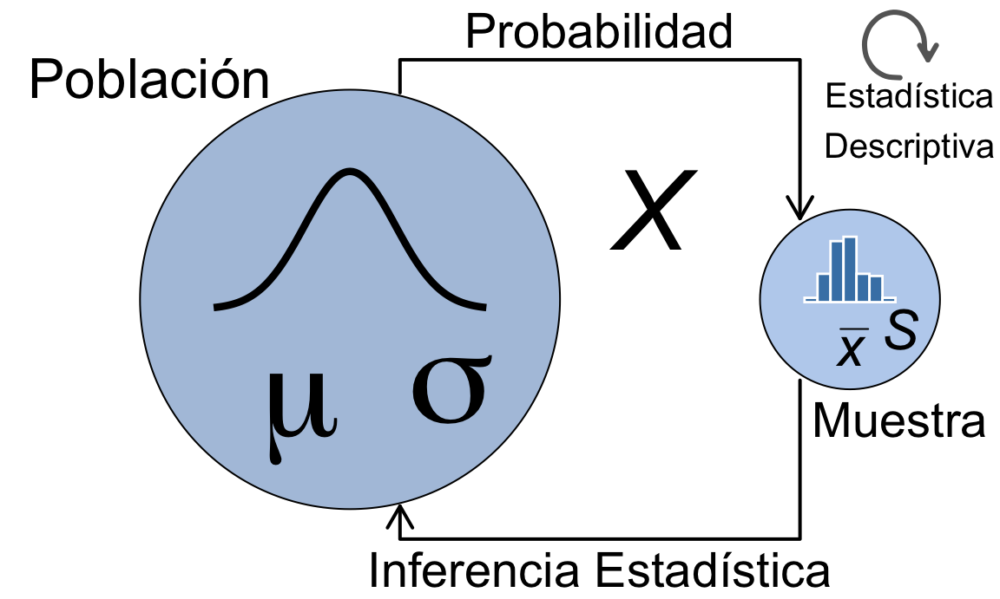
<p class="caption">(\#fig:dogma2b)Variables aleatorias vs. datos empíricos</p>
</div>


## Concepto y definición de variable aleatoria

Las variables aleatorias son variables numéricas cuyos valores vienen determinados por el azar.
Utilizaremos letras mayúsculas $X, Y, \ldots$ para representar variables aleatorias, y letras minúsculas $x, y, \ldots$ para representar a los valores que toman. En definitiva, asignamos un número a cada posible resultado del experimento.
Matemáticamente, una variable aleatoria es una función definida sobre el espacio muestral $\Omega$
perteneciente a un espacio de probabilidad $(\Omega, \aleph, \wp)$
y que toma valores en el **conjunto** de los números reales $\mathbb{R}$:

$$
\begin{aligned}
X: \quad & \Omega \longrightarrow \mathbb{R}\\
& \omega \longrightarrow X(\omega)
\end{aligned}
$$

La variable aleatoria así definida cumple las siguientes características:

1. La imagen de cada elemento del espacio muestral, $X(\omega)$, es única .
2. La inversa de la variable aleatoria aplicada a cualquier intervalo de $\mathbb{R}$ 
pertenece a la sigma álgebra de sucesos $\aleph$.

$$M \in \mathbb{R} \implies X^{-1}(M) \in \aleph.$$

La medida de probabilidad $\wp$ del espacio de probabilidad $(\Omega, \aleph, \wp)$
se aplica entonces a intervalos de los números reales en vez de a sucesos de $\aleph$:

$$M \in \mathbb{R} \implies \wp(M)=P[X \in M].$$
A esta medida de probabilidad inducida por una variable aleatoria se le suele denominar **modelo de distribución de probabilidad**.


\BeginKnitrBlock{rmdejemplo}<div class="rmdejemplo">

Consideremos un experimento consistente en lanzar una moneda equilibrada 
al aire tres veces. El espacio
muestral de este experimento aleatorio es el siguiente:

$$\Omega=\{ (+,+,+), (c,+,+), (+,c,+), (+,+,c), (c,c,+),(c,+,c),  (+,c,c), (c,c,c) \}$$

Definamos ahora la variable aleatoria "Número de caras" en el experimento
anterior. La variable aleatoria quedaría definida como sigue:

$$\begin{aligned}
X: \quad & \Omega & \longrightarrow & \quad \mathbb{R}\\
& (+,+,+) & \longrightarrow & \quad 0\\
& (c,+,+) & \longrightarrow & \quad 1\\
& (+,c,+) & \longrightarrow & \quad 1\\
& (+,+,c) & \longrightarrow & \quad 1\\
& (c,c,+) & \longrightarrow & \quad 2\\
& (c,+,c) & \longrightarrow & \quad 2\\
& (+,c,c) & \longrightarrow & \quad 2\\
& (c,c,c) & \longrightarrow & \quad 3
\end{aligned}$$

Por tanto, el campo de variación de la variable aleatoria $X$ o imagen de $X$ ($\mathit{Im}(X)$) es:

$$\mathit{Im}(X) = \{0, 1, 2, 3\}$$


Ahora, basándonos en el espacio de probabilidad $(\Omega, \aleph, \wp)$, podemos
calcular probabilidades sobre cualquier subconjunto de $\mathbb{R}$, por ejemplo:

$$P[X=0] = \frac{1}{8}; \quad P[X \geq 2] = \frac{1}{2}; \quad P[X >10] = 0.$$</div>\EndKnitrBlock{rmdejemplo}


### Tipos de variables aleatorias

Las variables aleatorias quedan definidas por su **campo de variación** y el 
**conjunto de probabilidades** que toman. El campo de variación es el recorrido
de la variable aleatoria, es decir, los valores que puede tomar. El conjunto de probabilidades
es el definido por la medida de probabilidad $\wp$.


De acuerdo a la naturaleza de su campo de variación, las variables aleatorias 
pueden ser principalmente de dos tipos:

- Discretas: toman un conjunto de valores numerable ($x_i$).
- Continuas: toman un conjunto de valores no numerable ($x$).

También hay variables aleatorias mixtas, que no se tratan en este texto.


### Operaciones con variables aletorias

En general, una función de variables aleatorias es otra variable aleatoria.
Sobre una o varias variables aleatorias podemos definir funciones.
En particular, en los próximos apartados
de este capítulo definiremos **funciones** para realizar cálculo de **probabilidades** 
sobre los valores que puede tomar la variable aleatoria, **transformaciones**
de la variable aleatoria para calcular características de las mismas,
y **combinaciones** de variables aleatorias y sus propiedades. Matemáticamente:


$$
\begin{aligned}
X: \quad & \Omega  \longrightarrow \mathbb{R}\\
g(X): \quad & \mathbb{R} \longrightarrow \mathbb{R}\\
g(X,Y): \quad & \mathbb{R}^2 \longrightarrow \mathbb{R}\\
\end{aligned}
$$

Los siguientes son ejemplos de funciones aplicadas a variables aleatorias:

$$X^2; \quad 1.5\cdot X; \quad aX + b; \quad X\cdot Y; \quad \ldots$$


----

### Variables aleatorias y conjuntos

El paso de sucesos a variables aleatorias nos va a permitir operar con probabilidades
de la misma forma que hacíamos con los sucesos. Las mismas operaciones
que hacíamos con sucesos, las vamos a poder realizar con subconjuntos
de los números reales, ya que, en definitiva, 
$\mathbb{R}$ es un conjunto. Así, el complementario de un suceso,
pasa a ser el complementario de un intervalo o
conjunto de intervalos de los números reales, la unión de dos sucesos pasa a ser el conjunto de
números que pertenecen a alguno de los dos subconjuntos de números reales, y la
intersección de sucesos pasa a ser el conjunto de números que pertenecen a los dos 
subconjuntos de números reales. Algunos ejemplos:

- Complementario de un suceso: $[X \leq 1]^c$= $X>1$.
- Unión de sucesos: $[10, 20] \cup (15, 30) = [10, 30)$.
- Intersección de sucesos: $[10, 20] \cap (15, 30) = (15, 20]$.


## Función de distribución

Definamos una función sobre una variable aleatoria que le asigne a cada 
valor de $X$, $x$, la probabilidad de que la variable aleatoria $X$ tome
valores menores o iguales que dicho valor $x$:

$$\boxed{F(x) = P[X \leq x]}.$$

$F$ será por tanto una función cuyo dominio es $\mathbb{R}$ y 
recorrido el intervalo $[0, 1]$:

$$\begin{aligned}F: & \mathbb{R}  \longrightarrow & [0, 1]\\
& x \longrightarrow & F(x)
\end{aligned}$$


Propiedades de la función de distribución:

-  Está acotada en el intervalo $[0, 1]$: $0 \leq F(x) \leq 1$.
-  Monóntona no decreciente: $a < b \implies F(a) \leq F(b) \;\;\forall a, b \in \mathbb{R}$.
-  Continua por la derecha: $\lim\limits_{x \to x_0^+} F(x) = F(x_0)$.
-  $\lim\limits_{x \to \infty} F(x) = 1$.
-  $\lim\limits_{x \to -\infty} F(x) = 0$.

Una consecuencia de estas propiedades es la siguiente, que nos proporciona
una forma de calcular probabilidades para cualquier intervalo a partir de la
función de distribución:

$$\boxed{P[a < X \leq b] = F(b)- F(a)}.$$

Podemos comprobarlo fácilmente pensando en los números reales como conjuntos y
aplicando las propiedades de la probabilidad. Efectivamente, a partir de $F(b)$,
que se corresponde con la $P[X\leq b]$, y como $a < b$:

$$X \leq b = (-\infty, b] = (-\infty , a] \cup (a, b]. $$
Como $(-\infty , a]$ y $(a, b]$ con conjuntos disjuntos  (sucesos mutuamente excluyentes):

$$P[X \in (-\infty, b]\, ] = P[X \in (-\infty , a]\,] + P[X \in (a, b]\,]\implies\\
 P[X \in (a, b]\,] = P[X \in (-\infty, b]\, ] - P[X \in (-\infty , a]\,] = F(b)- F(a).$$

Además, por las propiedades de la probabilidad^[O visto de otro modo, haciendo $b=\infty$, y entonces $F(b)=1$.]:

$$\boxed{P[X>a] = 1-F(a)},$$
dado que $P[X>a] = P[(X\leq a)^c]=1 -P[X\leq a]=1-F(a).$

## Variable aleatoria discreta {#sec:vadi}

Son variables aleatorias discretas aquellas que pueden tomar un conjunto de valores
finito o infinito numerable, 
$x_i$, $i=1, 2, \ldots, n$ o $i=1, 2, \ldots, \infty$.
Formalmente, son aquellas cuya **función de distribución no es continua**. 
Esta discontinuidad es de salto finito,
y los saltos se producen en los valores que toma la variable, $x_i$.
A cada posible valor $x_i$ se le asigna una probabilidad $p(x_i) = P[X=x_i]$.
Los saltos son de longitud igual a $p(x_i)$.


### Función de probabilidad

Dado que la variable aleatoria $X$ no toma valores entre $x_{i-1}$, y $x_i$, podemos
definir la **función de probabilidad de una variable aleatoria discreta** como:

$$\begin{aligned}
p: &\mathbb{R} \longrightarrow [0, 1]\\
&X \longrightarrow p(x_i)
\end{aligned}$$

$$p(x_i) = P[X=x_i]=P[x_{i-1}<X \leq x_i] = F(x_i)-F(x_{i-1}).$$


Nótese que la expresión anterior demuestra la magnitud de los saltos en las discontinuidades
de la función de distribución de una variable aleatoria discreta. La función de probabilidad 
de una variable aleatoria discreta también se puede llamar función de cuantía o 
función de masa de probabilidad. Se puede encontrar también la notación abreviada $p_i$ 
para referirse a $p(x_i)$.


Para que una función $p(x_i)$ sea función de probabilidad debe cumplir las siguientes
condiciones:

- $p(x_i) \geq 0 \; \forall i$.
- $\sum\limits_{i=1}^\infty p(x_i) = 1$.

A partir de la función de probabilidad podemos llegar a la función de distribución
de cualquier variable aleatoria discreta como sigue:

$F(x_i) = \sum\limits_{j=1}^i p(x_j),$

esto es, _acumulando_ la probabilidad de los valores iguales o inferiores a
cada valor $x_i$.


\BeginKnitrBlock{rmdejemplo}<div class="rmdejemplo">


En el experimento descrito anteriormente de lanzar tres monedas, definíamos la
variable aleatoria:

$$X: \text{Número total de caras}.$$

La función de probabilidad de esta variable aleatoria la podemos
calcular por la definición de Laplace contando los casos favorables de 
$\Omega$ para cada valor de la variable aleatoria $X$, y sería la siguiente:

$$\begin{aligned}
p: & \quad \mathbb{R} & \longrightarrow & \quad [0,1]\\
& \quad X & \longrightarrow & \quad p(x_i) = P[X = x_i]\\
& \quad 0 & \longrightarrow & \quad P[X = 0] = \frac{1}{8}\\
& \quad 1 & \longrightarrow & \quad P[X = 1] = \frac{3}{8}\\
& \quad 2 & \longrightarrow & \quad P[X = 2] = \frac{3}{8}\\
& \quad 3 & \longrightarrow & \quad P[X = 3] = \frac{1}{8}
\end{aligned}$$
  
La figura \@ref(fig:ddiscretam) representa gráficamente la función de 
probabilidad^[Normalmente se representan líneas verticales en vez de únicamente el punto para una mejor visualización.].  

A partir de la función de probabilidad, aplicando que $F(x_i) = \sum\limits_{j=1}^i p(x_j)$, la función de distribución 
sería la siguiente:

$$\begin{aligned}
F: & \quad \mathbb{R} & \longrightarrow & \quad [0,1]\\
& \quad X & \longrightarrow & \quad F(x_i) = P[X \leq x_i]\\
& \quad 0 & \longrightarrow & \quad P[X \leq 0] = \frac{1}{8}\\
& \quad 1 & \longrightarrow & \quad P[X \leq 1] = \frac{4}{8}=\frac{1}{2}\\
& \quad 2 & \longrightarrow & \quad P[X \leq 2] = \frac{7}{8}\\
& \quad 3 & \longrightarrow & \quad P[X \leq 3] = \frac{8}{8}=1
\end{aligned}$$

  
La figura \@ref(fig:pdiscretam) representa gráficamente la función de distribución, que
se puede expresar de la siguiente forma:

$$F(x)=
\begin{cases}
0  \quad \;\,\text{si } \quad x < 0\\
\frac{1}{8}  \quad \text{ si } \quad  0\leq x < 1\\
\frac{1}{2}  \quad \text{ si }  \quad 1\leq x < 2\\
\frac{7}{8}  \quad \text{ si }  \quad 2\leq x < 3\\
1  \quad \;\,\text{si }  \quad x \geq 3\\
\end{cases}$$  </div>\EndKnitrBlock{rmdejemplo}


<div class="figure" style="text-align: center">
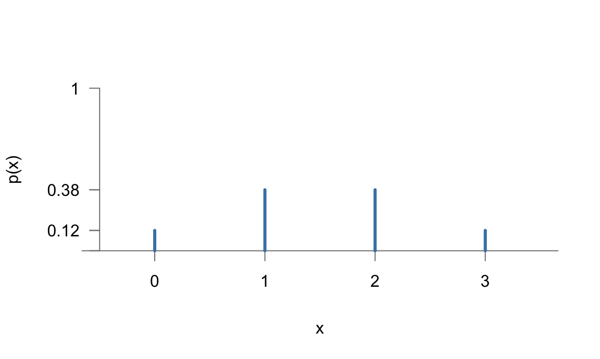
<p class="caption">(\#fig:ddiscretam)Representación de la función de probabilidad para el experimento de las monedas</p>
</div>


<div class="figure" style="text-align: center">
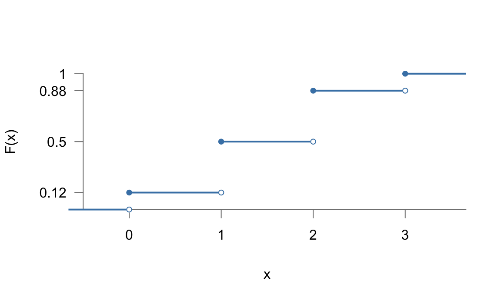
<p class="caption">(\#fig:pdiscretam)Representación de la función de distribución para el ejemplo de las monedas</p>
</div>


Otros ejemplos de variables aleatorias discretas serían aquellos en los
que realizamos recuentos u observamos características, por ejemplo:

- Número de defectos por m^2^ en una superficie.
- Indicador de pieza correcta/incorrecta.
- Puntuación en una escala de valoración (por ejemplo _Likert_).
- Número de clientes que llegan a un banco cada hora.
- Número de unidades defectuosas en un lote de productos.


\BeginKnitrBlock{rmdejemplo}<div class="rmdejemplo">Vamos a ampliar el ejemplo ilustrativo de los sujetos en estudio
descrito en el capítulo de introducción a la probabilidad. Supongamos que se envía a los 
sujetos una serie de mensajes de seguimiento por correo electrónico de forma
*aleatoria*, y que el número de mensajes recibidas por un cliente puede ser 20, 36, o 60, 
con probabilidades $\frac{36}{52}$, $\frac{12}{52}$ y $\frac{4}{52}$ respectivamente.
Podemos así definir la variable aleatoria $X:$ _Número de mensajes remitidos por correo electrónico en un año a los sujetos en estudio_, cuyo campo de variación es $\{20, 36, 60\}$ y cuyas funciones de probabilidad y distribución se representan respectivamente en las figuras \@ref(fig:ddiscreta) y \@ref(fig:pdiscreta). La tabla \@ref(tab:ejdiscretat) muestra ambas funciones numéricamente.</div>\EndKnitrBlock{rmdejemplo}


Table: (\#tab:ejdiscretat)Funciones de probabilidad y distribución para la variable discreta del ejemplo ilustrativo

| $x_i$| $p(x_i)$| $F(x_i)$|
|-----:|--------:|--------:|
|    20|   0,6923|   0,6923|
|    36|   0,2308|   0,9231|
|    60|   0,0769|   1,0000|


<div class="figure" style="text-align: center">
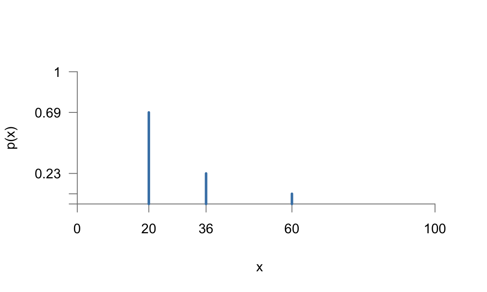
<p class="caption">(\#fig:ddiscreta)Representación de la función de probabilidad de una variable aleatoria discreta</p>
</div>


<div class="figure" style="text-align: center">
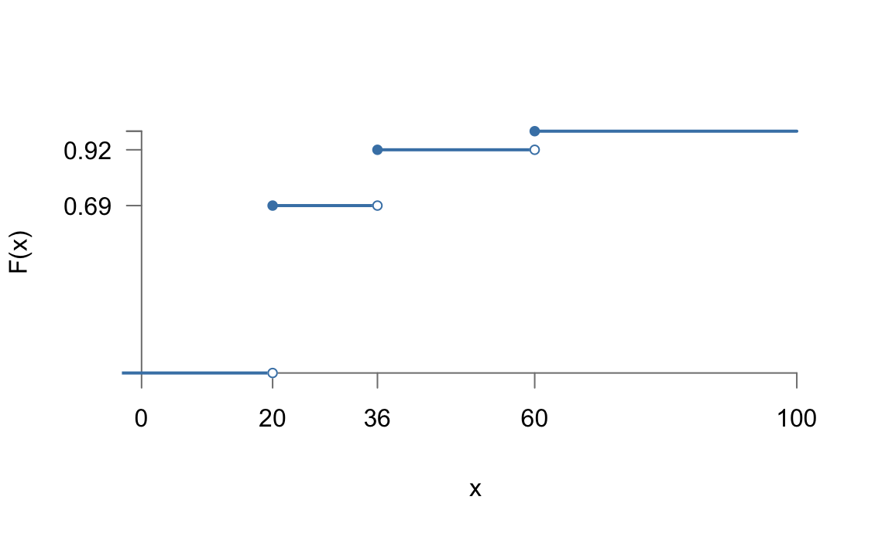
<p class="caption">(\#fig:pdiscreta)Representación de la función de distribución de la variable aleatoria discreta del ejemplo ilustrativo</p>
</div>


## Variable aleatoria continua


Son variables aleatorias continuas aquellas que pueden tomar un 
**número infinito no numerable de valores**.
Formalmente, son aquellas cuya función de distribución, $F(x)$, es continua y
derivable en todo su dominio. Al ser la variable continua, puede tomar
cualquier valor en un intervalo de su dominio. Podemos utilizar las propiedades
de la función de distribución para calcular probabilidades en cualquier intervalo
de la siguiente forma:

\begin{equation}
  P[a<X\leq b]=F(b)-F(a).
  (\#eq:Fcont)
\end{equation}

Ahora bien, por ser $F$ continua, entre $a$ y $b$ siempre hay masa de probabilidad, y no podemos obtener
una función de probabilidad como en el caso discreto. Esto es porque no existe un valor
anterior a uno dado $x$. Podemos _acercar_
los dos extremos del intervalo tanto como queramos, por ejemplo en la ecuación \@ref(eq:Fcont) para calcular $P[X=b]$ podríamos buscar el valor anterior a $b$ aproximando $a$ a $b$, pero
siempre habría un valor más allá, y finalmente la 
**probabilidad para un valor concreto de la variable aleatoria es igual a cero**.

$$\boxed{P[X=x]=0}\; \forall x \in \mathbb{R}.$$


\BeginKnitrBlock{rmdcafe}<div class="rmdcafe">Intuitivamente, podemos entender esta característica pensando en la definición de probabilidad
de Laplace. Si tuviéramos que _contar_ el número de casos favorables para que la
variable aleatoria tome un valor concreto, sería 1. Pero los casos posibles, por
ser variable continua, son infinitos, y por tanto la probabilidad 
sería $\frac{1}{\infty}$.</div>\EndKnitrBlock{rmdcafe}


Es importante señalar que, en la práctica, el número de valores de una variable 
aleatoria que podamos _medir_ será finito, pero la variable aleatoria seguirá siendo
continua conceptualmente, y la aplicación de sus propiedades nos permitirá resolver
aquellos problemas prácticos, aunque el aparato de medida utilizado no 
nos permita ir más allá de cierta precisión.

<div class="rmdcafe">
<p>Piensa en tu marca de cerveza favorita (o cualquier otra bebida), por
ejemplo en el formato de 33 cl (tercio). Cuando la pides en un bar,
¿cuál crees que es la probabilidad de que la botella tenga
<strong>exactamente</strong> 33 cl?</p>
<p>En realidad, si medimos con una precisión, por ejemplo, de un
decimal, podemos obtener mediciones de <span
class="math inline">\(33.0\)</span> <em>cl</em>. Pero las mediciones
están sujetas a un error, y en realidad lo que nos está diciendo esa
medición es que el volumen está entre <span
class="math inline">\(32.95\)</span> y <span
class="math inline">\(33.05\)</span>, intervalo del cual sí podemos
calcular su probabilidad.</p>
</div>


Entonces nos surge la siguiente pregunta: si no podemos calcular la probabilidad
de los _sucesos_ individuales, ¿cómo saber qué valores son más probables?
¿dónde se concentra la probabilidad? Precisamente la continuidad de la
función de distribución nos proporciona la herramienta matemática para resolver
estas cuestiones. La figura \@ref(fig:fdistcambio)
muestra la representación gráfica de la función de densidad $F(x)$ de una determinada
variable aleatoria $X$. 

<div class="figure" style="text-align: center">
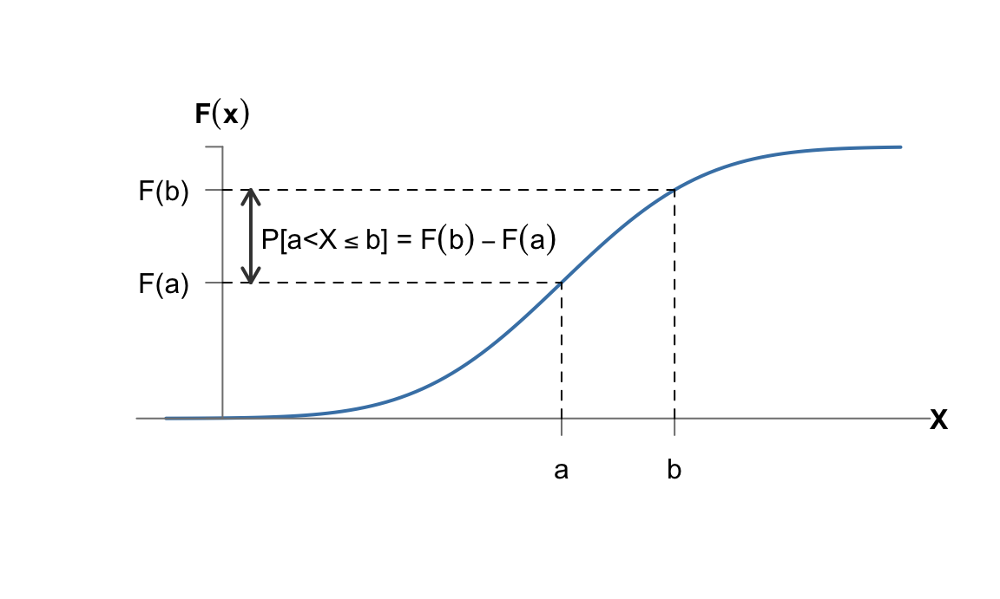
<p class="caption">(\#fig:fdistcambio)Función de distribución de una variable continua y probabilidad de un intervalo</p>
</div>


Como podemos ver, la probabilidad en un intervalo cualquiera,
es el **cambio** que se produce en la función de distribución entre los 
extremos del intervalo. Si acercamos los extremos del intervalo, es decir, hacemos que 
$b$ _tienda_ a $a$, obtenemos la tasa **instantánea** de cambio en un
punto, que representa la masa de probabilidad en ese punto, y que es la derivada
de la función de distribución en ese punto:

$$\lim\limits_{b \to a}\frac{F(b)- F(a)}{b-a}.$$

\BeginKnitrBlock{rmdcafe}<div class="rmdcafe">La derivada de una función en un punto se corresponde con la pendiente de la recta tangente
a la función en ese punto. En nuestro caso, la pendiente de la recta tangente a la 
función de distribución es la que nos proporciona la "densidad" de probabilidad.
Se muestra a continuación una aplicación interactiva para visualizar el concepto
de derivada como pendiente de la recta tangente^[accesible también en https://elcano.shinyapps.io/derivada/], que se puede aplicar a cualquier función de
distribución.</div>\EndKnitrBlock{rmdcafe}

<iframe src="https://elcano.shinyapps.io/derivada/?showcase=0" width="100%" height="800px" data-external="1"></iframe>


### Función de densidad

Si pensamos en la probabilidad como la tasa de cambio en la función de distribución, entonces podemos definir la densidad de probabilidad como la derivada de la función de distribución, y calcular así probabilidades con esa función, llamada **función de densidad** que se
representa por $f(x)$:

$$f(x)= \frac{d F(x)}{dx}.$$

Además, por el teorema fundamental del cálculo, podemos obtener la función de distribución a
partir de la función de densidad mediante la integral:

$$F(x)=\int_{-\infty}^x f(t) dt =P[X\leq x].$$
La figura \@ref(fig:dp) representa la relación entre la función de densidad y
la función de distribución. Como se puede apreciar, el área debajo de la curva
de la función de densidad $f(t)$ se corresponde con las distintas probabilidades
de que la variable aleatoria tome valores en los intervalos que encierran dicha
área.


<div class="figure" style="text-align: center">
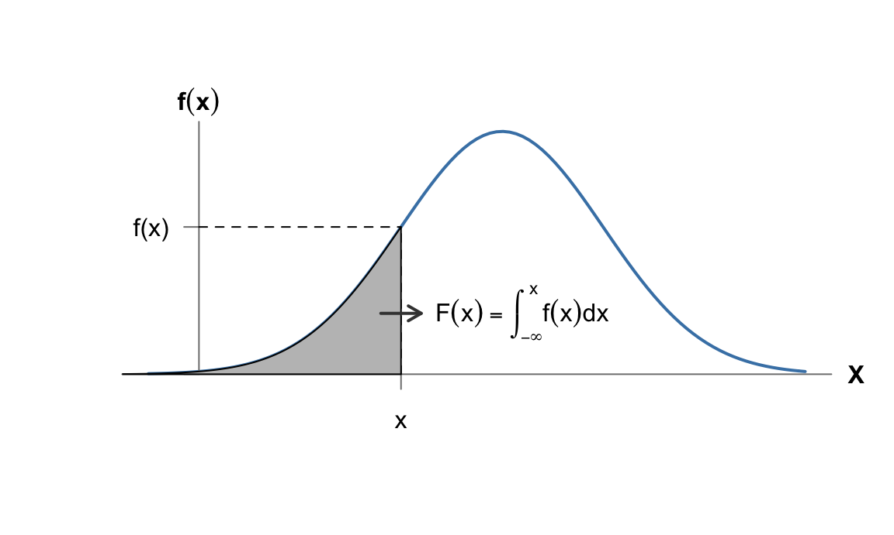
<p class="caption">(\#fig:dp)Relación entre las funciones de densidad y de probabilidad</p>
</div>


Para que una función $f(x)$ sea función de densidad, tiene 
que cumplir las siguientes condiciones:

1. $f(x)\geq 0$.

2. $\int_{-\infty}^\infty f(x)dx = 1$.

La primera condición impone la condición evidente de que la masa de probabilidad 
sea positiva. La segunda condición la impone el segundo axioma de la probabilidad
y las propiedades de la función de distribución, ya que:

$$\int_{-\infty}^\infty f(x)dx = F(\infty)=P[X\leq \infty] = P(\Omega)=1.$$
Esto implica que cualquier función $g(x)$ definida positiva en un determinado intervalo, se 
puede convertir en una función de densidad multiplicándola por una constante
$k$ calculada como:

$$k=\frac{1}{\int_{-\infty}^\infty g(x)dx}.$$

\BeginKnitrBlock{rmdejemplo}<div class="rmdejemplo">Supóngase que la empresa de servicios de nuestro ejemplo quiere hacer una campaña para aplicar entre un 5% y un 25% de descuento a sus clientes de forma aleatoria y lineal de forma que haya más descuentos bajos que altos. Entonces la función de densidad para la variable aleatoria $X=$ _Descuento aplicado a un cliente_ se puede modelizar mediante una recta con esta forma:

$$
f(x) = 
\begin{cases}
k(25-x) & \text{si } 5 \leq x \leq 25\\
0 & \text{resto}
\end{cases}
$$

que, para que sea función de densidad, debe cumplir que:

$$\int_{-\infty}^\infty f(x) dx=1,$$

y por tanto: 
$$k=\frac{1}{\int_{5}^{25} (25-x) dx} = 0.005.$$

La figura \@ref(fig:ejcontdesc) representa esta función de densidad.
</div>\EndKnitrBlock{rmdejemplo}

<div class="figure" style="text-align: center">
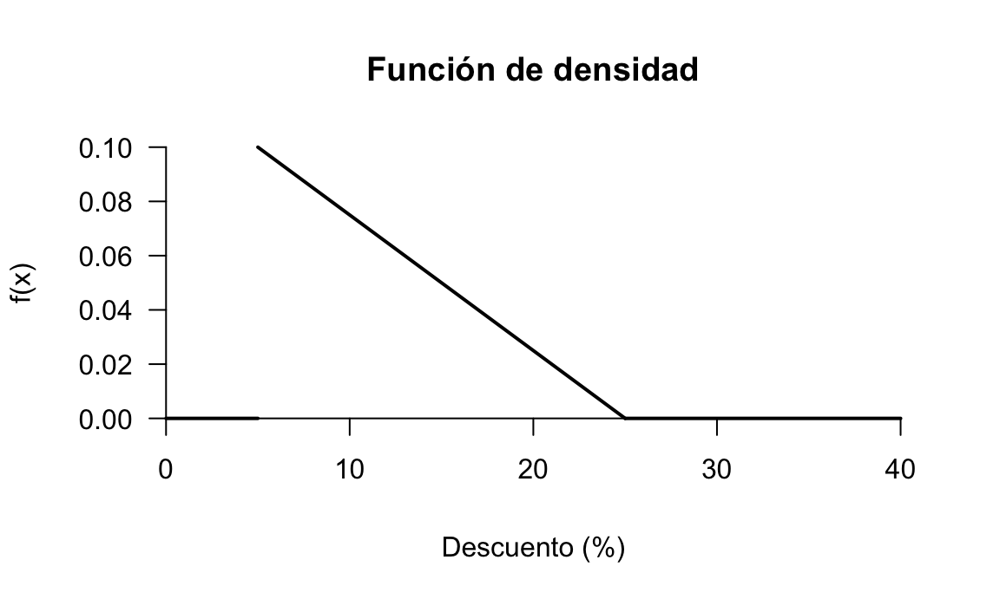
<p class="caption">(\#fig:ejcontdesc)Función de densidad del ejemplo de los descuentos</p>
</div>

\BeginKnitrBlock{rmdpractica}<div class="rmdpractica">Aunque las integrales que se presentan en este texto son inmediatas, en la práctica
el uso del software para resolverlas es más rápido y productivo. Se aconseja al lector
realizar las comprobaciones por sí mismo.

**MAXIMA**

Maxima resuelve integrales de forma simbólica. En el caso de una integral definida
obtenemos directamente el área bajo la curva de una función. En el ejemplo:

`1 / integrate(25-x, x, 5, 25);`

**R**
  
R puede calcular integrales definidas metiante métodos numéricos. El código a continuación
muestra la expresión para calcular la integral buscada y el valor de $k$.
</div>\EndKnitrBlock{rmdpractica}


```r
integral <- integrate(f = function(x) { 25 - x }, 
                      lower = 5, 
                      upper = 25)
integral
#> 200 with absolute error < 2.2e-12
k <- 1/integral$value
k
#> [1] 0.005
```


\BeginKnitrBlock{rmdejemplo}<div class="rmdejemplo">
Sea la variable aleatoria $X$ con función de densidad:

$$f(x)=
\begin{cases}
\frac{1}{8}x \quad \text{si} \quad 0<x<4\\
0 \quad \quad \text{resto}
\end{cases}$$

Comprobar que es función de densidad, y obtener la función de distribución.

Para comprobar si es función de densidad, verificamos las dos condiciones:

1. $f(x)\geq 0$ según está definida (véase la figura \@ref(fig:ejfdensidad))

2. Integral en todo $\mathbb{R}$:

$$\int_{-\infty}^\infty f(x)dx = \int_{0}^4 \frac{1}{8}x dx = \left [ \frac{x^2}{16} \right]_{0}^4=1.$$
  
Para calcular la función de distribución, tenemos en cuenta que:

$$F(x)=\int_{-\infty}^x f(t) dt =P[X\leq x].$$

Como lo que queremos obtener es una **función**, y no un número, el límite
superior de la integral definida es variable (x). la función $f$ la ponemos
en función de $t$ simplemente para no utilizar el mismo símbolo $x$ y evitar
confusiones.
  
Si tenemos una función de densidad definida por trozos, tendremos que ir _acumulando trozos_.
Recorremos de menor a mayor los intervalos de $\mathbb{R}$ realizando la integral
definida completa para los intervalos anteriores al que
estamos considerando. Entonces, para nuestra función:

- Si $x\leq 0$:

$$F(x)=\int_{-\infty}^x 0 dt =0.$$
  
- Si $0 <x < 4$:

  $$F(x)=\int_{-\infty}^0 0 dt + \int_{0}^x \frac{1}{8}t dt = \left [ \frac{t^2}{16} \right]_{0}^x = \frac{x^2}{16}.$$

- Si $x>4$:

$$F(x)=\int_{-\infty}^0 0 dt + \int_{0}^4 \frac{1}{8}t dt + \int_{4}^x 0 dt= \left [ \frac{t^2}{16} \right]_{0}^4 = 1.$$

Expresamos por tanto la función de distribución, cuya representación aparece en la figura \@ref(fig:ejfdistrib), de la siguiente forma para todos sus intervalos:

$$
F(x)=
\begin{cases}
0 \;\; \quad \text{si} \quad x \leq 0\\
\frac{x^2}{16} \quad \text{si} \quad 0 <x <4\\
1 \;\; \quad \text{si} \quad x \geq 4\\
\end{cases}
$$</div>\EndKnitrBlock{rmdejemplo}

\BeginKnitrBlock{rmdpractica}<div class="rmdpractica">
**MAXIMA**

La integral definida para comprobar que vale uno sería:
  
`integrate((1/8)*x, x, 0, 4);`

Podríamos obtener la expresión de la función de distribución en el intervalo en que está definida 
con la siguiente expresión:

`integrate((1/8)*t, t, 0, x);`

**R**
  
El código a continuación realiza la comprobación de que la integral vale 1. R no puede
hacer cálculo simbólico para obtener una expresión de la función de distribución. No obstante,
se puede crear una función que obtenga valores de la función de distribución para utilizar 
posteriormente, o representarla gráficamente.
</div>\EndKnitrBlock{rmdpractica}


```r
integrate(f = function(x) { (1/8)*x }, 
                      lower = 0, 
                      upper = 4)
#> 1 with absolute error < 1.1e-14
Fx <-  function(x) {
  integrate(f = function(t) { (1/8)*t }, 
                      lower = 0, 
                      upper = x)
}
Fx(2)
#> 0.25 with absolute error < 2.8e-15
```

<div class="figure" style="text-align: center">
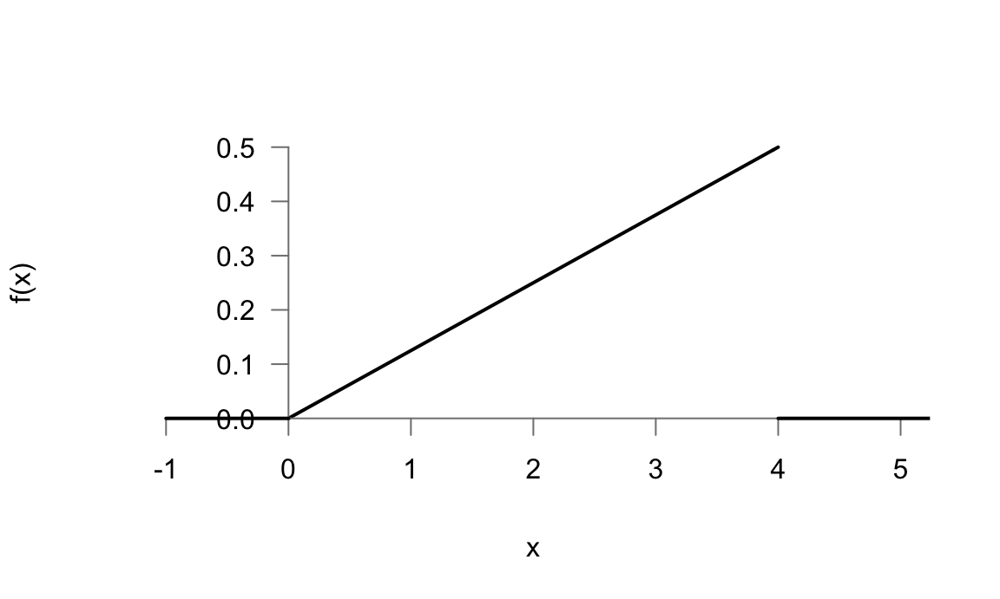
<p class="caption">(\#fig:ejfdensidad)Representación de la función de densidad del ejemplo</p>
</div>


<div class="figure" style="text-align: center">
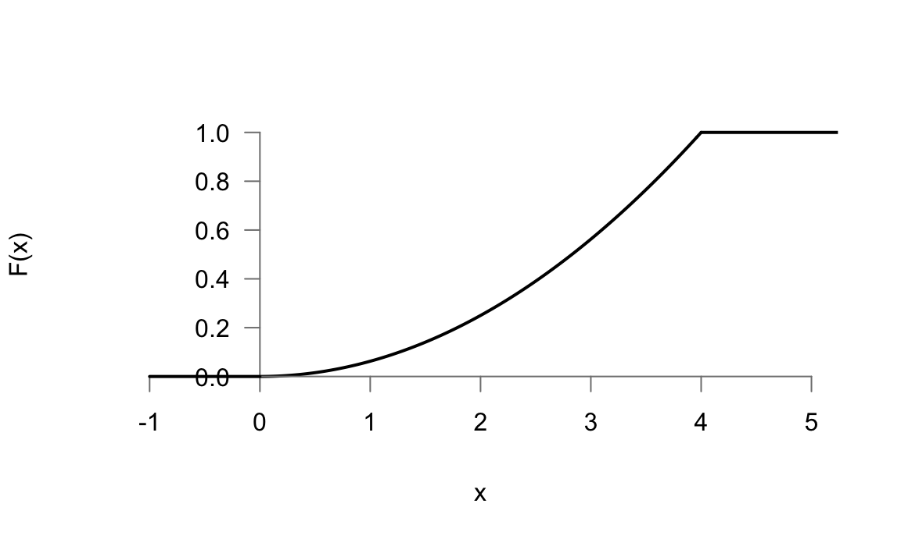
<p class="caption">(\#fig:ejfdistrib)Representación de la función de distribución del ejemplo</p>
</div>


----


Nótese que la función de densidad **no es una probabilidad**, y, por tanto, 
podría tomar valores mayores que 1. Por otra parte, la función de densidad
puede ser discontinua.


Es fácil comprobar que:

$$P[a<X\leq b]=\int_a^b f(x)dx.$$

Lo que nos proporciona una forma de calcular probabilidades de una variable
aleatoria continua mediante la función de densidad (aunque no conozcamos la
función de distribución). Las probabilidades son, por lo tanto, equivalentes
al **área bajo la curva** de la función de densidad, que, esta vez
sí, tiene que ser menor o igual que 1. Utilizando las propiedades
de la probabilidad, podemos calcular probabilidades de cualquier intervalo 
utilizando tanto la función de densidad como la función de distribución, tal
y como se resume en la figura \@ref(fig:cprocont).

<div class="figure" style="text-align: center">
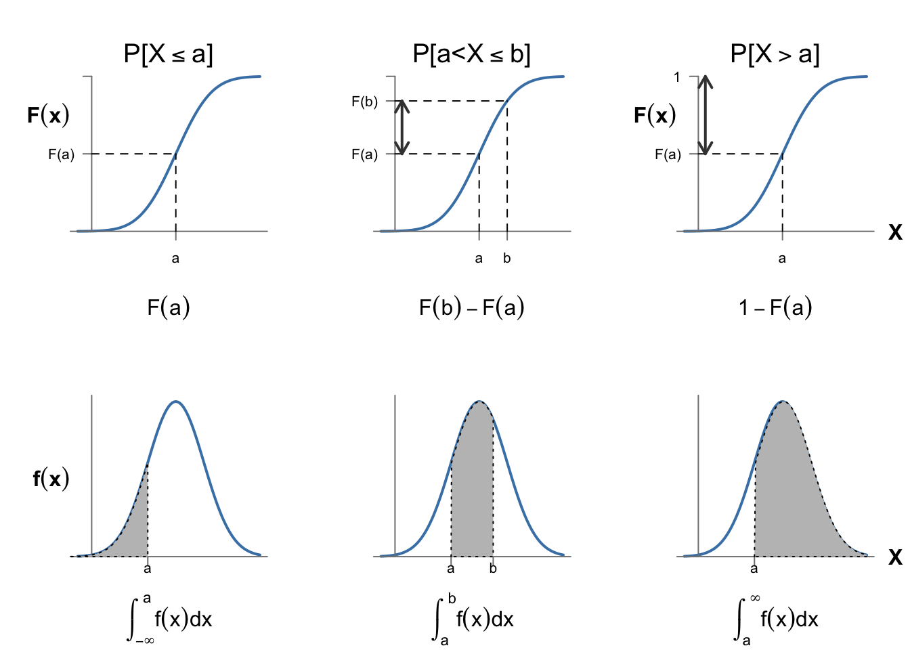
<p class="caption">(\#fig:cprocont)Cálculo de probabilidades de una variable continua</p>
</div>


Para mejorar la comprensión de la función de densidad, cuya importancia
es vital en el cálculo de probabilidades, vamos a relacionarla con otros conceptos
ya conocidos por el lector. En primer lugar, en el tránsito de variables discretas
a continuas, hemos pasado del sencillo cálculo del sumatorio $(\sum)$ al
intimidante cálculo con integrales $(\int)$. Sin embargo, una integral es
en realidad una _suma infinita_ de áreas bajo la curva cuando tomamos intervalos 
cada vez más pequeños.
En segundo lugar, recordemos la definición de
probabilidad como **frecuencia relativa** en el límite. Entonces decíamos,
que si pudiéramos repetir un experimento un número grande de veces,
la frecuencia relativa de ocurrencia de un suceso tendía a la probabilidad de 
ese suceso. En el marco de las variables aleatorias, tendríamos un número
grande de realizaciones de la variable aleatoria, es decir, de números reales.
Como sabemos por la estadística descriptiva, estos valores los podemos
agrupar en intervalos y contar las frecuencias de los valores dentro de cada
intervalo, representándolos en un **histograma**. Pues bien, si tenemos 
muchos números, y hacemos la amplitud
de los intervalos muy pequeños, entonces el histograma de los datos
se parece cada vez más a la función de densidad de la variable aleatoria
que describe el experimento^[Se parecerá más cuantos más datos tengamos, pero téngase en cuenta que la forma del histograma, con datos empíricos, será _aproximada_ (nunca exacta) a la forma de la función, _teórica_.], recuérdese la Figura \@ref(fig:dogma2b). Además, el área de las barras del histograma
representa también las probabilidades de los intervalos que podamos formar.
La figura \@ref(fig:densidadfreq) muestra esta relación entre frecuencias 
y función de densidad en un determinado experimento.

<div class="figure" style="text-align: center">
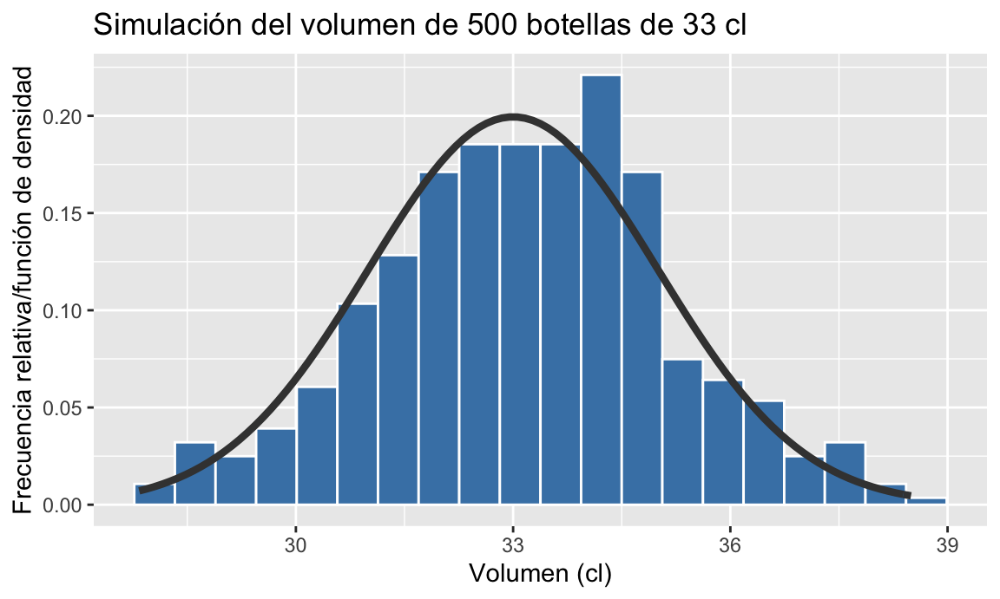
<p class="caption">(\#fig:densidadfreq)Frecuencias, histograma y función de densidad</p>
</div>


Una última consideración en cuanto a las variables aleatorias continuas es
la irrelevancia práctica de incluir o no el símbolo igual en las desigualdades.
Si bien en las variables aleatorias discretas sí habrá una diferencia numérica
que puede ser importante en aplicaciones prácticas, en las variables aleatorias
continuas la utilización del símbolo $\leq$ o el símbolo $<$, o sus contrarios
$\geq$ y $>$ es irrelevante para el cálculo. Efectivamente, como la probabilidad en un punto, $P[X=x]=0$,
entonces se cumple para variables continuas que:

$$P[X\leq x] = P[X<x]; \quad P[X\geq x] = P[X>x].$$

Pero mucho cuidado porque esto **no pasa con las variables aleatorias discretas**.
Además, siempre es preferible utilizar los símbolos de forma adecuada aunque
no tenga consecuencias prácticas.


\BeginKnitrBlock{rmdejemplo}<div class="rmdejemplo">
Sea la variable aleatoria del ejemplo anterior, con las siguientes
funciones de densidad y de distribución:

$$f(x)=
\begin{cases}
\frac{1}{8}x \quad \text{si} \quad 0<x<4\\
0 \quad \quad \text{resto}
\end{cases}\;;
F(x)=
\begin{cases}
0 \;\; \quad \text{si} \quad x \leq 0\\
\frac{x^2}{16} \quad \text{si} \quad 0 <x <4\\
1 \;\; \quad \text{si} \quad x \geq 4\\
\end{cases}
$$

Calcular:

$$P[1<X<2].$$

Lo podemos hacer a través de la función de densidad:

$$P[1<X<2]=\int_{1}^2 f(x)dx = \int_{1}^2 \frac{1}{8}x dx = \left [ \frac{x^2}{16} \right]_{1}^2=\frac{2}{8}-\frac{1}{16} = \frac{3}{16},$$

y también a través de la función de distribución:


$$P[1<X<2]=F(2)-F(1)=\frac{4}{16}-\frac{1}{16} = \frac{3}{16}.$$</div>\EndKnitrBlock{rmdejemplo}

\BeginKnitrBlock{rmdpractica}<div class="rmdpractica">
**MAXIMA**

La probabilidad pedida se calcularía simplemente:
  
`integrate((1/8)*x, x, 1, 2);`

**R**
  
El código a continuación calcula la probabilidad pedida.
</div>\EndKnitrBlock{rmdpractica}


```r
integrate(f = function(x) { (1/8)*x }, 
                      lower = 1, 
                      upper = 2)
#> 0.1875 with absolute error < 2.1e-15
```


\BeginKnitrBlock{rmdejemplo}<div class="rmdejemplo">El tiempo de duración (en minutos) de la visita de un potencial usuario de un servicio tras seguir el link de una oferta es una variable aleatoria $X$ que sigue una distribución de probabilidad según la siguiente función de densidad:

$$f(x) = 
\begin{cases}
2e^{-2x} & \text{si } x > 0\\
0 & \text{si } x\leq 0
\end{cases}$$

La representación gráfica de esta función aparece en la figura \@ref(fig:densejilu). 
Podemos comprobar que es una función de densidad verificando que cumple los dos 
requisitos. Es una función exponencial multiplicada por un número positivo, por
tanto es siempre positiva. Comprobemos el área debajo de la curva para todo su
dominio:

$$\int_{-\infty}^\infty f(x) dx = 1 \iff \int_0^\infty 2e^{-2x} dx=\left[-e^{-2x}\right ]_0^\infty=1$$

La función de distribución de esta variable aleatoria será:
  
$$F(x) = \int_{-\infty}^x f(x) dx = \int_0^x 2e^{-2t} dt=\left[-e^{-2t}\right ]_0^x=1-e^{-2x},$$

y su representación gráfica es la que se muestra en la figura \@ref(fig:distejilu).

¿Qué porcentaje de visitantes abandonarán probablemente la página antes de 10 segundos?
(nótese que 10 segundos = 10/60 minutos). 

Dado que tenemos la función de distribución,
es más sencillo obtenerlo a través de esta que resolviendo la integral:

$$P[X<10/60] = F(10/60) = 1-e^{-2\cdot 10/60}= 0.2835.$$

Como la pregunta se hace en términos de porcentaje, la respuesta sería
aproximadamente un 28.35% de los visitantes.

</div>\EndKnitrBlock{rmdejemplo}


\BeginKnitrBlock{rmdpractica}<div class="rmdpractica">**MAXIMA**
  
Las siguientes expresiones obtienen en Maxima los resultados del ejemplo.

`integrate(2*exp(-2*x), x, 0, inf);`

`integrate(2*exp(-2*t),t, 0, x);`

`integrate(2*exp(-2*x), x, 0, 10/60);`
  
**R**
  
En el siguiente código de R se realizan los cálculos explicados en el ejemplo.
</div>\EndKnitrBlock{rmdpractica}


```r
integrate(function(x) 2*exp(-2*x), 0, Inf)
#> 1 with absolute error < 5e-07
integrate(function(x) 2*exp(-2*x), 0, 10/60)
#> 0.2834687 with absolute error < 3.1e-15
```


<div class="figure" style="text-align: center">
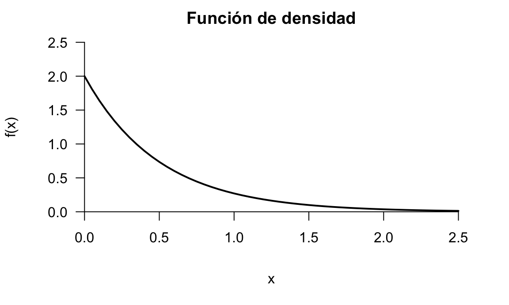
<p class="caption">(\#fig:densejilu)Representación de la función de densidad del ejemplo ilustrativo</p>
</div>
<div class="figure" style="text-align: center">
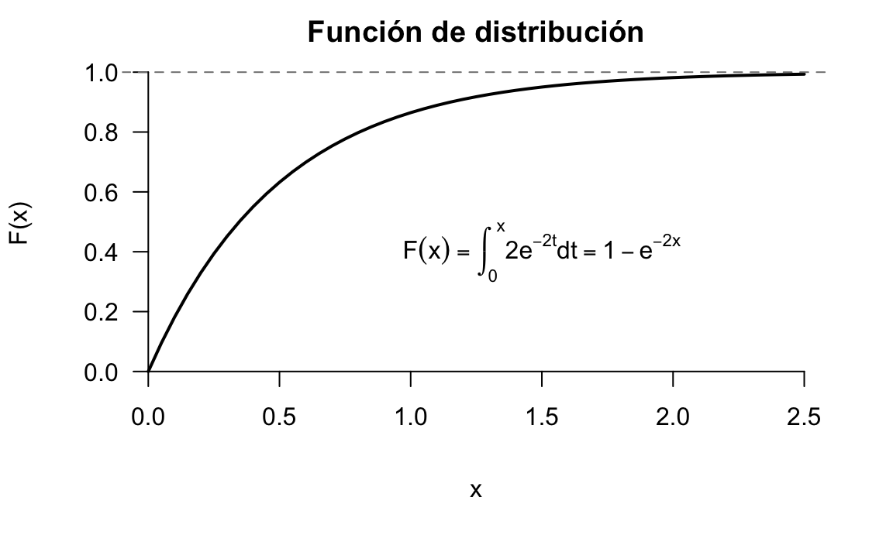
<p class="caption">(\#fig:distejilu)Representación de la función de distribución del ejemplo ilustrativo</p>
</div>


## Características de una variable aleatoria


Al igual que con los datos concretos de una muestra podemos calcular estadísticos que resumen la información, las variables 
aleatorias constan de **parámetros** de centralización, posición y forma que caracterizan la variable aleatoria a través de su distribución de probabilidad.
A través de los posibles valores de una variable aleatoria y sus probabilidades podemos
definir estas características. Las más importantes son la esperanza (media) y la varianza. 
Una vez más, téngase en cuenta que estos parámetros de la variable aleatoria
son **valores teóricos de la variable aleatoria**, generalmente referidas a una
población de la cual tenemos sólo información parcial a través de una muestra (recuérdese la figura \@ref(fig:dogma2b)).


### Esperanza Matemática

La Esperanza matemática se define sobre una función $g(x)$ de una variable aleatoria $X$ como:

$$E[g(X)]=\int_{\mathbb {R}} g(x) dF(x),$$

que en el caso discreto resulta en:


$$E[g(X)]=\sum\limits_i g(x_i)\cdot p(x_i),$$

y en el caso continuo:

$$E[g(x)] = \int_{-\infty}^\infty g(x) \cdot f(x)dx.$$

Así, la esperanza va a ser un número, ya sea calculado como suma de términos 
en el caso discreto, o como suma infinita a través de la integral definida.
El uso de integrales no debe intimidar, ya que no se trata más que de áreas debajo
de una curva, cuyo cálculo con el software apropiado es muy sencillo.
Se puede ver como la suma de los valores de la variable aleatoria (o una función
de ella) multiplicado por sus probabilidades. El resultado va a ser el _valor esperado_,
que se corresponde con la media de la distribución, su valor central.


<div class="rmdcafe">
<p>El uso de la palabra esperanza en este ámbito tiene su origen, cómo
no, en los juegos de azar. Así, se hablaba de la esperanza de ganar en
el juego (y la ganancia que se esperaba tener era el resultado), y
también del <em>temor</em>, cuando la esperanza era negativa.</p>
</div>


La esperanza se define como hemos visto sobre una función cualquiera de la variable
aleatoria $g(x)$. Si $g(x)=x$, entonces tendremos la 
esperanza de la propia variable aleatoria. Se cumplen las
siguientes propiedades para la esperanza matemática:

- La esperanza de una constante es esa misma constante:

$$c \;\;\text{constante} \implies E[c] = c.$$

- Sea una variable aleatoria que es suma de $n$ variables aleatorias. Entonces su esperanza es la suma de las esperanzas de dichas variables aleatorias:

$$E\left [ \sum\limits_{i=1}^n X_i\right ] = \sum\limits_{i=1}^n E[X_i].$$

- Sea una variable aleatoria que es producto de $n$ variables aleatorias. Entonces su esperanza es el producto de las esperanzas de dichas variables aleatorias si y solo si dichas variables aleatorias son independientes:

$$E\left [ \prod\limits_{i=1}^n X_i\right ] = \prod\limits_{i=1}^n E[X_i] \iff X_i \;\; \text{independientes}.$$

- La esperanza de una variable aleatoria es su valor central:

$$E[X] = \mu \implies E[X-\mu]=0.$$ 

A la variable aleatoria transformada $X-\mu$ se le denomina **variable aleatoria centrada**, y su media es cero.

- Sea una variable aleatoria que es una transformación lineal de otra variable aleatoria. Entonces su esperanza es la misma transformación lineal de la esperanza de la variable original:

\begin{equation}
a, b \;\;\text{constantes} \implies E[a + bX] = a + bE[X].
(\#eq:tlesp)
\end{equation}

- Si la integral no existe, la variable aleatoria no tiene esperanza. 
Esto puede pasar cuando no existe la integral que la define^[En el caso de variables discretas, cuando la suma no converge.].


### Momentos de variables aleatorias unidimensionales

Hemos visto que la esperanza se define sobre una determinada función $g(x)$ de la variable aleatoria.
Los momentos se definen sobre unas funciones muy específicas y que nos van a permitir
caracterizar a las variables aleatorias.
Se define el momento de orden $r$ respecto al origen de una variable aleatoria $X$, $\alpha_r$, como:

$$\alpha_r = E[X^r].$$

El momento de orden 1 respecto del origen es la media de la variable aleatoria, $\mu$:

$$\alpha_1=\boxed{E[X]=\mu}.$$

El momento de orden $r$ respecto de la media $\mu$ de una variable aleatoria, $\mu_r$ se define como:

$$\mu_r = E\left [(X - \mu)^r\right ].$$
Nótese que, en realidad, $X-\mu$ es una **variable aleatoria centrada** cuya esperanza
es igual a cero por las propiedades de la esperanza enumeradas anteriormente, y por tanto:

$$X-\mu \implies \mu_1=E\left [X - \mu\right ] = 0.$$

En el caso discreto, estos momentos se calcularán respectivamente como:

$$\alpha_r = \sum\limits_{i} x_i^r p(x_i),$$

y 

$$\mu_r = \sum\limits_{i} (x_i- \mu)^r p(x_i).$$

En el caso continuo, se calcularán respectivamente como:

$$\alpha_r = \int_{-\infty}^\infty x^r f(x) dx,$$

y

$$\mu_r = \int_{-\infty}^\infty (x-\mu)^r f(x) dx.$$


Se verifica la siguiente relación entre los momentos respecto del origen y los momentos
respecto de la media que nos ayudarán, como veremos posteriormente, a simplificar
los cálculos:


\begin{equation}
\mu_r = \alpha_r - \binom{r}{1}\alpha_1 \alpha_{r-1} + \binom{r}{2}\alpha_1^2 \alpha_{r-2} + \cdots + (-1)^r\alpha_1^r = \\
=\sum\limits_{k=0}^r (-1)^k\binom{r}{k}\mu^k \alpha_{r-k}.
(\#eq:momentos)
\end{equation}

También se verifica que:

- Si existe $\alpha_r$, entonces existen también todos los $\alpha_s$ tales que $s<r$.
- Si existe $\mu_r$, entonces existen también todos los $\mu_s$ tales que $s<r$.

En resumen, podemos calcular momentos respecto de la media (que requieren cálculos más costosos) a través de momentos respecto del origen (cuyos cálculos son más sencillos). 
Y si existe un momento, todos los de orden inferior también existen.


### Medidas de centralización de una variable aleatoria

Ya hemos visto que la esperanza matemática de una variable aleatoria se corresponde con su valor central, al que denominaremos **media**, y es el parámetro de centralización de la variable aleatoria.
Es importante no confundir este valor medio o esperado de la variable aleatoria, que es teórico, referido a una población, con la media de unos datos concretos, que es empírica, calculada para una muestra.

$$\mu = \alpha_1= E[X],$$

cuyo cálculo para variables discretas es el siguiente:

$$\mu = \boxed{E[X] =  \sum\limits_{i} x_i p(x_i)},$$

y para variables continuas:

$$\mu = \boxed{E[X] = \int_{-\infty}^\infty x f(x) dx},$$


La **mediana** es otra medida de centralización, y es el valor de la variable aleatoria que _divide_ la probabilidad del espacio muestral en dos **mitades**. Por tanto, será el primer 
valor de la variable aleatoria para el cual la función de distribución vale $0.5$:

$$\mathit{Me}=\inf x : F(x)\leq 0.5.$$

En variables discretas a menudo la mediana se puede obtener simplemente de
la tabla de valores de $F(x)$. Un método más general consiste en obtener la
función inversa de la función de distribución, $F^{-1}(x)$, que estará en función de la probabilidad 
acumulada, y sustituir la probabilidad por $0.5$:

$$F(x) = p \iff x = F^{-1}(p) \implies Me = F^{-1}(0.5).$$
Cuando no es posible despejar la $x$ hay que recurrir a métodos
numéricos para obtener la inversa de la función de distribución. 
La figura \@ref(fig:inversaF) muestra gráficamente la mediana
como inversa de la función de distribución en $F(x) = 0.5$.

<div class="figure" style="text-align: center">
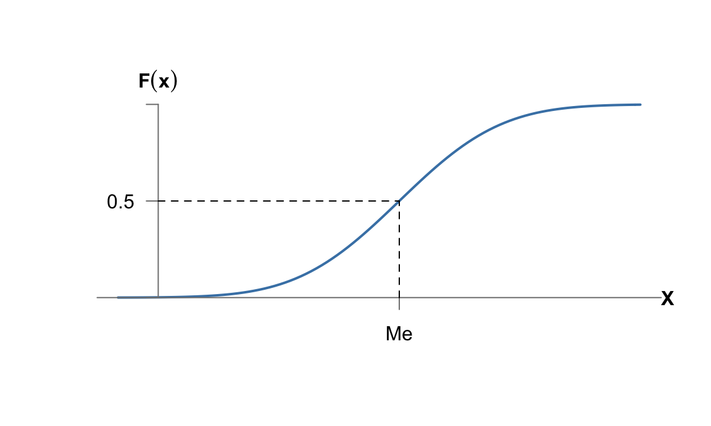
<p class="caption">(\#fig:inversaF)La mediana a portir de la inversa de la función de distribución</p>
</div>


Por último, la **moda** de una variable aleatoria es el valor donde la función de probabilidad o la función de densidad tienen su máximo. La moda puede no ser única, y en particular para variables continuas se suele hablar de distribuciones _bimodales_ o 
_multimodales_ cuando tienen más de un máximo local (aunque solo uno de ellos sea
el máximo absoluto). En la figura \@ref(fig:vacentra) se representan las tres medidas
de una determinada variable aleatoria con una determinada función de densidad. Nótese que en una distribución de probabilidad 
asimétrica, como es la que se representa, la media se desplaza hacia la cola
más larga.


<div class="figure" style="text-align: center">
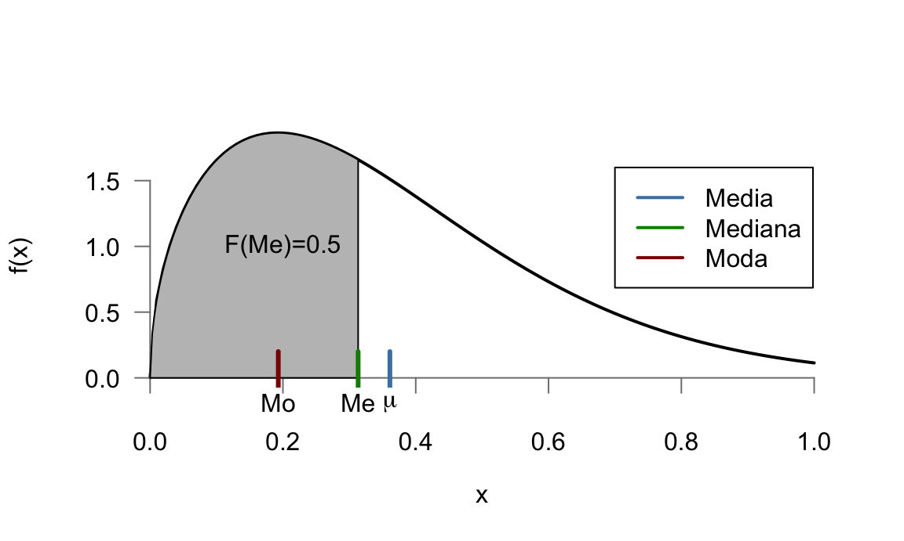
<p class="caption">(\#fig:vacentra)Medidas de centralización de una variable aleatoria</p>
</div>


\BeginKnitrBlock{rmdejemplo}<div class="rmdejemplo">
La media de la variable aleatoria _número de caras_ del experimento 
descrito más arriba y consistente en lanzar una moneda tres veces, es la siguiente:

$$\mu=E[X]=0\cdot \frac{1}{8}+1\cdot \frac{3}{8}+2\cdot \frac{3}{8}+3\cdot \frac{1}{8}=1.5.$$
  
Para obtener la mediana, miramos en la función de distribución
el primer valor para el que $F(x)\ge 0.5$, y entonces la mediana es 1.
La moda es el valor más frecuente, mirando en la función de probabilidad vemos
que los valores 1 y 2 tienen la frecuencia más alta. Como vemos, la moda puede
no ser única (sí lo son siempre la media y la mediana.)
</div>\EndKnitrBlock{rmdejemplo}

\BeginKnitrBlock{rmdpractica}<div class="rmdpractica">**HOJA DE CÁLCULO**

Disponemos los posibles valores de la variable $x_i$ en la primera columna,
las probabilidades en la segunda columna. En la tercera columna calculamos $x_i\cdot p_i$,
y sumamos los valores.

**R**

Podemos guardar los valores y sus probabilidades en sendos vectores y calcular la
esperanza calculando la suma del producto de ambos vectores, como se muestra en el siguiente código.</div>\EndKnitrBlock{rmdpractica}


```r
x_i <- 0:3
p_i <- c(1/8, 3/8, 3/8, 1/8)
Ex <- sum(x_i*p_i)
Ex
#> [1] 1.5
```


\BeginKnitrBlock{rmdejemplo}<div class="rmdejemplo">
La media de la variable aleatoria definida por la función de densidad:

$$f(x)=
\begin{cases}
\frac{1}{8}x \quad \text{si} \quad 0<x<4\\
0 \quad \quad \text{resto}
\end{cases}$$

Se calcula de la siguiente forma:

$$\mu=E[X]=\int_{-\infty}^\infty xf(x)dx = \int_{0}^4 \frac{1}{8}x^2 dx = \left [ \frac{x^3}{24} \right]_{0}^4=\frac{64}{24}=\frac{8}{3}\simeq 2.67.$$
  
Para obtener la mediana, tendríamos que obtener la inversa de la función 
de distribución, $F^{-1}(p)$, y sustituir $p$ por $0.5$. En este caso es sencillo,
basta con despejar $x$ de la función de densidad (nos centramos solo en el tramo
donde la densidad es mayor de cero):
  
$$F(x) = p = \frac{x^2}{16} \iff x = F^{-1}(p) = +\sqrt{16p}$$
Tomamos solo la raíz positiva puesto que sabemos que la variable está entre 0 y 4.
Entonces la mediana de esta variable aleatoria es:

$$F^{-1}(0.5) = +\sqrt{16\cdot 0.5} = 2\sqrt{2} \approx 2.8284.$$

En cuanto a la moda sería 4, ya que es el valor donde la función de densidad 
es máximo, al ser una recta de pendiente positiva entre 0 y 4 (véase la figura \@ref(fig:ejfdensidad)).
</div>\EndKnitrBlock{rmdejemplo}


\BeginKnitrBlock{rmdpractica}<div class="rmdpractica">**MAXIMA**

La siguiente expresión devuelve el valor la integral definida con el resultado de la esperanza:
  
`integrate(x*(1/8)*x, x, 0, 4);`

**R**

El código a continuación obtiene la esperanza de la variable aleatoria.
</div>\EndKnitrBlock{rmdpractica}


```r
integrate(function(x) x*(1/8)*x, 0, 4)
#> 2.666667 with absolute error < 3e-14
```


<div class="rmdejemplo">
<p>Vamos a calcular las medias de las variables aleatorias de los
ejemplos de sujetos en estudio. Para la variable aleatoria discreta:</p>
<p><span class="math inline">\(X:\)</span> Número de mensajes remitidas
por correo electrónico en un año a los sujetos,</p>
<p>la media sería:</p>
<p><span class="math display">\[\mu=E[X]=\sum\limits_{i=1}^3 x_i p_i =
20\cdot \frac{36}{52} + 36 \cdot \frac{12}{52} +
60\cdot\frac{4}{52}\simeq26.7692.\]</span> Para la variable aleatoria
continua:</p>
<p><span class="math inline">\(X:\)</span> Tiempo de duración de la
visita a la web de un sujeto,</p>
<p>la media sería:</p>
<p><span class="math display">\[\mu=E[X]=\int_{-\infty}^\infty x f(x) dx
= \int_{0}^\infty x \cdot 2 e^{-2x}dx = 0.5,\]</span></p>
<p>resolviendo la integral por partes y aplicando la regla de
Barrow.</p>
</div>

\BeginKnitrBlock{rmdpractica}<div class="rmdpractica">**HOJA DE CÁLCULO** (variable discreta)

Disponemos los posibles valores de la variable $x_i$ en la primera columna,
las probabilidades en la segunda columna. En la tercera columna calculamos $x_i\cdot p_i$,
y sumamos los valores.

**MAXIMA**

La esperanza de la variable continua la podemos obtener con la siguiente 
expresión:
  
`integrate(x*2*exp(-2*x), x, 0, inf);`

**R**

Para la variable discreta, podemos guardar los valores y sus probabilidades en sendos vectores y calcular la
esperanza calculando la suma del producto de ambos vectores, como se muestra en el siguiente código. Para la variable continua, utilizamos la función `integrate` para calcular la integral. Nótese que se pueden usar límites infinitos.</div>\EndKnitrBlock{rmdpractica}


```r
x_i <- c(20, 36, 60)
p_i <- c(36/52, 12/52, 4/52)
Ex <- sum(x_i*p_i)
Ex
#> [1] 26.76923
```


```r
integrate(function(x) x*2*exp(-2*x), 0, Inf)
#> 0.5 with absolute error < 8.6e-06
```


### Medidas de dispersión de una variable aleatoria

La **varianza** es el parámetro de dispersión de la variable aleatoria. Se define como el momento de orden 2 respecto de la media, y se representa por $\sigma^2$. 

$$V[X] = \sigma^2 = \mu_2 = E\left [(X- \mu)^2 \right ],$$

que para variables discretas se calcula como: 

$$\sigma^2 = V[X] =  \sum\limits_{i} (x_i- \mu)^2 p(x_i),$$

y para variables continuas como:

$$\sigma^2 = V[X] = \int_{-\infty}^\infty (x-\mu)^2 f(x) dx.$$

Aplicando la relación entre los momentos respecto del origen y los momentos respecto de la media 
de la ecuación \@ref(eq:momentos) resulta que:

$$\mu_2 = \alpha_2-\alpha_1^2,$$

y podemos calcular la varianza con la siguiente expresión _abreviada_:

$$\boxed{\sigma^2= E[X^2] - E[X]^2},$$
donde 

$$\alpha_2=E[X^2]= \sum\limits_{i} x_i^2 p(x_i)$$
para variables discretas y:

$$\alpha_2=E[X^2]= \int_{-\infty}^\infty x^2 f(x) dx$$
para variables continuas.


La varianza de una variable aleatoria cumple además las siguientes *propiedades*:

- La varianza de una constante es nula:

$$V[c] = 0.$$

- La varianza de una variable aleatoria es siempre positiva:

$$V[X] \geq 0.$$

- Sea una variable aleatoria que es una transformación lineal de otra variable aleatoria. Entonces su varianza es:

$$a, b \;\;\text{constantes} \implies \boxed{V[a + bX] = b^2 V[X]}.$$

Nótese la diferencia con la esperanza de la transformación lineal vista en la ecuación \@ref(eq:tlesp).


La **desviación típica** de la variable aleatoria es la raíz cuadrada positiva de la varianza. La desviación típica viene expresada en las mismas unidades que la variable aleatoria, mientras que la varianza está expresada en las unidades de la variable aleatoria al cuadrado.

$$\sigma = +\sqrt{V[X]}.$$

Una caracteristica adimensional de la variabilidad es el **coeficiente de variación**, que es el cociente entre la desviación típica y la media de la variable aleatoria. Si la media fuera negativa, se suele expresar en valor absoluto:

$$\mathit{CV}= \frac{\sigma}{\mu}.$$

\BeginKnitrBlock{rmdejemplo}<div class="rmdejemplo">
Para calcular la varianza de la variable aleatoria _número de caras_ del experimento consistente en lanzar una moneda tres veces, primero calculamos el momento de orden 2 respecto del origen:

$$\alpha_2=E[X^2] = 0^2\cdot \frac{1}{8}+1^2\cdot \frac{3}{8}+2^2\cdot \frac{3}{8}+3^2\cdot \frac{1}{8}=3.$$
  
Como ya sabíamos que la media era $\mu=1.5$, entonces la varianza es:

$$\sigma^2=\alpha_2 -  \mu^2=3-\left(\frac{3}{2}\right )^2=\frac{3}{4}=0.75.$$

La desviación típica y el coeficiente de variación serán:
$$\sigma = \sqrt{3/4} \simeq 0.8660;\; CV = \frac{\sigma}{\mu} \simeq 0.5774 $$
  
Para calcular la media de la variable aleatoria definida por la función de densidad:

$$f(x)=
\begin{cases}
\frac{1}{8}x \quad \text{si} \quad 0<x<4\\
0 \quad \quad \text{resto}
\end{cases}$$

calculamos también en primer lugar el momento de orden 2 respecto del origen,
en este caso a través de la integral:

$$\alpha_2=E[X^2]=\int_{-\infty}^\infty x^2f(x)dx = \int_{0}^4 \frac{1}{8}x^3 dx = \left [ \frac{x^4}{32} \right]_{0}^4=\frac{256}{32}=8.$$


Como la media era $\mu=\frac{8}{3}$, la varianza es:

$$\sigma^2=\alpha_2 -  \mu^2=8-\left(\frac{8}{3}\right )^2=\frac{8}{9}\simeq 0.8889.$$
  
La desviación típica y el coeficiente de variación serán:
$$\sigma = \sqrt{8/9} \simeq 0.9428;\; CV = \frac{\sigma}{\mu} \simeq 0.3536 $$</div>\EndKnitrBlock{rmdejemplo}

\BeginKnitrBlock{rmdpractica}<div class="rmdpractica">**HOJA DE CÁLCULO (variable discreta)**

Si tenemos dispuestos los valores y probabilidades como se indicó más arriba,
podemos añadir dos columnas con el cálculo de $x_i^2$ y $x_i^2 \cdot p_i$ en cada fila, sumar esta última para obtener $\alpha_2$ y a continuación restarle
la media calculada anteriormente elevada al cuadrado, para obtener la varianza.

**MAXIMA**

Para la variable continua obtenemos $\alpha_2$ con la siguiente expresión,
y después podemos hacer operaciones para calcular todas las características:
  
`integrate(x^2*(1/8)*x, x, 0, 4);`

**R**

El siguiente código realiza todos los cálculos para obtener los distintos parámetros de dispersión.  </div>\EndKnitrBlock{rmdpractica}


```r
alpha_2 <- integrate(function(x) x^2*(1/8)*x, 0, 4)$value
alpha_1 <- integrate(function(x) x*(1/8)*x, 0, 4)$value
varianza <- alpha_2 - alpha_1^2; varianza
#> [1] 0.8888889
desv.tip <- sqrt(varianza); desv.tip
#> [1] 0.942809
cv <- desv.tip/alpha_1; cv
#> [1] 0.3535534
```


<div class="rmdejemplo">
<p>Vamos a calcular las varianzas de las variables aleatorias de los
ejemplos de sujetos en estudio. Para la variable aleatoria discreta:</p>
<p><span class="math inline">\(X:\)</span> Número de mensajes remitidos
por correo electrónico en un año a los sujetos,</p>
<p>el momento de orden dos con respecto al origen sería:</p>
<p><span class="math display">\[\alpha_2=E[X^2]=\sum\limits_{i=1}^3
x_i^2 p_i = 20^2\cdot \frac{36}{52} + 36^2 \cdot \frac{12}{52} +
60^2\cdot\frac{4}{52}\simeq 852.9231.\]</span></p>
<p>Y entonces, la varianza es:</p>
<p><span class="math display">\[\sigma^2=\alpha_2
-  \mu^2=852.9231-(26.7692)^2=136.333.\]</span></p>
<p>Para la variable aleatoria continua:</p>
<p><span class="math inline">\(X:\)</span> Tiempo de duración de la
visita a la web de un sujeto,</p>
<p>el momento de orden dos sería:</p>
<p><span class="math display">\[\alpha_2=E[X^2]=\int_{-\infty}^\infty
x^2 f(x) dx = \int_{0}^\infty x^2 \cdot 2 e^{-2x}dx = 0.5,\]</span></p>
<p>y entonces la varianza es:</p>
<p><span class="math display">\[\sigma^2=\alpha_2
-  \mu^2=0.5-(0.5)^2=0.25.\]</span></p>
</div>

\BeginKnitrBlock{rmdpractica}<div class="rmdpractica">**HOJA DE CÁLCULO (discreta)**

Procederíamos igual que en el ejemplo anterior, calculando en columnas,
sumando totales y finalmente aplicando la fórmula.

**MAXIMA**
  
La siguiente expresión calcularía $\alpha_2$, y a partir de ahí se
aplican las fórmulas para obtener los distintos parámetros.

`integrate(x^2*2*exp(-2*x), x, 0, inf);`

**R**

El código a continuación calcula la varianza de la variable 
aleatoria de forma análoga
al ejemplo anterior.</div>\EndKnitrBlock{rmdpractica}


```r
alpha_2 <- integrate(function(x) x^2*2*exp(-2*x), 0, Inf)$value
alpha_1 <- integrate(function(x) x*2*exp(-2*x), 0, Inf)$value
varianza <- alpha_2 - alpha_1^2; varianza
#> [1] 0.25
```


\BeginKnitrBlock{rmdejemplo}<div class="rmdejemplo">A partir de la variable aleatoria anterior:
  
$X:$ Tiempo de duración de la visita a la web de un sujeto,

supongamos que esta visita se produce siempre después de haber visto un
anuncio de 10 segundos, y queremos estudiar la variable:
  
$Y:$ Tiempo total de conexión con el servidor en segundos.

Esta nueva variable aleatoria se puede expresar como:
  
$$Y = 10 + 60 \cdot X$$
  
y tendrá una determinada distribución de
probabilidad cuya determinación no se trata en este texto. En cualquier caso,
a través de las propiedades de la esperanza y la varianza, sí podemos
calcular el valor de estas características para la nueva distribución.
Así:
  
$$E[Y] = 10 + 60 \cdot E[X] = 10 + 60 \cdot 0.5 = 40,$$
$$V[Y] =60^2 \cdot V[X] = 60^2 \cdot 0.5 = 1800.$$
</div>\EndKnitrBlock{rmdejemplo}


### Variable aleatoria estandarizada

La última de las propiedades de la varianza enumeradas anteriormente, es decir:

$$a, b \;\;\text{constantes}, Y=a+bX \implies V[Y] = b^2 V[X],$$

nos va a permitir _escalar_ cualquier variable aleatoria transformándola en otra que tenga desviación típica igual a uno. Efectivamente, si en la transformación lineal anterior hacemos $b=\frac{1}{\sigma}$:

$$V[Y]=\left(\frac{1}{\sigma}\right)^2 \cdot\sigma^2=1.$$

Si aplicamos esta transformación a una variable aleatoria centrada $X-\mu$, entonces tenemos una **variable aleatoria estandarizada** con media cero y desviación típica 1 y que normalmente se denota por $Z$:

$$Z=\frac{X-\mu}{\sigma}\implies \mu_Z=0;\; \sigma_Z=1.$$

Utilizaremos esta transformación para realizar cálculo de probabilidades del modelo de distribución normal en el capítulo \@ref(modelos). Además, tiene mucho interés en Estadística inferencial y en técnicas multivariantes que no se tratan en este texto.


### Otros parámetros

Al igual que se definió la mediana, podemos definir cualquier **cuantil** $X_p$ para una
probabilidad dada:

$$X_{p}= \inf x: F(x)\leq p$$

Por ejemplo, los cuantiles $0.25$ y $0.75$ serían los valores 
$X_{0.25}$ y $X_{0.75}$ que dejan por debajo una probabilidad de $0.25$ y $0.75$ respectivamente^[A estos valores se les conoce como cuartiles].
El método más general para calcular cualquier cuantil consiste en obtener 
la inversa de la función de distribución $x = F^{-1}(p)$ y dar valores a
$p$ (véase el ejemplo de la mediana más arriba).
La figura \@ref(fig:cuartil) muestra la representación del cuantil 0.75
en relación con una determinada función de densidad. 

También se pueden calcular a partir de los momentos otros parámetros como los coeficientes de asimetría y de curtosis de una variable aleatoria, que no se tratan en este texto.

<div class="figure" style="text-align: center">
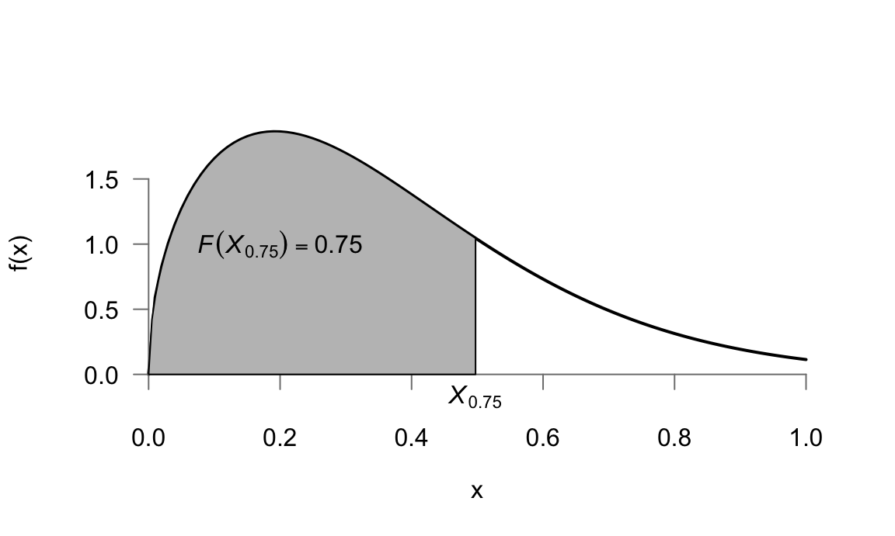
<p class="caption">(\#fig:cuartil)Cuantiles de una variable aleatoria</p>
</div>


### Desigualdad de Chebyshev

En ocasiones, es posible que conozcamos la media, $\mu$, y la varianza, $\sigma^2$, de una variable aleatoria, pero no conozcamos nada sobre su distribución de probabilidad. En estos casos, no podemos calcular la probabilidad en un intervalo, pero podemos acotar la probabilidad entre dos valores entorno a la media conocida. La fórmula general para
esta acotación es la siguiente:

$$P[|X-\mu|\geq k\sigma] \leq \frac{1}{k^2},$$
conocida como **desigualdad de Chebyshev**^[Podemos encontrar diversas grafías del apellido de este matemático ruso (1821-1894) como Chebyshov, Tchebychev, Tchebycheff, Tschebyscheff, Chebyshev o Čebišëv.] y que nos permite acotar la probabilidad de una variable aleatoria de dos formas:

- La probabilidad de que la variable aleatoria tome valores más extremos de $k$ desviaciones típicas desde la media es, como mucho, $\frac{1}{k^2}$, véase la figura \@ref(fig:cheby):

$$P[\mu-k\sigma \geq X \geq \mu+k\sigma] \leq \frac{1}{k^2}.$$


- La probabilidad de que la variable aleatoria tome valores dentro de $k$ desviaciones típicas desde la media es, como poco, $1-\frac{1}{k^2}$, véase la figura \@ref(fig:cheby2):

$$P[\mu-k\sigma < X < \mu+k\sigma] \geq 1- \frac{1}{k^2}.$$
Si lo que queremos es acotar la probabilidad para un valor concreto $x$, entonces podemos encontrar primero $k$ despejando de $\mu+k\sigma=x$ y después aplicar las propiedades de la probabilidad para encontrar una cota.

De la desigualdad de Chebyshev se deduce que, por ejemplo, para cualquier variable aleatoria la probabilidad de que esa variable aleatoria tome valores entre su media y dos desviaciones típicas es de, al menos, $0.75$:

$$P[\mu-2\sigma < X < \mu+2\sigma] \geq 1- \frac{1}{2^2}=0.75.$$
También podemos determinar mediante esta desigualdad, entre qué valores estará, al menos, una determinada probabilidad. 

<div class="figure" style="text-align: center">
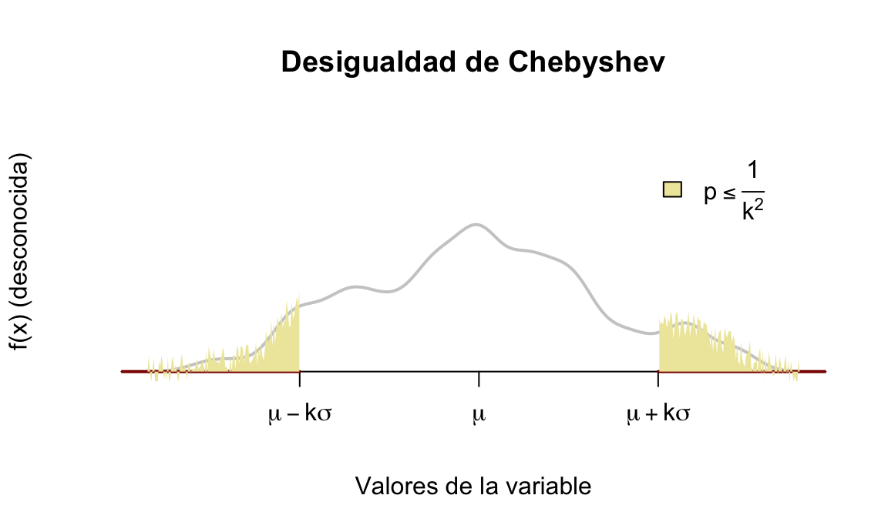
<p class="caption">(\#fig:cheby)Cota superior externa Desigualdad de Chebyshev</p>
</div>

<div class="figure" style="text-align: center">
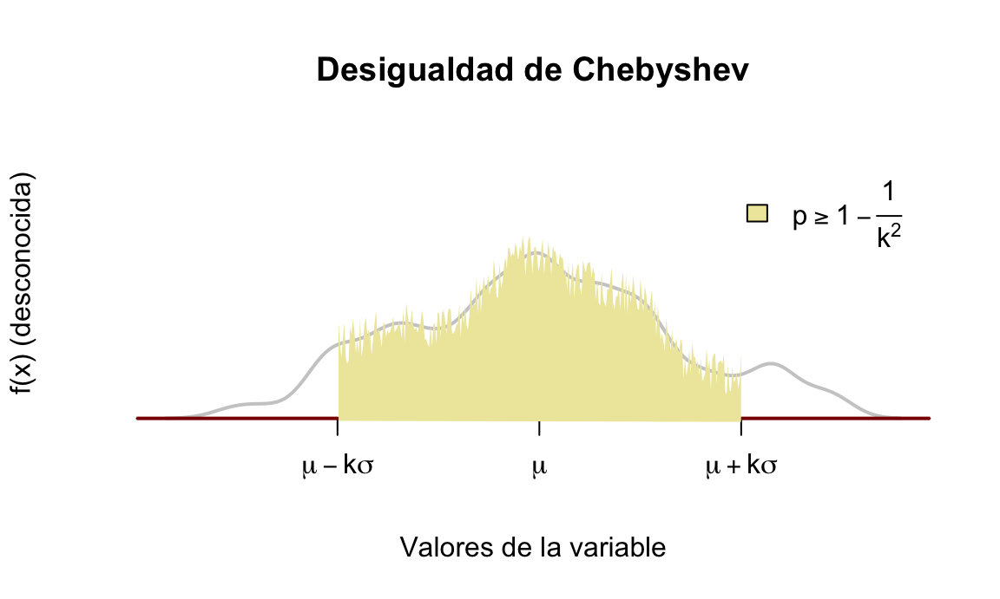
<p class="caption">(\#fig:cheby2)Cota inferior interna Desigualdad de Chebyshev</p>
</div>


\BeginKnitrBlock{rmdejemplo}<div class="rmdejemplo">

Se sabe que la media de una variable aleatoria es 9 y su varianza 4. ¿Entre qué dos valores tendremos, al menos, una probabilidad de 0.75?

De la propiedad que acabamos de ver, esto se cumple para $k=2$, y por tanto esos valores serán $\mu\pm 2\sigma=9\pm 2 \cdot \sqrt{4}  = [5, 13].$

¿Entre qué valores tendremos una probabilidad de, al menos, 0.84?

Para contestar a esta pregunta, calculamos primero $k$ teniendo en cuenta:

$$P[\mu-k\sigma < X < \mu+k\sigma] \geq 1- \frac{1}{k^2} \implies 1- \frac{1}{k^2}=0.84 \implies k=2.5,$$
y calculamos los valores como:

$$\mu \pm k\sigma = 9 \pm 2.5\cdot\sqrt{4} = [4,\; 14].$$
Entre $4$ y $14$ tendremos, al menos, una probabilidad de $0.84$. Y
a la inversa, más allá de estos valores tendremos, como mucho, una 
probabilidad de $0.16$.

¿Cuál sería la probabilidad de que esta variable aleatoria tome valores mayores de 15? 
  
No podemos contestar exactamente a esta pregunta puesto que no disponemos de la distribución de probabilidad. Pero sí podemos dar una cota de dicha probabilidad. En este caso tenemos que obtener $k$ sabiendo cuánto vale 
$\mu + k\sigma$:
  
$$\mu + k\sigma = 15 \iff k = \frac{15-9}{2}=3$$

Entonces:
  
$$P[9-3\cdot 2 > X > 9+3\cdot 2] \le \frac{1}{k^2} \iff P[3 > X > 15] \le \frac{1}{9} \approx 0.1111$$

Nótese que esto significa que:
  
$$P[X \le 3] + P[X \ge 15] \le 0.1111,$$

y por tanto si la suma de dos números es menor que 0.1111, entonces cada uno de ellos será como mucho ese valor, y podemos asegurar que la probabilidad de que esta variable aleatoria con media 9 y varianza 4 tome valores de 15 es menor de 0.1111.</div>\EndKnitrBlock{rmdejemplo}

