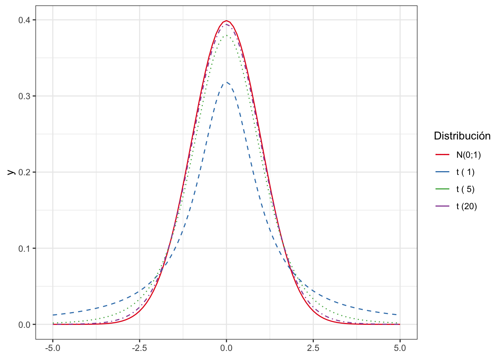

# (PART) Inferencia estadística {-}


# Muestreo y estimación {#muestreo}


## Muestreo Estadístico

El muestreo estadístico es el mecanismo por el que se selecciona la muestra a partir de una población. A grandes rasgos, hay que determinar cómo se seleccionan los elementos de la muestra y cuántos se seleccionan. Este tamaño muestral lo representamos por $n$, y a menudo se habla de "la $n$" del experimento (o del estudio, en general). El tamaño de la muestra lo determina la característica que queremos estudiar, que se representada por una **variable aleatoria**. En función del modelo de distribución de probabilidad que sigue la variable aleatoria, se determina el tamaño de la muestra.


:::{.rmdcafe data-latex=""}
Es importante diferenciar las muestras estadísticas de las muestras "biológicas" o de materiales. A veces estarán relacionadas, pero otras veces serán cosas totalmente distintas y no relacionadas.
:::


El muestreo es muy importante en cualquier estudio estadístico para poder extraer
conclusiones válidas y tomar decisiones sobre la poblaciónrespaldadas por los datos. El aspecto
más importante es que tienen que ser muestras representativas de la la población.
Para asegurar esta representatividad, utilizamos métodos probabilísticos, de forma
que los sesgos (falta de representatividad) que se produzcan sean achacables 
únicamente al azar, y no a otro tipo de cuestiones.

No siempre realizamos estudios estadísticos basados en una muestra extraída ad-hoc, sino
que analizamos datos disponibles que se han recogido o están disponibles sin
realizar un muestreo. Con estos datos podemos hacer estudios observacionales
(frente a los experimentos diseñados) siempre teniendo en cuenta que puede
haber sesgos y la muestra no represente a la población. Por otra parte, 
muchas veces no es posible hacer un muestreo completamente aleatorizado,
y entonces podemos recurrir a muestreos cuasi-probabilísticos. En cualquier
caso, hay que intentar evitar a toda costa las muestras "de conveniencia",
y plantearnos en todo momento si podemos considerar que es representativa
de la población.


:::{.rmdinfo data-latex=""}

La muestra debe **representar** a la población.

:::

## Muestreo probabilístico

Entre los muestreos probabilísticos, podemos elegir entre muestreo aleatorio simple (MAS), muestreo estratificado, muestreo por conglomerados y muestreo sistemático. Salvo en este último, en los demás necesitamos una enumeración e identificación de los individuos de la población. En el muestreo sistemático, necesitamos solamente un orden.

El **muestreo aleatorio simple** es el más sencillo. Todos los elementos de la población tienen la misma probabilidad de pertenecer a la muestra. Requiere tener identificados de alguna manera a los individuos de la población, y es adecuado en poblaciones pequeñas, homogéneas, en las que no hay patrones conocidos. 


:::{.rmdejemplo data-latex=""}

Se dispone del listado de depuradoras de agua de una región y se quiere estudiar alguna
característica específica de instalaciones sin hacer análisis a todas las depuradoras. Se seleccionan
al azar un número de depuradoras determinado.

:::

El **muestreo estratificado** es más adecuado en poblaciones no homogéneas. 
Se conocen grupos dentro de la población, que son diferentes entre ellos, 
pero las subpoblaciones dentro de los grupos son homogéneas. Además, se 
conoce algo sobre la distribución de la característica en cada grupo.
Entonces se obtiene una muestra aleatoria de cada uno de los grupos (estratos).
Este tipo de muestreo no es apropiado en poblaciones pequeñas.


:::{.rmdejemplo data-latex=""}

Si estamos estudiando una población en la que se sabe que la variable de interés se comporta de forma diferente en distintas CCAA, se consideran estos  estratos y se obtiene una submuestra de cada uno (por ejemplo en el caso anterior de las depuradoras).
:::


El **muestreo por conglomerados** también asume que se dispone de grupos en la población, 
pero son homogéneos entre sí (se parecen). 
Pero dentro de cada grupo la variable se comporta de forma heterogénea.
Puede existir una jerarquía (conglomerados dentro de los conglomerados).
Entonces se obtiene una muestra de grupos (no de individuos). 
Después se pueden estudiar TODOS los individuos de los grupos de la muestra, o aplicar otro muestreo dentro (por ejemplo, estratificado). Es adecuado cuando es más fácil llegar a todos los elementos de un grupo.


:::{.rmdejemplo data-latex=""}

Se estudian hábitos de higiene en las familias en una ciudad. Se divide en barrios y se elige muestra de barrios. Dentro de cada barrio, se eligen aleatoriamente edificios, y se estudian todas las familias del edificio

:::

No siempre tenemos la lista de elementos, como en los casos anteriores. Pero sí podemos "ordenarlos" de alguna manera,
por ejemplo, conforme llegan muestras (en el sentido biológico) a un laboratorio. Entonces podemos
realizar un **muestreo sistemático**. Para poder usarlo es importante estar 
seguro de que la característica no depende del orden.
Entonces, se elige un punto de partida (idealmente, aleatorio) y se toman elementos separados a distancia $k$ (coeficiente de elevación). Se puede aplicar en vez de MAS en cualquiera de las situaciones anteriores.


:::{.rmdejemplo data-latex=""}

En la producción de un fertilizante en bolas, se tomarán muestras de 10 bolas cada hora. Se elige aleatoriamente un instante la primera hora, y a partir de ahí cada 60 minutos se elegirán las siguientes 10 bolas.
:::


Cuando no es posible hacer un muestreo probabilístico, algunas veces pueden ser válidos 
muestreos no probabilísticos. Entonces podremos hacer estudios observacionales,
e incluso aplicar técnicas de inferencia estadística, pero con ciertas precauciones.
Las conclusiones pueden no ser válidas para toda la población, y hay que tenerlo en cuenta.
Hay que procurar que, al menos cualitativamente, podamos presumir que la muestra representa a la población,
o al menos no tener evidencias de que no es así. Los estudios observacionales (sobre datos que están ahí) son también muy valiosos. Si estos estudios nos dan luz sobre algo suficientemente importante, puede merecer la pena diseñar un experimento para confirmar las conclusiones.


## Parámetros y estimadores

Recordemos que los parámetros se definen sobre una Variable Aleatoria $X$ de la **población**. Son **Desconocidos**, pero siguen un modelo de distribución de probabilidad teórica de la variable aleatoria subyacente. En general, los queremos **estimar** mediante inferencia paramétrica. Los estadísticos son valores que se calculan con los datos de la **muestra**. En cada muestra serán distintos, es decir, habrá variabilidad, y por tanto son variables aleatorias, que siguen también una **distribución** de probabilidad. Esa distribución de probabilidad del estadístico es lo que llamamos distribución en el muestreo.


:::{.rmdejemplo data-latex=""}

$\mu, \sigma^2 \text{ y }  \pi$ representan los parámetros media, varianza y proporción de una determinada característica en la población. Son desconocidos, y dependen de la distribución de la característica en estudio. 
$\bar x, s^2 \text{ y } p$ son estadísticos calculados con los $n$ datos de una muestra.
:::

Un estimador es un estadístico mediante el cual estimamos el valor de un 
parámetro. Esa estimación estará sujeta a un error, que se puede cuantificar si se ha seguido un muestreo probabilístico. El error va a depender de las propiedades del estimador y del tamaño de la muestra.
Representamos con $\hat \mu = \bar x$ que la media muestral $\bar x$ es un estimador de la media poblacional $\mu$


:::{.rmdejemplo data-latex=""}
* Proporción: $\hat \pi = p$
* Media: $\hat \mu = \bar x$ 
* Varianza: $\hat \sigma^2 = s^2 = \frac{1}{n-1}\left( \sum x_i^2 - n \bar x^2 \right )$
:::


Para determinar qué estimador utilizar para un parámetro, se estudia su 
distribución en el muestreo. Las siguientes son propiedades deseables de los estimadores:

* **Insesgado**: Que la esperanza del estimador sea igual al verdadero valor del parámetro.

* **Eficiente**: Que tenga la mínima varianza posible.

* **Consistente**: Que tenga menor variabilidad a mayor tamaño de muestra.


## Distribución en el muestreo de los principales estadísticos

### Media muestral

Sea la variable aleatoria $X$ con $E[X] = \mu$ y $V[X] = \sigma^2$. Obtenemos muestras de tamaño $n$: $x_1, \ldots, x_i, \ldots, x_n$. Usamos la media muestral como estimador de la media poblacional:

$$\hat  \mu = \bar x = \frac 1 n \sum\limits_1^n x_i.$$

Entonces $\overline X_{\{n\}}$ es la variable aleatoria "media de la característica $X$ en muestras de tamaño $n$", y por
las propieadades de la esperanza y la varianza:

* $E[\overline X_{\{n\}}]$ = $\mu$,

* $V[\overline X_{\{n\}}] = \frac{\sigma^2}{n}$.


### Teorema Central del Límite


Sean $X_1, \ldots, X_n$ variables aleatorias independientes e idénticamente distribuidas, con
media $\mu$ y varianza $\sigma^2$. Y sea $\overline X$ el promedio de esas variables aleatorias:

$$\overline X = \frac 1 n \sum\limits_{i=1}^n X_i$$

Entonces, para $n$ suficientemente grande, la variable aleatoria $\overline X_{\{n\}}$ sigue una distribución normal de media $\mu$ y varianza $\frac{\sigma^2}{n}$:

$$\overline X_{\{n\}} \sim N\left(\mu; \frac{\sigma}{\sqrt{n}} \right)$$

El Teorema Central del Límite nos va a permitir hacer inferencia de cualquier variable aleatoria $X$ utilizando las propiedades de la distribución normal.


### Varianza muestral

La varianza poblacional, calculada con $n$ en el denominador, es un estimador **sesgado**:

$$E\left[\frac 1 n \sum (x_i-\bar x)^2 \right] = \frac{n}{n-1}\sigma^2.$$

Por eso usamos la "cuasivarianza" o varianza muestral:

$$\hat \sigma^2 = s^2 = \frac{ 1}{ n-1} \sum (x_i-\bar x)^2$$
Se cumple que:

* $E[s^2] = \sigma^2$
* $V[s^2] = \frac{2\sigma^4}{n-1}$

Para determinar la distribución en el muestreo de la varianza muestral, primero tenemos
que definir la distribución $\chi^2$, que tiene un único parámetro, los grados de libertad $n$.
Se define como la suma de $n$ variables aleatorias normales independientes estandarizadas al cuadrado:

$$\chi^2_n = Z_1^2 + \ldots + Z_n^2;\quad E[\chi^2_{n}]=n; \quad V[\chi^2_{n}]=2n$$

Se cumple, independientemente de la distribución de $X$, que:

$$\frac{(n-1)s^2}{\sigma^2}\sim \chi^2_{n-1},$$
que es la distribución que usaremos para hacer inferencia sobre la varianza de la población.

### Proporción muestral

Sea la variable aleatoria $X:$ Número de elementos de la muestra de tamaño $n$ que presentan la característica en estudio.
Entonces al extraer la muestra, se obtienen valores $x \in \{1, \ldots, n\}$, y el estadístico proporción muestral será $p = \frac x n$. Entonces, la probabilidad de que el parámetro $\pi$ tome un valor determinado $p=\frac x n$, es equivalente a la probabilidad de que la variable $X$ tome el valor $x$:

$$P[\pi = p] = P\left [\pi = \frac x n\right] = P[X = x]$$

Por tanto, la distribución exacta en el muestreo de $\hat \pi = p$ es una Binomial de parámetros $n$ y $\pi$.

Como la binomial es una suma de distribuciones de Bernoulli, entonces $p$ es una media: $p=\frac X n = \frac{\sum X_i}{n}$, y por el Teorema Central del Límite: 

$$P = \frac{X}{n}\approx N\left(\pi, \sqrt{\frac{\pi(1-\pi)}{n}}\right).$$
También se puede definir la distribución en el muestreo del número de elementos de la muestra con la característica, $X$:

$$X=np \sim N(n\pi, \sqrt{n\pi(1-\pi))}.$$

## Tamaño muestral para estimar la media

Recordemos que no conocemos los parámetros de la población, por tanto necesitamos una forma de estimar el error que estamos cometiendo. Definimos entonces el error estándar de la media (_Standard Error_, SE) como: 

$$SE=\frac{s}{\sqrt{n}}$$

como medida de dispersión del promedio muestral. A veces se usa error típico como sinónimo. 


:::{.rmdinfo data-latex=""}

A mayor tamaño muestral, menor variabilidad, y menor error en las estimaciones.

:::


El error depende del tamaño muestral, y también podemos determinar cuál debe ser 
el tamaño de la muestra $n$ para cometer, como máximo, un determinado error $e$.
Y esto lo haremos con una cierta **confianza**. 
En los métodos paramétricos, este nivel de confianza tiene que ver con el **muestreo**.
Indica la proporción de veces que cometo un error inferior a $e$ si repito el muestreo 
un número grande de veces. Se suele expresar como porcentaje, por ejemplo 95%, 99%, etc.


Definimos el **nivel de significación** $\alpha$ como el complementario del nivel de confianza. Por ejemplo, 
para un nivel de confianza del 95% tendríamos un nivel de significación de 0,05. Entonces, para la media de una variable aleatoria $X$ que sigue una distribución normal, si tipificamos:

$$\frac{\overline X- \mu}{\frac{\sigma}{\sqrt{n}}}\sim N(0; 1).$$

Entonces para cumplir la confianza indicada anteriormente, se debe dar la siguiente condición:

\begin{equation} 
  P\left[-z_{\frac{\alpha}{2}}<\frac{\overline x- \mu}{\frac{\sigma}{\sqrt{n}}}<z_{\frac{\alpha}{2}}\right] = 1-\alpha,
  (\#eq:n1)
\end{equation} 

donde $z_{\frac{\alpha}{2}}$ es el cuantil de la distribución normal estandarizada para una probabilidad de $1-\frac{\alpha}{2}$.


:::{.rmdinfo data-latex=""}
Normalmente se omite en $z_{\frac{\alpha}{2}}$ el símbolo "$1-$" por comodidad al ser simétricos: $z_\frac \alpha 2= - z_{1-\frac \alpha 2}$.

:::


:::{.rmdejemplo data-latex=""}

Para un nivel de significación $\alpha = 0{,}05$, $z_{\frac{\alpha}{2}} \simeq 1{,}96$. Podemos encontrar este valor en las tablas o con más precisión usando la siguiente expresión de R:

````
qnorm(0.95)
````

:::

Despejando $\mu$ en la ecuación \@ref(eq:n1):

$$P\left[\overline x-z_{\frac{\alpha}{2}} \frac{\sigma}{\sqrt{n}}< \mu < \overline x+z_{\frac{\alpha}{2}} \frac{\sigma}{\sqrt{n}}\right] = 1-\alpha.$$

De aquí, el error que estoy cometiendo un $100 \times (1-\alpha)$% de las veces al estimar la media $\mu$ con la media muestral $\bar x$ y muestras de tamaño $n$ es:

$$e=z_{\frac{\alpha}{2}} \frac{\sigma}{\sqrt{n}},$$

de donde despejando $n$, tenemos una expresión general para calcular el tamaño de muestra:

$$n = \frac{z_{\frac{\alpha}{2}}^2 \sigma^2}{e^2}.$$

Esta expresión nos sirve tal cual para calcular el tamaño de muestra para estimar la
media poblacional de una variable aleatoria normal con **varianza conocida** $\sigma^2$,
y tamaño poblacional grande. Si el tamaño de la población es pequeño y conocido, $N$, entonces
el tamaño de la muestra se calcula con esta otra fórmula:

$$n = \frac{N\cdot z_{\frac{\alpha}{2}}^2 \cdot \sigma^2}{e^2\cdot (N-1)+ z_{\frac{\alpha}{2}}^2 \cdot \sigma^2},$$

Si la varianza es desconocida, sustituimos $\sigma$ por $s$. Si no tenemos $s$, se estima el caso más desfavorable.


:::{.rmdejemplo data-latex=""}
Queremos estimar la valoración que hacen los clientes de un determinado servicio energético en una puntuación de 0 a 10. El caso más desfavorable (para el tamaño de la varianza) sería que la mitad de los clientes contestaran un 0 y la otra mitad un 10. O, equivalentemente, que contestara un cliente con un cero y otro con un 10. Entonces, la varianza $s^2$ sería 50. Y el tamaño de muestra mínimo para estimar la puntuación media en una población grande y no equivocarnos en más de $e = 1$ punto sería de $n =136$ clientes.
:::


```r
var(c(0,10))
#> [1] 50
(qnorm(0.95)^2*50)/(1^2)
#> [1] 135.2772
```

## Tamaño muestral para estimar la proporción

Asumimos que serán muestras grandes, y aplicando la aproximación de la distribución binomial por la normal, tenemos que para poblaciones grandes:

$$n = \frac{z_{\frac{\alpha}{2}}^2 \cdot \pi\cdot(1-\pi)}{e^2},$$
y para poblaciones pequeñas de tamaño $N$:

$$n = \frac{N\cdot z_{\frac{\alpha}{2}}^2\cdot \pi\cdot(1-\pi)}{e^2\cdot (N-1)+ z_{\frac{\alpha}{2}}^2 \cdot \pi\cdot(1-\pi)}.$$

Si no hay información sobre el parámetro $\pi$, se toma el caso más desfavorable, que siempre es: $\pi = (1-\pi) = 0{,}5.$


## Estimación puntual

Uno de los objetivos de la inferencia estadística es la estimación de los parámetros de la
población, a partir de los datos de la muestra. Mediante la estimación puntual daremos
un valor único como estimación del parámetro, mediante un estimador (función aplicada a los datos de
la muestra). Así, para los parámetros más importantes tenemos los siguientes estimadores:

* Proporción: $\hat \pi = p = \frac x n$.
* Media: $\hat \mu = \bar x = \frac{\sum x_i}{n}$. 
* Varianza: $\hat \sigma^2 = s^2 = \frac{1}{n-1}\left( \sum x_i^2 - n \bar x^2 \right )$.

Se pueden determinar los mejores estimadores para cualquier parámetro de cualquier
distribución de probabilidad, que cumplan las características de insesgadez, eficiencia y consistencia. 
Para ello se pueden utilizar diversos métodos, como el método de los momentos o el de máxima verosimilitud,
que no se tratan en este texto aplicado.


:::{.rmdejemplo data-latex=""}
`<svg aria-hidden="true" role="img" viewBox="0 0 448 512" style="height:1em;width:0.88em;vertical-align:-0.125em;margin-left:auto;margin-right:auto;font-size:inherit;fill:green;overflow:visible;position:relative;"><path d="M210.6 5.9L62 169.4c-3.9 4.2-6 9.8-6 15.5C56 197.7 66.3 208 79.1 208H104L30.6 281.4c-4.2 4.2-6.6 10-6.6 16C24 309.9 34.1 320 46.6 320H80L5.4 409.5C1.9 413.7 0 419 0 424.5c0 13 10.5 23.5 23.5 23.5H192v32c0 17.7 14.3 32 32 32s32-14.3 32-32V448H424.5c13 0 23.5-10.5 23.5-23.5c0-5.5-1.9-10.8-5.4-15L368 320h33.4c12.5 0 22.6-10.1 22.6-22.6c0-6-2.4-11.8-6.6-16L344 208h24.9c12.7 0 23.1-10.3 23.1-23.1c0-5.7-2.1-11.3-6-15.5L237.4 5.9C234 2.1 229.1 0 224 0s-10 2.1-13.4 5.9z"/></svg>`{=html} La normativa de calidad del agua^[https://www.boe.es/buscar/act.php?id=BOE-A-2003-3596] determina que el parámetro pH debe estar 
entre 6.5 y 9.5 unidades de pH. Se obtienen 30 muestras aleatorias en hogares y se mide el pH, registrando también si el edificio tiene depósito de agua y la cantidad de antimonio en $\mu$g/l. Los datos se
muestran en la tabla \@ref(tab:ph1). Podríamos estimar con estos datos la media de pH en la población, la varianza, y la proporción de edificios con depósito de agua, utilizando los estimadores indicados anteriormente. 
:::


:::{.rmdpractica data-latex=""}
`<svg aria-hidden="true" role="img" viewBox="0 0 581 512" style="height:1em;width:1.13em;vertical-align:-0.125em;margin-left:auto;margin-right:auto;font-size:inherit;fill:steelblue;overflow:visible;position:relative;"><path d="M581 226.6C581 119.1 450.9 32 290.5 32S0 119.1 0 226.6C0 322.4 103.3 402 239.4 418.1V480h99.1v-61.5c24.3-2.7 47.6-7.4 69.4-13.9L448 480h112l-67.4-113.7c54.5-35.4 88.4-84.9 88.4-139.7zm-466.8 14.5c0-73.5 98.9-133 220.8-133s211.9 40.7 211.9 133c0 50.1-26.5 85-70.3 106.4-2.4-1.6-4.7-2.9-6.4-3.7-10.2-5.2-27.8-10.5-27.8-10.5s86.6-6.4 86.6-92.7-90.6-87.9-90.6-87.9h-199V361c-74.1-21.5-125.2-67.1-125.2-119.9zm225.1 38.3v-55.6c57.8 0 87.8-6.8 87.8 27.3 0 36.5-38.2 28.3-87.8 28.3zm-.9 72.5H365c10.8 0 18.9 11.7 24 19.2-16.1 1.9-33 2.8-50.6 2.9v-22.1z"/></svg>`{=html} El siguiente código calcula la media muestral del pH, la varianza muestral del pH, y la
proporción muestral de edificios con depósito de agua (y por tanto también si depósito de agua). Los datos se importan directamente
de una url.
:::


```r
ph1 <- readr::read_rds("https://lcano.com/data/eaci/ph1.rds")
mean(ph1$pH)
#> [1] 8.041267
var(ph1$pH)
#> [1] 0.2134909
prop.table(table(ph1$deposito))
#> 
#>        No        Sí 
#> 0.6333333 0.3666667
```


## Estimación por intervalos

Al hacer la estimación puntual de cualquier parámetro, digamos genéricamente $\theta$, estamos cometiendo un error $e$. Este error se puede cuantificar gracias a la distribución en el muestreo del estadístico que estemos usando como estimador. Y entonces podemos construir **intervalos de confianza** (IC) para el parámetro que estamos estimando.

El intervalo puede ser bilateral, con dos límites inferior y superior, $\theta \in[\mathit{LI}, \mathit{LS}]$
de manera que:

$$P[\mathit{LI} < \theta < \mathit{LS}]=1-\alpha.$$
Esta expresión indica que la probabilidad de que el verdadero valor del parámetro $\theta$ esté dentro del intervalo es $1-\alpha$. Dicho de otro modo, si repitiéramos el proceso de muestreo indefinidamente, el 95% de las veces el valor estimado del parámetro $\theta$ estaría dentro del intervalo de confianza. 
Nótese que la probabilidad de que el parámetro sea mayor que el límite
superior o menor que el límite inferior será $\frac \alpha 2$. Aquí, $1-\alpha$ es el nivel de confianza (se expresa a menudo como porcentaje), y $\alpha$ es el nivel de significación. 

Los intervalos de confianza también pueden ser unilaterales, cuando solamente nos interesa saber un umbral mínimo o máximo del verdadero valor del parámetro. Estos intervalos tienen un único límite inferior o superior, y se pueden expresar como:

* $[LI, \infty)$: $P[\theta > LI] = 1-\alpha$.
* $(-\infty, LS]$: $P\theta < LS] = 1-\alpha$.

La diferencia principal es que, con la misma confianza, queremos asegurarnos de que el verdadero valor del parámetro no es mayor que el límite superior o no es menor que el límite inferior (pero el lado opuesto nos da igual).

:::{.rmdejemplo data-latex=""}
`<svg aria-hidden="true" role="img" viewBox="0 0 448 512" style="height:1em;width:0.88em;vertical-align:-0.125em;margin-left:auto;margin-right:auto;font-size:inherit;fill:green;overflow:visible;position:relative;"><path d="M210.6 5.9L62 169.4c-3.9 4.2-6 9.8-6 15.5C56 197.7 66.3 208 79.1 208H104L30.6 281.4c-4.2 4.2-6.6 10-6.6 16C24 309.9 34.1 320 46.6 320H80L5.4 409.5C1.9 413.7 0 419 0 424.5c0 13 10.5 23.5 23.5 23.5H192v32c0 17.7 14.3 32 32 32s32-14.3 32-32V448H424.5c13 0 23.5-10.5 23.5-23.5c0-5.5-1.9-10.8-5.4-15L368 320h33.4c12.5 0 22.6-10.1 22.6-22.6c0-6-2.4-11.8-6.6-16L344 208h24.9c12.7 0 23.1-10.3 23.1-23.1c0-5.7-2.1-11.3-6-15.5L237.4 5.9C234 2.1 229.1 0 224 0s-10 2.1-13.4 5.9z"/></svg>`{=html} La normativa de calidad del agua mencionada en el 
ejemplo del pH, determina un valor paramétrico de 5 $\mu$g/l de antimonio como
límite máximo. En este caso, el intervalo de confianza que nos interesará es
un intervalo unilateral con un único límite superior, ya que la característica en 
estudio es "cuanto menor, mejor".
:::


Para determinar los intervalos de confianza, nos basamos en la distribución
en el muestreo de cada estimador $\hat \theta$. A continuación deduciremos
las fórmulas para los intervalos de confianza de la media, la varianza y
la proporción.

### Intervalo de confianza para $\mu$: $\sigma^2$ conocida


La media muestral de tamaño $n$ sigue una distribución Normal con media $\mu$ y
varianza $\frac{\sigma^2}{n}$. Por tanto, tipificando, tenemos la siguiente distribución en
el muestreo:

\begin{equation}
\frac{\overline X- \mu}{\frac{\sigma}{\sqrt{n}}}\sim N(0; 1).
  (\#eq:dmz)
\end{equation} 

Par un nivel de confianza $1-\alpha$ determinado, si buscamos un **intervalo bilateral** tenemos que:

$$P\left[-z_{\frac{\alpha}{2}}<\frac{\overline x- \mu}{\frac{\sigma}{\sqrt{n}}}<z_{\frac{\alpha}{2}}\right] = 1-\alpha.$$

Y despejando $\mu$ tendremos que, con una confianza de $1-\alpha$, el verdadero valor del parámetro $\mu$ estará en el 
intervalo: 

$$\mu \in \left [\bar x - z_{\frac{\alpha}{2}}\cdot \frac{\sigma}{\sqrt{n}};\; \bar x + z_{\frac{\alpha}{2}}\cdot \frac{\sigma}{\sqrt{n}}\right].$$


O, de forma más compacta:

\begin{equation}
\boxed{\bar x \pm z_{\frac{\alpha}{2}}\cdot \frac{\sigma}{\sqrt{n}}}
  (\#eq:icz)
\end{equation} 

:::{.rmdpractica data-latex=""}
`<svg aria-hidden="true" role="img" viewBox="0 0 581 512" style="height:1em;width:1.13em;vertical-align:-0.125em;margin-left:auto;margin-right:auto;font-size:inherit;fill:steelblue;overflow:visible;position:relative;"><path d="M581 226.6C581 119.1 450.9 32 290.5 32S0 119.1 0 226.6C0 322.4 103.3 402 239.4 418.1V480h99.1v-61.5c24.3-2.7 47.6-7.4 69.4-13.9L448 480h112l-67.4-113.7c54.5-35.4 88.4-84.9 88.4-139.7zm-466.8 14.5c0-73.5 98.9-133 220.8-133s211.9 40.7 211.9 133c0 50.1-26.5 85-70.3 106.4-2.4-1.6-4.7-2.9-6.4-3.7-10.2-5.2-27.8-10.5-27.8-10.5s86.6-6.4 86.6-92.7-90.6-87.9-90.6-87.9h-199V361c-74.1-21.5-125.2-67.1-125.2-119.9zm225.1 38.3v-55.6c57.8 0 87.8-6.8 87.8 27.3 0 36.5-38.2 28.3-87.8 28.3zm-.9 72.5H365c10.8 0 18.9 11.7 24 19.2-16.1 1.9-33 2.8-50.6 2.9v-22.1z"/></svg>`{=html} La estimación puntual de la media del pH en las
30 viviendas muestreadas en el ejemplo anterior, está sujeta a un cierto error. Vamos a 
dar la estimación como un intervalo de confianza al 95%. Supongamos que la varianza
es conocida e igual a $\sigma^2 = 0{,}25$. Para varianza conocida
no hay una función específica que nos dé el intervalo de confianza, pero es
muy fácil obtenerlo con la siguiente expresión, donde `c(-1,1)*` nos permite
obtener dos números, uno sumando y otro restando aquello a lo que multiplica,
y `qnorm(0.975)` nos da el valor de $z_{\frac \alpha 2}$, dado que si 
$1-\alpha=0{,}95 \implies \frac \alpha 2 = \frac{ 0{,}05}{ 2} = 0{,}025$. 
:::


```r
mean(ph1$pH) + c(-1, 1)*qnorm(0.975)*sqrt(0.25)/sqrt(30)
#> [1] 7.862347 8.220186
```


:::{.rmdinfo data-latex=""}
Recordemos que por simplicidad escribimos $z_{\frac{\alpha}{2}}$ pero tomamos
el cuantil de la distribución normal en $1-\frac \alpha 2$, es decir, 0,975.
En la práctica, en este caso daría igual, porque $z_{\frac \alpha 2} = - z_{1- \frac \alpha 2}$
y al aplicar la fórmula con $\pm$ el resultado serían los mismos límites. 
Sin embargo, en los intervalos bilaterales tenemos que poner cuidado con los cálculos.
:::

Los **intervalos unilaterales** se deducen análogamente, pero acotando el valor
de la distribución normal
solo en una de las colas. Por ejemplo, para un intervalo unilateral por la derecha:

$$P\left[\frac{\overline x- \mu}{\frac{\sigma}{\sqrt{n}}}<z_{\alpha}\right] = 1-\alpha.$$
Y el intervalo de confianza ahora será:

$$\boxed{\mu < \bar x + z_{\alpha}\cdot \frac{\sigma}{\sqrt{n}}}.$$
Análogamente, para un intervalo por la izquierda, el intervalo de
confianza será:

$$\boxed{\mu > \bar x - z_{\alpha}\cdot \frac{\sigma}{\sqrt{n}}}.$$

Nótese que en los intervalos unilaterales utilizamos $z_\alpha$ en vez de $z_{\frac \alpha 2}$.
Esto es porque concentramos toda la probabilidad de error en una de las colas,
lo que además reduce el error en la estimación. Por eso, cuando solo estemos interesados
en uno de los límites, el superior o el inferior, siempre es preferible obtener
intervalos unilaterales. La figura \@ref(fig:zalpha) muestra una representación
de las tres situaciones.

<div class="figure">

<p class="caption">(\#fig:zalpha)$z_{\frac \alpha 2}$ o $z_\alpha$, esa es la cuestión</p>
</div>


:::{.rmdpractica data-latex=""}
`<svg aria-hidden="true" role="img" viewBox="0 0 581 512" style="height:1em;width:1.13em;vertical-align:-0.125em;margin-left:auto;margin-right:auto;font-size:inherit;fill:steelblue;overflow:visible;position:relative;"><path d="M581 226.6C581 119.1 450.9 32 290.5 32S0 119.1 0 226.6C0 322.4 103.3 402 239.4 418.1V480h99.1v-61.5c24.3-2.7 47.6-7.4 69.4-13.9L448 480h112l-67.4-113.7c54.5-35.4 88.4-84.9 88.4-139.7zm-466.8 14.5c0-73.5 98.9-133 220.8-133s211.9 40.7 211.9 133c0 50.1-26.5 85-70.3 106.4-2.4-1.6-4.7-2.9-6.4-3.7-10.2-5.2-27.8-10.5-27.8-10.5s86.6-6.4 86.6-92.7-90.6-87.9-90.6-87.9h-199V361c-74.1-21.5-125.2-67.1-125.2-119.9zm225.1 38.3v-55.6c57.8 0 87.8-6.8 87.8 27.3 0 36.5-38.2 28.3-87.8 28.3zm-.9 72.5H365c10.8 0 18.9 11.7 24 19.2-16.1 1.9-33 2.8-50.6 2.9v-22.1z"/></svg>`{=html} En el ejemplo del antimonio, queremos obtener 
un intervalo de confianza al 99%
para dar cuenta de la incertidumbre en la estimación puntual, pero
con mucha confianza. Además, para
aumentar la precisión de nuestra estimación por intervalos, solo
nos interesa el límite superior, que es donde podemos tener el riesgo
para la salud. Supongamos que la varianza es conocida, $\sigma^2 = 0{,}0064$.
Entonces el límite superior sería el calculado con la siguiente
expresión. Esto quiere decir que, con una confianza del 99%, la media del
antimonio en el agua potable es menor de 1,05 $\mu$g/l, muy lejos del límite
marcado por la legislación (téngase en cuenta que hacemos estimaciones sobre la media, no
sobre posibles valores individuales).
:::


```r
mean(ph1$antimonio) + qnorm(0.99)*sqrt(0.0064)/sqrt(30)
#> [1] 1.048645
```


### Intervalo de confianza para $\mu$: $\sigma^2$ desconocida

En la ecuación \@ref(eq:icz) asumimos que la varianza de la población $\sigma^2$
es conocida. Pero esto rara vez lo podemos dar por hecho, y en su lugar
lo que tenemos es una estimación a través de una muestra y el estadístico $s^2$.
Si sustituimos en la ecuación \@ref(eq:dmz), la distribución en el muestreo ya no 
es una distribución normal sino una $t$ de Student.

$$\frac{\overline X- \mu}{\frac{s}{\sqrt{n}}}\sim t_{n-1},$$

Par un nivel de confianza $1-\alpha$ determinado, si buscamos un **intervalo bilateral** tenemos que:

$$P\left[-t_{n-1,\frac{\alpha}{2}}<\frac{\overline x- \mu}{\frac{s}{\sqrt{n}}}<t_{n-1,\frac{\alpha}{2}}\right] = 1-\alpha.$$

Y despejando $\mu$ tendremos que, con una confianza de $1-\alpha$, el verdadero valor del parámetro $\mu$ estará en el 
intervalo: 

$$\boxed{IC_\mu=\bar x \pm t_{n-1, \frac{\alpha}{2}}\cdot \frac{s}{\sqrt{n}}}$$


La distribución $t$ de Student tiene un único parámetro $n$, que son los grados de libertad.
Sean las variables aleatorias $X, X_1, X_n \sim N(0;1)$. Entonces, la variable aleatoria
definida por: 

$$T = \frac{X}{\frac{1}{n}\sum X_i^2}\sim t_{n},$$
sigue una distribución $t$ de Student con $n$ grados de libertad, y que tiene
las siguientes características:

* $E[T]=0$

* $V[T]=\frac{n}{n-2}$

* $n>30 \implies t_n \sim N(0;1)$

En la práctica, obtendremos los valores $t_{n-1; \frac\alpha 2}$ en tablas o con
software, y sustituiremos los valores en la fórmula. O bien obtendremos directamente los
intervalos con el software.


:::{.rmdcafe data-latex=""}
쯇or qué este nombre tan raro de la distribución? Realmente Student es el seudónimo
que utilizó el estadístico inglés William Sealy Gosset para publicar el trabajo
en el que la definió, ya que la empresa en la que trabajaba no permitía a sus empleados
publicar con su nombre para no desvelar secretos industriales.
A much@s estadístic@s nos gusta la historia, y el producto que fabricaba la empresa
en la que trabajaba el bueno de Gosset^[https://es.wikipedia.org/wiki/Prueba_t_de_Student].
:::


:::{.rmdinfo data-latex=""}
Lo explicado en el apartado anterior sobre los intervalos unilaterales aplica exactamente
igual a este caso, por lo que no lo repetiremos. La distribución $t$ 
es también simétrica como la normal estándar, y prácticamente igual para $n > 30$. La figura
\@ref(fig:t) muestra la distribución normal estándar y la distribución $t$ para varios valores de $n$.
:::

<div class="figure">

<p class="caption">(\#fig:t)Distribución $t$ vs la normal</p>
</div>


:::{.rmdpractica data-latex=""}
`<svg aria-hidden="true" role="img" viewBox="0 0 581 512" style="height:1em;width:1.13em;vertical-align:-0.125em;margin-left:auto;margin-right:auto;font-size:inherit;fill:steelblue;overflow:visible;position:relative;"><path d="M581 226.6C581 119.1 450.9 32 290.5 32S0 119.1 0 226.6C0 322.4 103.3 402 239.4 418.1V480h99.1v-61.5c24.3-2.7 47.6-7.4 69.4-13.9L448 480h112l-67.4-113.7c54.5-35.4 88.4-84.9 88.4-139.7zm-466.8 14.5c0-73.5 98.9-133 220.8-133s211.9 40.7 211.9 133c0 50.1-26.5 85-70.3 106.4-2.4-1.6-4.7-2.9-6.4-3.7-10.2-5.2-27.8-10.5-27.8-10.5s86.6-6.4 86.6-92.7-90.6-87.9-90.6-87.9h-199V361c-74.1-21.5-125.2-67.1-125.2-119.9zm225.1 38.3v-55.6c57.8 0 87.8-6.8 87.8 27.3 0 36.5-38.2 28.3-87.8 28.3zm-.9 72.5H365c10.8 0 18.9 11.7 24 19.2-16.1 1.9-33 2.8-50.6 2.9v-22.1z"/></svg>`{=html}
Vamos a obtener los intervalos de confianza para el pH (bilateral) y para el
antimonio (unilateral) de los ejemplos anteriores, pero en este caso
asumiendo que la varianza es desconocida. 

En este caso sí tenemos una función que nos proporciona el intervalo de confianza,
y es la función `t.test()`. En realidad calcula más cosas, pero obtenemos solo
el elemento `conf.int` que tiene el intervalo de confianza. El código a 
continuación obtiene los intervalos de confianza pedidos. El argumento `alternative`
controla que sea bilateral (por defecto, _two-sided_) o unilateral (solo límite superior, _less_, o 
solo límite inferior, _greater_). El argumento `conf.level` controla el
nivel de confianza (_confidence level_).

Nótese cómo, para la misma confianza, los intervalos obtenidos son más amplios
al no conocer la varianza (tenemos menos información, y por tanto el error que
cometemos es mayor).


Se deja como ejercicio comprobar que aplicando la fórmula como en los casos
anteriores, se tiene el mismo intervalo. El cuantil de la distribución $t$
lo obtendríamos con la función `qt()`, por ejemplo para el intervalo unilateral
al 95% de confianza:

    qt(0.975, 29)

:::


```r
t.test(ph1$pH)$conf.int
#> [1] 7.868734 8.213799
#> attr(,"conf.level")
#> [1] 0.95
t.test(ph1$antimonio, alternative = "less", conf.level = 0.99 )$conf.int
#> [1]     -Inf 1.051616
#> attr(,"conf.level")
#> [1] 0.99
```


### Intervalo de confianza para la proporción

Por el teorema central del límite, si $n>30$

$$\boxed{IC_\pi=p\pm z_{\frac{\alpha}{2}}\cdot \sqrt{\frac{p\cdot (1-p)}{n}}}$$


### Intervalo de confianza para la varianza


#### Distribución en el muestreo

$$\frac{(n-1)s^2}{\sigma^2}\sim \chi^2_{n-1}$$

#### Nivel de confianza

$$P\left[\chi^2_{n-1,\frac{\alpha}{2}}<\frac{s^2\cdot(n-1)}{\sigma^2}<\chi^2_{n-1,1-\frac{\alpha}{2}}\right] = 1-\alpha$$

#### Intervalo de confianza 

$$\boxed{IC_\sigma=\left[ \frac{s^2\cdot(n-1)}{\chi^2_{n-1,\frac{\alpha}{2}}}; \frac{s^2\cdot(n-1)}{\chi^2_{n-1,1-\frac{\alpha}{2}}}\right]}$$

## Intervalos de confianza para comparaciones

* Tenemos dos muestras, $x_1, x_2$

* Posiblemente relacionadas

* Posiblemente con varianza conocida

* Posiblemente con varianzas iguales

* Posiblemente con tamaños distintos $n_1, n_2$

* El interés está en comprobar si las muestras son "iguales" o no


💡 Dependiendo de la combinación, se utiliza una fórmula u otra


### IC diferencia medias: $\mu_1 - \mu_2$, $\sigma_1. \sigma_2$ conocidas


Varianza agrupada, o conjunta (_pooled_): $s_p^2= \frac{(n_1 -1)s_1^2+(n_2-1)s_2^2}{n_1+n_2-2}$

#### $\sigma_1, \sigma_2$ conocidas

$$IC_{\mu_1-\mu_2} = (\bar x_1 - \bar x_2) \pm z_{\frac \alpha 2}\sqrt{\frac{\sigma_1^2}{n_1}+\frac{\sigma_2^2}{n_2}}$$

### IC diferencia medias: $\mu_1 - \mu_2$, $\sigma_1, \sigma_2$ desconocidas


#### $\sigma_1, \sigma_2$ desconocidas pero iguales $(\sigma_1 = \sigma_2)$
$$IC_{\mu_1-\mu_2} = (\bar x_1 - \bar x_2) \pm t_{n_1+n_2-2, \frac \alpha 2}s_p\sqrt{\frac{1}{n_1}+\frac{1}{n_2}}$$

#### $\sigma_1, \sigma_2$ desconocidas y distintas $(\sigma_1 \ne \sigma_2)$

$$IC_{\mu_1-\mu_2} = (\bar x_1 - \bar x_2) \pm t_{f, \frac \alpha 2}\sqrt{\frac{s_1^2}{n_1}+\frac{s_2^2}{n_2}}$$

$$f=\left[ \frac{\left (\frac{s_1^2}{n_1}+\frac{s_2^2}{n_2}\right )^2}{\frac{\left(\frac{s_1^2}{n_1}\right)^2}{n_1-1}+\frac{\left(\frac{s_2^2}{n_2}\right)^2}{n_2-1}}\right]$$

💡 Aproximación de Welch


### IC razón de varianzas $\sigma_1/\sigma_2$

* Las varianzas son positivas, la diferencia nunca va a ser cero
* Serán iguales cuando el cociente sea igual a 1

$$IC_{\frac{\sigma_1}{\sigma_2}} = \left[\frac{\frac{s_1^2}{s_2^2}}{F_{n_1-1, n_2-1, \frac{\alpha}{2}}};\frac{s_1^2}{s_2^2}\cdot F_{n_2-1, n_1-1, \frac{\alpha}{2}} \right]$$


### Distribución F de Snedecor

$X_1, \ldots, X_{n_1}$; $Y_1, \ldots, Y_{n_2}$ v.a.i.i.d $\sim N(0;1)$:

$$F = \frac{\frac{ 1}{ n_1}\sum\limits_{i=1}^{n_1} X_i^2}{\frac{ 1}{ n_2}\sum\limits_{i=1}^{n_2} Y_i^2}\sim F_{n_1,n_2}$$
* $E[F] = \frac{n}{n-2}, \; n>2$

* $V[F] = \frac{2n^2(m+n-2)}{m(n-2)^2(n-4)}, \; n>4$


### Interpretación de las comparaciones

* Si el intervalo de confianza de la diferencia de medias contiene el cero, no podremos asegurar que haya diferencias entre las medias de las dos **poblaciones** (en general, nos interesará confirmar que sí hay diferencias)

* Si el intervalo de confianza de la razón de varianzas contiene el 1, no podremos asegurar que haya diferencias entre las varianzas (en general, nos interesará comprobar que no hay diferencias)

💡 O lo que es lo mismo, las diferencias observadas en las **muestras** son debidas al azar, y no a una diferencia real entre los parámetros poblacionales.


Esto lo hacemos también con contrastes de hipótesis (siguiente apartado)


## Estimación no paramétrica

## Inferencia Bayesiana*


