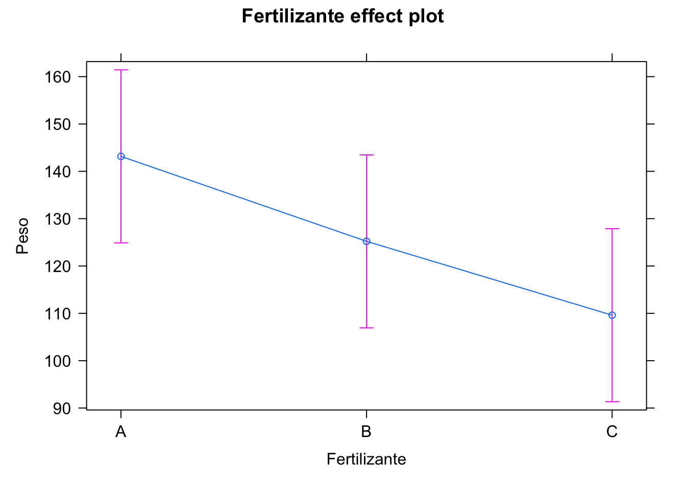

# Análisis de la Varianza {#anova}


## Introducción

El análisis de la varianza es una técnica estadística de análisis de dependencias,
donde se busca explicar una o varias variables cuantitativas a partir de una
o varias variables cualitativas o factores. Es decir, buscamos un modelo
del tipo:

\begin{equation}
\pmb{Y}=f(\pmb{X}) + \varepsilon
(\#eq:modelogeneral)
\end{equation}

donde $\pmb{Y}$ es un vector de variables respuesta numéricas que queremos
explicar o predecir, y $\pmb{X}$ es un vector de variables predictivas 
cualitativas con las que pretendemos explicar las variables respuesta. Como 
todo modelo estadístico, está sujeto a un error $\varepsilon$.

En realidad el análisis de la varianza incluye un conjunto amplio de 
técnicas cuyo análisis varía ligeramente según la naturaleza y el número de variables
en los vectores aleatorios $\pmb{Y}$ y $\pmb{X}$. En los apartados siguientes
se irán detallando los modelos esenciales desde el más sencillo al más complejo.
A medida que se avance en los modelos, se presentan más ejemplos y menos teoría,
ya que el fundamento es muy similar y se puede consultar en la 
bibliografía citada.

La técnica del análisis de la varianza se puede abordar desde dos perspectivas:
explicativa y predictiva. Desde una perspectiva explicativa, se puede aplicar
la técnica para realizar estudios observacionales a datos ya existentes. 
Estos estudios observacionales confirmarán la **relación** entre las variables.
Desde el punto de vista predictivo, se pueden diseñar experimentos (DoE) antes
de la recogida de datos. Estos estudios predictivos permiten confirmar la
**relación de causa-efecto** entre las variables. En el capítulo \@ref(doe)
se desarrollan los principios del DoE para aplicar el ANOVA en ese contexto, 
así como algunos modelos más específicos.


## Análisis de la varianza de un factor {#sec:anova1}

El caso más sencillo que podemos aplicar al modelo general \@ref(eq:modelogeneral),
es aquel en el que tenemos una única variable continua en el vector aleatorio
$\pmb{Y}$ y una sola variable cualitativa (factor) en el vector aleatorio $\pmb{X}$
con $k>2$ niveles.
Cuando la variable cualitativa tiene solamente dos posibles niveles, podemos
utilizar simplemente contrastes de hipótesis para la comparación de poblaciones
mediante test paramétricos como el de la $t$ de Student, o no paramétricos como
el test de Wilcoxon, o el test de Wilcoxon-Mann-Whitney.

::: {.rmdejemplo data-latex=""}

`<svg aria-hidden="true" role="img" viewBox="0 0 448 512" style="height:1em;width:0.88em;vertical-align:-0.125em;margin-left:auto;margin-right:auto;font-size:inherit;fill:green;overflow:visible;position:relative;"><path d="M210.6 5.9L62 169.4c-3.9 4.2-6 9.8-6 15.5C56 197.7 66.3 208 79.1 208H104L30.6 281.4c-4.2 4.2-6.6 10-6.6 16C24 309.9 34.1 320 46.6 320H80L5.4 409.5C1.9 413.7 0 419 0 424.5c0 13 10.5 23.5 23.5 23.5H192v32c0 17.7 14.3 32 32 32s32-14.3 32-32V448H424.5c13 0 23.5-10.5 23.5-23.5c0-5.5-1.9-10.8-5.4-15L368 320h33.4c12.5 0 22.6-10.1 22.6-22.6c0-6-2.4-11.8-6.6-16L344 208h24.9c12.7 0 23.1-10.3 23.1-23.1c0-5.7-2.1-11.3-6-15.5L237.4 5.9C234 2.1 229.1 0 224 0s-10 2.1-13.4 5.9z"/></svg>`{=html} Una granja experimental quiere estudiar el efecto que tiene 
el tipo de fertilizante utilizado en el cultivo de una determinada variedad de plantas y su peso en su punto óptimo de recolección. Para ello diseña un experimento en el que selecciona doce semillas aleatoriamente de un determinado lote. 
Se asigna aleatoriamente cada semilla a una maceta. Y a cada maceta, se le asigna también aleatoriamente un tipo de fertilizante entre tres varieaddes: A, B y C. El peso de cada planta en gramos se recoge en la tabla \@ref(tab:anovaplanta), que están guardados en el data frame 
`danova`^[Se puede descargar el conjunto de datos de http://emilio.lcano.com/b/adr/datos/danova2.rds].
Vamos a utilizar este ejemplo a lo largo de este capítulo. 
:::

::: {.rmdpractica data-latex=""}
El primer paso en toda técnica
estadística es hacer un análisis exploratorio. Como son muy pocos puntos por cada
grupo, vamos a obtener un resumen numérico y a representarlos todos con un gráfico de puntos (figura \@ref(fig:plantaspuntos)).

A la vista de las medias parece que el peso medio con el fertilizante C es menor.
Por otra parte parece que hay menos variabilidad
también con el fertilizante C. Una vez ajustado el modelo lo comprobaremos numéricamente.
:::


Table: (\#tab:anovaplanta)Peso de la planta a su recogida

|Fertilizante |  Peso|
|:------------|-----:|
|A            | 137.4|
|A            | 176.2|
|A            | 113.5|
|A            | 138.6|
|A            | 178.7|
|A            | 114.6|
|B            | 105.3|
|B            | 105.7|
|B            | 127.5|
|B            | 156.8|
|B            | 115.2|
|B            | 140.8|
|C            | 102.4|
|C            | 106.4|
|C            | 106.8|
|C            | 127.0|
|C            | 106.2|
|C            | 108.9|


```r
library(tidyverse)
danova |> 
  group_by(Fertilizante) |> 
  summarise(Peso_medio = mean(Peso),
            Desv.Tipica = sd(Peso)) 
#> # A tibble: 3 × 3
#>   Fertilizante Peso_medio Desv.Tipica
#>   <fct>             <dbl>       <dbl>
#> 1 A                  143.       28.6 
#> 2 B                  125.       20.6 
#> 3 C                  110.        8.77
danova |> 
  ggplot(aes(x = Fertilizante, 
             y = Peso)) +
  geom_point(alpha = 0.5,
             col = "orangered")
```

<div class="figure" style="text-align: center">

<p class="caption">(\#fig:plantaspuntos)Gráfico de puntos del experimento en plantas</p>
</div>


### Modelo

Tenemos una variable $Y$ que toma valores reales y una variable cualitativa o factor
$X$ con $k$ niveles $1, 2, \ldots, i, \ldots, k$. La variable $Y$ toma valores $y_{ij}$, $j = 1, \ldots, n_i$
en el nivel $i$ del factor $X$, siendo $n_i$ el número de observaciones en el nivel $i$ del factor $X$.
Cuando todos los niveles tienen el mismo número de observaciones, $n_i=n_{i^\prime}\; \forall i,i^\prime$, decimos
que el diseño está balanceado o **equilibrado**.
El modelo puede escribirse de dos formas:

\begin{equation}
y_{ij} = \mu + \alpha_i + \varepsilon_{ij},
(\#eq:modanova1)
\end{equation}

\begin{equation}
y_{ij} = \mu_i + \varepsilon_{ij},
(\#eq:modanova2)
\end{equation}

En la ecuación \@ref(eq:modanova1), $\mu$ es la media de la variable $Y$,
mientras que $\alpha_i$ es el **efecto** del en la media de la variable respuesta $Y$ 
del nivel $i$ del factor $X$. Es decir, cuánto
aumenta o disminuye la media de $Y$ por pertenecer la observación a la categoría $i$. En la ecuación
\@ref(eq:modanova2), $\mu_i$ es la media de la variable $Y$ para el nivel $i$ 
del factor $X$, de donde tenemos que el efecto es:

$$\alpha_i = \mu_i - \mu,$$

y el término de error, que representa toda la variabilidad que no explica el modelo, es:

$$\varepsilon_{ij}=y_{ij}-\mu_i.$$

Se cumple que:

$$\sum_i \alpha_i = 0;\; \varepsilon_{ij} \sim N(0, \sigma^2)$$

::: {.rmdejemplo data-latex=""}

Podríamos representar matemáticamente nuestro ejemplo como:
$$\mathit{Peso} = \mu + \alpha_{\mathit{Fertillizante}} + \varepsilon,$$
o bien como:
$$\mathit{Peso} = \mu_{\mathit{Fertilizante}} + \varepsilon.$$
  
:::
::: {.rmdpractica data-latex=""}
  
El modelo ANOVA se ajusta en R con la función `aov`. El siguiente código ajusta 
el modelo de nuestro ejemplo, pero de momento solo lo guardamos, veremos
en los siguientes apartados cómo extraer información e interpretarla.
:::


```r
modelo.aov <- aov(Peso ~ Fertilizante, danova)
```


### Estimación de los parámetros

Si tenemos un total 
de $n$ datos de los cuales hay $n_i$ de cada nivel $i$, de forma que $\sum_i n_i = n$,
los estimadores obtenidos tanto por el método de mínimos cuadradados como por
el método de máxima verosimilitud (véase por ejemplo @lawson2015) son los siguientes:

$$\hat{\mu_i} = \overline{y}_{i\cdot}= \frac{\sum\limits_{j=1}^{n_i}{y_{ij}}}{n_i},$$
$$\hat{\mu} = \overline{y}_{\cdot\cdot}= \frac{\sum\limits_{i=1}^{k}{\overline{y}_{i\cdot}}}{k}=\frac{\sum\limits_{i=1}^k\sum\limits_{j=1}^{n_i}{y_{ij}}}{n},$$


$$\hat{\alpha}_i=\hat{\mu}_i-\hat{\mu},$$


es decir, las medias dentro de cada nivel del factor, y la media total. Con estos estimadores de los parámetros, la
estimación de valores de $Y$ vendrá dada por:

$$\hat{y}_{ij}=\hat{\mu_i} = \hat{\mu}+ \hat{\alpha_i},$$
y por tanto los residuos del modelo son:

$$\hat{\varepsilon}_{ij}=y_{ij} - \hat{y}_{ij}$$


Nótese que, si tenemos $k$ niveles solo tenemos que estimar $k-1$ efectos, ya que:

$$\sum_i \alpha_i = 0.$$

Esta última restricción hace que no se puedan estimar los efectos con la
representación matricial completa:

$$\pmb{y} = \pmb{X}\pmb{\beta}+\pmb{\varepsilon}
(\#eq:anovamat)$$

$$\left( \begin{array}{c} 
y_{11} \\ 
\vdots\\
y_{1 n_1}\\
y_{21}\\
\vdots\\
y_{2n_2}\\
\vdots\\
y_{k1}\\
\vdots\\
y_{kn_k}
\end{array} \right )  =
\left (
\begin{array}{ccccc}
1 & 1 & 0 &\cdots & 0 \\
\vdots & \vdots & \vdots & \ddots & 0 \\
1 & 1 & 0 & \cdots & 0\\
1 & 0 & 1 &\cdots & 0 \\
\vdots & \vdots & \vdots & \ddots & 0 \\
1 & 0 & 1 &\cdots & 0\\
\vdots & \vdots & \vdots & \ddots & \vdots\\
1 & 0 & 0 &\cdots & 1\\
\vdots & \vdots & \vdots & \ddots & \vdots\\
1 & 0 & 0 &\cdots & 1
\end{array}
\right )
\left(
\begin{array}{c}
\mu\\
\alpha_1\\
\alpha_2\\
\vdots\\
\alpha_k
\end{array}
\right ) +
\left(
\begin{array}{c}
\varepsilon_{11} \\ 
\vdots\\
\varepsilon_{1 n_1}\\
\varepsilon_{21}\\
\vdots\\
\varepsilon_{2n_2}\\
\vdots\\
\varepsilon_{k1}\\
\vdots\\
\varepsilon_{kn_k}
\end{array}
\right )$$


Debido a la singularidad de la 
matriz $\pmb{X}^T \pmb{X}$ (véase por ejemplo @lawson2015 para una explicación más completa),
lo que se hace es fijar
uno de los niveles del factor como nivel "base" o de referencia, y estimar
la media de la variable respuesta en el nivel de referencia y los efectos de los otros niveles con respecto a la media en el nivel
de referencia, es decir:

$$\hat\beta = 
\left(
\begin{array}{c}
\hat\mu + \hat\alpha_1\\
\hat\alpha_2 - \hat\alpha_1\\
\hat\alpha_3 -  \hat\alpha_1
\end{array}
\right)$$

Teniendo en cuenta que $\hat\mu = \bar{\bar{y}}_{\cdot\cdot}$, a partir de estos
estimadores se pueden obtener fácilmente los estimadores de los efectos de cada nivel.

::: {.rmdinfo data-latex=""}
El nivel base que se toma en R de un factor no ordenado es el primero en orden alfabético,
y se puede cambiar con la función `relevel`.
:::


::: {.rmdpractica data-latex=""}
Sobre el objeto `modelo.aov` que guardamos antes, podemos aplicar funciones genéricas
que devuelvan ciertos resultados. Por ejemplo, la función `coef` nos devuelve los estimadores de los 
coeficientes, teniendo en cuenta que toma `A` como nivel de referencia del factor `Fertilizante`.
Podemos comprobar cómo se corresponden los coeficientes con los efectos estimados.
La función `confint` nos
devuelve un intervalo de confianza para los parámetros. Vemos que, con respecto al nivel 
base `A`, el Peso medio de la planta se reduce en casi 18 gramos cuando el fertilizante es el `B`
y más de 33 cuando es el `C`. 
Se pueden visualizar los efectos con el paquete `effects`, como se muestra en 
la figura \@ref(fig:efectotipo).
:::


```r
## El primer nivel es el de referencia
levels(danova$Fertilizante)
#> [1] "A" "B" "C"
## Estimación de los coeficientes
coef(modelo.aov)
#>   (Intercept) FertilizanteB FertilizanteC 
#>      143.1667      -17.9500      -33.5500
## Efecto nivel 1
a1 <- coef(modelo.aov)[1] - mean(danova$Peso); a1
#> (Intercept) 
#>    17.16667
## Efecto nivel 2
a2 <- coef(modelo.aov)[2] + a1; a2
#> FertilizanteB 
#>    -0.7833333
## Efecto nivel 3
a3 <- coef(modelo.aov)[3] + a1; a3
#> FertilizanteC 
#>     -16.38333
## Comprobación
danova |> 
  group_by(Fertilizante) |> 
  summarise(Medias = mean(Peso)) |> 
  mutate(Efectos = Medias - mean(danova$Peso))
#> # A tibble: 3 × 3
#>   Fertilizante Medias Efectos
#>   <fct>         <dbl>   <dbl>
#> 1 A              143.  17.2  
#> 2 B              125.  -0.783
#> 3 C              110. -16.4
## Intervalo de confianza
confint(modelo.aov, alpha = 0.99)
#>                   2.5 %     97.5 %
#> (Intercept)   124.89704 161.436297
#> FertilizanteB -43.78716   7.887158
#> FertilizanteC -59.38716  -7.712842
```


```r
plot(effects::effect("Fertilizante", modelo.aov))
```

<div class="figure" style="text-align: center">

<p class="caption">(\#fig:efectotipo)Visualización de los efectos</p>
</div>


### Contrastes

En el análisis de la varianza de un factor, lo que nos interesa demostrar es 
que hay diferencias entre las medias de $Y$ para distintos niveles del factor $X$ (la $X$ explica la $Y$). Si no
hubiera diferencias entre los niveles, entonces las medias $\mu_i$ serían iguales, 
o lo que es lo mismo, los efectos $\alpha_i$ serían nulos. Por tanto,
la hipótesis nula del modelo ANOVA de un factor es:

$$H_0: \mu_1 = \mu_2 = \cdots=\mu_k,$$
o equivalentemente:

$$H_0: \alpha_i = 0 \quad \forall i.$$

Nótese que la hipótes alternativa es que hay diferencia entre los niveles,
pero eso no significa que todos los niveles sean diferentes. Es decir, si
rechazamos la hipótesis nula, al menos dos grupos serán distintos. Y por tanto tenemos evidencia para aceptar la
alternativa:

$$H_1: \alpha_i \neq 0 \text{ para algún } i.$$


Para contrastar la hipótesis nula, dividimos la variabilidad total de los datos
entre la variabilidad que existe "dentro" de los grupos y la variabilidad
que existe "entre" los grupos. Esta variabilidad la representamos por las
sumas de cuadrados, de manera que la suma de cuadrados total ($SCT$)
la podemos descomponer en la suma de cuadrados entre grupos ($SCE$) más la suma de cuadrados
dentro de grupos ($SCD$)^[En inglés se hace referencia a _within sums of squares (SS)_,
_Residual SS_ y _Error SS_, o también _within SS_ y _between SS_, por lo que hay que entender bien los conceptos más que aprenderse los acrónimos, que pueden cambiar también en la literatura en español]:

$$\sum\limits_{ij} (y_{ij} - \overline{y}_{\cdot\cdot})^2 = \sum\limits_{i}n_i(\overline{y}_{i\cdot}-\overline{y}_{\cdot\cdot})^2 + \sum\limits_{ij}(y_{ij}-\bar y_{i\cdot})^2,$$
$$SCT = SCE + SCD.$$


:::{.rmdejemplo data-latex=""}
En la figura \@ref(fig:plantaspuntosmedias), la variabilidad total se calcularía de todos los puntos con respecto a la media total (línea horizontal dorada). La variabilidad "dentro", serían las desviaciones de cada punto con la media del fertilizante (rombo color rojizo). Y la variabilidad "entre" sería la variación de las medias de los fertilizantes con respecto a la media total (ponderadas por los tamaños de cada grupo). 
:::

<div class="figure" style="text-align: center">

<p class="caption">(\#fig:plantaspuntosmedias)Variación total, dentro y entre como distancia a las medias.</p>
</div>


Los grados de libertad de la suma de datos total es $n-1$, que se descomponen también en $k-1$ grados de libertad
para la suma de cuadrados entre grupos y $n-k$ grados de libertad para la suma
de cuadrados dentro de los grupos, de forma que podemos calcular los cuadrados medios totales,
entre grupos y dentro de grupos:

$$CMT=\frac{\sum\limits_{ij} (y_{ij} - \overline{y}_{\cdot\cdot})^2 }{n-1},$$
$$CME=\frac{\sum\limits_{i}n_i(\overline{y}_{i\cdot}-\overline{y}_{\cdot\cdot})^2 }{k-1},$$
$$CMD=\frac{\sum\limits_{ij}(y_{ij}-\bar y_{i\cdot})^2 }{n-k},$$

Entonces, si se cumplen las condiciones para aplicar el modelo y la hipótesis nula es cierta,
el estadístico:

$$F = \frac{CME}{CMD}$$
sigue una distribución $F$ con $k-1$ y $n-k$ grados de libertad, y podemos bien realizar
el contraste de hipótesis para un nivel de confianza determinado, bien interpretar el 
p-valor, para llegar a una conclusión o decisión. En Análisis de la Varianza aquí descrito
se resume normalmente en la llamada tabla ANOVA (ver tabla \@ref(tab:anova0)), que incluye 
las sumas de cuadrados, cuadrados medios, estadístico F y el p-valor.


Table: (\#tab:anova0)Contenido de la tabla ANOVA

|                  |GL    |SC  |CM  |F  |p-valor |
|:-----------------|:-----|:---|:---|:--|:-------|
|factor (entre)    |$k-1$ |SCE |CME |F  |p       |
|residuos (dentro) |$n-k$ |SCD |CMD |   |        |


:::{.rmdpractica data-latex=""}
La función genérica `summary` aplicada a un modelo `aov` devuelve precisamente la tabla ANOVA.
En nuestro ejemplo, el p-valor es pequeño, menor de 0.05 (aunque por poco). Luego para
un nivel de significación del 5% podemos rechazar la hipótesis nula y aceptamos
que hay diferencias en las medias^[Con cautela, por lo ajustado del p-valor.].
:::


```r
summary(modelo.aov)
#>              Df Sum Sq Mean Sq F value Pr(>F)  
#> Fertilizante  2   3382  1691.2   3.836 0.0451 *
#> Residuals    15   6612   440.8                 
#> ---
#> Signif. codes:  
#> 0 '***' 0.001 '**' 0.01 '*' 0.05 '.' 0.1 ' ' 1
```


Como se ha indicado anteriormente, al rechazar la hipótesis nula aceptamos que
no todos los niveles del factor producen una misma respuesta en la variable
$Y$. Una vez rechazada la hipótesis nula, tendremos que comprobar qué niveles son realmente distintos para, en última
instancia, sacar conclusiones o tomar decisiones. Un enfoque erróneo sería 
realizar comparaciones con el test de la t de Student para cada par de 
niveles del factor. En su lugar, utilizamos el método HSD^[Honestly Significance Difference] de Tukey,
que utiliza el estadístico de los rangos _estudentizados_, $R/\hat{\sigma}$ para
realizar todos los contrastes siguientes:

$$H_0: \mu_i = \mu_j \quad \forall i\neq j.$$


::: {.rmdpractica data-latex=""}
La función `TukeyHSD` realiza los contrastes dos a dos de un modelo ANOVA, como en el siguiente
ejemplo. La salida proporciona las diferencias entre cada par de niveles, un intervalo de confianza
y el p-valor del contraste. Vemos que hay diferencias significativas entre los fertilizantes A y C, pero no en el resto de comparaciones. Estas diferencias se pueden visualizar utilizando
la función `plot`, que produce la figura \@ref(fig:tukeytipo).
:::


```r
TukeyHSD(modelo.aov)
#>   Tukey multiple comparisons of means
#>     95% family-wise confidence level
#> 
#> Fit: aov(formula = Peso ~ Fertilizante, data = danova)
#> 
#> $Fertilizante
#>       diff      lwr       upr     p adj
#> B-A -17.95 -49.4362 13.536201 0.3274991
#> C-A -33.55 -65.0362 -2.063799 0.0361280
#> C-B -15.60 -47.0862 15.886201 0.4236517
plot(TukeyHSD(modelo.aov))
```

<div class="figure" style="text-align: center">

<p class="caption">(\#fig:tukeytipo)Visualización de las diferencias por pares</p>
</div>


Recordemos que en un estudio observacional si se rechaza la hipótesis nula estamos confirmando
que existe **relación** entre el factor y la variable. Para confirmar la relación causa-efecto del factor sobre la variable,
el ANOVA de un factor debe realizarse a partir de un experimento diseñado correctamente, 
véase el apartado \@ref(doe.importancia).

### Validación del modelo y alternativas

Las hipótesis del test de la $F$ y de los tests HSD de Tukey son la igualdad 
de varianzas entre grupos, y la normalidad de los residuos. La igualdad de varianzas
se pueden comprobar fácilmente con el test de Bartlett^[Hay otras alternativas,
como el test de Levene en la función `levene.test` del paquete `car`.]. La normalidad de los residuos 
se puede verificar con alguno de los múltiples tests de normalidad existentes, 
como por ejemplo el de Kolmogorov-Smirnoff, el de Shapiro-Wilk o el de 
Anderson-Darling. La función genérica `plot` de R sobre un modelo ANOVA guardado
produce una serie de gráficos de diagnóstico que nos dan una idea a veces suficiente
del cumplimiento de las hipótesis. La función `autoplot()` del paquete {ggfortify} [@R-ggfortify] los realiza con {ggplot2}. 


::: {.rmdpractica data-latex=""}
La función genérica `residuals()` sobre el objeto `modelo.aov`
devuelve los residuos del modelo. Podemos entonces hacer un contraste
de normalidad. El p-valor es grande, mucho mayor de $0.05$, por lo
que no podemos rechazar que los residuos sean normales.
La función `bartlett.test()` contrasta la hipótesis de
homogeneidad de varianzas.
El p-valor de este contraste es grande, mayor de 0.05 (aunque no mucho mayor). Podemos aceptar
la igualdad de varianzas y por tanto las conclusiones de las pruebas de Fisher y de Tukey son
válidas.

La figura \@ref(fig:anovadiag) muestra los gráficos de diagnóstico generados con la
función `ggfortify::autoplot()`. El gráfico superior izquierdo deberia mostrar una línea recta
si el modelo lineal se ajusta, y también se aprecia la homogeneidad de varianzas.
A menudo cuando no se cumple esta hipótesis el gráfico muestra forma de embudo.
El gráfico inferior izquierdo muestra la misma información pero a otra escala,
donde tampoco se aprecian varianzas distintas.
El gráfico superior derecho es un gráfico cuantil-cuantil para comprobar
la normalidad de los residuos, en este caso se ajusta bastante bien. 
El gráfico inferior derecho sirve para detectar observaciones con gran influencia
en el modelo. En este caso no se detecta ninguna especialmente estrema.
:::


```r
shapiro.test(residuals(modelo.aov))
#> 
#> 	Shapiro-Wilk normality test
#> 
#> data:  residuals(modelo.aov)
#> W = 0.92539, p-value = 0.161
bartlett.test(Peso ~ Fertilizante, data = danova)
#> 
#> 	Bartlett test of homogeneity of variances
#> 
#> data:  Peso by Fertilizante
#> Bartlett's K-squared = 5.3317, df = 2, p-value =
#> 0.06954
```


```r
library(ggfortify)
autoplot(modelo.aov)
```

<div class="figure" style="text-align: center">

<p class="caption">(\#fig:anovadiag)Gráficos de diagnóstico modelo ANOVA</p>
</div>


En caso de no cumplimiento de las hipótesis, podemos realizar contrastes
no paramétricos. Para el contraste de hipótesis de igualdad entre los niveles del factor,
utilizamos el contraste de Kruskal-Wallis, que también dispone de un método
para realizar comparaciones múltiples, como veremos en los ejemplos. 
Otra alternativa es transformar los datos originales para conseguir normalidad
y/o homogeneidad de varianzas
y realizar el análisis con los datos transformados.

:::{.rmdinfo data-latex=""}
Es
importante tener en cuenta que la función `kruskal.test()` de R requiere
que la variable cualitativa sea de tipo factor y no carácter.
:::


::: {.rmdpractica data-latex=""}
En el conjunto de datos hay una variable que no hemos usado. Es el
factor `Tierra`, que tiene tres niveles (tabla \@ref(tab:anovatemp).
Se deja al lector como ejercicio realizar un análisis exploratorio de los 
datos.
Ajustamos el modelo ANOVA
para estudiar el efecto de este factor en el Peso de la planta. Toma los valores `Z1`, `Z2`, `Z3`, según la zona de origen de la tierra utilizada en la maceta. En este caso, 
el contraste de hipótesis no permite rechazar la igualdad de medias.
No obstante, al validar las hipótesis del modelo^[Se deja como ejercicio al
lector analizar los gráficos de diagnóstico.] vemos que no se cumple
la hipótesis de normalidad, por lo que hay que hacer el contraste de Kruskal-Wallis
para confirmar que la Tierra no explica el Peso. Obtenemos
un p-valor muy grande, por lo que no podemos rechazar que los datos
vengan de la misma población, y por tanto llegamos a la conclusión
de que no hay diferencias. Aunque en este caso no sería necesario seguir,
por completitud del ejemplo vamos a realizar las comparaciones por pares
utilizando la función `kruskalmc()` del paquete {pgirmess} [@R-pgirmess]. Obtenemos en
este caso las diferencias observadas y críticas (para un determinado nivel de
significación) y un indicador (`TRUE/FALSE`) de diferencia significativa.
Como era de esperar, no se encuentra ningún par de niveles con 
diferencias significativas.
:::


```r
modelo.aov2 <- aov(Peso ~ Tierra, danova)
summary(modelo.aov2)
#>             Df Sum Sq Mean Sq F value Pr(>F)
#> Tierra       2     43    21.6   0.033  0.968
#> Residuals   15   9951   663.4
shapiro.test(residuals(modelo.aov2))
#> 
#> 	Shapiro-Wilk normality test
#> 
#> data:  residuals(modelo.aov2)
#> W = 0.84513, p-value = 0.007103
bartlett.test(Peso ~ Tierra, danova)
#> 
#> 	Bartlett test of homogeneity of variances
#> 
#> data:  Peso by Tierra
#> Bartlett's K-squared = 3.4019, df = 2, p-value =
#> 0.1825
kruskal.test(Peso ~ Tierra, danova)
#> 
#> 	Kruskal-Wallis rank sum test
#> 
#> data:  Peso by Tierra
#> Kruskal-Wallis chi-squared = 0.5653, df = 2, p-value
#> = 0.7538
pgirmess::kruskalmc(Peso ~ Tierra, data = danova)
#> Multiple comparison test after Kruskal-Wallis 
#> p.value: 0.05 
#> Comparisons
#>         obs.dif critical.dif difference
#> Z1-Z2 1.9444444     6.735838      FALSE
#> Z1-Z3 0.1666667     9.037076      FALSE
#> Z2-Z3 1.7777778     8.520237      FALSE
```


Table: (\#tab:anovatemp)Peso de las plantas y origen de la tierra

|Tierra |  Peso|
|:------|-----:|
|Z2     | 137.4|
|Z2     | 176.2|
|Z3     | 113.5|
|Z1     | 138.6|
|Z2     | 178.7|
|Z1     | 114.6|
|Z2     | 105.3|
|Z2     | 105.7|
|Z3     | 127.5|
|Z1     | 156.8|
|Z2     | 115.2|
|Z1     | 140.8|
|Z2     | 102.4|
|Z1     | 106.4|
|Z2     | 106.8|
|Z3     | 127.0|
|Z1     | 106.2|
|Z2     | 108.9|


## Análisis de la varianza de dos factores {#sec:anova2}

La principal diferencia con el análisis de la varianza de un factor es que,
además de los efectos principales de cada uno de los factores, es decir,
cuánto varía la media de la variable respuesta $Y$ según los niveles de cada factor $X$, se puede estudiar el 
efecto de las interacciones entre factores. Intuitivamente, la interacción
entre factores es similar a la que podemos observar en la vida diaria, por ejemplo un tranquilizante tiene un efecto positivo sobre el bienestar de una persona.
Una copa de vino en determinadas circunstancias también. Pero utilizados conjuntamente, producen 
una interacción que afecta negativamente en el bienestar de la persona.
Del mismo modo, podemos observar que una variable dependiente $Y$ toma
mejores valores para ciertos niveles de los factores $X_1$ y $X_2$. Pero
se deben estudiar las interacciones, porque puede ser que dichos niveles
combinados produzcan peor resultado.

El modelo de dos factores, que en la literatura en inglés de encuentra 
como _two-way anova_, es el siguiente:

$$Y = \mu + \alpha_i + \beta_j + (\alpha\beta)_{ij}+\varepsilon,$$

donde $(\alpha\beta)_{ij}$ representa el efecto de la interacción,
y el resto de términos tienen la misma interpretación que en el ANOVA 
de un factor (o _one-way anova_). En la tabla ANOVA se añaden nuevas
filas y contrastes para los efectos principales y las interacciones.
Las hipótesis del modelo son las mismas, luego comprobamos normalidad 
de los residuos y homogeneidad de variazas. Para este último caso,
utilizamos mejor el test de Levene que permite incluir el término de la interacción.

En el ajuste del modelo y estimación de efectos, se toma como base 
el primer nivel de todos los factores.


:::{.rmdinfo data-latex=""}

Para especificar modelos con más de un factor e interacción en R, ampliamos
el lado derecho de la fórmula del modelo. Los nuevos efectos se añaden
"sumando". La interacción se expresa separando los factores con dos puntos.
Si utilizamos el símbolo asterisco, entonces el modelo incluye todos los efectos 
principales y las interacciones. Por ejemplo, para dos factores `a` y `b`, 
el modelo completo se puede expresar como `a*b` o como `a + b + a:b`.
:::


::: {.rmdejemplo data-latex=""}
En el apartado anterior hemos analizado por separado el Peso frente a los factores 
Fertilizante y Tierra. Pero deberíamos analizarlos en un modelo multifactorial.
:::

::: {.rmdpractica data-latex=""}
Las siguientes expresiones crean el modelo multifactorial, realizan los contrastes, calculan los efectos y representan las interacciones.
:::


```r
modelo.aov3 <- aov(Peso ~ Fertilizante*Tierra, danova)
summary(modelo.aov3)
#>                     Df Sum Sq Mean Sq F value  Pr(>F)   
#> Fertilizante         2   3382  1691.2   9.674 0.00572 **
#> Tierra               2     43    21.6   0.124 0.88521   
#> Fertilizante:Tierra  4   4996  1248.9   7.145 0.00712 **
#> Residuals            9   1573   174.8                   
#> ---
#> Signif. codes:  
#> 0 '***' 0.001 '**' 0.01 '*' 0.05 '.' 0.1 ' ' 1
shapiro.test(residuals(modelo.aov3))
#> 
#> 	Shapiro-Wilk normality test
#> 
#> data:  residuals(modelo.aov3)
#> W = 0.90975, p-value = 0.08516
car::leveneTest(Peso ~ Fertilizante*Tierra, danova)
#> Levene's Test for Homogeneity of Variance (center = median)
#>       Df F value Pr(>F)
#> group  8  0.5554 0.7902
#>        9
coef(modelo.aov3)
#>            (Intercept)          FertilizanteB 
#>              126.60000               22.20000 
#>          FertilizanteC               TierraZ2 
#>              -20.30000               37.50000 
#>               TierraZ3 FertilizanteB:TierraZ2 
#>              -13.10000              -77.56667 
#> FertilizanteC:TierraZ2 FertilizanteB:TierraZ3 
#>              -37.76667               -8.20000 
#> FertilizanteC:TierraZ3 
#>               33.80000
effects::allEffects(modelo.aov3)
#>  model: Peso ~ Fertilizante * Tierra
#> 
#>  Fertilizante*Tierra effect
#>             Tierra
#> Fertilizante    Z1       Z2    Z3
#>            A 126.6 164.1000 113.5
#>            B 148.8 108.7333 127.5
#>            C 106.3 106.0333 127.0
with(danova,
     interaction.plot(x.factor = Fertilizante,
                      trace.factor = Tierra,
                      response = Peso, 
                      las = 1))
```

<div class="figure" style="text-align: center">

<p class="caption">(\#fig:anovainter)Visualización de las interacciones entre iluminación y Tierra.</p>
</div>

::: {.rmdejemplo data-latex=""}
La tabla ANOVA nos muestra que el término de la interacción es altamente significativo,
con un p-valor muy bajo, incluso inferior a $0.01$. También el tipo de fertilizante.
No lo es el efecto principal de la Tierra, pero como este factor está en una 
interacción significativa, no deberíamos eliminarlo del modelo.

Las hipótesis del modelo y el modo 
de proceder son análogos al caso unifactorial. Se verifica la normalidad de 
los residuos y la homegenidad de varianzas. El mayor Peso medio de la planta se consigue con la combinación fertilizante A y Tierra Z2.

El gráfico de las interacciones (figura \@ref(fig:anovainter)) muestra
claramente las grandes diferencias entre las combinaciones de factores.
Si no hubiera interacción, las líneas serían paralelas.
En el apartado anterior habíamos llegado a la conclusión de que 
el mejor fertilizante para conseguir el peso más alto era el fertilizante "A", pero era indiferente utilizar tierra de una zona u otra.
Si no analizáramos las interacciones, podríamos cometer el error
de utilizar para las plantas fertilizante A y tierra de la zona Z3,
lo que sería una pésima decisión ya que esta interacción baja drásticamente 
el peso de las plantas.
:::


:::{.rmdpractica data-latex=""}
La función `model.table` nos devuelve las medias de todas las combinaciones
de los factores de forma compacta.
:::


```r
model.tables(modelo.aov3)
#> Tables of effects
#> 
#>  Fertilizante 
#>         A       B      C
#>     17.17 -0.7833 -16.38
#> rep  6.00  6.0000   6.00
#> 
#>  Tierra 
#>        Z1     Z2     Z3
#>     1.233 0.2889 -3.333
#> rep 6.000 9.0000  3.000
#> 
#>  Fertilizante:Tierra 
#>             Tierra
#> Fertilizante Z1      Z2      Z3     
#>          A   -17.800  20.644 -26.333
#>          rep   2.000   3.000   1.000
#>          B    22.350 -16.772   5.617
#>          rep   2.000   3.000   1.000
#>          C    -4.550  -3.872  20.717
#>          rep   2.000   3.000   1.000
```


El caso de dos factores con interacción se extiende fácilmente a más de dos factores 
añadiendo términos a la fórmula. No obstante, las interacciones de más de dos 
factores se suele despreciar. En el modelo resultante final se deberían eliminar
los efectos no significativos, aunque manteniendo aquellos efectos principales
que intervengan en alguna interacción. 

Si no se cumplieran las hipótesis del modelo podríamos usar el contraste de
Kruskal-Wallis para los efectos principales. Para la interacción también hay
métodos paramétricos, aunque no están tan extendidos, véase una revisión 
en @feys2016nonparametric. En muchas ocasiones una transformación de 
Box-Cox en la variable respuesta es suficiente para ajustar un modelo
válido^[https://bookdown.org/max/FES/numeric-one-to-one.html].


## Introducción a los modelos mixtos: efectos fijos y efectos aleatorios

El modelo de análisis de la varianza y los contrastes
vistos hasta ahora asumen que los individuos se han 
asignado aleatoriamente a los distintos niveles.
Incluso en estudios observacionales, podemos asumir
que esta asignación se ha hecho de forma aleatoria y controlada,
y son efectos fijos. 

Pero esto no siempre se puede asumir, o directamente la
naturaleza del propio factor es aleatoria, y el tratamiento
que le tenemos que dar a los factores es distinto. En particular,
los efectos de estos factores no son una constante que queramos 
estimar, sino variables aleatorias de las cuales queremos estudiar
su varianza en el modelo. El modelo para un factor fijo $\alpha$ y otro aleatorio 
$\beta$ sería el siguiente:

$$Y = \mu + \alpha_i + \beta_j + \varepsilon,$$

donde el efecto aleatorio $\beta \sim N(0, \sigma^2_\beta)$. No tiene
por tanto sentido estimar el efecto, cuya media es cero, sino la variabilidad,
y ver si es importante con respecto al resto de factores.


::: {.rmdpractica data-latex=""}
Imaginemos por un momento que la variable Tierra de nuestro ejemplo se refiera a la tierra de una parcela determinada que no hemos podido elegir, sino que es algo aleatorio (por ejemplo en granjas experimentales distantes). Está claro que este factor no es algo
que podamos controlar, y por tanto su efecto es aleatorio.
En este caso tendríamos que ajustar un modelo mixto.
En este ejemplo vemos que el factor Tierra afecta poco o nada a la variable
respuesta, ya que la varianza es prácticamente nula^[Aunque aparezca un cero, 
es debido al redondeo.]. Podemos obtener una estimación de los efectos
con la función `ranef` del paquete `lme4`.
:::


```r
library(lme4)
#> Loading required package: Matrix
#> 
#> Attaching package: 'Matrix'
#> The following objects are masked from 'package:tidyr':
#> 
#>     expand, pack, unpack
modelo.mixto <- lmer(Peso ~ 1 + Fertilizante + (1|Tierra), danova)
#> boundary (singular) fit: see help('isSingular')
summary(modelo.mixto)
#> Linear mixed model fit by REML ['lmerMod']
#> Formula: Peso ~ 1 + Fertilizante + (1 | Tierra)
#>    Data: danova
#> 
#> REML criterion at convergence: 139.3
#> 
#> Scaled residuals: 
#>     Min      1Q  Median      3Q     Max 
#> -1.4130 -0.4437 -0.1580  0.5838  1.6924 
#> 
#> Random effects:
#>  Groups   Name        Variance Std.Dev.
#>  Tierra   (Intercept)   0.0     0      
#>  Residual             440.8    21      
#> Number of obs: 18, groups:  Tierra, 3
#> 
#> Fixed effects:
#>               Estimate Std. Error t value
#> (Intercept)    143.167      8.571  16.703
#> FertilizanteB  -17.950     12.122  -1.481
#> FertilizanteC  -33.550     12.122  -2.768
#> 
#> Correlation of Fixed Effects:
#>             (Intr) FrtlzB
#> FertilizntB -0.707       
#> FertilizntC -0.707  0.500
#> optimizer (nloptwrap) convergence code: 0 (OK)
#> boundary (singular) fit: see help('isSingular')
ranef(modelo.mixto)
#> $Tierra
#>    (Intercept)
#> Z1           0
#> Z2           0
#> Z3           0
#> 
#> with conditional variances for "Tierra"
```


Los modelos mixtos (o incluso aleatorios puros) tienen muchas aplicaciones
tanto en modelos biológicos como en cualquier otro ámbito. Algunos ejemplos son:

- Efectos aleatorios puros, como el que se ha mostrado en el ejemplo.

- Modelos de panel, donde tenemos mediciones en diferentes periodos, 
y la unidad observable dentro del tiempo forman el factor aleatorio

- Medidas repetidas, donde el individuo es el factor aleatorio

- Modelos anidados y jerarquizados, donde unos niveles están dentro de otros


Como se ha podido comprobar, el análisis de
modelos mixtos no es tan sencillo como el de efectos fijos. Para una 
revisión más completa se recomienda consultar el libro de @faraway2016.


## Análisis multivariante de la varianza

Hasta ahora hemos analizado el efecto que uno o varios
factores tienen sobre una única variable $Y$. 
En ocasiones, tenemos en el lado izquierdo de la fórmula
un vector aleatorio $\pmb{Y}$ con $p$ variables respuesta
$Y_i, \ldots, Y_p$ con cierta estructura de correlación
y queremos determinar si esta variable multivariante
se comporta de forma distinta para los distintos niveles
de las variables en el vector de variables independientes $\pmb{X}$.
El método calcula una matriz de errores y una matriz de 
hipótesis^[Ver: https://rpubs.com/aaronsc32/manova-test-statistics],
y mediante el cálculo de un estadístico (por defecto Pillai^[ver
una descripción de las alternativas en https://rpubs.com/aaronsc32/manova-test-statistics.])
se contrasta la hipótesis.


::: {.rmdpractica data-latex=""}
En el conjunto de datos de ejemplo tenemos otra variable en escala métrica que es 
la Pureza de un determinado compuesto en la planta. El siguiente ejemplo
realiza el análisis multivariante de la varianza para estas dos variables
agrupadas en una matriz. El modelo se puede ajustar con la función `aov`,
o bien con la función `maov`, que es realmente un _wrapper_ de la anterior.
Los contrastes multivariantes se obtienen con la función `summary.manova`, si
no le añadimos `.manova` tenemos los contrastes univariantes para cada componente
del vector aleatorio $\pmb{Y}$. El resultado que obtenemos en este caso es muy similar
al obtenido en el ejemplo univariante. En ocasiones puede suceder que
los contrastes univariantes no son significativos pero sí lo es el contraste
multivariante.
:::


```r
Y <- as.matrix(danova[, c("Peso", "Pureza")])
modelo.manova <- aov(Y ~ Fertilizante*Tierra, data = danova)
summary.manova(modelo.manova)
#>                     Df  Pillai approx F num Df den Df
#> Fertilizante         2 0.97640   4.2925      4     18
#> Tierra               2 0.14749   0.3583      4     18
#> Fertilizante:Tierra  4 1.14085   2.9877      8     18
#> Residuals            9                               
#>                      Pr(>F)  
#> Fertilizante        0.01300 *
#> Tierra              0.83494  
#> Fertilizante:Tierra 0.02561 *
#> Residuals                    
#> ---
#> Signif. codes:  
#> 0 '***' 0.001 '**' 0.01 '*' 0.05 '.' 0.1 ' ' 1
summary(modelo.manova)
#>  Response Peso :
#>                     Df Sum Sq Mean Sq F value   Pr(>F)   
#> Fertilizante         2 3382.3 1691.17  9.6743 0.005724 **
#> Tierra               2   43.2   21.61  0.1236 0.885213   
#> Fertilizante:Tierra  4 4995.8 1248.95  7.1446 0.007121 **
#> Residuals            9 1573.3  174.81                    
#> ---
#> Signif. codes:  
#> 0 '***' 0.001 '**' 0.01 '*' 0.05 '.' 0.1 ' ' 1
#> 
#>  Response Pureza :
#>                     Df Sum Sq Mean Sq F value    Pr(>F)    
#> Fertilizante         2 411.96 205.980 31.0211 9.168e-05 ***
#> Tierra               2   3.53   1.765  0.2658 0.7724260    
#> Fertilizante:Tierra  4 496.88 124.219 18.7077 0.0002184 ***
#> Residuals            9  59.76   6.640                      
#> ---
#> Signif. codes:  
#> 0 '***' 0.001 '**' 0.01 '*' 0.05 '.' 0.1 ' ' 1
```


