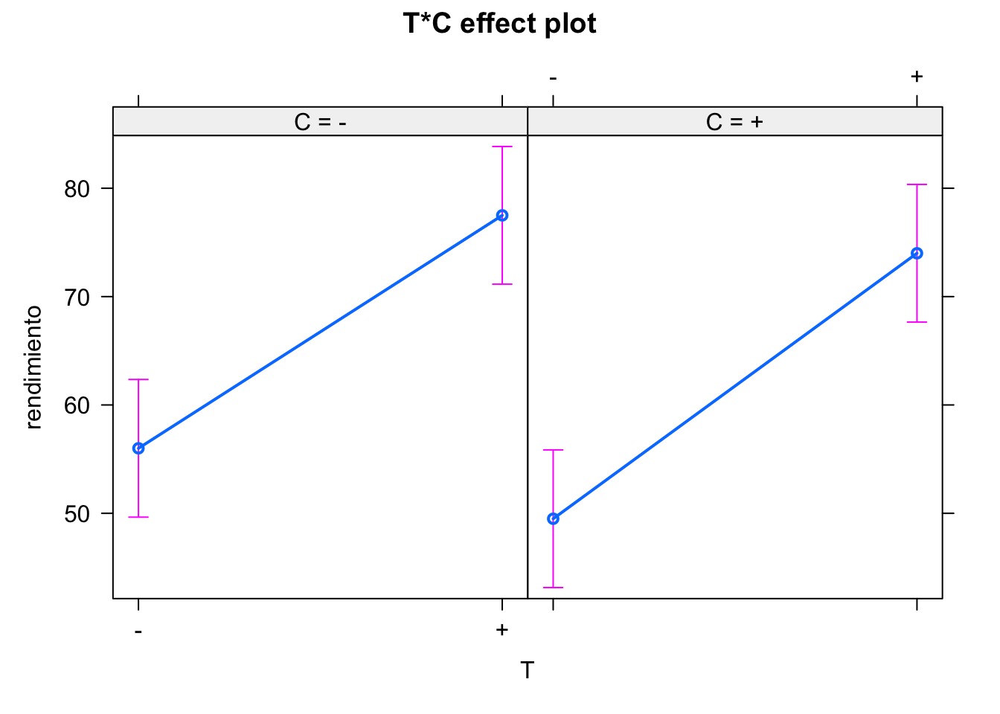
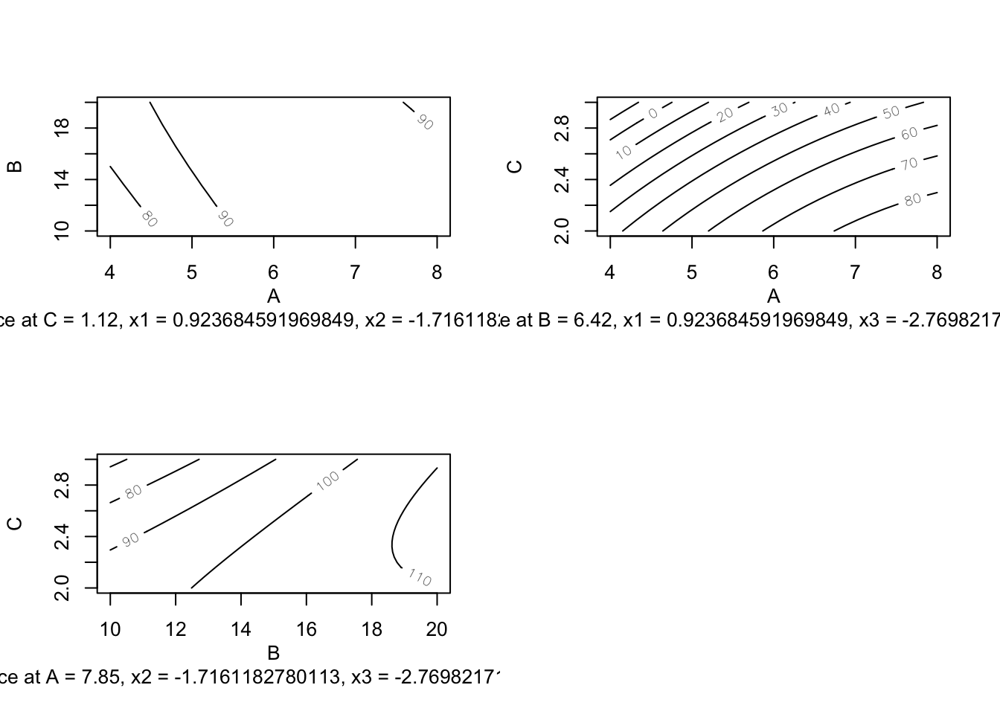

# Diseño de experimentos {#doe}

## Introducción

El Diseño y Análisis de Experimentos (que abreviaremos como DoE), como cualquier
otra técnica estadística, se basa en el estudio de la variabilidad. DoE es la
herramienta más potente para la mejora, lo que ha llevado a algunos autores a
llamarlo "the jewel of quality engineering" (Ver por ejemplo
@allen2010).

En capítulos anteriores del libro hemos aprendido las herramientas básicas 
para **analizar la variabilidad** de los datos. En este capítulo vamos a revisar 
las técnicas de Diseño de Experimentos y
su posterior análisis. Demasiado a menudo los esfuerzos se centran en intentar
analizar un experimento sin diseño, lo que provoca frustración en los equipos
involucrados en el análisis de datos. Vamos a mostrar la
importancia de la fase de diseño, así como su planificación y correcta
ejecución. No obstante la parte de análisis es igualmente importante, sobre todo en
lo que concierne a la correcta interpretación de los resultados y la toma de decisiones informada.


:::{.rmdcafe data-latex=""}
En su discurso presidencial ante el Primer Congreso Estadístico de la India, Sir Ronald Fisher (1890-1962) dijo:

>_"To consult the statistician after an experiment is finished is often merely to ask him to conduct a post mortem examination. He can perhaps say what the experiment died of"_. 

O, dicho en otras palabras, cuando analizamos los datos del experimento sin haber participado en el diseño, lo más que podemos hacerle es la autopsia.
:::


## Bases del DoE: origen, importancia, objetivos y requerimientos


El DoE moderno surge a principios del siglo XX de la mano de Ronald A. Fisher
cuando trabajaba en el "Rothamsted Experimental Station" en Inglaterra. Sus
estudios se centraban en reducir la variación natural y prevenir la confusión 
con la variación de los restantes efectos. En última instancia, detectar
las relaciones causa-efecto con el menor esfuerzo experimental.


Básicamente, necesitamos el DoE frente a
estudios observacionales u otras estrategias como "un factor cada vez" para
estudiar las interacciones y encontrar relaciones de causa-efecto con 
el menor uso de recursos posible.
Así, podremos tomar decisiones respaldadas por los datos.


El objetivo del diseño de experimentos es encontrar los niveles de
ciertos factores que optimizan una determinada característica medible. 
Esto se consigue con un método sistemático^[En realidad, el método científico.] que evita salidas en falso y respuestas
incompletas. Mediante la reducción del error experimental se consigue evitar la confusión de los efectos y anular los efectos sin interés para el estudio. 


Para empezar, lo primero que necesitamos es definir los datos del problema
objeto de estudio y disponer de una forma de obtenerlos adecuadamente, en particular:

- Una variable respuesta en escala métrica.
- Factores controlables.
- Posiblemente, otros factores aleatorios.

Esta recogida de datos se debe realizar de forma sistemática y 
teniendo en cuenta los tres pilares del DoE: **aleatorización**, **bloqueo** y
**replicación**.


## Importancia del diseño {#doe.importancia}

Con la experimentación básicamente controlamos los niveles a los que operan
ciertos factores controlables, a la vez que se asignan dichos niveles
(configuraciones, tratamientos, etc.) a las unidades experimentales. Esto
permite, unido a las apropiadas estrategias de aleatorización, bloqueo y
replicación, realizar predicciones acerca del desempeño de un determinado
proceso. Estas predicciones así establecidas serán el resultado de la
identificación de una relación causa-efecto, que no se puede conseguir
simplemente analizando datos recogidos sin diseño. En los **estudios observacionales**:

  - Recogemos información (o simplemente "está ahí").
  - No controlamos factores.
  - Se realizan análisis descriptivos.
  - Se descubren **relaciones** mediante inferencia.

Mientras que con **experimentos diseñados**:

  - Se controlan los factores y su asignación a los elementos en estudio (sujetos, cosas, plantas, ...)
  - Se analizan los efectos en la variable respuesta.
  - Se analizan las interacciones de los factores.
  - Se verifica la relación **causa-efecto**.


Si la experimentación se lleva a cabo variando una vez cada factor, buscando el
valor óptimo para la respuesta para cada factor individualmente dejando fijos
el resto arbitrariamente, estaremos obviando un aspecto
fundamental: el efecto de las interacciones. La interacción es el efecto que tiene un factor a distintos niveles de otros factores. 

Por otra parte, el número de 
experimentos necesarios para llegar a conclusiones válidas es mucho mayor
(y por tanto el experimento más costoso). Mediante un experimento diseñado obtenemos el mayor número de combinaciones posibles para estimar interacciones, con el mínimo número de experimentos.


::: {.rmdcafe data-latex=""}

El análisis de datos, por muy sofisticado que sea, no puede nunca
_arreglar_ un experimento mal diseñado (chapucero, según Lawson)

>  As we know from Murphy's Law, if anything can go wrong it will, and analysis of
  data can never compensate for botched experiments  
    @lawson2015
:::


El análisis de la varianza (ver capítulo \@ref(anova)) sin diseño de experimentos tiene algunas
limitaciones importantes. Sin Diseño de Experimentos, los datos pueden ser inconsistentes o incompletos, al no incluir factores de ruido o Factores latentes.
Si tenemos variables correlacionadas, y alguna de ellas no se
mide, su efecto puede quedar enmascarado por las otras, como en el ejemplo de la figura \@ref(fig:c1), donde si miramos solo la relación de la variable respuesta
con el factor 1 (gráfico de la izquierda), podemos llegar a la conclusión
errónea de que el factor 1 es determinante. Pero podría ser que la causa real
sea el factor 2, que no ha sido medido y está muy correlacionado con el factor 1. 
En el gráfico de la derecha vemos que la variable respuesta crece en el mismo sentido que los factores 1 y 2, pero podría ser que el factor 2, no medido al principio, sea la causa, y no el que realmente se ha medido.


```
#> Warning: `qplot()` was deprecated in ggplot2 3.4.0.
#> This warning is displayed once every 8 hours.
#> Call `lifecycle::last_lifecycle_warnings()` to see where
#> this warning was generated.
```

<div class="figure" style="text-align: center">

<p class="caption">(\#fig:c1)Efecto de no medir un factor</p>
</div>


Por otra parte, el rango de valores de la variable respuesta está limitado por su
rango normal de operación, que puede ocultar relaciones más amplias. En la figura
\@ref(fig:valuesrange1), el gráfico de la izquierda se corresponde con el rango de 
variación normal de
los factores de un proceso. En el de la derecha, ampliamos el rango de
posibles valores de la variable, y vemos algunos patrones que quedan
ocultos en el otro caso. Por ejemplo, en los valores inferiores la pendiente es más pronunciada, mientras que en los valores superiores parece que
se empieza a invertir la tendencia.


```
#> Warning: The following aesthetics were dropped during statistical
#> transformation: colour.
#> ℹ This can happen when ggplot fails to infer the correct
#>   grouping structure in the data.
#> ℹ Did you forget to specify a `group` aesthetic or to
#>   convert a numerical variable into a factor?
```

<div class="figure" style="text-align: center">

<p class="caption">(\#fig:valuesrange1)Efecto de la limitación del rango de valores</p>
</div>


## Planificación de la experimentación

El conocimiento de la materia en cuestión (_subject matter knowledge_) es fundamental para desarrollar
cambios que resulten en mejoras. Sin embargo, es
necesario otro tipo de conocimiento (_profound knowledge_), en el que se
incluye la Estadística. Combinar ambos conocimientos, lleva a una
mayor capacidad de mejora.
Estas ideas, originarias de Deming, se recogen en @moen2012.
Algunas capacidades necesarias fruto de esta combinación son:

  - Entender las interdependencias entre los sistemas donde se lleva a cabo
  la experimentación.
  - Entender la relación entre las predicciones y el conocimiento del
  sistema que se quiere cambiar.
  - Entender el efecto temporal de los cambios.
  - Entender la importancia de la estabilidad del proceso.
  - Entender la extrapolación de los resultados de las pruebas para mejorar
  el sistema.


En general, se pueden seguir tres estrategias de planificación para el diseño de
experimentos:

1. Sin planificación. Se pueden ir cambiando niveles de factores cada
vez y haciendo pruebas (ensayo-error). Esto es definitivamente poco efectivo. 
2. Planificación completa desde el inicio. Si es muy rígida, nos puede llevar a no explorar alternativas
que puedan surgir durante la experimentación. Y por tanto a no cumplir los objetivos. 
3. Planificación **secuencial**. Esta es la
estrategia óptima. Se llevan a cabo un número de experimentos al inicio, cuyas
conclusiones supondrán la planificación de una segunda fase donde centrarnos en
los factores realmente relevantes y hacer análisis más detallados y precisos. En las
primeras fases se suelen realizar diseños de _screening_ para descartar
factores no significativos. En las siguientes fases, se amplían los experimentos solo con los factores significativos. 

En realidad, esta estrategia secuencial es la aplicación del método científico,
en un proceso iterativo de aprendizaje como se muestra en la figura \@ref(fig:metodo). El experimento partirá de un objetivo que planteará ciertas hipótesis. Por deducción, se diseña el experimento y se obtienen datos. Estos datos confirman o no las hipótesis mediante la inducción, y nos hace plantearnos nuevas hipótesis. Así, hasta llegar a la conclusión y/o decisión final.


<div class="figure" style="text-align: center">

<p class="caption">(\#fig:metodo)Método iterativo de aprendizaje</p>
</div>


En @moen2012 se propone el ciclo PDSA (_Plan-Do-Study-Act_) para la mejora que se muestra en la figura \@ref(fig:ciclo). Básicamente consiste en:

1. Planifica un cambio o prueba, dirigido a la **mejora**.
2. Lleva a cabo el cambio o prueba, preferiblemente de corto alcance.
3. Estudia el resultado: ¿qué has aprendido? ¿qué ha ido mal?
4. Actúa:
    - Adopta el cambio.
    - Abandónalo.
    - Empieza el ciclo de nuevo.
  
Una cuestión fundamental es la necesidad de **documentar** todas las acciones de mejora, así como las lecciones aprendidas durante el proceso.


<div class="figure" style="text-align: center">

<p class="caption">(\#fig:ciclo)Ciclo PDSA para la mejora</p>
</div>


Una buena forma de empezar el ciclo es a partir de un análisis de causa y
efecto, por ejemplo con un diagrama de Ishikawa o de espina de pescado (_fishbone_) como el que aparece en la
figura \@ref(fig:cefecto). Con esta técnica se identifica cuál es la variable respuesta que queremos investigar (efecto, cabeza del pescado) y cuáles son los posibles factores que pueden estar relacionados, y de los que en última instancia queremos averiguar si son la causa del efecto (espinas).

<div class="figure" style="text-align: center">

<p class="caption">(\#fig:cefecto)Ejemplo diagrama de causa-efecto</p>
</div>

Lo siguiente probablemente sería determinar el presupuesto/recursos disponibles,
en especial determinar el número de experimentos que se pueden realizar
realísticamente.


Hasta ahora, hemos ido mencionando algunos conceptos básicos del diseño de
experimentos. Ahora vamos a definirlos un poco más formalmente.

- **Variable respuesta**:  La variable de interés que pretendemos
  optimizar o determinar sus causas. En el ámbito industrial, será una cuantificación de alguna característica de
  calidad, en sentido amplio.
- **Factor**: Variable independiente que puede ser causa de la respuesta.
  La inferencia que haremos con DoE será confirmar o rechazar esta
  hipótesis, así como la cuantificación de este efecto.
- **Variable de bloque**: Variable que no tiene interés en la investigación,
  pero puede influir en la respuesta. Mediante la formación de bloques
  aleatorios confundimos su efecto con los factores que realmente nos interesan.
- **Variable ruido**: Variable que puede influir en la respuesta, pero de la
  que no tenemos control.
- **Nivel**: Valor que fijamos de un factor. En variables
  cualitativas, es una categoría. En variables cuantitativas, un valor numérico
  determinado fijado con antelación.
  A menudo se le llama también tratamiento, aunque cuando se estudia más de un factor sería más apropiado hablar de tratamiento como combinación de los niveles de los factores.
- **Unidad experimental**: La división más pequeña posible de unidades de un
  experimento tal que a dos cualesquiera se les pueden aplicar distintas
  combinaciones de factores y niveles.
- **Unidad observable**: Cada uno de los elementos que forman la unidad
  experimental. A veces, un tratamiento no se puede aplicar a un solo
  elemento, sino a varios a la vez.
- **Bloque**: Grupos de unidades experimentales que son tratados de forma
  similar en el experimento.
- **Efecto**: El principal resultado de interés del experimento: qué pasa con
  la variable respuesta para cada nivel de un factor o combinación de factores.
- **Réplica**: Repetición de un experimento sobre una misma combinación de
  factores y niveles, a **diferentes** unidades experimentales.
- **Repetición**: Repetición de la medición de la respuesta con las mismas
  condiciones experimentales, a **la misma** unidad experimental.
- **Aleatorización**: Asignación de niveles y bloques a unidades
  experimentales de forma aleatoria.


Al utilizar un modelo para simplificar la realidad, estamos cometiendo un
error. El **error experimental** es aquel que se debe exclusivamente a las réplicas
de las mismas condiciones experimentales. En cada diseño el error experimental
se calcula de una forma distinta, de forma que se separa de la variabilidad total
para ver cuánta variación se debe al modelo y poder así tomar decisiones. Así, en el modelo general:

$$Y = f(\mathbf{X}) + \varepsilon,$$

- $Y$ es la variable respuesta.
- $\mathbf{X}$ es el conjunto de variables predictivas.
- $f$ es una función (lineal, exponencial, etc.)
- $\varepsilon$ es una variable aleatoria que recoge todo lo que no explica la función $f$ de la variable respuesta $Y$.


Los siguientes principios son cruciales a la hora de diseñar el experimento.

- **Aleatorización**. Los tratamientos deben ser asignados de forma aleatoria a las 
unidades experimentales. Esto incluye bloques, factores controlables, anidamientos, 
etc.

- **Formación de bloques**. Cuando no se puedan replicar exactamente las condiciones 
experimentales (por ejemplo, días diferentes), se deben organizar en bloques.

- **Réplicas**. Para poder estimar el error experimental y hacer contrastes de 
hipótesis, es necesario tener más de una _corrida_ de cada combinación de tratamientos.


@lawson2015 propone la siguiente _checklist_ a la hora de planificar
experimentos:

1. Definir objetivos.
2. Identificar unidades experimentales.
3. Definir variable respuesta medible y con sentido.
4. Identificar los factores controlables y latentes.
5. Ejecutar pruebas piloto.
6. Hacer diagrama de flujo para cada experimento.
7. Elegir el **diseño experimental**. Esta parte es crucial.
8. Determinar el número de réplicas necesarias.
9. Aleatorizar las condiciones experimentales a las unidades experimentales.
10. Definir método de análisis de datos.
11. Calendario y presupuesto para la ejecución.

Es aconsejable recoger toda esta información en un formulario estandarizado que forme parte de la documentación del experimento o proyecto de mejora.


## Tipos de diseños de experimentos

Existen una enorme cantidad de posibles tipos de diseños experimentales. La decisión sobre cuál utilizar en cada situación concreta depende principalmente de los objetivos de la investigación y de las características de las unidades experimentales (de ahí la importancia de caracterizarlas de forma precisa durante el diseño). La figura \@ref(fig:tiposdisenos) muestra la categorización que hace @lawson2015. A continuación se enumeran estos  diseños con una breve explicación de cada uno.

<div class="figure" style="text-align: center">

```{=html}
<div class="grViz html-widget html-fill-item" id="htmlwidget-29e925102d01db730e25" style="width:100%;height:480px;"></div>
<script type="application/json" data-for="htmlwidget-29e925102d01db730e25">{"x":{"diagram":"\ndigraph one_factor{\n  graph [layout=dot, rankdir = TB, compound = true, fontsize = 10, color = crimson]\n  node [shape = box]\n  \"Propósito\ndel diseño\"; \"RSE\"; LSD;RCD  \"RCB\";  \"GCB\"; \"PBIB,PTIB\"; \"BIB\"; \"Tamaño de bloque\" ;\"FRSE\nNSE\nSNSE\"; \"CRFD\nCRFF\nPB,OA\"; CRRS; \"SLD\nSCD\nEVD\"; RCBF; RBSP; \"CRSP\nSPFF\"; \"RSSP\nEESPRS\"; SPMPV; BRS; PCBF; CCBF\n  \n  node [shape = diamond]\n  \"Unidades experimentales\"\n  \"Factores de bloque\"\n  \n  \n  \"Unidades experimentales\" -> \"Factores de bloque\" [label = \"Heterogéneos\"] \n  \"Unidades experimentales\" -> \"CRD\" [label = \"Homogéneos\"] \n  \"Factores de bloque\" -> \"Tamaño de bloque\" [label = \"Uno\"] \n  \"Factores de bloque\" -> \"LSD\" [label = \"Dos\"] \n  LSD -> RCD\n  \"Tamaño de bloque\" -> \"RCB\" [label = \"Grande\"] \n  \"Tamaño de bloque\" -> \"PBIB,PTIB\" [label = \"Pequeño\"] \n  \"Propósito\ndel diseño\" -> RSE [label = \"Estudiar varianzas\"] \n  RCB -> GCB\n  \n    \"Propósito\ndel diseño\" -> \"Unidades experimentales\" [label = \"Estimar efectos\nde los factores\"] \n\n  \n  \n  subgraph cluster0{\n    label = \"Un factor\";\n    RSE\n    CRD\n    LSD\n    RCD\n    RCB\n    GCB\n    \"PBIB,PTIB\"\n    \"BIB\"\n  }\n  RSE -> \"FRSE\nNSE\nSNSE\"\n  \n  subgraph cluster1{\n  label = \"Varios factores\";\n    \"FRSE\nNSE\nSNSE\"\n        CRD -> \"Tipo factor\"\n    \"Tipo factor\" -> \"CRFD\nCRFF\nPB,OA\" [label = \"Categórico\"]\n    \"Tipo factor\" -> CRRS [label = \"Continuo\"]\n    \"Tipo factor\" -> \"SLD\nSCD\nEVD\" [label = \"Mezcla\"]\n    GCB -> RCBF\n    \"PBIB,PTIB\" -> \"BIB\"\n    BIB -> Factores\n    Factores -> BRS [label = \"Continuos\"]\n    Factores -> PCBF [label = \"Categóricos\"]\n    PCBF -> CCBF\n  } \n  subgraph cluster2{\n  label = \"Varios factores (algunos difícil de variar)\";\n    RCBF -> RBSP\n    \"CRFD\nCRFF\nPB,OA\" -> \"CRSP\nSPFF\"\n    \"CRRS\" -> \"RSSP\nEESPRS\"\n    \"SLD\nSCD\nEVD\" -> SPMPV\n    \n  } \n}  \n","config":{"engine":"dot","options":null}},"evals":[],"jsHooks":[]}</script>
```

<p class="caption">(\#fig:tiposdisenos)Esquema de diseños experimentales en Lawson (2015)</p>
</div>


* **CRD**, _Completely Randomized Design_: **Diseño completamente aleatorizado**. Este diseño se debería utilizar cuando solo hay un factor en estudio y las unidades experimentales son homogéneas. El análisis se corresponde con el ANOVA estudiado en el capítulo \@ref(anova).

* **CRFD**, _Completely Randomized Factorial Design_: **Diseño factorial completamente aleatorizado**. Este diseño se utiliza cuando se estudia más de un factor a la vez. Permite estudiar las interacciones entre los factores. El análisis se corresponde también con el ANOVA estudiado en el capítulo \@ref(anova). Un caso particular son los diseños a dos niveles o $2^k$, que veremos en detalle más adelante.

* **CRRS**, _Completely Randomized Response Surface_: **Superficie respuesta completamente aleatorizado**. Este diseño se utiliza cuando se estudian dos o tres factores continuos en los que puede aparecer curvatura y por tanto los valores que optimizan la respuesta pueden no estar en el perímetro de la región de diseño. Se suelen aplicar en la fase de caracterización de un experimento, después de haber seleccionado en la fase de cribado los factores más significativos.


## Experimentos con un factor (CRD)

Podemos comparar una variable a distintos niveles de un solo
factor. El contraste de la $t$ de Student es la técnica
utilizada para dos niveles. Para más niveles, utilizamos
el análisis de la varianza de un factor (véase el capítulo \@ref(anova).


El diseño experimental para el ANOVA de un factor sigue las siguientes pautas:

1. Se quiere estudiar el efecto de un solo factor sobre una población. No hay otros
factores controlables que puedan influir.

2. Se realiza el plan de recogida de datos, posiblemente con prueba piloto.

3. Se decide el número de unidades experimentales del experimento.

4. Se asignan **aleatoriamente** las unidades a los niveles del factor.

5. Se recogen los datos (experimento físico, cuestionario, etc.)

6. Se realiza un análisis descriptivo, sobre todo gráfico, de los datos recogidos. 

7. Los datos se verifican y se preparan adecuadamente para el análisis.

7. Se ajusta el modelo.

8. Se comprueba la validez del modelo. Si no es válido, se busca modelo alternativo de análisis.

9. Se estiman los parámetros.

10. Se comprueba la hipótesis principal.

11. Si hay diferencias, se realizan comparaciones por pares.

12. Se comprueba la significación práctica y se obtienen conclusiones o se toman
decisiones.


## Diseños factoriales (CRFD)

Cuando analizamos más de un factor a varios niveles, 
el número total de unidades experimentales necesarias para tener una ejecución completa del experimento será $n_1\times n_2, \cdots, n_k$,
donde $n_i$ es el número de niveles del factor $i$, y el número total de factores es $k$. Para tener dos réplicas completas del experimento necesitaremos el doble, y así sucesivamente.

Para el análisis de diseños equilibrados, aplicamos
lo explicado en el apartado \@ref(sec:anova2) para el ANOVA de dos factores con interacción. Recordemos que en
estos diseños es de vital importancia estudiar las interacciones.
El modelo se extiende inmediatamente a más de dos factores, en los
que las interacciones pueden ser dos a dos, tres a tres, etc. No obstante,
las interacciones de orden superior a 3 rara vez son significativas y se suelen descartar casi siempre.

A veces no es posible tener diseños equilibrados, es decir, con el mismo
número de réplicas en cada "celda" o cruce de niveles de factores. En estos casos, para hacer los contrastes correctos debemos utilizar la función `Anova()` del paquete {car} [@R-car], que calcula las sumas de cuadrados tipo II y tipo III, y los contrastes correctos. Las sumas de cuadrados del diseño equilibrado se suele llamar tipo I. Véase @lawson2015 para una explicación más detallada, o la entrada "Diferentes sumas de cuadrados en ANOVA" de "El blog de los herreros"^[https://erre-que-erre-paco.blogspot.com/2016/12/diferentes-sumas-de-cuadrados-en-anova.html].


:::{.rmdejemplo data-latex=""}
A modo ilustrativo, el siguiente código genera aleatoriamente datos de un supuesto experimento con tres factores: A (con niveles A1, A2 y A3), B (con niveles B1, B2 y B3) y C (con niveles C1 y C2). Las tablas ANOVA del diseño equilibrado son idénticas para los dos métodos. Pero si quitamos uno de los datos (puede ser una situación realista en un experimento tener un valor perdido), entonces las sumas de cuadrados con los distintos métodos no son iguales, y podrían llevar a decisiones distintas.
:::


``` r
library(car)
#> Loading required package: carData
#> 
#> Attaching package: 'car'
#> The following object is masked from 'package:dplyr':
#> 
#>     recode
#> The following object is masked from 'package:purrr':
#> 
#>     some
set.seed(666)
A <-  paste0("A", 1:3)
B <-  paste0("B", 1:3)
C <-  paste0("C", 1:2)
noeq <- data.frame(
  expand.grid(list(A = A, B = B, C = C)),
  respuesta = rnorm(3*18, 100, 10)
) |> 
  mutate(respuesta = round(if_else(C == "C2", 
                                   respuesta+rnorm(54, 8, 1), 
                                   respuesta), 1))

noeq |> aov(respuesta ~ ., data = _) |> summary()
#>             Df Sum Sq Mean Sq F value Pr(>F)  
#> A            2    148    73.8   0.576 0.5658  
#> B            2    314   157.1   1.227 0.3023  
#> C            1    791   791.2   6.175 0.0165 *
#> Residuals   48   6150   128.1                 
#> ---
#> Signif. codes:  
#> 0 '***' 0.001 '**' 0.01 '*' 0.05 '.' 0.1 ' ' 1
noeq |> aov(respuesta ~ ., data = _) |> Anova()
#> Anova Table (Type II tests)
#> 
#> Response: respuesta
#>           Sum Sq Df F value  Pr(>F)  
#> A          147.7  2  0.5762 0.56585  
#> B          314.3  2  1.2265 0.30233  
#> C          791.2  1  6.1755 0.01649 *
#> Residuals 6149.8 48                  
#> ---
#> Signif. codes:  
#> 0 '***' 0.001 '**' 0.01 '*' 0.05 '.' 0.1 ' ' 1

noeq$respuesta[54] <- NA
library(car)
noeq |> aov(respuesta ~ ., data = _) |> summary()
#>             Df Sum Sq Mean Sq F value Pr(>F)  
#> A            2    149    74.3   0.568 0.5704  
#> B            2    322   160.8   1.229 0.3018  
#> C            1    783   783.2   5.986 0.0182 *
#> Residuals   47   6149   130.8                 
#> ---
#> Signif. codes:  
#> 0 '***' 0.001 '**' 0.01 '*' 0.05 '.' 0.1 ' ' 1
#> 1 observation deleted due to missingness
noeq |> aov(respuesta ~ ., data = _) |> Anova()
#> Anova Table (Type II tests)
#> 
#> Response: respuesta
#>           Sum Sq Df F value  Pr(>F)  
#> A          137.8  2  0.5267 0.59398  
#> B          308.5  2  1.1791 0.31648  
#> C          783.2  1  5.9863 0.01821 *
#> Residuals 6148.7 47                  
#> ---
#> Signif. codes:  
#> 0 '***' 0.001 '**' 0.01 '*' 0.05 '.' 0.1 ' ' 1
```


A medida que aumenta el número de factores a estudiar, el número de unidades experimentales a utilizar puede hacerse enorme, sobre todo si tenemos más de dos niveles. Para poder analizar un número grande de factores a modo de _screening_ o cribado, se utiliza a menudo un tipo especial de diseños factoriales con solo dos niveles por cada factor, que veremos a continuación por separado dada su importancia.


## Diseños factoriales a dos niveles $2^k$

Un tipo especial de diseño factorial es aquél en el que
todos los factores tienen solamente dos niveles. Es válido tanto para factores puramente categóricos como para factores de tipo continuo. En este último caso, se fijan un valor "bajo" y otro "alto" para el factor, que normalmente se representan como `-` y `+` respectivamente. 
Con posterioridad a la etapa de cribado se pueden añadir más puntos al diseño para afinar en la estimación.
En el caso de atributos, estos niveles alto y bajo serán arbitrarios, pero
en cualquiera de los dos casos, se deberían fijar de acuerdo al conocimiento en la materia para que haya una diferencia potencial entre los niveles.

El número
de experimentos necesarios para probar todas las combinaciones
de niveles para $k$ factores es $2^k$, de ahí su nombre. Por ejemplo,
en un experimento en el que quisiéramos analizar 5 factores con 4 niveles cada uno, necesitaríamos $4\times 4\times 4\times 4\times  4=4^5= 1024$ unidades experimentales, para cada réplica, mientras que en un experimento
$2^5$ serán suficientes 32.

La popularidad de los diseños $2^k$ se debe, entre otras, a las siguientes
causas:

* Como acabamos de ver, con pocas observaciones se pueden analizar muchos factores. Esto nos será muy útil en las fases iniciales para descartar factores que no tienen ningún efecto en la respuesta.
* Son fáciles de utilizar y el análisis se puede realizar con métodos gráficos.
* Estos diseños han demostrado funcionar muy bien con sistemas complejos e incluso no lineales a través del estudio de las interacciones.
* Se pueden analizar incluso más factores utilizando diseños fraccionales.

Los datos de los experimentos factoriales $2^k$ se pueden representar de forma exhaustiva con la llamada "matriz de diseño" o en forma de tablas. La forma estándar de la matriz de diseño contiene en la primera columna signos alternos `-` y `+`. En la siguiente columna se alternarán dos signos `-` y dos signos `+`, y así sucesivamente hasta la última columna con el último factor, que tendrá la primera mitad de signos `-` y la otra mitad de signos `+`. En la matriz de diseño se identifica el orden estándar, pero las observaciones **nunca** se recogerán en el orden de la matriz de diseño. A cada unidad experimental se le asignará una de las combinaciones **aleatoriamente**. Esto se puede hacer con medios mecánicos o con generación de números pseudoaleatorios con el ordenador. En la propia tabla se puede incorporar un identificador de unidad experimental convenientemente aleatorizado. Una vez recogidos los datos, estos se pueden añadir a la tabla, bien cada uno de los datos de las réplicas, o resumidos con la media.

La tabla \@ref(tab:matrizest) muestra una tabla con todos los datos de un hipotético experimento con tres factores sin réplicas, creado con el siguiente código. Se fija la semilla aleatoria para garantizar la reproducibilidad.


``` r
set.seed(1)
A <- B <- C <- c("-", "+")
dm <- expand.grid(list(A = A, B = B, C = C)) |> 
  mutate(`Unidad experimental (aleatoria)` = sample(1:8),
         `Respuesta (simulación)` = round(rnorm(8, 10, 2), 1)) |> 
  rownames_to_column("Orden estándar") 
dm |>
  flextable() |> 
  set_caption("Ejemplo de matriz de diseño y datos sin réplicas")
```


```{=html}
<div class="tabwid"><style>.cl-35ae2344{}.cl-35aabd94{font-family:'Helvetica';font-size:11pt;font-weight:normal;font-style:normal;text-decoration:none;color:rgba(0, 0, 0, 1.00);background-color:transparent;}.cl-35ac201c{margin:0;text-align:left;border-bottom: 0 solid rgba(0, 0, 0, 1.00);border-top: 0 solid rgba(0, 0, 0, 1.00);border-left: 0 solid rgba(0, 0, 0, 1.00);border-right: 0 solid rgba(0, 0, 0, 1.00);padding-bottom:5pt;padding-top:5pt;padding-left:5pt;padding-right:5pt;line-height: 1;background-color:transparent;}.cl-35ac2026{margin:0;text-align:right;border-bottom: 0 solid rgba(0, 0, 0, 1.00);border-top: 0 solid rgba(0, 0, 0, 1.00);border-left: 0 solid rgba(0, 0, 0, 1.00);border-right: 0 solid rgba(0, 0, 0, 1.00);padding-bottom:5pt;padding-top:5pt;padding-left:5pt;padding-right:5pt;line-height: 1;background-color:transparent;}.cl-35ac2da0{width:0.75in;background-color:transparent;vertical-align: middle;border-bottom: 1.5pt solid rgba(102, 102, 102, 1.00);border-top: 1.5pt solid rgba(102, 102, 102, 1.00);border-left: 0 solid rgba(0, 0, 0, 1.00);border-right: 0 solid rgba(0, 0, 0, 1.00);margin-bottom:0;margin-top:0;margin-left:0;margin-right:0;}.cl-35ac2da1{width:0.75in;background-color:transparent;vertical-align: middle;border-bottom: 1.5pt solid rgba(102, 102, 102, 1.00);border-top: 1.5pt solid rgba(102, 102, 102, 1.00);border-left: 0 solid rgba(0, 0, 0, 1.00);border-right: 0 solid rgba(0, 0, 0, 1.00);margin-bottom:0;margin-top:0;margin-left:0;margin-right:0;}.cl-35ac2daa{width:0.75in;background-color:transparent;vertical-align: middle;border-bottom: 0 solid rgba(0, 0, 0, 1.00);border-top: 0 solid rgba(0, 0, 0, 1.00);border-left: 0 solid rgba(0, 0, 0, 1.00);border-right: 0 solid rgba(0, 0, 0, 1.00);margin-bottom:0;margin-top:0;margin-left:0;margin-right:0;}.cl-35ac2dab{width:0.75in;background-color:transparent;vertical-align: middle;border-bottom: 0 solid rgba(0, 0, 0, 1.00);border-top: 0 solid rgba(0, 0, 0, 1.00);border-left: 0 solid rgba(0, 0, 0, 1.00);border-right: 0 solid rgba(0, 0, 0, 1.00);margin-bottom:0;margin-top:0;margin-left:0;margin-right:0;}.cl-35ac2dac{width:0.75in;background-color:transparent;vertical-align: middle;border-bottom: 1.5pt solid rgba(102, 102, 102, 1.00);border-top: 0 solid rgba(0, 0, 0, 1.00);border-left: 0 solid rgba(0, 0, 0, 1.00);border-right: 0 solid rgba(0, 0, 0, 1.00);margin-bottom:0;margin-top:0;margin-left:0;margin-right:0;}.cl-35ac2db4{width:0.75in;background-color:transparent;vertical-align: middle;border-bottom: 1.5pt solid rgba(102, 102, 102, 1.00);border-top: 0 solid rgba(0, 0, 0, 1.00);border-left: 0 solid rgba(0, 0, 0, 1.00);border-right: 0 solid rgba(0, 0, 0, 1.00);margin-bottom:0;margin-top:0;margin-left:0;margin-right:0;}</style><table data-quarto-disable-processing='true' class='cl-35ae2344'>
<caption style="display:table-caption;margin:0pt;text-align:center;border-bottom: 0.00pt solid transparent;border-top: 0.00pt solid transparent;border-left: 0.00pt solid transparent;border-right: 0.00pt solid transparent;padding-top:3pt;padding-bottom:3pt;padding-left:3pt;padding-right:3pt;line-height: 1;background-color:transparent;">(#tab:matrizest)<span>Ejemplo de matriz de diseño y datos sin réplicas</span></caption>
<thead><tr style="overflow-wrap:break-word;"><th class="cl-35ac2da0"><p class="cl-35ac201c"><span class="cl-35aabd94">Orden estándar</span></p></th><th class="cl-35ac2da0"><p class="cl-35ac201c"><span class="cl-35aabd94">A</span></p></th><th class="cl-35ac2da0"><p class="cl-35ac201c"><span class="cl-35aabd94">B</span></p></th><th class="cl-35ac2da0"><p class="cl-35ac201c"><span class="cl-35aabd94">C</span></p></th><th class="cl-35ac2da1"><p class="cl-35ac2026"><span class="cl-35aabd94">Unidad experimental (aleatoria)</span></p></th><th class="cl-35ac2da1"><p class="cl-35ac2026"><span class="cl-35aabd94">Respuesta (simulación)</span></p></th></tr></thead><tbody><tr style="overflow-wrap:break-word;"><td class="cl-35ac2daa"><p class="cl-35ac201c"><span class="cl-35aabd94">1</span></p></td><td class="cl-35ac2daa"><p class="cl-35ac201c"><span class="cl-35aabd94">-</span></p></td><td class="cl-35ac2daa"><p class="cl-35ac201c"><span class="cl-35aabd94">-</span></p></td><td class="cl-35ac2daa"><p class="cl-35ac201c"><span class="cl-35aabd94">-</span></p></td><td class="cl-35ac2dab"><p class="cl-35ac2026"><span class="cl-35aabd94">1</span></p></td><td class="cl-35ac2dab"><p class="cl-35ac2026"><span class="cl-35aabd94">6.9</span></p></td></tr><tr style="overflow-wrap:break-word;"><td class="cl-35ac2daa"><p class="cl-35ac201c"><span class="cl-35aabd94">2</span></p></td><td class="cl-35ac2daa"><p class="cl-35ac201c"><span class="cl-35aabd94">+</span></p></td><td class="cl-35ac2daa"><p class="cl-35ac201c"><span class="cl-35aabd94">-</span></p></td><td class="cl-35ac2daa"><p class="cl-35ac201c"><span class="cl-35aabd94">-</span></p></td><td class="cl-35ac2dab"><p class="cl-35ac2026"><span class="cl-35aabd94">4</span></p></td><td class="cl-35ac2dab"><p class="cl-35ac2026"><span class="cl-35aabd94">8.1</span></p></td></tr><tr style="overflow-wrap:break-word;"><td class="cl-35ac2daa"><p class="cl-35ac201c"><span class="cl-35aabd94">3</span></p></td><td class="cl-35ac2daa"><p class="cl-35ac201c"><span class="cl-35aabd94">-</span></p></td><td class="cl-35ac2daa"><p class="cl-35ac201c"><span class="cl-35aabd94">+</span></p></td><td class="cl-35ac2daa"><p class="cl-35ac201c"><span class="cl-35aabd94">-</span></p></td><td class="cl-35ac2dab"><p class="cl-35ac2026"><span class="cl-35aabd94">8</span></p></td><td class="cl-35ac2dab"><p class="cl-35ac2026"><span class="cl-35aabd94">9.4</span></p></td></tr><tr style="overflow-wrap:break-word;"><td class="cl-35ac2daa"><p class="cl-35ac201c"><span class="cl-35aabd94">4</span></p></td><td class="cl-35ac2daa"><p class="cl-35ac201c"><span class="cl-35aabd94">+</span></p></td><td class="cl-35ac2daa"><p class="cl-35ac201c"><span class="cl-35aabd94">+</span></p></td><td class="cl-35ac2daa"><p class="cl-35ac201c"><span class="cl-35aabd94">-</span></p></td><td class="cl-35ac2dab"><p class="cl-35ac2026"><span class="cl-35aabd94">2</span></p></td><td class="cl-35ac2dab"><p class="cl-35ac2026"><span class="cl-35aabd94">10.0</span></p></td></tr><tr style="overflow-wrap:break-word;"><td class="cl-35ac2daa"><p class="cl-35ac201c"><span class="cl-35aabd94">5</span></p></td><td class="cl-35ac2daa"><p class="cl-35ac201c"><span class="cl-35aabd94">-</span></p></td><td class="cl-35ac2daa"><p class="cl-35ac201c"><span class="cl-35aabd94">-</span></p></td><td class="cl-35ac2daa"><p class="cl-35ac201c"><span class="cl-35aabd94">+</span></p></td><td class="cl-35ac2dab"><p class="cl-35ac2026"><span class="cl-35aabd94">6</span></p></td><td class="cl-35ac2dab"><p class="cl-35ac2026"><span class="cl-35aabd94">14.8</span></p></td></tr><tr style="overflow-wrap:break-word;"><td class="cl-35ac2daa"><p class="cl-35ac201c"><span class="cl-35aabd94">6</span></p></td><td class="cl-35ac2daa"><p class="cl-35ac201c"><span class="cl-35aabd94">+</span></p></td><td class="cl-35ac2daa"><p class="cl-35ac201c"><span class="cl-35aabd94">-</span></p></td><td class="cl-35ac2daa"><p class="cl-35ac201c"><span class="cl-35aabd94">+</span></p></td><td class="cl-35ac2dab"><p class="cl-35ac2026"><span class="cl-35aabd94">3</span></p></td><td class="cl-35ac2dab"><p class="cl-35ac2026"><span class="cl-35aabd94">11.5</span></p></td></tr><tr style="overflow-wrap:break-word;"><td class="cl-35ac2daa"><p class="cl-35ac201c"><span class="cl-35aabd94">7</span></p></td><td class="cl-35ac2daa"><p class="cl-35ac201c"><span class="cl-35aabd94">-</span></p></td><td class="cl-35ac2daa"><p class="cl-35ac201c"><span class="cl-35aabd94">+</span></p></td><td class="cl-35ac2daa"><p class="cl-35ac201c"><span class="cl-35aabd94">+</span></p></td><td class="cl-35ac2dab"><p class="cl-35ac2026"><span class="cl-35aabd94">7</span></p></td><td class="cl-35ac2dab"><p class="cl-35ac2026"><span class="cl-35aabd94">8.4</span></p></td></tr><tr style="overflow-wrap:break-word;"><td class="cl-35ac2dac"><p class="cl-35ac201c"><span class="cl-35aabd94">8</span></p></td><td class="cl-35ac2dac"><p class="cl-35ac201c"><span class="cl-35aabd94">+</span></p></td><td class="cl-35ac2dac"><p class="cl-35ac201c"><span class="cl-35aabd94">+</span></p></td><td class="cl-35ac2dac"><p class="cl-35ac201c"><span class="cl-35aabd94">+</span></p></td><td class="cl-35ac2db4"><p class="cl-35ac2026"><span class="cl-35aabd94">5</span></p></td><td class="cl-35ac2db4"><p class="cl-35ac2026"><span class="cl-35aabd94">7.7</span></p></td></tr></tbody></table></div>
```


La información de la tabla completa se puede compactar poniendo los factores en filas y columnas y los datos en las celdas con los cruces. También es habitual encontrar la representación geométrica en forma de cuadrados (2 factores), cubos (3 factores) o hipercubos (más de 3 factores). Se pueden ver algunos ejemplos en @lawson2015 y @moen2012.

Por la naturaleza dicotómica de los factores, la estimación de los factores es muy sencilla, resultando además que:

$$
\alpha_1 = -\alpha_2;\; \beta_1=-\beta_2.
$$


### Diseño factorial $2^2$

Es el diseño más sencillo que podemos hacer, y solo necesitamos $2^2=4$ unidades experimentales para cada réplica del experimento.

El modelo matemático sería el siguiente:

$$
y_{ijk} = \mu + 
\alpha_i + \beta_j + \alpha\beta_{ij} + \varepsilon_{ijk},
$$

donde $i, j$ toman dos valores, $\{-, +\}$, y $k$ representa las réplicas del experimento, $k = 1, \ldots, n$. Así, el número total de unidades experimentales es $n\times 2^2$. Si solo tenemos una réplica $(n=1)$, entonces podremos estimar los efectos pero no podremos hacer contrastes de hipótesis sobre su significatividad.


::: {.rmdpractica data-latex=""}
En el siguiente código se analiza un experimento con dos factores A y B a dos niveles, `+` y + `-`. Se muestran los gráficos de los efectos.
:::


``` r
library(effects)
datosf22 <- scan(text = "
-	-	28
-	-	25	
-	-	27
+	-	36
+	-	32
+	-	32
-	+	18
-	+	19
-	+	23
+	+	31
+	+	30
+	+	29	
", 
    what = list(character(), character(), numeric()),
    sep = "\t") 
datosf22 <- as.data.frame(datosf22)
colnames(datosf22) <- c("A", "B", "respuesta")
datosf22$replica <- rep(1:3, 4)
datosf22 |> 
  pivot_wider(id_cols = c("A", "B"), 
              names_from = "replica", 
              values_from = "respuesta") |> kable()
```


|A  |B  |  1|  2|  3|
|:--|:--|--:|--:|--:|
|-  |-  | 28| 25| 27|
|+  |-  | 36| 32| 32|
|-  |+  | 18| 19| 23|
|+  |+  | 31| 30| 29|


``` r
modelof22 <- lm(respuesta ~ A + B + A:B, data = datosf22)
anova(modelof22)
#> Analysis of Variance Table
#> 
#> Response: respuesta
#>           Df  Sum Sq Mean Sq F value    Pr(>F)    
#> A          1 208.333 208.333 53.1915 8.444e-05 ***
#> B          1  75.000  75.000 19.1489  0.002362 ** 
#> A:B        1   8.333   8.333  2.1277  0.182776    
#> Residuals  8  31.333   3.917                      
#> ---
#> Signif. codes:  
#> 0 '***' 0.001 '**' 0.01 '*' 0.05 '.' 0.1 ' ' 1
```


``` r
library(lattice)
trellis.par.set(background = list(col = "white"))
plot(effect(term = "A", mod = modelof22))
#> NOTE: A is not a high-order term in the model
```


``` r
plot(effect(term = "B", mod = modelof22))
#> NOTE: B is not a high-order term in the model
```


``` r
plot(effect(term = "A:B", mod = modelof22))
```


``` r
model.tables(aov(modelof22))
#> Tables of effects
#> 
#>  A 
#> A
#>      -      + 
#> -4.167  4.167 
#> 
#>  B 
#> B
#>    -    + 
#>  2.5 -2.5 
#> 
#>  A:B 
#>    B
#> A   -       +      
#>   -  0.8333 -0.8333
#>   + -0.8333  0.8333
```


::: {.rmdejemplo data-latex=""}
Vemos que los dos efectos principales son significativos, pero no lo es la interacción. Podemos eliminar ese término del modelo para así ganar grados de libertad y tener una mejor estimación del error.
:::


``` r
modelof22 <- lm(respuesta ~ A + B, data = datosf22)
anova(modelof22)
#> Analysis of Variance Table
#> 
#> Response: respuesta
#>           Df  Sum Sq Mean Sq F value    Pr(>F)    
#> A          1 208.333 208.333  47.269 7.265e-05 ***
#> B          1  75.000  75.000  17.017  0.002578 ** 
#> Residuals  9  39.667   4.407                      
#> ---
#> Signif. codes:  
#> 0 '***' 0.001 '**' 0.01 '*' 0.05 '.' 0.1 ' ' 1
```


``` r
plot(effect(term = "A", mod = modelof22))
```


``` r
plot(effect(term = "B", mod = modelof22))
```


### Diseño factorial $2^3$

Modelo:

$$
y_{ijkl} = \mu + \alpha_i + \beta_j + \gamma_k + \alpha\beta_{ij} 
+ \alpha\gamma_{ik}+ \beta\gamma_{jk} + \alpha\beta\gamma_{ijk} + \varepsilon_{ijkl}
$$

De forma similar al diseño $2^2$, obtendríamos estimadores para los efectos principales y las interacciones. Si no tenemos réplicas, podemos omitir la interacción de orden 3 ya que rara vez es significativa, y así podremos estudiar los contrastes del resto de efectos.


::: {.rmdejemplo data-latex=""}
En el siguiente ejemplo, analizamos tres factores, pero omitimos la interacción de orden 3. Después, podríamos eliminar las interacciones menos significativas para quedarnos con el modelo más sencillo.
:::


``` r
datosf23 <- scan(text = "
-	-	-	60
+	-	-	72	
-	+	-	54
+	+	-	68
-	-	+	52
+	-	+	83
-	+	+	45
+	+	+	80
", 
    what = list(character(), character(), character(), numeric()),
    sep = "\t") 
datosf23 <- as.data.frame(datosf23)
colnames(datosf23) <- c("T", "C", "K", "rendimiento")
kable(datosf23)
```


|T  |C  |K  | rendimiento|
|:--|:--|:--|-----------:|
|-  |-  |-  |          60|
|+  |-  |-  |          72|
|-  |+  |-  |          54|
|+  |+  |-  |          68|
|-  |-  |+  |          52|
|+  |-  |+  |          83|
|-  |+  |+  |          45|
|+  |+  |+  |          80|


``` r
modelof23 <- lm(rendimiento ~ T + C + K + T:C + T:K + C:K, data = datosf23)
anova(modelof23)
#> Analysis of Variance Table
#> 
#> Response: rendimiento
#>           Df Sum Sq Mean Sq F value  Pr(>F)  
#> T          1 1058.0  1058.0    2116 0.01384 *
#> C          1   50.0    50.0     100 0.06345 .
#> K          1    4.5     4.5       9 0.20483  
#> T:C        1    4.5     4.5       9 0.20483  
#> T:K        1  200.0   200.0     400 0.03180 *
#> C:K        1    0.0     0.0       0 1.00000  
#> Residuals  1    0.5     0.5                  
#> ---
#> Signif. codes:  
#> 0 '***' 0.001 '**' 0.01 '*' 0.05 '.' 0.1 ' ' 1
```


``` r
plot(effect(term = "T", mod = modelof23))
#> NOTE: T is not a high-order term in the model
```


``` r

plot(effect(term = "C", mod = modelof23))
#> NOTE: C is not a high-order term in the model
```


``` r
plot(effect(term = "K", mod = modelof23))
#> NOTE: K is not a high-order term in the model
```


``` r
plot(effect(term = "T:C", mod = modelof23))
```



``` r
plot(effect(term = "T:K", mod = modelof23))
```


``` r
plot(effect(term = "C:K", mod = modelof23))
```


``` r
model.tables(aov(modelof23))
#> Tables of effects
#> 
#>  T 
#> T
#>     -     + 
#> -11.5  11.5 
#> 
#>  C 
#> C
#>    -    + 
#>  2.5 -2.5 
#> 
#>  K 
#> K
#>     -     + 
#> -0.75  0.75 
#> 
#>  T:C 
#>    C
#> T   -     +    
#>   -  0.75 -0.75
#>   + -0.75  0.75
#> 
#>  T:K 
#>    K
#> T   -  + 
#>   -  5 -5
#>   + -5  5
#> 
#>  C:K 
#>    K
#> C   -           +          
#>   - -1.5439e-15  1.5439e-15
#>   +  1.5439e-15 -1.5439e-15
```


### Diseño factorial $2^k$

Siguiendo la misma estructura que los dos anteriores, con más efectos principales y más interacciones, pero más allá de 3 es muy difícil que se produzcan, y más difícil de interpretar.
El número de experimentos necesarios aumenta exponencialmente, y se suelen preferir experimentos fraccionados. Cuando no hay grados de libertad suficientes para realizar contrastes se utilizan herramientas gráficas para seleccionar efectos significativos, como el gráfico quantil-quantil de la distribución normal.


:::{.rmdejemplo data-latex=""}
El siguiente ejemplo aparece en @lawson2015. Se estudian 4 factores y no tenemos réplicas. Entonces, obtenemos estimadores pero no contrastes.
:::


``` r
library(daewr)
modf <- lm(y~A*B*C*D, data = chem)
summary(modf)
#> 
#> Call:
#> lm(formula = y ~ A * B * C * D, data = chem)
#> 
#> Residuals:
#> ALL 16 residuals are 0: no residual degrees of freedom!
#> 
#> Coefficients:
#>             Estimate Std. Error t value Pr(>|t|)
#> (Intercept)  62.3125        NaN     NaN      NaN
#> A            -6.3125        NaN     NaN      NaN
#> B            17.8125        NaN     NaN      NaN
#> C             0.1875        NaN     NaN      NaN
#> D             0.6875        NaN     NaN      NaN
#> A:B          -5.3125        NaN     NaN      NaN
#> A:C           0.8125        NaN     NaN      NaN
#> B:C          -0.3125        NaN     NaN      NaN
#> A:D           2.0625        NaN     NaN      NaN
#> B:D          -0.0625        NaN     NaN      NaN
#> C:D          -0.6875        NaN     NaN      NaN
#> A:B:C        -0.1875        NaN     NaN      NaN
#> A:B:D        -0.6875        NaN     NaN      NaN
#> A:C:D         2.4375        NaN     NaN      NaN
#> B:C:D        -0.4375        NaN     NaN      NaN
#> A:B:C:D      -0.3125        NaN     NaN      NaN
#> 
#> Residual standard error: NaN on 0 degrees of freedom
#> Multiple R-squared:      1,	Adjusted R-squared:    NaN 
#> F-statistic:   NaN on 15 and 0 DF,  p-value: NA
LGB(coef(modf)[-1])
```


```
#> Effect Report 
#>    
#> Label     Half Effect    Sig(.05) 
#> A         -6.3125        yes        
#> B         17.8125        yes        
#> C          0.1875        no         
#> D          0.6875        no         
#> A:B       -5.3125        yes        
#> A:C        0.8125        no         
#> B:C       -0.3125        no         
#> A:D        2.0625        no         
#> B:D       -0.0625        no         
#> C:D       -0.6875        no         
#> A:B:C     -0.1875        no         
#> A:B:D     -0.6875        no         
#> A:C:D      2.4375        no         
#> B:C:D     -0.4375        no         
#> A:B:C:D   -0.3125        no         
#>    
#> Lawson, Grimshaw & Burt Rn Statistic =  3.006953 
#> 95th percentile of Rn =  1.201
```

El método de Lenth se basa en un contraste de significación que puede encontrarse detallado en @conklin2022design. Se calcula un _margin of error_ (ME). Los efectos más allá de ese margen serían significativos. Como se realizan muchos tests, algunos pueden ser identificados como significativos sin serlo. El _simultaneous margin of error_ (SME) tiene en cuenta esta multiplicidad de contrastes.


``` r
LenthPlot(coef(modf))
```


```
#>    alpha      PSE       ME      SME 
#> 0.050000 0.843750 2.128783 4.283184
```


:::{.rmdpractica data-latex=""}
A continuación se muestran algunas visualizaciones diferentes con el paquete {emmeans}. Primero reducimos el modelo a los efectos significativos
:::


``` r
library(emmeans)
#> Welcome to emmeans.
#> Caution: You lose important information if you filter this package's results.
#> See '? untidy'
modf2 <- lm(y~A*B, data = chem)
medias <- emmeans(modf2, ~ A*B)
plot(medias)
```


``` r
emmip(modf2, A~B)
```


### Número de réplicas

Wheeler (1974) estableció la siguiente fórmula aproximada para estimar el número total de unidades experimentales para conseguir una potencia del 95% en el experimento:

$$
N = ((8\sigma)/\Delta)^2,
$$

donde $\sigma$ es la desviación típica del error experimental, y $\Delta$ es el tamaño del efecto que consideraríamos significativo en la práctica. $N$ sería el número total de unidades experimentales, entonces el número de réplicas será $N/2^k$.

### Validación del modelo

Los diseños factoriales son modelos lineales, y como tales deben cumplir:

* Normalidad de los residuos
* Varianza constante

Utilizamos las funciones `shapiro.test()` y `car::leveneTest()` respectivamente para verificarlas. También podemos obtener los gráficos de los residuos con la función `plot()`.


``` r
modf2 |> residuals() |> shapiro.test()
#> 
#> 	Shapiro-Wilk normality test
#> 
#> data:  residuals(modf2)
#> W = 0.96544, p-value = 0.7604
car::leveneTest(y~A*B, data = chem |> mutate(across(c("A", "B"), factor)))
#> Levene's Test for Homogeneity of Variance (center = median)
#>       Df F value Pr(>F)
#> group  3  0.2814 0.8379
#>       12
```


## Diseño con bloques


Cuando hay algún factor más que no es de interés,
pero puede afectar a la variable respuesta, se debe introducir
como variable de bloque. Los diseños de cuadrados latinos
y cuadrados greco-latinos se utilizan para introducir dos o tres
factores de bloque respectivamente en diseños factoriales de un factor.

En los diseños factoriales $2^k$, lo que se hace es "confundir" el efecto de alguna interacción de orden superior con el efecto del bloque. 

Tomemos el ejemplo simulado de la matriz de diseño al inicio de este apartado. Los niveles de las interacciones se asignan multiplicando los signos de los niveles de cada tratamiento.


``` r
dm |> 
  select(1:4) |> 
  mutate(AB = if_else(as.numeric(paste0(A, "1"))*
                        as.numeric(paste0(B, "1")) >0, 
                      "+", "-"),
         AC = if_else(as.numeric(paste0(A, "1"))*
                        as.numeric(paste0(C, "1")) >0, 
                      "+", "-"),
         BC = if_else(as.numeric(paste0(C, "1"))*
                        as.numeric(paste0(B, "1")) >0, 
                      "+", "-"),
         ABC = if_else(as.numeric(paste0(A, "1"))*
                        as.numeric(paste0(B, "1"))*
                        as.numeric(paste0(C, "1")) >0, 
                      "+", "-")) |> 
  kable()
```


|Orden estándar |A  |B  |C  |AB |AC |BC |ABC |
|:--------------|:--|:--|:--|:--|:--|:--|:---|
|1              |-  |-  |-  |+  |+  |+  |-   |
|2              |+  |-  |-  |-  |-  |+  |+   |
|3              |-  |+  |-  |-  |+  |-  |+   |
|4              |+  |+  |-  |+  |-  |-  |-   |
|5              |-  |-  |+  |+  |-  |-  |+   |
|6              |+  |-  |+  |-  |+  |-  |-   |
|7              |-  |+  |+  |-  |-  |+  |-   |
|8              |+  |+  |+  |+  |+  |+  |+   |


En este caso, podríamos dividir el experimento en dos bloques: uno con las unidades experimentales que se corresponden con los tratamientos 1, 4, 6 y 7 (signo menos de la interacción ABC) y otro con los otros cuatro. De esta forma, el efecto del bloque queda "bloqueado". El bloque puede ser cualquier circunstancia que pueda afectar a la respuesta pero que no nos interesa y normalmente no podemos controlar. Por ejemplo, si se trata de un proceso que requiere un horno, cada bandeja del horno puede dar resultados ligeramente distintos, pero lo que nos interesa es en cada bandeja cómo afectan los factores que sí controlamos.


## Diseños fraccionales

Los diseños factoriales fraccionales $2^{k-p}$ utilizan solo una fracción de su equivalente factorial. En estos diseños se confunden los efectos principales con las interacciones de mayor orden. De esta forma, se puede realizar _screening_ de muchos factores con pocos experimentos, y una vez eliminados del modelo los efectos no significativos se estima mejor el error.


## Otros diseños

Existen otros diseños avanzados que no se tratan en este texto, como son:

  - Plackett and Burman
  - Diseños anidados
  - Split-plot
  - Medidas repetidas

## Diseños de superficie respuesta

En los experimentos de superficie respuesta, los factores en estudio son variables continuas. Es evidente que no podemos estudiar todos los niveles posibles de este tipo de factores, puesto que son infinitos. Sería inviable también realizar los experimentos con un alto número de niveles posibles desde el principio. Por eso, generalmente la metodología de superficie respuesta es realmente el último paso en un diseño experimental con factores continuos. Una secuenciación lógica para un experimento con muchos factores sería la siguiente:

1. Si existen datos históricos, realizar un estudio descriptivo para identificar relaciones.
2. Apoyarse también en la teoría para determinar posibles factores que afecten a la respuesta.
3. En una primera fase de _screening_, analizar muchos factores con diseños factoriales fraccionales.
4. Con lo aprendido de la fase de cribado, descartar los factores no significativos y estimar los efectos.
5. Aplicar la metodología de superficie respuesta:
  * Ampliar los niveles de los factores a estudiar.
  * Ajustar un modelo cuadrático.
  * Optimizar la ecuación del modelo cuadrático para obtener los valores óptimos de los parámetros.
  
Con los modelos a dos niveles, elegiremos como mejor combinación de factores los extremos utilizados como niveles `-` y `+` de cada factor, es decir, en el **perímetro** del experimento. Esto será correcto cuando la relación sea lineal. Pero si la relación es "curvilínea", entonces el óptimo puede estar fuera de los valores probados, que tendremos que buscar ajustando una función no lineal $f$. Para el caso más simple de dos factores $x_1$, $x_2$:

$$y = f(x_1, x_2) + \varepsilon.$$

Esta función se puede aproximar por series de Taylor entorno al centro de la región de diseño, de forma que, en general para $k$ factores:

$$y = \beta_0+\sum\limits_{i=1}^k\beta_i X_i + \sum\limits_{i=1}^k\beta_{ii} X_i^2+\mathop{\sum^k\sum^k}_{i<j}\beta_{ij} X_iX_j+\varepsilon.$$

En el diseño $2^k$, los niveles serán el valor mínimo y el valor máximo elegidos para el experimento (que serán dos valores numéricos. Aquí, las variables $X_i$ estarán "escaladas" a -1 y 1 de la siguiente forma:

$$X_i = \frac{\text{Nivel factor}-\frac{\text{Nivel}_{+} + \text{Nivel}_{-}}{2}}{\frac{\text{Nivel}_{+} - \text{Nivel}_{-}}{2}}.$$


:::{.rmdejemplo data-latex=""}
Si tenemos un experimento con temperaturas fijadas en 10 y 20 grados centígrados:

$$X_{10}=\frac{10-\frac{10+20}{2}}{\frac{20-10}{2}}= \frac{-5}{5}= -1$$
$$X_{20}=\frac{20-\frac{10+20}{2}}{\frac{20-10}{2}}= \frac{5}{5}= +1$$
:::

Esta **forma cuadrática** puede recoger una gran variedad de situaciones no lineales en la región de diseño. Ahora bien, son necesarios al menos tres puntos para recoger la curvatura. Entonces, si partimos de un diseño de cribado $2^k$ o $2^{k-p}$, lo que haremos será ampliar el experimento tomando nuevos valores. Una técnica habitual es el diseño CCD (_Central Composite Design_). Para cada factor, se utilizan cinco niveles:

1. Los dos utilizados en el diseño $2^k$.
2. Un punto central en cada factor $(X_i=0)$.
3. Dos puntos fuera de la región del diseño $2^k$, o puntos axiales. En general, se toma el punto $\alpha = \sqrt{k}$ y el $-\alpha$

El número de unidades experimentales adicionales puede ser muy grande si se identifican más de 3 factores determinantes. Para 3 factores, un CCD necesitará 19 unidades experimentales. O lo que es lo mismo, $19-2^3 = 11$ experimentos adicionales.

Antes de ampliar el experimento con nuevos puntos, se pueden hacer comprobaciones para ver si el modelo cuadrático es previsible que mejore el resultado. Si el modelo lineal es adecuado, los puntos axiales y centrales adicionales no serán necesarios. Esto se puede hacer con el paquete `rsm` de R.


:::{.rmdejemplo data-latex=""}
El conjunto de datos `cement` del paquete {daewr} contiene 20 mediciones de un experimento de superficie respuesta. 
:::


``` r
library(daewr)
cement
#>       Block        x1        x2        x3     y
#> C1.1      1 -1.000000 -1.000000 -1.000000 109.5
#> C1.2      1  1.000000 -1.000000 -1.000000 117.0
#> C1.3      1 -1.000000  1.000000 -1.000000 110.5
#> C1.4      1  1.000000  1.000000 -1.000000 121.0
#> C1.5      1 -1.000000 -1.000000  1.000000 120.0
#> C1.6      1  1.000000 -1.000000  1.000000 130.0
#> C1.7      1 -1.000000  1.000000  1.000000 124.0
#> C1.8      1  1.000000  1.000000  1.000000 132.0
#> C1.9      1  0.000000  0.000000  0.000000 117.0
#> C1.10     1  0.000000  0.000000  0.000000 117.0
#> C1.11     1  0.000000  0.000000  0.000000 115.0
#> S2.1      2 -1.681793  0.000000  0.000000 109.5
#> S2.2      2  1.681793  0.000000  0.000000 132.0
#> S2.3      2  0.000000 -1.681793  0.000000 120.0
#> S2.4      2  0.000000  1.681793  0.000000 121.0
#> S2.5      2  0.000000  0.000000 -1.681793 115.0
#> S2.6      2  0.000000  0.000000  1.681793 127.0
#> S2.7      2  0.000000  0.000000  0.000000 116.0
#> S2.8      2  0.000000  0.000000  0.000000 117.0
#> S2.9      2  0.000000  0.000000  0.000000 117.0
```


``` r
library(rsm)
grout.lin <- rsm(y ~ SO(x1, x2, x3), data = cement, subset = Block == 1)
#> Warning in rsm(y ~ SO(x1, x2, x3), data = cement, subset = Block == 1): Some coefficients are aliased - cannot use 'rsm' methods.
#>   Returning an 'lm' object.
anova(grout.lin)
#> Analysis of Variance Table
#> 
#> Response: y
#>                 Df Sum Sq Mean Sq F value   Pr(>F)   
#> FO(x1, x2, x3)   3 465.12 155.042 80.3094 0.002307 **
#> TWI(x1, x2, x3)  3   0.25   0.083  0.0432 0.985889   
#> PQ(x1, x2, x3)   1  37.88  37.879 19.6207 0.021377 * 
#> Residuals        3   5.79   1.931                    
#> ---
#> Signif. codes:  
#> 0 '***' 0.001 '**' 0.01 '*' 0.05 '.' 0.1 ' ' 1
```

En esta salida, la variabilidad se descompone en tres partes:

* FO: Los tres términos lineales simultáneamente
* TWI: Los tres términos de interacción simultáneamente
* PQ: Términos cuadráticos, es decir, si se aleja de la linealidad

En el test F en el término PQ la hipótesis nula es que los datos se ajustan al modelo lineal. Como el p-valor es pequeño, se rechaza esta hipótesis y el modelo cuadrático es más adecuado. Entonces concluiríamos que es necesario completar el experimento con los puntos axiales.

Una vez se ajusta un modelo de superficie respuesta con los datos de un experimento, querremos determinar los valores óptimos de los factores. La forma más sencilla es mediante gráficos de contorno (o curvas de nivel) para cada para de factores. Métodos más precisos de optimización nos darán valores numéricos.


:::{.rmdejemplo data-latex=""}
El conjunto de datos `Treb` del paquete {daewr} contiene datos experimentales de un fundíbulo (arma medieval de asedio) en el que se mide la distancia dependiendo de tres factores: longitud del brazo (A), contrapeso (B) y peso del proyectil (C). En este caso se ha realizado un diseño de Box-Behnken. El punto estacionario sería un candidato a ser el óptimo. No obstante hay que comprobar si está en la región de diseño (y si es un máximo o un mínimo). El método ridge buscará el máximo en un radio determinado (hasta cubrir la región de diseño).
:::


``` r
Treb
#>    A  B   C   y
#> 1  4 10 2.5  33
#> 2  8 10 2.5  85
#> 3  4 20 2.5  86
#> 4  8 20 2.5 113
#> 5  4 15 2.0  75
#> 6  8 15 2.0 105
#> 7  4 15 3.0  40
#> 8  8 15 3.0  89
#> 9  6 10 2.0  83
#> 10 6 20 2.0 108
#> 11 6 10 3.0  49
#> 12 6 20 3.0 101
#> 13 6 15 2.5  88
#> 14 6 15 2.5  91
#> 15 6 15 2.5  91
#> 
#> Data are stored in coded form using these coding formulas ...
#> x1 ~ (A - 6)/2
#> x2 ~ (B - 15)/5
#> x3 ~ (C - 2.5)/0.5
treb.quad <- rsm(y ~ SO(x1, x2, x3), data = Treb)
summary(treb.quad)
#> 
#> Call:
#> rsm(formula = y ~ SO(x1, x2, x3), data = Treb)
#> 
#>              Estimate Std. Error  t value  Pr(>|t|)    
#> (Intercept)  90.00000    1.16905  76.9859 7.006e-09 ***
#> x1           19.75000    0.71589  27.5880 1.171e-06 ***
#> x2           19.75000    0.71589  27.5880 1.171e-06 ***
#> x3          -11.50000    0.71589 -16.0639 1.703e-05 ***
#> x1:x2        -6.25000    1.01242  -6.1733 0.0016247 ** 
#> x1:x3         4.75000    1.01242   4.6917 0.0053768 ** 
#> x2:x3         6.75000    1.01242   6.6672 0.0011461 ** 
#> x1^2         -9.37500    1.05376  -8.8967 0.0002986 ***
#> x2^2         -1.37500    1.05376  -1.3048 0.2487686    
#> x3^2         -3.37500    1.05376  -3.2028 0.0239200 *  
#> ---
#> Signif. codes:  
#> 0 '***' 0.001 '**' 0.01 '*' 0.05 '.' 0.1 ' ' 1
#> 
#> Multiple R-squared:  0.9975,	Adjusted R-squared:  0.9929 
#> F-statistic: 218.9 on 9 and 5 DF,  p-value: 5.964e-06
#> 
#> Analysis of Variance Table
#> 
#> Response: y
#>                 Df Sum Sq Mean Sq  F value    Pr(>F)
#> FO(x1, x2, x3)   3 7299.0 2433.00 593.4146 8.448e-07
#> TWI(x1, x2, x3)  3  428.8  142.92  34.8577 0.0008912
#> PQ(x1, x2, x3)   3  351.5  117.16  28.5759 0.0014236
#> Residuals        5   20.5    4.10                   
#> Lack of fit      3   14.5    4.83   1.6111 0.4051312
#> Pure error       2    6.0    3.00                   
#> 
#> Stationary point of response surface:
#>         x1         x2         x3 
#>  0.9236846 -1.7161183 -2.7698217 
#> 
#> Stationary point in original units:
#>        A        B        C 
#> 7.847369 6.419409 1.115089 
#> 
#> Eigenanalysis:
#> eigen() decomposition
#> $values
#> [1]   1.280298  -3.551452 -11.853845
#> 
#> $vectors
#>          [,1]       [,2]       [,3]
#> x1 -0.1236692  0.5238084  0.8428112
#> x2  0.8323200 -0.4077092  0.3755217
#> x3  0.5403233  0.7479291 -0.3855551
```


``` r
par(mfrow=c(2,2))
contour(treb.quad, ~ x1+x2+x3)
```


``` r
par(mfrow=c(2,2))
contour(treb.quad, ~ x1+x2+x3, at = xs(treb.quad))
```




``` r
par(mfrow=c(2,2))
persp(treb.quad, ~x1+x2+x3, zlab = "Distancia")
```


``` r
ridge <- steepest(treb.quad, dist = seq(0, 1.412, by=0.1), descent = FALSE)
#> Path of steepest ascent from ridge analysis:
ridge
#>    dist    x1    x2     x3 |     A      B      C |    yhat
#> 1   0.0 0.000 0.000  0.000 | 6.000 15.000 2.5000 |  90.000
#> 2   0.1 0.064 0.067 -0.037 | 6.128 15.335 2.4815 |  92.909
#> 3   0.2 0.124 0.139 -0.073 | 6.248 15.695 2.4635 |  95.626
#> 4   0.3 0.180 0.215 -0.105 | 6.360 16.075 2.4475 |  98.120
#> 5   0.4 0.232 0.297 -0.134 | 6.464 16.485 2.4330 | 100.455
#> 6   0.5 0.277 0.385 -0.158 | 6.554 16.925 2.4210 | 102.599
#> 7   0.6 0.315 0.480 -0.175 | 6.630 17.400 2.4125 | 104.590
#> 8   0.7 0.345 0.580 -0.185 | 6.690 17.900 2.4075 | 106.424
#> 9   0.8 0.368 0.686 -0.185 | 6.736 18.430 2.4075 | 108.154
#> 10  0.9 0.384 0.795 -0.177 | 6.768 18.975 2.4115 | 109.783
#> 11  1.0 0.393 0.905 -0.161 | 6.786 19.525 2.4195 | 111.318
#> 12  1.1 0.397 1.017 -0.137 | 6.794 20.085 2.4315 | 112.817
#> 13  1.2 0.398 1.127 -0.107 | 6.796 20.635 2.4465 | 114.259
#> 14  1.3 0.395 1.236 -0.073 | 6.790 21.180 2.4635 | 115.673
#> 15  1.4 0.390 1.344 -0.034 | 6.780 21.720 2.4830 | 117.077
```

Una última opción sería la optimización no lineal de la ecuación de regresión.


Los diseños de superficie respuesta también se pueden plantear sin fase de screening, si se tienen muy claros los factores a estudiar.


``` r
library(daewr)
Design<-DefScreen(m=8,c=0)
Design
#>     A  B  C  D  E  F  G  H
#> 1   0 -1  1  1 -1  1  1  1
#> 2   0  1 -1 -1  1 -1 -1 -1
#> 3  -1  0 -1  1  1  1  1 -1
#> 4   1  0  1 -1 -1 -1 -1  1
#> 5  -1 -1  0  1  1 -1 -1  1
#> 6   1  1  0 -1 -1  1  1 -1
#> 7   1 -1  1  0  1  1 -1 -1
#> 8  -1  1 -1  0 -1 -1  1  1
#> 9  -1 -1  1 -1  0 -1  1 -1
#> 10  1  1 -1  1  0  1 -1  1
#> 11  1 -1 -1 -1  1  0  1  1
#> 12 -1  1  1  1 -1  0 -1 -1
#> 13 -1  1  1 -1  1  1  0  1
#> 14  1 -1 -1  1 -1 -1  0 -1
#> 15  1  1  1  1  1 -1  1  0
#> 16 -1 -1 -1 -1 -1  1 -1  0
#> 17  0  0  0  0  0  0  0  0
```


``` r
library(daewr)
design<-DefScreen(m=5,c=0,center=2,randomize=FALSE)
design
#>     A  B  C  D  E
#> 1   0  1  1 -1 -1
#> 2   0 -1 -1  1  1
#> 3   1  0 -1 -1  1
#> 4  -1  0  1  1 -1
#> 5   1 -1  0  1 -1
#> 6  -1  1  0 -1  1
#> 7   1 -1  1  0  1
#> 8  -1  1 -1  0 -1
#> 9   1  1  1  1  0
#> 10 -1 -1 -1 -1  0
#> 11  0  0  0  0  0
#> 12  0  0  0  0  0
#> 13  0  0  0  0  0
```


``` r
library(daewr)
Smeso<-c(241,295,260,338,320,265,275,248,92.5,383,313,305,304)
FitDefSc(Smeso,design,alpha=.05)
#> 
#> Call:
#> stats::lm(formula = y ~ (.), data = ndesign)
#> 
#> Residuals:
#>     Min      1Q  Median      3Q     Max 
#> -13.667  -3.653   0.000   3.550  12.373 
#> 
#> Coefficients:
#>             Estimate Std. Error t value Pr(>|t|)    
#> (Intercept)  304.000      5.012  60.656 1.35e-09 ***
#> B            -76.030      4.362 -17.429 2.29e-06 ***
#> D            -26.609      4.533  -5.870 0.001082 ** 
#> B:D          -21.023      4.779  -4.399 0.004572 ** 
#> I(B^2)       -44.318      6.500  -6.819 0.000488 ***
#> A            -42.803      4.362  -9.812 6.45e-05 ***
#> E            -21.459      4.533  -4.734 0.003213 ** 
#> ---
#> Signif. codes:  
#> 0 '***' 0.001 '**' 0.01 '*' 0.05 '.' 0.1 ' ' 1
#> 
#> Residual standard error: 11.21 on 6 degrees of freedom
#> Multiple R-squared:  0.9866,	Adjusted R-squared:  0.9733 
#> F-statistic:  73.9 on 6 and 6 DF,  p-value: 2.333e-05
#> 
#>             Sums of Squares  df F-value P-value
#> Lack of Fit       704.89318   4 7.24205 0.04059
#> Pure Error         48.66667   2
```


``` r
library(daewr)
FitDefSc(Smeso,design,alpha=.1)
#> 
#> Call:
#> stats::lm(formula = y ~ (.), data = ndesign)
#> 
#> Residuals:
#>        1        2        3        4        5        6 
#> -0.39670 -2.32094  0.46480  3.15873 -0.12433  1.03021 
#>        7        8        9       10       11       12 
#>  3.54358  0.07995 -0.71346 -1.09831  4.45882 -3.54118 
#>       13 
#> -4.54118 
#> 
#> Coefficients:
#>             Estimate Std. Error t value Pr(>|t|)    
#> (Intercept)  308.541      2.386 129.329 2.14e-08 ***
#> I(D^2)       -11.353      3.046  -3.727 0.020353 *  
#> D            -26.609      1.855 -14.343 0.000137 ***
#> B            -76.030      1.785 -42.589 1.82e-06 ***
#> E            -21.459      1.855 -11.567 0.000319 ***
#> B:E           11.344      2.125   5.338 0.005933 ** 
#> B:D          -21.024      1.974 -10.649 0.000440 ***
#> I(B^2)       -37.509      2.974 -12.611 0.000228 ***
#> A            -42.803      1.785 -23.976 1.79e-05 ***
#> ---
#> Signif. codes:  
#> 0 '***' 0.001 '**' 0.01 '*' 0.05 '.' 0.1 ' ' 1
#> 
#> Residual standard error: 4.586 on 4 degrees of freedom
#> Multiple R-squared:  0.9985,	Adjusted R-squared:  0.9955 
#> F-statistic: 334.9 on 8 and 4 DF,  p-value: 2.216e-05
#> 
#>             Sums of Squares  df F-value P-value
#> Lack of Fit        35.46992   2 0.72883 0.57842
#> Pure Error         48.66667   2
```


