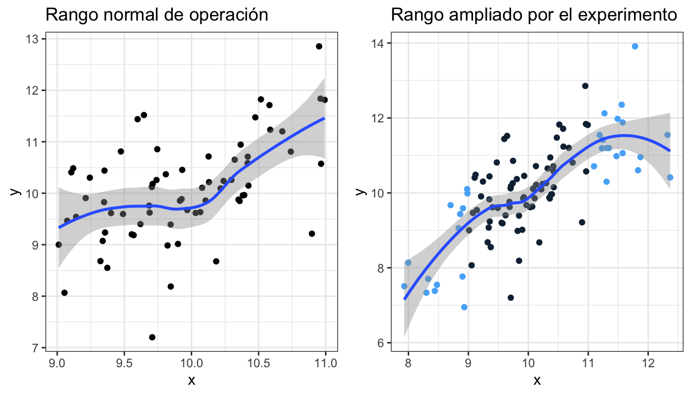
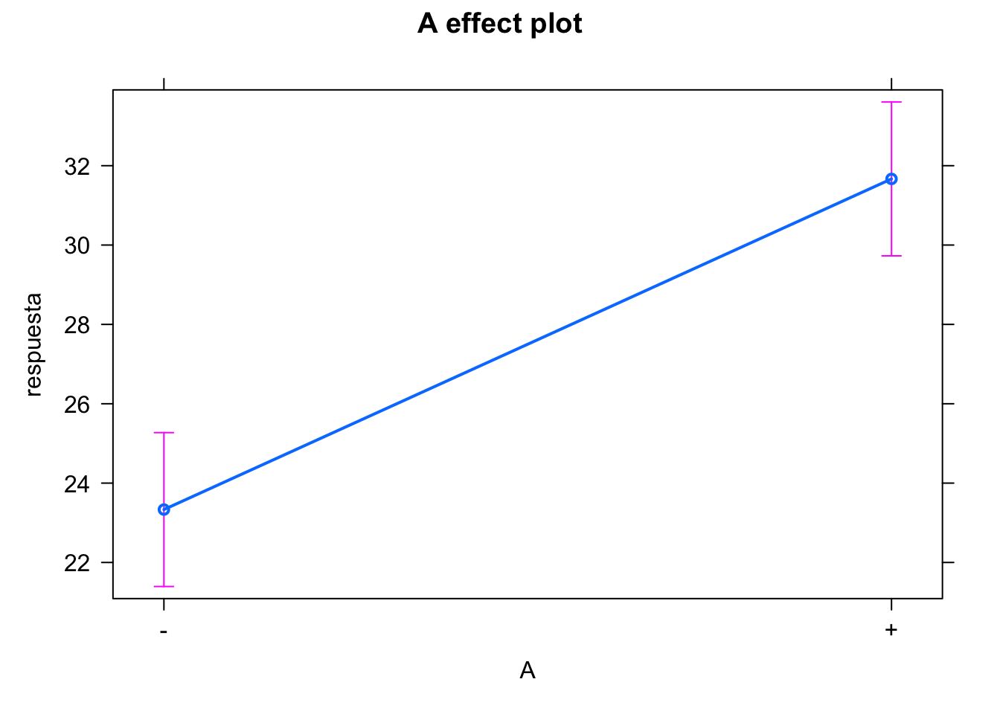
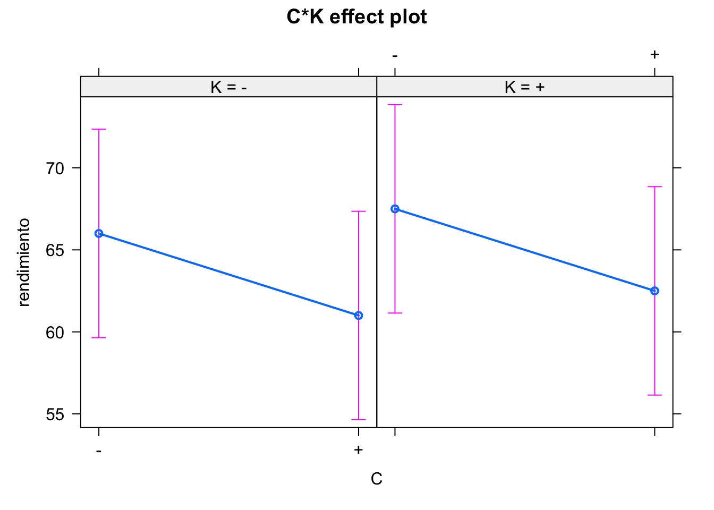

# Diseño de experimentos {#doe}

## Introducción

El Diseño y Análisis de Experimentos (que abreviaremos como DoE), como cualquier
otra técnica estadística, se basa en el estudio de la variabilidad. DoE es la
herramienta más potente para la mejora, lo que ha llevado a algunos autores a
llamarlo "the jewel of quality engineering" (Ver por ejemplo
@allen2010).

En apartados anteriores del libro hemos aprendido las herramientas básicas 
para **analizar la variabilidad** de los datos. En este apartado vamos a revisar 
las técnicas de Diseño de Experimentos y
su posterior análisis. Demasiado a menudo los esfuerzos se centran en intentar
analizar un experimento sin diseño, lo que provoca frustración en los equipos
involucrados en el análisis de datos. Vamos a mostrar la
importancia de la fase de diseño, así como su planificación y correcta
ejecución. No obstante la parte de análisis es igualmente importante, sobre todo en
lo que concierne a la correcta interpretación de los resultados.


## Bases del DoE: origen, importancia, objetivos y requerimientos


El DoE moderno surge a principios del siglo XX de la mano de Ronald A. Fisher
cuando trabajaba en el "Rothamsted Experimental Station" en Inglaterra. Sus
estudios se centraban en reducir la variación natural y prevenir la confusión 
con la variación de los restantes efectos. En última instancia, detectar
las relaciones causa-efecto con el menor esfuerzo experimental.


Básicamente, necesitamos el DoE frente a
estudios observacionales u otras estrategias como "un factor cada vez" para
estudiar las interacciones y encontrar relaciones de causa-efecto con 
el menor uso de recursos posible.
Así, podremos tomar decisiones respaldadas por los datos.


El objetivo del diseño de experimentos es encontrar los niveles de
ciertos factores que optimizan una determinada característica medible. 
Esto se consigue con un método sistemático^[En realidad, el método científico.] que evita salidas en falso y respuestas
incompletas. Mediante la reducción del error experimental se consigue evitar la confusión de los efectos y anular los efectos sin interés para el estudio. 


Para empezar, lo primero que necesitamos es definir los datos del problema
objeto de estudio y disponer de una forma de obtenerlos adecuadamente, en particular:

- Una variable respuesta en escala métrica
- Factores controlables
- Posiblemente, otros factores aleatorios

Esta recogida de datos se debe realizar de forma sistemática y 
teniendo en cuenta los tres pilares del DoE: aleatorización, bloqueo y
replicación.


## Importancia del diseño

Con la experimentación básicamente controlamos los niveles a los que operan
ciertos factores controlables, a la vez que se asignan dichos niveles
(configuraciones, tratamientos, etc.) a las unidades experimentales. Esto
permite, unido a las apropiadas estrategias de aleatorización, bloqueo y
replicación, realizar predicciones acerca del desempeño de un determinado
proceso. Estas predicciones así establecidas serán el resultado de la
identificación de una relación causa-efecto, que no se puede conseguir
simplemente analizando datos recogidos sin diseño. En los estudios observacionales:

  - Recogemos información
  - No controlamos factores
  - Análisis descriptivos
  - Descubrir _relaciones_

Mientras que con experimentos diseñados:

  - Se controlan los factores
  - Se analizan efectos
  - Incluidas las interacciones
  - Se verifica la relación _causa-efecto_


Si la experimentación se lleva a cabo variando una vez cada factor, buscando el
valor óptimo para la respuesta para cada factor individualmente dejando fijos
el resto arbitrariamente, estaremos obviando un aspecto
fundamental: el efecto de las interacciones. La interacción es el efecto que tiene un factor a distintos niveles de otros factores. Por otra parte, el número de 
experimentos necesarios para llegar a conclusiones válidas es mucho mayor
(y por tanto el experimento más costoso). Con diseño de Experimentos obtenemos el mayor número de combinaciones posibles para estimar interacciones, con el mínimo número de experimentos.


::: {.rmdcafe data-latex=""}

El análisis de datos, por muy sofisticado que sea, no puede nunca
_arreglar_ un experimento mal diseñado (chapucero, según Lawson)


>  Sometimes the only thing you
  can do with a poorly designed
  experiment is to try to find out
  what it died of  
    R.A. Fisher

>  As we know from Murphy's Law, if anything can go wrong it will, and analysis of
  data can never compensate for botched experiments  
    @lawson2015
:::


El análisis de la varianza sin diseño de experimentos tiene algunas
limitaciones importantes. Sin Diseño de Experimentos, los datos pueden ser inconsistentes o incompletos, al no incluir factores de ruido o Factores latentes.
Si tenemos variables correlacionadas, y alguna de ellas no se
mide, su efecto puede quedar enmascarado por las otras, como en el ejemplo de la figura \@ref(fig:c1), donde si miramos solo la relación de la variable respuesta
con el factor 1 (gráfico de la izquierda), podemos llegar a la conclusión
errónea de que el factor 1 es determinante. Pero podría ser que la causa real
sea el factor 2, que no ha sido medido y está muy correlacionado con el factor 1. 
En el gráfico de la derecha vemos que la variable respuesta crece en el mismo sentido que los factores 1 y 2, pero podría ser que el factor 2, no medido al principio, sea la causa, y no el que realmente se ha medido.


<div class="figure" style="text-align: center">

<p class="caption">(\#fig:c1)Efecto de no medir un factor</p>
</div>


Por otra parte, el rango de valores de la variable respuesta está limitado por su
rango normal de operación, que puede ocultar relaciones más amplias. En la figura
\@ref(fig:valuesrange1), el gráfico de la derecha se corresponde con el rango de 
variación normal de
los factores de un proceso. En el de la izquierda, ampliamos el rango de
posibles valores de la variable, y vemos una relación más clara, que queda
oculta en el otro caso.

<div class="figure" style="text-align: center">

<p class="caption">(\#fig:valuesrange1)Efecto de la limitación del rango de valores</p>
</div>


## Planificación de la experimentación

El conocimiento de la materia (_subject matter knowledge_) en cuestión es fundamental para desarrollar
cambios que resulten en mejoras. Sin embargo, es
necesario otro tipo de conocimiento (_profound knowledge_), en el que se
incluye la Estadística. Combinar ambos conocimientos, lleva a una
mayor capacidad de mejora.
Estas ideas, originarias de Deming, se recogen en @moen2012.
Algunas capacidades necesarias fruto de esta combinación son:

  - Entender las interdependencias entre los sistemas donde se lleva a cabo
  la experimentación;
  - Entender la relación entre las predicciones y el conocimiento del
  sistema que se quiere cambiar;
  - Entender el efecto temporal de los cambios;
  - Entender la importancia de la estabilidad del proceso;
  - Entender la extrapolación de los resultados de las pruebas para mejorar
  el sistema.


En general, se pueden seguir tres estrategias de planificación para el diseño de
experimentos. Sin planificación se pueden ir cambiando niveles de factores cada
vez y haciendo pruebas (ensayo-error), definitivamente poco efectivo. Una
planificación completa desde el inicio puede llevar a no explorar alternativas
surgidas durante la experimentación, y por tanto a no cumplir los objetivos. La
estrategia óptima la secuencia, es decir, llevar a cabo un número de experimentos al inicio, cuyas
conclusiones supondrán la planificación de una segunda fase donde centrarnos en
los factores realmente relevantes y hacer análisis más detallados y precisos. En las
primeras fases se suelen realizar diseños de _screening_ para descartar
factores no significativos. En realidad, es la aplicación del método científico,
en un proceso iterativo de aprendizaje como se muestra en la figura \@ref(fig:metodo).


<div class="figure" style="text-align: center">

<p class="caption">(\#fig:metodo)Método iterativo de aprendizaje</p>
</div>


En @moen2012 se propone el ciclo PDSA (_Plan-Do-Study-Act_) para la mejora que se muestra en la figura \@ref(fig:ciclo). Básicamente consiste en:

1. Planifica un cambio o prueba, dirigido a la **mejora**
2. Lleva a cabo el cambio o prueba (corto alcance)
3. Estudia el resultado: ¿qué has aprendido? ¿qué ha ido mal?
4. Actúa:
    - Adopta el cambio
    - Abandónalo
    - Empieza el ciclo de nuevo
  
**¡Documenta todas las acciones de mejora!**


<div class="figure" style="text-align: center">

<p class="caption">(\#fig:ciclo)Ciclo PDSA para la mejora</p>
</div>


Una buena forma de empezar el ciclo es a partir de un análisis de causa y
efecto, por ejemplo con un diagrama de Ishikawa como el que aparece en la
figura \@ref(fig:cefecto).

<div class="figure" style="text-align: center">

<p class="caption">(\#fig:cefecto)Ejemplo diagrama de causa-efecto</p>
</div>

Lo siguiente probablemente sería determinar el presupuesto/recursos disponibles,
en especial determinar el número de experimentos que se pueden realizar
realísticamente.


Hasta ahora, hemos ido mencionando algunos conceptos básicos del diseño de
experimentos. Ahora vamos a definirlos un poco más formalmente.

- **variable respuesta**:  La variable de interés que pretendemos
  mejorar. Será una cuantificación de alguna característica de
  calidad, en sentido amplio.
- **factor**: Variable independiente que puede ser causa de la respuesta.
  La inferencia que haremos con DoE será confirmar o rechazar esta
  hipótesis.
- **variable de bloque**: Variable que no tiene interés en la investigación,
  pero puede influir en la respuesta. Mediante la formación de bloques
  confundimos su efecto con los factores que realmente nos interesan.
- **variable ruido**: Variable que puede influir en la respuesta, pero de la
  que no tenemos control.
- **nivel**: Valor que fijamos de un factor. En variables
  cualitativas, una categoría. En variables cuantitativas, un valor numérico
  determinado fijado con antelación.
  A menudo se le llama también tratamiento.
- **unidad experimental**: La división más pequeña posible de unidades de un
  experimento tal que a dos cualesquiera se les pueden aplicar distintas
  combinaciones de factores y niveles.
- **unidad observable**: Cada uno de los elementos que forman la unidad
  experimental. A veces, un tratamiento no se puede aplicar a un solo
  elemento, sino a varios a la vez.
- **bloque**: Grupos de unidades experimentales que son tratados de forma
  similar en el experimento.
- **efecto**: El principal resultado de interés del experimento: qué pasa con
  la variable respuesta.
- **réplica**: Repetición de un experimento sobre una misma combinación de
  factores y niveles, a diferentes unidades experimentales.
- **repetición**: Repetición de la medición de la respuesta con las mismas
  condiciones experimentales, a la misma unidad experimental.
- **aleatorización**: Asignación de niveles y bloques a unidades
  experimentales de forma aleatoria


Al utilizar un modelo para simplificar una realidad, estamos cometiendo un
error. El **error experimental** es aquel que se debe exclusivamente a las réplicas
de las mismas condiciones experimentales. En cada diseño el error experimental
se calcula de una forma distinta, de forma que se separa de la variabilidad total
para ver cuánta variaación se debe al modelo y poder así tomar decisiones. Así, en el modelo:

$$Y = f(X) + \varepsilon$$

- Y es la variable respuesta
- X es el conjunto de variables predictivas
- $f$ función lineal, exponencial, etc.
- $\varepsilon$ es una variable aleatoria

Se separa el error de la variabilidad total.


Los siguientes principios son cruciales a la hora de diseñar el experimento.

- **Aleatorización**. Los tratamientos deben ser asignados de forma aleatoria a las 
unidades experimentales. Esto incluye bloques, factores controlables, anidamientos, 
etc.

- **Formación de bloques**. Cuando no se puedan replicar exactamente las condiciones 
experimentales (por ejemplo, días diferentes), se deben organizar en bloques.

- **Réplicas**. Para poder estimar el error experimental y hacer contrastes de 
hipótesis, es necesario tener más de una _corrida_ de cada combinación de tratamientos.


@lawson2015 propone la siguiente _checklist_ a la hora de planificar
experimentos:

1. Definir objetivos
2. Identificar unidades experimentales
3. Definir variable respuesta medible y con sentido
4. Identificar los factores controlables y latentes
5. Ejecutar pruebas piloto
6. Hacer diagrama de flujo para cada experimento
7. Elegir el diseño experimental
8. Determinar el número de réplicas necesarias
9. Aleatorizar las condiciones experimentales a las unidades experimentales
10. Definir método de análisis de datos
11. Calendario y presupuesto para la ejecución


## Tipos de diseños de experimentos


### Experimentos con un factor

Podemos comparar una variable a distintos niveles de un solo
factor. El contraste de la $t$ de Student es la técnica
utilizada para dos niveles. Para más niveles, utilizamos
el análisis de la varianza de un factor (véase sec:anova1).
Cuando hay algún factor más que no es de interés,
pero puede afectar a la variable resupesta, se debe introducir
como variable de bloque. Los diseños de cuadrados latinos
y cuadrados greco-latinos se utilizan para introducir dos o tres
factores de bloque respectivamente.


El diseño experimental para el ANOVA de un factor sigue las siguientes pautas:

1. Se quiere estudiar el efecto de un solo factor sobre una población. No hay otros
factores controlables que puedan influir.

2. Se realiza el plan de recogida de datos, posiblemente con prueba piloto.

3. Se decide el número de unidades experimentales del experimento.

4. Se asignan **aleatoriamente** las unidades a los niveles del factor.

5. Se recogen los datos (experimento físico, cuestionario, etc.)

6. Se realiza un análisis descriptivo, sobre todo gráfico, de los datos recogidos. 

7. Los datos se verifican y se preparan adecuadamente para el análisis.

7. Se ajusta el modelo.

8. Se comprueba la validez del modelo. Si no es válido, se busca modelo alternativo de análisis.

9. Se estiman los parámetros.

10. Se comprueba las hipótesis principal.

11. Si hay diferencias, se realizan comparaciones por pares.

12. Se comprueba la significación práctica y se obtienen conclusiones o se toman
decisiones.


### Diseños multifactoriales

Cuando analizamos más de un factor a varios niveles, aplicamos
lo explicado en el apartado \@ref(sec:anova2). Recordemos que en
estos diseños es de vital importancia estudiar las interacciones.


### Diseños factoriales a dos niveles $2^k$


Un tipo especial de diseño multifactorial es aquél en el que
todos los factores tienen solamente dos niveles. El número
de experimentos necesarios para probar todas las combinaciones
de niveles para $k$ factores es $2^k$, de ahi su nombre.

**Diseño factorial $2^2$**

Modelo:

$$y_{ijk} = \alpha_i + \beta_j + \alpha\beta_{ij} + \varepsilon_{ijk}$$

Datos:

- Aleatorizar tratamientos
- Realizar $k$ réplicas
- Número de experimentos: $k\times 2^2$

Análisis:
- Efectos principales
- Interacción


::: {.rmdpractica data-latex=""}
En el siguiente código se analiza un experimento con dos factores A y B a dos niveles, `+` y + `-`. Se muestran los gráficos de los efectos.
:::


```r
library(xtable)
library(DoE.base)
library(effects)
library(reshape2)
datosf22 <- scan(text = "
-	-	28
-	-	25	
-	-	27
+	-	36
+	-	32
+	-	32
-	+	18
-	+	19
-	+	23
+	+	31
+	+	30
+	+	29	
", 
    what = list(character(), character(), numeric()),
    sep = "\t") 
datosf22 <- as.data.frame(datosf22)
colnames(datosf22) <- c("A", "B", "respuesta")
datosf22$replica <- rep(1:3, 4)
library(knitr)
kable(dcast(datosf22, A + B ~ replica, value.var = "respuesta"))
```


|A  |B  |  1|  2|  3|
|:--|:--|--:|--:|--:|
|-  |-  | 28| 25| 27|
|-  |+  | 18| 19| 23|
|+  |-  | 36| 32| 32|
|+  |+  | 31| 30| 29|

```r
modelof22 <- lm(respuesta ~ A + B + A*B, data = datosf22)
# kable(anova(modelof22))
anova(modelof22)
#> Analysis of Variance Table
#> 
#> Response: respuesta
#>           Df  Sum Sq Mean Sq F value    Pr(>F)    
#> A          1 208.333 208.333 53.1915 8.444e-05 ***
#> B          1  75.000  75.000 19.1489  0.002362 ** 
#> A:B        1   8.333   8.333  2.1277  0.182776    
#> Residuals  8  31.333   3.917                      
#> ---
#> Signif. codes:  
#> 0 '***' 0.001 '**' 0.01 '*' 0.05 '.' 0.1 ' ' 1
```


```r
library(lattice)
trellis.par.set(background = list(col = "white"))
plot(effect(term = "A", mod = modelof22))
#> NOTE: A is not a high-order term in the model
```


```r
plot(effect(term = "B", mod = modelof22))
#> NOTE: B is not a high-order term in the model
```


```r
plot(effect(term = "A:B", mod = modelof22))
```


::: {.rmdejemplo data-latex=""}
Vemos que los dos efectos principales son significativos, pero no lo es la interacción. Podemos eliminar ese término del modelo para así ganar grados de libertad y tener una mejor estimación del error.
:::


```r
modelof22 <- lm(respuesta ~ A + B, data = datosf22)
anova(modelof22)
#> Analysis of Variance Table
#> 
#> Response: respuesta
#>           Df  Sum Sq Mean Sq F value    Pr(>F)    
#> A          1 208.333 208.333  47.269 7.265e-05 ***
#> B          1  75.000  75.000  17.017  0.002578 ** 
#> Residuals  9  39.667   4.407                      
#> ---
#> Signif. codes:  
#> 0 '***' 0.001 '**' 0.01 '*' 0.05 '.' 0.1 ' ' 1
```


```r
plot(effect(term = "A", mod = modelof22))
```


```r
plot(effect(term = "B", mod = modelof22))
```


**Diseño factorial $2^3$**

Modelo:

$$y_{ijkl} = \alpha_i + \beta_j + \gamma_k + \alpha\beta_{ij} 
+ \alpha\gamma_{ik}+ \beta\gamma_{jk} + \alpha\beta\gamma_{ijk} + \varepsilon_{ijkl}$$

Datos:
- Aleatorizar tratamientos
- $l$ réplicas (o no)
- Número de experimentos: $l\times 2^3$

Análisis:

- Efectos principales
- Interacciones (más de dos difícil de ver)
- Eliminar no significativas para aumentar precisión


::: {.rmdejemplo data-latex=""}
En el siguiente ejemplo, analizamos tres factores, pero omitimos la interacción de orden 3. Después, podríamos eliminar las interacciones menos significativas para quedarnos con el modelo más sencillo.
:::


```r
datosf23 <- scan(text = "
-	-	-	60
+	-	-	72	
-	+	-	54
+	+	-	68
-	-	+	52
+	-	+	83
-	+	+	45
+	+	+	80
", 
    what = list(character(), character(), character(), numeric()),
    sep = "\t") 
datosf23 <- as.data.frame(datosf23)
colnames(datosf23) <- c("T", "C", "K", "rendimiento")
kable(dcast(datosf23, T + C + K ~ ., value.var = "rendimiento"))
```


|T  |C  |K  |  .|
|:--|:--|:--|--:|
|-  |-  |-  | 60|
|-  |-  |+  | 52|
|-  |+  |-  | 54|
|-  |+  |+  | 45|
|+  |-  |-  | 72|
|+  |-  |+  | 83|
|+  |+  |-  | 68|
|+  |+  |+  | 80|

```r
modelof23 <- lm(rendimiento ~ T + C + K + T*C + T*K + C*K, data = datosf23)
anova(modelof23)
#> Analysis of Variance Table
#> 
#> Response: rendimiento
#>           Df Sum Sq Mean Sq F value  Pr(>F)  
#> T          1 1058.0  1058.0    2116 0.01384 *
#> C          1   50.0    50.0     100 0.06345 .
#> K          1    4.5     4.5       9 0.20483  
#> T:C        1    4.5     4.5       9 0.20483  
#> T:K        1  200.0   200.0     400 0.03180 *
#> C:K        1    0.0     0.0       0 1.00000  
#> Residuals  1    0.5     0.5                  
#> ---
#> Signif. codes:  
#> 0 '***' 0.001 '**' 0.01 '*' 0.05 '.' 0.1 ' ' 1
```


```r
plot(effect(term = "T", mod = modelof23))
#> NOTE: T is not a high-order term in the model
```



```r

plot(effect(term = "C", mod = modelof23))
#> NOTE: C is not a high-order term in the model
```


```r
plot(effect(term = "K", mod = modelof23))
#> NOTE: K is not a high-order term in the model
```


```r
plot(effect(term = "T:C", mod = modelof23))
```


```r
plot(effect(term = "T:K", mod = modelof23))
```


```r
plot(effect(term = "C:K", mod = modelof23))
```



**Diseño factorial $2^k$**

Siguiendo la misma estructura que los dos anteriores, con más efectos principales y más interacciones, pero más allá de 3 es muy difícil que se produzcan, y más difícil de interpretar.
El número de experimentos necesarios aumenta exponencialmente, y se suelen preferir experimentos fraccionados. Cuando no hay grados de libertad suficientes para realizar contrastes se utilizan herramientas gráficas para seleccionar efectos significativos (Pareto y gráfico normal)

Para la Formación de bloques, se confunden con efectos de interacciones de orden superior, multiplicando los signos y dividiendo en dos bloques

### Diseños fraccionales

Los diseños factoriales fraccionales $2^{k-p}$ utilizan solo una fracción de su equivalente factorial. En estos diseños se confunden los efectos principales con las interacciones de mayor orden. De esta forma, se puede realizar _screening_ de muchos factores con pocos experimentos, y una vez eliminados del modelo los efectos no significativos se estima mejor el error.

### Diseños avanzados

Existen otros diseños avanzados que no se tratan en este texto, como son:

  - Plackett and Burman
  - Diseños anidados
  - Split-plot
  - Medidas repetidas
  - Superficie respuesta


