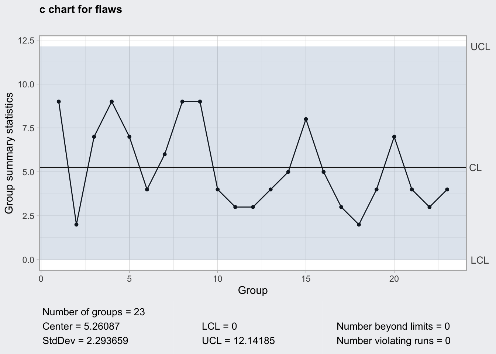
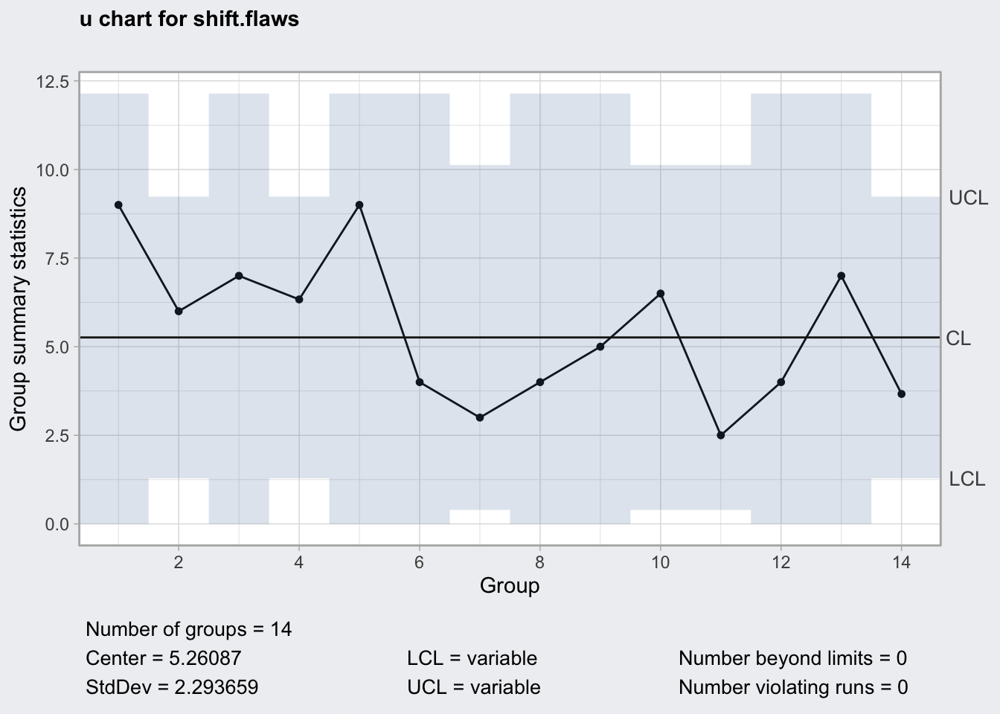
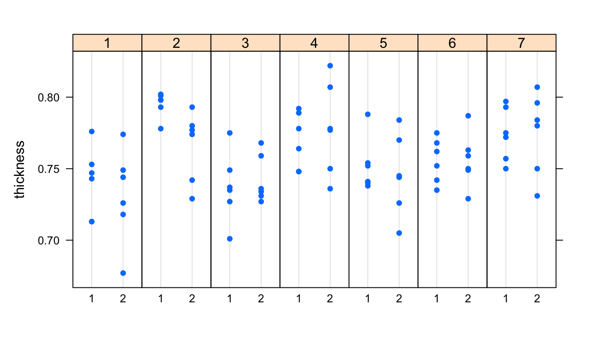

# Control Estadístico de Procesos {#spc}


## Gráficos de control {#ch_spc}

### Introducción


El objetivo de los gráficos de control es identificar cuándo el proceso está
fuera de control estadístico. A partir de ahí, los métodos de SPC nos permitirán mejorar el proceso, 
por medio de la eliminación de las causas asignables de variación.


<div class="rmdquote">
<blockquote>
<p>Assignable causes of variation may be found and eliminated</p>
<p>Walter A. Shewhart</p>
</blockquote>
</div>


Recordemos de la introducción que los procesos se mueven de forma
natural dentro de unos límites de referencia. En los gráficos de 
control, lo que haremos será tomar muestras de los procesos y medir
alguna característica (variable o atributo). Los valores de las muestras los resumiremos con algún estadístico, como la media
o la desviación típica. Esta medida resumen la representaremos
gráficamente junto con unos **límites de control**, que abarcan esa franja de
variación natural de esa medida resumen. Mientras los valores de la muestra estén dentro de los
límites de control, el proceso se puede considerar **bajo control estadístico**.
En los siguientes apartados describiremos con detalle aspectos generales
de los gráficos de control, así como gráficos de control específicos.


#### Elementos del gráfico de control

El gráfico de control es un gráfico en dos dimensiones, donde el eje vertical
representa una medida resumen de la característica media en las muestras obtenidas del proceso. Dicha
medida resumen se refiere a la medición de una característica de interés en los
elementos de cada muestra. Sobre ese eje, se representan
tres líneas: la línea central (LC, Línea central) y los límites de control superior (LCS) 
e inferior (LCI)^[En algunas aplicaciones encontraremos los acronimos sin
traducir CL (Center Line), UCL (Upper Control Limit) y LCL (Lower
Control Limit) para la línea central y los límites de control superior e
inferior respectivamente.].
La **línea central** representa alguna medida de centralización de la medida 
resumen que se está representado, por
ejemplo la media. Los **límites de control** superior e inferior representan los límites de
variación natural de dicha medida resumen, que generalmente se fijan en
tres desviaciones típicas^[Nótese que aquí nos estamos refiriendo a la
desviación típica de la _medida resumen_, no de la característica que
estamos midiendo.] a ambos lados del valor central. Estos límites 
aseguran que, con el proceso bajo control, es muy improbable que un punto 
se salga de los límites. Por tanto, tendremos mucha seguridad de que el 
proceso ha dejado de estar bajo control estadśitico. Por ejemplo, para el gráfico
de la media, que sigue una distribución normal, la probabilidad de que la media de una 
muestra se salga de los límites estando el proceso bajo control, es de 0.0027.
Es decir, solo el 0.27% de los puntos que se salgan serán una falsa alarma.
Una vez representados los límites, situamos los **puntos** según el valor de la
medida resumen de la muestra en el eje
vertical, y por orden secuencial según el eje horizontal. Finalmente se unen los
puntos con **líneas**. La figura \@ref(fig:cc4) muestra todos los elementos
del gráfico de control descritos.


<div class="figure" style="text-align: center">

<p class="caption">(\#fig:cc4)Elementos del gráfico de control</p>
</div>


#### Diseño del gráfico de control {#subsec_diseniogc}


Una vez determinada la característica de interés, hay dos partes fundamentales del diseño
del gráfico de control: la determinación de los límites de control, y la
determinación de la estrategia de muestreo.
Básicamente, la implementación del gráfico de control
se realiza en dos fases:

1. **Fase I**. Se fijan unos límites de control con el proceso bajo control
estadístico.

2. **Fase II**. Una vez fijados los límites de control, los siguientes valores
que produzca el proceso se monitorizan con los límites fijados.


La fase I es la más delicada, y hay varias formas de afrontarla.
La más sencilla, es partir de unos valores pre-especificados basados en la
media y la desviación típica del proceso. Cuando el proceso es estable, podemos
confirmar mediante contrastes de hipótesis que efectivamente esos valores 
pre-especificados pueden ser los del proceso con una cierta _confianza_.
Cuando no podemos confiar en unos valores pre-especificados, entonces tenemos
que estimarlos, fijando así unos límites provisionales utilizando un conjunto de
datos preliminar. En general, entre 25 y 30 muestras con entorno a 5 unidadades
cada una suele ser suficiente para estimar los límites de control.
Si el proceso muestra control estadístico, podemos utilizar esos límites
como límites del proceso. Si el proceso no está bajo control estadístico, se eliminan las 
causas especiales de variación^[Esta tarea depende de cada proceso y organización. 
Si no se encuentra ningna causa que corregir, se pueden calcular los límites
de nuevo sin ese dato, hasta conseguir un proceso bajo control estadístico.]
y se vuelven a calcular los límites. Esta operación se repite hasta que el proceso
esté bajo control estadístico.
Otro aspecto importante de la Fase I es que se debe controlar primero la 
variabilidad del proceso y, una vez esta variabilidad está bajo control estadístico,
comprobar que la media del proceso está también bajo control. 

En la 
Fase II se identifican las causas especiales de variación, que no solo vienen
dadas por puntos fuera de los límites, sino también por otros patrones
altamente improbables que indiquen que la variación no es debida solamente al azar.
Además, en la
Fase II se debe vigilar que los límites de control siguen siendo válidos
para nuestro proceso, y cuando el proceso cambie, los límites de control
se deben revisar y actualizar. De otro modo, el gráfico de control 
perdería utilidad.

Un error muy común que hay que evitar, es fijar los límites de control
con cada nueva muestra de datos. Esto implica que si se producen cambios en el 
proceso, podemos no detectarlos porque esos datos _malos_ están siendo
utilizados para calcular los límites del proceso supuestamente bajo control.

Es importante diferenciar entre **control del proceso** y 
**especificación del proceso**. Es un error muy común no hacerlo, lo que 
lleva a un uso inadecuado del control estadístico de procesos.
El proceso puede no estar controlado pero cumplir las especificaciones,
y viceversa. El control estadístico de procesos nos sirve para anticipar futuros
problemas que hagan al proceso dejar de cumplir las especificaciones, y poder
corregir los problemas antes de que lleguen al producto (y al cliente). Por
tanto los límites de control del proceso (fijados por la variación natural del
proceso) y los límites de especificación del proceso (fijados por el cliente, ya
sea interno o externo), no están relacionados entre sí, son cosas distintas cuya
comparación nos permitirá medir la capacidad del proceso, como veremos en el
capítulo \@ref(ch:capacidad). 

En cuanto a la estrategia de muestreo, hay varios aspectos básicos que debemos tener
en cuenta. El primero, es que la muestra debe ser representativa de la producción.
Para ello, se deben realizar **muestreos aleatorios**. No siempre es posible hacer 
un muestreo completamente aleatorio, por sorteo, pero sí se deben evitar el tomar
muestras que no sean representativas (por ejemplo, tomar siempre las primeras o 
las últimas del día porque es más cómodo). Por otro lado, se debe realizar
una adecuada estratificación. Es decir, debemos tomar las muestras 
de grupos homogéneos, y no mezclar muestras de partes del proceso diferentes
(por ejemplo diferentes máquinas, diferentes turnos, etc.).
Por último, hay tres decisiones importantes: cuántas muestras analizar cada
vez, de qué tamaño, y cada cuánto tiempo.

Ya hemos dicho que para la determinación de los límites de control se
deben utilizar entre 25 y 30 muestras. En general, este es un número adecuado de muestras para
representar en cualquier gráfico de control para una fácil lectura
e interpretación. No obstante, se puede examinar el gráfico de control con cada
nueva observación, junto, por ejemplo, con las 24 anteriores. Las decisiones sobre el tamaño y la
frecuencia de la muestra suelen estar muy relacionadas. Para los gráficos que 
vamos a estudiar en este capítulo, muestras de entre 4 y 8 unidades suelen dar un 
buen resultado. La frecuencia dependerá de cuánto tiempo estamos dispuestos a esperar
hasta detectar un cambio en el proceso. En el apartado \@ref(sec:gcv) se proporcionan
algunas herramientas para determinar el tamaño de la muestra y el error cometido para
el gráfico de control de la media, que se puede utilizar para el diseño de un plan de control.


#### Funcionamiento del gráfico de control

Lo que estamos haciendo al controlar los procesos mediante gráficos de control
es realmente un contraste continuado de hipótesis para comprobar si el proceso
está bajo control. El proceso está bajo control si la variación que se observa
no se puede achacar más que al azar. El contraste se aplica a muestras recogidas
periódicamente. Si la hipótesis es cierta, la media y la desviación típica de la
muestra estarán dentro de sus límites naturales, asumiendo por defecto que estos
límites son entre tres desviaciones por encima y por debajo de la media ($\theta_0
\pm 3\sigma$)^[$\theta_0$ representa el valor central del gráfico, que
puede ser la media, el rango medio, la desviación típica media, etc.].
Además de los puntos fuera de los límites, hay otras
situaciones altamente improbables que también indican que el proceso no está bajo control.
Así, los pasos a seguir son los siguientes.

1. Fijar límites con el proceso bajo control
2. Obtener muestras homogéneas (grupos racionales)
3. Calcular medias y desviaciones típicas (o rangos)
4. Representar datos
5. Identificar las situaciones fuera de control
6. Eliminar las causas de variación asignables


Una vez tenemos un adecuado plan de control, debemos fijar los límites del
proceso bajo control. A partir de aquí, obtener los gráficos de control con la
regularidad establecida en el plan. El plan debe incluir una revisión 
periódica de los límites de control, y ajustarlos cuando nuestro proceso cambie
(en media o en variabilidad). El objetivo de los gráficos de control es detectar
causas especiales de variación, y eliminar estas causas. El método descansa en
la base de que cualquiera de las situaciones en las que el proceso se clasifica
como fuera de control, es tan improbable que suceda, que no podemos aceptar que
se deba exclusivamente al azar, es decir, a la variación natural del proceso
(causas naturales), y por tanto debe haber otros motivos (causas especiales) que
debemos identificar. Por ejemplo, un punto fuera de los límites sólo se
producirá de forma natural 27 veces de cada 10.000. 

En relación a los efectos producidos por un proceso fuera de control, hay que
tener en cuenta que pueden ser diversos. El más intuitivo es que puede provocar
una disminución en la capacidad del proceso y por tanto aumentar la proporción
de no conformidades a largo plazo. En otros casos puede suceder lo contrario,
que se produzca una mejora en el proceso. Si esta mejora no es apreciada por
el cliente podemos estar incurriendo en un sobrecoste. Si la mejora es
apreciada por el cliente, es una oportunidad para hacer sostenible en el
tiempo esa mejora. Por ejemplo, en un proceso donde se mejora la resistencia de
un material en un día determinado, si la causa asignable es que se ha añadido
más cantidad de la necesaria de un componente determinado, la situación
fuera de control supuso un sobrecoste. Si la causa asignable fue un cambio en el
procedimiento, se puede implementar el cambio para mejorar el proceso de forma
sostenible. 


Las siguientes señales nos pueden estar indicando que el proceso deja de estar
bajo control. Básicamente, el hecho de que alguno de los siguientes hechos
suceda es altamente improbable, por lo que muy posiblemente no se deba al azar,
sino a alguna causa especial:

- Puntos fuera de los límites
- Siete puntos seguidos al mismo lado de la línea
- Seis puntos seguidos creciendo o decreciendo
- Catorce puntos seguidos alternando arriba y abajo
- Cualquier otro patrón inusual


Además de estos patrones, se puede mirar dentro de los límites para anticipar
posibles problemas. Definimos tres zonas y miramos qué pasa en ellas:

1. Zona C: entre la línea central y una desviación típica
2. Zona B: Entre una y dos desviaciones típicas desde la línea central
3. Zona A: Entre dos y tres desviaciones típicas de la línea central


<div class="figure" style="text-align: center">

<p class="caption">(\#fig:cc5)Zonas del gráfico de control</p>
</div>


Las situaciones que, por ser altamente improbables, se deberían 
investigar en busca de causas asignables, son las siguientes:

- Dos de tres puntos seguidos en la zona A o más allá
- Cuatro de cinco puntos seguidos en la zona B o más allá
- Quince puntos seguidos en la zona C

El tercer caso es una **oportunidad** de mejora, ya que se ha conseguido
reducir la variabilidad del proceso.


### Gráficos de control por variables {#sec:gcv}

Cuando la característica que estamos midiendo es una variable numérica continua,
utilizamos gráficos de control por variables. En el control por variables,
debemos controlar tanto los valores centrales de la variable como su
variabilidad, por lo que los gráficos de control se utilizan habitualmente en
parejas: un gráfico para los valores medios (o los valores individuales si no
tenemos grupos) y otro para la variabilidad.

Para el cálculo de los límites, debemos tener en cuenta que, si no disponemos
de valores preespecificados fiables de la media y la desviación típica, debemos 
_estimarlos_ a partir de muestras del proceso (subgrupos de tamaño $n$).
No entraremos
en este libro en los detalles teóricos de esta estimación, simplemente destacar que
algunos gráficos de Shewhart utilizan la distribución de los
rangos de muestras normales.
A partir de esta distribución, se determinan unas constantes que dependen solo
del tamaño de los grupos $n$. El cálculo de los límites se realiza entonces
mediante fórmulas en las que aparecen estas constantes. 
Tanto la tabla como las fórmulas se encuentran en el apéndice \@ref(ap:tablas), y
se pueden utilizar para construir los gráficos de control con Excel. No obstante,
el software estadístico realiza estos cálculos automáticamente.

Como se vio en el apartado \@ref(subsec:diseniogc), para calcular los límites
de control en Fase I podemos partir de valores pre-especificados de la media y la desviación
típica, o bien estimar estos parámetros. En este punto es importante señalar
que, si bien la media muestral $\overline{x}$ es un buen estimador de la
media poblacional $\mu$, la desviación típica muestral $s$ no es el mejor
estimador de la desviación típica poblacional $\sigma$.
En su lugar, se utilizan los siguientes estimadores de la desviación típica:

$$\hat{\sigma}=\frac{s}{c_4};\qquad \hat{\sigma}=\frac{R}{d_2},$$

donde $c_4$ y $d_2$ son constantes que solo dependen del tamaño de 
la muestra $n$ y $R$ es el rango de la muestra. Las constantes
están tabuladas y se pueden utilizar para realizar gráficos "a mano"  o
con Excel, aunque es muy costoso (el software estadístico lo hace
automáticamente).


\BeginKnitrBlock{rmdpractica}<div class="rmdpractica">**R**

Para obtener gráficos de control con R utilizaremos básicamente el paquete
`qcc`, y su función del mismo nombre. Esta función requiere siempre 
el tipo de gráfico a representar (uno de xbar, R, S, xbar.one, p, np, c, u,
g) y los datos del proceso (de forma distinta según el tipo de gráfico). 
Las fases I y II se manejan pasando conjuntos de datos distintos (uno se usa
para el cálculo
de los límites, el otro no), o bien introduciendo los valores preespecificados
de los parámetros.
Existen
más opciones disponibles, consulta la documentación del paquete. También se
pueden añadir elementos y anotaciones al gráfico en la forma estándar.

Podemos guardar el resultado de la función `qcc` en un objeto de R. Por
defecto, al guardar este objeto se muestra el gráfico en el dispositivo gráfico
activo, esto se puede desactivar con el argumento `plot`. Este objeto lo podemos
usar después para acceder a los datos del gráfico, generar el gráfico con la
función plot, u obtener un resumen con la función summary. Si no se asigna la
expresión a ningún objeto, se muestra en la salida de texto un resumen del
objeto que se hubiera creado.
</div>\EndKnitrBlock{rmdpractica}


\BeginKnitrBlock{rmdpractica}<div class="rmdpractica">**Excel**

Realizar gráficos de control con Excel o cualquier otra hoja de cálculo
es como hacerlo a mano. Debemos calcular los límites con las fórmulas
en alguna celda, y después representarlos como una serie constante en 
un gráfico de dispersión. Los datos de cada subgrupo se pueden disponer por
filas para calcular las medidas resumen en la siguiente columna a la última,
y representar estas series como puntos y líneas en el gráfico de dispersión.</div>\EndKnitrBlock{rmdpractica}

\BeginKnitrBlock{rmdpractica}<div class="rmdpractica">**Minitab**

En Minitab, los gráficos de control se encuentran en el menú Estadísticas/Herramientas
de calidad. Están organizados por variables y atributos, aunque los cuadros
de diálogo son muy similares. Podemos introducir los valores preespecificados
de los parámetros en fase II. </div>\EndKnitrBlock{rmdpractica}

#### Gráficos de la media y el rango

La pareja más _famosa_ de gráficos de control son los de la media y el
rango.
Para realizar este tipo de gráficos debemos disponer de **subgrupos racionales**,
idealmente del mismo tamaño. Para cada subgrupo se calculan la media y el rango,
que serán los puntos a representar en ambos gráficos.
El motivo de usar el rango como medida de la variabilidad cuando trabajamos con
muestras pequeñas es que el rango es una medida más estable y fácil de calcular. 
Sin embargo, pierde efectividad a medida que aumenta el tamaño de muestra,
siendo desaconsejable su uso para tamaños de muestra mayores de 10.

En el **gráfico de la media**, los puntos representan la media de cada subgrupo. 
Para fijar los límites, debemos considerar la distribución de probabilidad de
dichas medias. Se cumple que las medias de muestras de tamaño $n$ que provienen
de una población cuya distribución es normal con media $\mu$ y desviación típica
$\sigma$, siguen una distribución también normal con la misma media y desviación
típica $\frac{\sigma}{\sqrt{n}}$.

En el caso de que dispongamos de valores preestablecidos de la media y la
desviación típica del proceso, $\mu_0$ y $\sigma_0$ respectivamente, las líneas
del gráfico serán las siguientes:

\begin{align}
LC &=& \mu_0,\\
LCI &=& \mu_0 - 3\frac{\sigma_0}{\sqrt{n}},\\
LCS &=& \mu_0 + 3\frac{\sigma_0}{\sqrt{n}}.
(\#eq:gcmcvp)
\end{align}

En estas fórmulas podemos observar dos hechos importantes:

1. Si tenemos subgrupos de distintos tamaños, los límites de control no serán constantes, sino escalonados.
2. Se pueden simplificar los cálculos haciendo $A = 3/\sqrt{n}$, siendo $A$ una constante
que solo depende del tamaño de subgrupo $n$ y que se encuentra tabulada. Así, los límites
de control quedarían: $\mu_0 \pm A \sigma_0$.

Otro aspecto importante del gráfico de la media es que, aunque la distribución 
original de la variable no sea normal, el diseño del gráfico sigue siendo válido
ya que las medias de cualquier distribución de probabilidad _tienden_ a una distribución
normal a medida que aumenta el tamaño de la muestra. Para distribuciones muy asimétricas,
puede ser recomendable aumentar el tamaño de los subgrupos.


Si no tenemos unos valores pre-especificados de la media y la desviación típica,
debemos estimarlos para calcular los límites. La media total la estimamos con
la media de las medias de todos los subgrupos, $\overline{\overline{X}}$, que será
la línea central.
Para estimar la desviación típica, y por tanto los límites de control, utilizamos
el estimador que utiliza los rangos:

$$\frac{\overline{R}}{d_2 \sqrt{n}},$$
donde $\overline{R}=\frac{\sum\limits_{i=1}^n R_i}{n}$ es el rango medio 
de todas las muestras. Por tanto la línea central y los límites de control del gráfico de la media son los siguientes^[De nuevo, existe una fórmula abreviada.]:

\begin{align}
LC &= \overline{\overline{X}},\\
LCI &= \overline{\overline{X}} - \overline{R} \times \frac{3}{d_2 \sqrt{n}} = \overline{\overline{X}} - A_2 \overline{R},\\
LCS &= \overline{\overline{X}} + \overline{R} \times \frac{3}{d_2 \sqrt{n}} = \overline{\overline{X}} + A_2 \overline{R}.\\
(\#eq:gcmsvp)
\end{align}


\BeginKnitrBlock{rmdejemplo}<div class="rmdejemplo">Una fábrica produce placas metálicas cuyo espesor (_thickness_) es una característica crítica para
la calidad. La fabricación se realiza en dos turnos cada día, y se toman seis muestras en cada turno.
La tabla \@ref(tab:thickness) muestra los 84 datos correspondientes a las muestras de una semana completa. </div>\EndKnitrBlock{rmdejemplo}


Table: (\#tab:thickness)Datos del espesor de placas metálicas

|day |shift |    p1|    p2|    p3|    p4|    p5|    p6|
|:---|:-----|-----:|-----:|-----:|-----:|-----:|-----:|
|1   |1     | 0.713| 0.776| 0.743| 0.713| 0.747| 0.753|
|1   |2     | 0.749| 0.726| 0.774| 0.744| 0.718| 0.677|
|2   |1     | 0.778| 0.802| 0.798| 0.793| 0.801| 0.798|
|2   |2     | 0.780| 0.729| 0.793| 0.777| 0.774| 0.742|
|3   |1     | 0.775| 0.735| 0.749| 0.737| 0.701| 0.727|
|3   |2     | 0.727| 0.736| 0.768| 0.759| 0.734| 0.731|
|4   |1     | 0.748| 0.748| 0.778| 0.789| 0.764| 0.792|
|4   |2     | 0.778| 0.750| 0.777| 0.736| 0.807| 0.822|
|5   |1     | 0.752| 0.738| 0.788| 0.740| 0.754| 0.741|
|5   |2     | 0.726| 0.745| 0.705| 0.770| 0.744| 0.784|
|6   |1     | 0.775| 0.742| 0.735| 0.768| 0.752| 0.762|
|6   |2     | 0.763| 0.749| 0.750| 0.759| 0.787| 0.729|
|7   |1     | 0.793| 0.757| 0.775| 0.772| 0.750| 0.797|
|7   |2     | 0.796| 0.784| 0.807| 0.780| 0.731| 0.750|


\BeginKnitrBlock{rmdpractica}<div class="rmdpractica">**R**

Los datos se encuentran en el conjunto de datos `ss.data.thickness2` del paquete
`SixSigma`. A continuación se muestra el código que produce el gráfico de control
de la figura \@ref(fig:gcm). 

Se utiliza el paquete `qcc`. La función `qccGroups`
organiza los datos en una matriz donde cada fila tiene los datos de un subgrupo.
Esta función requiere dos argumentos: el vector de datos (data) y el vector que contiene
el identificador del subgrupo (sample), en este caso las columnas `thickness` y `ushift`
del conjunto de datos `ss.data.thickness2`.

La función `qcc` crea el gráfico propiamente dicho. El gráfico más sencillo
solo requiere la matriz de datos, y el tipo de gráfico. Se calculan así los
límites con los datos de los 14 subgrupos (fase I sin valores preespecificados).
Vemos que hay un punto fuera de los límites, aunque por poco. Habría que
investigar y eliminar la causa asignable (o dejarlo, que es lo que hacemos aquí,
porque no se encuentra una razón objetiva para eliminar el subgrupo).

Consulta la ayuda de las funciones correspondientes
en RStudio para ver más opciones.

**IMPORTANTE**: En este material se utiliza la versión 3.0 del paquete `qcc`, que
es posible no esté en CRAN en el momento de usar este material. Si es así, se puede 
instalar desde GitHub usando el paquete `remotes` de la siguiente forma:
  
`    remotes::install_github("luca-scr/qcc")`
</div>\EndKnitrBlock{rmdpractica}


```r
library(qcc, quietly = TRUE)
samples.thick <- qccGroups(
  data = ss.data.thickness2,
  x = thickness,
  sample = ushift)
gd_media <- qcc(data = samples.thick, 
                type = "xbar")	
plot(gd_media)
```

<div class="figure" style="text-align: center">

<p class="caption">(\#fig:gcm)Gráfico de control de la media para el ejemplo del grosor de las placas metálicas</p>
</div>


\BeginKnitrBlock{rmdpractica}<div class="rmdpractica">**Excel**

Para hacer el gráfico en Excel, debemos disponer los datos
como en la tabla \@ref(tab:thickness). Después, calcular las
medias y rangos para cada subgrupo, la media global y el rango
medio. A continuación crear series constantes para los límites de control y la línea
central usando las fórmulas \@ref(eq:gcmsvp). Finalmente,
representar gráficamente las cuatro series (líneas y datos) en un gráfico
de dispersión, dando el formato adecuado a cada serie. Como se puede ver,
mucho más laborioso. En el siguiente enlace se puede descargar un archivo
Excel con este proceso realizado:

http://emilio.lcano.com/b/epac/datos/ejemplos_espesor2.xlsx</div>\EndKnitrBlock{rmdpractica}

\BeginKnitrBlock{rmdpractica}<div class="rmdpractica">**Minitab**

Vamos al menú "Estadísticas > Gráficas de control > Gráficas de variables para subgrupos > Xbarra". Debemos tener antes los datos en la hoja de trabajo,
que se pueden importar desde Excel entre otros formatos. Indicar las columnas que tienen los datos, o el tamaño de los subgrupos, o la 
columna identifidadora (los datos pueden estar dispuestos apilados o extendidos).</div>\EndKnitrBlock{rmdpractica}


En el **gráfico del rango**, los puntos representan el rango de cada
subgrupo. Para calcular las líneas, partimos del estimador de la deviación típica:

$$\hat{\sigma}=\frac{R}{d_2} \implies R=d_2 \hat{\sigma},$$
Nótese que el rango en este caso depende del tamaño del subgrupo a través
de la constante $d_2$. Por tanto, si tenemos distintos tamaños de subgrupos,
la línea central del gráfico del rango será escalonada.

La desviación típica de los rangos viene dada por $\sigma_R = d_3 \frac{R}{d_2}$
Si tenemos un valor pre-especificado $\sigma_0$, los límites serían los
siguientes:

$$LC = d_2 \sigma_0,$$
$$LCI = d_2\sigma_0 - 3 d_3 \frac{d_2 \sigma_0}{d_2} = \sigma_0 (d_2 - 3d_3) = D_1 \sigma_0,$$
$$LCS = d_2\sigma_0 + 3 d_3 \frac{d_2 \sigma_0}{d_2} = \sigma_0 (d_2 + 3d_3) = D_2 \sigma_0,$$

Cuando no disponemos de un valor pre-especificado $\sigma_0$, utilizamos el estimador
de la desviación típica $\hat{\sigma}=\frac{R}{d_2}$, resultando en las siguientes 
líneas de control:

$$LC = \overline{R},$$
$$LCI = \overline{R} - 3 d_3 \frac{\overline{R}}{d_2} = \overline{R} \left (1 - \frac{3d_3}{d_2}\right ) = D_3 \overline{R},$$
$$LCS = \overline{R} + 3 d_3 \frac{\overline{R}}{d_2} = \overline{R} \left (1 + \frac{3d_3}{d_2}\right ) = D_4 \overline{R}.$$
Recordemos que, para este gráfico, si tenemos tamaños de subgrupo distintos,
el rango medio $\overline{R}$ ha de calcularse para cada uno de los tamaños.


\BeginKnitrBlock{rmdpractica}<div class="rmdpractica">Para realizar el gráfico del rango de los datos de espesor procedemos de la
misma forma en cualquiera de los tres programas, pero con la opción adecuada.
En **R**, basta con cambiar el tipo de gráfico como se muestra a continuación,
resultando en la figura \@ref(fig:grango2). En **Excel**, de nuevo tendríamos
que calcular las líneas de control y representar la serie de los rangos junto
a ellas. En **Minitab**, seleccionaríamos en el menú el gráfico R.</div>\EndKnitrBlock{rmdpractica}


```r
r.thick <- qcc(data = samples.thick, type = "R")
plot(r.thick)
```

<div class="figure" style="text-align: center">

<p class="caption">(\#fig:grango2)Gráfico del rango para el ejemplo del espesor</p>
</div>


Un hecho importante a tener en cuenta es que al calcular los límites de control
inferior en los gráficos de la variabilidad, las fórmulas pueden resultar en 
valores negativos. La variabilidad por definición siempre es positiva, por lo
que en los casos en los que esto suceda, tomaremos el límite inferior igual a cero.

En este apartado hemos presentado primero el gráfico de la media y después el
de los rangos por razones didácticas. Pero hay que tener en cuenta que
antes de decidir si el proceso está bajo control con el gráfico de las medias,
se debe comprobar que la variación también está controlada. Habitualmente, 
ambos gráficos se presentan conjuntamente, como veremos en el siguiente apartado.

#### Gráficos de la media y la desviación típica

Cuando el tamaño de los grupos es mayor de 10, no debemos utilizar el gráfico
de los rangos, sino el de la desviación típica para controlar la variabilidad.
En el gráfico de la desviación típica, los puntos representados son las
desviaciones típicas muestrales $s_i$ de cada subgrupo. Para estos gráficos
utilizamos el estimador de la desviación típica del proceso que usa la
desviación típica de las muestras en vez del rango:

$$\hat{\sigma} = \frac{\overline{s}}{c_4} \implies \overline{s}=c_4\hat{\sigma},$$
donde $c_4$ es una constante que solo depende del tamaño de subgrupo $n$ y 
$\overline{s}$ es el promedio de las desviaciones típicas de los $k$ grupos.
Necesitamos además estimar la desviación típica de las desviaciones típicas
de los subgrupos, que es la siguiente:

$$\hat{\sigma_s} = \overline{s}\frac{\sqrt{1-c_4^2}}{c_4}.$$

Al igual que en el caso del rango, la desviación típica media debe calcularse
para todos los tamaños de subgrupos existentes, pudiendo resultar en líneas de 
control escalonadas.

En el caso de que tengamos valores pre-especificados de la media y la
desviación típica, $\mu_0$ y $\sigma_0$, el gráfico de control de la media
se construye exactamente igual que se ha expuesto para los gráficos de la
media y el rango. En este caso, las líneas de control del
gráfico de las desviaciones típicas se calculan así:

$$LC = c_4\sigma_0,$$

$$LCI = c_4\sigma_0 - 3 c_4\sigma_0\frac{\sqrt{1-c_4^2}}{c_4}  = \sigma_0 \left(c_4 - 3\sqrt{1-c_4^2} \right) = B_5\sigma_0,$$
$$LCS = c_4\sigma_0 + 3 c_4\sigma_0\frac{\sqrt{1-c_4^2}}{c_4}  = \sigma_0 \left(c_4 + 3\sqrt{1-c_4^2} \right) = B_6\sigma_0.$$

Si no tenemos valores preestablecidos, el cálculo de los límites del gráfico
de la media lo realizamos estimando la desviación típica del proceso a partir de
las desviaciones típicas de los subgrupos, de manera que las líneas de control
del gráfico de control de la media quedan:


$$LC = \overline{\overline{X}},$$
$$LCI = \overline{\overline{X}} - 3 \times \frac{\overline{s}}{c_4 \sqrt{n}} = \overline{\overline{X}} - A_3 \overline{s},$$
$$LCS = \overline{\overline{X}} + 3 \times \frac{\overline{s}}{c_4 \sqrt{n}} = \overline{\overline{X}} + A_3 \overline{s}.$$

Las líneas de control del gráfico de las desviaciones típicas cuando no 
tenemos un valor preestablecido $\sigma_0$ quedan así.

$$LC = \overline{s},$$

$$LCI = \overline{s} - 3 \overline{s}\frac{\sqrt{1-c_4^2}}{c_4}  = \overline{s} \left(1 - \frac{3\sqrt{1-c_4^2}}{c_4} \right) = B_3\overline{s},$$
$$LCS = \overline{s} + 3 \overline{s}\frac{\sqrt{1-c_4^2}}{c_4}  = \overline{s} \left(1 + \frac{3\sqrt{1-c_4^2}}{c_4} \right) = B_4\overline{s}.$$


\BeginKnitrBlock{rmdpractica}<div class="rmdpractica">Vamos a completar el ejemplo anterior ilustrando las fases I y II. Hagamos dos
salvedades. Por una parte, en este conjunto de datos tenemos 14 subgrupos, pero lo ideal 
sería tener entre 25 y 30. Por otra parte, podríamos seguir utilizando el gráfico
del rango ya que el tamaño de los subgrupos es menor de 10.

Supongamos que del estudio anterior se ha llegado a la conclusión de que se
pueden tomar como valores preespecificados una media $\mu_0=0.76$ y una
desviación típica $\sigma_0=0.025$. Entonces podemos fijar los límites 
tomando estos valores (ya sea en las fórmulas a mano, o en el software). 
Además, se han tomado datos de un nuevo subgrupo, resultando en las siguientes
mediciones: $0.719, 0.759, 0.708, 0.83, 0.766, 0.709$. Entonces
representamos las medidas resumen de esta nueva muestra frente
a los límites fijados en fase I.

El siguiente código produce el gráfico de la figura \@ref(fig:gms) con **R**.
Nótese cómo añadimos a las funciones los argumentos para los valores
preespecificados y los nuevos datos. En **Excel**, podemos ir añadiendo
los nuevos datos a la hoja de cálculo y extendiendo las series, pero
hay que tener mucho cuidado con la definición de las fórmulas.
En **Minitab**, en el cuadro de diálogo de los gráficos vamos a las opciones
del gráfico y los introducimos en la pestaña "Parámetros". 

En este caso vemos que, aunque el valor medio de la muestra está dentro de los
límites, la desviación típica no, y tendríamos que buscar la causa asignable
de esta situación fuera de control.

</div>\EndKnitrBlock{rmdpractica}


```r
new.sample <- matrix(c(0.719, 0.759, 0.708, 0.83, 0.766, 0.709),
                     ncol = 6)
ccxbar <- qcc(data = samples.thick, type = "xbar",
              center = 0.76,  std.dev = 0.025,
              newdata = new.sample, newlabels = "8.1",
              plot = FALSE)

ccs <- qcc(data = samples.thick, type = "S",
           newdata = new.sample, newlabels = "8.1",
           plot = FALSE)
library(ggplotify)
library(gridExtra)
grid.arrange(
  plot(ccxbar, restore.par = FALSE, add.stats = FALSE),
  plot(ccs, add.stats = FALSE)
)
```

<div class="figure">

<p class="caption">(\#fig:gms)Gráfico de la media y la desviación típica monitorizando nuevos datos</p>
</div>


#### Gráficos de valores individuales y rangos móviles


Cuando no podemos crear grupos racionales, podemos analizar los
datos individualmente. En realidad lo que estamos haciendo es partir de la base
de que cada dos observaciones son un grupo, y así tenemos un rango móvil que es la
diferencia entre cada dos valores consecutivos. 
De esta forma se pueden aplicar los principios de Shewhart para
tamaños de muestra $n=2$. 
La desviación típica a tener en cuenta no va a ser la de valores medios, sino
la propia del proceso. Así, cuando tenemos valores preestablecidos $\mu_0$ y 
$\sigma_0$, las líneas de control del **gráfico de valores individuales** son
las siguientes:

$$LC=\mu_0,$$
$$LCI=\mu_0 - 3\sigma_0,$$
$$LCS=\mu_0 + 3\sigma_0.$$
Si no disponemos de valores pre-especificados, entonces estimamos la desviación
típica a partir del rango móvil como:

$$\hat{\sigma} = \frac{\overline{R}_m}{d_2},$$
donde $d_2$ se toma para $n=2$, es decir, $1.228$, y $\overline{R}_m$ es el
promedio de los rangos móviles:

$$\overline{R_m}=\frac{\sum_{i=1}^{k-1} R_{m_i}}{k-1}; \; R_{m_i}=|X_{i+1}-X_i|.$$
Entonces las líneas de control del gráfico de los valores individuales quedaría:

$$LC=\overline{X},$$
$$LCI=\overline{X} - 3\frac{\overline{R}_m}{d_2}= \overline{X} - 2.660 \overline{R}_m,$$
$$LCI=\overline{X} + 3\frac{\overline{R}_m}{d_2}= \overline{X} + 2.660 \overline{R}_m.$$

Previamente a controlar los valores individuales, debemos controlar la variabilidad.
Para ello utilizamos el **gráfico de los rangos móviles**, utilizando las fórmulas
para subgrupos de tamaño $n=2$. Si tenemos un valor preestablecido de la desviación
típica, las líneas de control serán las siguientes:

$$LC = d_2 \sigma_0 = 1.128 \sigma_0,$$
$$LCI = d_2\sigma_0 - 3 d_3 \frac{d_2 \sigma_0}{d_2} = \sigma_0 (d_2 - 3d_3) \leadsto 0,$$
$$LCS = d_2\sigma_0 + 3 d_3 \frac{d_2 \sigma_0}{d_2} = \sigma_0 (d_2 + 3d_3) = D_2 \sigma_0 = 3.686\sigma_0.$$

Si no tenemos un valor pre-especificado de la desviación típica, las líneas de control del gráfico de los rangos móviles son las siguientes:

$$LC = \overline{R}_m,$$
$$LCI = \overline{R}_m - 3 d_3 \frac{\overline{R}_m}{d_2} = \overline{R}_m \left (1 - \frac{3d_3}{d_2}\right ) \leadsto 0,$$
$$LCS = \overline{R}_m + 3 d_3 \frac{\overline{R}_m}{d_2} = \overline{R}_m \left (1 + \frac{3d_3}{d_2}\right ) = D_4 \overline{R}_m = 3.267 \overline{R}_m.$$


\BeginKnitrBlock{rmdpractica}<div class="rmdpractica">A modo ilustrativo, tomamos las primeras 24 observaciones de los datos 
del ejemplo anterior (tabla \@ref(tab:thickness)). Para crear el gráfico de 
las medias móviles
en **R**, tenemos que "simular" las muestras de tamaño 2. El siguiente código
crea los gráficos de la figura \@ref(fig:gimm). 

En **Minitab**, 
seleccionamos los gráficos para datos no agrupados. En **Excel** tendríamos
que crear las series de rangos móviles, calcular los límites y representar las
series como en el apartado anterior.

</div>\EndKnitrBlock{rmdpractica}


```r
thickness2days <- ss.data.thickness2$thickness[1:24]
mov.samples <- cbind(thickness2days[1:23], 
    thickness2days[2:24])
cci <- qcc(thickness2days, type = "xbar.one", plot = FALSE)
ccmr <- qcc(mov.samples, type = "R", plot = FALSE)
grid.arrange(
  plot(cci, add.stats = FALSE),
  plot(ccmr, add.stats = FALSE)
)
```

<div class="figure">

<p class="caption">(\#fig:gimm)Gráficos de valores individuales y media móvil</p>
</div>


#### Tamaño de la muestra

Como se explica en el capítulo \@ref(ch:incertid), utilizamos muestras para hacer
inferencia sobre nuestra población. Por ejemplo, la medición del proceso en un
día determinado (muestra), para sacar conclusiones sobre el desempeño del proceso a largo
plazo (población). Sin entrar en los detalles teóricos ni de formulación, se
proporcionan aquí algunos conceptos referentes al muestreo que pueden aparecer al aplicar
el Control Estadístico de Procesos.

Al utilizar gráficos de control, lo que estamos haciendo son sucesivos
contrastes de hipótesis para comprobar si el proceso está fuera de control.
Así, para cada punto que representamos, realizamos el siguiente contraste:

H$_0$: El proceso está bajo control

H$_1$: El proceso está fuera de control

donde $H_0$ es lo que llamamos la hipótesis nula, y $H_1$ es la hipótesis alternativa,
que es lo que nos interesa demostrar, porque requerirá una acción. 

Al fijar los límites de control en tres desviaciones típicas más allá de la
media, estamos fijando el nivel de significación $\alpha$ para estos contrastes
de hipótesis en 0.0027. Cuando un punto está fuera de los límites, entonces
rechazamos la hipótesis de que el proceso está bajo control, y decimos que el
proceso está fuera de control (de hecho con una confianza superior al
99.73%). El tamaño de la muestra $n$ está directamente relacionado con:

- El nivel de significación $\alpha$, que es la probabilidad de que la muestra
  caiga fuera de los límites estando el proceso bajo control (error tipo I).
- La potencia del contraste $1-\beta$, siendo $\beta$ la probabilidad de que la muestra caiga dentro de los límites, estando el proceso fuera de control (error tipo II).
- El máximo error cometido al estimar el parámetro, $\delta$.


La desviación con respecto al verdadero valor del parámetro a estimar, en
este caso la media, se puede dar en valor absoluto ($\delta$), en cuyo caso
necesitamos conocer la desviación típica de los datos para calcular el 
tamaño de la muestra, o como _número de desviaciones típicas_, es decir, 
$\delta=k\sigma$. En este caso, los cuatro valores anteriores
están relacionados de forma que conociendo tres de ellos, el otro queda determinado.
Por tanto, si fijamos el nivel de significación,
potencia del test, y tamaño de la muestra, podemos saber cuál es
la desviación que vamos a detectar en nuestro proceso $\delta$.
O bien, podemos fijar el máximo error que estamos dispuestos a cometer
y obtener el tamaño de muestra que necesitamos, y así sucesivamente.

A la hora de decidir el tamaño de los subgrupos, 
no existe una regla de oro que sirva para todos los procesos. Esta decisión se
tomará en base a las características del proceso y de la empresa. En algunos
casos el número de muestras que podemos tomar está limitado por un
determinado presupuesto. Entonces, para el mismo tamaño total de muestra se
puede decidir entre tomar muchas muestras de tamaño pequeño, o menos muestras de
tamaño más grande. En general se prefieren muestras más frecuentes de tamaño
menor para detectar el cambio más rápido, pero esto depende de las
características del proceso.

En la elección final de tamaño de los subgrupos, se tendrá en cuenta, además del
coste de muestreo, la potencia del test que deseamos, y el cambio mínimo que
queremos detectar.

El diseño final del gráfico de control y su plan de muestreo, se basará en la
magnitud del cambio que queremos detectar. 
Vamos a estudiar el tamaño de los subgrupos para el gráfico de la media.
Un desplazamiento en la media del proceso, producirá un efecto en el gráfico 
de control como se muestra en la figura \@ref(fig:despmedia).
Vemos una
situación típica en la que un proceso está bajo control (azul) y a partir de
un determinado momento, se produce un desplazamiento en la media, que producirá
puntos fuera de los límites, en este ejemplo en el segundo punto. Los demás
estarían dentro de los límites de control (error de tipo II).

<div class="figure" style="text-align: center">

<p class="caption">(\#fig:despmedia)Efecto del desplazamiento de la media en el gráfico de control</p>
</div>


Dada la distribución de las medias de tamaño $n$, la probabilidad de 
no detectar un desplazamiento de $k$
desviaciones típicas desde la media, es decir:

$$\beta = P\{ \mathit{LCI} \leq \bar{x} \leq \mathit{LCS} \, |\,  \mu = \mu_0 + k\sigma \},$$
la podemos calcular de la siguiente forma [@montgomery2004]:

$$\beta = Z(3-k\sqrt{n}) - Z(-3-k\sqrt{n}),$$
donde $Z$ es la función de distribución normal estándar ($\mu=0,\,
\sigma = 1$). Por ejemplo, en el anterior gráfico de control, la media a partir
de cierto momento (puntos rojos) se ha desplazado dos desviaciones típicas por encima de la
media bajo control (puntos azules). ¿Cuál es la probabilidad de no detectar este
cambio, es decir, $\beta$? Supongamos que cada punto representa la media de un
grupo de tamaño $n=5$. Entonces:

$$\beta = Z(3-2\cdot\sqrt{5}) - Z(-3-2\cdot\sqrt{5}) = Z(-1.47) - Z(-7.47)=0.07$$
Por tanto podemos calcular el valor $\beta$ para distintos valores de $n$ y $k$,
y representar estos valores gráficamente como veremos a continuación.

Una herramienta gráfica muy útil para decidir tamaños de muestra
son las **curvas características de operación** (_OC Curves_). Estas curvas representan,
para varios
tamaños de muestra determinados (típicamente entre 1 y 25), la desviación que se
detectará, que puede estar expresada en términos absolutos, $\delta = k \sigma$,
o en número de desviaciones típicas, $\sigma$
frente a la probabilidad de error de tipo II $\beta$, es
decir, probabilidad de que el proceso esté fuera de control pero dentro de los
límites, fijado un error de tipo I $\alpha$, es decir, probabilidad de que el
proceso esté bajo control pero se salga de los límites. El error tipo I viene determinado
por las 3 desviaciones típicas desde la media que marcan los límites de control, 
es decir 0.0027.

El error tipo II, $\beta$, se interpreta también de la siguiente forma: En el
caso de que la media del proceso se desplace $k$ desviaciones típicas, $\beta$
es la probabilidad de no detectar dicho cambio. Podemos
ver en la figura \@ref(fig:occ) que el gráfico de control de la media es muy potente para detectar cambios importantes,
pero no tanto para detectar cambios más pequeños.

<div class="figure" style="text-align: center">

<p class="caption">(\#fig:occ)curva de operación característica para el gráfico de la media y varios valores de $n$</p>
</div>

Otro dato a tener en cuenta para determinar el tamaño y la frecuencia del
muestreo es la **longitud media de racha** (_Average Run Length_, ARL). El ARL es el
número de muestras, en promedio, que se tomarán antes de detectar un cambio en
la muestra. Esta variable aleatoria se corresponde con una distribución
Geométrica de parámetro $p$, cuya esperanza es $1/p$. Por tanto, el tamaño medio
de racha se calcula como el inverso de la probabilidad de que una muestra esté
fuera de los límites.
En el caso de los gráficos de control cuyos límites se fijan en 3 desviaciones
típicas, incluso cuando el proceso está bajo control en promedio tendremos
valores fuera de los límites aproximadamente cada 370 muestras:

$$\mathit{ARL}=\frac{1}{p}= \frac{1}{0.0027}=370.37.$$

Ahora bien, lo que nos interesa es saber \emph{cuándo} detectaremos un cambio en
la media como el descrito en la curva OC. El valor de $\beta$ nos indica la
probabilidad de no detectar este cambio en la primera muestra. La probabilidad
de detectar el cambio en la primera muestra será $1-\beta$, también conocido como
_potencia_ del gráfico. En general, para un
plan de muestreo con un $\beta$ determinado, el número de muestras necesarias
para detectar el cambio será:


$$\mathit{ARL} = \frac{1}{1-\beta}.$$

Por ejemplo, para $k=1$ y $n=5$, $\beta=0.25$. Entonces:

$$\mathit{ARL} = \frac{1}{1-0.25}=4,$$

lo que quiere decir que necesitaremos 4 muestras en promedio para
detectar el cambio.
Dependiendo del número de unidades producidas, se puede fijar la frecuencia del
muestreo en función del tiempo que estamos dispuestos a esperar hasta detectar
una desviación en el proceso. Es decir, si queremos detectar un cambio en la
media de una magnitud determinada, por ejemplo en el mismo día que se produce,
analizamos la producción diaria y buscamos el ARL que nos interesa. En el
ejemplo anterior, si tomamos muestras cada hora, entonces en promedio estaríamos
detectando un cambio en la media en una desviación típica cada cuatro horas.
Otro ejemplo: si nuestra producción es de 1000 lotes y tomamos muestras de
los lotes, entonces tendríamos que muestrear 4 lotes cada día si queremos
detectar el cambio (en promedio) en el mismo día, es decir, uno de cada 250. Si
tenemos turnos de 24 horas, tendríamos que tomar una muestra cada 6 horas.

Las fórmulas vistas en esta sección se refieren al gráfico de control de la
media. Existen también métodos para el resto de gráficos, aunque no son tan
claros y efectivos con los vistos aquí, consulta la bibliografía. Algunas
aplicaciones permiten la generación de curvas OC para distintos gráficos de
control. 


### Gráficos de control por atributos


No siempre podemos medir las características de calidad numéricamente. Sin
embargo, es sencillo hacer comprobaciones sobre ciertos atributos, por ejemplo
conforme/no conforme. Podemos realizar control de procesos sobre estos datos
mediante los gráficos de control por atributos. Al igual que con los gráficos
por variables, en este tipo de gráficos se detectan situaciones altamente
improbables según la distribución de probabilidad subyacente en el proceso. En
este caso, en vez de utilizar la distribución normal se utilizan distribuciones
de probabilidad discretas como la binomial y la de Poisson. 
Estas distribuciones quedan determinadas por un único parámetro para
calcular la media y la desviación típica, por lo que solamente se utiliza
un gráfico para controlar el proceso.
Salvo por esta dferencia, la mecánica de los gráficos de control por atributos es idéntica a la de los
gráficos de control por variables. Los límites de control se deben fijar en
una primera fase, bien porque tenemos unos valores estándar dados de los
parámetros, o porque los estimamos con una muestra
preliminar. Después, en la fase II se controlan los nuevos valores con estos
límites en busca de causas de variación asignables.

#### Gráficos $p$ y $np$


El gráfico $p$ Se utiliza para controlar **proporciones** dentro de subgrupos
**con un tamaño determinado**,
por ejemplo lotes, pedidos en un día, etc.
Así, los puntos representados en el gráfico para cada subgrupo 
son las proporciones de elementos
que tienen un determinado **atributo**. Así, si un subgrupo tiene tamaño
$n_j$ y hay $D_j$ elementos que presentan el atributo, el punto a representar
es:

$$p_j = \frac{D_j}{n_j}.$$
Si disponemos de un valor estándar para la proporción de elementos
de nuestro proceso que tienen el atributo, $p_0$, entonces las líneas de control
del gráfico $p$ son las siguientes:

$$LC = p_0.$$
$$LCI = p_0 - 3 \sqrt{p_0(1-p_0)/n},$$
$$LCS = p_0 + 3 \sqrt{p_0(1-p_0)/n},$$

Si por el contrario no disponemos de un valor estándar de $p$, tenemos que 
estimarlo con una muestra perliminar mediante el porcentaje global $\overline{p}$:

$$\bar{p}=\frac{\sum_{j=1}^m D_j}{\sum_{j=1}^m n_j}.$$


El gráfico de control $np$ se utiliza para controlar el número de
elementos con la característica a controlar, no la proporción, pero para el
mismo tipo de datos, es decir, cuando tenemos grupos con un determinado tamaño.
Además, este tamaño debe ser el mismo en todos los grupos.
En este caso el valor a representar es $D_j$, y los límites de control son los siguientes:

$$LC = n\bar{p},$$

$$LCS = n\bar{p} + 3 \sqrt{n\bar{p}(1-\bar{p})},$$

$$LCI = n\bar{p} - 3 \sqrt{n\bar{p}(1-\bar{p})},$$

sustituyendo $\overline{p}$ por $p_0$ cuando disponemos de este valor estándar.


\BeginKnitrBlock{rmdpractica}<div class="rmdpractica">Para representar gráficos de control por atributos con **R**, además del vector con
los datos del proceso, por ejemplo número de defectuosos, o número de defectos,
es necesario proporcionarle los tamaños de los grupos o las muestras mediante el
argumento `sizes` (excepto para el gráfico $c$).

Supongamos que queremos monitorizar la proporción de piezas cuyo grosor
excede $0.775$ en cada turno. El siguiente código crealos datos adecuados
y crea el gráfico $p$ de la figura \@ref(fig:gp). El gráfico $np$ para
estos mismos datos se obtendría simplemente cambiado el tipo de gráfico.

En **Excel** tendríamos que calcular las proporciones de cada muestra
y representar esta serie frente a los límites de control calculados
con los datos o con un valor preespecificado de $p$. Cuando los
tamaños de muestra son siempre iguales es sencillo, pero si tenemos
distintos tamaños de muestra, hacer un gráfico con límites escalonados
en Excel se complica.

En **Minitab**, seleccinamos los gráficos de control por atributos
y proporcionamos la información de qué columnas contienen los recuentos
y los tamaños de muestra (o un número si es fijo).</div>\EndKnitrBlock{rmdpractica}


```r
thick.attribute <- aggregate(thickness ~ ushift, 
    data = ss.data.thickness2,
    FUN = function(x){
      sum(x>0.775)
    })
thick.p <- qcc(data = thick.attribute$thickness,
    type = "p",
    sizes = 6)
plot(thick.p)
```

<div class="figure">

<p class="caption">(\#fig:gp)Gráfico p de proporción piezas espesor mayor de 0.775</p>
</div>

#### Gráficos $c$ y $u$


El gráfico de control $c$ se utiliza para controlar el número total de eventos
en un determinado proceso en soporte continuo, es decir, errores por unidad, que
siguen una distribución de Poisson teóricamente con infinitos valores posibles,
es decir, no hay un tamaño de grupo para calcular proporciones como en el caso
anterior. El uso más habitual es para monitorizar el número total de no
conformidades medidas en una serie de $m$ muestras del mismo tamaño, bien sean
intervalos temporales o espaciales. Por ejemplo, el número de llamadas no
atendidas por hora, número de no conformidades por día, número de manchas
por $m^2$, etc. Así, los puntos representados en el gráfico de control será
el recuento $c_j$ de esos eventos.

La distribución de Poisson solamente depende de un parámetro que es el número
medio de eventos por unidad. Por tanto, si tenemos un valor estándar para 
este número medio de eventos por unidad $c_0$, las líneas de control serán:

$$LC = c_0,$$

$$LCI = c_0 - 3 \sqrt{c_0},$$

$$LCS = c_0 + 3 \sqrt{c_0},$$


Cuando no disponemos de un valor estándar para el promedio de eventos, lo
estimamos con $m$ muestras preliminares como:

$$\overline{c} = \frac{\sum\limits_{j=1}^{m}{c_j}}{m},$$

donde $c_j$ es el número total de defectos en la muestra j-ésima y $m$
es el número de muestras (horas, $m^2$, etc.).


\BeginKnitrBlock{rmdpractica}<div class="rmdpractica">En el conjunto de datos que venimos utilizando, se inspeccionan aleatoriamente
algunas placas (1, 2, o 3) y se cuenta el número de defectos en cada pieza.
El gráfico $c$ representaría esos recuentos en cada pieza. El siguiente código
de **R** produce la figura \@ref(fig:graficoc).

En **Excel** bastaría con representar la serie de recuentos frente a los límites
calculados con las fórmulas. 

En **Minitab**, seleccionamos el gráfico $c$ 
dentro de los gráficos de control por atributos e indicamos qué columna
de la hoja de trabajo contiene los recuentos.</div>\EndKnitrBlock{rmdpractica}


```r
flaws <- ss.data.thickness2$flaws[
    !is.na(ss.data.thickness2$flaws)]
thick.c <- qcc(data = flaws, type = "c")
plot(thick.c)
```

<div class="figure">

<p class="caption">(\#fig:graficoc)Gráfico c de los defectos</p>
</div>

En ocasiones, los recuentos se realizan en una serie de muestras de tamaño
$n_j$ contabilizando el número total de eventos. Entonces nos puede interesar
monitorizar el número medio de eventos por unidad:

$$u_j = \frac{c_j}{n_j},$$
y lo hacemos mediante el gráfico $u$, cuyas líneas de control son las siguientes
cuando no tenemos un valor estándar $u_0$:


$$LC = \bar{u} = \frac{\sum\limits_{j=1}^m u_j}{\sum\limits_{j=1}^mn_j},$$


$$LCI_i = \bar{u} - 3 \sqrt{\frac{\bar{u}}{n_j}},$$
$$LCS_i = \bar{u} + 3 \sqrt{\frac{\bar{u}}{n_j}}.$$

Si disponemos de un valor estándar del número de defectos por unidad $u_0$ lo
utilizamos en las fórmulas en vez de $\overline{u}$.

\BeginKnitrBlock{rmdpractica}<div class="rmdpractica">El siguiente código de **R** produce el gráfico de la figura \@ref(fig:graficou).
Nótese que primero transformamos los datos, pero si ya tenemos un conjunto de
datos con las columnas de número de inspeccionadas y número de defectos total,
no haría falta nada más.

En **Excel**, si el número de piezas inspeccionadas es constante el gráfico
es fácil de construir. Pero si los tamaños no son constantes como en este caso,
el gráfico puede ser confuso.

En **Minitab**, elegimos el gráfico $u$ en el menú de gráficos de control para
atributos.

</div>\EndKnitrBlock{rmdpractica}


```r
shift.flaws <- aggregate(flaws ~ ushift,
    data = ss.data.thickness2, 
    sum, 
    na.rm = TRUE)[,2]
shift.inspected <- aggregate(flaws ~ ushift,
    data = ss.data.thickness2, 
    function(x) {
      sum(!is.na(x))
    })[,2]
thick.u <- qcc(data = shift.flaws,
    type = "u",
    sizes = shift.inspected)
plot(thick.u)
```

<div class="figure">

<p class="caption">(\#fig:graficou)Gráfico u de los defectos por unidad</p>
</div>


### Estrategia SPC con gráficos de control


A medida que aumenta nuestro conocimiento del proceso
y la práctica con los datos, es fácil discernir qué gráfico es el
adecuado para el proceso a controlar. La figura \@ref(fig:tiposg)
muestra un esquema para la selección del gráfico.

<div class="figure">

<p class="caption">(\#fig:tiposg)Selección del gráfico de control</p>
</div>


La figura \@ref(fig:estrategia)^[adaptado de ISO 7870-2] sintetiza el
modo de proceder para una estrategia de SPC basada en gráficos de control.

<div class="figure">

<p class="caption">(\#fig:estrategia)Estrategia SPC</p>
</div>


## Capacidad y rendimiento de procesos {#ch:capacidad}

### Control vs Especificación

#### La voz del cliente

En el capítulo \@ref(ch:gc) insistíamos en la necesidad de distinguir entre límites
de control y límites de especificación. Los límites de especificación son la voz
del cliente (VoC, _Voice of the Customer_). Ya sabemos que un proceso
bajo control puede no cumplir con las especificaciones adecuadamente, y sin
embargo un proceso que no está bajo control puede ser perfectamente capaz de
cumplir con las especificaciones. En el primer caso, se deben realizar proyectos
de mejora específicos para reducir la variabiliad del proceso. En el segundo,
hay que detectar y eliminar las causas especiales de variación ya que si no a 
la larga es posible que no se cumplan las especificaciones.

La definición de los límites de especificación no suele ser una tarea fácil. En
un extremo tendremos casos en los que estos límites estarán establecidos por
contrato. En el otro extremo no tendremos información a priori sobre lo
que el cliente espera y se tendrán que establecer los límites mediante técnicas
de investigación de mercado. Además podemos tener límites de especificación
determinados por la legislación o las normas aplicables. Por otra parte,
podemos tener especificaciones en requisitos del producto final
(las $Y$ del proceso) o en variables críticas (las $X$ del proceso).

La determinación de los límites de especificación de un proceso queda fuera de
los contenidos de este curso, por lo que a continuación asumimos que tenemos
bien definidos estos límites de especificación. Como referencia, el diseño
robusto de Taguchi es uno de los métodos más ampliamente utilizados. 
Véase, por ejemplo, la norma ISO 16336:2014 Applications of statistical and related methods to new technology and product development process -- Robust parameter design (RPD)^[El subcomité ISO/TC 69/SC 8  -- Application of
statistical and related methodology for new technology and product development
está dedicado al desarrollo de nuevos productos y tecnologías:
http://www.iso.org/iso/home/store/catalogue_tc/catalogue_tc_browse.htm?commid=585031], o un método más sencillo
en @cano2015qcr.


En general, tendremos un objetivo para la característica crítica para la
calidad (CTQ) de interés. Cuanto más se acerque nuestro proceso a ese objetivo
(T, _Target_) o valor ideal, mejor estaremos cumpliendo las especificaciones del
cliente. Por otra parte, sabemos que los procesos están sujetos a variabilidad,
y por lo tanto no siempre será posible obtener un valor igual al
objetivo^[En realidad, _nunca_ obtendremos un valor específico
para variables cualitativas continuas, pero esto es otra historia que tiene
que ver con Probabilidad. Por el momento, tengamos claro que estos valores están
limitados por el aparato de medida utilizado]. Igual que nuestro proceso varía,
también los requisitos tienen una cierta _tolerancia_. En general tenemos
tres tipos de procesos en función de esta tolerancia:

- Valor ideal. En este caso tendremos límites superior ($U$)
  e inferior ($L$)
  de especificación.
  Por ejemplo, contenido en sal.
- Cuanto más bajo mejor. En este caso tendremos sólo límite superior de
  especificación. Por ejemplo, tiempo de servicio.
- Cuanto más alto mejor. Al contrario que en el caso anterior, sólo
  tendremos un límite de especificación inferior. Por ejemplo, la resistencia a
  la tensión de un envase de plástico.

En lo sucesivo nos referiremos por simplicidad a procesos con límites superior e
inferior de especificación, véase la figura \@ref(fig:voc). El razonamiento para procesos con un sólo límite de
especificación es análogo, si bien los cálculos pueden diferir según el caso.


<div class="figure" style="text-align: center">

<p class="caption">(\#fig:voc)Límites de especificación de una característica (VoC)</p>
</div>


#### La voz del proceso


La voz del cliente queda determinada por los límites de especificación. La voz
del proceso queda determinada por el modelo que siguen los datos de nuestro
proceso. Es importante señalar que lo que interesa en Control Estadístico de
Procesos es el desempeño del proceso a largo plazo. Los datos concretos de un
día, un lote, etc. son una _muestra_ de nuestro proceso que nos puede
estar dando un resultado satisfactorio, pero de la que tenemos que saber obtener
el modelo de nuestro proceso para tomar decisiones.
El modelo quedará determinado por unos pocos parámetros y una familia
de distribuciones de probabilidad, por ejemplo la distribución normal
con una media y desviación típica determinadas.

Por ejemplo, considérese un proceso que tiene la forma de la figura \@ref(fig:his).
Dado que lo que tenemos en cada conjunto de datos es una muestra de nuestro
proceso, con valores concretos, podremos comprobar cada uno de estos valores y
ver si está dentro de los límites de especificación. Así, 
podemos contabilizar el número de unidades fuera de
especificación y calcular cuál ha sido el coste contable de esa muestra. 
Sin embargo, lo que nos interesa es saber cuál es el número esperado de no
conformidades a largo plazo, dada esa distribución de probabilidad y, posiblemente,
cuál es la pérdida del proceso bajo el enfoque de Taguchi, véase la figura 
\@ref(fig:taguchi2) y la justificación en el capítulo \@ref(ch:intro).


```r
set.seed(666)
merma1 <- round(rnorm(50, 5, 0.5), 3)
merma2 <- round(rgamma(50, shape = 25, rate = 5), 3)
merma <- data.frame(merma1, merma2)
set.seed(2017)
varlongterml <- lapply(1:10, function(i){
          data.frame(grupo = factor(i), valor=rnorm(20, rnorm(1, 90, 2), 2))
        })
varlongterm <- do.call(rbind, varlongterml)
```


<div class="figure" style="text-align: center">

<p class="caption">(\#fig:his)La voz del proceso (VoP)</p>
</div>
<div class="figure" style="text-align: center">

<p class="caption">(\#fig:taguchi2)Función de pérdida de Taguchi</p>
</div>


Veamos algunas formas de medir el **rendimiento** del proceso a través de los
datos concretos de una muestra frente a la especificación. La forma más sencilla
de medir el rendimiento de un proceso es mediante la proporción de productos conformes. 
Ahora bien, para reflejar el desempeño del proceso en su conjunto, y no sólo en su resultado final,
debemos reflejar también como defectos aquellas unidades que hemos tenido que
reprocesar o desechar en pasos intermedios del proceso (rendimiento a la primera).
Por otra parte, cuando un proceso está compuesto de varios subprocesos, el
rendimiento del proceso global será el producto de los rendimientos a lo largo
de la _cadena_ de $n$ subprocesos (rendimiento encadenado)^[Y =
Yield, rendimiento; FTY = First Time Yield, rendimiento a la primera; RTY = Rolled Throughput
Yield, rendimiento de la producción encadenada.].

$$Y=\frac{\text{total}-\text{defectos}}{\text{total}}$$

$$FTY=\frac{\text{total}-\text{reprocesos}-\text{defectos}}{\text{total}}$$
$$RTY=\prod_{i=1}^n FTY_i = FTY_1 \times FTY_2 \times \cdots \times 
FTY_{n-1} \times FTY_n$$

Muchas veces en vez de medir el rendimiento de un proceso, interesa centrarse en
lo contrario: la proporción de defectos, a la que podemos llamar defectos por
unidad. Esta medida tiene un problema a la hora de comparar productos y
servicios heterogéneos, por ejemplo por estar formados por un diferente número
de componentes. Para solucionar este problema se utiliza la proporción de
defectos por el número de oportunidades de que se produzca el defecto. Y más
concretamente, el número de defectos por millón de oportunidades, simplemente
multiplicando por 10$^6$.

$$DPU=1-FTY=\frac{defectos}{total}$$

$$DPO=\frac{\text{número de defectos}}{\text{Número de oportunidades}}$$

$$DPMO=DPO \times 10^6$$

Estos datos los podemos calcular exactamente para una muestra concreta del proceso. Para
sacar conclusiones y tomar decisiones respecto del proceso a largo plazo,
necesitamos estudiar la variabilidad del proceso, y así podremos calcular estas
métricas (proporción de defectos, número de defectos, etc.) esperadas **a largo
plazo**.


#### Capacidad y rendimiento

Mediremos el rendimiento y la capacidad del proceso comparando la voz del cliente con la voz del
proceso mediante el cálculo de ciertos índices. La capacidad del proceso
deberíamos medirla solamente cuando el proceso esté bajo control estadístico,
tal y como hemos visto en el capítulo \@ref(ch:gc). Así, distinguimos entre
capacidad y rendimiento como:

- Condiciones de **Rendimiento** (_performance_): Índices $P_{xx}$. Se utiliza la 
  variabilidad a largo plazo (LT). No hace falta que el proceso esté bajo control.
  
- Condiciones de **Capacidad** (_capability_): Índices $C_{xx}$. Se utiliza la 
  variabilidad a corto plazo (ST). Es necesario que el proceso esté bajo control, y tomar
  subgrupos racionales.

Las fórmulas de los dos tipos de índices van a ser básicamente las mismas.
La diferencia va a residir en la forma de estimar la desviación típica.
Para los índices de rendimiento utilizamos la desviación típica total, sin
tener en cuenta grupos.

$$\hat{\sigma}_{LT}=s=\frac{\sum (x_i - \overline{x})^2}{n-1}.$$

Para los índices de capacidad, necesitamos tener subgrupos, calcular la desviación
típica **dentro** de cada subgrupo, $s_i$ y después estimar la desviación típica a
corto plazo con alguno de los siguientes métodos:

$$\hat{\sigma}_{ST}=\sqrt\frac{\sum s_i^2 }{m} \qquad \text{o bien} \quad \frac{\overline{R}}{d_2}, \frac{\overline{s}}{c_4}$$


\BeginKnitrBlock{rmdejemplo}<div class="rmdejemplo">En la figura \@ref(fig:nubelt) del capítulo \@ref(ch:intro) se mostraba un ejemplo
de variación a corto y a largo plazo. La variación a largo plazo, de todos
los datos, resultaba ser $2.75$, mayor que cualquiera de la de los subgrupos.
La variación a corto plazo del proceso es un resumen de la variación de todos
los subgrupos, por ejemplo:
  
$\sigma_{ST} = \sqrt\frac{2.1^2 + 2.32^2 + 2.08^2 + 2.51^2 + 1.71^2 + 1.66^2 + 1.78^2 + 1.57^2 + 1.67^2 + 1.09^2}{10}=1.85$

que siempre va a ser menor que la variación a largo plazo. Cuanto más se parezcan
estos dos valores, más estable es el proceso.
</div>\EndKnitrBlock{rmdejemplo}


### Índices de capacidad y rendimiento

Los índices de capacidad y rendimiento sin ajustar $C_p$  y $P_p$ 
se calculan dividiendo la amplitud de
los límites de especificación entre 
la amplitud de los límites de referencia del proceso. Por simplicidad en la exposición, 
vamos a considerar que la característica en estudio sigue una distribución
normal, y entonces esta amplitud es precisamente
seis veces la desviación típica del proceso, véase la figura \@ref(fig:natlim). Para distribuciones no normales,
esta amplitud se calculará como $X_{99.865\%} - X_{0.135\%}$, es decir, la direrencia
entre el percentil $99.865$ y el percentil $0.135$. Entonces:

$$C_p = \frac{U-L}{6\sigma_{ST}},$$
$$P_p = \frac{U-L}{6\sigma_{LT}}.$$


Es
decir, el índice nos dice cuántas veces caben seis desviaciones típicas dentro
de las especificaciones. En un proceso cuya
distribución (modelo) es normal, un índice igual a 1 implica que la proporción 
de defectos es del 0.27%.

Los índices sin ajustar no permite comprobar si el proceso está centrado en el
objetivo, lo cual es deseable en procesos con límites simétricos. Para
solucionarlo se utilizan los índices ajustados $C_{pk}$ y $P_{pk}$ cuya interpretación es
similar, pero donde tenemos en cuenta sólo el lado hacia el que el proceso es
menos capaz. Es decir, calculamos primero los índices superior e inferior:


$$C_{pU} = \frac{U-\mu}{3\sigma_{ST}},\quad C_{pL} = \frac{\mu - L}{3\sigma_{ST}},$$
$$P_{pU} = \frac{U-\mu}{3\sigma_{LT}},\quad P_{pL} = \frac{\mu - L}{3\sigma_{LT}},$$
y entonces el índice de capacidad ajustado es el mínimo de los dos:

$$C_{pk} = \min\{C_{pU}, C_{pL}\},$$
$$P_{pk} = \min\{P_{pU}, P_{pL}\}.$$


<div class="figure" style="text-align: center">

<p class="caption">(\#fig:natlim)Límites de referencia del proceso</p>
</div>

Para el cálculo de los índices podemos utilizar valores pre-especificados de
la media ($\mu_0$) y la desviación típica ($\sigma_0$), o estimarlos mediante
la media muestral $\overline{X}$ y la desviación típica a corto y a largo
plazo como se ha indicado arriba.

Los índices anteriores asumen que el objetivo es el centro de los límites de
especificación. En algunas situaciones, el objetivo es otro valor distinto
(véase la figura \@ref(fig:voct)) y
entonces utilizamos el índice $C_{pm}$, también conocido como índice de
capacidad de Taguchi, y que se puede obtener a partir de los índices anteriores, por
ejemplo para los índices de capacidad:

$$C_{pm}=\frac{C_p}{\sqrt{1+\left (\frac{\mu-T}{\sigma} \right )^2}},$$   

$$C_{pkm}=\frac{C_{pk}}{\sqrt{1+\left (\frac{\mu-T}{\sigma} \right )^2}}.$$
<div class="figure" style="text-align: center">

<p class="caption">(\#fig:voct)Objetivo de la característica no centrado en el punto central de la especificación</p>
</div>


#### Interpretación de los índices

Normalmente se calculan todos los índices que sean apropiados para el proceso, 
y se analizan conjuntamente:

1. Los índices de rendimiento, que se pueden calcular siempre.
2. Los índices de capacidad, solo cuando el proceso está bajo control estadístico.
3. Los índices de Taguchi, cuando el objetivo no está en el centro de la especificación.


A partir de los índices, se pueden realizar las siguientes comparaciones importantes:

- Comparar índices de rendimiento e índices de capacidad. Los primeros indican
el rendimiento **real** del proceso, mientras que los segundos indican el rendimiento
**potencial** que podríamos alcanzar si la variabilidad a largo plazo fuese igual 
a la variabilidad a corto plazo.
- Compara índices corregidos con índices sin corregir. Cuanto más se parezcan, más 
centrado estará nuestro proceso en la especificación, lo que siempre es deseable.


Además, la interpretación numérica del índice nos indicará cuánto es de capaz 
nuestro proceso, según los valores que tome:

- El índice es aproximadamente igual a 1. La variación natural del proceso
  producirá una proporción de no conformidades equivalente a la probabilidad de
  estar fuera de los límites de control
- El índice es mayor que 1. El proceso es capaz de cumplir las 
  especificaciones más allá de los límites naturales de variación
- El índice es menor que 1. El proceso no es capaz de cumplir las
  especificaciones y se producirán muchas no conformidades por la simple
  variación natural del proceso


El valor ideal para los índices de control depende de la naturaleza del proceso.
Un valor de referencia generalmente aceptado como bueno es 1.33, siendo 1.64 un
valor muy bueno.
Lo vemos gráficamente en la figura \@ref(fig:indices).


<div class="figure" style="text-align: center">

<p class="caption">(\#fig:indices)Interpretación de los índices de capacidad</p>
</div>

Es importante tener en cuenta que los valores obtenidos de los índices de
capacidd son estimaciones obtenidas a partir de muestras. Por tanto, están 
sujetos a error, y antes de tomar decisiones es aconsejable mirar los 
intervalos de confianza para estas estimaciones. Por ejemplo, podemos
tener un índice $C_{pk} = 1.1$ y tomar la decisión de dejar la
inspección 100%. Pero si el intervalo de confianza fuera, por ejemplo,
$[0.9, 1.2]$, significaría que el índice podría ser menor que 1 para cierto
nivel de confianza en futuras muestras, por lo que incurrimos en riesgos altos
si asumimos que el proceso es capaz.


#### La sigma del proceso

Una medida muy utilizada en mejora de procesos es la _sigma_ del proceso,
o _Z-score_,
que se calcula de forma similar al índice de capacidad:

$$Z=\min \left \{ \frac{(USL-\mu)}{\sigma},\quad
\frac{(\mu-LSL)}{\sigma}  \right \}.$$

En este caso, el valor
obtenido es el número de desviaciones típicas que caben entre los límites de
especificación. Así, una sigma igual a 3 tiene la misma interpretación que el
el índice $C_{pk}$ igual a 1. Habitualmente se asume^[Esta es una de
las grandes controversias de la metodología Seis Sigma.] que hay que restar 1.5
unidades a la sigma calculada con la variabilidad a corto plazo para reflejar la variabilidad del proceso a
largo plazo ($Z_{LT}=Z_{ST} - 1.5$. Un proceso cuya sigma es igual a 6
estará produciendo sólo 3.4 DPMO (defectos por millón de oportunidades).


#### Estudio de capacidad


En un estudio de capacidad se debe incluir un análisis sobre la distribución de
los datos, ya que se debería verificar la normalidad de los datos. La
representación de los límites de especificación en el histograma suele ser muy
útil visualmente. Los estudios de capacidad habitualmente utilizan los mismos
datos que se han utilizado para crear los gráficos de control e identificar
si el proceso está en condiciones de rendimiento o de capacidad. Se obtienen
los índices para su interpretación y se calculan las métricas de rendimiento
tanto reales como esperadas según la variabilidad de los datos.

\BeginKnitrBlock{rmdpractica}<div class="rmdpractica">**R**

Vamos a realizar el estudio de capacidad de los datos utilizados en los ejemplos
del capítulo \@ref(ch:gc) y que se encuentran en la tabla \@ref(tab:thickness).
En el código a continuación se realiza primero un análisis exploratorio
representando todas las mediciones, apreciándose la variabilidad a corto y
a largo plazo (figura \@ref(fig:capexplo)).

A continuación, se guardan los datos en un objeto `qcc` para poder
utilizarlos en la función `process.capability` del paquete `qcc`,
donde introducimos además los límites de especificación. La función
devuelve los índices de capacidad, incluido intervalo de confianza,
y otras medidas. También se muestran en la salida gráfica como muestra
la figura \@ref(fig:capespesor). Este ejemplo concreto muestra un
proceso con muchos errores (reales 27%, esperados 20.4%), y
unos índices muy por debajo del 1, que requiere inspección 100%.
</div>\EndKnitrBlock{rmdpractica}


```r
library(lattice)
dotplot(thickness ~ shift | day, 
    data = ss.data.thickness2,
    layout = c(7, 1))	
```

<div class="figure" style="text-align: center">

<p class="caption">(\#fig:capexplo)Variabilidad a corto y a largo plazo</p>
</div>


```r
library(qcc)
groups <- qccGroups(data = ss.data.thickness2, 
                    x = thickness, 
                    sample = ushift)
myqcc <- qcc(data = groups, type = "xbar", plot = FALSE)

cap <- processCapability(object = myqcc, 
    spec.limits = c(0.718, 0.782))
print(cap)
#> ── Process Capability Analysis ─────────────────── 
#> 
#> Number of obs = 84           Target = 0.75    
#> Center        = 0.7585238    LSL    = 0.718   
#> StdDev        = 0.02376254   USL    = 0.782   
#>                   
#> Capability indices  Value   2.5%  97.5%
#>               Cp    0.449  0.381  0.517
#>               Cp_l  0.568  0.474  0.663
#>               Cp_u  0.329  0.256  0.402
#>               Cp_k  0.329  0.242  0.416
#>               Cpm   0.423  0.355  0.490
#> 
#> Exp<LSL 0.044%	 Obs<LSL 0.06%
#> Exp>USL 0.16%	 Obs>USL 0.21%
plot(cap)
#> Warning: The dot-dot notation (`..density..`) was deprecated in
#> ggplot2 3.4.0.
#> ℹ Please use `after_stat(density)` instead.
#> ℹ The deprecated feature was likely used in the qcc
#>   package.
#>   Please report the issue at
#>   <]8;;https://github.com/luca-scr/qcc/issueshttps://github.com/luca-scr/qcc/issues]8;;>.
```

<div class="figure">

<p class="caption">(\#fig:capespesor)Estudio de capacidad para los datos del espesor</p>
</div>

\BeginKnitrBlock{rmdpractica}<div class="rmdpractica">**Excel**

Para hacer un estudio de capacidad en Excel podemos realizar todos los cálculos
aplicando las fórmulas proporcionadas. Nunca se insistirá lo suficiente en la
necesidad de revisar las fórmulas en Excel para asegurarse de que están referenciando
bien las celdas.

En el siguiente archivo se puede encontrar un ejemplo del estudio de capacidad
de los datos del espesor de placas de acero con Excel:
  
http://emilio.lcano.com/b/epac/datos/ejemplos_espesor2.xlsx</div>\EndKnitrBlock{rmdpractica}

\BeginKnitrBlock{rmdpractica}<div class="rmdpractica">**Minitab**

En Minitab hay varias opciones en el menú Herramientas de Calidad para realizar
análisis de capacidad. El más directo es seleccionar Estadísticas > Herramientas de calidad > Análisis de capacidad > Normal. Ahí introducir la columna que contiene
los datos, los tamaños de subgrupos y las especificaciones. Más opciones están
disponibles, véase la ayuda.

Véase otro ejemplo reproducible aquí:
  
https://support.minitab.com/es-mx/minitab/18/help-and-how-to/quality-and-process-improvement/capability-analysis/how-to/capability-analysis/normal-capability-analysis/before-you-start/example/</div>\EndKnitrBlock{rmdpractica}


\BeginKnitrBlock{rmdpractica}<div class="rmdpractica">**R**

Un estudio alternativo de capacidad es el que proporciona la función
`ss.study.ca` del paquete `SixSigma`, más enfocado a esta medodología,
en el que se pueden introducir dos conjuntos de datos (a corto y a largo)
para calcular la sigma del proceso y otras métricas al estilo Seis Sigma. 
El siguiente código realiza 
un análisis de capacidad de los datos de embotellado de una bodega.</div>\EndKnitrBlock{rmdpractica}


```r
library(SixSigma)
ss.study.ca(ss.data.ca$Volume, rnorm(40, 753, 3), 
        LSL = 740, USL = 760, T = 750, alpha = 0.05, 
             f.sub = "Winery Project")
```

<div class="figure">

<p class="caption">(\#fig:capss)Estudio de capacidad para los datos de una bodega</p>
</div>

Finalmente, véase la relación del análisis de capacidad con los gráficos
de control y la inspección por muestreo, reflejadas en la figura
\@ref(fig:estrategia) del capítulos \@ref(ch:gc).


