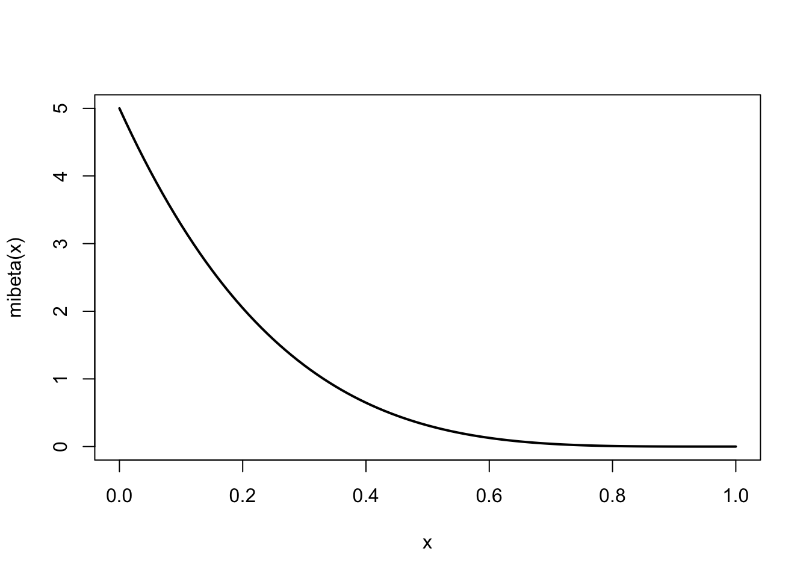

# (APPENDIX) Apéndices {-} 

# Símbolos, abreviaturas y acrónimos

## Acrónimos

Acrónimo      | Descripción
------------- | -------------
SPC           | Statistical Process Control


## Letras griegas

Letra         | Se lee
------------- | -------------
$\alpha$      | alfa
$\beta$       | beta
$\gamma$      | gamma
$\Gamma$      | Gamma$^*$
$\lambda$     | lambda
$\eta$        | eta
$\mu$         | mu
$\omega$      | omega
$\Omega$      | Omega$^*$
$\sigma$      | sigma
$\Sigma$      | Sigma$^*$
$\rho$        | ro
$\theta$      | zeta (_theta_, teta)
$\xi$         | xi
$\chi$        | chi (o _ji_)
$\pi$         | pi
$\varepsilon$ | épsilon

$^*$ Mayúsculas

## Símbolos

Símbolo                    | Se lee
---------------------------| -------------------------------
$\emptyset$                | Conjunto vacío o suceso imposible
$\aleph$                   | Aleph
$\wp$                      | Probabilidad (como función) 
$:$                        | Tal que
$P(\cdot)$                 | Probabilidad de · (sucesos)
$P[\cdot]$                 | Probabilidad de · (variables aleatorias)
$E[\cdot]$                 | Esperanza de ·
$\cdot$                    | _lo que sea_ (representa cualquier objeto matemático)
$|$                        | Condicionado a
$\sum$                     | Sumatorio
$\sum\limits_{i=1}^n$      | Sumatorio desde $i$ igual a uno hasta $n$
$\prod$                    | Producto
$\prod\limits_{i=1}^n$     | Producto desde $i$ igual a uno hasta $n$
$\forall$                  | Para todo
$\in$                      | Pertenece/perteneciente
$\exists$                  | Existe
$\implies$                 | Implica/entonces
$\partial$                 | Derivada parcial
$\simeq$                   | Aproximadamente igual^[En este libro se usa sobre todo para indicar que se ha redondeado un número decimal]
$\approx$                  | Aproximadamente^[En este libro se puede utilizar para tomar el entero superior o inferior según el contexto]
$\equiv$                   | Equivalente
$\mathbb{R}$               | Conjunto de los números reales
$\cup$                     | Unión
$\cap$                     | Intersección
$\subset$                  | Incluido
$\subseteq$                | Incluido o igual


# Tablas estadísticas {#tablas}

## Distribución normal


La siguiente tabla contiene la probabilidad de la cola superior de la distribución normal estándar $Z\sim N(0;1)$, 
es decir $1-F(z)=P[Z>z].$. 


|   z|   0.00|   0.01|   0.02|   0.03|   0.04|   0.05|   0.06|   0.07|   0.08|   0.09|
|---:|------:|------:|------:|------:|------:|------:|------:|------:|------:|------:|
| 0.0| 0.5000| 0.4960| 0.4920| 0.4880| 0.4840| 0.4801| 0.4761| 0.4721| 0.4681| 0.4641|
| 0.1| 0.4602| 0.4562| 0.4522| 0.4483| 0.4443| 0.4404| 0.4364| 0.4325| 0.4286| 0.4247|
| 0.2| 0.4207| 0.4168| 0.4129| 0.4090| 0.4052| 0.4013| 0.3974| 0.3936| 0.3897| 0.3859|
| 0.3| 0.3821| 0.3783| 0.3745| 0.3707| 0.3669| 0.3632| 0.3594| 0.3557| 0.3520| 0.3483|
| 0.4| 0.3446| 0.3409| 0.3372| 0.3336| 0.3300| 0.3264| 0.3228| 0.3192| 0.3156| 0.3121|
| 0.5| 0.3085| 0.3050| 0.3015| 0.2981| 0.2946| 0.2912| 0.2877| 0.2843| 0.2810| 0.2776|
| 0.6| 0.2743| 0.2709| 0.2676| 0.2643| 0.2611| 0.2578| 0.2546| 0.2514| 0.2483| 0.2451|
| 0.7| 0.2420| 0.2389| 0.2358| 0.2327| 0.2296| 0.2266| 0.2236| 0.2206| 0.2177| 0.2148|
| 0.8| 0.2119| 0.2090| 0.2061| 0.2033| 0.2005| 0.1977| 0.1949| 0.1922| 0.1894| 0.1867|
| 0.9| 0.1841| 0.1814| 0.1788| 0.1762| 0.1736| 0.1711| 0.1685| 0.1660| 0.1635| 0.1611|
| 1.0| 0.1587| 0.1562| 0.1539| 0.1515| 0.1492| 0.1469| 0.1446| 0.1423| 0.1401| 0.1379|
| 1.1| 0.1357| 0.1335| 0.1314| 0.1292| 0.1271| 0.1251| 0.1230| 0.1210| 0.1190| 0.1170|
| 1.2| 0.1151| 0.1131| 0.1112| 0.1093| 0.1075| 0.1056| 0.1038| 0.1020| 0.1003| 0.0985|
| 1.3| 0.0968| 0.0951| 0.0934| 0.0918| 0.0901| 0.0885| 0.0869| 0.0853| 0.0838| 0.0823|
| 1.4| 0.0808| 0.0793| 0.0778| 0.0764| 0.0749| 0.0735| 0.0721| 0.0708| 0.0694| 0.0681|
| 1.5| 0.0668| 0.0655| 0.0643| 0.0630| 0.0618| 0.0606| 0.0594| 0.0582| 0.0571| 0.0559|
| 1.6| 0.0548| 0.0537| 0.0526| 0.0516| 0.0505| 0.0495| 0.0485| 0.0475| 0.0465| 0.0455|
| 1.7| 0.0446| 0.0436| 0.0427| 0.0418| 0.0409| 0.0401| 0.0392| 0.0384| 0.0375| 0.0367|
| 1.8| 0.0359| 0.0351| 0.0344| 0.0336| 0.0329| 0.0322| 0.0314| 0.0307| 0.0301| 0.0294|
| 1.9| 0.0287| 0.0281| 0.0274| 0.0268| 0.0262| 0.0256| 0.0250| 0.0244| 0.0239| 0.0233|
| 2.0| 0.0228| 0.0222| 0.0217| 0.0212| 0.0207| 0.0202| 0.0197| 0.0192| 0.0188| 0.0183|
| 2.1| 0.0179| 0.0174| 0.0170| 0.0166| 0.0162| 0.0158| 0.0154| 0.0150| 0.0146| 0.0143|
| 2.2| 0.0139| 0.0136| 0.0132| 0.0129| 0.0125| 0.0122| 0.0119| 0.0116| 0.0113| 0.0110|
| 2.3| 0.0107| 0.0104| 0.0102| 0.0099| 0.0096| 0.0094| 0.0091| 0.0089| 0.0087| 0.0084|
| 2.4| 0.0082| 0.0080| 0.0078| 0.0075| 0.0073| 0.0071| 0.0069| 0.0068| 0.0066| 0.0064|
| 2.5| 0.0062| 0.0060| 0.0059| 0.0057| 0.0055| 0.0054| 0.0052| 0.0051| 0.0049| 0.0048|
| 2.6| 0.0047| 0.0045| 0.0044| 0.0043| 0.0041| 0.0040| 0.0039| 0.0038| 0.0037| 0.0036|
| 2.7| 0.0035| 0.0034| 0.0033| 0.0032| 0.0031| 0.0030| 0.0029| 0.0028| 0.0027| 0.0026|
| 2.8| 0.0026| 0.0025| 0.0024| 0.0023| 0.0023| 0.0022| 0.0021| 0.0021| 0.0020| 0.0019|
| 2.9| 0.0019| 0.0018| 0.0018| 0.0017| 0.0016| 0.0016| 0.0015| 0.0015| 0.0014| 0.0014|
| 3.0| 0.0013| 0.0013| 0.0013| 0.0012| 0.0012| 0.0011| 0.0011| 0.0011| 0.0010| 0.0010|
| 3.1| 0.0010| 0.0009| 0.0009| 0.0009| 0.0008| 0.0008| 0.0008| 0.0008| 0.0007| 0.0007|
| 3.2| 0.0007| 0.0007| 0.0006| 0.0006| 0.0006| 0.0006| 0.0006| 0.0005| 0.0005| 0.0005|
| 3.3| 0.0005| 0.0005| 0.0005| 0.0004| 0.0004| 0.0004| 0.0004| 0.0004| 0.0004| 0.0003|
| 3.4| 0.0003| 0.0003| 0.0003| 0.0003| 0.0003| 0.0003| 0.0003| 0.0003| 0.0003| 0.0002|
| 3.5| 0.0002| 0.0002| 0.0002| 0.0002| 0.0002| 0.0002| 0.0002| 0.0002| 0.0002| 0.0002|
| 3.6| 0.0002| 0.0002| 0.0001| 0.0001| 0.0001| 0.0001| 0.0001| 0.0001| 0.0001| 0.0001|
| 3.7| 0.0001| 0.0001| 0.0001| 0.0001| 0.0001| 0.0001| 0.0001| 0.0001| 0.0001| 0.0001|
| 3.8| 0.0001| 0.0001| 0.0001| 0.0001| 0.0001| 0.0001| 0.0001| 0.0001| 0.0001| 0.0001|
| 3.9| 0.0000| 0.0000| 0.0000| 0.0000| 0.0000| 0.0000| 0.0000| 0.0000| 0.0000| 0.0000|

## Resumen modelos de distribución de probabilidad


|Distribución                         |Probabilidad/Densidad/Distribución                                                                   |Esperanza |Varianza |
|:------------------------------------|:----------------------------------------------------------------------------------------------------|:---------|:--------|
|$\text{Bernoulli}\\ \mathit{Ber}(p)$ |$X = \begin{cases} 1 & \mbox{ con probabilidad } p \\ 0 & \mbox{ con probabilidad } 1-p \end{cases}$ |$p$       |$p(1-p)$ |


# Repaso

Este apéndice cubre algunas cuestiones matemáticas básicas que el lector
de este libro con seguridad habrá aprendido con anterioridad. Se incluyen
como referencia para facilitar el repaso a aquellos que lo necesiten.

## Logaritmos y exponenciales

## Combinatoria {#combinatoria}


Una de las definiciones de probabilidad implica **contar**
el número de veces que puede ocurrir un suceso determinado. Por tanto,
en muchas ocasiones el cálculo de probabilidades empieza contando las
posibilidades de que ocurra un suceso. La Combinatoria es la parte de la
Matemática discreta que nos ayuda en esta tarea. Incluimos un breve
resumen con ejemplos de las fórmulas más habituales y su cálculo con R.

### Ejemplo ilustrativo

Habitualmente se utilizan ejemplos de juegos de azar para introducir el
cálculo de probabilidades, como lanzamiendo de monedas y dados, o
combinaciones de cartas en barajas de naipes. Para darle un enfoque
práctico, utilizaremos a lo largo del módulo un ejemplo ilustrativo que,
aunque totalmente inventado, se puede encontrar el lector
en el futuro con ligeras variaciones según su ámbito de actuación.
Utilizaremos en lo posible las cifras usadas en los problemas de azar
para ver la utilidad de aquéllos ejemplos en casos más prácticos.

Datos básicos:

-   52 posibles usuarios de un servicio

-   La mitad son mujeres

-   4 directivos, 12 mandos, resto operarios

-   13 jóvenes, 26 adultos, 13 mayores (5, 18 y 3 mujeres en cada
    grupo respectivamente)

-   1 de cada seis hombres contratará el servicio (el doble si es mujer)


Nótese cómo podemos *traducir* el concepto de
servicio a cualquier ámbito: usuarios de salud o educación, enfermos de
una determinada patología, equipos de una infraestructura, etc. Asimismo
las categorías pueden ser cualesquiera aplicables a los elementos de los
conjuntos. 

### Principio básico de conteo

**Definición**: Realizamos $k$ experimentos sucesivamente, cada
uno de ellos con $n_i$ posibles resultados ($i=1, \ldots, k$). Entonces
el número total de resultados posibles es:

$$n_1\cdot n_2, \cdot \ldots \cdot n_k$$

**Ejemplo**: Resultados posibles si tomamos al azar un individuo
y observamos su grupo de edad y si contratará o no el servicio.

**Código**


```r
3*2
#> [1] 6
```

### Permutaciones

**Definición**: De cuántas formas posibles podemos ordenar un
conjunto de $n$ elementos sin repetirlos.

$$P_n = n! = n\cdot(n-1)\cdot(n-2)\cdot\ldots\cdot 2\cdot 1$$

**Ejemplo**: De cuántas formas podemos ordenar un conjunto de
tres individuos, uno de cada categoría laboral.

**Código**


```r
factorial(3)
#> [1] 6
```


### Variaciones (muestreo sin reemplazamiento)

**Definición**: De cuántas formas posibles podemos seleccionar
una muestra de $n$ elementos de un conjunto total de $m$, sin que se
repitan. Una ordenación distinta, es una posibilidad distinta.

$$V_{m,n} = m\cdot(m-1)\cdot(m-2)\cdot\ldots\cdot (m-n+1) = \frac{m!}{(m-n)!}$$

**Ejemplo**: De cuántas formas podemos seleccionar una muestra
de 5 individuos en nuestro conjunto de 52 sin que se repitan (por
ejemplo para asignar un ranking)

**Código**


```r
factorial(52)/factorial(52-5)
#> [1] 311875200
```

### Variaciones con repetición (muestreo con reemplazamiento)

**Definición**: De cuántas formas posibles podemos seleccionar
una muestra de $n$ elementos de un conjunto total de $m$, pudiéndose
repetir. Una ordenación distinta, es una posibilidad distinta.
$$\mathit{VR}_{m,n} = m^n$$

**Ejemplo**: De cuántas formas podemos seleccionar una muestra
de 5 individuos en nuestro conjunto de 52 pudiéndose repetir (por
ejemplo para asignar premios consecutivamente)

**Código**


```r
52^5
#> [1] 380204032
```

### Combinaciones (muestras equivalentes)

**Definición**: De cuántas formas posibles podemos seleccionar
una muestra de $n$ elementos de un conjunto total de $m$, sin importar
el orden. 

$$\mathit{C}_{m,n} = \binom{m}{n} = \frac{m!}{n!(m-n)!}$$

$\binom{m}{n}$ se lee _m sobre n_, y se le conoce como _número combinatorio_.
Algunas propiedades importantes de los números combinatorios:

$$\binom{m}{m} = \binom{m}{0} = 1.$$
$$\binom{m}{1} = \binom{m}{m-1} = m.$$
$$\binom{m}{n} + \binom{m}{n+1} = \binom{m+1}{n+1}$$ 
Por otra parte, por convenio se tiene que:

$$0!=1,$$

$$\text{si } a <b \implies \binom{a}{b} = 0.$$


**Ejemplo**: De cuántas formas podemos seleccionar una muestra
de 5 individuos en nuestro conjunto de 52 sin importar el orden (por
ejemplo para asignar premios de una sola vez)

**Código**


```r
choose(52, 5)
#> [1] 2598960
```

### Combinaciones y permutaciones con repetición

Las combinaciones y
permutaciones también se pueden dar con repetición, siendo las fórmulas
para calcularlas las siguientes: 

$$\mathit{CR}_{m,n}= \mathit{C}_{m+n-1,n}= \frac{(m+n-1)!}{n!\cdot(m-1)!}$$
$$\mathit{PR} = \frac{n!}{a!\cdot b!\cdot \ldots\cdot z!}$$

La primera situación es aquella en la que los
elementos se pueden repetir, pero no nos importa el orden en que lo
hagan. La segunda aparece cuando el elemento A del conjunto total de
elementos aparece $a$ veces, y así sucesivamente.

# Ampliación

En este apéndice se incluyen temas avanzados que pueden ser útiles al lector
más allá de un curso básico de estadística para ciencias o ingeniería, y 
que no se han incluido en el cuerpo de los capítulos para mantener el nivel 
de una asignatura de grado.

## Función característica

## Cambio de variable

## Variables aleatorias unidimensionales mixtas

## Variables aleatorias bidimensionales mixtas

## Algunos modelos de distribución continuos más


### Distribución Beta

La distribución Beta se utiliza en problemas de inferencia relativos a proporciones, especialmente en inferencia bayesiana.

$$X \sim \mathit{Be}(\alpha, \beta)$$

**Función de densidad**

$$f(x) = 
\begin{cases}
\frac{\Gamma(\alpha + \beta)}{\Gamma(\alpha)\Gamma(\beta)}x^{\alpha-1}(1-x)^{\beta -1} & \text{si } 0 < x < 1\\
0 & \text{resto } 
\end{cases}$$

En matemáticas, la función Gamma ($\Gamma$) es una integral indefinida que tiene entre otras las siguientes propiedades:

* $\Gamma(\alpha) = \int_0^\infty x^{\alpha -1} e^{-x} dx, \qquad \alpha > 0 $
* $\Gamma(\alpha + 1) = \alpha \Gamma(\alpha)$
* $n \in \mathbb{N}-\{0\} \implies \Gamma(n) = (n-1)!$
* $\Gamma(\frac{1}{2}) = \sqrt{\pi}$
 

** Características**

* Esperanza: $E[X] = \frac{\alpha}{\alpha + \beta}$
* Varianza: $\mathit{Var}[X] = \frac{\alpha\beta}{(\alpha + \beta)^2(\alpha + \beta+1)}$
* Caso particular: $\mathit{Be}(1,1) = U(0,1)$.

**Ejemplo**

$X$: Proporción de clientes que contratarán el servicio

$X\sim \mathit{Be}(1, 5)$


**Código**


```r
mibeta <- function(x) dbeta(x, 1, 5)
curve(mibeta, lwd = 2)
```


### Distribución Gamma

La distribución Gamma se utiliza, entre otros, para modelizar tiempos de espera hasta que suceden $\alpha$ eventos en un proceso de Poisson. De hecho, en inferencia bayesiana gamma es la distribución a priori de la distribución de Poisson.

$$X \sim \mathit{Ga}(a, b)$$

**Función de densidad**

$$f(x) =
\begin{cases}
\frac{b^a}{\Gamma(a)}x^{a-1}{e}^{-bx} & \text{si } 0 < x < \infty\\
0 & \text{resto }
\end{cases}$$


**Características**

* Esperanza: $E[X] = \frac{a}{b}$
* Varianza: $\mathit{Var}[X] = \frac{a}{b^2}$
* $\Gamma(\alpha) = \int_0^\infty x^{\alpha -1} e^{-x} dx $
* La exponencial es un caso particular

**Código**


```r


migamma <- function(x, a) dgamma(x, a, 2)
curve(migamma(x, 1), lwd = 2, xlim = c(0,10), 
      main = "Distribución Gamma b = 2")
curve(migamma(x, 2), lwd = 2, add = TRUE, lty = 2)
curve(migamma(x, 4), lwd = 2, add = TRUE, lty = 3)
legend(x = 6, y = 2, c("a = 1", "a = 2", "a = 4"), lty = 1:3)
```



### Distribución de Weibull

La distribución Gamma presenta algunos inconventientes al modelizar tiempos de vida, y por eso algunas veces se prefiere la distribución de Weibull, que básicamente sirve para lo mismo. Véase \cite{ugarte2015} para los detalles.

$$X \sim \mathit{We}(a, b) $$

**Función de densidad**
$$f(x) =
\begin{cases}
\frac{a}{b}\left (\frac{x}{b} \right)^{a-1}e^{-(x/b)^a} & \text{si } x > 0\\
0 & \text{resto }
\end{cases}$$

**Características**

* Esperanza: $E[X] =b \Gamma\left (1 + \frac{1}{a} \right )$
* Varianza: $\mathit{Var}[X] = b^2 \left ( \Gamma \left ( 
                                      1 + \frac{2}{a} \right 
                                      ) 
                             - \left ( \Gamma \left (1 + \frac{2}{a} \right ) \right )^2 \right )$
 

**Código**


```r
miweibull <- function(x, a) dweibull(x, a, 2)
curve(miweibull(x, 1), lwd = 2, xlim = c(0,5), 
      ylim = c(0, 1),
      main = "Distribución Weibull b = 2")
curve(miweibull(x, 2), lwd = 2, add = TRUE, lty = 2)
curve(miweibull(x, 5), lwd = 2, add = TRUE, lty = 3)
legend(x = 4, y = 1, c("a = 1", "a = 2", "a = 5"), lty = 1:3)
```


## Modelos de distribución de probabilidad multivariantes

## Modelos de distribución de probabilidad relacionadas con la normal

## Simulación de variables aleatorias

$U(0;\; 1)$: Generador de probabilidades aleatorias. Dada cualquier función de distribución $F$, se pueden generar valores de esa VA obteniendo $F^{-1}(U(0;\; 1))$


# Demostraciones 

Em este apéndice se incluyen aquellas demostraciones de teoremas y propiedades
no incluidas en los capítulos para mantener el carácter práctico del mismo.

## Variable aleatoria discreta

### Función de probabilidad

### Esperanza

### Varianza


# Créditos {#creditos}

Los gráficos y diagramas generados son creación y propiedad del autor, salvo que se
indique lo contrario. Su licencia de uso es la misma que la del resto de la
obra, véase el Prefacio.

La [imagen de la portada](https://pixabay.com/es/illustrations/fondo-abstracto-l%C3%ADnea-ilustración-2462436/) es de dominio público, obtenida en [pixabay.com](https://pixabay.com/es/), gracias al
usuario [Manuchi](https://pixabay.com/es/users/manuchi-1728328/).


Las imágenes de tipo _clipart_ usadas en esta obra y las fotografías no atribuidas
pertenecen al dominio público gracias a [openclipart.org](http://www.openclipart.org), [unplash.com](https://unsplash.com) o [pixabay.com](https://pixabay.com/es/).

The [R logo](https://www.r-project.org/logo/) is (c) 2016 The R Foundation.
