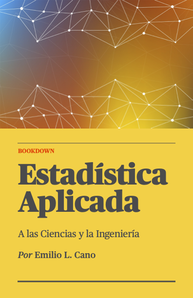

--- 
title: "Estadística Aplicada a las Ciencias y la Ingeniería"
author: "Emilio L. Cano"
date: "`r Sys.Date()`"
site: bookdown::bookdown_site
documentclass: book
bibliography: [book.bib, packages.bib, iso.bib]
url: https://emilopezcano.github.io/estadistica-ciencias-ingenieria/
cover-image: 'images/cover.png'
description: |
  Libro para asignaturas de Estadística en grados de Ciencias e Ingeniería.
  Puede ser útil también para asignaturas de Estadística en otros grados como
  Economía o ADE. Contiene una visión muy particular del autor.
biblio-style: apalike
csl: chicago-fullnote-bibliography.csl
---

```{r, include = FALSE}
library(fontawesome)
```

# Bienvenida {-}



Bienvenido/a a  "Estadística Aplicada a las Ciencias y la Ingeniería" por [Emilio L. Cano](https://lcano.com).

Este libro incluye los contenidos habitualmente presentes en el currículo 
de asignaturas de **Estadística** de los grados Ciencias e Ingenierías de universidades españolas. Aunque no aparezca en el título, el manual incluye también los contenidos de **Probabilidad** necesarios.
Si bien existe abundante material bibliográfico
que cubre los contenidos de estas asignaturas, quería elaborar un material
propio que no fuera solamente para mis clases sino algo más
_global_. En los últimos años ya lo hice para asignaturas de grado y Máster en ADE [@libroeee;@libroadr]. Por otra parte, me motiva cubrir el hueco de los materiales
de acceso gratuito con la opción de comprar una edición 
impresa^[A la espera de encontrar editorial.] y con el enfoque
que se menciona en el siguiente apartado. Por otra parte, los libros publicados
originalmente en inglés y traducidos al español a menudo me resultan lejanos 
a nuestro idioma (por muy buenas que sean las traducciones, los ejemplos en _acres_
no son muy intuitivos para un lector español). Espero que también sirva para
lectores de otros países de habla hispana.

## Estándares y software {-}

Los contenidos de este libro se basan en dos paradigmas que están presentes
en los intereses de investigación y docencia del autor: los **estándares** y
el **software libre**. En lo que se refiere a estándares, la notación utilizada,
definiciones y fórmulas se ajustarán el máximo posible a la utilizada en normas
nacionales e internacionales sobre metodología estadística. Estas normas se
citarán pertinentemente a lo largo del texto. En cuanto al software libre,
se proporcionarán instrucciones para resolver los ejemplos 
que ilustran la teoría utilizando software libre. 
No obstante, el uso del software es
auxiliar al texto y se puede seguir sin necesidad de utilizar
los programas. Según lo que proceda en cada caso, se utilizará 
software de hoja de cálculo, el software estadístico y lenguaje de 
programación 
**R** [@R-base],
y el software de álgebra computacional **Máxima**^[http://maxima.sourceforge.net/es/].
Respecto al software de hoja de cálculo, las fórmulas utilizadas se han probado
en el software libre **LibreOffice**^[https://es.libreoffice.org], en **Hojas de Cálculo de Google**^[https://www.google.es/intl/es/sheets/about/] y
también en **Microsoft EXCEL**^[https://products.office.com/es-es/excel] que, 
aunque no es software libre, su uso
está más que generalizado y normalmente los estudiantes disponen de licencia de uso
a través de su universidad. En caso de que el nombre de la función sea distinta 
en EXCEL, se indicará en el propio ejemplo.

Las normas son clave para el desarrollo económico de un país. Estudios en diversos países, 
incluido España, han demostrado que la aportación de la normalización a su economía es del 1% del PIB^[http://www.aenor.es/DescargasWeb/normas/como-beneficia-es.pdf]. La
Asociación Española de Normalización (UNE) es el organismo legalmente
responsable del desarrollo y difusión de las normas técnicas en España.
Además, representa a España en los organismos internacionales de normalización como
[ISO](https://www.iso.org/)^[https://www.iso.org/] y [CEN](https://www.cen.eu/)^[https://www.cen.eu/].

Las normas sobre estadística que surgen de ISO las elabora el _Technical Committee_
ISO TC 69^[https://www.iso.org/committee/49742/x/catalogue/] _Statistical Methods_. 
Por su parte, el subcomité técnico de normalización
CTN 66/SC 3^[https://www.une.org/encuentra-tu-norma/comites-tecnicos-de-normalizacion/comite/?c=CTN%2066/SC%203], Métodos Estadísticos,
participa como miembro nacional en ese comité ISO.
Las normas que son de interés en España, se ratifican en inglés o se traducen
al español como normas UNE. Para una descripción más completa de la elaboración
de normas, véase @cano2015qcr.

## Estructura del libro {-}

Este libro se ha elaborado utilizando el lenguaje _Markdown_ con el propio 
software **R** y el paquete **bookdown** [@R-bookdown]. 
Se incluyen una gran cantidad de ejemplos resueltos tanto de forma analítica
como mediante software. En algunos casos se proporciona el uso de funciones 
en hojas de cálculo (y el resultado obtenido con un recuadro). 
En otros, código de R, que aparecen en el texto
sombreados y con la sintaxis coloreada, como el fragmento a continuación
donde se puede comprobar la sesión de R en la que ha sido generado este material.
Obsérvese que los resultados se muestran precedidos de los símbolos
`#>`.

```{r}
sessionInfo()
```

Normalmente, la descripción o enunciado de los ejemplos se incluyen en bloques 
con el siguiente aspecto:

::: {.rmdejemplo data-latex=""}

Esto es un ejemplo. A continuación puede mostrarse código o no. Los ejemplos
pueden ir precedidos por un icono para identificar su campo de aplicación, por 
ejemplo `r fa("bacterium", fill = "purple")` Biología, `r fa("cheese", fill = "gold")` Ciencia y tecnología de Alimentos, o `r fa("tree", fill = "green")` Ciencia e Ingeniería Ambiental.  

:::

Cuando el ejemplo incluya explicaciones sobre cómo resolverlo con software, 
estas explicaciones aparecerán en bloques con el siguiente aspecto:

::: {.rmdpractica data-latex=""}

**HOJA DE CÁLCULO**

La función `FACT` obtiene el factorial de un número x ($x!$):
  
`=FACT(5)`
$\boxed{\mathsf{120}}$

:::

También se incluirán con el formato anterior indicaciones para usar la calculadora 
científica, cuando esto sea posible. 

El texto incluye otros bloques con información de distinto tipo, como los siguientes:

::: {.rmdpremium data-latex=""}
Este contenido se considera avanzado. El lector principiante puede saltarse estos apartados
y volver sobre ellos en una segunda lectura.
:::

::: {.rmdcafe data-latex=""}
Estos bloques están pensados para incluir información curiosa o complementaria
para poner en contexto las explicaciones.
:::

Este volumen cubre los contenidos de asignaturas básicas de Estadística en un 
amplio rango de grados. Puede servir también como repaso
para alumnos de posgrado o incluso egresados que necesiten refrescar
conocimientos o aprender a aplicarlos con software moderno. Un segundo volumen cubrirá en el futuro métodos y modelos avanzados para 
entornos más exigentes.

El libro está dividido en 4 partes. La primera parte está dedicada a la Estadística
Descriptiva, y consta de un [capítulo introductorio](#intro) seguido de sendos capítulos
para el análisis exploratorio univariante y bivariante. La segunda parte 
trata la Probabilidad en 4 capítulos, uno introductorio, dos dedicados a las 
variables
aleatorias univariantes y bivariantes respectivamente, y finalmente un capítulo
que trata los modelos de distribución de probabilidad. En la tercera parte se
aborda la inferencia estadística, con una introducción al muestreo y la 
estimación puntual, seguida de capítulos dedicados a los contrastes de 
comparación de grupos, análisis de regresión y diseño de experimentos. La última
parte está dedicada al control estadístico de la calidad, en la que,
tras un capítulo introductorio, se tratan las dos herramientas más importantes
en este campo: el control estadístico de procesos (SPC, _Statistical Process 
Control_, por sus siglas en inglés) y los muestreos de aceptación o, dicho de
otra forma, la inspección por muestreo. Finalmente, una serie de apéndices
con diverso material complementan el libro en su conjunto.


## Sobre el autor {-}

Emilio López Cano, Estadístico y entusiasta de R. Actualmente soy Titular de Universidad en la [Escuela Técnica Superior de Ingeniería Informática](https://www.urjc.es/etsii) e investigador en el [Data Science Laboratory](http://www.datasciencelab.es) de la [Universidad Rey Juan Carlos](https://www.urjc.es), que forma parte del [Centro de Investigación para las Tecnologías Inteligentes de la Información](https://www.cetinia.es) y sus Aplicaciones (CETINIA)
de la Universidad Rey Juan Carlos . Mis intereses de investigación incluyen Estadística Aplicada, Aprendizaje Estadístico y Metodologías para la Calidad. Previamente he sido profesor e investigador en la [Universidad de Castilla-La Mancha](https://www.uclm.es), donde sigo colaborando en docencia e investigación, y Estadístico en empresas del sector privado de diversos sectores.

Presidente del subcomité técnico de normalización UNE ([miembro de ISO](https://www.iso.org/committee/49742/x/catalogue/)) [CTN 66/SC 3 (Métodos Estadísticos)](https://www.une.org/encuentra-tu-norma/comites-tecnicos-de-normalizacion/comite/?c=CTN%2066/SC%203). Profesor en la Asociación Española para la Calidad ([AEC](https://www.aec.es)). Presidente de la asociación [Comunidad R Hispano](http://r-es.org).

Más sobre mí, información actualizada y publicaciones: https://lcano.com.  
Contacto: emilio@lcano.com

El material se proporciona bajo licencia CC-BY-NC-ND.
Todos los logotipos y marcas comerciales que puedan aparecer en este texto
son propiedad de sus respectivos dueños y se incluyen en este texto únicamente 
con fines formativos. Se ha puesto especial cuidado en la adecuada atribución 
del material no elaborado por el autor, véase el Apéndice \@ref(creditos). 
Aún así, si detecta algún uso 
indebido de material protegido póngase en contacto con el autor y será retirado.
Igualmente, contacte con el autor **si desea utilizar este material con fines 
comerciales**.


```{r, echo=FALSE}
if (knitr::is_latex_output()){
knitr::include_graphics("images/by-nc-nd.png")
}
```


<a rel="license" href="http://creativecommons.org/licenses/by-nc-nd/4.0/"></a><br />Este obra está bajo una <a rel="license" href="http://creativecommons.org/licenses/by-nc-nd/4.0/">licencia de Creative Commons Reconocimiento-NoComercial-SinObraDerivada 4.0 Internacional</a>.

## Agradecimientos {-}

Este libro es el resultado de años de trabajo en la docencia, investigación
y transferencia de conocimiento en el campo de la Estadística. Está construido
a partir de las contribuciones a lo largo de los años de compañeros y amigos
como Javier M. Moguerza, Andrés Redchuk, David Ríos, Felipe Ortega, Mariano Prieto, 
Miguel Ángel Tarancón, Víctor M. Casero, Virgilio Gómez-Rubio, Matías Gámez, y 
muchos otros (perdón
a l@s omitid@s por no ser más exhaustivo).

Especial agradecimiento a toda la comunidad del [software libre y 
lenguaje de programación R](https://www.r-project.org), y en particular al _R Core Team_, al equipo
de [Posit (antes RStudio)](https://www.rstudio.com) y a los amigos de [R Hispano](http://r-es.org).


```{r include=FALSE}
# automatically create a bib database for R packages
knitr::write_bib(c(
  .packages(), 
  'base',
  'car',
  'bookdown', 'knitr', 'rmarkdown',
  'ggfortify', 'pgirmess'
), 'packages.bib')
```
